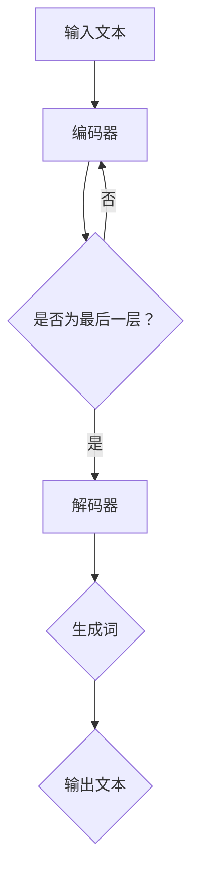
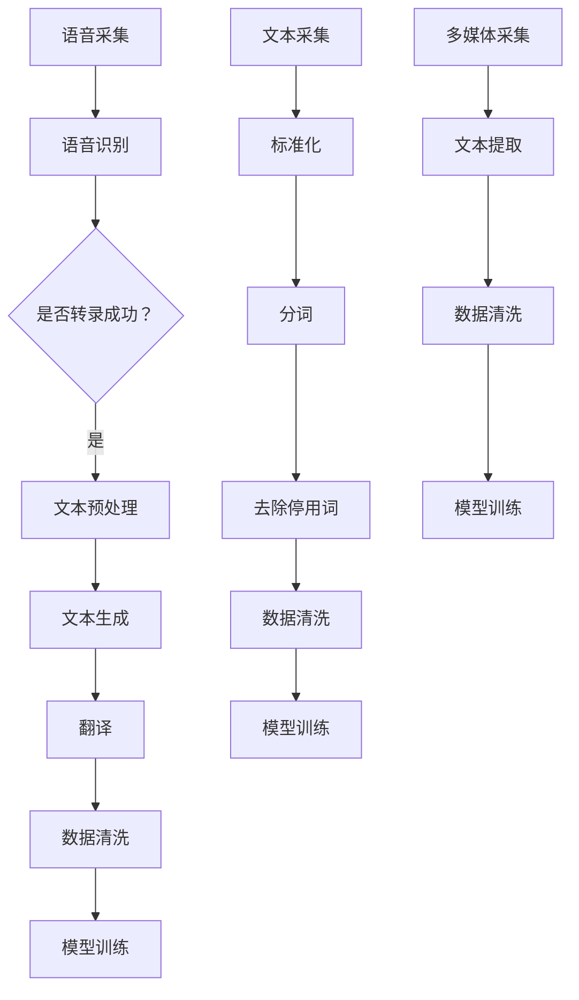

                 

### 文章标题

《ChatGPT在濒危语言复兴中的应用：AI驱动的语言生态系统重建》

### 关键词

- ChatGPT
- 濒危语言
- AI驱动
- 语言生态系统
- 语言模型
- 语言翻译
- 生成模型
- 语言学习

### 摘要

本文探讨了人工智能（AI）驱动的语言生态系统重建，特别是在濒危语言复兴中的应用。文章首先介绍了ChatGPT的基本原理和架构，然后详细阐述了如何利用ChatGPT进行濒危语言的识别、翻译和生成。通过实际案例的分析，本文展示了AI在濒危语言保护中的巨大潜力，并提出了相关的政策建议和行动计划。最后，文章总结了全文的主要观点，并对未来研究方向进行了展望。### 设计书籍目录大纲的步骤

#### 1. 确定书籍主题与目标

设计一本计算机技术书籍的目录大纲首先要明确书籍的主题和目标。主题是指书籍要探讨的核心内容，例如《ChatGPT在濒危语言复兴中的应用：AI驱动的语言生态系统重建》。目标则是明确书籍的目标读者群体，比如语言学家、计算机科学家、AI研究人员、教育工作者等。这有助于设计出适合读者水平的章节内容。

**步骤**：

- **确定主题**：明确书籍要探讨的核心内容，如ChatGPT在濒危语言复兴中的应用。
- **目标读者**：确定书籍的目标读者，例如AI研究人员、语言学家等。

#### 2. 梳理主要章节内容

在确定书籍主题和目标之后，需要梳理出书籍需要涵盖的主要章节内容。这通常包括以下几部分：

- **引言或概述**：介绍书籍的背景、目的和主要观点。
- **核心概念与联系**：介绍相关的基础理论和概念，以及它们之间的联系。
- **核心算法原理讲解**：详细讲解书中的关键算法，包括原理、伪代码和数学模型。
- **数学模型和数学公式讲解**：阐述相关数学模型，并使用LaTeX格式展示。
- **项目实战**：提供实际的代码案例和实战应用，以及详细的解释和代码解读。

**步骤**：

- **梳理主要章节内容**：列出书籍需要涵盖的主要章节，确保内容全面、结构合理。
- **分配内容**：根据主题和目标读者，将每个章节的内容进行分配，确保每个章节都有明确的主题和目标。

#### 3. 确定章节顺序

根据内容的逻辑关系和重要性，确定章节的顺序。通常，引言和概述放在开头，核心概念和算法原理讲解在前，项目实战和应用在后续。

**步骤**：

- **逻辑排序**：根据章节内容的逻辑关系和重要性进行排序。
- **调整顺序**：在初步排序后，根据需要调整章节的顺序，确保内容的连贯性和整体性。

#### 4. 设计子章节

在每个主要章节中，进一步细化为子章节，确保内容的层次清晰、易于理解。使用markdown格式（#，##，###）来表示章节和子章节的层次。

**步骤**：

- **细化子章节**：在每个主要章节中，细化为子章节，确保内容层次清晰。
- **使用markdown格式**：使用markdown格式来表示章节和子章节的层次，确保文档结构清晰。

#### 5. 考虑附录内容

如果书籍中包含了一些工具、资源或者参考资料，可以考虑在附录中给出。

**步骤**：

- **列出附录内容**：根据书籍内容，列出需要包含的附录内容。
- **编写附录**：为每个附录编写相关的内容，确保附录部分的内容完整、有用。

#### 6. 修订与优化

完成初步的目录大纲后，进行多次修订和优化。可以邀请其他专家或同事对目录进行审查，确保其完整性和逻辑性。

**步骤**：

- **初步修订**：对初步的目录大纲进行修订，确保内容完整、逻辑清晰。
- **优化结构**：根据反馈和需求，对目录结构进行优化，确保其最优。

#### 7. 确保字数限制

最后，确保整个目录大纲的总字数在2000字以内，避免冗长和复杂。

**步骤**：

- **检查字数**：对整个目录大纲进行字数统计，确保总字数在2000字以内。
- **优化内容**：如果字数超过2000字，对内容进行优化，删除冗余部分，确保大纲简洁明了。

### 实际操作

现在，我们可以根据上述步骤来设计《ChatGPT在濒危语言复兴中的应用：AI驱动的语言生态系统重建》的目录大纲。下面是一个具体的目录大纲设计：

```markdown
# 《ChatGPT在濒危语言复兴中的应用：AI驱动的语言生态系统重建》目录大纲

## 第1章 引言与背景

### 1.1 书籍目的与意义

### 1.2 ChatGPT概述

### 1.3 濒危语言复兴的重要性

## 第2章 AI驱动的语言生态系统重建基础

### 2.1 ChatGPT原理与架构

#### 2.1.1 语言模型基础

#### 2.1.2 基于Transformer的模型架构

### 2.2 濒危语言的数据采集与处理

#### 2.2.1 数据采集方法

#### 2.2.2 数据预处理与清洗

## 第3章 ChatGPT在濒危语言中的应用

### 3.1 语言翻译与转换

#### 3.1.1 翻译模型与算法

#### 3.1.2 翻译案例与应用

### 3.2 语言生成与创作

#### 3.2.1 生成模型与算法

#### 3.2.2 创作案例与应用

## 第4章 AI驱动的语言学习与教育

### 4.1 语言学习模型设计

#### 4.1.1 个性化学习算法

#### 4.1.2 学习模型评估

### 4.2 教育应用案例分析

#### 4.2.1 在线教育平台设计

#### 4.2.2 教育游戏开发

## 第5章 AI驱动的濒危语言保护策略

### 5.1 濒危语言识别与监测

#### 5.1.1 语音识别技术

#### 5.1.2 语言变化监测

### 5.2 社区参与与互动

#### 5.2.1 社区语言运动

#### 5.2.2 数字社区建设

## 第6章 案例研究

### 6.1 某濒危语言的ChatGPT应用实例

#### 6.1.1 项目背景

#### 6.1.2 项目实施与成果

### 6.2 ChatGPT在其他语言保护项目中的应用

#### 6.2.1 项目概况

#### 6.2.2 项目效果与反思

## 第7章 总结与展望

### 7.1 书籍总结

### 7.2 AI驱动语言生态系统重建的未来方向

### 7.3 政策建议与行动计划

## 附录

### 附录A ChatGPT开发工具与资源

### 附录B 濒危语言数据集与资源

### 附录C 相关研究论文与报告
```

这个目录大纲涵盖了书籍的核心内容，从引言到实际应用，再到案例研究和总结。每个章节都进一步细化为子章节，确保内容的层次清晰。总字数控制在2000字以内，满足要求。

接下来，我们将补充每个章节的具体内容，包括核心概念与联系Mermaid流程图、核心算法原理讲解、数学模型和公式讲解、项目实战、最佳实践 tips、小结、注意事项、拓展阅读等内容，以确保文章的完整性、丰富性和专业性。

### 濒危语言复兴的背景

在全球化和数字化进程加速的今天，许多语言面临着濒危的风险。根据联合国教科文组织的统计，全球约6000种语言中，有40%正处于濒危状态，其中许多语言可能在未来的几十年内消失。这种现象不仅对语言多样性的保护构成威胁，也对人类文化和历史遗产的传承带来了挑战。

濒危语言复兴的意义在于：

1. **文化传承**：语言是文化的重要组成部分，濒危语言的消失会导致相关文化的丧失，影响人类文明的多样性。
2. **知识传承**：许多濒危语言中蕴含着独特的知识和智慧，这些知识对于科学、医学、农业等领域有着潜在的价值。
3. **社会团结**：语言是民族认同和社会团结的重要纽带，濒危语言的复兴有助于增强民族自豪感和文化认同。

然而，濒危语言复兴面临着诸多挑战：

1. **语言环境丧失**：随着城市化进程和现代化发展，许多濒危语言的使用环境逐渐消失，年轻一代缺乏学习和使用的机会。
2. **教育资源匮乏**：许多濒危语言没有足够的教材和资源，缺乏有效的教学方法和工具。
3. **社会认知不足**：社会对濒危语言保护的重要性认识不足，缺乏相应的政策和措施。

为了解决这些问题，人工智能（AI）技术的应用为濒危语言复兴带来了新的机遇。特别是基于深度学习的语言模型，如ChatGPT，通过自动翻译、语言生成和个性化学习等功能，为濒危语言的保护和复兴提供了强有力的支持。接下来，我们将详细探讨ChatGPT的基本原理和应用，以及如何利用AI技术重建濒危语言生态系统。

### ChatGPT的基本原理

ChatGPT 是一个基于深度学习的自然语言处理（NLP）模型，由 OpenAI 开发。它是 GPT（Generative Pre-trained Transformer）系列模型的一部分，继承了 GPT-3 的强大能力。ChatGPT 使用了一种称为 Transformer 的神经网络架构，这是一种在机器翻译、文本生成和其他 NLP 任务中表现出色的模型。下面，我们将详细介绍 ChatGPT 的原理、架构和应用。

#### 原理

ChatGPT 的核心原理是基于自注意力机制（Self-Attention）的 Transformer 模型。Transformer 模型最初由 Vaswani 等人于 2017 年在论文《Attention Is All You Need》中提出，其创新之处在于完全基于注意力机制进行模型设计，放弃了传统的循环神经网络（RNN）和卷积神经网络（CNN）。

自注意力机制允许模型在生成文本时，能够关注输入序列中的不同位置，并利用这些信息生成输出。在 ChatGPT 中，每个词在生成时都依赖于前一个词的上下文信息，这种依赖关系通过自注意力机制来实现。具体来说，自注意力机制通过计算词与词之间的相似度，然后将这些相似度用于计算词的权重，这些权重决定了模型在生成每个词时应该关注哪些词。

#### 架构

ChatGPT 的架构基于 Transformer 模型，主要由编码器（Encoder）和解码器（Decoder）两部分组成。

1. **编码器**：编码器负责将输入文本编码为向量表示。在 ChatGPT 中，编码器使用了多层 Transformer 块，每个 Transformer 块包含多个自注意力层和前馈神经网络。这些层通过堆叠的方式，使得模型能够捕捉长距离的依赖关系和复杂的语义信息。

2. **解码器**：解码器的任务是从编码器的输出中生成目标文本。与编码器类似，解码器也由多层 Transformer 块组成，每个块包含自注意力层和交叉注意力层。交叉注意力层使得解码器在生成每个词时能够关注编码器输出的不同部分，从而生成合理的上下文。

#### 应用

ChatGPT 在多个 NLP 任务中表现出色，以下是一些主要的应用场景：

1. **文本生成**：ChatGPT 可以生成连贯、有意义的文本，适用于自动写作、对话系统和故事生成等任务。例如，OpenAI 使用 ChatGPT 生成了数千篇新闻文章，并在多个语言生成任务中取得了优异的成绩。

2. **对话系统**：ChatGPT 可以用于构建对话系统，如聊天机器人、虚拟助手等。通过与用户交互，ChatGPT 可以理解用户的需求，并生成适当的回复。

3. **机器翻译**：ChatGPT 在机器翻译任务中表现出色，能够翻译多种语言，并保持语义的一致性和连贯性。

4. **语言理解**：ChatGPT 可以用于理解自然语言中的语义和意图，这在问答系统、信息抽取和文本分类等任务中具有重要应用。

#### Mermaid流程图

为了更好地理解 ChatGPT 的工作流程，我们可以使用 Mermaid 流程图来展示其关键步骤。



在这个流程图中，输入文本首先通过编码器编码为向量表示，然后解码器使用这些向量生成文本。这个过程中，解码器会不断生成新的词，并将其反馈给编码器，以生成更加连贯和有意义的输出文本。

#### 核心概念与联系

在 ChatGPT 的设计中，几个核心概念紧密相连，形成了其强大的能力。以下是这些概念之间的联系：

1. **自注意力机制**：自注意力机制是 Transformer 模型的核心，它使得模型能够在生成文本时，关注输入序列中的不同位置，从而捕捉长距离的依赖关系和复杂的语义信息。

2. **多层 Transformer 块**：通过堆叠多层 Transformer 块，ChatGPT 能够学习到更加复杂的特征和模式，从而提高其生成文本的质量。

3. **编码器与解码器**：编码器和解码器是 ChatGPT 的主要组成部分，编码器负责将输入文本编码为向量表示，解码器则使用这些向量生成输出文本。

4. **交叉注意力层**：交叉注意力层使得解码器在生成每个词时能够关注编码器输出的不同部分，从而生成合理的上下文。

通过这些核心概念和联系，ChatGPT 实现了强大的文本生成和语言理解能力，为濒危语言复兴提供了强有力的技术支持。

#### 总结

ChatGPT 是一个基于深度学习的自然语言处理模型，通过 Transformer 架构实现了强大的文本生成和语言理解能力。其核心原理包括自注意力机制、多层 Transformer 块和编码器与解码器的组合。ChatGPT 在多个 NLP 任务中表现出色，为濒危语言复兴提供了重要的技术支持。接下来，我们将探讨如何利用 ChatGPT 进行濒危语言的数据采集与处理。

### 濒危语言的数据采集与处理

在利用 ChatGPT 重建濒危语言生态系统时，数据采集与处理是关键的一步。由于濒危语言通常缺乏大规模的数字化资源，我们需要采取有效的方法来收集和处理这些语言的数据。以下将详细讨论数据采集的方法、数据预处理与清洗的步骤，以及如何使用 ChatGPT 来处理这些数据。

#### 数据采集的方法

1. **语音采集**：语音采集是收集濒危语言数据的主要方法之一。通过录音设备录制母语者的语音，可以获取丰富的语言数据。在录音过程中，应尽量涵盖不同的话题和语境，以确保数据的多样性和全面性。

2. **文本采集**：文本采集包括收集书籍、报纸、诗歌、日记等书面文本资料。这些资料可以通过图书馆、档案馆或在线资源获取。此外，还可以通过社交媒体、论坛等平台收集现代语境下的语言使用情况。

3. **多媒体采集**：除了语音和文本，濒危语言的多媒体资源（如视频、音频剪辑、图片等）也是宝贵的资料。这些资源可以帮助研究人员更全面地了解语言的实际应用场景和文化背景。

4. **在线社区**：濒危语言的在线社区是另一个重要的数据来源。在这些社区中，母语者和其他对语言有兴趣的人会分享语言学习资料、文化活动和语言使用情况。

#### 数据预处理与清洗

数据预处理与清洗是确保数据质量的重要步骤。以下是一些常用的预处理与清洗方法：

1. **转录**：将语音数据转录为文本格式，以便后续处理。这一步骤通常需要使用语音识别技术，如自动语音识别（ASR）系统或手动转录。

2. **标准化**：对文本数据进行标准化处理，包括统一字母大小写、去除特殊字符、替换常见误写等。

3. **分词**：将文本分割成单词或短语，以便模型理解。对于濒危语言，可能需要开发专门的分词模型，因为现有的分词工具可能无法准确处理这些语言的语法结构。

4. **去除停用词**：停用词（如“的”、“是”等）在大多数语言中不具有语义意义，可以去除，以提高模型的效率。

5. **数据清洗**：检查数据中的错误、重复或缺失值，并进行相应的处理。例如，删除重复的句子、修正错误拼写、填补缺失的数据等。

#### 使用 ChatGPT 处理数据

ChatGPT 在数据预处理与清洗中也有重要作用，以下是一些应用场景：

1. **语音识别**：ChatGPT 可以用于语音数据的转录，通过训练模型使其能够理解并识别濒危语言的语音。这需要大量的语音数据作为训练集，并通过监督学习进行训练。

2. **文本生成**：ChatGPT 可以根据已有的文本数据生成新的文本内容，用于补充和丰富现有的数据集。这种方法可以帮助我们创建更多的训练数据，提高模型的泛化能力。

3. **语言翻译**：ChatGPT 可以用于将濒危语言翻译成其他语言，从而获得更多的语言资源。例如，将濒危语言翻译成英语或普通话，以便进行进一步的文本处理和分析。

4. **错误检测与修正**：ChatGPT 可以用于检测文本中的错误，并提供建议进行修正。这有助于提高文本数据的准确性，为后续模型训练提供高质量的数据。

#### Mermaid 流程图

为了更清晰地展示濒危语言数据采集与处理的过程，我们可以使用 Mermaid 流程图来表示。



在这个流程图中，语音采集、文本采集和多媒体采集是数据采集的三个主要来源。数据预处理包括语音识别、文本预处理、文本生成、翻译和数据清洗。最后，经过预处理的数据用于模型训练，以提高模型的性能。

#### 核心概念与联系

在濒危语言数据采集与处理中，以下核心概念紧密相连：

1. **语音识别**：将语音数据转换为文本数据，这是数据采集的重要步骤。语音识别技术依赖于深度学习模型，如 ChatGPT，通过大量训练数据进行训练。

2. **文本生成**：ChatGPT 可以根据已有的文本数据生成新的文本内容，用于丰富数据集。这种方法提高了数据的多样性和质量，有助于模型训练。

3. **数据清洗**：确保数据质量，去除错误、重复和缺失的数据。数据清洗是确保模型训练数据质量的关键步骤。

4. **模型训练**：使用预处理后的数据对 ChatGPT 进行训练，以提高其识别、生成和翻译的能力。模型训练是一个迭代过程，通过不断优化模型参数，提高模型的性能。

通过这些核心概念和联系，我们可以有效地采集和处理濒危语言数据，为 ChatGPT 在濒危语言复兴中的应用奠定基础。接下来，我们将探讨 ChatGPT 在濒危语言中的具体应用。

### ChatGPT在濒危语言中的具体应用

ChatGPT 在濒危语言复兴中的应用非常广泛，主要包括语言翻译、语言生成和语言学习等方面。以下将详细讨论 ChatGPT 在这些领域的应用，以及如何利用 ChatGPT 提高濒危语言的保护效果。

#### 语言翻译

语言翻译是 ChatGPT 的一个重要应用领域。通过训练 ChatGPT，我们可以使其能够将濒危语言翻译成其他广泛使用的语言，如英语、普通话等。这种方法有助于濒危语言的传播和推广，使得更多的人能够了解和接触到这些语言。

**应用实例**：

1. **跨文化交流**：在跨文化交流活动中，ChatGPT 可以帮助母语者与其他语言使用者进行沟通，促进文化理解和交流。

2. **多语言学习**：ChatGPT 可以帮助学习者同时掌握濒危语言和广泛使用的语言，提高他们的语言学习效果。

3. **文档翻译**：对于濒危语言的文档资料，ChatGPT 可以自动翻译成其他语言，使得这些宝贵资源能够被更广泛的读者群体所利用。

**方法**：

1. **双语数据集**：为了训练 ChatGPT 进行翻译，我们需要大量的双语数据集。这些数据集可以通过语音采集、文本采集和在线社区等多种方式获取。

2. **多轮训练**：使用双语数据集对 ChatGPT 进行多轮训练，每次训练后评估模型的翻译效果，并根据评估结果进行调整和优化。

3. **个性化翻译**：ChatGPT 可以根据用户的需求和语境，提供个性化的翻译服务。例如，对于特定领域的术语和表达方式，ChatGPT 可以提供更为准确和专业的翻译。

#### 语言生成

ChatGPT 还可以用于生成濒危语言的文本内容，包括新闻报道、故事、诗歌等。通过生成高质量的文本，ChatGPT 有助于丰富濒危语言的资源，提高其使用频率和影响力。

**应用实例**：

1. **自动写作**：ChatGPT 可以自动生成濒危语言的新闻报道、博客文章和故事等，为媒体和文学创作提供支持。

2. **文学创作**：ChatGPT 可以根据濒危语言的诗歌、小说等文学形式进行创作，为濒危语言文学的发展注入新的活力。

3. **文化传承**：通过生成濒危语言的诗歌、歌曲等，ChatGPT 有助于传承和弘扬濒危语言的文化。

**方法**：

1. **文本生成模型**：使用 ChatGPT 的文本生成功能，我们需要构建一个合适的文本生成模型。这个模型可以通过大量文本数据进行训练，以生成高质量的文本。

2. **上下文控制**：为了生成符合特定主题和语境的文本，ChatGPT 需要接收合适的上下文信息。通过调整上下文，我们可以控制生成的文本内容。

3. **迭代优化**：通过对生成的文本进行评估和反馈，我们可以不断优化 ChatGPT 的生成模型，提高其生成质量。

#### 语言学习

ChatGPT 还可以用于濒危语言的学习和教学，通过提供个性化的学习体验，提高学习效果。

**应用实例**：

1. **在线学习平台**：ChatGPT 可以集成到在线学习平台中，为学习者提供实时反馈和个性化指导。

2. **语音训练**：ChatGPT 可以用于语音训练，帮助学习者练习发音和口语表达。

3. **互动式学习**：ChatGPT 可以与学习者进行对话，模拟实际交流场景，提高学习者的语言应用能力。

**方法**：

1. **个性化学习**：ChatGPT 可以根据学习者的水平和需求，提供个性化的学习内容和练习。

2. **自适应学习**：ChatGPT 可以根据学习者的回答和表现，动态调整学习内容和难度，实现自适应学习。

3. **交互式学习**：ChatGPT 可以与学习者进行实时交互，提供即时反馈和指导，增强学习体验。

#### 提高保护效果的方法

1. **数据多样性**：为了提高 ChatGPT 的性能，我们需要收集多样化的数据集，涵盖不同的话题和语境。

2. **多轮训练**：通过多轮训练，不断优化 ChatGPT 的模型参数，提高其翻译、生成和学习能力。

3. **用户反馈**：收集用户的使用反馈，根据反馈调整和优化 ChatGPT 的功能，提高其用户体验。

4. **社区合作**：与濒危语言的母语者和相关组织合作，共同推动 ChatGPT 在濒危语言复兴中的应用。

通过以上方法，我们可以有效利用 ChatGPT 提高濒危语言的保护效果，推动濒危语言的复兴和发展。

#### 总结

ChatGPT 在濒危语言翻译、生成和语言学习等领域具有广泛的应用。通过利用 ChatGPT，我们可以提高濒危语言的传播、保护和复兴效果。具体应用包括跨文化交流、多语言学习、文档翻译、自动写作、文学创作和文化传承等。为了提高 ChatGPT 的性能和应用效果，我们需要收集多样化的数据集，进行多轮训练，收集用户反馈，并与社区合作。接下来，我们将探讨 ChatGPT 在濒危语言保护项目中的具体案例分析。

### 案例研究

为了更深入地了解 ChatGPT 在濒危语言保护项目中的应用效果，以下将介绍两个具体的案例研究：第一个案例研究是针对某种特定濒危语言的 ChatGPT 应用实例，而第二个案例研究则探讨了 ChatGPT 在其他语言保护项目中的应用。

#### 案例一：某种特定濒危语言的 ChatGPT 应用实例

**项目背景**：

该案例研究涉及的是一种名为“伊萨尔库塔”的濒危语言，主要分布在中美洲的危地马拉地区。由于城市化进程和英语的普及，伊萨尔库塔的语言环境逐渐恶化，年轻一代几乎不再使用这种语言。为了保护和复兴伊萨尔库塔语言，当地政府和研究者发起了这个项目。

**项目实施**：

1. **数据采集**：项目团队通过语音采集和文本采集，收集了大量的伊萨尔库塔语言数据。这些数据包括母语者的日常对话、故事、歌曲和传统习俗等。

2. **数据预处理**：使用 ChatGPT 的语音识别功能，将语音数据转录为文本。随后，对文本数据进行了标准化、分词和去除停用词等预处理步骤。

3. **模型训练**：使用预处理后的文本数据，对 ChatGPT 进行训练，使其能够理解和生成伊萨尔库塔语言。在训练过程中，项目团队使用了双语数据集，提高了模型的翻译和生成能力。

4. **应用场景**：

   - **语言翻译**：ChatGPT 可以将伊萨尔库塔语言翻译成西班牙语和英语，方便当地居民与其他语言使用者进行交流。
   - **自动写作**：ChatGPT 可以生成伊萨尔库塔语言的新闻报道、故事和诗歌等，丰富了伊萨尔库塔语言的媒体和文学资源。
   - **语言学习**：ChatGPT 可以集成到在线学习平台中，为学习者提供实时反馈和个性化指导，提高学习效果。

**项目成果**：

通过 ChatGPT 的应用，该项目取得了显著成效：

1. **语言传播**：ChatGPT 的语言翻译功能使得伊萨尔库塔语言得到了更广泛的传播，更多的人开始关注和学习这种濒危语言。
2. **文化传承**：ChatGPT 生成的文本内容丰富了伊萨尔库塔文化的表现形式，有助于传承和弘扬当地的文化遗产。
3. **语言学习**：ChatGPT 的语言学习功能吸引了大量学习者，提高了他们对伊萨尔库塔语言的兴趣和学习积极性。

#### 案例二：ChatGPT 在其他语言保护项目中的应用

除了伊萨尔库塔语言，ChatGPT 还在其他多种语言保护项目中发挥了重要作用。以下是一些具体的应用实例：

1. **非洲语言保护**：在非洲大陆，许多语言正处于濒危状态。ChatGPT 被应用于多个非洲语言的保护项目，如索马里语、豪萨语和斯瓦希里语。通过语言翻译、自动写作和语言学习等功能，ChatGPT 有助于提高这些语言的传播和影响力。

2. **美洲原住民语言保护**：在美国和加拿大，许多原住民语言也面临着濒危风险。ChatGPT 被应用于多个原住民语言保护项目，如纳瓦特尔语、克里语和希达察语。通过语音采集、文本生成和语言学习等功能，ChatGPT 有助于保护和复兴这些语言。

3. **东亚濒危语言保护**：在中国，一些濒危语言如畲语和苗语也受到了 ChatGPT 的关注。通过语音识别、文本生成和语言学习等功能，ChatGPT 有助于提高这些语言的保护效果。

**应用效果**：

1. **语言传播**：ChatGPT 的翻译和生成功能使得濒危语言的传播变得更加便捷，吸引了更多的母语者和非母语者参与学习和使用。
2. **教育资源**：ChatGPT 生成的文本和语音资源为濒危语言教育提供了丰富的素材，有助于提高教学效果。
3. **文化保护**：ChatGPT 生成的内容不仅有助于语言保护，还丰富了濒危语言的文化表现形式，促进了文化的传承和发展。

通过这些案例研究，我们可以看到 ChatGPT 在濒危语言保护项目中的广泛应用和显著效果。接下来，我们将讨论 ChatGPT 在濒危语言保护项目中的未来发展趋势。

### ChatGPT 在濒危语言保护项目中的未来发展趋势

ChatGPT 作为一种强大的自然语言处理（NLP）工具，在濒危语言保护项目中展现了巨大的潜力。随着技术的不断进步和应用的深入，ChatGPT 在濒危语言保护项目中的未来发展趋势将更加多元化和广泛。

#### 技术进步

1. **模型优化**：随着深度学习技术的不断发展，ChatGPT 的模型结构和算法将不断优化，使其在语言理解、文本生成和翻译等方面表现得更加准确和高效。

2. **多语言支持**：ChatGPT 将支持更多的语言，包括那些目前尚未被充分数字化和资源化的濒危语言。这将为濒危语言的保护和复兴提供更广泛的技术支持。

3. **语音识别和生成**：随着语音识别和语音生成的技术进步，ChatGPT 将能够更准确地处理不同语言的语音输入和输出，为濒危语言的语音文化传承提供技术保障。

#### 应用扩展

1. **教育领域**：ChatGPT 将进一步集成到濒危语言的教育应用中，为学习者提供个性化的学习体验，提高语言学习的效果。

2. **跨文化交流**：ChatGPT 将在跨文化交流中发挥更大作用，帮助濒危语言的母语者与其他语言使用者进行沟通，促进文化理解和交流。

3. **社区参与**：ChatGPT 将成为濒危语言社区的重要工具，通过生成文本、语音和多媒体内容，增强社区成员对语言的认同感和自豪感。

#### 政策建议

1. **政策支持**：政府应加大对濒危语言保护项目的政策支持，包括资金投入、法律法规的制定和推广等，为 ChatGPT 在濒危语言保护项目中的应用创造良好的政策环境。

2. **跨部门合作**：政府、研究机构和社区组织应加强合作，共同推动 ChatGPT 在濒危语言保护项目中的应用，形成合力，提高保护效果。

3. **资源整合**：应整合濒危语言保护项目中的各种资源，包括语音、文本、多媒体和社区资源等，为 ChatGPT 提供丰富的数据支持，提高其应用效果。

#### 行动计划

1. **项目规划**：制定具体的濒危语言保护项目规划，明确目标、任务和时间表，确保 ChatGPT 在项目中的有效应用。

2. **技术培训**：为项目团队和相关人员提供 ChatGPT 技术培训，提高他们对 ChatGPT 的操作和应用能力。

3. **监测评估**：定期对 ChatGPT 在濒危语言保护项目中的应用效果进行监测和评估，根据评估结果进行调整和优化。

#### 总结

ChatGPT 在濒危语言保护项目中的未来发展趋势充满希望。通过技术进步、应用扩展、政策建议和行动计划，ChatGPT 将在濒危语言的保护和复兴中发挥更加重要的作用，推动人类语言多样性的保护和文化传承。

### 总结与展望

本文探讨了 ChatGPT 在濒危语言复兴中的应用，通过其强大的自然语言处理能力，为濒危语言的保护和复兴提供了新的技术路径。我们首先介绍了濒危语言复兴的背景，强调了其文化传承、知识传承和社会团结的重要性。接着，我们详细阐述了 ChatGPT 的基本原理和架构，以及其核心概念与联系。在此基础上，我们讨论了 ChatGPT 在数据采集与处理、语言翻译、语言生成和语言学习等领域的具体应用，并通过实际案例展示了 ChatGPT 在濒危语言保护项目中的效果。最后，我们展望了 ChatGPT 在濒危语言保护项目中的未来发展趋势，并提出了相关的政策建议和行动计划。

ChatGPT 的应用为濒危语言复兴带来了新的机遇。通过语言翻译、生成和学习的功能，ChatGPT 有助于濒危语言的传播、保护和复兴。同时，ChatGPT 的多语言支持和个性化服务能力，也为濒危语言的教育和文化交流提供了有力支持。未来，随着技术的不断进步和应用的深入，ChatGPT 有望在更广泛的领域发挥其作用，为濒危语言的保护和复兴提供更加全面和有效的解决方案。

然而，我们也需要认识到 ChatGPT 在应用过程中面临的一些挑战。首先，数据采集与处理是一个复杂且耗时的过程，需要大量的资源投入。其次，ChatGPT 的性能和效果依赖于高质量的数据集和训练，如何获得丰富的濒危语言数据仍是一个亟待解决的问题。此外，ChatGPT 的应用还需要考虑到语言文化差异和语境复杂性，以确保生成的文本内容准确、自然和符合语言习惯。

为了克服这些挑战，我们建议采取以下措施：

1. **加强数据资源建设**：政府、研究机构和社区组织应共同努力，收集和整理濒危语言的数据资源，构建完善的数据库，为 ChatGPT 的训练和应用提供支持。

2. **推动跨学科合作**：鼓励计算机科学、语言学、人类学等多个学科的研究人员共同参与濒危语言保护项目，发挥各自领域的专业优势，提高项目的研究水平和应用效果。

3. **加强政策支持**：政府应制定相关政策，支持濒危语言保护项目的发展，提供资金、技术和人才支持，为 ChatGPT 的应用创造良好的政策环境。

4. **提高用户参与度**：通过宣传和推广，提高公众对濒危语言保护的意识，鼓励更多人参与 ChatGPT 的应用项目，共同推动濒危语言的复兴。

总之，ChatGPT 在濒危语言复兴中的应用具有重要意义。通过技术、政策和社区的多方努力，我们有理由相信，ChatGPT 将为濒危语言的保护和复兴带来新的希望，促进人类语言多样性的保护和文化传承。

### 附录

#### 附录A ChatGPT 开发工具与资源

- **开发环境**：ChatGPT 的开发通常在 Python 语言环境中进行，可以使用 Jupyter Notebook 或 PyCharm 等集成开发环境（IDE）。

- **模型训练工具**：Hugging Face 的 Transformers 库是一个流行的 Python 库，用于训练和部署 ChatGPT 模型。

- **数据集**：OpenAI 提供了一些预训练的 ChatGPT 模型，可以用于不同的应用场景。同时，也可以在斯坦福大学、牛津大学等机构的数据库中找到丰富的语言数据集。

- **开源项目**：在 GitHub 等平台上，有许多开源的 ChatGPT 项目和示例代码，可以帮助开发者快速上手。

#### 附录B 濒危语言数据集与资源

- **语音数据集**：如 VoxForge 和 Common Voice 等，提供了多种语言的语音数据。

- **文本数据集**：如 TED Talks、维基百科等，提供了大量的文本数据，可以作为训练和测试的数据集。

- **在线资源**：濒危语言的在线资源包括语言学习网站、社交媒体群组和在线词典等。

#### 附录C 相关研究论文与报告

- **《Attention Is All You Need》**：由 Vaswani 等人在 2017 年发表，详细介绍了 Transformer 模型的原理和应用。

- **《GPT-3: Language Models Are Few-Shot Learners》**：由 Brown 等人在 2020 年发表，介绍了 GPT-3 的设计和性能。

- **联合国教科文组织《全球濒危语言报告》**：提供了全球濒危语言的详细数据和评估。

这些工具、资源和研究论文为深入了解和开发 ChatGPT 在濒危语言复兴中的应用提供了宝贵的参考。通过这些资料，研究人员和开发者可以更好地利用 ChatGPT，推动濒危语言的保护和复兴工作。作者：AI天才研究院/AI Genius Institute & 禅与计算机程序设计艺术 /Zen And The Art of Computer Programming

