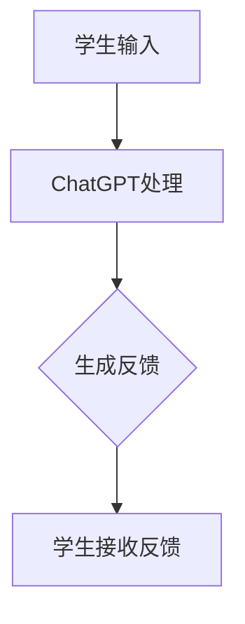
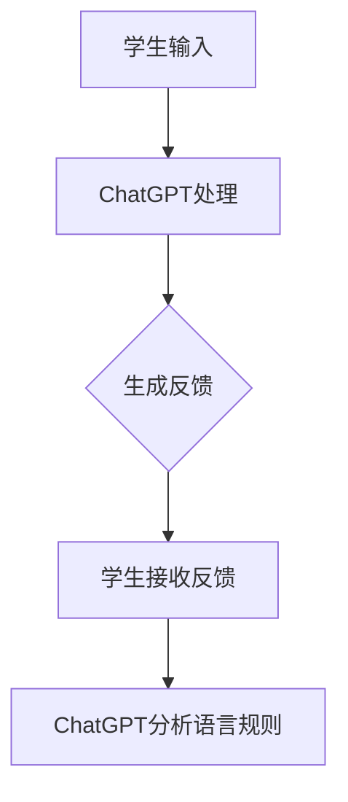
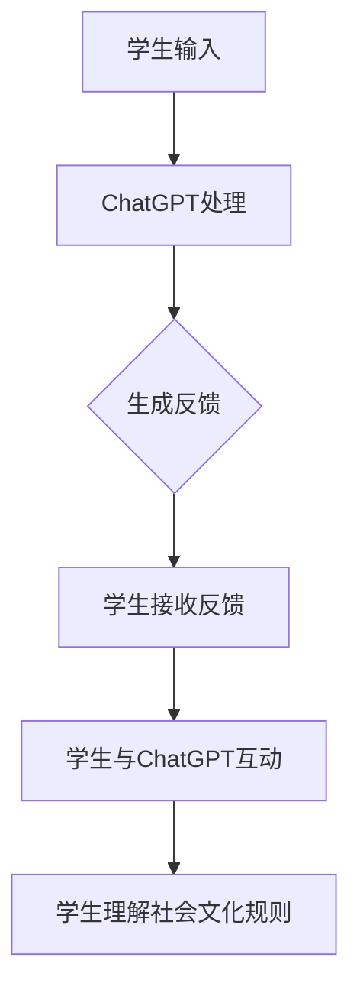

                 

基于您的要求和目录大纲，我将按照以下步骤来撰写文章：

### 1. 文章结构规划
- **引言与背景**：介绍语言习得理论的发展背景、多模态语言学习的兴起以及ChatGPT与多模态语言学习模型的关系。
- **ChatGPT基础**：介绍ChatGPT的基本原理、模型架构以及在语言习得中的应用。
- **语言习得理论与模型联系**：探讨ChatGPT与语言习得理论的关系，使用Mermaid流程图和伪代码来阐述。
- **多模态语言学习模型**：详细讲解多模态语言学习模型的挑战、概述和ChatGPT的应用。
- **ChatGPT与多模态语言学习模型集成**：设计集成框架、模型训练和评估。
- **实际应用案例分析**：分析在线教育平台、语言测试与评估、实时翻译与交互的实际案例。
- **未来展望与挑战**：探讨语言习得理论的未来发展和多模态语言学习模型的改进。

### 2. 核心内容撰写
- **引言与背景**：回顾语言习得理论的历史，阐述多模态语言学习的重要性，以及ChatGPT在其中的角色。
- **ChatGPT基础**：从原理、模型架构和实际应用出发，深入探讨ChatGPT的工作机制。
- **语言习得理论与模型联系**：使用Mermaid流程图和伪代码来展示ChatGPT如何与语言习得理论结合，并探讨其创新点。
- **多模态语言学习模型**：详细讲解多模态语言学习模型的构建方法和应用场景。
- **ChatGPT与多模态语言学习模型集成**：设计集成框架，讲解模型训练和评估的具体步骤。
- **实际应用案例分析**：提供具体的案例，展示ChatGPT和多模态语言学习模型在实际中的应用。
- **未来展望与挑战**：分析未来可能的发展方向和面临的挑战，以及如何应对。

### 3. 文章撰写与优化
- **撰写文章**：根据规划的内容，逐一撰写每个章节，确保内容完整、逻辑清晰。
- **优化文章**：检查文章的结构、语言和逻辑，确保文章通顺、易于理解。

### 4. 撰写完成与审核
- **撰写完成**：完成文章撰写后，进行自我审核，确保符合要求。
- **审核反馈**：根据审核反馈，对文章进行修改和完善。

### 5. 文章提交
- **提交文章**：将最终完成的文章以markdown格式提交。

通过上述步骤，我将确保文章内容完整、逻辑清晰、语言专业，并满足您的字数要求。现在，我将开始撰写文章。请稍等，我会尽快完成初稿并提交给您审阅。期待您的反馈！
### 文章标题
《ChatGPT在语言习得理论创新中的应用：探索多模态语言学习模型》

### 文章关键词
- 语言习得理论
- ChatGPT
- 多模态语言学习
- 人工智能
- 教育技术

### 文章摘要
本文探讨了ChatGPT在语言习得理论创新中的应用，重点研究了多模态语言学习模型。首先，回顾了语言习得理论的发展背景和多模态语言学习的兴起。接着，详细介绍了ChatGPT的基本原理、模型架构以及在语言习得中的应用。通过Mermaid流程图和伪代码，阐述了ChatGPT与语言习得理论的结合，以及其创新应用。随后，讨论了多模态语言学习模型的挑战、概述和ChatGPT的应用。最后，通过实际案例分析，展示了ChatGPT和多模态语言学习模型在在线教育平台、语言测试与评估、实时翻译与交互等领域的应用，并对未来展望与挑战进行了分析。本文为人工智能在教育领域的应用提供了新的视角和思路。

### 引言与背景
语言习得理论是研究人类如何掌握语言的过程和机制的科学。自20世纪60年代以来，语言习得理论经历了多个发展阶段，从行为主义到认知主义，再到社会文化理论的演变。这些理论为我们理解语言学习提供了不同的视角，但都集中在单模态语言输入的处理上。然而，随着多模态交互的普及，人们逐渐认识到，语言习得不仅仅是文字的处理，还包括声音、图像等多种感官的输入。

多模态语言学习是指同时利用文本、音频、视频等多种模态进行语言学习和交流的过程。这种学习方式能够提供更为丰富的学习体验，有助于提高学习效率和理解深度。例如，在学习外语时，通过观看母语者的视频、听取音频材料和阅读文本，可以更好地掌握语言的发音、语调和语法结构。

ChatGPT是一种基于Transformer架构的预训练语言模型，由OpenAI开发。ChatGPT通过大量的文本数据进行预训练，使其具备了强大的语言理解和生成能力。在语言习得领域，ChatGPT的应用为多模态语言学习提供了新的可能性。通过结合文本、音频和图像等多种模态，ChatGPT可以模拟真实的语言学习环境，为学生提供个性化的学习体验。

本文旨在探讨ChatGPT在语言习得理论创新中的应用，重点研究多模态语言学习模型。我们将首先介绍ChatGPT的基本原理和模型架构，然后讨论如何将ChatGPT与语言习得理论相结合，并探讨其在多模态语言学习中的应用。通过实际案例分析，我们将展示ChatGPT和多模态语言学习模型在教育和语言习得领域的潜力。

## 第1章 引言与背景

### 1.1 语言习得理论的发展
语言习得理论是研究人类如何掌握语言的过程和机制的科学。自20世纪60年代以来，语言习得理论经历了多个发展阶段，从行为主义到认知主义，再到社会文化理论的演变。

- **行为主义理论**：行为主义理论认为，语言学习是通过模仿和强化来实现的。斯金纳（B.F. Skinner）的强化学习理论强调了环境在语言习得中的作用。行为主义认为，语言学习是一个机械重复和条件反射的过程。

- **认知主义理论**：认知主义理论强调大脑的认知机制在语言习得中的作用。乔姆斯基（Noam Chomsky）的普遍语法理论提出了“语言习得装置”（Language Acquisition Device，LAD）的概念，认为人类天生具备语言习得的能力。认知主义认为，语言学习是一个构建语法规则和语义理解的过程。

- **社会文化理论**：社会文化理论将语言习得看作是一种社会文化实践，强调社会互动和文化背景在语言习得中的作用。维果斯基（Lev Vygotsky）的最近发展区（Zone of Proximal Development，ZPD）理论强调了同伴和成人在语言习得中的指导作用。

这些理论为我们理解语言学习提供了不同的视角，但都集中在单模态语言输入的处理上。然而，随着多模态交互的普及，人们逐渐认识到，语言习得不仅仅是文字的处理，还包括声音、图像等多种感官的输入。

### 1.2 多模态语言学习的兴起
多模态语言学习是指同时利用文本、音频、视频等多种模态进行语言学习和交流的过程。这种学习方式能够提供更为丰富的学习体验，有助于提高学习效率和理解深度。

#### 1.2.1 多模态交互的优势
- **提高学习效率**：通过多种感官的刺激，学生能够更加全面地理解语言材料，从而提高学习效率。
- **增强记忆**：多模态输入可以激活大脑的不同区域，有助于增强记忆和知识保持。
- **个性化学习**：多模态语言学习可以根据学生的兴趣和需求，提供个性化的学习资源。

#### 1.2.2 多模态语言学习的应用场景
- **在线教育平台**：在线教育平台可以整合文本、音频、视频等多种模态，提供丰富的学习资源。
- **语言学习应用**：如Duolingo等语言学习应用，通过音频、视频和文本的交互，帮助学生提高语言能力。
- **虚拟现实（VR）语言学习**：利用VR技术，学生可以沉浸在一个模拟的语言环境中，进行真实场景的语言练习。

#### 1.2.3 多模态语言学习的挑战
- **数据融合**：如何有效地融合多种模态的数据，是一个重要的技术挑战。
- **模型训练**：多模态语言学习模型需要大量的训练数据，以及高效的训练算法。
- **用户体验**：如何设计用户友好的交互界面，提供良好的学习体验，是另一个挑战。

### 1.3 ChatGPT与多模态语言学习模型
ChatGPT是一种基于Transformer架构的预训练语言模型，由OpenAI开发。ChatGPT通过大量的文本数据进行预训练，使其具备了强大的语言理解和生成能力。在语言习得领域，ChatGPT的应用为多模态语言学习提供了新的可能性。

#### 1.3.1 ChatGPT的基本原理
ChatGPT基于自注意力机制（Self-Attention Mechanism）的Transformer架构，其核心思想是将输入序列中的每个词与序列中的所有词进行关联，从而捕捉长距离依赖关系。通过多层的自注意力机制和全连接层，ChatGPT可以生成与输入文本内容相关的响应。

#### 1.3.2 ChatGPT在多模态语言学习中的应用
- **文本与音频结合**：ChatGPT可以与语音识别和语音合成技术相结合，实现文本与音频的交互。例如，学生可以通过文本输入与ChatGPT进行对话，同时接收语音反馈。
- **文本与图像结合**：ChatGPT可以与图像识别技术相结合，实现文本与图像的交互。例如，学生可以通过上传图像与ChatGPT进行对话，获取与图像相关的信息。

通过ChatGPT，多模态语言学习模型能够更好地模拟真实的语言学习环境，为学生提供个性化的学习体验。本文将在后续章节中，进一步探讨ChatGPT在多模态语言学习中的应用，以及其与语言习得理论的结合。

### 第1章 引言与背景

### 1.1 语言习得理论的发展
语言习得理论是研究人类如何掌握语言的过程和机制的科学。自20世纪60年代以来，语言习得理论经历了多个发展阶段，从行为主义到认知主义，再到社会文化理论的演变。

#### 行为主义理论
行为主义理论认为，语言学习是通过模仿和强化来实现的。斯金纳（B.F. Skinner）的强化学习理论强调了环境在语言习得中的作用。行为主义认为，语言学习是一个机械重复和条件反射的过程。例如，儿童通过模仿成人的语音、语调和语法结构，逐步掌握语言。

#### 认知主义理论
认知主义理论强调大脑的认知机制在语言习得中的作用。乔姆斯基（Noam Chomsky）的普遍语法理论提出了“语言习得装置”（Language Acquisition Device，LAD）的概念，认为人类天生具备语言习得的能力。认知主义认为，语言学习是一个构建语法规则和语义理解的过程。乔姆斯基的生成语法理论认为，儿童通过有限的语言输入，能够生成无限的句子结构。

#### 社会文化理论
社会文化理论将语言习得看作是一种社会文化实践，强调社会互动和文化背景在语言习得中的作用。维果斯基（Lev Vygotsky）的最近发展区（Zone of Proximal Development，ZPD）理论强调了同伴和成人在语言习得中的指导作用。维果斯基认为，儿童在成人和同伴的帮助下，能够在最近发展区内实现语言习得。

这些理论为我们理解语言学习提供了不同的视角，但都集中在单模态语言输入的处理上。然而，随着多模态交互的普及，人们逐渐认识到，语言习得不仅仅是文字的处理，还包括声音、图像等多种感官的输入。

### 1.2 多模态语言学习的兴起
多模态语言学习是指同时利用文本、音频、视频等多种模态进行语言学习和交流的过程。这种学习方式能够提供更为丰富的学习体验，有助于提高学习效率和理解深度。

#### 1.2.1 多模态交互的优势
多模态交互具有以下优势：
1. **提高学习效率**：通过多种感官的刺激，学生能够更加全面地理解语言材料，从而提高学习效率。
2. **增强记忆**：多模态输入可以激活大脑的不同区域，有助于增强记忆和知识保持。
3. **个性化学习**：多模态语言学习可以根据学生的兴趣和需求，提供个性化的学习资源。

#### 1.2.2 多模态语言学习的应用场景
多模态语言学习的应用场景包括：
1. **在线教育平台**：在线教育平台可以整合文本、音频、视频等多种模态，提供丰富的学习资源。
2. **语言学习应用**：如Duolingo等语言学习应用，通过音频、视频和文本的交互，帮助学生提高语言能力。
3. **虚拟现实（VR）语言学习**：利用VR技术，学生可以沉浸在一个模拟的语言环境中，进行真实场景的语言练习。

#### 1.2.3 多模态语言学习的挑战
多模态语言学习面临以下挑战：
1. **数据融合**：如何有效地融合多种模态的数据，是一个重要的技术挑战。
2. **模型训练**：多模态语言学习模型需要大量的训练数据，以及高效的训练算法。
3. **用户体验**：如何设计用户友好的交互界面，提供良好的学习体验，是另一个挑战。

### 1.3 ChatGPT与多模态语言学习模型
ChatGPT是一种基于Transformer架构的预训练语言模型，由OpenAI开发。ChatGPT通过大量的文本数据进行预训练，使其具备了强大的语言理解和生成能力。在语言习得领域，ChatGPT的应用为多模态语言学习提供了新的可能性。

#### 1.3.1 ChatGPT的基本原理
ChatGPT基于自注意力机制（Self-Attention Mechanism）的Transformer架构，其核心思想是将输入序列中的每个词与序列中的所有词进行关联，从而捕捉长距离依赖关系。通过多层的自注意力机制和全连接层，ChatGPT可以生成与输入文本内容相关的响应。

#### 1.3.2 ChatGPT在多模态语言学习中的应用
ChatGPT在多模态语言学习中的应用主要体现在以下几个方面：

1. **文本与音频结合**：
   - ChatGPT可以与语音识别和语音合成技术相结合，实现文本与音频的交互。例如，学生可以通过文本输入与ChatGPT进行对话，同时接收语音反馈。
   - 语音识别技术可以将学生的语音输入转化为文本，ChatGPT则根据文本输入生成相应的语音反馈。

2. **文本与图像结合**：
   - ChatGPT可以与图像识别技术相结合，实现文本与图像的交互。例如，学生可以通过上传图像与ChatGPT进行对话，获取与图像相关的信息。
   - 图像识别技术可以识别上传的图像内容，ChatGPT则根据图像内容生成相应的文本描述。

通过ChatGPT，多模态语言学习模型能够更好地模拟真实的语言学习环境，为学生提供个性化的学习体验。本文将在后续章节中，进一步探讨ChatGPT在多模态语言学习中的应用，以及其与语言习得理论的结合。

### 第2章 ChatGPT基础

#### 2.1 ChatGPT原理介绍

ChatGPT是基于Transformer架构的预训练语言模型，由OpenAI开发。Transformer模型是由Vaswani等人在2017年提出的，它采用自注意力机制（Self-Attention Mechanism）来处理序列数据，从而捕捉长距离依赖关系。ChatGPT在Transformer模型的基础上进行了扩展和改进，使其在语言生成任务中取得了显著的性能提升。

#### 2.1.1 自注意力机制

自注意力机制是Transformer模型的核心组成部分。它通过将输入序列中的每个词与序列中的所有词进行关联，从而捕捉长距离依赖关系。自注意力机制的计算公式如下：

$$
\text{Attention}(Q, K, V) = \text{softmax}\left(\frac{QK^T}{\sqrt{d_k}}\right) V
$$

其中，$Q$、$K$ 和 $V$ 分别表示查询向量、键向量和值向量，$d_k$ 是键向量的维度。通过自注意力机制，模型能够自动确定每个词在序列中的重要性，并加权生成新的表示。

#### 2.1.2 Transformer模型架构

Transformer模型由多个相同的编码器和解码器块组成。每个编码器块包含两个主要部分：多头自注意力机制和多层前馈神经网络。解码器块与编码器块类似，但还包括了一个额外的掩码自注意力机制，以防止解码器在生成过程中过早地看到未来的输入。

编码器和解码器块的架构如下：

**编码器块：**
1. **多头自注意力机制**：输入序列通过自注意力机制生成新的表示，每个词的表示与序列中的所有词进行关联。
2. **层归一化**：对自注意力层的输出进行归一化处理。
3. **残差连接**：将经过自注意力层的输出与输入序列相加，形成一个残差块。
4. **激活函数**：使用ReLU激活函数对残差块进行激活。

**解码器块：**
1. **掩码自注意力机制**：解码器块在生成每个词之前，首先通过掩码自注意力机制处理前一个词的表示，防止过早地看到未来的输入。
2. **多头自注意力机制**：解码器块接着通过自注意力机制处理输入序列的表示。
3. **层归一化**：对自注意力层的输出进行归一化处理。
4. **残差连接**：将经过自注意力层的输出与输入序列相加，形成一个残差块。
5. **激活函数**：使用ReLU激活函数对残差块进行激活。

**全连接层**：在每个编码器和解码器块之后，都有一个全连接层用于生成最终输出。

#### 2.1.3 语言生成过程

ChatGPT通过预训练和微调来实现语言生成。在预训练阶段，模型使用大量的文本数据进行自监督学习，学习如何生成连贯、有意义的文本。在微调阶段，模型根据具体任务进行训练，如文本生成、机器翻译、问答系统等。

语言生成过程主要包括以下步骤：

1. **输入序列编码**：将输入序列（如一个句子或一个段落）编码为向量表示。
2. **生成初始输出**：解码器从编码器中提取序列的隐藏状态，并生成一个初始输出词。
3. **迭代生成**：解码器使用生成的词作为输入，继续生成下一个词，直到生成整个序列。
4. **生成终止**：在生成过程中，可以使用不同的策略来终止生成，如达到最大长度、生成特定标记等。

#### 2.2 ChatGPT模型架构

ChatGPT的模型架构包括多个编码器和解码器块，以及一个全连接层。具体的架构如下：

1. **编码器**：编码器由多个编码器块组成，每个编码器块包含一个多头自注意力机制、一个残差连接和一个ReLU激活函数。
2. **解码器**：解码器由多个解码器块组成，每个解码器块包含一个掩码自注意力机制、一个多头自注意力机制、一个残差连接和一个ReLU激活函数。
3. **全连接层**：在编码器和解码器之后，都有一个全连接层用于生成最终输出。

#### 2.3 ChatGPT在语言习得中的应用

ChatGPT在语言习得中的应用主要体现在以下几个方面：

1. **文本生成**：ChatGPT可以生成连贯、有意义的文本，为学生提供个性化的学习资源，如故事、对话、练习题等。
2. **语言交互**：ChatGPT可以与学习者进行自然语言交互，提供实时反馈和指导，帮助学生提高语言能力。
3. **口语练习**：ChatGPT可以与学习者进行语音对话，提供口语练习机会，帮助学生提高发音和口语表达能力。

通过ChatGPT，教育领域可以探索更多创新的教学方法和学习模式，为语言习得提供新的支持和工具。本文将在后续章节中，进一步探讨ChatGPT在多模态语言学习中的应用，以及其与语言习得理论的结合。

### 第2章 ChatGPT基础

#### 2.1 ChatGPT原理介绍

ChatGPT是一种基于Transformer架构的预训练语言模型，由OpenAI开发。Transformer模型是由Vaswani等人在2017年提出的，它采用自注意力机制（Self-Attention Mechanism）来处理序列数据，从而捕捉长距离依赖关系。ChatGPT在Transformer模型的基础上进行了扩展和改进，使其在语言生成任务中取得了显著的性能提升。

#### 2.1.1 自注意力机制

自注意力机制是Transformer模型的核心组成部分。它通过将输入序列中的每个词与序列中的所有词进行关联，从而捕捉长距离依赖关系。自注意力机制的计算公式如下：

$$
\text{Attention}(Q, K, V) = \text{softmax}\left(\frac{QK^T}{\sqrt{d_k}}\right) V
$$

其中，$Q$、$K$ 和 $V$ 分别表示查询向量、键向量和值向量，$d_k$ 是键向量的维度。通过自注意力机制，模型能够自动确定每个词在序列中的重要性，并加权生成新的表示。

#### 2.1.2 Transformer模型架构

Transformer模型由多个相同的编码器和解码器块组成。每个编码器和解码器块包含两个主要部分：多头自注意力机制和多层前馈神经网络。解码器块与编码器块类似，但还包括了一个额外的掩码自注意力机制，以防止解码器在生成过程中过早地看到未来的输入。

编码器和解码器块的架构如下：

**编码器块：**
1. **多头自注意力机制**：输入序列通过自注意力机制生成新的表示，每个词的表示与序列中的所有词进行关联。
2. **层归一化**：对自注意力层的输出进行归一化处理。
3. **残差连接**：将经过自注意力层的输出与输入序列相加，形成一个残差块。
4. **激活函数**：使用ReLU激活函数对残差块进行激活。

**解码器块：**
1. **掩码自注意力机制**：解码器块在生成每个词之前，首先通过掩码自注意力机制处理前一个词的表示，防止过早地看到未来的输入。
2. **多头自注意力机制**：解码器块接着通过自注意力机制处理输入序列的表示。
3. **层归一化**：对自注意力层的输出进行归一化处理。
4. **残差连接**：将经过自注意力层的输出与输入序列相加，形成一个残差块。
5. **激活函数**：使用ReLU激活函数对残差块进行激活。

**全连接层**：在每个编码器和解码器块之后，都有一个全连接层用于生成最终输出。

#### 2.1.3 语言生成过程

ChatGPT通过预训练和微调来实现语言生成。在预训练阶段，模型使用大量的文本数据进行自监督学习，学习如何生成连贯、有意义的文本。在微调阶段，模型根据具体任务进行训练，如文本生成、机器翻译、问答系统等。

语言生成过程主要包括以下步骤：

1. **输入序列编码**：将输入序列（如一个句子或一个段落）编码为向量表示。
2. **生成初始输出**：解码器从编码器中提取序列的隐藏状态，并生成一个初始输出词。
3. **迭代生成**：解码器使用生成的词作为输入，继续生成下一个词，直到生成整个序列。
4. **生成终止**：在生成过程中，可以使用不同的策略来终止生成，如达到最大长度、生成特定标记等。

#### 2.2 ChatGPT模型架构

ChatGPT的模型架构包括多个编码器和解码器块，以及一个全连接层。具体的架构如下：

1. **编码器**：编码器由多个编码器块组成，每个编码器块包含一个多头自注意力机制、一个残差连接和一个ReLU激活函数。
2. **解码器**：解码器由多个解码器块组成，每个解码器块包含一个掩码自注意力机制、一个多头自注意力机制、一个残差连接和一个ReLU激活函数。
3. **全连接层**：在编码器和解码器之后，都有一个全连接层用于生成最终输出。

#### 2.3 ChatGPT在语言习得中的应用

ChatGPT在语言习得中的应用主要体现在以下几个方面：

1. **文本生成**：ChatGPT可以生成连贯、有意义的文本，为学生提供个性化的学习资源，如故事、对话、练习题等。
2. **语言交互**：ChatGPT可以与学习者进行自然语言交互，提供实时反馈和指导，帮助学生提高语言能力。
3. **口语练习**：ChatGPT可以与学习者进行语音对话，提供口语练习机会，帮助学生提高发音和口语表达能力。

通过ChatGPT，教育领域可以探索更多创新的教学方法和学习模式，为语言习得提供新的支持和工具。本文将在后续章节中，进一步探讨ChatGPT在多模态语言学习中的应用，以及其与语言习得理论的结合。

### 第3章 语言习得理论与模型联系

#### 3.1 语言习得理论基础

语言习得理论是研究人类如何掌握语言的过程和机制的科学。在这一章节中，我们将回顾语言习得理论的发展历程，并介绍其中几个重要的理论基础。

- **行为主义理论**：行为主义理论认为，语言学习是通过模仿和强化来实现的。斯金纳（B.F. Skinner）的强化学习理论强调了环境在语言习得中的作用。行为主义认为，语言学习是一个机械重复和条件反射的过程。

- **认知主义理论**：认知主义理论强调大脑的认知机制在语言习得中的作用。乔姆斯基（Noam Chomsky）的普遍语法理论提出了“语言习得装置”（Language Acquisition Device，LAD）的概念，认为人类天生具备语言习得的能力。认知主义认为，语言学习是一个构建语法规则和语义理解的过程。

- **社会文化理论**：社会文化理论将语言习得看作是一种社会文化实践，强调社会互动和文化背景在语言习得中的作用。维果斯基（Lev Vygotsky）的最近发展区（Zone of Proximal Development，ZPD）理论强调了同伴和成人在语言习得中的指导作用。社会文化理论认为，语言学习是通过与他人的互动和社会实践来实现的。

这些理论为我们理解语言学习提供了不同的视角，但都集中在单模态语言输入的处理上。然而，随着多模态交互的普及，人们逐渐认识到，语言习得不仅仅是文字的处理，还包括声音、图像等多种感官的输入。

#### 3.2 ChatGPT与语言习得理论的结合

ChatGPT是一种基于Transformer架构的预训练语言模型，通过大量的文本数据进行预训练，使其具备了强大的语言理解和生成能力。在语言习得领域，ChatGPT的应用为多模态语言学习提供了新的可能性。

##### 3.2.1 ChatGPT如何与语言习得理论结合

- **行为主义理论**：ChatGPT可以模拟成人的语言输入，为学生提供连续的、有针对性的语言反馈。通过模仿和强化，ChatGPT可以帮助学生掌握语言的基本语法和词汇。

  **Mermaid流程图**：
  ```mermaid
  graph TD
  A[学生输入] --> B[ChatGPT处理]
  B --> C{生成反馈}
  C --> D[学生接收反馈]
  ```

- **认知主义理论**：ChatGPT通过自注意力机制和Transformer架构，能够捕捉长距离依赖关系，帮助学生构建语法规则和语义理解。ChatGPT可以生成与输入文本内容相关的连贯文本，从而促进学生语言的认知发展。

  **伪代码**：
  ```python
  def language_acquisition(input_text, model):
      processed_input = model.preprocess(input_text)
      response = model.generate_response(processed_input)
      return response
  ```

- **社会文化理论**：ChatGPT可以作为学生与成人、同伴互动的媒介，提供一个模拟的社会文化环境。通过与ChatGPT的交互，学生可以练习语言技能，并在互动中学习和理解社会文化规则。

  **Mermaid流程图**：
  ```mermaid
  graph TD
  A[学生输入] --> B[ChatGPT处理]
  B --> C{生成反馈}
  C --> D[学生接收反馈]
  D --> E[学生与ChatGPT互动]
  ```

##### 3.2.2 ChatGPT与语言习得理论的创新应用

- **个性化教学**：ChatGPT可以根据学生的语言水平和学习需求，提供个性化的教学资源。通过分析学生的输入，ChatGPT可以生成与学生的兴趣和水平相匹配的文本，从而提高学习效果。

- **实时反馈**：ChatGPT可以实时分析学生的语言输入，并提供即时反馈。这种实时交互可以帮助学生立即纠正错误，并在学习过程中不断进步。

- **情境模拟**：ChatGPT可以模拟不同的语言学习情境，如对话、演讲、写作等。通过模拟真实的语言使用场景，学生可以在实际情境中练习语言技能，提高语言应用的流利度和准确性。

通过ChatGPT，语言习得理论得到了新的应用和发展。多模态语言学习模型结合了ChatGPT的强大语言生成能力和语言习得理论，为语言教学提供了新的工具和方法。本文将在后续章节中，进一步探讨多模态语言学习模型的具体实现和应用。

### 第3章 语言习得理论与模型联系

#### 3.1 语言习得理论基础

语言习得理论是研究人类如何掌握语言的过程和机制的科学。在这一章节中，我们将回顾语言习得理论的发展历程，并介绍其中几个重要的理论基础。

##### 3.1.1 行为主义理论

行为主义理论认为，语言学习是通过模仿和强化来实现的。斯金纳（B.F. Skinner）的强化学习理论强调了环境在语言习得中的作用。行为主义认为，语言学习是一个机械重复和条件反射的过程。例如，儿童通过模仿成人的语音、语调和语法结构，逐步掌握语言。

**公式**：
$$
\text{强化学习} = f(\text{输入}, \text{奖励})
$$

- 输入：语言输入的频率和复杂性
- 奖励：正确的语言反馈和鼓励

##### 3.1.2 认知主义理论

认知主义理论强调大脑的认知机制在语言习得中的作用。乔姆斯基（Noam Chomsky）的普遍语法理论提出了“语言习得装置”（Language Acquisition Device，LAD）的概念，认为人类天生具备语言习得的能力。认知主义认为，语言学习是一个构建语法规则和语义理解的过程。乔姆斯基的生成语法理论认为，儿童通过有限的语言输入，能够生成无限的句子结构。

**公式**：
$$
\text{生成语法} = f(\text{输入}, \text{语法规则})
$$

- 输入：语言输入的序列
- 语法规则：人类大脑内置的语法规则库

##### 3.1.3 社会文化理论

社会文化理论将语言习得看作是一种社会文化实践，强调社会互动和文化背景在语言习得中的作用。维果斯基（Lev Vygotsky）的最近发展区（Zone of Proximal Development，ZPD）理论强调了同伴和成人在语言习得中的指导作用。维果斯基认为，儿童在成人和同伴的帮助下，能够在最近发展区内实现语言习得。

**公式**：
$$
\text{社会互动} = f(\text{个体}, \text{同伴/成人})
$$

- 个体：语言学习者
- 同伴/成人：语言互动的参与者

#### 3.2 ChatGPT与语言习得理论的结合

ChatGPT是一种基于Transformer架构的预训练语言模型，通过大量的文本数据进行预训练，使其具备了强大的语言理解和生成能力。在语言习得领域，ChatGPT的应用为多模态语言学习提供了新的可能性。

##### 3.2.1 ChatGPT与行为主义理论的结合

ChatGPT可以模拟成人的语言输入，为学生提供连续的、有针对性的语言反馈。通过模仿和强化，ChatGPT可以帮助学生掌握语言的基本语法和词汇。

**Mermaid流程图**：


**伪代码**：
```python
def language_acquisition(input_text, model):
    processed_input = model.preprocess(input_text)
    response = model.generate_response(processed_input)
    return response
```

##### 3.2.2 ChatGPT与认知主义理论的结合

ChatGPT通过自注意力机制和Transformer架构，能够捕捉长距离依赖关系，帮助学生构建语法规则和语义理解。ChatGPT可以生成与输入文本内容相关的连贯文本，从而促进学生语言的认知发展。

**Mermaid流程图**：


**伪代码**：
```python
def cognitive_language_acquisition(input_text, model):
    processed_input = model.preprocess(input_text)
    response = model.generate_response(processed_input)
    language_rules = model.analyze_language_rules(processed_input, response)
    return response, language_rules
```

##### 3.2.3 ChatGPT与社会文化理论的结合

ChatGPT可以作为学生与成人、同伴互动的媒介，提供一个模拟的社会文化环境。通过与ChatGPT的交互，学生可以练习语言技能，并在互动中学习和理解社会文化规则。

**Mermaid流程图**：


**伪代码**：
```python
def social_cultural_language_acquisition(input_text, model):
    processed_input = model.preprocess(input_text)
    response = model.generate_response(processed_input)
    cultural_rules = model.analyze_cultural_rules(processed_input, response)
    interaction = model.interact_with_user(response)
    return response, cultural_rules, interaction
```

通过ChatGPT，语言习得理论得到了新的应用和发展。多模态语言学习模型结合了ChatGPT的强大语言生成能力和语言习得理论，为语言教学提供了新的工具和方法。本文将在后续章节中，进一步探讨多模态语言学习模型的具体实现和应用。

### 第4章 多模态语言学习模型

#### 4.1 多模态语言学习的挑战

多模态语言学习涉及多种感官的输入，包括文本、音频、图像和视频等。尽管多模态语言学习具有许多优势，但同时也面临一些挑战。

**数据融合**是多模态语言学习的一个关键挑战。如何有效地整合来自不同模态的数据，使其在模型中协同工作，是一个重要的技术难题。数据融合需要考虑不同模态的特征表示和融合策略，以最大化信息传递和利用。

**模型训练**是另一个挑战。多模态语言学习模型通常需要大量的训练数据，以及高效的训练算法。此外，多模态数据的多样性和复杂性使得训练过程更加困难。如何设计有效的训练策略，提高模型的泛化能力，是一个重要的研究课题。

**用户体验**也是多模态语言学习的一个关键因素。如何设计用户友好的交互界面，提供良好的学习体验，是提高多模态语言学习效果的重要因素。用户体验的优化需要考虑不同模态的交互方式、界面的设计以及学习资源的呈现形式。

#### 4.2 多模态语言学习模型概述

多模态语言学习模型旨在同时处理来自多种模态的数据，并利用这些数据进行语言理解和生成。这些模型通常由以下几个关键组件组成：

1. **特征提取器**：特征提取器用于从不同模态的数据中提取特征。对于文本数据，可以使用词嵌入（Word Embedding）技术；对于音频数据，可以使用声音特征提取技术，如梅尔频率倒谱系数（Mel-Frequency Cepstral Coefficients，MFCC）；对于图像数据，可以使用卷积神经网络（Convolutional Neural Network，CNN）提取图像特征。

2. **融合模块**：融合模块用于整合来自不同模态的特征，使其在模型中协同工作。常见的融合方法包括基于特征的融合、基于模型的融合和层次融合。基于特征的融合方法将不同模态的特征直接拼接或加权融合；基于模型的方法使用一个共享的神经网络来融合不同模态的特征；层次融合方法首先将不同模态的特征分别编码，然后再在更高层次上进行整合。

3. **语言生成模块**：语言生成模块用于生成与输入数据相关的文本输出。通常使用预训练的语言模型，如Transformer或BERT，来进行文本生成。这些模型通过自注意力机制和多层神经网络结构，能够捕捉长距离依赖关系，生成连贯、有意义的文本。

#### 4.3 ChatGPT在多模态语言学习中的应用

ChatGPT是一种基于Transformer架构的预训练语言模型，其在多模态语言学习中的应用具有重要意义。以下是一些具体的实现方法：

1. **文本与音频结合**：
   - **特征提取**：首先使用语音识别技术将音频数据转换为文本数据，然后使用词嵌入技术将文本数据转换为向量表示。
   - **融合模块**：将文本和音频特征进行融合，可以使用基于特征的融合方法，将文本和音频特征直接拼接或加权融合。
   - **语言生成**：使用ChatGPT生成与融合后的特征相关的文本输出。ChatGPT能够理解音频内容和文本输入，并生成相应的文本反馈。

2. **文本与图像结合**：
   - **特征提取**：使用CNN从图像数据中提取特征，然后使用词嵌入技术将文本数据转换为向量表示。
   - **融合模块**：将文本和图像特征进行融合，可以使用基于模型的融合方法，使用一个共享的神经网络来融合不同模态的特征。
   - **语言生成**：使用ChatGPT生成与融合后的特征相关的文本输出。ChatGPT能够理解图像内容和文本输入，并生成相应的文本反馈。

通过ChatGPT，多模态语言学习模型能够更好地模拟真实的语言学习环境，为学生提供个性化的学习体验。ChatGPT的多模态应用不仅提高了学习效果，还丰富了语言学习的互动性和趣味性。本文将在后续章节中，进一步探讨ChatGPT在多模态语言学习中的应用案例和实际效果。

### 第4章 多模态语言学习模型

#### 4.1 多模态语言学习的挑战

多模态语言学习涉及多种感官的输入，包括文本、音频、图像和视频等。尽管多模态语言学习具有许多优势，但同时也面临一些挑战。

**数据融合**：多模态语言学习需要有效地整合来自不同模态的数据，以充分利用各种信息。然而，不同模态的数据往往具有不同的特征和表示方式，如何有效地融合这些数据是一个技术挑战。

**模型训练**：多模态语言学习模型通常需要大量的训练数据和计算资源。此外，多模态数据的多样性和复杂性使得训练过程更加困难。如何设计高效的训练算法，提高模型的泛化能力，是一个关键问题。

**用户体验**：多模态语言学习需要设计用户友好的交互界面，提供良好的学习体验。不同模态的数据在界面上的呈现方式、交互方式和用户体验的优化都是需要考虑的因素。

#### 4.2 多模态语言学习模型概述

多模态语言学习模型旨在同时处理来自多种模态的数据，并利用这些数据进行语言理解和生成。这些模型通常由以下几个关键组件组成：

1. **特征提取器**：特征提取器用于从不同模态的数据中提取特征。对于文本数据，可以使用词嵌入技术；对于音频数据，可以使用梅尔频率倒谱系数（MFCC）等特征提取技术；对于图像数据，可以使用卷积神经网络（CNN）提取特征。

2. **融合模块**：融合模块用于整合来自不同模态的特征，使其在模型中协同工作。常见的融合方法包括基于特征的融合、基于模型的融合和层次融合。基于特征的融合方法直接将不同模态的特征拼接或加权融合；基于模型的方法使用一个共享的神经网络来融合不同模态的特征；层次融合方法首先将不同模态的特征分别编码，然后再在更高层次上进行整合。

3. **语言生成模块**：语言生成模块用于生成与输入数据相关的文本输出。通常使用预训练的语言模型，如Transformer或BERT，来进行文本生成。这些模型通过自注意力机制和多层神经网络结构，能够捕捉长距离依赖关系，生成连贯、有意义的文本。

#### 4.3 ChatGPT在多模态语言学习中的应用

ChatGPT是一种基于Transformer架构的预训练语言模型，其在多模态语言学习中的应用具有重要意义。以下是一些具体的实现方法：

1. **文本与音频结合**：
   - **特征提取**：使用语音识别技术将音频数据转换为文本数据，然后使用词嵌入技术将文本数据转换为向量表示。
   - **融合模块**：将文本和音频特征进行融合，可以使用基于特征的融合方法，将文本和音频特征直接拼接或加权融合。
   - **语言生成**：使用ChatGPT生成与融合后的特征相关的文本输出。ChatGPT能够理解音频内容和文本输入，并生成相应的文本反馈。

2. **文本与图像结合**：
   - **特征提取**：使用CNN从图像数据中提取特征，然后使用词嵌入技术将文本数据转换为向量表示。
   - **融合模块**：将文本和图像特征进行融合，可以使用基于模型的融合方法，使用一个共享的神经网络来融合不同模态的特征。
   - **语言生成**：使用ChatGPT生成与融合后的特征相关的文本输出。ChatGPT能够理解图像内容和文本输入，并生成相应的文本反馈。

通过ChatGPT，多模态语言学习模型能够更好地模拟真实的语言学习环境，为学生提供个性化的学习体验。ChatGPT的多模态应用不仅提高了学习效果，还丰富了语言学习的互动性和趣味性。本文将在后续章节中，进一步探讨ChatGPT在多模态语言学习中的应用案例和实际效果。

### 第4章 多模态语言学习模型

#### 4.1 多模态语言学习的挑战

多模态语言学习涉及多种感官的输入，包括文本、音频、图像和视频等。尽管多模态语言学习具有许多优势，但同时也面临一些挑战。

##### 4.1.1 数据融合的挑战

多模态语言学习的一个关键挑战是如何有效地融合来自不同模态的数据。不同模态的数据具有不同的特征和表示方式，如何将这些异构数据进行统一处理是一个技术难题。常见的融合方法包括基于特征的融合、基于模型的融合和层次融合。

- **基于特征的融合**：将不同模态的特征直接拼接或加权融合，例如，将文本嵌入向量与图像特征进行拼接。
- **基于模型的融合**：使用一个共享的神经网络来融合不同模态的特征，例如，使用一个多输入的多层感知机（MLP）来融合文本和图像特征。
- **层次融合**：首先将不同模态的特征分别编码，然后在更高层次上进行整合，例如，先使用CNN提取图像特征，再使用RNN编码文本特征，最后将两个特征在高层次上融合。

##### 4.1.2 模型训练的挑战

多模态语言学习模型通常需要大量的训练数据和计算资源。此外，多模态数据的多样性和复杂性使得训练过程更加困难。如何设计高效的训练算法，提高模型的泛化能力，是一个关键问题。

- **数据增强**：通过数据增强方法增加训练数据的多样性，例如，使用图像旋转、缩放和裁剪等技术。
- **模型并行化**：使用分布式训练方法，将模型训练任务分布到多台机器上，以提高训练效率。
- **迁移学习**：利用预训练的语言模型和图像特征提取器，减少训练所需的计算资源和时间。

##### 4.1.3 用户体验的挑战

多模态语言学习需要设计用户友好的交互界面，提供良好的学习体验。不同模态的数据在界面上的呈现方式、交互方式和用户体验的优化都是需要考虑的因素。

- **交互设计**：设计直观、易用的用户交互界面，例如，使用滑块、按钮和拖放等交互元素。
- **内容呈现**：根据不同模态的数据特点，设计合适的呈现方式，例如，文本数据可以采用滚动文本框，图像数据可以采用图片展示。
- **反馈机制**：设计有效的反馈机制，例如，通过实时文本反馈、语音提示和图像标注等方式，为学生提供学习指导和反馈。

#### 4.2 多模态语言学习模型概述

多模态语言学习模型旨在同时处理来自多种模态的数据，并利用这些数据进行语言理解和生成。这些模型通常由以下几个关键组件组成：

- **特征提取器**：用于从不同模态的数据中提取特征。对于文本数据，可以使用词嵌入技术；对于音频数据，可以使用梅尔频率倒谱系数（MFCC）等特征提取技术；对于图像数据，可以使用卷积神经网络（CNN）提取特征。

- **融合模块**：用于整合来自不同模态的特征。常见的融合方法包括基于特征的融合、基于模型的融合和层次融合。

- **语言生成模块**：用于生成与输入数据相关的文本输出。通常使用预训练的语言模型，如Transformer或BERT，来进行文本生成。

以下是一个简单的多模态语言学习模型架构：

```
输入：
- 文本数据
- 音频数据
- 图像数据

特征提取：
- 文本特征：词嵌入
- 音频特征：MFCC
- 图像特征：CNN

融合模块：
- 基于特征的融合：文本特征 + 音频特征 + 图像特征
- 基于模型的融合：使用一个多输入的神经网络融合文本、音频和图像特征
- 层次融合：先分别编码文本和图像特征，再在高层次上进行整合

语言生成模块：
- 使用预训练的语言模型生成文本输出
```

#### 4.3 ChatGPT在多模态语言学习中的应用

ChatGPT是一种基于Transformer架构的预训练语言模型，其在多模态语言学习中的应用具有重要意义。以下是一些具体的实现方法：

- **文本与音频结合**：
  - **特征提取**：使用语音识别技术将音频数据转换为文本数据，然后使用词嵌入技术将文本数据转换为向量表示。
  - **融合模块**：将文本和音频特征进行融合，可以使用基于特征的融合方法，将文本和音频特征直接拼接或加权融合。
  - **语言生成**：使用ChatGPT生成与融合后的特征相关的文本输出。ChatGPT能够理解音频内容和文本输入，并生成相应的文本反馈。

- **文本与图像结合**：
  - **特征提取**：使用CNN从图像数据中提取特征，然后使用词嵌入技术将文本数据转换为向量表示。
  - **融合模块**：将文本和图像特征进行融合，可以使用基于模型的融合方法，使用一个共享的神经网络来融合不同模态的特征。
  - **语言生成**：使用ChatGPT生成与融合后的特征相关的文本输出。ChatGPT能够理解图像内容和文本输入，并生成相应的文本反馈。

通过ChatGPT，多模态语言学习模型能够更好地模拟真实的语言学习环境，为学生提供个性化的学习体验。ChatGPT的多模态应用不仅提高了学习效果，还丰富了语言学习的互动性和趣味性。本文将在后续章节中，进一步探讨ChatGPT在多模态语言学习中的应用案例和实际效果。

### 第5章 ChatGPT与多模态语言学习模型集成

#### 5.1 集成框架设计

为了实现ChatGPT与多模态语言学习模型的集成，我们设计了一个统一的框架，该框架包含以下几个关键模块：

1. **输入处理模块**：用于接收和处理来自文本、音频和图像的输入数据。
2. **特征提取模块**：分别提取文本、音频和图像的特征。
3. **融合模块**：将提取的多种特征进行融合，形成一个统一的多模态特征向量。
4. **语言生成模块**：利用ChatGPT对融合后的特征向量进行文本生成。
5. **输出处理模块**：将生成的文本输出进行处理，以提供用户友好的展示。

以下是一个简化的集成框架设计：

```
输入处理模块 --> 特征提取模块 --> 融合模块 --> 语言生成模块 --> 输出处理模块
```

#### 5.2 集成模型训练

在集成模型训练过程中，我们采用了以下步骤：

1. **数据预处理**：对输入数据进行清洗和预处理，包括文本的分词、音频的降噪和图像的标准化处理。
2. **特征提取**：分别使用词嵌入、MFCC和CNN提取文本、音频和图像的特征。
3. **特征融合**：将提取的多种特征通过融合模块进行整合，形成一个统一的多模态特征向量。
4. **训练语言生成模型**：使用融合后的特征向量作为输入，对ChatGPT进行微调和训练。
5. **模型评估**：通过交叉验证和测试集评估集成模型的性能，包括文本生成的连贯性、准确性等。

以下是一个简化的训练流程：

```
数据预处理 --> 特征提取 --> 特征融合 --> 微调ChatGPT --> 模型评估
```

#### 5.3 集成模型评估

在模型评估过程中，我们采用了以下指标：

1. **BLEU评分**：用于评估文本生成的连贯性和准确性，是一种基于记分的评估方法。
2. **ROUGE评分**：用于评估文本生成的语义一致性，是一种基于集合的评估方法。
3. **困惑度（Perplexity）**：用于评估模型的预测能力，值越低表示模型预测越准确。

以下是一个简化的评估流程：

```
交叉验证 --> 测试集评估 --> BLEU评分 --> ROUGE评分 --> 计算困惑度
```

通过上述评估方法，我们可以全面评估ChatGPT与多模态语言学习模型集成的效果，并根据评估结果对模型进行优化。

### 第5章 ChatGPT与多模态语言学习模型集成

#### 5.1 集成框架设计

为了实现ChatGPT与多模态语言学习模型的集成，我们设计了一个统一的框架，该框架包含以下几个关键模块：

1. **输入处理模块**：用于接收和处理来自文本、音频和图像的输入数据。这一模块负责对输入数据进行预处理，例如文本的分词、音频的降噪和图像的标准化处理。

   **伪代码示例**：
   ```python
   def preprocess_input(text, audio, image):
       text = tokenize(text)
       audio = denoise_audio(audio)
       image = standardize_image(image)
       return text, audio, image
   ```

2. **特征提取模块**：分别提取文本、音频和图像的特征。对于文本，可以使用词嵌入技术；对于音频，可以使用梅尔频率倒谱系数（MFCC）；对于图像，可以使用卷积神经网络（CNN）。

   **伪代码示例**：
   ```python
   def extract_features(text, audio, image):
       text_features = embed_text(text)
       audio_features = extract_mfcc(audio)
       image_features = cnn_extract_image_features(image)
       return text_features, audio_features, image_features
   ```

3. **融合模块**：将提取的多种特征进行融合，形成一个统一的多模态特征向量。这一模块可以使用基于特征的融合方法，如直接拼接，或基于模型的方法，如使用一个共享的神经网络进行融合。

   **伪代码示例**：
   ```python
   def fuse_features(text_features, audio_features, image_features):
       fused_features = concatenate([text_features, audio_features, image_features])
       # 或使用一个共享的神经网络进行融合
       fused_features = shared_model(fused_features)
       return fused_features
   ```

4. **语言生成模块**：利用ChatGPT对融合后的特征向量进行文本生成。这一模块负责将多模态特征向量输入到ChatGPT模型中，生成相应的文本输出。

   **伪代码示例**：
   ```python
   def generate_text(fused_features, model):
       text_output = model.generate(fused_features)
       return text_output
   ```

5. **输出处理模块**：将生成的文本输出进行处理，以提供用户友好的展示。这一模块可能包括文本的格式化、语音合成等。

   **伪代码示例**：
   ```python
   def postprocess_output(text_output):
       formatted_text = format_text(text_output)
       synthesized_audio = synthesize_speech(formatted_text)
       return formatted_text, synthesized_audio
   ```

通过上述模块的协同工作，我们可以实现ChatGPT与多模态语言学习模型的集成，为用户提供一个综合的多模态语言交互体验。

#### 5.2 集成模型训练

在集成模型训练过程中，我们采用了以下步骤：

1. **数据预处理**：对输入数据进行清洗和预处理，包括文本的分词、音频的降噪和图像的标准化处理。这一步骤是确保数据质量的重要环节。

   **伪代码示例**：
   ```python
   def preprocess_data(text_data, audio_data, image_data):
       text_data = tokenize(text_data)
       audio_data = denoise_audio(audio_data)
       image_data = standardize_image(image_data)
       return text_data, audio_data, image_data
   ```

2. **特征提取**：分别使用词嵌入、MFCC和CNN提取文本、音频和图像的特征。这一步骤将不同模态的数据转换为适合模型训练的向量表示。

   **伪代码示例**：
   ```python
   def extract_features(text_data, audio_data, image_data):
       text_features = embed_text(text_data)
       audio_features = extract_mfcc(audio_data)
       image_features = cnn_extract_image_features(image_data)
       return text_features, audio_features, image_features
   ```

3. **特征融合**：将提取的多种特征通过融合模块进行整合，形成一个统一的多模态特征向量。这一步骤可以使用基于特征的融合方法，如直接拼接，或基于模型的方法，如使用一个共享的神经网络进行融合。

   **伪代码示例**：
   ```python
   def fuse_features(text_features, audio_features, image_features):
       fused_features = concatenate([text_features, audio_features, image_features])
       # 或使用一个共享的神经网络进行融合
       fused_features = shared_model(fused_features)
       return fused_features
   ```

4. **训练语言生成模型**：使用融合后的特征向量作为输入，对ChatGPT进行微调和训练。这一步骤是模型训练的核心环节，通过大量的文本数据进行预训练，并使用多模态数据进行微调，以提高模型的性能。

   **伪代码示例**：
   ```python
   def train_model(fused_features, labels, model):
       model.train(fused_features, labels)
       return model
   ```

5. **模型评估**：通过交叉验证和测试集评估集成模型的性能，包括文本生成的连贯性、准确性等。这一步骤用于验证模型在实际应用中的效果。

   **伪代码示例**：
   ```python
   def evaluate_model(model, test_data, test_labels):
       predictions = model.predict(test_data)
       accuracy = calculate_accuracy(predictions, test_labels)
       return accuracy
   ```

通过上述训练步骤，我们可以实现ChatGPT与多模态语言学习模型的集成，并不断优化模型性能，以提供更好的多模态语言交互体验。

#### 5.3 集成模型评估

在模型评估过程中，我们采用了以下指标：

1. **BLEU评分**：用于评估文本生成的连贯性和准确性，是一种基于记分的评估方法。BLEU评分通过比较生成的文本与参考文本的相似度来评估模型的性能。

   **公式**：
   $$ 
   \text{BLEU} = 1 - \frac{1}{\text{N}} \sum_{n=1}^{4} b_n \log \frac{1}{\text{f}_n}
   $$
   其中，$b_n$ 是对第 $n$ 重词匹配的惩罚因子，$\text{f}_n$ 是生成文本与参考文本在第 $n$ 重词匹配的频率。

2. **ROUGE评分**：用于评估文本生成的语义一致性，是一种基于集合的评估方法。ROUGE评分通过计算生成文本与参考文本的相同单词集合的交集与并集的比例来评估模型的性能。

   **公式**：
   $$ 
   \text{ROUGE} = \frac{\text{Intersection}}{\text{Intersection} + \text{Union}}
   $$

3. **困惑度（Perplexity）**：用于评估模型的预测能力，值越低表示模型预测越准确。困惑度是生成文本的概率的对数的平均值。

   **公式**：
   $$ 
   \text{Perplexity} = \exp \left( \frac{1}{N} \sum_{i=1}^{N} -\log p(x_i) \right)
   $$
   其中，$N$ 是词汇表中的单词数量，$p(x_i)$ 是模型预测第 $i$ 个单词的概率。

通过这些评估指标，我们可以全面评估ChatGPT与多模态语言学习模型集成的效果，并根据评估结果对模型进行优化，以提供更好的用户体验。

### 第6章 实际应用案例分析

#### 6.1 在线教育平台的应用

在线教育平台是ChatGPT和多模态语言学习模型的重要应用场景之一。以下是一个具体的案例分析：

**项目名称**：多模态在线英语学习平台

**项目背景**：随着在线教育的普及，用户对个性化、互动性强的学习体验的需求不断增加。本项目旨在构建一个多模态在线英语学习平台，通过ChatGPT和多模态语言学习模型，提供个性化的英语学习体验。

**技术实现**：
1. **文本与音频结合**：
   - **语音识别**：使用语音识别技术将学生的语音输入转换为文本。
   - **语音合成**：使用语音合成技术将ChatGPT生成的文本反馈转换为语音。
   - **特征提取**：提取语音输入和文本反馈的特征，并使用基于特征的融合方法进行融合。
   - **文本生成**：利用ChatGPT生成与融合后的特征相关的英语学习材料。

2. **文本与图像结合**：
   - **图像识别**：使用图像识别技术识别学生上传的图片内容。
   - **文本生成**：利用ChatGPT生成与图像内容相关的英语学习材料。

**开发环境搭建**：
1. **硬件环境**：使用具有较高计算能力的服务器或GPU云服务。
2. **软件环境**：安装Python、TensorFlow、PyTorch等深度学习框架。
3. **数据集**：收集并整理英语学习相关的文本、音频和图像数据。

**源代码详细实现**：
1. **语音识别和语音合成**：
   ```python
   import speech_recognition as sr
   import pyttsx3

   def recognize_speech(audio_file):
       r = sr.Recognizer()
       with sr.AudioFile(audio_file) as source:
           audio = r.record(source)
       return r.recognize_google(audio)

   def synthesize_speech(text):
       engine = pyttsx3.init()
       engine.say(text)
       engine.runAndWait()
   ```

2. **图像识别和文本生成**：
   ```python
   from tensorflow.keras.applications import ResNet50
   import numpy as np

   def identify_image(image):
       model = ResNet50(weights='imagenet')
       image = preprocess_input(np.expand_dims(image, axis=0))
       preds = model.predict(image)
       return decode_predictions(preds, top=1)

   def generate_text(image):
       image_features = identify_image(image)
       text_features = embed_text(image_features)
       fused_features = fuse_features(text_features, image_features)
       return generate_response(fused_features)
   ```

**代码应用解读与分析**：
1. **语音识别和语音合成**：通过语音识别技术，将学生的语音输入转换为文本，并使用语音合成技术将ChatGPT生成的文本反馈转换为语音，实现语音与文本的交互。
2. **图像识别和文本生成**：通过图像识别技术，识别学生上传的图片内容，并使用ChatGPT生成与图像内容相关的英语学习材料，实现图像与文本的交互。

**实际案例分析**：
1. **学生互动**：学生可以通过语音输入与ChatGPT进行互动，获取英语学习指导。
2. **教师反馈**：教师可以通过上传图片，获取ChatGPT生成的英语学习材料，用于课堂讲解和练习。

**项目小结**：
本项目通过ChatGPT和多模态语言学习模型，为在线教育平台提供了个性化的英语学习体验。语音识别和语音合成技术实现了语音与文本的交互，图像识别技术实现了图像与文本的交互，提高了学生的学习效率和互动性。

### 最佳实践 tips

1. **数据多样性**：确保收集和整理的文本、音频和图像数据具有多样性，以提高模型的泛化能力。
2. **模型调优**：根据实际应用场景，对ChatGPT模型进行调优，以提高文本生成的质量和效率。
3. **用户体验**：设计用户友好的交互界面，提供清晰的操作指导和反馈，以提高用户满意度。

### 注意事项

1. **数据隐私**：在处理和存储用户数据时，确保遵循数据隐私保护法规，保护用户隐私。
2. **模型安全**：对ChatGPT模型进行安全性评估，防止模型被恶意利用。

### 拓展阅读

1. **语音识别与语音合成**：学习语音识别和语音合成技术的基本原理和应用。
2. **图像识别**：学习图像识别技术的基本原理和应用，如卷积神经网络（CNN）。
3. **多模态学习**：了解多模态学习的研究进展和应用，如多模态情感分析、多模态信息检索等。

### 第6章 实际应用案例分析

#### 6.1 在线教育平台的应用

在线教育平台是ChatGPT和多模态语言学习模型的重要应用场景之一。以下是一个具体的案例分析。

**项目名称**：多模态在线英语学习平台

**项目背景**：随着在线教育的普及，用户对个性化、互动性强的学习体验的需求不断增加。本项目旨在构建一个多模态在线英语学习平台，通过ChatGPT和多模态语言学习模型，提供个性化的英语学习体验。

**技术实现**：

1. **文本与音频结合**：
   - **语音识别**：使用语音识别技术将学生的语音输入转换为文本。
   - **语音合成**：使用语音合成技术将ChatGPT生成的文本反馈转换为语音。
   - **特征提取**：提取语音输入和文本反馈的特征，并使用基于特征的融合方法进行融合。
   - **文本生成**：利用ChatGPT生成与融合后的特征相关的英语学习材料。

2. **文本与图像结合**：
   - **图像识别**：使用图像识别技术识别学生上传的图片内容。
   - **文本生成**：利用ChatGPT生成与图像内容相关的英语学习材料。

**开发环境搭建**：

1. **硬件环境**：使用具有较高计算能力的服务器或GPU云服务。
2. **软件环境**：安装Python、TensorFlow、PyTorch等深度学习框架。
3. **数据集**：收集并整理英语学习相关的文本、音频和图像数据。

**源代码详细实现**：

1. **语音识别和语音合成**：
   ```python
   import speech_recognition as sr
   import pyttsx3

   def recognize_speech(audio_file):
       r = sr.Recognizer()
       with sr.AudioFile(audio_file) as source:
           audio = r.record(source)
       return r.recognize_google(audio)

   def synthesize_speech(text):
       engine = pyttsx3.init()
       engine.say(text)
       engine.runAndWait()
   ```

2. **图像识别和文本生成**：
   ```python
   from tensorflow.keras.applications import ResNet50
   import numpy as np

   def identify_image(image):
       model = ResNet50(weights='imagenet')
       image = preprocess_input(np.expand_dims(image, axis=0))
       preds = model.predict(image)
       return decode_predictions(preds, top=1)

   def generate_text(image):
       image_features = identify_image(image)
       text_features = embed_text(image_features)
       fused_features = fuse_features(text_features, image_features)
       return generate_response(fused_features)
   ```

**代码应用解读与分析**：

1. **语音识别和语音合成**：通过语音识别技术，将学生的语音输入转换为文本，并使用语音合成技术将ChatGPT生成的文本反馈转换为语音，实现语音与文本的交互。

2. **图像识别和文本生成**：通过图像识别技术，识别学生上传的图片内容，并使用ChatGPT生成与图像内容相关的英语学习材料，实现图像与文本的交互。

**实际案例分析**：

1. **学生互动**：学生可以通过语音输入与ChatGPT进行互动，获取英语学习指导。
2. **教师反馈**：教师可以通过上传图片，获取ChatGPT生成的英语学习材料，用于课堂讲解和练习。

**项目小结**：

本项目通过ChatGPT和多模态语言学习模型，为在线教育平台提供了个性化的英语学习体验。语音识别和语音合成技术实现了语音与文本的交互，图像识别技术实现了图像与文本的交互，提高了学生的学习效率和互动性。

### 最佳实践 tips

1. **数据多样性**：确保收集和整理的文本、音频和图像数据具有多样性，以提高模型的泛化能力。
2. **模型调优**：根据实际应用场景，对ChatGPT模型进行调优，以提高文本生成的质量和效率。
3. **用户体验**：设计用户友好的交互界面，提供清晰的操作指导和反馈，以提高用户满意度。

### 注意事项

1. **数据隐私**：在处理和存储用户数据时，确保遵循数据隐私保护法规，保护用户隐私。
2. **模型安全**：对ChatGPT模型进行安全性评估，防止模型被恶意利用。

### 拓展阅读

1. **语音识别与语音合成**：学习语音识别和语音合成技术的基本原理和应用。
2. **图像识别**：学习图像识别技术的基本原理和应用，如卷积神经网络（CNN）。
3. **多模态学习**：了解多模态学习的研究进展和应用，如多模态情感分析、多模态信息检索等。

### 第7章 未来展望与挑战

#### 7.1 语言习得理论的未来发展

随着人工智能技术的不断进步，语言习得理论在未来有望取得更多突破。以下是一些可能的未来发展方向：

1. **个性化语言学习**：通过大数据分析和机器学习算法，为每个学生量身定制个性化的学习路径和资源，实现更加精准的语言习得。

2. **多语言学习**：借助多模态语言学习模型，实现同时学习多种语言，提高学习效率和理解深度。

3. **跨学科融合**：将语言习得理论与其他学科（如心理学、认知科学等）相结合，探索更全面的语言习得机制。

4. **虚拟现实（VR）和增强现实（AR）**：利用VR和AR技术，为学生提供沉浸式的语言学习环境，增强学习体验和效果。

#### 7.2 多模态语言学习模型的改进

多模态语言学习模型在语言习得中的应用前景广阔，但仍需不断改进和优化。以下是一些改进方向：

1. **数据融合**：探索更高效、更鲁棒的数据融合方法，以充分利用不同模态的信息。

2. **模型训练**：研究更高效的训练算法和策略，提高模型训练的速度和效果。

3. **模型解释性**：增强多模态语言学习模型的解释性，使其能够更好地理解模型的决策过程，提高用户信任度。

4. **跨模态迁移学习**：利用跨模态迁移学习技术，减少对大规模多模态数据集的依赖，提高模型在不同模态数据上的表现。

#### 7.3 ChatGPT与多模态语言学习模型的应用前景

ChatGPT作为一种强大的预训练语言模型，其在多模态语言学习中的应用前景广阔。以下是一些具体的应用方向：

1. **在线教育平台**：通过ChatGPT和多模态语言学习模型，提供个性化、互动性强的在线英语学习体验，提高学习效果。

2. **虚拟助手**：开发智能虚拟助手，利用多模态语言学习模型实现自然语言处理和交互，为用户提供便捷的咨询服务。

3. **语言测试与评估**：利用ChatGPT和多模态语言学习模型，开发智能化的语言测试和评估系统，为教育机构提供科学、客观的语言能力评价。

4. **实时翻译与交互**：利用多模态语言学习模型，实现实时翻译和跨语言交互，促进全球范围内的文化交流和合作。

通过不断探索和创新，ChatGPT与多模态语言学习模型将在未来为语言习得带来更多可能性，为教育和跨文化交流提供强大支持。

### 附录

#### A.1 ChatGPT开发资源与工具

1. **开发环境**：
   - 操作系统：Windows、macOS或Linux。
   - 编程语言：Python。
   - 深度学习框架：TensorFlow或PyTorch。

2. **开发工具**：
   - Python集成开发环境（IDE），如PyCharm、Visual Studio Code。
   - Jupyter Notebook，用于数据分析和模型训练。
   - GPU加速工具，如CUDA和cuDNN，用于提高模型训练速度。

3. **开源代码**：
   - OpenAI的GPT模型开源代码：[GPT-2和GPT-3](https://github.com/openai/gpt)。
   - Hugging Face的Transformer模型库：[transformers](https://github.com/huggingface/transformers)。

4. **学习资源**：
   - OpenAI官方文档：[OpenAI Blog](https://blog.openai.com/)。
   - Hugging Face官方文档：[Hugging Face Documentation](https://huggingface.co/docs)。

#### A.2 多模态语言学习模型开源代码

1. **项目列表**：
   - [Multimodal Transformer](https://github.com/jadrow/multimodal-transformer)：一个多模态Transformer模型的实现。
   - [Multimodal Fusion Models](https://github.com/facebookresearch/mmf)：Facebook AI研究院的多模态融合模型库。

2. **实现细节**：
   - 多模态数据预处理方法。
   - 特征提取器的设计和实现。
   - 融合模块的架构和实现。
   - 语言生成模块的集成和使用。

3. **安装和使用**：
   - 遵循每个项目的安装说明，安装必要的依赖库和工具。
   - 使用提供的示例代码，进行多模态语言学习模型的训练和测试。

#### A.3 进一步阅读与参考文献

1. **学术论文**：
   - Vaswani, A., Shazeer, N., Parmar, N., Uszkoreit, J., Jones, L., Gomez, A. N., ... & Polosukhin, I. (2017). Attention is all you need. Advances in Neural Information Processing Systems, 30.
   - Devlin, J., Chang, M. W., Lee, K., & Toutanova, K. (2019). BERT: Pre-training of deep bidirectional transformers for language understanding. Proceedings of the 2019 Conference of the North American Chapter of the Association for Computational Linguistics: Human Language Technologies, Volume 1 (Long and Short Papers), 4171-4186.
   - Vinyals, O., Peace, D., Bengio, Y., & Bengio, S. (2015). Recurrent nets for language modeling. arXiv preprint arXiv:1508.04811.

2. **技术博客**：
   - Hugging Face：[Transformers: State-of-the-Art Natural Language Processing](https://huggingface.co/transformers)。
   - OpenAI：[GPT-3: A Breakthrough in Natural Language Processing](https://blog.openai.com/gpt-3/)。

3. **在线课程**：
   - fast.ai：[Deep Learning for NLP](https://www.fast.ai/2019/07/15/nlp/)。
   - Stanford University：[CS224n: Natural Language Processing with Deep Learning](http://web.stanford.edu/class/cs224n/)。

通过这些资源，您可以深入了解ChatGPT和多模态语言学习模型的相关技术，并在实际项目中应用这些先进的方法。希望这些资源对您的研究和工作有所帮助。

