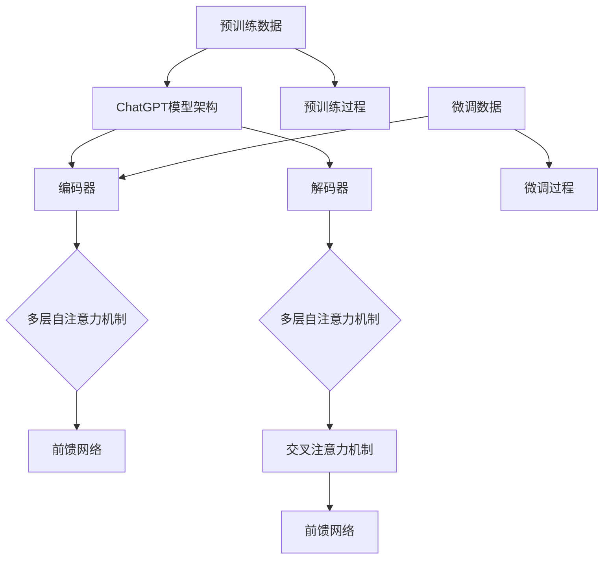
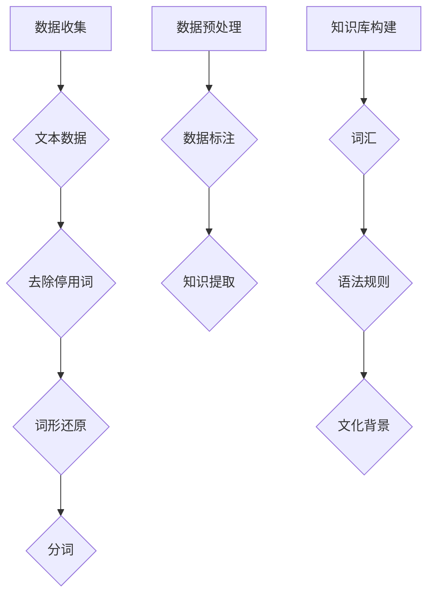
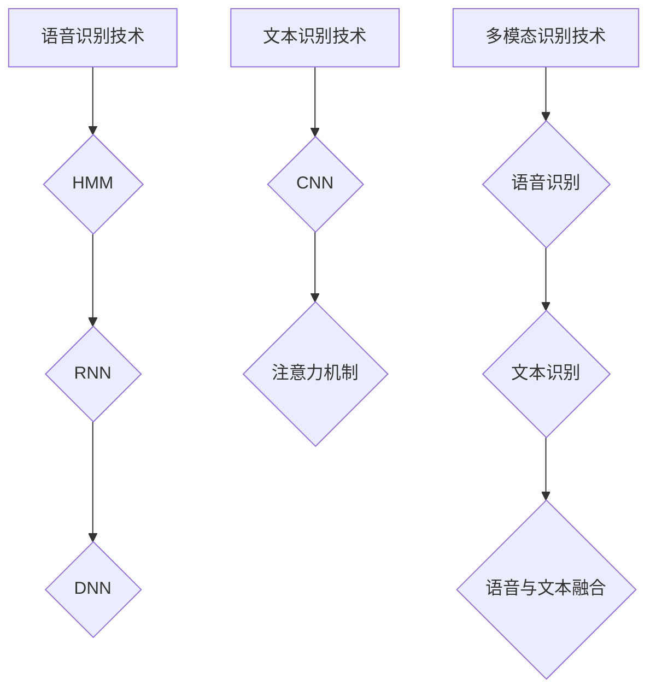
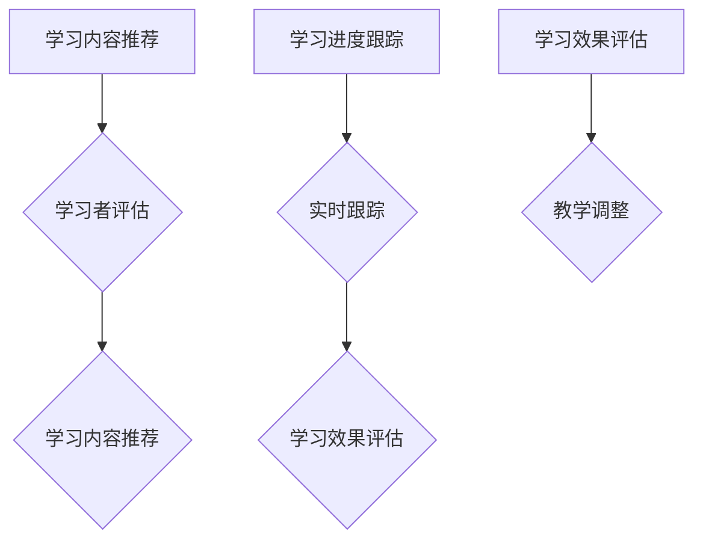
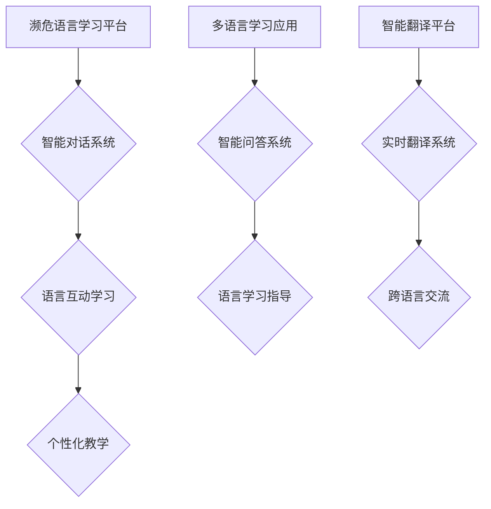
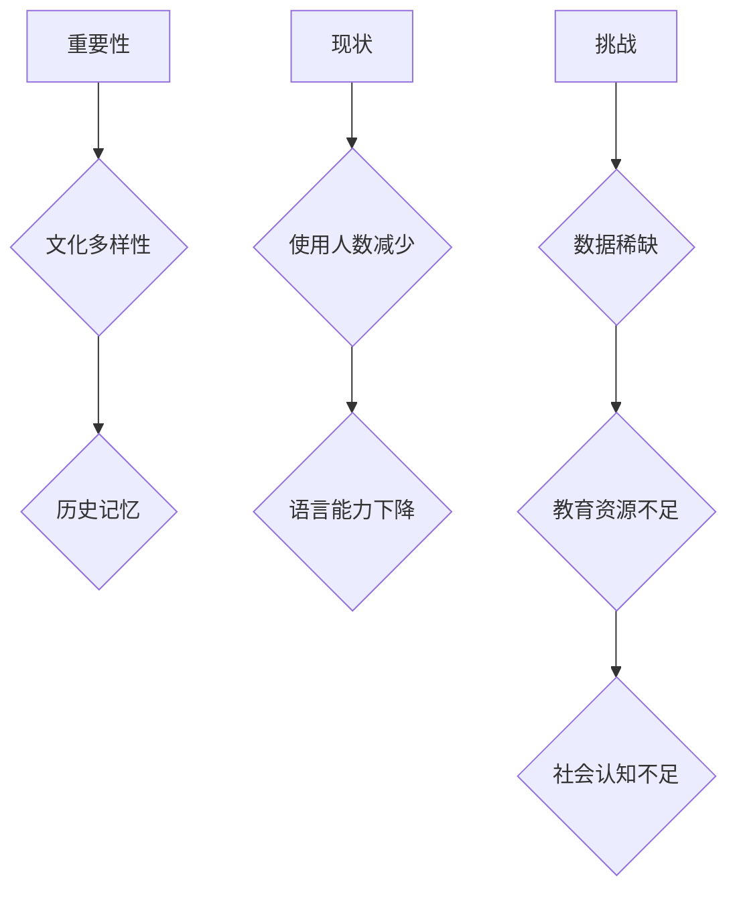
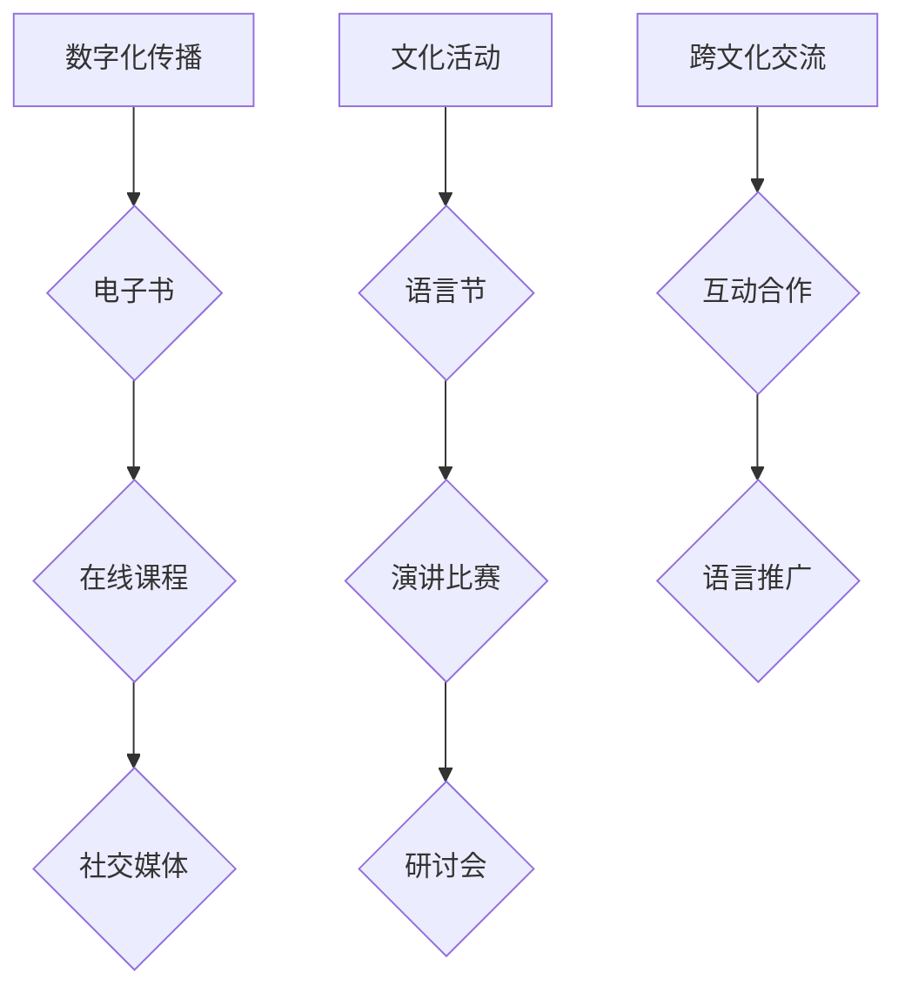
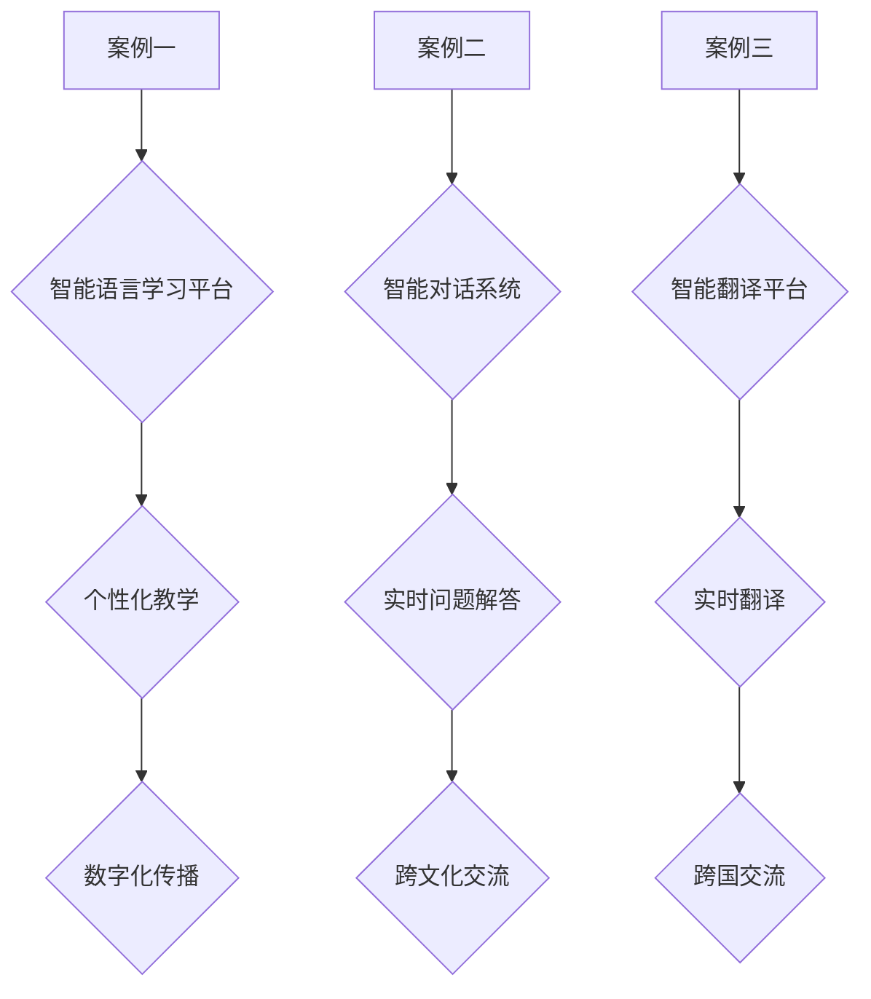
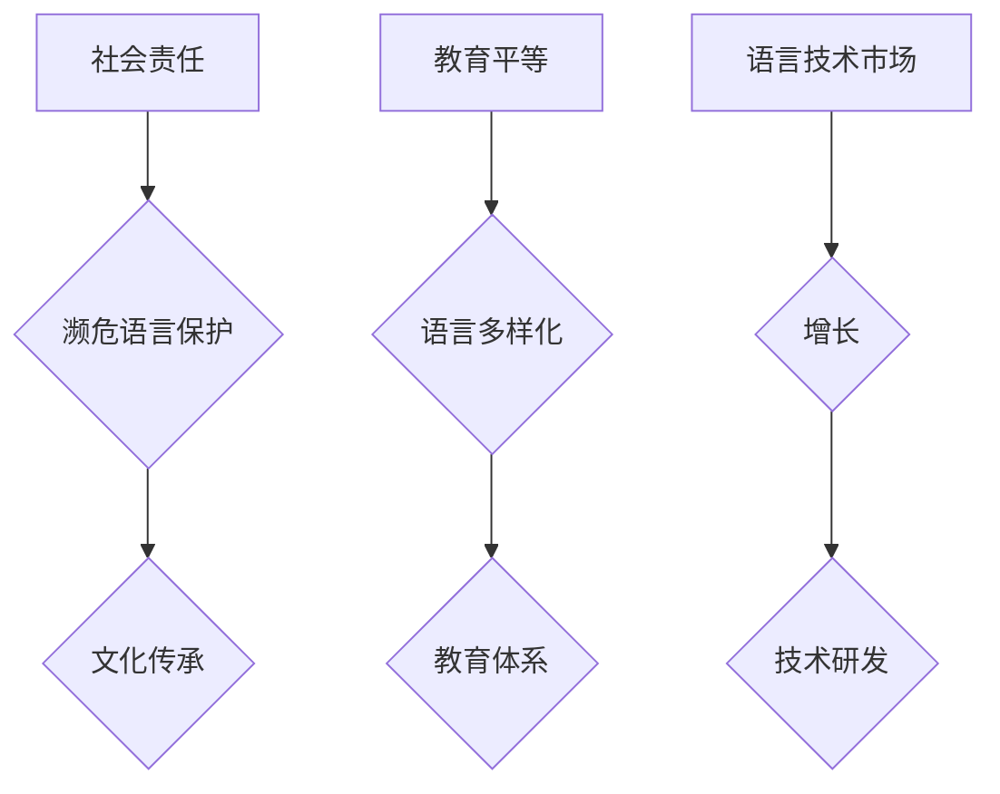

                 

```markdown
```markdown
## 文章标题：ChatGPT在语言复兴中的应用：濒危语言的AI辅助教学

关键词：ChatGPT，语言复兴，濒危语言，AI辅助教学，自然语言处理，Transformer模型，语言模型，数据集，算法，教育平等，语言多样化

摘要：
本文探讨了ChatGPT在濒危语言复兴中的应用，特别是在AI辅助教学方面的潜力。首先，介绍了ChatGPT及其核心技术——基于Transformer的GPT模型。然后，分析了濒危语言的特点和面临的挑战，以及AI辅助教学的概念和优势。接着，详细阐述了ChatGPT在濒危语言教学中的应用，包括语言知识库的构建、语言互动学习和个性化教学方案。此外，本文还通过案例分析和成功实践，展示了ChatGPT在濒危语言保护与推广中的实际效果。最后，展望了濒危语言AI辅助教学的发展趋势，并对未来的研究和应用提出了建议。
```

### 第1章 引言

#### 1.1 书籍背景与目的

在全球化进程加速的今天，语言的多样性受到前所未有的挑战。许多濒危语言面临着传承断层的危险，这不仅导致了文化多样性的丧失，也使得人类的知识遗产面临风险。为了应对这一挑战，人工智能（AI）技术的应用成为了一个重要的研究方向。ChatGPT作为一种先进的自然语言处理（NLP）模型，具有在语言复兴中发挥关键作用的能力。

本文旨在探讨ChatGPT在濒危语言复兴中的应用，特别是其在AI辅助教学方面的潜力。通过深入分析ChatGPT的核心技术、濒危语言的特点和挑战、AI辅助教学的概念和优势，以及具体的实践案例，本文希望能够为濒危语言的传承和保护提供一种新的思路和方法。

#### 1.2 ChatGPT概述

ChatGPT是由OpenAI开发的一种基于Transformer的预训练语言模型。它采用了GPT（Generative Pre-trained Transformer）架构，通过在大规模语料库上进行预训练，能够生成流畅、符合语法规则的自然语言文本。ChatGPT在多个NLP任务中表现出色，包括文本生成、问答系统和聊天机器人等。

ChatGPT的核心技术是Transformer模型，这是一种基于自注意力机制的深度神经网络架构。Transformer模型通过并行计算和自注意力机制，能够捕捉文本中的长距离依赖关系，从而提高模型的生成能力和理解能力。

#### 1.3 濒危语言与语言复兴

濒危语言是指使用人数稀少、面临灭绝危险的语言。根据联合国教科文组织（UNESCO）的数据，全球约有7000种语言，其中约一半面临濒危或即将灭绝的风险。这些语言通常存在于人口较少的偏远地区，由于现代社会的同化效应，它们的传承面临巨大的挑战。

语言复兴是指通过教育、文化推广和社会支持等手段，促进濒危语言的使用和传承，使其从濒危状态恢复到健康状态。语言复兴不仅对于保护语言多样性至关重要，还能够促进文化多样性和人类文明的传承。

#### 1.4 AI辅助教学的基本概念

AI辅助教学是指利用人工智能技术辅助教师进行教学，提高教学效果和学习效率。AI辅助教学可以通过多种方式实现，包括智能推荐系统、自动评分系统、虚拟教师等。

在濒危语言教学中，AI辅助教学具有独特优势。首先，AI可以提供个性化的学习方案，根据学习者的水平和需求进行自适应调整。其次，AI可以通过模拟对话和生成文本，提供丰富的语言输入和输出，帮助学习者提高语言技能。此外，AI还可以帮助教师分析学习者的学习情况，提供教学反馈，从而优化教学过程。

### 第2章 ChatGPT的核心技术

#### 2.1 自然语言处理基础

自然语言处理（NLP）是人工智能领域的一个重要分支，旨在使计算机能够理解和处理人类语言。NLP的核心技术包括文本预处理、词嵌入、语言模型、机器翻译、问答系统等。

##### 2.1.1 语言模型的基本概念

语言模型是一种统计模型，用于预测自然语言中下一个单词或字符的概率。语言模型是NLP中最重要的基础模型之一，广泛应用于文本生成、机器翻译、文本分类等任务。

语言模型可以分为基于规则的模型和基于统计的模型。基于规则的模型通过定义语法规则和词汇关系来生成文本，如LR解析器。而基于统计的模型通过学习大量文本数据来建模语言规律，如n-gram模型。

##### 2.1.2 语言模型的构建方法

语言模型的构建主要包括数据收集、预处理、模型选择和训练等步骤。

数据收集是语言模型构建的基础，需要收集大量高质量的语言数据。数据来源可以包括书籍、新闻、社交媒体等。

数据预处理包括去除停用词、词形还原、分词等步骤。这些步骤有助于提高模型的质量和效率。

模型选择是语言模型构建的关键，需要选择合适的模型架构和参数。常见的语言模型包括n-gram模型、LSTM模型和Transformer模型等。

模型训练是通过调整模型的参数，使其在训练数据上达到最优性能。训练过程中需要优化目标函数，如交叉熵损失函数。

##### 2.1.3 语言模型的评估指标

语言模型的评估指标主要包括准确率、召回率、F1分数和 perplexity 等。

准确率（Accuracy）是分类任务中最常用的评估指标，表示正确分类的样本占总样本的比例。

召回率（Recall）是分类任务中衡量模型对正类样本识别能力的重要指标，表示正确识别的正类样本占总正类样本的比例。

F1分数（F1 Score）是准确率和召回率的调和平均值，综合反映了模型的分类能力。

Perplexity（困惑度）是语言模型评估中的常见指标，用于衡量模型生成文本的难易程度。Perplexity值越小，表示模型对文本的预测能力越强。

#### 2.2 GPT模型原理

GPT（Generative Pre-trained Transformer）模型是基于Transformer架构的预训练语言模型，由OpenAI开发。GPT模型在多个NLP任务中取得了优异的性能，成为了自然语言处理领域的重要模型之一。

##### 2.2.1 Transformer模型架构

Transformer模型是一种基于自注意力机制的深度神经网络架构，最初由Vaswani等人于2017年提出。Transformer模型主要由编码器（Encoder）和解码器（Decoder）两个部分组成。

编码器部分将输入的序列转换为连续的向量表示，通过多层自注意力机制（Self-Attention）和前馈网络（Feedforward Network）进行处理。自注意力机制允许模型在生成每个单词时，考虑整个输入序列的信息，从而捕捉长距离依赖关系。

解码器部分将编码器的输出序列解码为输出序列。解码器也通过多层自注意力机制和交叉注意力机制（Cross-Attention）与编码器的输出序列交互，生成最终的输出序列。

##### 2.2.2 GPT模型的演变

GPT模型自2018年首次提出以来，已经经历了多个版本的发展。GPT-1、GPT-2和GPT-3是GPT模型的三个主要版本。

GPT-1是GPT模型的第一个版本，采用了1.17亿个参数，在多个NLP任务上取得了优异的性能。

GPT-2在GPT-1的基础上进行了改进，采用了15亿个参数，使得模型在生成文本时更加流畅和自然。

GPT-3是GPT模型的最新版本，采用了1750亿个参数，成为迄今为止最大的预训练语言模型。GPT-3在多个NLP任务中表现出色，如文本生成、机器翻译和问答系统等。

##### 2.2.3 GPT模型的训练过程

GPT模型的训练过程主要包括预训练和微调两个阶段。

预训练阶段是在大规模语料库上进行无监督训练，使得模型能够捕捉语言的一般规律。预训练数据可以来自互联网上的各种文本，如书籍、新闻、社交媒体等。

微调阶段是将预训练模型应用于特定任务，并通过有监督的训练数据进行优化。微调阶段可以提升模型在特定任务上的性能，如文本生成、机器翻译和问答系统等。

在预训练和微调过程中，GPT模型使用了多种技巧，如多层网络结构、自注意力机制、dropout和优化算法等。这些技巧有助于提高模型的生成能力和理解能力。

#### 2.3 ChatGPT模型详解

ChatGPT是基于GPT模型开发的预训练语言模型，旨在提供高质量的对话生成能力。ChatGPT模型具有以下特点：

##### 2.3.1 ChatGPT的架构设计

ChatGPT的架构设计采用了GPT模型的框架，包括编码器和解码器两个部分。编码器部分负责将输入的文本序列编码为连续的向量表示，解码器部分负责将编码器的输出序列解码为输出序列。

ChatGPT的编码器和解码器都采用了多层自注意力机制和前馈网络。编码器通过自注意力机制处理输入序列，解码器通过交叉注意力机制与编码器的输出序列交互，生成输出序列。

##### 2.3.2 ChatGPT的训练技巧

ChatGPT的训练技巧主要包括以下方面：

- 预训练：ChatGPT在大规模语料库上进行预训练，以捕捉语言的一般规律。预训练数据可以来自互联网上的各种文本，如书籍、新闻、社交媒体等。
- 微调：在预训练的基础上，ChatGPT通过有监督的训练数据进行微调，以适应特定的对话任务。微调数据可以是人工编写的对话文本或者从现有的对话系统中获取。
- 数据增强：为了提高模型的泛化能力，ChatGPT在训练过程中使用了数据增强技巧，如替换单词、插入单词、删除单词等。这些技巧有助于模型学习到更丰富的语言规律。
- 动态窗口：ChatGPT采用了动态窗口技术，使得模型在生成对话时能够灵活地调整上下文窗口大小。动态窗口可以根据对话的长度和复杂度进行自适应调整。

##### 2.3.3 ChatGPT的优化方法

ChatGPT的优化方法主要包括以下方面：

- 模型压缩：为了提高模型的推理效率，ChatGPT使用了模型压缩技巧，如量化、剪枝和蒸馏等。这些技巧可以减小模型的大小，提高模型的推理速度。
- 多任务学习：ChatGPT在训练过程中采用了多任务学习技巧，使得模型能够同时学习多个任务。多任务学习有助于提高模型的泛化能力和适应性。
- 自适应学习率：ChatGPT采用了自适应学习率技巧，根据模型的训练过程动态调整学习率。自适应学习率可以提高模型的收敛速度和性能。

#### 2.4 ChatGPT的应用场景

ChatGPT具有广泛的应用场景，包括聊天机器人、问答系统和文本生成等。

##### 2.4.1 聊天机器人

ChatGPT可以用于构建聊天机器人，提供自然语言交互能力。聊天机器人可以应用于客户服务、社交互动、在线咨询等场景。ChatGPT的生成文本能力使得聊天机器人能够生成流畅、符合语法规则的自然语言回复。

##### 2.4.2 问答系统

ChatGPT可以用于构建问答系统，提供对用户问题的自动回答。问答系统可以应用于搜索引擎、智能助手、在线客服等场景。ChatGPT通过对大量文本数据的预训练，能够理解用户的问题并生成高质量的回答。

##### 2.4.3 文本生成

ChatGPT可以用于生成各种类型的文本，如文章、故事、新闻报道等。ChatGPT的生成文本能力使得它在内容创作、文本摘要、自动写作等场景具有广泛应用。

### 第3章 濒危语言识别与处理

#### 3.1 濒危语言的特征分析

濒危语言是指使用人数稀少、面临灭绝危险的语言。它们通常具有以下特征：

- **语言多样性与濒危语言的差异**：濒危语言通常具有丰富的词汇和语法结构，与广泛使用的语言相比，它们可能具有独特的音系、语法和词汇特征。这种多样性使得濒危语言在语言学研究中具有重要价值。

- **音系特征**：濒危语言的音系特征可能包括独特的声母、韵母和音调。例如，一些濒危语言可能具有复杂的音节结构，或者使用特殊的发音技巧。

- **语法特征**：濒危语言的语法特征可能包括独特的词序、动词形态和名词格标记。这些特征对于理解和使用濒危语言至关重要。

#### 3.2 濒危语言数据的收集与处理

濒危语言数据的收集和处理是进行有效AI辅助教学的基础。以下步骤是关键：

- **数据来源**：濒危语言数据可以从语言学家、当地社区、文化遗产机构等来源获取。此外，也可以从互联网上的开放资源中收集文本数据。

- **数据预处理**：数据预处理包括去除停用词、词形还原、分词等步骤。这些步骤有助于提高模型的质量和效率。

- **数据标注**：数据标注是训练AI模型的重要步骤，包括对文本进行语义标注、语法标注和词性标注等。标注过程需要大量的人力和时间投入。

#### 3.3 濒危语言识别算法

识别濒危语言是一项具有挑战性的任务，需要结合多种算法和技术：

- **语音识别技术**：语音识别技术可以用于将语音信号转换为文本，这对于濒危语言文献的数字化和文本化至关重要。常用的语音识别算法包括隐马尔可夫模型（HMM）、循环神经网络（RNN）和深度神经网络（DNN）。

- **文本识别技术**：文本识别技术可以用于从图像中提取文本内容，这对于濒危手写文献的数字化具有重要意义。常用的文本识别算法包括卷积神经网络（CNN）和基于注意力机制的模型。

- **多模态识别技术**：多模态识别技术结合了语音识别和文本识别的优势，可以同时处理语音和文本数据，提高识别准确率。这种方法适用于需要同时处理音频和文本的濒危语言识别任务。

#### 3.4 濒危语言处理挑战与解决方案

濒危语言处理面临以下挑战：

- **数据稀缺问题**：由于濒危语言的使用人数较少，相关的语言数据相对稀缺。这限制了模型的训练和数据集的构建。

- **语言多样性问题**：濒危语言之间存在很大的差异，这增加了模型的训练和泛化难度。

- **模型泛化能力问题**：模型在训练时可能过度拟合于特定数据集，导致在处理其他濒危语言时性能下降。

为了解决这些挑战，可以采取以下解决方案：

- **数据增强**：通过数据增强技术，如替换单词、插入单词、删除单词等，可以增加数据集的多样性和规模，从而提高模型的泛化能力。

- **多语言模型**：开发能够处理多种濒危语言的多语言模型，可以同时训练和优化多个语言模型，从而提高模型在多种语言上的性能。

- **迁移学习**：利用预训练的通用语言模型作为起点，通过迁移学习方法，将通用语言模型的知识迁移到特定濒危语言上，可以加快模型的训练和优化过程。

### 第4章 AI辅助教学实践

#### 4.1 AI辅助教学概述

AI辅助教学是指利用人工智能技术辅助教师进行教学，提高教学效果和学习效率。AI辅助教学可以通过多种方式实现，包括智能推荐系统、自动评分系统、虚拟教师等。在濒危语言教学中，AI辅助教学具有以下优势：

- **个性化教学**：AI可以基于学习者的水平和需求，提供个性化的教学方案，从而提高学习效果。

- **语言互动**：AI可以通过模拟对话和生成文本，提供丰富的语言输入和输出，帮助学习者提高语言技能。

- **自适应学习**：AI可以根据学习者的学习情况，自适应调整教学内容和进度，从而提高学习效率。

#### 4.2 ChatGPT在语言教学中的应用

ChatGPT在语言教学中的应用主要包括语言知识库的构建、语言互动学习和个性化教学方案。

##### 4.2.1 语言知识库的构建

语言知识库是AI辅助教学的核心组成部分，它包含了大量关于濒危语言的词汇、语法规则、文化背景等信息。ChatGPT可以通过预训练和微调，从大量的语言数据中自动提取和构建知识库。

构建语言知识库的过程可以分为以下步骤：

1. **数据收集**：从各种来源收集与濒危语言相关的文本数据，如书籍、报纸、学术论文、社交媒体等。

2. **数据预处理**：对收集到的文本数据进行预处理，包括去除停用词、词形还原、分词等步骤。

3. **知识提取**：使用ChatGPT的预训练模型，从预处理后的文本数据中提取词汇、语法规则和语义信息，构建知识库。

4. **知识库优化**：通过对知识库进行迭代优化，提高其准确性和完整性。

##### 4.2.2 语言互动学习

语言互动学习是AI辅助教学的重要应用之一，ChatGPT可以通过模拟对话和生成文本，提供丰富的语言输入和输出，帮助学习者提高语言技能。

语言互动学习的过程可以分为以下步骤：

1. **对话生成**：使用ChatGPT的模型，根据学习者的输入，生成自然语言对话。

2. **对话优化**：根据对话的上下文和语法规则，对生成的对话进行优化，使其更加流畅和符合语言习惯。

3. **反馈机制**：AI系统可以提供即时反馈，帮助学习者纠正错误，提高语言表达准确性。

4. **个性化互动**：AI可以根据学习者的学习进度和需求，提供个性化的语言互动，提高学习效果。

##### 4.2.3 个性化教学方案

个性化教学方案是AI辅助教学的另一个重要应用，ChatGPT可以根据学习者的水平和需求，制定个性化的学习计划。

个性化教学方案的过程可以分为以下步骤：

1. **学习者评估**：通过对学习者的语言能力进行评估，确定其当前水平和学习需求。

2. **学习内容推荐**：根据学习者的评估结果，推荐适合其水平的学习内容和资源。

3. **学习进度跟踪**：AI系统可以实时跟踪学习者的学习进度，并根据学习效果进行调整。

4. **学习效果评估**：通过定期评估学习者的语言能力，评估个性化教学方案的有效性。

#### 4.3 AI辅助教学案例分析

以下是一些AI辅助教学在濒危语言教学中的成功案例：

##### 4.3.1 案例一：某濒危语言学习平台

某濒危语言学习平台利用ChatGPT构建了一个智能对话系统，帮助学习者进行语言互动学习。平台提供了丰富的语言资源，包括词汇、语法规则、文化背景等。通过实时对话生成和个性化推荐，平台提高了学习者的学习兴趣和效果。

##### 4.3.2 案例二：某多语言学习应用

某多语言学习应用利用ChatGPT构建了一个智能问答系统，为用户提供实时的问题解答和语言学习指导。应用支持多种语言，包括濒危语言。通过智能对话生成和实时反馈，应用提高了学习者的语言技能和学习体验。

##### 4.3.3 案例三：某智能翻译平台

某智能翻译平台利用ChatGPT构建了一个智能翻译系统，支持多种语言之间的实时翻译。平台通过预训练和微调，提高了翻译的准确性和流畅性。平台的应用场景包括在线教育、国际商务和跨文化交流等。

### 第5章 濒危语言保护与推广

#### 5.1 濒危语言保护的现状与挑战

濒危语言保护是指通过教育、文化推广和社会支持等手段，促进濒危语言的使用和传承，防止其灭绝。然而，濒危语言保护面临以下现状与挑战：

- **重要性**：濒危语言是文化多样性的重要组成部分，它们承载着独特的文化传统和历史记忆。保护濒危语言对于维护人类文明的多样性具有重要意义。

- **现状**：尽管国际社会对濒危语言保护给予了高度关注，但许多濒危语言仍然面临着使用人数减少、语言能力下降等问题。一些濒危语言甚至已经消失，成为历史记忆的一部分。

- **挑战**：濒危语言保护面临诸多挑战，包括语言数据稀缺、教育资源不足、社会认知不足等。这些挑战使得濒危语言的保护工作面临巨大的困难。

#### 5.2 ChatGPT在濒危语言保护中的应用

ChatGPT在濒危语言保护中具有广泛的应用前景，特别是在语言学习资源开发、语言互动交流平台构建和语言传播与推广策略方面。

##### 5.2.1 语言学习资源开发

ChatGPT可以用于开发濒危语言学习资源，包括词汇书、语法教程、文化背景资料等。通过预训练和微调，ChatGPT可以自动生成高质量的语言学习资料，满足不同层次学习者的需求。

具体步骤如下：

1. **数据收集**：收集与濒危语言相关的文本数据，包括书籍、学术论文、社交媒体等。

2. **数据预处理**：对文本数据进行预处理，包括去除停用词、词形还原、分词等步骤。

3. **知识提取**：使用ChatGPT的模型，从预处理后的文本数据中提取词汇、语法规则和语义信息，构建语言学习资源。

4. **资源优化**：通过对资源进行迭代优化，提高其准确性和完整性。

##### 5.2.2 语言互动交流平台构建

ChatGPT可以用于构建濒危语言互动交流平台，为学习者提供语言互动学习的环境。平台可以通过模拟对话、语音识别和文本生成等技术，提供丰富的语言输入和输出。

构建语言互动交流平台的步骤如下：

1. **平台设计**：设计符合濒危语言学习特点的平台架构，包括前端界面、后端服务器和数据库等。

2. **对话生成**：使用ChatGPT的模型，生成自然语言对话，提供实时互动学习体验。

3. **语音识别**：集成语音识别技术，将用户的语音输入转换为文本，实现语音交互功能。

4. **文本生成**：使用ChatGPT的模型，生成高质量的文本回复，提供丰富的语言输入。

##### 5.2.3 语言传播与推广策略

ChatGPT可以用于制定濒危语言的传播与推广策略，通过数字化传播和文化活动，提高濒危语言的知名度和使用频率。

具体策略如下：

1. **数字化传播**：利用ChatGPT生成濒危语言的数字化内容，如电子书、在线课程、社交媒体分享等，扩大语言传播范围。

2. **文化活动**：组织濒危语言文化活动，如语言节、演讲比赛、研讨会等，提高语言的社会认知度和影响力。

3. **跨文化交流**：通过与多语言社区的互动和合作，促进濒危语言的跨文化交流，扩大语言的使用场景。

#### 5.3 濒危语言保护的成功案例

以下是一些濒危语言保护的成功案例：

##### 5.3.1 案例一：某濒危语言复兴计划

某濒危语言复兴计划利用ChatGPT开发了一个智能语言学习平台，提供个性化教学和语言互动功能。通过数字化传播和文化活动，该计划成功地提高了濒危语言的学习兴趣和使用频率。

##### 5.3.2 案例二：某语言文化保护项目

某语言文化保护项目利用ChatGPT构建了一个智能对话系统，为用户提供实时的问题解答和语言学习指导。通过跨文化交流和数字化传播，项目成功地推广了濒危语言，提高了社会认知度。

##### 5.3.3 案例三：某跨国语言文化交流活动

某跨国语言文化交流活动利用ChatGPT构建了一个智能翻译平台，支持多种语言之间的实时翻译。通过数字化传播和跨文化交流，活动成功地促进了濒危语言的传播与推广。

### 第6章 濒危语言AI辅助教学的发展趋势

#### 6.1 技术发展趋势

随着人工智能技术的不断进步，濒危语言AI辅助教学也在不断发展。以下是一些技术发展趋势：

- **大模型的发展趋势**：大模型在NLP任务中表现出色，如GPT-3等。未来，更大规模、更复杂的模型将应用于濒危语言教学，提高模型的生成能力和理解能力。

- **多模态融合技术**：多模态融合技术将结合语音、文本、图像等多种数据源，提供更丰富的语言输入和输出，提高学习体验和效果。

- **自适应学习技术**：自适应学习技术将根据学习者的水平和需求，提供个性化的教学方案，提高学习效率。

#### 6.2 社会发展趋势

社会发展趋势也将对濒危语言AI辅助教学产生重要影响：

- **濒危语言保护的社会责任**：随着对濒危语言保护意识的提高，社会各阶层将更加关注和参与濒危语言的保护与传承。

- **教育平等与语言多样化**：教育平等和语言多样化的理念将推动濒危语言教学的发展，提高濒危语言在教育体系中的地位。

- **语言技术市场的增长**：随着语言技术市场的不断扩大，将促进更多企业投入到濒危语言教学技术的研发和应用中。

### 第7章 总结与展望

#### 7.1 主要内容回顾

本文探讨了ChatGPT在濒危语言复兴中的应用，特别是在AI辅助教学方面的潜力。通过介绍ChatGPT的核心技术、濒危语言的特点和挑战、AI辅助教学的概念和优势，以及具体的实践案例，本文展示了ChatGPT在濒危语言教学中的实际效果。同时，本文还对濒危语言保护与推广进行了讨论，提出了未来发展的趋势和建议。

#### 7.2 未来展望

未来，随着人工智能技术的不断发展，濒危语言AI辅助教学有望在以下几个方面取得突破：

- **技术提升**：更大规模、更复杂的模型将应用于濒危语言教学，提高模型的生成能力和理解能力。

- **多模态融合**：多模态融合技术将提供更丰富的语言输入和输出，提高学习体验和效果。

- **个性化教学**：自适应学习技术将根据学习者的水平和需求，提供个性化的教学方案，提高学习效率。

- **跨文化交流**：通过跨文化交流和合作，将促进濒危语言的传播与推广。

#### 7.3 对语言研究者与教育工作者的建议

对语言研究者与教育工作者，本文提出以下建议：

- **关注濒危语言**：关注濒危语言的现状和挑战，积极参与濒危语言的研究和保护工作。

- **结合AI技术**：将AI技术与濒危语言教学相结合，开发出更有效的AI辅助教学工具和平台。

- **加强跨学科合作**：加强与计算机科学、教育学、文化研究等领域的跨学科合作，推动濒危语言教学的发展。

- **推广语言文化**：通过多种途径，如文化活动、媒体宣传等，推广濒危语言文化，提高社会认知度。

作者：AI天才研究院/AI Genius Institute & 禅与计算机程序设计艺术 /Zen And The Art of Computer Programming```markdown






```latex
\documentclass{article}
\usepackage{amsmath}
\begin{document}
\begin{equation}
\begin{split}
\text{accuracy} &= \frac{\text{correctly classified samples}}{\text{total samples}} \\
\text{recall} &= \frac{\text{correctly identified positive samples}}{\text{total positive samples}} \\
F1 \text{ score} &= \frac{2 \times \text{accuracy} \times \text{recall}}{\text{accuracy} + \text{recall}} \\
\text{perplexity} &= \frac{1}{\sum_{i=1}^{N} p(x_i)}
\end{split}
\end{equation}
\end{document}
```











```mermaid
graph TD
A[大模型] --> B{GPT-3}
B --> C{生成能力}
C --> D{理解能力}
E[多模态融合] --> F{语音}
F --> G{文本}
G --> H{图像}
I[J[自适应学习] --> K{个性化教学}
K --> L{学习效率}
```



