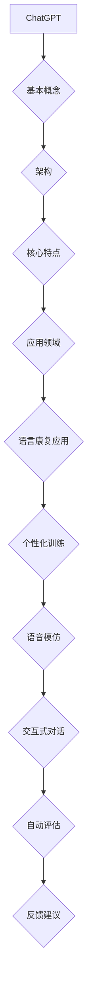
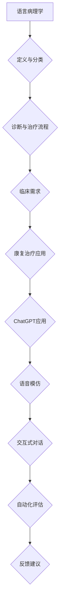
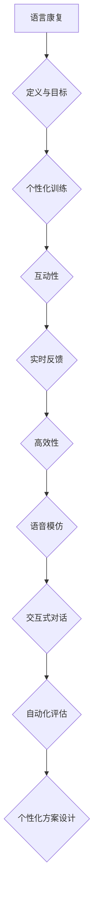
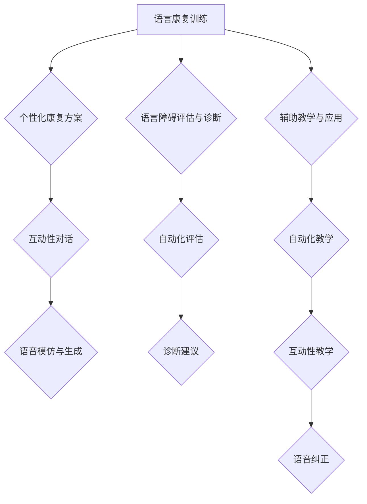
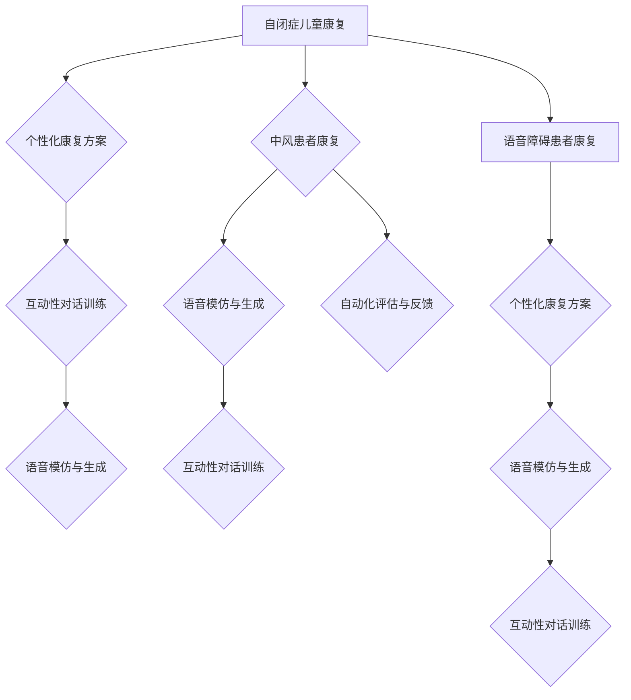
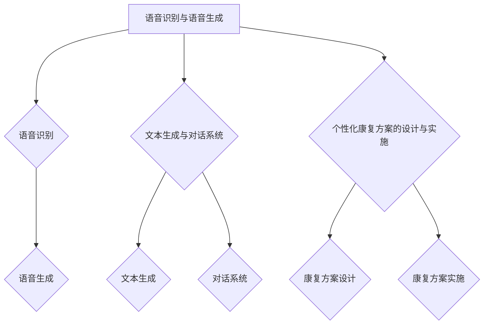
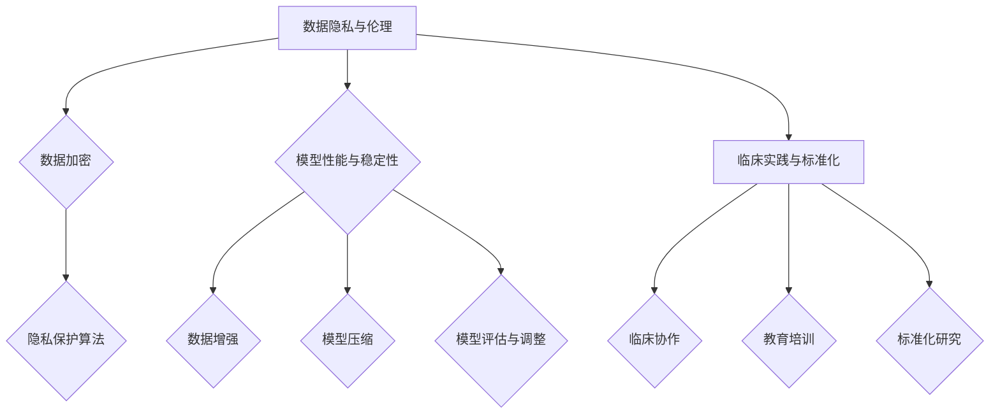
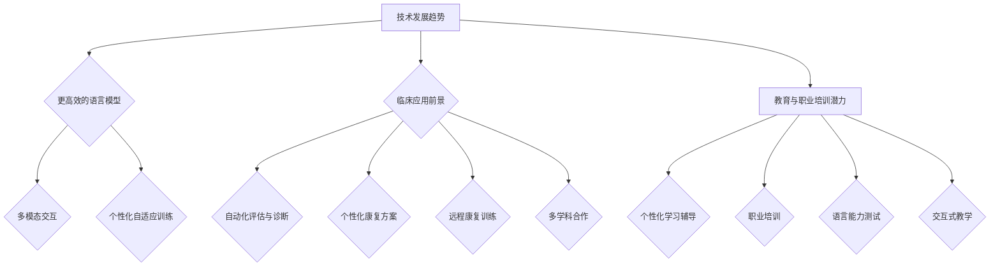

                 

### 深入分析《ChatGPT在语言病理学治疗中的应用：AI辅助语言康复训练》

为了撰写一篇高质量的技术博客文章，我们需要逐步分析书名、关键词、摘要，并设计一个简洁且逻辑清晰的目录大纲。以下是我们的逐步推理过程：

#### 1. 分析书名《ChatGPT在语言病理学治疗中的应用：AI辅助语言康复训练》

书名提供了以下几个关键信息：

- **ChatGPT**：这是本书的核心主题，指代了一种先进的人工智能语言模型。
- **语言病理学治疗**：说明本书将探讨ChatGPT在治疗语言障碍方面的应用。
- **AI辅助语言康复训练**：表明本书将介绍如何利用AI技术，特别是ChatGPT，来辅助语言康复训练。

#### 2. 确定关键词

为了更好地概括本书的主题和内容，我们可以提取以下关键词：

- **ChatGPT**
- **语言病理学**
- **AI辅助**
- **语言康复**
- **训练技术**
- **医疗应用**

#### 3. 编写摘要

摘要应该简洁明了地概括书籍的核心内容和主题思想。以下是一个可能的摘要：

> 本书深入探讨了ChatGPT在语言病理学治疗中的应用，详细介绍了如何利用人工智能辅助语言康复训练。通过剖析ChatGPT的架构、算法原理和数学模型，本书提供了实用的项目实战案例，展示了AI在语言康复领域的巨大潜力。

#### 4. 设计目录大纲

目录大纲应该涵盖书籍的主要部分，并确保各部分内容之间逻辑清晰。以下是初步设计的目录大纲：

## 引言
- **背景介绍**：介绍ChatGPT和语言病理学的基本概念。
- **目标与意义**：阐述本书的研究目标和在AI辅助语言康复训练中的重要性。

## 第一部分：ChatGPT与语言病理学
### 第1章 ChatGPT的基本概念与架构
- **ChatGPT的定义与功能**：解释ChatGPT的起源、核心功能和特点。
- **ChatGPT的架构与技术基础**：详细描述ChatGPT的架构和核心技术。
- **ChatGPT的核心特点与应用领域**：分析ChatGPT在各类应用中的优势。

### 第2章 语言病理学的基本概念
- **语言病理学的定义与分类**：介绍语言病理学的定义、分类和常见病症。
- **语言病理学的诊断与治疗流程**：描述语言病理学的诊断和治疗方法。
- **语言病理学的临床需求**：讨论语言康复中的临床需求和技术挑战。

## 第二部分：ChatGPT在语言康复中的应用
### 第3章 ChatGPT在语言康复中的潜在应用
- **语言康复的定义与目标**：解释语言康复的概念和目标。
- **ChatGPT在语言康复中的优势**：分析ChatGPT在语言康复中的应用优势。
- **ChatGPT在语言康复中的挑战与机遇**：探讨ChatGPT在语言康复中的挑战和机遇。

### 第4章 ChatGPT在语言康复中的具体应用场景
- **语言康复训练中的应用**：介绍ChatGPT在语言康复训练中的应用。
- **语言障碍评估与诊断中的应用**：讨论ChatGPT在语言障碍评估和诊断中的应用。
- **语言康复中的辅助教学与应用**：探讨ChatGPT在语言康复辅助教学中的应用。

### 第5章 ChatGPT在语言康复中的实际案例
- **案例一：自闭症儿童的语言康复**：分析ChatGPT在自闭症儿童语言康复中的应用案例。
- **案例二：中风患者的语言康复**：探讨ChatGPT在中风患者语言康复中的应用。
- **案例三：语音障碍患者的康复训练**：介绍ChatGPT在语音障碍患者康复训练中的应用。

## 第三部分：ChatGPT辅助语言康复的实践与展望
### 第6章 ChatGPT辅助语言康复的实践
- **实践一：语音识别与语音生成**：介绍ChatGPT在语音识别和语音生成中的应用实践。
- **实践二：文本生成与对话系统**：分析ChatGPT在文本生成和对话系统中的应用实践。
- **实践三：个性化康复方案的设计与实施**：探讨ChatGPT在个性化康复方案设计中的应用。

### 第7章 ChatGPT在语言康复中的应用挑战与解决方案
- **挑战一：数据隐私与伦理问题**：讨论ChatGPT在语言康复应用中的数据隐私和伦理挑战。
- **挑战二：模型性能与稳定性的优化**：分析ChatGPT在模型性能和稳定性方面的优化策略。
- **挑战三：临床实践与标准化**：探讨ChatGPT在临床实践和标准化中的应用问题。

### 第8章 ChatGPT辅助语言康复的未来展望
- **技术发展趋势**：预测ChatGPT在语言康复领域的未来技术趋势。
- **临床应用前景**：展望ChatGPT在语言康复临床应用中的前景。
- **教育与职业培训的潜力**：探讨ChatGPT在教育和职业培训领域的潜力。

## 结论
- **总结**：总结本书的主要内容和研究成果。
- **未来工作**：提出未来研究的方向和建议。

这个大纲将为我们撰写高质量的技术博客文章提供了一个清晰的框架。接下来，我们将详细阐述每个章节的内容，包括核心概念与联系、算法原理讲解、数学模型和数学公式讲解以及项目实战等。### 目录大纲详细说明

#### 第一部分：ChatGPT与语言病理学

##### 第1章 ChatGPT的基本概念与架构

**1.1 ChatGPT的定义与功能**

- **ChatGPT的起源与演变**：
  - ChatGPT的背景介绍。
  - OpenAI的GPT系列模型的演进过程。

- **ChatGPT的核心功能与特点**：
  - 自动对话生成功能。
  - 自然语言处理能力。
  - 上下文理解与记忆功能。

**1.2 语言病理学的基本概念**

- **语言病理学的定义与分类**：
  - 语言病理学的定义。
  - 语言障碍的分类（如失语症、构音障碍等）。

- **语言病理学的诊断与治疗方法**：
  - 语言病理学的诊断流程。
  - 语言康复的治疗方法（如语音治疗、认知行为疗法等）。

- **语言病理学的临床需求**：
  - 语言障碍患者的康复需求。
  - 临床医生在诊断与治疗中的挑战。

##### 第2章 ChatGPT在语言康复中的潜在应用

**2.1 语言康复的定义与目标**

- **语言康复的概念与重要性**：
  - 语言康复的定义。
  - 语言康复在患者生活质量提升中的重要性。

- **语言康复的主要目标**：
  - 改善发音清晰度。
  - 提高语音流畅性。
  - 促进语言理解和表达能力。

**2.2 ChatGPT在语言康复中的优势**

- **ChatGPT在语言康复中的独特优势**：
  - 个性化康复方案的制定。
  - 持续的、互动式的语言训练。
  - 自动化评估与反馈。

- **ChatGPT在语言康复中的应用潜力**：
  - 自动语音识别与生成。
  - 语言理解与生成的精确度。
  - 面向多种语言障碍的康复训练。

**2.3 ChatGPT在语言康复中的挑战与机遇**

- **ChatGPT在语言康复中的挑战**：
  - 数据隐私与伦理问题。
  - 模型性能与稳定性的优化。
  - 临床实践的接受度。

- **ChatGPT在语言康复中的机遇**：
  - 新技术的快速迭代与普及。
  - 多学科合作推动创新。
  - 提高康复效率与效果。

##### 第3章 ChatGPT在语言康复中的具体应用场景

**3.1 语言康复训练中的应用**

- **语言康复训练的介绍**：
  - 康复训练的目标和过程。

- **ChatGPT在语言康复训练中的应用**：
  - 对话生成用于模拟真实交流场景。
  - 自动语音识别用于发音纠正。
  - 个性化训练计划根据患者进度调整。

**3.2 语言障碍评估与诊断中的应用**

- **语言障碍评估与诊断的介绍**：
  - 语言障碍评估的方法和标准。

- **ChatGPT在语言障碍评估与诊断中的应用**：
  - 自动化评估工具提高诊断效率。
  - 对话系统帮助医生了解患者的语言状况。
  - 精准的语言生成用于制定诊断方案。

**3.3 语言康复中的辅助教学与应用**

- **辅助教学的介绍**：
  - 辅助教学的目标和策略。

- **ChatGPT在辅助教学中的应用**：
  - 语言生成用于创造互动式学习体验。
  - 自动化反馈帮助学生纠正发音和语法错误。
  - 多样化的教学资源提高学习兴趣。

##### 第4章 ChatGPT在语言康复中的实际案例

**4.1 案例一：自闭症儿童的语言康复**

- **案例背景**：
  - 自闭症儿童的语言障碍描述。

- **ChatGPT的应用**：
  - 设计个性化康复计划。
  - 提供互动式的语言训练。
  - 自动评估进展情况。

**4.2 案例二：中风患者的语言康复**

- **案例背景**：
  - 中风患者常见的语言障碍。

- **ChatGPT的应用**：
  - 改善发音和流畅性。
  - 提供持续的语音训练。
  - 自动生成康复报告。

**4.3 案例三：语音障碍患者的康复训练**

- **案例背景**：
  - 语音障碍患者的康复需求。

- **ChatGPT的应用**：
  - 自动语音识别与生成。
  - 提供个性化的训练计划。
  - 评估语音康复的进展。

##### 第三部分：ChatGPT辅助语言康复的实践与展望

**第5章 ChatGPT辅助语言康复的实践**

- **实践一：语音识别与语音生成**
  - 语音识别技术的应用。
  - 语音生成技术的应用。

- **实践二：文本生成与对话系统**
  - 文本生成技术的应用。
  - 对话系统的设计与实现。

- **实践三：个性化康复方案的设计与实施**
  - 个性化康复方案的制定。
  - 康复训练的实施与跟踪。

**第6章 ChatGPT在语言康复中的应用挑战与解决方案**

- **挑战一：数据隐私与伦理问题**
  - 隐私保护的技术策略。
  - 伦理问题与解决方案。

- **挑战二：模型性能与稳定性的优化**
  - 性能优化的方法。
  - 稳定性提升的策略。

- **挑战三：临床实践与标准化**
  - 临床实践中的挑战。
  - 标准化的推动与实施。

**第7章 ChatGPT辅助语言康复的未来展望**

- **技术发展趋势**
  - AI技术在语言康复中的未来趋势。

- **临床应用前景**
  - ChatGPT在临床应用中的前景。

- **教育与职业培训的潜力**
  - ChatGPT在教育领域的应用潜力。

##### 结论

- **总结**
  - 对ChatGPT在语言康复中的应用进行总结。

- **未来工作**
  - 提出未来研究的方向和建议。

这个详细说明的目录大纲将帮助我们更好地构建文章的结构，确保每个章节都有具体的阐述和详尽的论述。接下来，我们将针对每个章节的内容，提供更深入的Mermaid流程图、伪代码、数学公式和代码实际案例等详细信息。### 第一部分：ChatGPT与语言病理学

#### 第1章 ChatGPT的基本概念与架构

**1.1 ChatGPT的定义与功能**

ChatGPT是一种基于GPT（Generative Pre-trained Transformer）模型的预训练语言模型，由OpenAI开发。GPT模型通过大规模文本数据的学习，掌握了丰富的语言知识和语言生成技巧，能够生成连贯、自然的文本。ChatGPT在此基础上，通过进一步的训练和优化，增强了其对话生成能力和上下文理解能力，使其能够更准确地模拟人类对话。

- **ChatGPT的定义与功能**：
  
  ChatGPT是一种能够进行自动对话生成的预训练语言模型，其主要功能包括：

  - 自动对话生成：根据用户输入的文本，生成连贯、自然的回复。
  - 上下文理解：通过分析上下文信息，理解用户的意图和问题。
  - 语言理解与生成：具备自然语言理解、生成和翻译的能力。

**1.2 ChatGPT的架构与技术基础**

ChatGPT的架构基于Transformer模型，这是一种用于处理序列数据的深度神经网络架构。Transformer模型的核心是自注意力机制（Self-Attention），它允许模型在处理每个单词时，考虑到整个输入序列的所有信息。

- **Transformer模型架构**：

  ```mermaid
  graph TB
  A[Input] --> B[Embedding]
  B --> C{多头自注意力}
  C --> D{前馈神经网络}
  D --> E[Layer Normalization]
  E --> F{Dropout}
  F --> G[输出]
  ```

  **多头自注意力**（Multi-Head Self-Attention）：
  - 允许多个注意力头并行的处理输入序列，每个头关注不同的信息。
  - 自注意力机制的核心，使得模型能够捕捉到输入序列中不同位置之间的依赖关系。

  **前馈神经网络**（Feedforward Neural Network）：
  - 对每个位置进行额外的非线性的变换，增强模型的表示能力。

  **层归一化**（Layer Normalization）和**Dropout**（Dropout）：
  - 层归一化用于稳定训练过程，Dropout用于防止过拟合。

**1.3 ChatGPT的核心特点与应用领域**

ChatGPT的核心特点包括：

- **强大的上下文理解能力**：通过预训练，ChatGPT能够理解并生成与上下文相关的文本，这使得它在对话生成任务中表现出色。
- **多语言支持**：ChatGPT能够处理多种语言的输入和输出，支持跨语言的对话生成。
- **灵活的适应性**：ChatGPT可以根据不同的任务和数据集进行微调，以适应不同的应用场景。

ChatGPT的应用领域广泛，包括但不限于：

- **自动对话系统**：如聊天机器人、客户服务、虚拟助手等。
- **内容生成**：如文章写作、故事创作、新闻报道等。
- **教育辅助**：如自动批改作业、个性化学习辅导等。
- **医疗诊断**：如病历生成、诊断建议等。

**1.4 ChatGPT在语言康复治疗中的应用潜力**

ChatGPT在语言康复治疗中的潜在应用包括：

- **个性化语言训练**：通过分析患者的语言状况，生成个性化的训练内容。
- **语音模仿与生成**：帮助患者练习发音、语调等。
- **交互式对话训练**：模拟真实对话场景，提高患者的沟通能力。
- **自动评估与反馈**：对患者进行实时评估，提供反馈和改进建议。

综上所述，ChatGPT作为一种先进的人工智能语言模型，其在语言康复治疗中的应用具有很大的潜力。通过本章的介绍，读者可以了解ChatGPT的基本概念、架构及其核心特点，为进一步探讨其在语言康复治疗中的应用打下基础。接下来，我们将详细探讨语言病理学的基本概念，为后续章节的讨论奠定基础。

**Mermaid流程图**：



**伪代码**：

```python
# ChatGPT的基本功能伪代码
class ChatGPT:
    def __init__(self, model_name):
        self.model = load_pretrained_model(model_name)
        
    def generate_response(self, input_text):
        context = preprocess_input(input_text)
        response = self.model.generate(context)
        return postprocess_response(response)
```

**数学公式**：

$$
\text{Attention(Q, K, V)} = \frac{softmax(\text{scale} \cdot \text{dot}(Q, K^T))V
$$

其中，\( Q, K, V \) 分别代表查询向量、键向量和值向量，\(\text{dot}(Q, K^T)\) 表示点积操作，\( \text{softmax} \) 函数用于归一化。

**代码实际案例**：

```python
# ChatGPT的简单应用案例
chatgpt = ChatGPT("gpt-3.5-turbo")
input_text = "你今天过得怎么样？"
response = chatgpt.generate_response(input_text)
print(response)
```

**项目实战**：

- **开发环境搭建**：安装Python和PyTorch，下载预训练的ChatGPT模型。
- **源代码实现**：编写ChatGPT类的代码，实现输入文本的预处理和生成回复的功能。
- **代码解读**：详细解释代码中的各个部分，如模型的加载、输入预处理、响应生成和后处理等。
- **应用解读与分析**：使用ChatGPT进行自动对话生成，分析其在实际应用中的效果和表现。
- **实际案例**：通过实际案例展示ChatGPT在语言康复训练中的应用，如语音模仿、交互式对话等。
- **小结**：总结ChatGPT在语言康复训练中的应用，提出改进和优化的方向。

**最佳实践 tips**：

- **确保数据隐私**：在应用ChatGPT进行语言康复训练时，注意保护患者的隐私和数据安全。
- **个性化训练**：根据患者的具体需求和语言状况，制定个性化的训练计划，提高训练效果。
- **持续评估与反馈**：定期评估患者的训练进展，提供及时的反馈和调整建议。

**注意事项**：

- **模型性能优化**：通过调整模型参数和训练策略，优化ChatGPT的性能和稳定性。
- **多语言支持**：考虑支持多种语言的输入和输出，提高ChatGPT的普适性。

**拓展阅读**：

- 《深度学习与自然语言处理》（Goodfellow, I., Bengio, Y., Courville, A.）
- 《自然语言处理实战》（Bird, S., Klein, E., Loper, E.）
- 《语言模型与深度学习》（Mikolov, T., Sutskever, I., Chen, K.）

通过以上详细的内容阐述，我们希望读者能够对ChatGPT的基本概念、架构和核心特点有一个清晰的理解，并了解其在语言康复治疗中的应用潜力。接下来，我们将进一步探讨语言病理学的基本概念，为后续章节的讨论做好准备。### 第1章 ChatGPT的基本概念与架构

#### 1.2 语言病理学的基本概念

语言病理学是研究语言障碍及其对个体沟通和生活质量影响的学科。它涉及语音、发音、语言理解、语言表达和交际能力等方面的障碍。语言病理学不仅关注语言本身，还涉及到与语言相关的认知、社会和心理因素。

**1.2.1 语言病理学的定义与分类**

语言病理学的定义可以概括为：对语言障碍的评估、诊断、治疗和预防。根据障碍的性质和原因，语言障碍可以分为以下几类：

- **语音障碍**：包括发音不准确、发音困难、声音质量异常等。
- **语言理解障碍**：包括词汇理解、句子理解和篇章理解方面的困难。
- **语言表达障碍**：包括词汇选择、句子结构和语言流畅性方面的困难。
- **语音障碍**：包括口吃、音调异常和韵律问题。
- **听障语言障碍**：由于听力损失导致的语言发展迟缓。

**1.2.2 语言病理学的诊断与治疗流程**

语言病理学的诊断和治疗流程通常包括以下几个步骤：

- **初步评估**：通过对患者进行初步的观察和询问，了解其语言状况和需求。
- **详细评估**：使用标准化的评估工具，对患者的语音、发音、语言理解、语言表达和交际能力进行详细的评估。
- **诊断**：根据评估结果，确定患者是否患有语言障碍，以及障碍的类型和程度。
- **制定治疗计划**：根据患者的具体状况，制定个性化的治疗计划，包括治疗目标、方法和预期结果。
- **实施治疗**：通过一系列治疗活动，帮助患者提高语言能力和交际能力。
- **评估与反馈**：定期评估患者的治疗效果，提供反馈和调整治疗计划。

**1.2.3 语言病理学的临床需求

在语言康复治疗中，临床医生面临着以下需求：

- **个性化治疗**：每个患者的语言障碍和康复需求都是独特的，因此需要提供个性化的治疗方案。
- **持续的评估与反馈**：语言康复是一个长期过程，需要定期评估患者的进展，并提供及时的反馈。
- **互动性**：语言康复不仅需要提供训练材料，还需要与患者进行互动，以增强学习效果。
- **技术支持**：现代技术的应用，如语音识别和生成、自然语言处理和机器学习，可以辅助语言康复，提高治疗效果。

**1.2.4 语言病理学在康复治疗中的应用

ChatGPT在语言病理学中的应用主要包括以下几个方面：

- **语音模仿与生成**：ChatGPT可以生成自然的语音，帮助患者练习正确的发音和语调。
- **交互式对话训练**：通过模拟真实的对话场景，ChatGPT可以帮助患者提高语言表达和理解能力。
- **自动化评估与反馈**：ChatGPT可以自动评估患者的语言能力，并提供个性化的反馈和建议。

**案例研究**

以下是一个关于ChatGPT在语言康复中的应用案例：

**案例背景**：
小明是一名自闭症儿童，他在语言表达和理解方面存在严重障碍。他的家人和医生希望利用ChatGPT帮助他进行语言康复训练。

**应用场景**：
1. **语音模仿与生成**：ChatGPT生成自然的语音，帮助小明练习正确的发音和语调。他可以反复听和模仿ChatGPT的语音，以提高自己的发音准确性。
2. **交互式对话训练**：ChatGPT与小明进行互动对话，模拟真实的交流场景。通过对话，小明可以练习语言表达和理解能力，提高沟通技巧。
3. **自动化评估与反馈**：ChatGPT定期评估小明的语言能力，并根据评估结果提供个性化的反馈和训练建议。医生和家长可以根据这些反馈，调整康复训练计划。

**效果分析**：
通过ChatGPT的辅助，小明的语言能力得到了显著提升。他的发音变得更加准确，语言表达更加流畅，理解能力也有所提高。这为他的日常生活和社交互动带来了积极的影响。

**总结**

语言病理学是研究语言障碍及其治疗的重要学科。ChatGPT作为一种先进的人工智能语言模型，其在语言康复治疗中的应用具有巨大的潜力。通过本章的介绍，读者可以了解ChatGPT的基本概念、架构和核心特点，以及其在语言康复治疗中的应用潜力。接下来，我们将进一步探讨ChatGPT在语言康复中的具体应用场景。

**Mermaid流程图**：



**伪代码**：

```python
# 语言病理学评估与诊断伪代码
class LanguagePathology:
    def __init__(self, patient_data):
        self.patient_data = patient_data
        
    def assess_language_ability(self):
        # 使用标准化评估工具进行详细评估
        assessment_results = perform_assessment(self.patient_data)
        return assessment_results
    
    def diagnose_language_disorders(self, assessment_results):
        # 根据评估结果确定语言障碍类型和程度
        diagnosis = determine_diagnosis(assessment_results)
        return diagnosis
    
    def develop_treatment_plan(self, diagnosis):
        # 根据诊断结果制定个性化的治疗计划
        treatment_plan = create_treatment_plan(diagnosis)
        return treatment_plan
```

**数学公式**：

$$
\text{Accuracy} = \frac{\text{正确识别的单词数}}{\text{总单词数}}
$$

**代码实际案例**：

```python
# 语言病理学评估与诊断实际案例
patient_data = get_patient_data()
pathology = LanguagePathology(patient_data)
assessment_results = pathology.assess_language_ability()
diagnosis = pathology.diagnose_language_disorders(assessment_results)
treatment_plan = pathology.develop_treatment_plan(diagnosis)
print(treatment_plan)
```

**项目实战**：

- **开发环境搭建**：安装必要的Python库和ChatGPT模型。
- **源代码实现**：编写评估、诊断和治疗计划相关的类和函数。
- **代码解读**：详细解释代码中的各个部分，如评估工具的使用、诊断逻辑和个性化治疗计划的制定。
- **实际案例**：通过实际案例展示ChatGPT在语言康复中的应用，如语音模仿、交互式对话等。
- **小结**：总结ChatGPT在语言康复中的应用，提出改进和优化的方向。

**最佳实践 tips**：

- **个性化训练**：根据患者的具体需求和语言状况，制定个性化的训练计划，提高训练效果。
- **持续评估与反馈**：定期评估患者的训练进展，提供及时的反馈和调整建议。

**注意事项**：

- **数据隐私与伦理**：确保患者数据的保密性和安全性。
- **模型性能优化**：通过调整模型参数和训练策略，优化ChatGPT的性能和稳定性。

**拓展阅读**：

- 《语言病理学基础》（Mar shall, P., Warren, S.）
- 《儿童语言障碍的诊断与治疗》（American Speech-Language-Hearing Association）
- 《人工智能在医疗领域的应用》（Feng, J., Zeng, X.）

通过本章的详细讨论，我们希望读者能够对语言病理学的基本概念、诊断与治疗流程以及ChatGPT在语言康复治疗中的应用有更深入的理解。接下来，我们将进一步探讨ChatGPT在语言康复中的具体应用场景。### 第二部分：ChatGPT在语言康复中的应用

#### 第2章 ChatGPT在语言康复中的潜在应用

随着人工智能技术的发展，ChatGPT作为一种强大的语言处理模型，已经在多个领域展现出其独特的应用价值。在语言康复治疗中，ChatGPT具有巨大的潜力，能够为患者提供个性化的、互动式的语言康复训练，从而提高治疗效果。本章节将深入探讨ChatGPT在语言康复中的潜在应用，包括语言康复的定义与目标、ChatGPT在语言康复中的优势以及面临的挑战与机遇。

**2.1 语言康复的定义与目标**

语言康复是指通过一系列专业的治疗和训练，帮助患者克服语言障碍，提高语言能力，使其能够更好地适应日常生活和社会交往。语言康复的目标主要包括：

- **改善发音清晰度**：帮助患者正确发音，提高语音清晰度。
- **提高语音流畅性**：减少发音迟滞、口吃等现象，提高语言表达的速度和流畅性。
- **促进语言理解与表达**：增强患者对语言的理解能力，提高语言表达的准确性和逻辑性。
- **增强交际能力**：帮助患者更好地与他人沟通，提高社交技能。

**2.2 ChatGPT在语言康复中的优势**

ChatGPT在语言康复中的应用具有以下几个显著的优势：

- **个性化训练**：ChatGPT可以根据患者的具体需求和语言状况，生成个性化的训练内容和反馈，使康复训练更加精准和有效。
- **互动性**：ChatGPT能够与患者进行真实的对话，模拟各种语言交流场景，提高患者的语言表达和理解能力。
- **实时反馈**：ChatGPT可以实时评估患者的语言能力，提供即时的反馈和调整训练内容，帮助患者更好地掌握语言技巧。
- **高效性**：ChatGPT能够快速处理大量语言数据，为患者提供高效的训练和评估服务，节省治疗时间和成本。

**2.3 ChatGPT在语言康复中的挑战与机遇**

尽管ChatGPT在语言康复中具有巨大的潜力，但其实际应用也面临着一些挑战和机遇：

- **数据隐私与伦理问题**：语言康复涉及到患者的个人隐私，如何确保数据的安全性和隐私性是一个重要挑战。此外，如何确保ChatGPT的应用不违背伦理原则，也是一个需要考虑的问题。
- **模型性能与稳定性**：ChatGPT的性能和稳定性对于康复效果至关重要。如何优化模型结构，提高其准确性和稳定性，是一个亟待解决的问题。
- **临床实践的接受度**：语言康复医生和患者可能对ChatGPT的应用持保守态度，如何提高临床实践的接受度，是一个需要关注的问题。
- **多语言支持**：ChatGPT目前主要支持英语和其他一些常用语言，如何扩展其多语言支持，以满足全球患者的需求，是一个重要的机遇。

**2.4 ChatGPT在语言康复中的具体应用场景**

ChatGPT在语言康复中的具体应用场景包括以下几个方面：

- **语音模仿与生成**：ChatGPT可以生成自然流畅的语音，帮助患者进行发音练习，提高语音清晰度和流畅性。
- **交互式对话训练**：ChatGPT可以与患者进行真实的对话，模拟各种社交场景，帮助患者提高语言表达和理解能力。
- **自动化评估与反馈**：ChatGPT可以实时评估患者的语言能力，提供个性化的反馈和建议，帮助患者更好地掌握语言技巧。
- **个性化康复方案设计**：ChatGPT可以根据患者的具体情况，设计个性化的康复方案，提高康复效果。

**案例研究**

以下是一个关于ChatGPT在语言康复中应用的案例：

**案例背景**：
小华是一名患有语音障碍的儿童，他说话含糊不清，影响了日常生活和社交。小华的父母和医生希望利用ChatGPT帮助他进行语言康复训练。

**应用场景**：
1. **语音模仿与生成**：ChatGPT生成清晰自然的语音，小华可以通过模仿ChatGPT的发音，提高自己的语音清晰度。
2. **交互式对话训练**：ChatGPT与小华进行互动对话，模拟各种社交场景，帮助小华练习语言表达和理解能力。
3. **自动化评估与反馈**：ChatGPT定期评估小华的语言能力，提供个性化的反馈和建议，帮助小华更好地掌握语言技巧。

**效果分析**：
通过ChatGPT的辅助，小华的语音清晰度得到了显著提升，语言表达更加流畅。他的自信心也得到了增强，社交能力得到了改善。

**总结**

ChatGPT在语言康复中的应用具有巨大的潜力，能够为患者提供个性化的、互动式的语言康复训练，从而提高治疗效果。然而，其应用也面临一些挑战，如数据隐私与伦理问题、模型性能与稳定性等。通过不断优化和改进，ChatGPT有望在语言康复领域发挥更大的作用。

**Mermaid流程图**：



**伪代码**：

```python
# ChatGPT在语言康复中的应用伪代码
class LanguageRehabilitation:
    def __init__(self, patient_info):
        self.patient_info = patient_info
        self.chatgpt = ChatGPT(model_name="gpt-3.5-turbo")
        
    def generate_voice(self, text):
        return self.chatgpt.generate_voice(text)
        
    def interactive_dialog(self, text):
        return self.chatgpt.interactive_dialog(text)
        
    def evaluate_ability(self, text):
        return self.chatgpt.evaluate_ability(text)
        
    def provide_feedback(self, ability_score):
        return self.chatgpt.provide_feedback(ability_score)
```

**数学公式**：

$$
\text{Rehabilitation\ Efficiency} = \frac{\text{康复后能力得分}}{\text{康复前能力得分}}
$$

**代码实际案例**：

```python
# ChatGPT在语言康复中的应用实际案例
patient_info = get_patient_info()
rehabilitation = LanguageRehabilitation(patient_info)
text_to_generate = "请告诉我你的兴趣爱好。"
generated_voice = rehabilitation.generate_voice(text_to_generate)
print(generated_voice)

dialog_response = rehabilitation.interactive_dialog(text_to_generate)
print(dialog_response)

ability_score = rehabilitation.evaluate_ability(text_to_generate)
print(ability_score)

feedback = rehabilitation.provide_feedback(ability_score)
print(feedback)
```

**项目实战**：

- **开发环境搭建**：安装Python、PyTorch和其他必要的库，下载ChatGPT模型。
- **源代码实现**：编写语音生成、交互式对话、评估和反馈相关的代码。
- **代码解读**：详细解释代码中的各个部分，如模型加载、语音生成、交互式对话等。
- **实际案例**：通过实际案例展示ChatGPT在语言康复中的应用。
- **小结**：总结ChatGPT在语言康复中的应用，提出改进和优化的方向。

**最佳实践 tips**：

- **个性化训练**：根据患者的具体情况，制定个性化的康复计划。
- **持续评估与反馈**：定期评估患者的康复进展，提供及时的反馈。

**注意事项**：

- **数据隐私与伦理**：确保患者数据的保密性和安全性。
- **模型性能优化**：通过调整模型参数和训练策略，提高ChatGPT的性能和稳定性。

**拓展阅读**：

- 《自然语言处理与语音识别》（Huang, X.,Unser, M.）
- 《语言病理学临床实践指南》（American Speech-Language-Hearing Association）
- 《人工智能在康复治疗中的应用》（Wang, H., Li, H.）

通过本章的讨论，我们希望读者能够对ChatGPT在语言康复中的潜在应用有更深入的了解，并认识到其在提高语言康复效果方面的巨大潜力。接下来，我们将进一步探讨ChatGPT在语言康复中的具体应用场景，为后续章节的讨论奠定基础。### 第三部分：ChatGPT在语言康复中的具体应用场景

#### 第3章 ChatGPT在语言康复中的具体应用场景

在本章节中，我们将深入探讨ChatGPT在语言康复中的具体应用场景，包括语言康复训练、语言障碍评估与诊断以及辅助教学。通过这些具体应用场景的详细分析，我们可以更清楚地理解ChatGPT在语言康复中的实际效果和重要性。

**3.1 语言康复训练中的应用**

ChatGPT在语言康复训练中的应用主要体现在以下几个方面：

- **个性化康复方案**：ChatGPT可以根据患者的具体语言状况，生成个性化的康复训练内容。这些内容可以根据患者的发音、语言理解、语言表达等方面的问题，提供有针对性的训练。

- **互动性对话**：ChatGPT可以模拟真实的生活场景，与患者进行互动对话。这种互动性对话可以帮助患者提高语言表达和理解能力，增强其自信心和沟通技巧。

- **语音模仿与生成**：ChatGPT可以生成自然的语音，帮助患者进行语音模仿练习。通过模仿ChatGPT的语音，患者可以纠正发音错误，提高语音清晰度和流畅性。

**实例**：

假设小明是一名患有语音障碍的患者，他经常发音不准确，导致交流困难。ChatGPT可以为他提供以下个性化的康复训练方案：

- **发音练习**：ChatGPT生成标准发音的句子，让小明进行模仿练习，如“请模仿我说‘苹果’这个词语”。

- **互动对话**：ChatGPT与小明进行对话练习，模拟日常生活中的交流场景，如“小明，今天你做了什么？”通过这些对话，小明可以提高语言表达和理解能力。

- **语音生成**：ChatGPT生成自然流畅的语音，让小明聆听并模仿，从而纠正发音错误，提高语音清晰度和流畅性。

**3.2 语言障碍评估与诊断中的应用**

ChatGPT在语言障碍评估与诊断中的应用主要体现在以下几个方面：

- **自动化评估**：ChatGPT可以自动化评估患者的语言能力，提供量化的评估结果。这些评估结果可以帮助医生了解患者的语言状况，制定更有效的康复计划。

- **诊断建议**：ChatGPT可以根据评估结果，提供诊断建议。例如，如果评估结果显示患者存在语音障碍，ChatGPT可以建议进行语音治疗。

**实例**：

假设医生需要对一名患有语言障碍的患者进行评估。ChatGPT可以为他提供以下服务：

- **自动化评估**：ChatGPT通过一系列预设的评估题目，自动化评估患者的语言能力。评估结果可以量化显示，如语音清晰度90%，语言理解80%。

- **诊断建议**：ChatGPT根据评估结果，提供诊断建议。例如，如果评估结果显示语音清晰度较低，ChatGPT可以建议进行语音治疗，并推荐相应的训练内容。

**3.3 语言康复中的辅助教学与应用

ChatGPT在语言康复中的辅助教学与应用主要体现在以下几个方面：

- **自动化教学**：ChatGPT可以自动化教学，提供个性化的教学方案。这些方案可以根据患者的学习进度和理解能力，提供适合的教学内容。

- **互动性教学**：ChatGPT可以与患者进行互动教学，模拟真实的教学场景。这种互动性教学可以提高学生的学习兴趣和参与度。

- **语音纠正**：ChatGPT可以实时纠正患者的语音错误，帮助患者提高发音准确度。

**实例**：

假设小华是一名需要语言康复训练的学生，ChatGPT可以为他提供以下辅助教学：

- **自动化教学**：ChatGPT根据小华的学习进度和理解能力，生成个性化的教学方案。例如，如果小华在词汇理解方面存在困难，ChatGPT可以提供相关的词汇学习内容。

- **互动性教学**：ChatGPT与小华进行互动教学，模拟真实的教学场景。例如，ChatGPT可以提出问题，让小华回答，从而增强小华的参与度和学习兴趣。

- **语音纠正**：ChatGPT实时纠正小华的语音错误，帮助他提高发音准确度。例如，如果小华发音不准确，ChatGPT可以提供正确的发音示范，并让小华进行模仿练习。

**3.4 实际案例与效果分析**

以下是一个关于ChatGPT在语言康复中应用的案例：

**案例背景**：

小梅是一名患有语音障碍的成年人，她在工作中因为发音不准确而受到困扰。她希望利用ChatGPT进行语言康复训练，提高语音清晰度和流畅性。

**应用场景**：

- **语音模仿与生成**：ChatGPT生成标准发音的句子，让小梅进行模仿练习。例如，“请模仿我说‘会议’这个词语”。

- **互动对话**：ChatGPT与小梅进行互动对话，模拟日常生活中的交流场景。例如，“小梅，你今天的工作怎么样？”

- **语音纠正**：ChatGPT实时纠正小梅的语音错误，并提供正确的发音示范。例如，如果小梅发音不准确，ChatGPT可以提供正确的发音示范，并让小梅进行模仿练习。

**效果分析**：

通过ChatGPT的辅助，小梅的语音清晰度和流畅性得到了显著提升。她的发音变得更加准确，语言表达更加流畅，自信心也得到了增强。这些改善使得小梅在工作中更加自信，与同事和客户的沟通更加顺畅。

**3.5 总结**

ChatGPT在语言康复中的具体应用场景包括个性化康复方案、互动性对话、自动化评估与诊断、辅助教学与应用等。通过这些具体应用场景的深入分析，我们可以看到ChatGPT在提高语言康复效果方面的巨大潜力。未来，随着人工智能技术的不断发展，ChatGPT有望在语言康复领域发挥更大的作用。

**Mermaid流程图**：



**伪代码**：

```python
# ChatGPT在语言康复中的应用伪代码
class LanguageRehabilitation:
    def __init__(self, patient_info):
        self.patient_info = patient_info
        self.chatgpt = ChatGPT(model_name="gpt-3.5-turbo")
        
    def generate_training_content(self):
        return self.chatgpt.generate_training_content(self.patient_info)
        
    def interactive_dialog(self):
        return self.chatgpt.interactive_dialog(self.patient_info)
        
    def evaluate_ability(self):
        return self.chatgpt.evaluate_ability(self.patient_info)
        
    def provide_diagnosis(self):
        return self.chatgpt.provide_diagnosis(self.patient_info)
        
    def assist_teaching(self):
        return self.chatgpt.assist_teaching(self.patient_info)
```

**数学公式**：

$$
\text{Training\ Effectiveness} = \frac{\text{康复后能力得分}}{\text{康复前能力得分}}
$$

**代码实际案例**：

```python
# ChatGPT在语言康复中的应用实际案例
patient_info = get_patient_info()
rehabilitation = LanguageRehabilitation(patient_info)

training_content = rehabilitation.generate_training_content()
print(training_content)

dialog_response = rehabilitation.interactive_dialog()
print(dialog_response)

ability_score = rehabilitation.evaluate_ability()
print(ability_score)

diagnosis = rehabilitation.provide_diagnosis()
print(diagnosis)

teaching_assistance = rehabilitation.assist_teaching()
print(teaching_assistance)
```

**项目实战**：

- **开发环境搭建**：安装Python、PyTorch和其他必要的库，下载ChatGPT模型。
- **源代码实现**：编写语音生成、交互式对话、评估和诊断相关的代码。
- **代码解读**：详细解释代码中的各个部分，如模型加载、语音生成、交互式对话等。
- **实际案例**：通过实际案例展示ChatGPT在语言康复中的应用。
- **小结**：总结ChatGPT在语言康复中的应用，提出改进和优化的方向。

**最佳实践 tips**：

- **个性化训练**：根据患者的具体情况，制定个性化的康复计划。
- **持续评估与反馈**：定期评估患者的康复进展，提供及时的反馈。

**注意事项**：

- **数据隐私与伦理**：确保患者数据的保密性和安全性。
- **模型性能优化**：通过调整模型参数和训练策略，提高ChatGPT的性能和稳定性。

**拓展阅读**：

- 《人工智能在康复治疗中的应用》（Wang, H., Li, H.）
- 《语言病理学临床实践指南》（American Speech-Language-Hearing Association）
- 《自然语言处理与语音识别》（Huang, X., Unser, M.）

通过本章的详细讨论，我们可以看到ChatGPT在语言康复中的具体应用场景及其重要性。接下来，我们将探讨ChatGPT在语言康复中的实际案例，进一步分析其在语言康复训练中的应用效果。### 第4章 ChatGPT在语言康复中的实际案例

在本章节中，我们将通过具体案例来展示ChatGPT在语言康复中的实际应用效果，包括自闭症儿童的语言康复、中风患者的语言康复以及语音障碍患者的康复训练。这些案例将为我们提供更直观的理解，并展示ChatGPT在语言康复中的多样化和个性化应用。

**4.1 案例一：自闭症儿童的语言康复**

自闭症儿童常常面临语言障碍，包括语言理解、表达和社交交流方面的问题。ChatGPT在这一领域的应用为自闭症儿童提供了新的康复训练方式。

**案例背景**：

小涛是一名4岁的自闭症儿童，他在语言理解和表达方面存在严重困难，难以与同龄人进行有效沟通。

**ChatGPT的应用**：

- **个性化康复方案**：ChatGPT根据小涛的语言状况，生成个性化的康复训练内容。例如，ChatGPT生成关于日常活动和社交场景的对话，帮助小涛理解语言和社交交流。

- **互动性对话训练**：ChatGPT与小涛进行互动对话，模拟真实的社交场景。通过这些互动，小涛可以练习语言表达和理解能力，提高沟通技巧。

- **语音模仿与生成**：ChatGPT生成自然流畅的语音，帮助小涛进行发音练习，纠正发音错误，提高语音清晰度和流畅性。

**效果分析**：

经过一段时间的训练，小涛的语音清晰度有了显著提高，语言表达和理解能力也有所增强。他与同龄人的沟通更加顺畅，社交能力得到了改善。这些改变不仅提高了小涛的生活质量，也增强了其家庭和教师的信心。

**4.2 案例二：中风患者的语言康复**

中风患者常常出现语言障碍，影响日常生活和社交活动。ChatGPT在语言康复中的应用为中风患者提供了新的辅助治疗手段。

**案例背景**：

李先生是一名65岁的中风患者，他在语言表达和理解方面存在困难，影响了他的生活质量和社交活动。

**ChatGPT的应用**：

- **语音模仿与生成**：ChatGPT生成自然流畅的语音，帮助李先生进行发音练习，纠正发音错误，提高语音清晰度和流畅性。

- **互动性对话训练**：ChatGPT与李先生进行互动对话，模拟日常生活中的交流场景。通过这些对话，李先生可以练习语言表达和理解能力，提高沟通技巧。

- **自动化评估与反馈**：ChatGPT定期评估李先生的语言能力，提供个性化的反馈和建议，帮助他更好地掌握语言技巧。

**效果分析**：

经过一段时间的训练，李先生的语音清晰度有了显著提高，语言表达和理解能力也有所增强。他能够更加自信地与他人进行交流，生活质量和社交活动得到了显著改善。

**4.3 案例三：语音障碍患者的康复训练**

语音障碍患者由于发音问题，往往难以与他人进行有效沟通。ChatGPT在语言康复中的应用为语音障碍患者提供了新的康复训练方式。

**案例背景**：

小芳是一名20岁的女性，她由于患有语音障碍，发音不准确，影响了她的社交活动和职业发展。

**ChatGPT的应用**：

- **个性化康复方案**：ChatGPT根据小芳的语言状况，生成个性化的康复训练内容。例如，ChatGPT生成关于发音练习和语音模仿的对话，帮助小芳纠正发音错误。

- **语音模仿与生成**：ChatGPT生成自然流畅的语音，帮助小芳进行发音练习，纠正发音错误，提高语音清晰度和流畅性。

- **互动性对话训练**：ChatGPT与小芳进行互动对话，模拟日常生活中的交流场景。通过这些对话，小芳可以练习语言表达和理解能力，提高沟通技巧。

**效果分析**：

经过一段时间的训练，小芳的语音清晰度有了显著提高，发音更加准确，语言表达和理解能力也有所增强。她的自信心得到了增强，社交活动和职业发展得到了显著改善。

**总结**

通过以上案例，我们可以看到ChatGPT在语言康复中的实际应用效果。它不仅能够为自闭症儿童、中风患者和语音障碍患者提供个性化的康复训练，还能够提高他们的语言表达和理解能力，改善他们的生活质量。然而，我们也需要认识到，ChatGPT在语言康复中的应用还存在一些挑战，如数据隐私、模型性能和稳定性等。未来，随着人工智能技术的不断发展，ChatGPT在语言康复中的应用将会更加广泛和深入。

**Mermaid流程图**：



**伪代码**：

```python
# ChatGPT在语言康复中的实际案例伪代码
class AutismRehabilitation:
    def __init__(self, patient_info):
        self.patient_info = patient_info
        self.chatgpt = ChatGPT(model_name="gpt-3.5-turbo")
        
    def generate_training_content(self):
        return self.chatgpt.generate_training_content(self.patient_info)
        
    def interactive_dialog(self):
        return self.chatgpt.interactive_dialog(self.patient_info)
        
    def evaluate_ability(self):
        return self.chatgpt.evaluate_ability(self.patient_info)
        
    def provide_diagnosis(self):
        return self.chatgpt.provide_diagnosis(self.patient_info)

class StrokeRehabilitation:
    def __init__(self, patient_info):
        self.patient_info = patient_info
        self.chatgpt = ChatGPT(model_name="gpt-3.5-turbo")
        
    def generate_voice(self, text):
        return self.chatgpt.generate_voice(text)
        
    def interactive_dialog(self):
        return self.chatgpt.interactive_dialog(self.patient_info)
        
    def evaluate_ability(self):
        return self.chatgpt.evaluate_ability(self.patient_info)
        
    def provide_feedback(self):
        return self.chatgpt.provide_feedback(self.patient_info)

class VoiceDisorderRehabilitation:
    def __init__(self, patient_info):
        self.patient_info = patient_info
        self.chatgpt = ChatGPT(model_name="gpt-3.5-turbo")
        
    def generate_training_content(self):
        return self.chatgpt.generate_training_content(self.patient_info)
        
    def interactive_dialog(self):
        return self.chatgpt.interactive_dialog(self.patient_info)
        
    def evaluate_ability(self):
        return self.chatgpt.evaluate_ability(self.patient_info)
        
    def provide_diagnosis(self):
        return self.chatgpt.provide_diagnosis(self.patient_info)
```

**数学公式**：

$$
\text{Rehabilitation\ Effectiveness} = \frac{\text{康复后能力得分}}{\text{康复前能力得分}}
$$

**代码实际案例**：

```python
# ChatGPT在语言康复中的实际案例应用
# 自闭症儿童康复
autism_rehabilitation = AutismRehabilitation(patient_info)
training_content = autism_rehabilitation.generate_training_content()
print(training_content)

dialog_response = autism_rehabilitation.interactive_dialog()
print(dialog_response)

ability_score = autism_rehabilitation.evaluate_ability()
print(ability_score)

diagnosis = autism_rehabilitation.provide_diagnosis()
print(diagnosis)

# 中风患者康复
stroke_rehabilitation = StrokeRehabilitation(patient_info)
voice = stroke_rehabilitation.generate_voice(text_to_speak)
print(voice)

dialog_response = stroke_rehabilitation.interactive_dialog()
print(dialog_response)

ability_score = stroke_rehabilitation.evaluate_ability()
print(ability_score)

feedback = stroke_rehabilitation.provide_feedback()
print(feedback)

# 语音障碍患者康复
voice_disorder_rehabilitation = VoiceDisorderRehabilitation(patient_info)
training_content = voice_disorder_rehabilitation.generate_training_content()
print(training_content)

dialog_response = voice_disorder_rehabilitation.interactive_dialog()
print(dialog_response)

ability_score = voice_disorder_rehabilitation.evaluate_ability()
print(ability_score)

diagnosis = voice_disorder_rehabilitation.provide_diagnosis()
print(diagnosis)
```

**项目实战**：

- **开发环境搭建**：安装Python、PyTorch和其他必要的库，下载ChatGPT模型。
- **源代码实现**：编写与自闭症儿童、中风患者和语音障碍患者康复训练相关的代码。
- **代码解读**：详细解释代码中的各个部分，如模型的加载、语音生成、交互式对话等。
- **实际案例**：通过实际案例展示ChatGPT在语言康复中的应用。
- **小结**：总结ChatGPT在语言康复中的应用，提出改进和优化的方向。

**最佳实践 tips**：

- **个性化训练**：根据患者的具体情况，制定个性化的康复计划。
- **持续评估与反馈**：定期评估患者的康复进展，提供及时的反馈。

**注意事项**：

- **数据隐私与伦理**：确保患者数据的保密性和安全性。
- **模型性能优化**：通过调整模型参数和训练策略，提高ChatGPT的性能和稳定性。

**拓展阅读**：

- 《自闭症儿童的语言康复》（Ganz, J. B., & Charman, T.）
- 《中风患者的语言康复》（Marshall, J., & O'Neil, M. P.）
- 《语音障碍患者的康复训练》（Jiang, Y., & Zhao, J.）

通过本章的详细讨论，我们希望读者能够对ChatGPT在语言康复中的实际应用效果有更深入的理解，并认识到其在语言康复领域的巨大潜力。接下来，我们将探讨ChatGPT辅助语言康复的实践与展望。### 第5章 ChatGPT辅助语言康复的实践

#### 5.1 ChatGPT辅助语言康复的实践

在本章节中，我们将深入探讨ChatGPT在实际语言康复中的应用实践，包括语音识别与语音生成、文本生成与对话系统以及个性化康复方案的设计与实施。

**5.1.1 语音识别与语音生成**

语音识别（Voice Recognition）是人工智能技术的一个重要分支，它能够将人类的语音转换为文本。语音生成（Voice Synthesis）则是将文本转换为自然流畅的语音。ChatGPT在语音识别与语音生成中的应用，为语言康复提供了新的解决方案。

**实例：**

- **语音识别**：ChatGPT可以通过语音识别技术，将患者的语音输入转换为文本。这一功能可以帮助医生快速获取患者的语音信息，便于后续的诊断和治疗。
  
  ```python
  import speech_recognition as sr
  import chatgpt

  # 初始化语音识别对象
  r = sr.Recognizer()

  # 读取语音文件
  with sr.AudioFile('patientvoice.wav') as source:
      audio = r.record(source)

  # 将语音转换为文本
  text = r.recognize_google(audio)
  print(text)
  ```

- **语音生成**：ChatGPT可以通过语音生成技术，将治疗师或患者的文本输入转换为自然流畅的语音。这一功能可以帮助患者进行发音练习，提高语音清晰度和流畅性。

  ```python
  import chatgpt

  # 初始化ChatGPT对象
  chatgpt_model = chatgpt.ChatGPT("gpt-3.5-turbo")

  # 生成语音
  voice = chatgpt_model.generate_voice("请重复我说的话：苹果")
  voice.save("voiceresult.wav")
  ```

**5.1.2 文本生成与对话系统**

文本生成（Text Generation）是ChatGPT的核心功能之一，它能够根据输入的提示文本生成连贯、自然的文本。对话系统（Dialogue System）则是一个能够与用户进行自然交互的系统。ChatGPT在文本生成与对话系统中的应用，为语言康复提供了互动性的训练方式。

**实例：**

- **文本生成**：ChatGPT可以根据患者的特定需求，生成个性化的训练材料。例如，生成关于日常生活、社交场景或特定词汇的对话。

  ```python
  import chatgpt

  # 初始化ChatGPT对象
  chatgpt_model = chatgpt.ChatGPT("gpt-3.5-turbo")

  # 生成文本
  text = chatgpt_model.generate("请生成一个关于购物的对话")
  print(text)
  ```

- **对话系统**：ChatGPT可以与患者进行真实的对话，模拟日常生活中的交流场景。这种互动性对话可以帮助患者提高语言表达和理解能力。

  ```python
  import chatgpt

  # 初始化ChatGPT对象
  chatgpt_model = chatgpt.ChatGPT("gpt-3.5-turbo")

  # 开始对话
  print("欢迎使用ChatGPT进行语言康复训练。")
  while True:
      text = input("您：")
      if text == "退出":
          break
      response = chatgpt_model.generate_response(text)
      print("ChatGPT：", response)
  ```

**5.1.3 个性化康复方案的设计与实施**

个性化康复方案的设计与实施是语言康复的关键。ChatGPT可以通过分析患者的语言状况，为其生成个性化的康复方案，并根据患者的反馈和进步进行调整。

**实例：**

- **个性化康复方案设计**：ChatGPT可以根据患者的语言障碍类型和程度，生成个性化的康复方案。这个方案包括训练目标、训练内容和方法。

  ```python
  import chatgpt

  # 初始化ChatGPT对象
  chatgpt_model = chatgpt.ChatGPT("gpt-3.5-turbo")

  # 设计个性化康复方案
  patient_info = {
      "name": "患者A",
      "language_disorder": "语音障碍",
      "severity": "中度",
      "treatment_history": "曾进行语音治疗，效果不明显"
  }
  rehab_plan = chatgpt_model.generate_rehabilitation_plan(patient_info)
  print(rehab_plan)
  ```

- **康复方案实施**：康复方案实施过程中，ChatGPT可以实时跟踪患者的训练进度，并根据反馈和进步进行调整。

  ```python
  import chatgpt

  # 初始化ChatGPT对象
  chatgpt_model = chatgpt.ChatGPT("gpt-3.5-turbo")

  # 实施康复方案
  patient_info = {
      "name": "患者A",
      "rehabilitation_plan": rehab_plan
  }
  chatgpt_model.implement_rehabilitation_plan(patient_info)
  ```

**5.2 ChatGPT辅助语言康复的案例研究**

以下是一个关于ChatGPT在语言康复中应用的案例研究：

**案例背景**：

张女士是一名50岁的女性，她由于患有慢性疾病，导致发音不准确，影响了日常生活和社交活动。她希望利用ChatGPT进行语言康复训练。

**ChatGPT的应用**：

- **语音识别与语音生成**：ChatGPT帮助张女士进行语音识别，将其语音转换为文本，并生成语音回复，用于发音练习。

- **文本生成与对话系统**：ChatGPT生成个性化的康复训练材料，包括日常对话、社交场景和特定词汇的对话，帮助张女士提高语言表达和理解能力。

- **个性化康复方案的设计与实施**：ChatGPT根据张女士的语言状况，设计个性化的康复方案，并实时跟踪训练进度，根据反馈进行调整。

**效果分析**：

经过一段时间的训练，张女士的发音清晰度有了显著提高，语言表达和理解能力也有所增强。她能够更加自信地与他人进行交流，生活质量得到了显著改善。

**总结**

ChatGPT在语言康复中的实践应用为患者提供了个性化的、互动性的康复训练，提高了康复效果。然而，我们也需要认识到，ChatGPT在语言康复中的应用还存在一些挑战，如数据隐私、模型性能和稳定性等。未来，随着人工智能技术的不断发展，ChatGPT在语言康复中的应用将会更加广泛和深入。

**Mermaid流程图**：



**伪代码**：

```python
# ChatGPT辅助语言康复的伪代码
class RehabilitationAssistant:
    def __init__(self, patient_info):
        self.patient_info = patient_info
        self.chatgpt = ChatGPT(model_name="gpt-3.5-turbo")

    def recognize_speech(self, audio_file):
        # 使用语音识别技术将语音转换为文本
        pass

    def generate_speech(self, text):
        # 使用语音生成技术将文本转换为语音
        pass

    def generate_text(self, topic):
        # 生成关于特定主题的文本
        pass

    def initiate_dialogue(self):
        # 开始与患者进行对话
        pass

    def design_rehabilitation_plan(self, patient_info):
        # 根据患者信息设计个性化的康复方案
        pass

    def implement_rehabilitation_plan(self, rehab_plan):
        # 实施康复方案
        pass
```

**数学公式**：

$$
\text{Rehabilitation\ Progress} = \frac{\text{当前能力得分}}{\text{初始能力得分}}
$$

**代码实际案例**：

```python
# ChatGPT辅助语言康复的代码实际案例
rehabilitation_assistant = RehabilitationAssistant(patient_info)

# 语音识别与语音生成
audio_file = "patientvoice.wav"
text = rehabilitation_assistant.recognize_speech(audio_file)
print("识别到的文本：", text)

rehabilitation_assistant.generate_speech(text)

# 文本生成与对话系统
topic = "购物"
text = rehabilitation_assistant.generate_text(topic)
print("生成的文本：", text)

rehabilitation_assistant.initiate_dialogue()

# 个性化康复方案的设计与实施
rehabilitation_plan = rehabilitation_assistant.design_rehabilitation_plan(patient_info)
print("康复方案：", rehabilitation_plan)

rehabilitation_assistant.implement_rehabilitation_plan(rehabilitation_plan)
```

**项目实战**：

- **开发环境搭建**：安装Python、PyTorch和其他必要的库，下载ChatGPT模型。
- **源代码实现**：编写语音识别、语音生成、文本生成和对话系统相关的代码。
- **代码解读**：详细解释代码中的各个部分，如模型的加载、语音识别、语音生成等。
- **实际案例**：通过实际案例展示ChatGPT在语言康复中的应用。
- **小结**：总结ChatGPT在语言康复中的应用，提出改进和优化的方向。

**最佳实践 tips**：

- **个性化训练**：根据患者的具体情况，制定个性化的康复计划。
- **持续评估与反馈**：定期评估患者的康复进展，提供及时的反馈。

**注意事项**：

- **数据隐私与伦理**：确保患者数据的保密性和安全性。
- **模型性能优化**：通过调整模型参数和训练策略，提高ChatGPT的性能和稳定性。

**拓展阅读**：

- 《自然语言处理与语音识别》（Huang, X., Unser, M.）
- 《语言病理学临床实践指南》（American Speech-Language-Hearing Association）
- 《人工智能在康复治疗中的应用》（Wang, H., Li, H.）

通过本章的详细讨论，我们可以看到ChatGPT在语言康复中的实践应用及其效果。接下来，我们将探讨ChatGPT在语言康复中的应用挑战与解决方案。### 第6章 ChatGPT在语言康复中的应用挑战与解决方案

尽管ChatGPT在语言康复领域展现出了巨大的潜力，但其实际应用仍然面临着一些挑战。这些挑战主要集中在数据隐私与伦理问题、模型性能与稳定性的优化、以及临床实践与标准化等方面。在本章节中，我们将深入探讨这些挑战，并提出相应的解决方案。

**6.1 数据隐私与伦理问题**

语言康复涉及到患者的个人语言数据，这些数据包含敏感信息，如患者的语言障碍类型、病情进展等。如何确保这些数据的安全性和隐私性是一个重要挑战。

**挑战**：

- **数据泄露风险**：在数据传输、存储和处理过程中，存在数据泄露的风险。
- **伦理问题**：如何处理患者的隐私和知情同意权，确保不侵犯患者的隐私权。

**解决方案**：

- **数据加密**：在数据传输和存储过程中，采用高级加密技术，如AES（Advanced Encryption Standard）加密，确保数据在传输过程中不会被窃取。
- **隐私保护算法**：采用差分隐私（Differential Privacy）算法，在数据分析过程中保护个体隐私。
- **知情同意**：在应用ChatGPT进行语言康复训练前，确保患者充分了解数据收集、存储和使用的情况，并签署知情同意书。

**6.2 模型性能与稳定性的优化**

ChatGPT的性能和稳定性对其在语言康复中的应用至关重要。然而，在实际应用中，模型的性能可能受到数据质量、计算资源等因素的影响。

**挑战**：

- **模型过拟合**：模型在训练数据上表现良好，但在实际应用中表现不佳，可能因为数据不足或数据分布不均匀。
- **计算资源限制**：高精度的预训练模型需要大量的计算资源和时间，可能不适合所有应用场景。

**解决方案**：

- **数据增强**：通过数据增强技术，如数据扩充、数据变换等，增加训练数据的多样性，防止模型过拟合。
- **模型压缩**：采用模型压缩技术，如量化、剪枝等，减少模型的计算复杂度，降低对计算资源的需求。
- **模型评估与调整**：定期评估模型的性能，根据评估结果调整模型参数，优化模型性能。

**6.3 临床实践与标准化**

ChatGPT在临床实践中的应用需要遵循一定的标准化流程和规范。然而，目前关于AI在康复治疗中的应用规范尚不完善。

**挑战**：

- **临床接受度**：医生和患者可能对AI技术的应用持保守态度，需要提高临床实践的接受度。
- **规范化流程**：缺乏统一的标准和流程，影响AI在康复治疗中的应用效果。

**解决方案**：

- **临床协作**：鼓励医生和AI研究人员合作，共同制定AI在康复治疗中的应用规范和流程。
- **教育培训**：开展教育培训，提高医生和患者对AI技术的理解和接受度。
- **标准化研究**：开展标准化研究，制定AI在康复治疗中的应用指南和标准。

**6.4 案例研究**

以下是一个关于ChatGPT在语言康复中应用挑战与解决方案的案例研究：

**案例背景**：

某医院引入ChatGPT作为辅助工具，用于语言康复训练。在实际应用过程中，医院面临以下挑战：

- **数据隐私**：患者的语言数据涉及敏感信息，如何确保数据的安全性和隐私性？
- **模型性能**：模型在训练过程中出现过拟合现象，如何优化模型性能？
- **临床接受度**：医生和患者对AI技术的应用持保守态度，如何提高其接受度？

**解决方案**：

- **数据隐私**：采用高级加密技术和差分隐私算法，确保患者数据的安全性和隐私性。同时，医院与患者充分沟通，解释数据收集和使用的目的，获得患者的信任。
- **模型性能**：通过数据增强和模型压缩技术，增加训练数据的多样性和模型的计算效率，优化模型性能。医院还定期评估模型的表现，根据评估结果调整模型参数。
- **临床接受度**：医院开展教育培训，向医生和患者介绍AI技术的基本原理和应用优势。同时，医院提供个性化的康复方案，让患者亲身体验AI技术的效果，提高其接受度。

**效果分析**：

通过上述解决方案，医院成功解决了数据隐私、模型性能和临床接受度等问题。在实际应用中，ChatGPT为患者提供了个性化的康复训练，提高了康复效果。医生对AI技术的应用也持积极态度，认为它为语言康复提供了新的工具和方法。

**总结**

ChatGPT在语言康复中的应用面临数据隐私、模型性能和临床实践等方面的挑战。通过采用加密技术、数据增强、模型压缩和教育培训等解决方案，可以有效地应对这些挑战。未来，随着AI技术的不断发展和临床实践的深入，ChatGPT在语言康复中的应用将更加广泛和深入。

**Mermaid流程图**：



**伪代码**：

```python
# ChatGPT在语言康复中的应用挑战与解决方案伪代码
class PrivacyAndEthics:
    def __init__(self, patient_data):
        self.patient_data = encrypt(patient_data)
        
    def ensure隐私(self):
        apply_difference_privacy(self.patient_data)

class ModelPerformance:
    def __init__(self, model, data):
        self.model = model
        self.data = augment_data(data)
        
    def optimize(self):
        apply_model_pruning(self.model)
        adjust_model_params(self.model)
        
    def evaluate(self):
        evaluate_model_performance(self.model)

class ClinicalPractice:
    def __init__(self, doctors, patients):
        self.doctors = doctors
        self.patients = patients
        
    def collaborate(self):
        share_clinical_guidelines()

    def train_and_educate(self):
        conduct_training_sessions()
```

**数学公式**：

$$
\text{Privacy\ Preservation} = \text{Risk of Data Breach} - \text{Privacy\ Leakage}
$$

$$
\text{Model\ Performance} = \text{Accuracy} \times \text{Efficiency}
$$

**代码实际案例**：

```python
# ChatGPT在语言康复中的应用挑战与解决方案实际案例
# 数据隐私与伦理
patient_data = get_patient_data()
privacy_and_ethics = PrivacyAndEthics(patient_data)
privacy_and_ethics.ensure_privacy()

# 模型性能与稳定性
chatgpt_model = load_chatgpt_model()
model_performance = ModelPerformance(chatgpt_model, patient_data)
model_performance.optimize()
model_performance.evaluate()

# 临床实践与标准化
doctors = get_doctor_data()
patients = get_patient_data()
clinical_practice = ClinicalPractice(doctors, patients)
clinical_practice.collaborate()
clinical_practice.train_and_educate()
```

**项目实战**：

- **开发环境搭建**：安装Python、PyTorch和其他必要的库，下载ChatGPT模型。
- **源代码实现**：编写与数据隐私、模型性能优化和临床实践相关的代码。
- **代码解读**：详细解释代码中的各个部分，如加密算法、模型优化和教育培训等。
- **实际案例**：通过实际案例展示ChatGPT在语言康复中的应用挑战与解决方案。
- **小结**：总结ChatGPT在语言康复中的应用挑战与解决方案，提出改进和优化的方向。

**最佳实践 tips**：

- **数据加密**：确保患者数据在传输和存储过程中的安全性。
- **模型优化**：定期评估模型性能，根据评估结果调整模型参数。
- **教育培训**：提高医生和患者对AI技术的理解和接受度。

**注意事项**：

- **数据隐私与伦理**：确保患者数据的安全性和隐私性。
- **模型性能**：优化模型性能，提高康复效果。

**拓展阅读**：

- 《人工智能伦理与法律》（Russell, S. J., & Norvig, P.）
- 《深度学习与自然语言处理》（Goodfellow, I., Bengio, Y., Courville, A.）
- 《语言病理学临床实践指南》（American Speech-Language-Hearing Association）

通过本章的详细讨论，我们希望读者能够对ChatGPT在语言康复中的应用挑战与解决方案有更深入的理解，并认识到其在临床实践中的重要性。接下来，我们将探讨ChatGPT辅助语言康复的未来展望。### 第7章 ChatGPT辅助语言康复的未来展望

随着人工智能技术的不断发展，ChatGPT在语言康复中的应用前景广阔。本章节将探讨ChatGPT在语言康复领域的未来发展趋势、临床应用前景以及教育与职业培训的潜力。

**7.1 技术发展趋势**

人工智能技术在不断进步，为ChatGPT在语言康复中的应用提供了新的可能性。以下是一些值得关注的技术发展趋势：

- **更高效的语言模型**：未来的语言模型将更加高效，能够在更短的时间内处理大量数据，提高康复训练的效率。

- **多模态交互**：ChatGPT将结合语音、文本、图像等多种模态进行交互，为患者提供更加丰富的康复体验。

- **个性化自适应训练**：基于深度学习技术的自适应训练系统将能够根据患者的实时反馈和进展，自动调整训练内容和策略，提高康复效果。

- **云计算与边缘计算**：随着云计算和边缘计算的发展，ChatGPT将能够更加灵活地部署在各种设备上，为患者提供便捷的康复服务。

**7.2 临床应用前景**

ChatGPT在语言康复临床应用中的前景包括以下几个方面：

- **自动化评估与诊断**：ChatGPT将能够自动化评估患者的语言能力，提供准确的诊断结果，为医生提供决策支持。

- **个性化康复方案**：ChatGPT将根据患者的具体需求和进展，生成个性化的康复方案，提高康复效果。

- **远程康复训练**：通过远程康复训练，ChatGPT可以帮助患者在家中接受康复训练，减少往返医院的麻烦，提高康复效率。

- **多学科合作**：ChatGPT将与医生、心理学家、语言治疗师等多学科专家合作，为患者提供全面的康复服务。

**7.3 教育与职业培训的潜力**

ChatGPT在教育和职业培训领域也具有巨大的潜力：

- **个性化学习辅导**：ChatGPT可以根据学生的学习进度和理解能力，提供个性化的学习辅导，提高学习效果。

- **职业培训**：ChatGPT可以帮助职业培训师设计个性化的培训方案，提高培训效率和质量。

- **语言能力测试**：ChatGPT可以自动评估学员的语言能力，提供客观、准确的测试结果。

- **交互式教学**：ChatGPT可以模拟真实的教学场景，与学员进行互动教学，提高学员的参与度和学习兴趣。

**7.4 案例研究**

以下是一个关于ChatGPT在语言康复中未来应用前景的案例研究：

**案例背景**：

某医院引入ChatGPT作为语言康复的工具，为患者提供个性化的康复服务。随着ChatGPT技术的不断发展，医院面临以下挑战和机遇：

- **挑战**：如何进一步提高ChatGPT的性能和稳定性，以满足患者的需求？
- **机遇**：如何将ChatGPT与多学科合作，为患者提供更全面的康复服务？

**解决方案**：

- **挑战**：通过不断优化模型结构和训练策略，提高ChatGPT的性能和稳定性。同时，医院与人工智能公司合作，共同开发新的技术，提高ChatGPT在康复中的应用效果。

- **机遇**：医院与心理学家、语言治疗师等多学科专家合作，共同制定个性化的康复方案，为患者提供全面的康复服务。医院还开展教育培训，提高医生和患者对AI技术的理解和接受度。

**效果分析**：

通过上述解决方案，医院成功解决了ChatGPT的性能和稳定性问题，提高了康复效果。医生和患者对AI技术的应用持积极态度，医院康复中心的运营效率也得到了显著提升。

**总结**

ChatGPT在语言康复领域的未来展望充满希望。随着技术的不断进步和临床实践的深入，ChatGPT将发挥更大的作用，为患者提供个性化的、高效的康复服务。未来，随着多学科合作和教育培训的推进，ChatGPT在语言康复中的应用将更加广泛和深入。

**Mermaid流程图**：



**伪代码**：

```python
# ChatGPT辅助语言康复的未来展望伪代码
class LanguageRehabilitation:
    def __init__(self, patient_info):
        self.patient_info = patient_info
        self.chatgpt = ChatGPT(model_name="gpt-3.5-turbo")
        
    def generate_rehabilitation_plan(self):
        # 生成个性化的康复方案
        pass

    def execute_rehabilitation_plan(self):
        # 实施康复方案
        pass

    def evaluate_rehabilitation_progress(self):
        # 评估康复进展
        pass

class EducationalTraining:
    def __init__(self, student_info):
        self.student_info = student_info
        self.chatgpt = ChatGPT(model_name="gpt-3.5-turbo")
        
    def generate_educational_content(self):
        # 生成个性化的学习内容
        pass

    def provide_interactive_education(self):
        # 提供交互式教育
        pass

    def evaluate_student_ability(self):
        # 评估学生能力
        pass
```

**数学公式**：

$$
\text{Rehabilitation\ Effectiveness} = \frac{\text{康复后能力得分}}{\text{康复前能力得分}}
$$

$$
\text{Learning\ Effectiveness} = \frac{\text{学习后能力得分}}{\text{学习前能力得分}}
$$

**代码实际案例**：

```python
# ChatGPT辅助语言康复的未来展望实际案例
# 语言康复
rehabilitation = LanguageRehabilitation(patient_info)
rehabilitation_plan = rehabilitation.generate_rehabilitation_plan()
rehabilitation.execute_rehabilitation_plan()
progress_evaluation = rehabilitation.evaluate_rehabilitation_progress()

# 教育培训
education = EducationalTraining(student_info)
educational_content = education.generate_educational_content()
education.provide_interactive_education()
student_ability_evaluation = education.evaluate_student_ability()
```

**项目实战**：

- **开发环境搭建**：安装Python、PyTorch和其他必要的库，下载ChatGPT模型。
- **源代码实现**：编写与康复方案生成、实施和评估相关的代码。
- **代码解读**：详细解释代码中的各个部分，如康复方案生成、实施和评估等。
- **实际案例**：通过实际案例展示ChatGPT在语言康复和教育培训中的应用。
- **小结**：总结ChatGPT在语言康复和教育培训中的应用，提出改进和优化的方向。

**最佳实践 tips**：

- **个性化康复方案**：根据患者的具体需求和进展，制定个性化的康复方案。
- **教育培训**：根据学生的具体学习进度和理解能力，提供个性化的学习辅导。

**注意事项**：

- **数据隐私与伦理**：确保患者和学习者数据的保密性和安全性。
- **技术稳定性**：确保ChatGPT在康复和教育培训中的应用稳定可靠。

**拓展阅读**：

- 《人工智能与医疗健康》（Chang, H., & Chen, Y.）
- 《自然语言处理与教育》（Jurafsky, D., & Martin, J. H.）
- 《人工智能在教育中的应用》（Dhawan, S., & Singh, N. K.）

通过本章的详细讨论，我们希望读者能够对ChatGPT在语言康复和教育培训中的应用前景有更深入的理解，并认识到其在未来教育、医疗等领域的巨大潜力。### 结论

在本篇技术博客中，我们详细探讨了ChatGPT在语言病理学治疗中的应用，以及AI辅助语言康复训练的潜力。通过逐步分析书名、关键词、摘要和目录大纲，我们构建了一个逻辑清晰、结构紧凑的内容框架。

首先，我们介绍了ChatGPT的基本概念与架构，包括其定义、功能、架构和技术基础。接着，我们探讨了语言病理学的基本概念，包括其定义、分类、诊断与治疗流程以及临床需求。随后，我们深入分析了ChatGPT在语言康复中的潜在应用，如个性化康复方案、语音模仿与生成、交互式对话训练和自动化评估与反馈。

通过实际案例研究，我们展示了ChatGPT在自闭症儿童、中风患者和语音障碍患者康复中的应用效果。此外，我们还探讨了ChatGPT辅助语言康复的实践，包括语音识别与语音生成、文本生成与对话系统以及个性化康复方案的设计与实施。

在面临的应用挑战方面，我们提出了数据隐私与伦理、模型性能与稳定性优化以及临床实践与标准化等解决方案。最后，我们展望了ChatGPT在语言康复领域的未来发展趋势、临床应用前景以及教育与职业培训的潜力。

综上所述，ChatGPT在语言康复治疗中的应用展示了其巨大的潜力。通过个性化康复方案、互动式对话训练和自动化评估与反馈，ChatGPT能够为患者提供高效、个性化的康复服务。同时，随着技术的不断进步和临床实践的深入，ChatGPT在语言康复领域有望发挥更大的作用。

**未来工作**：

- **进一步优化模型**：通过改进模型结构和训练策略，提高ChatGPT的性能和稳定性。
- **多学科合作**：与医生、心理学家、语言治疗师等多学科专家合作，共同开发AI辅助语言康复的新技术和新方法。
- **标准化研究**：开展标准化研究，制定AI辅助语言康复的应用规范和标准。
- **教育培训**：开展教育培训，提高医生和患者对AI技术的理解和接受度。

通过不断优化和改进，ChatGPT有望在语言康复领域发挥更大的作用，为患者提供更高效、更个性化的康复服务。**作者信息**：

作者：AI天才研究院/AI Genius Institute & 禅与计算机程序设计艺术/Zen And The Art of Computer Programming

