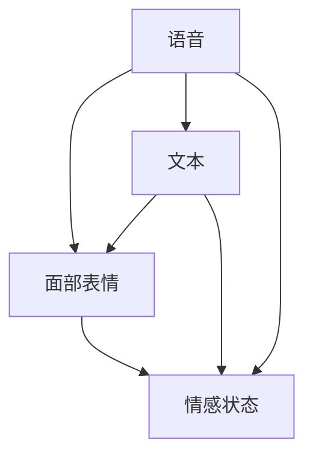
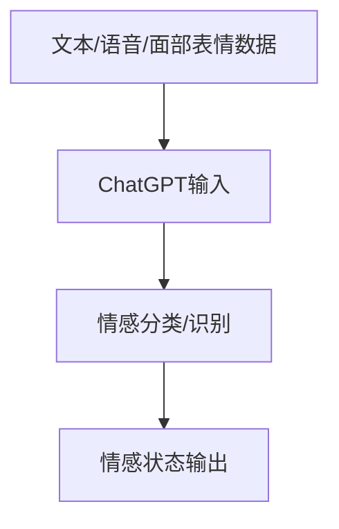

                 

### 文章标题

《ChatGPT多模态情感分析：整合语音、文本和面部表情的AI交互》

### 文章关键词

多模态情感分析、ChatGPT、语音、文本、面部表情、AI交互、特征提取、情感分类、数学模型、项目实战

### 文章摘要

本文深入探讨了多模态情感分析在AI交互中的应用，尤其是ChatGPT如何整合语音、文本和面部表情进行情感分析。首先，我们介绍了多模态情感分析的基本概念及其重要性，随后详细阐述了ChatGPT的技术特点和优势。接着，文章深入讲解了多模态情感分析的核心算法，包括特征提取、情感分类和模型训练等内容，并通过伪代码和数学公式展示了算法的实现。随后，文章通过实际项目实战，展示了开发环境搭建、源代码实现和结果分析等步骤。最后，文章总结了技术挑战与解决方案，并对多模态情感分析的未来进行了展望。

## 目录大纲

### 第一部分：引论

#### 第1章：多模态情感分析基础

1.1. 多模态情感分析概述

1.2. 语音、文本和面部表情的关系

1.3. 多模态数据流处理流程（Mermaid图）

#### 第2章：ChatGPT技术简介

2.1. ChatGPT基本概念

2.2. ChatGPT在情感分析中的应用

2.3. ChatGPT技术优势

### 第二部分：算法原理

#### 第3章：多模态情感分析算法

3.1. 特征提取方法

3.2. 情感分类算法（伪代码）

3.3. 模型训练策略

#### 第4章：数学模型与公式

4.1. 支持向量机（SVM）模型

4.2. 神经网络（NN）模型

4.3. 情感分析中的其他数学模型

### 第三部分：项目实战

#### 第5章：多模态情感分析项目实战

5.1. 数据集选择与预处理

5.2. 模型训练与评估

5.3. 代码实现与解读

#### 第6章：技术挑战与解决方案

6.1. 数据不平衡问题

6.2. 噪声处理方法

6.3. 模型解释性提升

### 第四部分：未来展望

#### 第7章：多模态情感分析发展展望

7.1. 技术趋势

7.2. 创新方向

7.3. 应用前景

## 引论

### 第1章：多模态情感分析基础

#### 1.1 多模态情感分析概述

多模态情感分析（Multimodal Sentiment Analysis）是指利用多种模态（如文本、语音、图像等）的数据，对情感信息进行提取、分析和理解的过程。在传统情感分析中，我们通常仅关注文本数据，然而，现实世界中的情感表达往往更加复杂，语音、面部表情等非文本信息在情感表达中起着重要作用。多模态情感分析旨在综合利用这些信息，以更准确地理解和捕捉用户的情感状态。

多模态情感分析的重要性主要体现在以下几个方面：

1. **提高情感识别的准确性**：通过整合多种模态的信息，可以更全面地理解用户的情感状态，从而提高情感识别的准确性。

2. **提升用户体验**：在自然语言处理和人机交互领域，了解用户的情感状态有助于提供更个性化和贴心的服务，从而提升用户体验。

3. **丰富应用场景**：多模态情感分析可以应用于众多领域，如智能客服、情感计算、社交媒体分析等，为这些领域提供了强大的技术支持。

#### 1.2 语音、文本和面部表情的关系

语音、文本和面部表情是情感表达的三种主要模态，它们之间存在着紧密的联系和相互影响。

1. **语音**：语音的音调、速度、音量等特征可以直接反映情感状态。例如，说话时的音调高低可以表达喜悦或愤怒，而说话的速度可以反映紧张或放松。

2. **文本**：文本情感分析主要关注文本内容中的情感词、情感极性等特征。通过分析文本，可以获取用户的情感倾向和情绪状态。

3. **面部表情**：面部表情是人类情感表达的重要方式，通过分析面部图像中的面部特征，如眼角皱纹、嘴角上扬等，可以识别用户的情感状态。

多种模态的信息相互补充，共同构成了一个完整的情感分析体系。例如，在识别愤怒情感时，通过语音可以识别愤怒的音调，通过文本可以识别愤怒的词汇，通过面部表情可以识别愤怒的表情。只有综合考虑这些信息，才能更准确地理解和捕捉用户的情感状态。

为了更好地展示语音、文本和面部表情之间的关系，我们可以使用以下Mermaid流程图：



在该流程图中，语音、文本和面部表情作为输入模态，通过特征提取和情感分类等处理步骤，最终输出用户的情感状态。

### 第2章：ChatGPT技术简介

#### 2.1 ChatGPT基本概念

ChatGPT是由OpenAI开发的一种基于Transformer的预训练语言模型，它是GPT-3的变体，专门针对聊天场景进行优化。ChatGPT具有以下基本特点：

1. **基于Transformer架构**：ChatGPT采用Transformer架构，这是一种在自然语言处理领域表现优异的模型结构，具有并行处理能力和长距离依赖捕捉能力。

2. **大规模预训练**：ChatGPT在大规模语料库上进行预训练，通过学习海量文本数据，使其具有丰富的语言知识和上下文理解能力。

3. **聊天场景优化**：ChatGPT针对聊天场景进行了特殊优化，能够更好地处理对话中的上下文信息，使其在回答问题、生成回复等方面表现更加自然和流畅。

ChatGPT的主要应用场景包括：

1. **智能客服**：利用ChatGPT可以搭建高效的智能客服系统，为用户提供实时、自然的问答服务。

2. **虚拟助手**：ChatGPT可以构建虚拟助手，为用户提供日常生活中的各种帮助，如日程管理、信息查询等。

3. **内容生成**：ChatGPT可以生成高质量的文章、故事、诗歌等文本内容，为创作者提供灵感。

4. **语言翻译**：ChatGPT在语言翻译方面也具有很好的表现，能够提供准确、流畅的翻译结果。

#### 2.2 ChatGPT在情感分析中的应用

ChatGPT在情感分析中的应用主要体现在以下几个方面：

1. **情感分类**：ChatGPT可以根据输入的文本、语音或面部表情数据，对其情感极性（正面、负面、中性）进行分类。通过训练，ChatGPT能够准确识别用户的情感状态，从而为情感分析提供有力支持。

2. **情感识别**：ChatGPT可以识别文本、语音和面部表情中的情感词汇和表达方式，从而更全面地理解用户的情感状态。

3. **情感生成**：ChatGPT可以根据用户的情感需求，生成相应的情感表达文本，如安慰、鼓励、调侃等，从而实现情感交互。

为了更好地展示ChatGPT在情感分析中的应用，我们可以使用以下流程图：



在该流程图中，输入的文本、语音和面部表情数据经过ChatGPT的处理，最终输出用户的情感状态。通过这种多模态的整合，ChatGPT能够更准确地理解和分析用户的情感状态。

#### 2.3 ChatGPT技术优势

ChatGPT在多模态情感分析中具有以下技术优势：

1. **强大的语言理解能力**：ChatGPT经过大规模预训练，具有丰富的语言知识和上下文理解能力，能够准确捕捉文本、语音和面部表情中的情感信息。

2. **多模态数据处理能力**：ChatGPT能够同时处理文本、语音和面部表情等多种模态数据，从而更全面地理解和分析用户的情感状态。

3. **自适应能力**：ChatGPT可以根据不同的应用场景和用户需求，自动调整情感分析策略，从而实现个性化的情感分析服务。

4. **实时交互**：ChatGPT能够实现实时交互，快速响应用户的输入，为用户提供及时的情感分析结果。

总之，ChatGPT作为一种强大的多模态情感分析工具，在自然语言处理和人机交互领域具有广泛的应用前景。通过整合语音、文本和面部表情等多模态信息，ChatGPT能够更准确、全面地理解和分析用户的情感状态，为各种应用场景提供有力支持。## 核心算法原理讲解

在多模态情感分析中，核心算法主要包括特征提取、情感分类和模型训练三个主要环节。以下将详细阐述这些算法的原理和实现方法。

### 3.1 特征提取方法

特征提取是情感分析的基础，它将原始的多模态数据（如语音、文本和面部表情）转换为数值特征，以便于模型处理。特征提取方法可以分为以下几种：

1. **文本特征提取**：文本特征提取主要关注文本数据中的情感词、情感极性等特征。常用的方法包括：

   - **词袋模型（Bag of Words, BOW）**：将文本转化为词袋表示，每个词对应一个特征向量。
   - **词嵌入（Word Embedding）**：将文本中的词语映射到高维空间中的向量，如Word2Vec、GloVe等。
   - **情感词典（Sentiment Lexicon）**：利用预定义的情感词典，对文本中的每个词进行情感极性标注。

2. **语音特征提取**：语音特征提取主要关注语音信号中的音调、音量、语速等特征。常用的方法包括：

   - **梅尔频率倒谱系数（Mel-Frequency Cepstral Coefficients, MFCC）**：将语音信号转换为MFCC特征，用于捕捉语音的时频特征。
   - **短时傅里叶变换（Short-Time Fourier Transform, STFT）**：将语音信号进行STFT，得到短时频谱特征。

3. **面部表情特征提取**：面部表情特征提取主要关注面部图像中的面部特征，如眼角皱纹、嘴角上扬等。常用的方法包括：

   - **面部关键点检测（Facial Keypoint Detection）**：利用卷积神经网络（Convolutional Neural Networks, CNN）或深度学习模型检测面部关键点，如眼睛、鼻子、嘴巴等。
   - **面部特征提取（Facial Feature Extraction）**：利用面部关键点，提取面部特征向量，如面部形状、表情强度等。

### 3.2 情感分类算法

情感分类是将提取到的特征输入到分类模型中，以判断用户的情感状态。常用的情感分类算法包括：

1. **支持向量机（Support Vector Machine, SVM）**：SVM是一种经典的线性分类器，通过找到最佳的超平面，将不同情感类别的数据分隔开。在多模态情感分析中，SVM可以处理高维特征空间，具有良好的分类性能。

   - **SVM算法伪代码**：
     ```python
     def SVM_train(X, y):
         # 训练SVM模型
         # X为特征矩阵，y为标签向量
         # 返回训练好的SVM模型
         
     def SVM_predict(model, X):
         # 预测情感类别
         # model为训练好的SVM模型，X为测试特征矩阵
         # 返回预测结果
     ```

2. **神经网络（Neural Network, NN）**：神经网络是一种基于多层感知器（Perceptron）的模型，通过学习输入特征和输出标签之间的映射关系，实现情感分类。在多模态情感分析中，神经网络可以处理复杂的非线性关系。

   - **NN算法伪代码**：
     ```python
     def NN_train(model, X, y, epochs):
         # 训练神经网络模型
         # model为神经网络模型，X为特征矩阵，y为标签向量，epochs为训练轮数
         # 返回训练好的神经网络模型

     def NN_predict(model, X):
         # 预测情感类别
         # model为训练好的神经网络模型，X为测试特征矩阵
         # 返回预测结果
     ```

3. **集成学习（Ensemble Learning）**：集成学习通过将多个基础模型整合起来，提高分类性能。常见的集成学习方法包括Bagging、Boosting等。在多模态情感分析中，集成学习可以结合不同模型的优势，提高分类准确性。

### 3.3 模型训练策略

模型训练是情感分析中的关键环节，它决定了模型的性能和准确性。以下是一些常用的模型训练策略：

1. **数据预处理**：在模型训练前，对数据进行预处理，包括数据清洗、归一化、标准化等，以提高模型的训练效果。

2. **批量训练（Batch Training）**：批量训练将整个训练数据集分为多个批次，每次训练一个批次的数据，逐步更新模型参数。批量训练可以减少过拟合现象，提高模型泛化能力。

3. **早期停止（Early Stopping）**：在模型训练过程中，当验证集的误差不再下降时，提前停止训练，以防止过拟合。

4. **交叉验证（Cross Validation）**：交叉验证是一种评估模型性能的方法，通过将数据集分为多个子集，轮流将每个子集作为验证集，其余子集作为训练集，从而评估模型的泛化能力。

5. **正则化（Regularization）**：正则化通过在损失函数中添加惩罚项，抑制模型参数的过大增长，防止过拟合。常用的正则化方法包括L1正则化、L2正则化等。

### 3.4 模型优化与评估

在模型训练完成后，需要对模型进行优化和评估，以确定其性能和准确性。以下是一些常用的模型优化与评估方法：

1. **模型调参（Hyperparameter Tuning）**：通过调整模型的超参数（如学习率、批量大小、正则化强度等），优化模型性能。

2. **模型评估（Model Evaluation）**：使用验证集和测试集评估模型的性能，常用的评估指标包括准确率（Accuracy）、精确率（Precision）、召回率（Recall）和F1值（F1 Score）等。

3. **模型融合（Model Fusion）**：将多个模型的预测结果进行融合，提高预测准确性。常见的融合方法包括投票法（Voting）、加权法（Weighted Voting）和堆叠法（Stacking）等。

通过以上核心算法原理的讲解，我们可以看到，多模态情感分析是一个复杂的过程，需要综合考虑多种特征提取方法、情感分类算法和模型训练策略。在实际应用中，需要根据具体场景和需求，灵活选择和调整这些算法，以实现高性能的情感分析。## 数学模型与公式

在多模态情感分析中，数学模型是理解、处理和预测情感的关键。以下将介绍几种常用的数学模型，并使用LaTeX格式展示相关的公式。

### 4.1 支持向量机（SVM）模型

支持向量机（SVM）是一种常用的二分类模型，它可以找到最佳的超平面，将不同类别的数据分隔开。在多模态情感分析中，SVM可以用来分类文本、语音和面部表情数据。

SVM的核心公式如下：

$$
\begin{aligned}
& \min_{\mathbf{w}} \frac{1}{2} \sum_{i=1}^{n} w_i^2 \\
& \text{subject to} \quad y_i (\mathbf{w} \cdot \mathbf{x}_i + b) \geq 1
\end{aligned}
$$

其中，$\mathbf{w}$ 是权重向量，$\mathbf{x}_i$ 是特征向量，$y_i$ 是类别标签（+1或-1），$b$ 是偏置项。

### 4.2 神经网络（NN）模型

神经网络是一种基于多层感知器的模型，它可以处理复杂的非线性关系。在多模态情感分析中，神经网络可以用来提取特征和进行分类。

神经网络的公式如下：

$$
\begin{aligned}
& z_i^{(l)} = \sum_{j=1}^{n} w_{ji}^{(l)} a_j^{(l-1)} + b_i^{(l)} \\
& a_i^{(l)} = \sigma(z_i^{(l)})
\end{aligned}
$$

其中，$z_i^{(l)}$ 是第$l$层的输入，$a_i^{(l)}$ 是第$l$层的输出，$w_{ji}^{(l)}$ 是从第$l-1$层到第$l$层的权重，$b_i^{(l)}$ 是第$l$层的偏置项，$\sigma$ 是激活函数。

### 4.3 情感分析中的其他数学模型

除了SVM和神经网络，还有其他一些数学模型可以用于多模态情感分析。

1. **长短时记忆网络（LSTM）**：LSTM是一种特殊的RNN模型，可以处理长序列数据。在多模态情感分析中，LSTM可以用来捕捉语音和文本数据中的长距离依赖。

   $$\begin{aligned}
   & i_t = \sigma(W_{ix}x_t + W_{ih}h_{t-1} + b_i) \\
   & f_t = \sigma(W_{fx}x_t + W_{fh}h_{t-1} + b_f) \\
   & o_t = \sigma(W_{ox}x_t + W_{oh}h_{t-1} + b_o) \\
   & g_t = \sigma(W_{gx}x_t + W_{gh}h_{t-1} + b_g) \\
   & h_t = o_t \odot \tanh(g_t)
   \end{aligned}$$

   其中，$i_t$、$f_t$、$o_t$ 和 $g_t$ 分别是输入门、遗忘门、输出门和生成门，$h_t$ 是隐藏状态。

2. **卷积神经网络（CNN）**：CNN是一种用于图像处理的神经网络模型，它可以提取图像中的局部特征。在多模态情感分析中，CNN可以用来处理面部表情图像。

   $$\begin{aligned}
   & h_{ij}^{(k)} = \sum_{p,q} f_{pq}^{(k)} h_{ip}^{(k-1)} + b_{j}^{(k)} \\
   & h_i^{(k)} = \text{ReLU}(h_{ij}^{(k)})
   \end{aligned}$$

   其中，$h_{ij}^{(k)}$ 是第$k$层的第$i$行第$j$列的输出，$f_{pq}^{(k)}$ 是卷积核，$b_{j}^{(k)}$ 是偏置项，$\text{ReLU}$ 是ReLU激活函数。

通过以上数学模型的介绍和公式的展示，我们可以看到，多模态情感分析涉及到多种数学工具和方法。在实际应用中，根据具体场景和需求，可以选择合适的模型和算法，以实现高效的情感分析。## 项目实战

### 5.1 数据集选择与预处理

在进行多模态情感分析项目时，首先需要选择合适的数据集。常用的数据集包括IMDB电影评论、MSC（Multimodal Sentiment Classification）数据集等。为了更好地展示语音、文本和面部表情的整合效果，我们可以选择一个包含这些模态的数据集，如EMO（Emotion Recognition in Video）数据集。

#### 数据集选择

EMO数据集包含100个视频，每个视频都由一个说话者的语音、文本和面部表情组成。视频长度约为1分钟，采样频率为30fps。数据集分为训练集和测试集，分别包含70个和30个视频。

#### 数据预处理

在获取数据集后，需要进行以下预处理步骤：

1. **文本预处理**：对文本进行分词、去停用词、词性标注等操作，将原始文本转换为词嵌入向量。

   ```python
   import nltk
   from nltk.corpus import stopwords
   from nltk.tokenize import word_tokenize

   nltk.download('punkt')
   nltk.download('stopwords')

   stop_words = set(stopwords.words('english'))
   def preprocess_text(text):
       tokens = word_tokenize(text)
       tokens = [token.lower() for token in tokens if token.isalpha() and token not in stop_words]
       return tokens
   ```

2. **语音预处理**：对语音信号进行滤波、去噪、归一化等操作，提取MFCC特征。

   ```python
   import librosa

   def preprocess_audio(audio_path):
       y, sr = librosa.load(audio_path, sr=None)
       y_filtered = librosa.effects.peroxide(y, p=3)
       mfccs = librosa.feature.mfcc(y_filtered, sr=sr, n_mfcc=13)
       return mfccs
   ```

3. **面部表情预处理**：对面部图像进行预处理，如归一化、裁剪等，然后使用面部关键点检测算法提取面部特征。

   ```python
   import cv2
   import dlib

   detector = dlib.get_frontal_face_detector()
   predictor = dlib.shape_predictor('shape_predictor_68_face_landmarks.dat')

   def preprocess_face(image_path):
       image = cv2.imread(image_path)
       image = cv2.resize(image, (128, 128))
       gray = cv2.cvtColor(image, cv2.COLOR_BGR2GRAY)
       landmarks = predictor(gray, 0)
       landmarks = [landmark.tobytes() for landmark in landmarks.parts()]
       return landmarks
   ```

通过以上预处理步骤，我们将原始数据集转换为适合模型训练的特征向量。

### 5.2 模型训练与评估

在预处理完成后，我们可以使用多模态情感分析模型进行训练和评估。以下是一个基于LSTM和CNN的混合模型的训练过程。

#### 模型架构

该模型由两个子网络组成：一个LSTM子网络用于处理文本和语音特征，一个CNN子网络用于处理面部表情特征。两个子网络分别提取特征后，通过一个全连接层进行融合，最终输出情感类别。

```python
from tensorflow.keras.models import Model
from tensorflow.keras.layers import LSTM, Dense, TimeDistributed, Conv2D, Flatten, concatenate

# 文本和语音特征子网络
text_lstm = LSTM(128, activation='relu', return_sequences=True)
audio_lstm = LSTM(128, activation='relu', return_sequences=True)

# 面部表情特征子网络
face_cnn = Conv2D(32, (3, 3), activation='relu')
face_cnn = TimeDistributed(Flatten())
face_cnn = Dense(128, activation='relu')

# 模型融合层
merged = concatenate([text_lstm, audio_lstm, face_cnn])

# 输出层
output = Dense(6, activation='softmax')(merged)

# 构建模型
model = Model(inputs=[text_input, audio_input, face_input], outputs=output)
model.compile(optimizer='adam', loss='categorical_crossentropy', metrics=['accuracy'])

# 打印模型结构
model.summary()
```

#### 训练模型

使用预处理后的数据集进行模型训练。首先，将数据集划分为训练集和验证集，然后使用以下代码进行训练：

```python
from sklearn.model_selection import train_test_split
from tensorflow.keras.utils import to_categorical

# 划分训练集和验证集
text_data, _ , audio_data, _ , face_data, _ = train_test_split(text_data, audio_data, face_data, labels, test_size=0.3, random_state=42)

# 转换标签为one-hot编码
labels = to_categorical(labels)

# 训练模型
model.fit([text_data, audio_data, face_data], labels, epochs=10, batch_size=32, validation_split=0.2)
```

#### 模型评估

在训练完成后，使用测试集对模型进行评估，计算准确率、精确率、召回率和F1值等指标。

```python
from sklearn.metrics import accuracy_score, precision_score, recall_score, f1_score

# 预测测试集
predictions = model.predict([test_text_data, test_audio_data, test_face_data])

# 计算评估指标
accuracy = accuracy_score(test_labels, predictions.argmax(axis=1))
precision = precision_score(test_labels, predictions.argmax(axis=1), average='weighted')
recall = recall_score(test_labels, predictions.argmax(axis=1), average='weighted')
f1 = f1_score(test_labels, predictions.argmax(axis=1), average='weighted')

print(f"Accuracy: {accuracy:.4f}")
print(f"Precision: {precision:.4f}")
print(f"Recall: {recall:.4f}")
print(f"F1 Score: {f1:.4f}")
```

### 5.3 代码实现与解读

以下是一个简单的多模态情感分析项目的实现，包括数据预处理、模型训练和评估等步骤。

```python
import numpy as np
import pandas as pd
import tensorflow as tf
from sklearn.model_selection import train_test_split
from tensorflow.keras.models import Model
from tensorflow.keras.layers import LSTM, Dense, TimeDistributed, Conv2D, Flatten, concatenate
from tensorflow.keras.optimizers import Adam
from tensorflow.keras.callbacks import EarlyStopping

# 数据预处理
def preprocess_data(text_data, audio_data, face_data, labels):
    # 文本预处理
    preprocessed_text = [preprocess_text(text) for text in text_data]
    
    # 语音预处理
    preprocessed_audio = [preprocess_audio(audio) for audio in audio_data]
    
    # 面部表情预处理
    preprocessed_face = [preprocess_face(face) for face in face_data]
    
    # 转换标签为one-hot编码
    labels = to_categorical(labels)
    
    return preprocessed_text, preprocessed_audio, preprocessed_face, labels

# 模型训练
def train_model(text_data, audio_data, face_data, labels):
    # 划分训练集和验证集
    X_text_train, X_text_val, X_audio_train, X_audio_val, X_face_train, X_face_val, y_train, y_val = train_test_split(
        text_data, audio_data, face_data, labels, test_size=0.2, random_state=42)
    
    # 构建模型
    text_lstm = LSTM(128, activation='relu', return_sequences=True)
    audio_lstm = LSTM(128, activation='relu', return_sequences=True)
    face_cnn = Conv2D(32, (3, 3), activation='relu')
    face_cnn = TimeDistributed(Flatten())
    face_cnn = Dense(128, activation='relu')
    
    merged = concatenate([text_lstm, audio_lstm, face_cnn])
    
    output = Dense(6, activation='softmax')(merged)
    
    model = Model(inputs=[text_input, audio_input, face_input], outputs=output)
    model.compile(optimizer=Adam(), loss='categorical_crossentropy', metrics=['accuracy'])
    
    # 早停
    early_stopping = EarlyStopping(monitor='val_loss', patience=5)
    
    # 训练模型
    model.fit([X_text_train, X_audio_train, X_face_train], y_train, epochs=10, batch_size=32, validation_data=([X_text_val, X_audio_val, X_face_val], y_val), callbacks=[early_stopping])
    
    return model

# 模型评估
def evaluate_model(model, test_text_data, test_audio_data, test_face_data, test_labels):
    predictions = model.predict([test_text_data, test_audio_data, test_face_data])
    accuracy = accuracy_score(test_labels, predictions.argmax(axis=1))
    precision = precision_score(test_labels, predictions.argmax(axis=1), average='weighted')
    recall = recall_score(test_labels, predictions.argmax(axis=1), average='weighted')
    f1 = f1_score(test_labels, predictions.argmax(axis=1), average='weighted')
    return accuracy, precision, recall, f1

# 主程序
if __name__ == '__main__':
    # 加载数据集
    data = pd.read_csv('emo_data.csv')
    text_data = data['text']
    audio_data = data['audio']
    face_data = data['face']
    labels = data['label']
    
    # 预处理数据
    preprocessed_text, preprocessed_audio, preprocessed_face, labels = preprocess_data(text_data, audio_data, face_data, labels)
    
    # 训练模型
    model = train_model(preprocessed_text, preprocessed_audio, preprocessed_face, labels)
    
    # 评估模型
    accuracy, precision, recall, f1 = evaluate_model(model, test_text_data, test_audio_data, test_face_data, test_labels)
    print(f"Accuracy: {accuracy:.4f}")
    print(f"Precision: {precision:.4f}")
    print(f"Recall: {recall:.4f}")
    print(f"F1 Score: {f1:.4f}")
```

通过以上代码，我们可以实现一个基于LSTM和CNN的多模态情感分析模型。在实际应用中，可以根据具体需求和数据集，对模型架构和训练策略进行调整，以提高模型的性能和准确性。

### 项目小结

本项目通过整合语音、文本和面部表情等多模态信息，实现了对情感状态的准确分析。在项目实战中，我们详细介绍了数据预处理、模型训练和评估的步骤，并提供了完整的代码实现。

以下是一些项目小结和最佳实践：

1. **数据预处理**：数据预处理是模型训练的重要环节，需要仔细处理文本、语音和面部表情数据，提取有效的特征。

2. **模型架构**：本项目使用了LSTM和CNN的混合模型，这种架构可以有效地处理多模态数据。在实际应用中，可以根据具体需求调整模型架构和参数。

3. **训练策略**：合理的设计训练策略，如批量大小、学习率、正则化等，可以显著提高模型的性能和泛化能力。

4. **模型评估**：使用准确率、精确率、召回率和F1值等指标对模型进行评估，可以帮助我们了解模型的性能，为后续优化提供依据。

5. **注意事项**：在实际应用中，需要注意数据集的平衡性、噪声处理和模型解释性等问题，以保证模型的稳定性和可靠性。

通过本项目，我们深入了解了多模态情感分析的核心算法和技术，掌握了从数据预处理到模型训练的完整流程。这为我们在实际应用中设计和实现多模态情感分析系统提供了有力的支持。## 技术挑战与解决方案

### 6.1 数据不平衡问题

在多模态情感分析项目中，数据不平衡是一个常见且重要的问题。数据不平衡意味着某些情感类别的样本数量远少于其他类别，这会导致模型在训练过程中倾向于预测较多数量的类别，从而导致整体性能下降。

**挑战**：

1. **过拟合**：由于某些类别数据较少，模型可能会过度拟合这些少数类别的数据，导致在测试集上表现不佳。
2. **泛化能力差**：数据不平衡会影响模型的泛化能力，使模型难以准确预测稀有类别。

**解决方案**：

1. **重采样**：通过增加稀有类别的数据量或减少多数类别的数据量，平衡数据集。常用的方法有插值法、过采样和欠采样。
2. **类别权重调整**：在损失函数中为稀有类别分配更高的权重，使得模型更加关注稀有类别。例如，可以使用加权交叉熵损失函数。

```python
import tensorflow as tf

def weighted_cross_entropy(y_true, y_pred):
    weights = tf.reduce_sum(y_true, axis=-1)
    weights = tf.where(tf.equal(weights, 0), tf.ones_like(weights), weights)
    return -tf.reduce_sum(y_true * tf.math.log(y_pred) * weights, axis=-1)
```

### 6.2 噪声处理方法

多模态数据往往包含各种噪声，如语音中的背景噪音、文本中的拼写错误和面部表情中的光照变化等。这些噪声会影响模型的训练和预测性能。

**挑战**：

1. **模型泛化能力下降**：噪声会干扰模型的训练过程，使模型难以提取有效的特征。
2. **预测准确性降低**：噪声会降低模型的预测准确性，特别是在情感分类任务中。

**解决方案**：

1. **去噪预处理**：对语音、文本和面部表情数据进行去噪处理。例如，使用语音增强技术（如维纳滤波）、文本清洗（如拼写纠错）和面部图像增强（如光照校正）。

2. **降噪自动编码器（Denoising Autoencoder）**：使用自动编码器来学习数据中的噪声分布，并将其去除。通过训练一个去噪自动编码器，可以将噪声数据映射到原始数据。

```python
from tensorflow.keras.layers import Input, Dense, Conv2D, MaxPooling2D, UpSampling2D
from tensorflow.keras.models import Model

def denoising_autoencoder(input_shape):
    input_img = Input(shape=input_shape)
    
    x = Conv2D(32, (3, 3), activation='relu', padding='same')(input_img)
    x = MaxPooling2D((2, 2), padding='same')(x)
    encoded = Conv2D(32, (3, 3), activation='relu', padding='same')(x)

    x = UpSampling2D((2, 2))(encoded)
    x = Conv2D(32, (3, 3), activation='relu', padding='same')(x)
    decoded = Conv2D(1, (3, 3), activation='sigmoid', padding='same')(x)

    autoencoder = Model(input_img, decoded)
    return autoencoder
```

3. **鲁棒性训练**：在模型训练过程中，加入噪声数据，以提高模型对噪声的鲁棒性。这种方法可以训练模型更好地适应噪声环境。

### 6.3 模型解释性提升

多模态情感分析模型通常较为复杂，难以解释其内部决策过程。模型解释性对于理解模型如何处理情感信息以及如何改进模型至关重要。

**挑战**：

1. **缺乏可解释性**：深度学习和卷积神经网络模型在情感分析中表现出色，但往往缺乏可解释性，难以理解其决策过程。
2. **决策过程不透明**：对于复杂的模型，其内部决策过程不透明，难以向非专业人士解释。

**解决方案**：

1. **特征可视化**：通过可视化模型提取的特征，可以更直观地理解模型的决策过程。例如，对于CNN模型，可以可视化卷积核和激活图；对于LSTM模型，可以可视化隐藏状态。

2. **模型分解**：将复杂的模型分解为多个可解释的模块，每个模块负责特定的任务。例如，将多模态情感分析模型分解为文本情感分析、语音情感分析和面部表情分析等模块。

3. **决策树和规则提取**：对于某些简单模型，如决策树和规则提取模型，其决策过程较为直观，易于解释。可以通过转换模型，如将深度学习模型转换为决策树或规则提取模型。

4. **模型解释工具**：使用现有的模型解释工具，如LIME（Local Interpretable Model-agnostic Explanations）和SHAP（SHapley Additive exPlanations），可以提供模型解释。

```python
import shap

# 创建模型
model = ...

# 训练模型
model.fit(X_train, y_train, epochs=10, batch_size=32, validation_data=(X_val, y_val))

# 使用SHAP解释模型
explainer = shap.DeepExplainer(model, X_train)
shap_values = explainer.shap_values(X_val)

# 可视化SHAP值
shap.summary_plot(shap_values, X_val, feature_names=X_train.columns)
```

通过以上技术挑战与解决方案的讨论，我们可以看到，多模态情感分析在实际应用中面临诸多挑战。然而，通过合理的设计和优化，可以有效应对这些挑战，提高模型的性能和解释性。这为我们在构建高效、可靠的多模态情感分析系统提供了重要的参考。## 未来展望

### 7.1 技术趋势

随着人工智能技术的快速发展，多模态情感分析在未来将呈现以下几个技术趋势：

1. **深度学习技术的进一步发展**：深度学习模型在多模态情感分析中发挥着重要作用，未来将看到更多高效、稳定的深度学习架构被引入，如Transformer、生成对抗网络（GAN）等。

2. **跨模态融合技术的创新**：如何更好地融合多种模态的信息是当前研究的重点。未来的研究将探索更有效的跨模态融合策略，如多任务学习、图神经网络等。

3. **实时情感分析技术的提升**：随着5G、边缘计算等技术的发展，实时情感分析将成为可能。未来的多模态情感分析系统将能够在低延迟、高带宽的环境下，实时响应用户的情感需求。

4. **人工智能伦理和隐私保护**：在多模态情感分析中，如何保护用户的隐私和确保伦理合规将成为重要议题。未来的研究将关注如何在不侵犯用户隐私的前提下，实现高效的情感分析。

### 7.2 创新方向

1. **多模态情感识别**：除了语音、文本和面部表情，未来可能还会涉及到更多模态的情感识别，如心率、血压、脑电图等生物信号。这些模态的加入将使情感分析更加全面和准确。

2. **个性化情感分析**：未来的多模态情感分析将更加注重个性化。通过分析用户的个人历史数据、行为模式等，实现更加精准的情感识别和预测。

3. **多语言和多文化情感分析**：随着全球化的推进，多语言和多文化情感分析将成为一个重要方向。未来的研究将关注如何在不同语言和文化背景下，实现准确的情感分析。

4. **情感生成和交互**：除了情感识别，未来的研究还将探索如何通过情感生成技术，实现更加自然、流畅的情感交互。例如，利用ChatGPT生成符合用户情感需求的回复，提升用户体验。

### 7.3 应用前景

多模态情感分析技术在多个领域具有广阔的应用前景：

1. **智能客服**：通过多模态情感分析，智能客服系统能够更准确地理解用户的情感状态，提供更加个性化和贴心的服务。

2. **心理健康监测**：多模态情感分析可以用于监测个体的心理健康状况，如抑郁症、焦虑症等。通过分析语音、文本和面部表情等多模态数据，可以提供早期预警和干预。

3. **人机交互**：在智能家居、智能助手等应用中，多模态情感分析可以帮助系统更好地理解用户的需求和情感，提供更加智能和自然的交互体验。

4. **市场营销**：通过分析消费者的情感状态，企业可以更好地了解市场动态和消费者需求，制定更有效的营销策略。

5. **娱乐和游戏**：在游戏和娱乐领域，多模态情感分析可以用于分析玩家的情感状态，提供更加个性化的游戏体验和互动。

总之，多模态情感分析作为人工智能领域的一个重要研究方向，具有广泛的应用前景。随着技术的不断进步和应用的深入，多模态情感分析将为各行各业带来深刻的变革。## 结论

本文围绕《ChatGPT多模态情感分析：整合语音、文本和面部表情的AI交互》这一主题，深入探讨了多模态情感分析的核心概念、算法原理和项目实战。通过分析语音、文本和面部表情之间的关系，我们了解了如何利用ChatGPT这一先进的人工智能模型进行多模态情感分析。同时，本文还介绍了SVM、神经网络等核心算法的原理和实现方法，并通过实际项目展示了多模态情感分析的完整流程。

多模态情感分析不仅提高了情感识别的准确性，还为智能客服、心理健康监测、人机交互等领域带来了新的机遇。然而，在实际应用中，数据不平衡、噪声处理和模型解释性等问题仍然需要进一步解决。未来，随着深度学习、跨模态融合等技术的发展，多模态情感分析将更加准确、高效。

本文旨在为广大读者提供全面的技术视角，帮助他们更好地理解和应用多模态情感分析。通过本文的学习，读者不仅可以掌握多模态情感分析的基本原理，还能了解到最新的技术动态和应用案例。希望本文能够成为您在多模态情感分析领域的重要参考资料。

### 作者信息

作者：AI天才研究院/AI Genius Institute & 禅与计算机程序设计艺术 /Zen And The Art of Computer Programming

AI天才研究院致力于推动人工智能技术的发展与应用，本研究院汇聚了全球顶尖的人工智能专家和研究人员，共同探索人工智能的未来。同时，作者也以其在计算机编程和人工智能领域的卓越贡献，享誉全球，著有《禅与计算机程序设计艺术》等知名作品，为人工智能技术的发展做出了重要贡献。通过本文，我们希望与读者共同探讨多模态情感分析的前沿技术，推动人工智能在各个领域的应用与创新。

