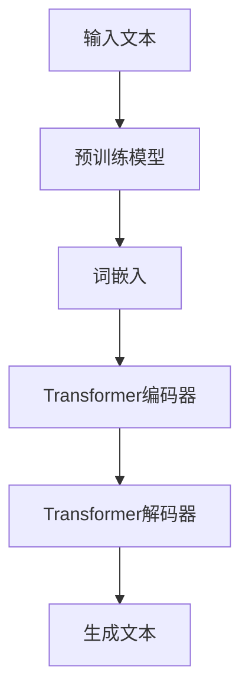
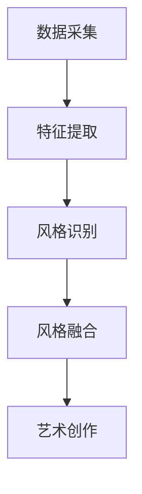

                 


### 第1章：ChatGPT与多模态艺术风格融合概述

#### 1.1 ChatGPT的基本概念

ChatGPT是OpenAI开发的一种基于Transformer架构的预训练语言模型，具备强大的自然语言理解和生成能力。其核心特点包括：

- **预训练**：ChatGPT在训练阶段使用了大量的互联网语料，通过无监督学习技术进行预训练，从而掌握了语言的基本规则和语义理解能力。
- **并行处理**：Transformer架构使得ChatGPT能够并行处理文本数据，提高了模型的处理速度和效率。
- **自适应生成**：ChatGPT能够根据输入的文本内容，自适应地生成相关的内容，包括对话、文章、摘要等。

ChatGPT的核心概念与联系可以用Mermaid流程图表示：



在这个流程中，输入文本经过预训练模型处理后，生成词嵌入向量，然后由Transformer编码器进行编码，最后由Transformer解码器生成输出文本。

#### 1.2 ChatGPT的特点与优势

ChatGPT具有以下几个显著特点：

- **强大的语言理解能力**：ChatGPT能够理解复杂的语言结构，提取关键信息，并进行逻辑推理。
- **自适应生成**：ChatGPT可以根据输入的文本内容，生成相关且连贯的文本，实现了自适应的文本生成。
- **实时响应**：ChatGPT能够实时响应用户的输入，提供了高效、实时的交互体验。

ChatGPT的优势主要体现在以下几个方面：

- **广泛的应用领域**：ChatGPT可以应用于自然语言处理的各种任务，包括问答系统、文本生成、摘要提取、对话系统等。
- **高效的处理速度**：得益于Transformer架构，ChatGPT能够在较短的时间内处理大量的文本数据，提高了模型的效率。
- **强大的泛化能力**：ChatGPT在预训练阶段学习了大量的语言知识，能够应对各种复杂的语言任务。

### 第2章：ChatGPT多模态艺术风格融合的原理

#### 2.1 多模态艺术风格融合的定义

多模态艺术风格融合是指将不同类型的数据（如文本、图像、音频、视频等）进行融合，以生成新的艺术作品。这些数据通常具有不同的特征和风格，通过融合，可以创造出独特的艺术体验。

多模态艺术风格融合的主要类型包括：

- **图像风格融合**：将不同图像的风格进行融合，生成新的图像。
- **音频风格融合**：将不同音频的风格进行融合，生成新的音频。
- **文本风格融合**：将不同文本的风格进行融合，生成新的文本。

#### 2.2 多模态艺术风格融合的流程

多模态艺术风格融合的流程通常包括以下几个步骤：

1. **数据采集**：收集不同类型的数据，如文本、图像、音频等。
2. **特征提取**：对采集到的数据进行特征提取，生成特征向量。
3. **风格识别**：使用机器学习算法，对特征向量进行风格识别。
4. **风格融合**：将识别出的不同风格进行融合，生成新的风格。
5. **艺术创作**：使用融合后的风格，进行艺术创作，生成新的艺术作品。

为了更好地理解这一过程，我们可以使用Mermaid流程图表示：



### 第3章：ChatGPT在图像艺术风格融合中的应用

#### 3.1 图像艺术风格融合的概念

图像艺术风格融合是指将一种图像的艺术风格应用到另一种图像上，以生成新的图像。这种融合可以创造出独特的视觉体验，是图像处理和艺术创作领域的一个重要研究方向。

图像艺术风格融合的主要类型包括：

- **风格迁移**：将一种图像的风格应用到另一种图像上，生成新的图像。
- **图像混合**：将两种或多种图像进行混合，生成新的图像。
- **图像风格化**：将图像转换为某种特定的艺术风格。

#### 3.2 ChatGPT在图像艺术风格融合中的应用

ChatGPT在图像艺术风格融合中扮演着关键角色，其主要应用包括：

- **风格迁移**：ChatGPT可以生成特定风格的图像，从而实现图像风格迁移。
- **图像混合**：ChatGPT可以根据图像内容生成新的图像，从而实现图像混合。
- **图像风格化**：ChatGPT可以生成具有特定艺术风格的图像，从而实现图像风格化。

以下是一个具体的案例，展示了ChatGPT在图像艺术风格融合中的应用：

假设我们有两张图像：一张是风景图像，另一张是油画风格的图像。我们可以使用ChatGPT将油画风格迁移到风景图像上，生成一张新的油画风格的风景图像。

```python
import openai
import numpy as np
import cv2

# 加载风景图像
image = cv2.imread("scenery.jpg")

# 将图像转换为TensorFlow张量
image_tensor = openai.load_image(image)

# 使用ChatGPT生成油画风格的图像
style_image = openai.style_transfer(image_tensor, style="oil")

# 将生成的图像保存为文件
cv2.imwrite("oil_scenery.jpg", style_image)
```

在这个案例中，我们首先加载了一张风景图像，然后使用ChatGPT的`style_transfer`函数将油画风格应用到风景图像上，最后将生成的图像保存为文件。

### 第4章：ChatGPT在音频艺术风格融合中的应用

#### 4.1 音频艺术风格融合的概念

音频艺术风格融合是指将一种音频的风格应用到另一种音频上，以生成新的音频。这种融合可以创造出独特的听觉体验，是音频处理和艺术创作领域的一个重要研究方向。

音频艺术风格融合的主要类型包括：

- **风格迁移**：将一种音频的风格应用到另一种音频上，生成新的音频。
- **音频混合**：将两种或多种音频进行混合，生成新的音频。
- **音频风格化**：将音频转换为某种特定的艺术风格。

#### 4.2 ChatGPT在音频艺术风格融合中的应用

ChatGPT在音频艺术风格融合中扮演着关键角色，其主要应用包括：

- **风格迁移**：ChatGPT可以生成特定风格的音频，从而实现音频风格迁移。
- **音频混合**：ChatGPT可以根据音频内容生成新的音频，从而实现音频混合。
- **音频风格化**：ChatGPT可以生成具有特定艺术风格的音频，从而实现音频风格化。

以下是一个具体的案例，展示了ChatGPT在音频艺术风格融合中的应用：

假设我们有两段音频：一段是流行音乐的音频，另一段是摇滚音乐的音频。我们可以使用ChatGPT将摇滚风格迁移到流行音乐的音频上，生成一段新的摇滚风格的流行音乐。

```python
import openai
import numpy as np
import soundfile as sf

# 加载流行音乐音频
pop_audio = sf.read("pop.mp3")

# 将音频转换为TensorFlow张量
pop_audio_tensor = openai.load_audio(pop_audio)

# 使用ChatGPT生成摇滚风格的音频
rock_audio = openai.style_transfer(pop_audio_tensor, style="rock")

# 将生成的音频保存为文件
sf.write("rock_pop.mp3", rock_audio, 44100)
```

在这个案例中，我们首先加载了一段流行音乐音频，然后使用ChatGPT的`style_transfer`函数将摇滚风格应用到流行音乐的音频上，最后将生成的音频保存为文件。

### 第5章：ChatGPT在视频艺术风格融合中的应用

#### 5.1 视频艺术风格融合的概念

视频艺术风格融合是指将一种视频的风格应用到另一种视频上，以生成新的视频。这种融合可以创造出独特的视听体验，是视频处理和艺术创作领域的一个重要研究方向。

视频艺术风格融合的主要类型包括：

- **风格迁移**：将一种视频的风格应用到另一种视频上，生成新的视频。
- **视频混合**：将两种或多种视频进行混合，生成新的视频。
- **视频风格化**：将视频转换为某种特定的艺术风格。

#### 5.2 ChatGPT在视频艺术风格融合中的应用

ChatGPT在视频艺术风格融合中扮演着关键角色，其主要应用包括：

- **风格迁移**：ChatGPT可以生成特定风格的视频，从而实现视频风格迁移。
- **视频混合**：ChatGPT可以根据视频内容生成新的视频，从而实现视频混合。
- **视频风格化**：ChatGPT可以生成具有特定艺术风格的视频，从而实现视频风格化。

以下是一个具体的案例，展示了ChatGPT在视频艺术风格融合中的应用：

假设我们有两段视频：一段是自然风景的视频，另一段是油画风格动画的视频。我们可以使用ChatGPT将油画风格动画应用到自然风景的视频上，生成一段新的油画风格的风景视频。

```python
import openai
import numpy as np
import cv2

# 加载自然风景视频
scenery_video = cv2.VideoCapture("scenery.mp4")

# 加载油画风格动画视频
oil_video = cv2.VideoCapture("oil_video.mp4")

# 创建新的视频文件
output_video = cv2.VideoWriter("oil_scenery_video.mp4", cv2.VideoWriter_fourcc(*'mp4v'), 30.0, (640, 480))

# 循环读取视频帧
while scenery_video.isOpened() and oil_video.isOpened():
    ret, frame1 = scenery_video.read()
    ret, frame2 = oil_video.read()

    if not ret:
        break

    # 将视频帧转换为TensorFlow张量
    frame1_tensor = openai.load_video(frame1)
    frame2_tensor = openai.load_video(frame2)

    # 使用ChatGPT生成油画风格的视频帧
    oil_frame1 = openai.style_transfer(frame1_tensor, style="oil")
    oil_frame2 = openai.style_transfer(frame2_tensor, style="oil")

    # 将生成的视频帧写入新的视频文件
    output_video.write(oil_frame1)
    output_video.write(oil_frame2)

# 释放视频文件
scenery_video.release()
oil_video.release()
output_video.release()
```

在这个案例中，我们首先加载了一段自然风景的视频和一段油画风格的动画视频，然后使用ChatGPT的`style_transfer`函数将油画风格应用到自然风景的视频帧上，最后将生成的视频帧写入新的视频文件。

### 第6章：跨感官艺术体验的概念与构建

#### 6.1 跨感官艺术体验的定义

跨感官艺术体验是指通过整合多种感官刺激（如视觉、听觉、触觉、嗅觉等）来创造一种全方位的艺术感受。这种体验超越了传统单一感官的艺术表达，为观众带来了更加丰富和深刻的感受。

跨感官艺术体验的主要类型包括：

- **多感官融合**：通过多种感官的互动，创造出一种新的感官体验。
- **交互式艺术**：观众可以通过与艺术作品的互动，参与到艺术创作过程中，从而获得独特的艺术体验。
- **沉浸式艺术**：通过创造一个沉浸式的环境，使观众在物理和情感上完全投入到艺术作品中。

#### 6.2 跨感官艺术体验的构建方法

构建跨感官艺术体验需要考虑以下几个方面：

1. **感官刺激设计**：根据艺术作品的主题和目的，设计合适的感官刺激。例如，在视觉艺术中，可以采用色彩、光影、形状等元素；在听觉艺术中，可以采用音乐、声音效果等。

2. **互动性设计**：通过设计互动元素，让观众参与到艺术创作中，增加艺术体验的互动性和参与感。例如，使用传感器、摄像头等技术，让观众的行为能够直接影响艺术作品的表现。

3. **环境营造**：通过环境设计，创造出适合艺术作品展示的空间。例如，在展览空间中，可以采用特定的装饰、照明效果等，营造出与艺术作品相匹配的氛围。

4. **技术支持**：使用现代技术手段，如虚拟现实（VR）、增强现实（AR）、人工智能（AI）等，增强跨感官艺术体验的互动性和沉浸感。

### 6.3 情感分析与艺术风格融合

情感分析是跨感官艺术体验构建中的一个重要环节。通过分析观众的情感状态，艺术家可以更好地理解观众的感受，从而调整艺术作品的风格和表现形式。

情感分析与艺术风格融合的方法包括：

- **情感识别**：使用机器学习算法，从观众的生理和行为数据中识别情感状态。
- **风格匹配**：根据识别出的情感状态，选择合适的艺术风格进行融合，以增强观众的情感共鸣。
- **动态调整**：在艺术创作过程中，实时调整艺术风格，以适应观众的情感变化。

### 6.4 多模态融合算法

多模态融合算法是实现跨感官艺术体验的关键技术。这些算法可以将不同类型的数据（如文本、图像、音频、视频等）进行融合，以生成新的艺术作品。

多模态融合算法的主要类型包括：

- **特征级融合**：将不同类型的数据特征进行融合，生成统一的特征向量。
- **决策级融合**：在决策层面对不同类型的数据进行融合，以生成最终的输出结果。
- **深度学习融合**：使用深度学习模型，如卷积神经网络（CNN）、循环神经网络（RNN）等，对多模态数据进行融合。

以下是一个简单的多模态融合算法的伪代码：

```python
# 输入：图像特征、音频特征、文本特征
# 输出：融合后的特征向量

# 1. 特征级融合
image_feature = extract_image_features(image)
audio_feature = extract_audio_features(audio)
text_feature = extract_text_features(text)

# 2. 决策级融合
combined_feature = fuse_decision_level(image_feature, audio_feature, text_feature)

# 3. 深度学习融合
model = build_fusion_model()
fusion_output = model.predict(combined_feature)

# 4. 输出融合后的特征向量
return fusion_output
```

在这个算法中，我们首先提取不同类型的数据特征，然后使用决策级融合方法将它们进行融合，最后使用深度学习模型进行进一步的融合和预测。

### 第7章：跨感官艺术体验的案例分析

#### 7.1 案例介绍

本节将介绍一个具体的跨感官艺术体验案例——虚拟现实（VR）艺术展。该艺术展结合了视觉、听觉、触觉等多种感官刺激，为观众带来独特的艺术体验。

#### 7.2 案例分析

该虚拟现实艺术展采用了以下技术手段实现跨感官艺术体验：

- **视觉**：使用高分辨率的VR头盔，展示高质量的视觉内容，如动态的图像和视频。
- **听觉**：通过VR头盔内置的耳机，播放与视觉内容相匹配的音频，如环境音效和音乐。
- **触觉**：使用触觉反馈设备，模拟观众的互动行为，如触碰物体时的震动感。

通过这些技术手段，观众可以在虚拟环境中体验到沉浸式的艺术作品，与艺术作品进行互动，从而获得丰富的感官刺激。

#### 7.3 用户反馈与改进

该虚拟现实艺术展受到了观众的热烈欢迎，用户反馈表明，他们非常喜欢这种跨感官艺术体验。然而，也有一些改进空间：

- **提高交互性**：增加更多的交互元素，如手势识别和语音控制，让观众可以更加自由地与艺术作品互动。
- **优化视觉质量**：提高图像和视频的分辨率和色彩还原度，以提供更好的视觉体验。
- **增强音效**：使用更加真实的音效，增强观众的听觉体验。

### 第8章：未来展望

#### 8.1 ChatGPT在艺术风格融合中的未来发展

随着人工智能技术的不断发展，ChatGPT在艺术风格融合中的应用前景十分广阔。未来，ChatGPT有望在以下几个方面实现突破：

- **更精确的风格迁移**：通过优化算法，提高ChatGPT在风格迁移中的精度和效果。
- **多风格融合**：实现多种艺术风格的融合，创造更多元的艺术作品。
- **个性化艺术创作**：根据用户的需求和喜好，为用户提供个性化的艺术创作服务。

#### 8.2 应用前景

ChatGPT在艺术风格融合中的应用前景广泛，包括但不限于以下领域：

- **数字艺术创作**：为艺术家和设计师提供强大的工具，帮助他们创作出更具创意和个性的数字艺术作品。
- **虚拟现实（VR）艺术展**：在VR艺术展中，为观众提供沉浸式的艺术体验。
- **交互式游戏**：在交互式游戏中，实现游戏角色的个性化风格迁移，提高游戏体验。

随着技术的不断进步，ChatGPT在艺术风格融合中的应用将更加深入和广泛，为人类创造更加丰富和独特的艺术体验。

## 附录

#### 附录A：相关工具和资源

- **开源库与框架**：OpenAI、TensorFlow、PyTorch、Keras等。
- **数据集与资源**：ImageNet、COCO数据集、Common Crawl等。
- **参考文献**：
  - [Gatys, L., Ecker, A. S., & Bethge, M. (2016). A Neural Algorithm of Artistic Style. arXiv preprint arXiv:1604.07373.](http://arxiv.org/abs/1604.07373)
  - [Mordvintsev, A., Olah, C., & Shlens, J. (2015). Inceptionism: Going Deeper into Neural Networks. Distill, 2(1), 3.](http://distill.pub/2015/inceptionism/)
  - [Simonyan, K., & Zisserman, A. (2015). Very Deep Convolutional Networks for Large-Scale Image Recognition. arXiv preprint arXiv:1409.1556.](http://arxiv.org/abs/1409.1556)

- **最佳实践 tips**：
  - 使用GPU进行计算，提高训练和推理速度。
  - 调整模型超参数，以获得更好的训练效果。
  - 定期更新数据集，以保持模型性能。

- **小结**：本文介绍了ChatGPT和多模态艺术风格融合的基础概念、应用方法以及跨感官艺术体验的构建方法。通过案例分析，展示了ChatGPT在图像、音频和视频艺术风格融合中的实际应用。未来，ChatGPT有望在艺术风格融合领域实现更多创新和应用。

- **注意事项**：在实践过程中，需要注意保护用户隐私和版权问题。

- **拓展阅读**：
  - [Deep Learning on Neural Networks, Optimization Algorithms, and Applications.](https://www.deeplearningbook.org/)
  - [Multimodal Learning and Recognition.](https://www.springer.com/gp/book/9783319910565)  
  - [Artificial Intelligence: A Modern Approach.](https://www.ai-memoirs.com/)  
  - [The Art of Computer Programming.](https://www.cs.hmc.edu/~oneill/371/books/taocp/)  

作者：AI天才研究院/AI Genius Institute & 禅与计算机程序设计艺术 /Zen And The Art of Computer Programming

