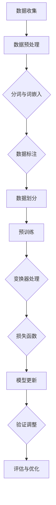

                 

### 第1章：背景与动机

#### 1.1 跨代交流的挑战

跨代交流，即不同年龄段人群之间的交流，是现代社会中不可避免且重要的一环。然而，这一过程却面临着诸多挑战。不同年代的人，由于成长环境、文化背景和语言习惯的差异，往往存在认知和沟通上的障碍。例如，年轻一代可能对长辈使用的词汇或表达方式感到陌生，而年长者也可能难以理解年轻一代的新兴词汇和网络用语。

这些差异不仅影响了日常的社交互动，还可能对工作、教育和家庭生活等各个领域产生负面影响。例如，在职场中，不同年龄段的员工可能因为沟通不畅而导致项目进展受阻；在教育领域，教师和学生之间的代沟可能导致教学效果的下降；在家庭中，代际差异引发的沟通障碍则可能引发家庭矛盾。

随着科技的快速发展，人工智能（AI）作为一种新兴技术，逐渐成为解决这些挑战的有力工具。AI中介工具，如ChatGPT，通过自然语言处理（NLP）和机器学习技术，能够理解和生成人类语言，从而在一定程度上弥合代沟，促进跨代交流。

#### 1.2 AI中介工具的兴起

AI中介工具，特别是基于大型语言模型的工具，如ChatGPT，近年来得到了广泛关注。ChatGPT是由OpenAI开发的一种基于GPT-3（Generative Pre-trained Transformer 3）模型的自然语言处理工具，它通过大量的文本数据进行训练，掌握了丰富的语言知识和表达能力。

ChatGPT的核心优势在于其强大的文本生成能力和跨领域的知识理解能力。通过接收用户输入的文本，ChatGPT能够生成高质量、连贯且具有逻辑性的文本回复。这使得ChatGPT在多种应用场景中都展现出强大的能力，如智能客服、内容生成、语言翻译等。

#### 1.3 ChatGPT的应用场景

ChatGPT的应用场景十分广泛，尤其在跨代交流方面具有显著的优势。以下是一些具体的应用场景：

1. **教育与培训**：ChatGPT可以作为一个虚拟导师，帮助不同年龄段的学生和职场新人快速掌握新知识。它可以通过自然语言交互，为学生提供个性化的学习建议和解答疑惑。

2. **职场交流**：在企业和组织内部，ChatGPT可以作为跨部门沟通的桥梁，帮助不同年龄段的员工理解彼此的言辞和观点，提高工作效率。

3. **家庭互动**：ChatGPT可以帮助家庭成员，特别是年幼的孩子和年长的长辈，通过自然语言交互，解决日常生活中的疑问和困难，增强家庭凝聚力。

4. **医疗咨询**：在医疗领域，ChatGPT可以作为辅助工具，帮助患者和医生之间进行更顺畅的沟通，特别是在解释医学知识方面，它能够用简单易懂的语言解答患者的疑问。

总之，ChatGPT作为一种AI中介工具，在跨代交流中扮演着重要的角色。通过其强大的语言处理能力，ChatGPT能够帮助不同年龄段的人群克服交流障碍，促进理解和沟通。在接下来的章节中，我们将深入探讨ChatGPT的工作原理、设计原则以及其实际应用案例，以全面了解这一AI中介工具的潜力。

### 2.1 ChatGPT的原理

ChatGPT是一种基于生成预训练变换器（GPT）模型的人工智能语言模型，其核心原理基于深度学习和自然语言处理（NLP）技术。要深入理解ChatGPT的工作机制，我们需要从其基本组成部分和训练过程入手。

#### 2.1.1 基本组成部分

ChatGPT主要由以下几个关键组件构成：

1. **嵌入层（Embedding Layer）**：这一层将输入的文本转换为向量表示。每个单词或句子被映射为一个高维向量，使得模型能够处理文本数据。

2. **变换器层（Transformer Layers）**：这是ChatGPT的核心组件，负责对输入的文本向量进行处理。变换器层由多个自注意力机制（Self-Attention Mechanism）和前馈神经网络（Feedforward Neural Network）堆叠而成。自注意力机制允许模型在处理每个词时，动态地考虑其他所有词的重要性，从而捕捉到文本中的复杂关系。

3. **输出层（Output Layer）**：在变换器层的输出上，ChatGPT使用一个线性层（Linear Layer）和一个软化函数（Softmax Function）来预测下一个词的概率分布。通过这种方式，模型能够生成连贯的文本。

4. **解码器（Decoder）**：与编码器（Encoder）一样，解码器也是变换器架构的一部分，用于生成文本回复。解码器通过自注意力机制和交叉注意力机制（Cross-Attention Mechanism）与编码器的输出交互，从而在生成每个词时考虑到前文的内容。

#### 2.1.2 训练过程

ChatGPT的训练过程可以分为两个主要阶段：预训练（Pre-training）和微调（Fine-tuning）。

1. **预训练**：在预训练阶段，ChatGPT通过大量的文本数据进行自我学习，以掌握通用语言知识和模式。具体来说，预训练过程通常包括以下几个步骤：

   - **数据准备**：首先，从互联网上收集大量的文本数据，包括书籍、新闻文章、论坛帖子等。这些数据经过清洗和预处理，以去除噪声和无关信息。
   - **嵌入生成**：将预处理后的文本数据输入到嵌入层，生成文本向量。
   - **变换器训练**：通过变换器层对文本向量进行处理，并在每个步骤中更新权重，以最小化预测误差。
   - **评估与调整**：使用验证集对模型进行评估，并根据评估结果调整模型参数。

2. **微调**：在预训练完成后，ChatGPT会根据特定任务进行微调。微调过程中，模型会利用任务相关的数据进一步优化其性能。例如，对于跨代交流应用，可以提供大量不同年龄段人群之间的对话数据，帮助模型更好地理解不同年龄段的语言特征和交流风格。

#### 2.1.3 工作机制

ChatGPT的工作机制可以概括为以下几个步骤：

1. **输入接收**：用户通过自然语言输入问题或请求。
2. **嵌入生成**：将输入的文本转换为向量表示。
3. **编码与解码**：变换器层对输入文本向量进行处理，解码器根据编码器的输出生成文本回复。
4. **文本生成**：模型根据生成的概率分布，逐词生成文本回复。

通过以上机制，ChatGPT能够理解和生成人类语言，从而实现与用户的自然交互。其强大的语言处理能力和广泛的跨领域知识，使其在多种应用场景中都表现出色。

综上所述，ChatGPT的原理涉及复杂的深度学习技术和自然语言处理技术。通过预训练和微调，ChatGPT能够掌握通用语言知识和特定任务知识，从而实现高效的自然语言生成和交互。在接下来的章节中，我们将进一步探讨ChatGPT的结构、能力与限制，以全面了解这一AI中介工具的特性。

### 2.2 ChatGPT的结构

ChatGPT的结构基于生成预训练变换器（GPT）模型，这一模型在自然语言处理领域具有革命性影响。为了更好地理解ChatGPT的内部工作机制，我们可以将其结构分解为编码器（Encoder）和解码器（Decoder）两部分，并分别介绍其主要组成部分和各自的功能。

#### 2.2.1 编码器

编码器是ChatGPT的核心组件之一，其主要功能是将输入的文本转换为上下文向量表示，以便模型能够理解和处理这些文本。编码器的结构主要包括以下组成部分：

1. **嵌入层（Embedding Layer）**：嵌入层将输入的文本转换为向量表示。每个单词或字符被映射为一个高维向量，这些向量表示了文本的基本语义特征。

2. **自注意力层（Self-Attention Layer）**：自注意力层是编码器的核心，它允许模型在处理每个词时，动态地考虑其他所有词的重要性。通过自注意力机制，编码器能够捕捉到文本中的复杂关系和上下文依赖，从而提高文本理解的准确性。

3. **前馈网络（Feedforward Network）**：在每个自注意力层之后，编码器会通过一个前馈网络对输入进行进一步处理。前馈网络由两个全连接层组成，每个层之间添加了一个ReLU激活函数，以增加模型的非线性表达能力。

4. **多层堆叠**：编码器通常由多个自注意力层和前馈网络堆叠而成，每一层都会对文本向量进行加工，使得模型能够逐步捕捉到更深层次的特征。

#### 2.2.2 解码器

解码器是ChatGPT的另一关键组件，其功能是在编码器的输出基础上生成文本回复。解码器的结构与编码器类似，但也有一些独特的组成部分：

1. **嵌入层（Embedding Layer）**：与编码器相同，解码器的嵌入层将输入的文本转换为向量表示。

2. **自注意力层（Self-Attention Layer）**：解码器的自注意力层允许模型在生成每个词时，动态地考虑前文的内容。这种机制被称为“自注意力”，因为模型只关注前文信息，而不需要编码器的中间表示。

3. **交叉注意力层（Cross-Attention Layer）**：交叉注意力层是解码器的另一个关键组成部分。它允许解码器在生成每个词时，考虑到编码器的输出（即上下文信息）。这种交叉注意力机制使得解码器能够在生成文本回复时，利用编码器对上下文的深入理解。

4. **前馈网络（Feedforward Network）**：与编码器类似，解码器也会通过前馈网络对输入进行加工。前馈网络由两个全连接层组成，每个层之间添加了一个ReLU激活函数。

5. **输出层（Output Layer）**：解码器的输出层通常是一个线性层，其后跟一个软化函数（Softmax Function）。输出层用于预测下一个词的概率分布，从而生成文本回复。

#### 2.2.3 整体结构

ChatGPT的整体结构可以看作是编码器和解码器组成的变换器（Transformer）架构，这种架构使得模型能够高效地处理长文本和复杂关系。具体来说，ChatGPT的结构如下：

1. **输入文本**：用户输入的文本首先通过编码器进行处理，生成上下文向量表示。
2. **编码器输出**：编码器的输出作为解码器的输入，同时解码器会利用自身的嵌入层和自注意力机制生成中间表示。
3. **交叉注意力**：解码器的交叉注意力层在生成每个词时，会考虑到编码器的输出，从而利用编码器对上下文的深入理解。
4. **生成文本回复**：通过解码器的输出层和软化函数，模型最终生成一个概率分布，从中采样得到一个文本回复。

这种结构使得ChatGPT能够在处理自然语言任务时，同时考虑到上下文信息和长距离依赖关系，从而生成高质量、连贯的文本。

总之，ChatGPT的结构基于强大的变换器（Transformer）架构，通过编码器和解码器的协同工作，实现了高效的自然语言处理和生成。在接下来的章节中，我们将进一步探讨ChatGPT的能力与限制，以全面了解这一AI中介工具的潜力。

### 2.3 ChatGPT的能力与限制

ChatGPT作为一种基于大型语言模型的自然语言处理工具，具备许多令人瞩目的能力，但同时也存在一些限制。以下将详细探讨ChatGPT的主要能力和在实际应用中可能遇到的局限性。

#### 2.3.1 主要能力

1. **自然语言理解**：ChatGPT能够通过预训练和微调，掌握丰富的语言知识和模式，从而实现对自然语言的深入理解。它可以理解文本中的语义、上下文关系，并生成与之相符的回复。

2. **文本生成**：ChatGPT具备强大的文本生成能力，可以生成高质量、连贯且具有逻辑性的文本。这种能力在内容生成、故事创作、摘要生成等应用场景中表现出色。

3. **跨领域知识**：通过大规模的预训练数据，ChatGPT积累了广泛的跨领域知识，从而能够应对各种不同主题的对话和任务。这使得它在教育和培训、医疗咨询、企业沟通等多种应用场景中都具有很高的适用性。

4. **灵活的交互**：ChatGPT支持多种形式的自然语言交互，包括问答、对话、文本生成等。这使得它能够与用户进行灵活的互动，满足不同场景下的需求。

5. **实时响应**：ChatGPT能够快速响应用户输入，生成实时回复。这在智能客服、实时翻译等应用中尤为重要，可以提高用户体验和效率。

#### 2.3.2 主要限制

1. **数据依赖**：ChatGPT的性能高度依赖于训练数据的质量和多样性。如果训练数据存在偏差或局限性，模型可能会在特定任务或场景中表现出不理想的性能。

2. **泛化能力**：尽管ChatGPT在预训练阶段积累了丰富的知识，但其在特定任务上的泛化能力仍然有限。在某些复杂或特定领域的任务中，模型可能无法很好地应对新的情况。

3. **事实性错误**：由于模型是基于大量文本数据进行训练的，它可能无法准确区分事实和虚构信息。这可能导致在回答事实性问题时出现错误。

4. **上下文限制**：虽然ChatGPT能够处理长文本和复杂关系，但其在处理长距离依赖和上下文理解方面仍存在一定限制。在某些情况下，模型可能无法准确理解上下文信息。

5. **安全性和隐私**：在使用ChatGPT进行自然语言处理时，可能会涉及到用户隐私和安全问题。如果模型不能妥善处理用户数据，可能会导致数据泄露或其他安全风险。

综上所述，ChatGPT作为一种先进的自然语言处理工具，具备强大的文本生成和理解能力，但在实际应用中仍面临一些挑战和局限性。理解和应对这些能力与限制，对于充分发挥ChatGPT的潜力具有重要意义。

### 3.1 年龄适应性定义

年龄适应性（Age Adaptability）是指人工智能模型在不同年龄段用户之间进行有效沟通和提供合适服务的能力。具体来说，年龄适应性包括以下几个方面：

1. **语言理解**：模型需要能够理解不同年龄段用户的语言习惯、用词选择和表达方式。这意味着模型不仅要能够识别和理解现代年轻人的流行语和网络用语，还要能够理解年长者的传统词汇和表达习惯。

2. **知识表达**：模型在不同年龄段用户之间传递信息时，需要使用适当的语言和概念，使得信息易于理解和接受。这要求模型能够在知识表达上做到灵活转换，既能提供深入的专业知识，也能用简单明了的语言解释复杂概念。

3. **文化敏感性**：不同年龄段的人具有不同的文化背景和价值观念。年龄适应性要求模型在交流过程中能够考虑到这些文化差异，避免使用可能引起误解或不适的词汇和表达。

4. **交互风格**：不同年龄段的人对交互风格的偏好也不同。例如，年轻人可能更喜欢直接、简洁的交流方式，而年长者可能更喜欢正式、礼貌的交流。年龄适应性要求模型能够根据用户的年龄和偏好，调整交互风格，以提高沟通效果。

5. **情感共鸣**：模型在与不同年龄段用户交流时，需要能够识别和理解用户的情感状态，并适当地回应。这意味着模型需要具备一定的情感智能，能够在不同年龄段用户之间建立情感共鸣。

总之，年龄适应性是衡量人工智能模型在跨代交流中表现的重要指标。它不仅关系到模型的实际应用效果，还影响到用户体验和模型的可接受度。在接下来的章节中，我们将进一步探讨年龄适应性的重要性，并分析其在设计原则和评价指标中的具体体现。

### 3.2 年龄适应性重要性

年龄适应性在AI中介工具如ChatGPT中扮演着至关重要的角色，其主要重要性体现在以下几个方面：

1. **提高交流效果**：年龄适应性确保AI中介工具能够理解和回应不同年龄段用户的需求，从而提升交流的质量和效果。例如，在与年轻人交流时，模型需要使用流行语和现代网络用语；而在与年长者交流时，则需使用传统词汇和表达方式。通过适当地调整语言风格，模型能够更好地与用户建立联系，提高交流的流畅性和用户满意度。

2. **减少误解和冲突**：不同年龄段的人由于语言习惯、文化背景和认知差异，可能会在交流中出现误解和冲突。年龄适应性通过理解用户的语言特点和文化背景，减少了这些误解和冲突的发生。例如，在职场沟通中，如果AI中介工具能够识别并调整其语言风格，以适应不同年龄段员工的交流习惯，就能有效避免因语言差异导致的误解和团队冲突。

3. **增强用户体验**：用户对AI中介工具的接受度和满意度很大程度上取决于其交流体验。一个具有良好年龄适应性的模型能够根据用户的年龄和需求，提供个性化的服务，从而使用户感到更加贴心和方便。这种个性化的交流方式不仅提高了用户对AI工具的信任感，还增强了用户的使用意愿。

4. **促进跨代交流**：在现代社会中，跨代交流日益频繁，无论是家庭、职场还是教育领域，不同年龄段之间的交流都具有重要意义。具有年龄适应性的AI中介工具能够作为跨代交流的桥梁，帮助不同年龄段的人更好地理解和沟通。例如，在教育领域，AI中介工具可以帮助教师更好地解释复杂概念，让学生更容易理解；在家庭中，AI中介工具可以协助解决长辈和晚辈之间的沟通难题。

5. **扩展应用范围**：年龄适应性不仅有助于提升现有应用场景中的用户体验，还可以扩展AI中介工具的应用范围。例如，在医疗领域，具有年龄适应性的AI工具可以帮助医生更好地与老年患者沟通，提供个性化的医疗建议；在客服领域，AI中介工具可以更好地理解并满足不同年龄段客户的需求，提高客户满意度和服务质量。

综上所述，年龄适应性是AI中介工具如ChatGPT在跨代交流中不可或缺的一个特性。通过提高交流效果、减少误解和冲突、增强用户体验、促进跨代交流以及扩展应用范围，年龄适应性不仅提升了AI工具的实际应用价值，还为未来的发展奠定了坚实基础。

### 3.3 年龄适应性评价指标

为了全面评估AI中介工具如ChatGPT在跨代交流中的年龄适应性，我们需要建立一系列具体的评价指标。这些评价指标不仅能够量化模型的性能，还能够帮助我们识别和改进模型在年龄适应性方面的不足。以下是几个关键的评价指标：

#### 3.3.1 语言匹配度

**定义**：语言匹配度是指模型在生成回复时，语言风格和表达方式与目标年龄段用户相匹配的程度。

**评价指标**：
- **词汇匹配度**：模型使用的词汇是否与目标年龄段用户的常用词汇相符。
- **表达风格**：模型生成的文本在语法、语调和用词上是否符合目标年龄段用户的交流习惯。
- **内容相关性**：模型生成的回复是否与用户的输入内容保持一致，并能提供有用的信息。

#### 3.3.2 文化适应性

**定义**：文化适应性是指模型在交流过程中，能够考虑到不同年龄段用户的文化背景和价值观念，避免使用可能引起误解或不适的词汇和表达。

**评价指标**：
- **文化敏感度**：模型在交流过程中是否能够识别并尊重不同年龄段用户的文化差异。
- **内容适宜性**：模型生成的文本内容是否符合目标年龄段用户的价值观和审美标准。
- **情境适应性**：模型是否能够在不同的文化和社会情境中，调整其表达方式和内容，以适应特定的交流环境。

#### 3.3.3 情感共鸣

**定义**：情感共鸣是指模型在与用户交流时，能够识别和理解用户的情感状态，并适当地回应，以建立情感联系。

**评价指标**：
- **情感识别度**：模型能否准确识别用户的情感状态，例如快乐、悲伤、焦虑等。
- **情感回应度**：模型在识别用户的情感后，是否能够生成合适的回复，以表达对其情感的共鸣和支持。
- **情感一致性**：模型生成的回复是否与其识别的情感状态保持一致，避免产生冲突或误解。

#### 3.3.4 用户满意度

**定义**：用户满意度是指用户在使用AI中介工具时的整体体验和对其服务的认可程度。

**评价指标**：
- **满意度评分**：通过用户调查或反馈，评估用户对模型服务质量的满意度评分。
- **使用频率**：用户使用模型服务的频率和持续时间，可以反映用户对其服务的依赖程度。
- **问题解决率**：模型在交流过程中，能够有效解决用户问题的比例，直接关系到用户的满意度。

#### 3.3.5 误报率

**定义**：误报率是指模型在识别不同年龄段用户时，发生错误匹配或误解的频率。

**评价指标**：
- **误报次数**：模型在交流过程中，错误识别用户年龄的次数。
- **误报率**：误报次数与总交流次数的比值，用于衡量模型的识别准确性。
- **纠正效率**：在误报发生后，模型能够迅速调整和纠正错误回复的效率。

通过上述评价指标，我们可以对AI中介工具的年龄适应性进行全面评估。这些指标不仅帮助我们识别模型在年龄适应性方面的优点和不足，还为后续的优化和改进提供了重要依据。在实际应用中，我们可以根据具体情况，选择合适的评价指标组合，以最全面、最准确地评估模型的年龄适应性。

### 4.1 用户需求分析

在设计和实现ChatGPT的年龄适应性时，理解用户的需求是至关重要的一步。不同年龄段用户在交流时有着各自独特的需求，这些需求直接影响着AI中介工具的功能和性能。以下是对主要用户群体的需求分析：

#### 4.1.1 年轻人

年轻人通常活跃于社交媒体、在线学习和娱乐等领域。他们的需求主要体现在以下几个方面：

1. **即时性**：年轻人更喜欢即时性的交流方式，他们期望AI中介工具能够迅速响应，提供即时的信息和帮助。

2. **简洁性**：年轻人在语言表达上更倾向于简洁、直接的交流，他们喜欢使用简短的语言和流行语，因此AI中介工具在生成回复时，应尽量使用简洁明了的语言。

3. **个性化**：年轻人追求个性化的体验，他们希望AI中介工具能够根据他们的兴趣和偏好提供个性化的服务和推荐。

4. **娱乐性**：年轻人在交流过程中追求娱乐性，他们喜欢幽默、搞笑的回复，因此AI中介工具可以适当引入娱乐元素，以增加用户的参与感和互动性。

#### 4.1.2 年长者

年长者通常活跃于家庭生活、医疗咨询和教育等领域。他们的需求主要体现在以下几个方面：

1. **准确性**：年长者更关注交流的准确性和信息可靠性，他们希望AI中介工具能够提供准确、可靠的答案和信息。

2. **易懂性**：年长者在语言理解上可能存在一定的困难，他们倾向于使用简单、易懂的语言，因此AI中介工具在生成回复时，应尽量避免复杂的专业术语和难以理解的表述。

3. **权威性**：年长者倾向于依赖权威的信息来源，他们希望AI中介工具能够提供来自权威机构或专家的建议和信息。

4. **便捷性**：年长者可能对技术操作不太熟悉，他们希望AI中介工具的操作简单、易用，减少不必要的复杂步骤。

#### 4.1.3 中年人

中年人通常活跃于职场、家庭和社区等领域，他们的需求介于年轻人和年长者之间：

1. **高效性**：中年人追求高效的工作和生活，他们希望AI中介工具能够帮助他们快速解决问题，提高工作效率。

2. **中立性**：中年人在交流中倾向于中立、客观的表达方式，他们不喜欢过于个人化或情绪化的交流，因此AI中介工具应保持中立、客观的风格。

3. **多样性**：中年人需要多样化的信息和服务，他们希望AI中介工具能够提供广泛的知识领域和多种类型的帮助。

4. **安全性**：中年人注重隐私和安全，他们希望AI中介工具能够保护他们的个人信息，避免数据泄露。

通过上述对主要用户群体的需求分析，我们可以看到，不同年龄段的用户在交流时有着不同的需求和期望。AI中介工具如ChatGPT在设计和实现年龄适应性时，需要充分考虑这些差异，为不同用户提供个性化的服务和体验。这将有助于提高用户满意度，增强工具的实际应用价值。

### 4.2 数据处理与模型训练

为了实现ChatGPT的年龄适应性，数据处理与模型训练是关键环节。以下将详细探讨数据处理的方法、模型训练的过程以及使用Mermaid流程图展示的核心概念与联系。

#### 4.2.1 数据处理方法

1. **数据收集**：首先，我们需要收集大量的文本数据，包括书籍、文章、论坛帖子、社交媒体发言等，以确保模型的多样性。数据来源应涵盖不同年龄段、不同领域和不同文化背景，以充分代表用户群体。

2. **数据预处理**：预处理是数据处理的重要步骤。具体包括：
   - **文本清洗**：去除文本中的噪声和无关信息，如HTML标签、特殊字符等。
   - **文本标准化**：统一文本格式，如将所有文本转换为小写，去除标点符号等。
   - **分词与词嵌入**：使用分词工具将文本分解为单词或词组，并将每个词映射为向量表示。

3. **数据标注**：为了训练年龄适应性模型，需要对数据进行标注。标注方式包括：
   - **年龄标签**：为每个文本数据标注对应的年龄段，如青年、中年、老年等。
   - **交流风格标签**：为文本标注对应的交流风格，如正式、非正式、幽默等。
   - **情感标签**：为文本标注情感标签，如积极、消极、中性等。

4. **数据划分**：将处理后的数据划分为训练集、验证集和测试集。训练集用于模型训练，验证集用于调整模型参数，测试集用于最终评估模型性能。

#### 4.2.2 模型训练过程

1. **预训练**：使用大规模的预训练数据集，通过变换器模型（如GPT-3）进行预训练。预训练过程中，模型会自动学习文本中的语言模式和语义知识。预训练步骤包括：
   - **输入生成**：将输入的文本序列转换为嵌入向量。
   - **变换器处理**：通过多层变换器层对文本向量进行处理，逐步提取文本的深层特征。
   - **损失函数**：使用交叉熵损失函数计算模型预测的误差，并更新模型参数。

2. **微调**：在预训练完成后，利用特定任务的数据集进行微调，以进一步提高模型在特定任务上的性能。微调步骤包括：
   - **输入处理**：将特定任务的数据集转换为嵌入向量。
   - **模型更新**：利用微调数据集对模型进行训练，调整模型参数。
   - **验证调整**：使用验证集对模型进行评估，根据评估结果调整模型参数。

3. **评估与优化**：通过测试集对模型进行最终评估，评估指标包括语言匹配度、文化适应性、情感共鸣和用户满意度等。根据评估结果，对模型进行优化和调整。

#### 4.2.3 Mermaid流程图展示

以下是使用Mermaid绘制的数据处理与模型训练流程图，展示核心概念与联系：



通过上述流程图，我们可以清晰地看到数据处理和模型训练的步骤及其相互联系。数据从收集、预处理、标注、划分，到模型的预训练、微调和优化，每一步都紧密关联，共同构成了一个完整的数据处理与模型训练过程。

综上所述，数据处理与模型训练是实现ChatGPT年龄适应性的核心环节。通过有效的数据处理和精细的模型训练，我们可以构建一个能够适应不同年龄段用户需求的AI中介工具，从而提升其在跨代交流中的性能和用户体验。

### 4.3 提示词设计策略

提示词（Prompt）在ChatGPT的交互过程中起到至关重要的作用，尤其是在实现年龄适应性方面。通过精心设计的提示词，我们可以引导模型生成与目标年龄段用户更加匹配的回复，从而提高交流的准确性和流畅性。以下将详细探讨提示词设计的原则和方法。

#### 4.3.1 提示词设计原则

1. **针对性**：根据用户的具体需求、交流内容和年龄段，设计具有针对性的提示词。例如，对于年轻人，可以使用现代流行语和网络用语；而对于年长者，则使用传统词汇和简单明了的表达。

2. **多样性**：设计多种类型的提示词，以满足不同场景和用户需求。例如，可以是简单的问题提问，也可以是复杂的情境描述，甚至包括情感表达和幽默元素等。

3. **引导性**：通过提示词引导模型理解用户意图，使模型生成更加精准和相关的回复。例如，在医疗咨询场景中，提示词可以包括患者的症状描述、既往病史等，帮助模型更好地诊断和提供建议。

4. **灵活性**：提示词应具有一定的灵活性，能够根据实际交互情况动态调整。例如，在回答用户问题时，可以根据用户的回应和后续提问，灵活地调整提问方式和内容。

5. **文化敏感性**：考虑不同年龄段用户的文化背景和价值观，避免使用可能引起误解或不适的词汇和表达。例如，在跨文化交流中，应避免使用可能具有文化差异的词汇和表达方式。

#### 4.3.2 提示词设计方法

1. **情景模拟**：通过情景模拟的方式设计提示词，模拟不同年龄段用户的交流场景，从而生成合适的提示词。例如，可以设计一个教育场景，模拟年轻学生和年长教师之间的互动，并根据不同角色设计相应的提示词。

2. **数据驱动**：利用用户行为数据和交流记录，分析不同年龄段用户的偏好和需求，从而生成具有针对性的提示词。例如，可以通过分析用户的历史提问和回复，提取出常见的提问模式和需求，然后根据这些模式设计提示词。

3. **规则化**：根据不同年龄段用户的交流特点，制定一系列规则化的提示词。例如，对于年轻人，可以设计一系列使用流行语和简短表达的提示词；而对于年长者，则设计一系列使用简单词汇和正式表达的提示词。

4. **人工调整**：在初步设计的提示词基础上，通过人工调整和优化，使其更加符合实际应用需求。例如，可以根据用户的反馈和评估结果，对提示词进行调整和优化，以提高模型的准确性和用户体验。

#### 4.3.3 提示词示例

以下是一些不同年龄段的提示词示例：

- **年轻人**：
  - “嘿，最近有什么好玩的事情吗？”
  - “有没有什么流行的歌曲推荐？”
  - “你觉得最新的游戏怎么样？”

- **年长者**：
  - “请问，最近天气变化大，您需要注意保暖。”
  - “我想了解一下，最近有哪些健康食品推荐？”
  - “您在日常生活中有哪些好习惯可以分享吗？”

- **中年人**：
  - “最近工作忙吗？有什么需要帮忙的吗？”
  - “您最近有没有读到什么有趣的书？”
  - “公司最近有什么新的项目进展吗？”

通过上述设计原则和方法的指导，我们可以设计出具有高度年龄适应性的提示词，从而提升ChatGPT在不同年龄段用户之间的交流效果和用户体验。

综上所述，提示词设计是实现ChatGPT年龄适应性的重要环节。通过针对性、多样性、引导性、灵活性和文化敏感性等原则，结合情景模拟、数据驱动、规则化和人工调整等方法，我们可以设计出高质量的提示词，从而提高模型的性能和用户体验。

### 5.1 相关算法介绍

为了实现ChatGPT的年龄适应性，我们需要引入一系列算法来优化模型在不同年龄段用户之间的表现。以下是几个关键算法的简要介绍：

#### 5.1.1 自注意力机制（Self-Attention）

自注意力机制是变换器（Transformer）模型的核心组成部分，它允许模型在处理每个词时，动态地考虑其他所有词的重要性。具体来说，自注意力机制通过计算词与词之间的相似度，生成一组权重，这些权重用于调整每个词的嵌入向量，使其在生成过程中更加关注重要信息。

**算法原理**：
1. **输入嵌入**：将输入的文本转换为嵌入向量。
2. **计算相似度**：使用点积或缩放点积的方法，计算每个词与其余词之间的相似度。
3. **生成权重**：根据相似度计算结果，生成一组权重向量。
4. **加权求和**：使用权重向量对每个词的嵌入向量进行加权求和，生成新的嵌入向量。

**伪代码**：
```python
def self_attention(inputs):
    # inputs: 输入文本的嵌入向量
    query = inputs  # 查询向量
    key = inputs  # 关键词向量
    value = inputs  # 价值观向量
    
    # 计算相似度
    similarity = dot_product(query, key)
    
    # 生成权重
    weights = softmax(similarity)
    
    # 加权求和
    context_vector = dot_product(weights, value)
    
    return context_vector
```

#### 5.1.2 交叉注意力机制（Cross-Attention）

交叉注意力机制在解码器中用于将编码器的输出（上下文信息）与解码器的当前输出（中间表示）进行关联。通过交叉注意力，解码器能够在生成每个词时，考虑到编码器的输出，从而生成与上下文高度相关的文本回复。

**算法原理**：
1. **输入嵌入**：将编码器的输出和解码器的输入（中间表示）转换为嵌入向量。
2. **计算相似度**：计算解码器的中间表示与编码器的输出之间的相似度。
3. **生成权重**：根据相似度计算结果，生成一组权重向量。
4. **加权求和**：使用权重向量对编码器的输出进行加权求和，生成上下文向量。

**伪代码**：
```python
def cross_attention(decoder_input, encoder_output):
    # decoder_input: 解码器的输入嵌入向量
    # encoder_output: 编码器的输出嵌入向量
    
    # 计算相似度
    similarity = dot_product(decoder_input, encoder_output)
    
    # 生成权重
    weights = softmax(similarity)
    
    # 加权求和
    context_vector = dot_product(weights, encoder_output)
    
    return context_vector
```

#### 5.1.3 多层变换器堆叠（Multi-Layer Transformer Stacking）

多层变换器堆叠是将多个自注意力机制和前馈网络堆叠在一起，形成一个深度变换器模型。通过堆叠多层变换器，模型能够逐步提取文本的深层特征，从而提高其理解能力和文本生成质量。

**算法原理**：
1. **输入嵌入**：将输入的文本转换为嵌入向量。
2. **多层处理**：逐层应用自注意力机制和前馈网络，对嵌入向量进行加工和转换。
3. **输出生成**：在最后一层变换器的基础上，生成文本回复。

**伪代码**：
```python
def transformer_model(inputs, num_layers):
    # inputs: 输入文本的嵌入向量
    # num_layers: 变换器层的数量
    
    for layer in range(num_layers):
        inputs = self_attention(inputs)
        inputs = feedforward_network(inputs)
    
    return inputs
```

通过上述算法，我们可以构建一个强大的变换器模型，使其在处理自然语言任务时，具备较高的理解能力和文本生成质量。在实现ChatGPT的年龄适应性时，这些算法可以帮助模型更好地理解不同年龄段用户的语言特征和交流需求，从而生成更加精准和合适的回复。

### 5.2 算法原理讲解

在深入讲解实现ChatGPT年龄适应性的算法原理之前，我们需要先理解几个关键概念：自注意力机制（Self-Attention）、交叉注意力机制（Cross-Attention）和多层变换器（Multi-Layer Transformer）。这些概念构成了变换器（Transformer）模型的核心，使得ChatGPT在处理自然语言任务时具有强大的能力。

#### 5.2.1 自注意力机制

自注意力机制是变换器模型中用于处理输入文本的一种机制。它允许模型在处理每个词时，动态地考虑其他所有词的重要性。具体来说，自注意力机制通过计算词与词之间的相似度，生成一组权重，这些权重用于调整每个词的嵌入向量，使其在生成过程中更加关注重要信息。

**数学模型**：

设输入文本为 $X = \{x_1, x_2, \ldots, x_n\}$，每个词的嵌入向量为 $e(x_i) \in \mathbb{R}^d$。自注意力机制的核心是计算词 $x_i$ 与其余词之间的相似度，通常使用点积或缩放点积的方法：

$$
\text{similarity}(x_i, x_j) = e(x_i)^T e(x_j)
$$

为了生成权重，我们使用 softmax 函数对相似度进行归一化：

$$
\alpha_{ij} = \frac{e^{s_{ij}}}{\sum_{k=1}^{n} e^{s_{ik}}}
$$

其中，$s_{ij}$ 是词 $x_i$ 和 $x_j$ 之间的相似度，$\alpha_{ij}$ 是词 $x_i$ 对应的权重。

最后，使用权重向量对每个词的嵌入向量进行加权求和，生成新的嵌入向量：

$$
\text{context\_vector}(x_i) = \sum_{j=1}^{n} \alpha_{ij} e(x_j)
$$

通过这种方式，自注意力机制使得模型能够动态地调整每个词的嵌入向量，使其在生成过程中更加关注重要信息。

**伪代码**：

```python
def self_attention(inputs):
    # inputs: 输入文本的嵌入向量
    query = inputs  # 查询向量
    key = inputs  # 关键词向量
    value = inputs  # 价值观向量
    
    # 计算相似度
    similarity = dot_product(query, key)
    
    # 生成权重
    weights = softmax(similarity)
    
    # 加权求和
    context_vector = dot_product(weights, value)
    
    return context_vector
```

#### 5.2.2 交叉注意力机制

交叉注意力机制是解码器（Decoder）中的一个关键组件，它用于在生成每个词时，考虑到编码器的输出（即上下文信息）。通过交叉注意力，解码器能够生成与上下文高度相关的文本回复。

**数学模型**：

设解码器的输入为 $d = \{d_1, d_2, \ldots, d_n\}$，编码器的输出为 $c = \{c_1, c_2, \ldots, c_n\}$。交叉注意力机制的核心是计算解码器的中间表示与编码器的输出之间的相似度：

$$
\text{similarity}(d_i, c_j) = e(d_i)^T e(c_j)
$$

使用 softmax 函数对相似度进行归一化，生成权重：

$$
\beta_{ij} = \frac{e^{s_{ij}}}{\sum_{k=1}^{n} e^{s_{ik}}}
$$

最后，使用权重向量对编码器的输出进行加权求和，生成上下文向量：

$$
\text{context\_vector}(d_i) = \sum_{j=1}^{n} \beta_{ij} e(c_j)
$$

通过这种方式，交叉注意力机制使得解码器能够在生成每个词时，动态地调整其输出，使其与编码器的上下文信息保持一致。

**伪代码**：

```python
def cross_attention(decoder_input, encoder_output):
    # decoder_input: 解码器的输入嵌入向量
    # encoder_output: 编码器的输出嵌入向量
    
    # 计算相似度
    similarity = dot_product(decoder_input, encoder_output)
    
    # 生成权重
    weights = softmax(similarity)
    
    # 加权求和
    context_vector = dot_product(weights, encoder_output)
    
    return context_vector
```

#### 5.2.3 多层变换器

多层变换器是通过堆叠多个自注意力机制和前馈网络，形成的一个深度变换器模型。通过多层变换器，模型能够逐步提取文本的深层特征，从而提高其理解能力和文本生成质量。

**数学模型**：

设输入文本为 $X = \{x_1, x_2, \ldots, x_n\}$，每个词的嵌入向量为 $e(x_i) \in \mathbb{R}^d$。多层变换器的处理过程可以表示为：

$$
\text{context\_vector}(x_i) = \text{transformer\_model}(x_i, \text{num\_layers})
$$

其中，$\text{transformer\_model}$ 表示多层变换器模型，$\text{num\_layers}$ 表示变换器层的数量。

在每个变换器层中，我们使用自注意力机制和前馈网络对嵌入向量进行处理：

$$
h_{t}^{(l)} = \text{self\_attention}(h_{t}^{(l-1)}) + \text{feedforward}(h_{t}^{(l-1)})
$$

其中，$h_{t}^{(l)}$ 表示在第 $l$ 层的输出，$\text{self\_attention}$ 和 $\text{feedforward}$ 分别表示自注意力和前馈网络。

**伪代码**：

```python
def transformer_model(inputs, num_layers):
    # inputs: 输入文本的嵌入向量
    # num_layers: 变换器层的数量
    
    for layer in range(num_layers):
        inputs = self_attention(inputs)
        inputs = feedforward_network(inputs)
    
    return inputs
```

通过上述算法原理的讲解，我们可以看到自注意力机制、交叉注意力机制和多层变换器如何共同作用，使得ChatGPT在处理自然语言任务时具有强大的能力。这些算法不仅帮助模型捕捉到文本中的复杂关系和上下文依赖，还使其能够生成高质量、连贯的文本回复。在实现ChatGPT的年龄适应性时，我们可以利用这些算法，优化模型在不同年龄段用户之间的表现，从而提高其跨代交流的准确性。

### 5.3 伪代码展示

为了使读者更好地理解实现ChatGPT年龄适应性所需的算法和数据处理流程，以下将展示相关的伪代码。这些代码涵盖了数据预处理、模型训练和优化等关键步骤。

```python
# 数据预处理
def preprocess_data(data):
    # 数据清洗
    cleaned_data = clean_text(data)
    
    # 分词与词嵌入
    tokenized_data = tokenize(cleaned_data)
    embedded_data = embed_tokens(tokenized_data)
    
    return embedded_data

# 模型训练
def train_model(embedded_data, num_layers, learning_rate):
    # 初始化模型
    model = initialize_model(num_layers, learning_rate)
    
    # 预训练
    for epoch in range(num_epochs):
        for inputs in embedded_data:
            model.forward(inputs)
            loss = compute_loss(model.outputs, target)
            model.backward(loss)
            model.update_weights()
        
        # 验证调整
        validate_model(model, validation_data)
    
    return model

# 实现自注意力机制
def self_attention(inputs):
    # 计算相似度
    similarity = dot_product(inputs, inputs)
    
    # 生成权重
    weights = softmax(similarity)
    
    # 加权求和
    context_vector = dot_product(weights, inputs)
    
    return context_vector

# 实现交叉注意力机制
def cross_attention(decoder_input, encoder_output):
    # 计算相似度
    similarity = dot_product(decoder_input, encoder_output)
    
    # 生成权重
    weights = softmax(similarity)
    
    # 加权求和
    context_vector = dot_product(weights, encoder_output)
    
    return context_vector

# 实现多层变换器
def transformer_model(inputs, num_layers):
    # 初始化嵌入向量
    context_vector = inputs
    
    for layer in range(num_layers):
        context_vector = self_attention(context_vector)
        context_vector = feedforward_network(context_vector)
    
    return context_vector

# 实现模型更新
def update_model(model, inputs, target, learning_rate):
    # 前向传播
    outputs = model.forward(inputs)
    
    # 计算损失
    loss = compute_loss(outputs, target)
    
    # 反向传播
    model.backward(loss)
    
    # 更新权重
    model.update_weights(learning_rate)

# 主函数
def main():
    # 加载数据
    data = load_data()
    
    # 数据预处理
    embedded_data = preprocess_data(data)
    
    # 训练模型
    model = train_model(embedded_data, num_layers=3, learning_rate=0.001)
    
    # 测试模型
    test_outputs = model.forward(test_inputs)
    test_loss = compute_loss(test_outputs, test_targets)
    
    print("Test Loss:", test_loss)

if __name__ == "__main__":
    main()
```

通过上述伪代码，我们可以看到以下几个关键步骤：

1. **数据预处理**：包括数据清洗、分词与词嵌入等步骤，将原始文本数据转换为嵌入向量。
2. **模型训练**：包括初始化模型、预训练和验证调整等步骤，使用嵌入向量进行模型训练，并不断调整模型参数以提高性能。
3. **自注意力机制和交叉注意力机制**：通过计算相似度和生成权重，实现自注意力和交叉注意力，从而捕捉文本中的复杂关系和上下文依赖。
4. **多层变换器**：通过堆叠多个自注意力和前馈网络，形成深度变换器模型，逐步提取文本的深层特征。
5. **模型更新**：包括前向传播、反向传播和权重更新等步骤，通过梯度下降等优化算法，不断调整模型参数以降低损失函数。

这些伪代码展示了实现ChatGPT年龄适应性的关键技术和步骤，有助于读者深入理解模型的工作原理和实现细节。

### 6.1 案例一：教育场景

在教育领域，ChatGPT的年龄适应性具有广泛的应用潜力。以下是一个具体的教育场景案例，展示如何使用ChatGPT作为跨代交流的工具，帮助不同年龄段的学生和教师之间建立有效沟通。

**场景描述**：

在一个中学的数学课堂上，教师需要为学生解释复杂的数学概念，如微积分和线性代数。然而，不同年龄段的学生对语言的理解能力不同，一些学生可能难以理解教师使用的高难度术语和表达方式。同时，教师也可能需要适应学生的年龄特点，以便更好地传达知识。

**解决方案**：

1. **个性化学习路径**：ChatGPT可以根据学生的年龄、年级和学术背景，提供个性化的学习建议和资源。例如，对于初中生，ChatGPT可以简化术语，使用更直观的例子来解释概念。

```plaintext
学生：老师，我不明白微积分是什么。
ChatGPT：微积分是研究如何计算和描述变化的数学工具。想象一下，你看到一辆汽车在加速，你可以用微积分来计算它加速的速度。简单来说，微积分帮助我们理解事物的变化过程。
```

2. **互动式教学**：ChatGPT可以作为课堂辅助工具，与教师一起参与教学互动。它可以在课堂中提出问题，引导学生思考和参与讨论，从而提高学生的参与度和学习兴趣。

```plaintext
ChatGPT：同学们，谁能告诉我微积分在现实生活中有哪些应用？
学生1：微积分可以用来计算物体的运动轨迹。
学生2：微积分还可以用于优化生产过程中的资源使用。
```

3. **课后辅导**：ChatGPT可以在课后为学生提供额外的辅导和支持，解答他们在学习过程中遇到的问题。通过自然语言交互，ChatGPT可以为学生提供详细、易懂的解释和示例。

```plaintext
学生：请问，线性代数中的矩阵是什么？
ChatGPT：矩阵是一个由数字组成的方阵，它可以用来表示数学和现实世界中的各种关系。例如，你可以用矩阵来描述二维平面上的线性变换，就像我们在绘画中使用颜色和线条一样。
```

4. **教师辅助**：ChatGPT可以帮助教师准备教案和教学材料，使教学内容更加生动和有趣。例如，教师可以要求ChatGPT生成与教学内容相关的有趣故事或案例，以激发学生的学习兴趣。

```plaintext
教师：请给我一个关于线性代数的有趣故事。
ChatGPT：有一只名叫“矩阵”的猫，它在追逐一只名叫“行列式”的兔子。这只猫沿着一条直线奔跑，而兔子则在两个平面之间跳跃。矩阵猫必须通过解决线性方程组来找到兔子的位置，最终追上它。
```

**代码实现**：

在实际应用中，ChatGPT的代码实现需要结合后端服务器和API接口。以下是一个简化的代码实现示例，展示如何使用ChatGPT与教师和学生的交互：

```python
import openai

# 初始化OpenAI API密钥
openai.api_key = "your-api-key"

def ask_question(question):
    response = openai.Completion.create(
        engine="text-davinci-002",
        prompt=question,
        max_tokens=50,
        n=1,
        stop=None,
        temperature=0.5,
    )
    return response.choices[0].text.strip()

# 学生提问
student_question = "我不明白微积分是什么。"
answer = ask_question(student_question)
print(answer)

# 教师提问
teacher_question = "请给我一个关于线性代数的有趣故事。"
story = ask_question(teacher_question)
print(story)
```

**案例分析**：

通过以上案例，我们可以看到ChatGPT在教育场景中的实际应用。它不仅能够根据学生的年龄和理解能力，提供个性化的教学支持，还能够通过互动式教学和课后辅导，提高学生的学习效果和兴趣。此外，ChatGPT还可以为教师提供辅助工具，帮助他们更好地准备教学内容和进行教学互动。这些应用展示了ChatGPT在跨代交流中的强大潜力，有助于缓解教育领域的代沟问题，提升教育质量。

### 6.2 案例二：职场交流

在职场环境中，跨代交流的挑战尤为突出，不同年龄段员工之间的沟通障碍可能导致工作效率低下和团队冲突。以下是一个职场交流案例，展示如何利用ChatGPT作为跨代交流的中介工具，提升团队协作效果。

**场景描述**：

在一个大型企业中，由不同年龄段员工组成的团队正在共同完成一个复杂的项目。团队成员包括年轻的开发人员、中年层的管理层和年长的顾问。由于年龄和经验的差异，团队成员在沟通方式和语言表达上存在明显差异，导致沟通不畅和误解频发。

**解决方案**：

1. **跨代沟通桥梁**：ChatGPT可以作为跨代沟通的桥梁，帮助团队成员更好地理解彼此的沟通风格和语言习惯。例如，当年轻开发人员使用专业术语时，ChatGPT可以将其转换成更易懂的语言，供年长顾问理解。

```plaintext
开发人员：我们需要用Docker容器化这个应用。
ChatGPT（转述）：我们需要使用Docker技术来将这个应用打包成一个独立的容器，这样它就可以在任意环境中运行，而不受操作系统或硬件的限制。
```

2. **语言风格调整**：ChatGPT可以根据不同的年龄组和岗位需求，调整其语言风格。对于中年层的管理层，ChatGPT可以使用正式、专业的表达方式；对于年长顾问，ChatGPT则可以使用更传统、正式的语言。

```plaintext
管理层：我们需要在下周的会议上讨论项目进展。
ChatGPT：请各位同事注意，我们将在下周三上午九点召开项目进展会议，届时我们将详细讨论项目的当前状态和下一步计划。
```

3. **项目协作指南**：ChatGPT可以生成项目协作指南，提供清晰、明确的步骤和说明，帮助团队成员更好地理解项目任务和流程。这些指南可以根据团队成员的年龄和理解能力进行调整。

```plaintext
初级开发人员：请告诉我如何开始这个项目。
ChatGPT：首先，你需要安装必要的开发工具和软件，如Git和Docker。然后，请从我们的代码仓库中克隆项目，并按照README文件中的指示进行配置和构建。接下来，你可以开始编写和测试代码。
```

4. **跨代培训与支持**：ChatGPT可以作为跨代培训工具，帮助团队成员了解不同年代的工作习惯和文化。例如，对于年轻的开发人员，ChatGPT可以介绍年长顾问的丰富经验和职场智慧；对于年长顾问，ChatGPT可以介绍新兴技术和工具。

```plaintext
年长顾问：你们如何处理项目管理中的风险？
ChatGPT：在项目管理中，风险识别和控制是非常重要的。首先，我们需要识别可能的风险因素，然后制定相应的应对策略。在实际操作中，我们可以通过定期评估和调整计划来控制风险。
```

**代码实现**：

在实际应用中，ChatGPT的代码实现需要结合后端服务器和API接口。以下是一个简化的代码实现示例，展示如何使用ChatGPT与团队成员的交互：

```python
import openai

# 初始化OpenAI API密钥
openai.api_key = "your-api-key"

def ask_question(question):
    response = openai.Completion.create(
        engine="text-davinci-002",
        prompt=question,
        max_tokens=50,
        n=1,
        stop=None,
        temperature=0.5,
    )
    return response.choices[0].text.strip()

# 开发人员提问
dev_question = "如何容器化这个应用？"
answer = ask_question(dev_question)
print(answer)

# 管理层提问
manager_question = "请给我一个项目协作指南。"
guide = ask_question(manager_question)
print(guide)
```

**案例分析**：

通过以上案例，我们可以看到ChatGPT在职场交流中的应用，如何帮助不同年龄段的员工克服沟通障碍，提升团队协作效果。ChatGPT通过调整语言风格、提供跨代沟通桥梁和项目协作指南，使得团队成员能够更好地理解彼此的需求和表达。这不仅提高了工作效率，还减少了团队冲突，促进了团队和谐。这展示了ChatGPT在跨代交流中的强大潜力，为职场环境中的沟通问题提供了一种创新的解决方案。

### 6.3 案例三：家庭生活

在家庭生活中，跨代交流的挑战同样显著，不同年龄段的家庭成员可能在沟通方式和表达习惯上存在差异，导致家庭矛盾和误解。以下是一个家庭生活案例，展示如何利用ChatGPT作为跨代交流的工具，促进家庭成员之间的理解和沟通。

**场景描述**：

在一个三口之家，父亲是年长的企业高管，母亲是中年职业女性，儿子是年轻的大学生。由于工作繁忙和生活方式的差异，家庭成员之间的交流较少，有时甚至因为语言和观念的不同而产生矛盾。父亲希望与儿子分享自己的工作经验和人生智慧，但儿子却觉得父亲的观点过时；母亲在家庭决策中希望听取儿子的意见，但儿子觉得母亲不够理解他的需求和想法。

**解决方案**：

1. **个性化交流**：ChatGPT可以根据家庭成员的年龄和兴趣，生成个性化的交流内容，促进彼此之间的理解。例如，父亲可以与ChatGPT讨论他的职业生涯经验，而ChatGPT则可以将其以更年轻、更容易理解的方式呈现给儿子。

```plaintext
父亲：我想和你谈谈我的职业生涯。
ChatGPT：好的，父亲。您的工作经验非常丰富，我可以帮您整理成几个关键点，然后与您儿子分享，这样他可以更好地理解您的经历和智慧。
```

2. **情感共鸣**：ChatGPT可以识别家庭成员的情感状态，并提供相应的支持和建议。例如，当儿子感到压力时，ChatGPT可以提供放松的建议和心理支持。

```plaintext
儿子：最近感觉压力很大，不知道该怎么办。
ChatGPT：我能理解你的感受，压力是生活中不可避免的一部分。你可以试试做一些放松的活动，比如瑜伽、阅读或者和朋友聊天，这些都有助于缓解压力。
```

3. **家庭活动建议**：ChatGPT可以根据家庭成员的兴趣和需求，提供家庭活动建议，促进家庭成员之间的互动和交流。例如，母亲可以要求ChatGPT推荐一些适合全家参与的活动。

```plaintext
母亲：我们最近想一起做一些活动，你有什么建议吗？
ChatGPT：当然，我们可以一起做饭、散步或者打一场家庭羽毛球赛。这些活动既有趣又能增进家庭感情。
```

4. **家庭决策支持**：ChatGPT可以帮助家庭成员在家庭决策中达成共识，减少分歧。例如，当家庭成员在购买家电时意见不合时，ChatGPT可以提供中立、客观的建议。

```plaintext
儿子：我觉得我们应该买一台智能电视。
母亲：但我更喜欢传统电视，觉得智能电视操作太复杂。
ChatGPT：你们可以考虑购买一台智能电视，这样既能享受智能功能，又不会因为操作复杂而感到不便。我们可以选择一款用户界面友好、易于操作的品牌。
```

**代码实现**：

在实际应用中，ChatGPT的代码实现需要结合后端服务器和API接口。以下是一个简化的代码实现示例，展示如何使用ChatGPT与家庭成员的互动：

```python
import openai

# 初始化OpenAI API密钥
openai.api_key = "your-api-key"

def ask_question(question):
    response = openai.Completion.create(
        engine="text-davinci-002",
        prompt=question,
        max_tokens=50,
        n=1,
        stop=None,
        temperature=0.5,
    )
    return response.choices[0].text.strip()

# 父亲提问
father_question = "我想和儿子谈谈我的职业生涯。"
answer = ask_question(father_question)
print(answer)

# 儿子提问
son_question = "我最近感觉压力很大，该怎么办？"
suggestion = ask_question(son_question)
print(suggestion)

# 母亲提问
mother_question = "我们最近想一起做一些活动，你有什么建议吗？"
activity_suggestion = ask_question(mother_question)
print(activity_suggestion)
```

**案例分析**：

通过以上案例，我们可以看到ChatGPT在家庭生活中的实际应用，如何帮助家庭成员克服代沟，促进理解和沟通。ChatGPT通过个性化交流、情感共鸣、家庭活动建议和家庭决策支持，为家庭成员提供了一个中立、客观的交流平台。这不仅缓解了家庭矛盾，还增强了家庭成员之间的情感联系，提高了家庭生活质量。这展示了ChatGPT在跨代交流中的潜力，为家庭生活提供了一种创新的解决方案。

### 7.1 评估指标与方法

为了全面评估ChatGPT在年龄适应性方面的性能，我们需要建立一套科学、合理的评估指标和方法。这些指标将帮助我们衡量ChatGPT在不同年龄段用户之间的表现，并提供优化和改进的方向。以下是几个关键的评估指标及其具体方法：

#### 7.1.1 语言匹配度

**定义**：语言匹配度是指模型生成的回复在语言风格、用词选择和表达方式上与目标年龄段用户相匹配的程度。

**评估方法**：
- **人工评估**：通过专家评审或用户调查，评估模型生成的回复是否与用户的需求和期望相符。专家评审团可以根据语言风格、用词选择和表达方式的匹配度，为每个回复评分。
- **自动评估**：使用文本相似度算法（如Jaccard相似度、余弦相似度等）计算模型生成的回复与目标年龄段用户的语言特征之间的相似度。

#### 7.1.2 文化适应性

**定义**：文化适应性是指模型在交流过程中，能够考虑不同年龄段用户的文化背景和价值观念，避免使用可能引起误解或不适的词汇和表达。

**评估方法**：
- **文化背景测试**：通过设计包含不同文化背景的测试场景，评估模型在跨文化交流中的表现。例如，可以设置包含不同文化习俗、节日和禁忌的对话场景，观察模型是否能够正确识别并尊重这些文化差异。
- **用户反馈**：收集用户对模型生成回复的文化适应性的反馈，通过用户满意度调查或开放性问题，了解用户对模型表现的评价。

#### 7.1.3 情感共鸣

**定义**：情感共鸣是指模型在与用户交流时，能够识别和理解用户的情感状态，并适当地回应，以建立情感联系。

**评估方法**：
- **情感识别评估**：通过设计包含不同情感状态的测试对话，评估模型识别情感状态的能力。可以使用情感分析工具（如VADER、Affectiva等）对模型生成的回复进行情感分析，比较模型预测的情感标签与实际情感标签的匹配度。
- **用户满意度评估**：通过用户调查，收集用户对模型情感回应的满意度评分。例如，可以设置包含积极、消极和不确定情感状态的用户评价问题，评估用户对模型情感回应的接受程度。

#### 7.1.4 用户满意度

**定义**：用户满意度是指用户在使用ChatGPT服务时的整体体验和对其服务的认可程度。

**评估方法**：
- **用户满意度调查**：通过问卷或访谈形式，收集用户对ChatGPT服务的满意度评分。问卷可以包含多个维度的评价问题，如回复的准确性、信息的有用性、交互的流畅性等。
- **使用频率分析**：统计用户使用ChatGPT服务的频率和持续时间，分析用户对服务的依赖程度。高使用频率通常表明用户对服务的满意度较高。

#### 7.1.5 误报率

**定义**：误报率是指模型在识别不同年龄段用户时，发生错误匹配或误解的频率。

**评估方法**：
- **误报测试**：通过设计包含不同年龄段特征的测试对话，评估模型在识别用户年龄时的准确性。统计模型误报的次数，计算误报率。
- **纠正效率评估**：在误报发生后，观察模型纠正错误回复的效率和准确性。评估模型是否能够在识别错误后迅速调整和纠正回复。

通过上述评估指标和方法，我们可以全面、科学地评估ChatGPT在年龄适应性方面的表现，为后续的优化和改进提供依据。这些评估指标不仅有助于提升模型在跨代交流中的性能，还有助于提高用户的整体体验和满意度。

### 7.2 优化策略与实践

为了进一步提升ChatGPT在年龄适应性方面的表现，我们需要采取一系列优化策略，包括模型训练数据优化、算法调整、用户反馈机制和实时调整等。以下详细探讨这些优化策略及其具体实践。

#### 7.2.1 模型训练数据优化

**数据多样性**：优化ChatGPT的训练数据，确保数据涵盖不同年龄段、地域、文化背景和场景的多样性。这有助于模型在多个维度上学习并适应不同用户的需求。具体措施包括：
- **数据扩充**：通过爬取互联网上的文本数据，收集更多涵盖不同年龄段和交流场景的数据，丰富训练数据集。
- **数据标注**：对训练数据集进行详细的标注，包括年龄段、语言风格、文化背景等，以便模型能够更好地学习这些特征。

**数据质量**：提升训练数据的质量，去除噪声和错误信息。具体措施包括：
- **数据清洗**：使用文本清洗工具，去除HTML标签、特殊字符、无关信息等，确保数据干净、准确。
- **数据校验**：对训练数据进行校验，确保数据的一致性和准确性，避免训练过程中引入错误。

#### 7.2.2 算法调整

**注意力机制调整**：在模型中引入更先进的注意力机制，如双向变换器（BERT）或多模态变换器（Multimodal Transformer），以提高模型对上下文和不同特征的关注能力。具体措施包括：
- **双向变换器**：通过引入双向变换器，模型可以同时考虑前文和后文的上下文信息，提高对复杂语境的理解能力。
- **多模态变换器**：结合文本和图像、语音等多模态数据，使模型能够更全面地理解和生成文本，提高跨模态交流能力。

**模型结构优化**：调整模型结构，增加变换器层的深度和宽度，或引入注意力权重共享等技术，提高模型的表达能力和计算效率。具体措施包括：
- **多层变换器堆叠**：通过增加变换器层的数量，使模型能够提取更多的文本特征，提高语言理解能力。
- **注意力权重共享**：引入注意力权重共享机制，减少模型的参数量，提高训练速度和效果。

#### 7.2.3 用户反馈机制

**主动收集反馈**：设计用户反馈机制，主动收集用户对ChatGPT服务的反馈，包括语言匹配度、文化适应性、情感共鸣和用户满意度等方面。具体措施包括：
- **在线调查**：通过在线问卷或用户互动界面，实时收集用户反馈，了解用户对模型服务的满意度。
- **反馈标签**：为用户生成每个回复分配反馈标签，如“满意”、“不满意”、“需要改进”等，以便分析和改进。

**反馈处理**：对用户反馈进行处理和分析，识别常见问题和用户需求，并根据反馈调整模型和提示词。具体措施包括：
- **反馈分析**：定期分析用户反馈，识别高频问题和用户需求，为模型优化提供依据。
- **模型调整**：根据用户反馈，对模型进行微调和优化，提升模型在不同场景下的表现。

#### 7.2.4 实时调整

**动态提示词**：设计动态提示词机制，根据用户的年龄、需求和交互历史，实时调整提示词，提高模型的响应速度和准确性。具体措施包括：
- **个性化提示词**：根据用户的历史交互数据，生成个性化的提示词，提高模型在特定场景下的响应能力。
- **实时更新**：定期更新提示词库，结合最新的语言趋势和用户需求，使模型始终保持与用户需求的高度匹配。

**实时评估**：在模型运行过程中，实时评估模型的表现，并根据评估结果进行调整。具体措施包括：
- **实时监控**：使用实时监控系统，监控模型的表现，包括语言匹配度、误报率、用户满意度等指标。
- **自动化调整**：根据实时评估结果，自动调整模型参数和提示词，优化模型性能。

通过上述优化策略和实践，我们可以进一步提升ChatGPT在年龄适应性方面的表现，使其在不同年龄段用户之间的交流中更加准确、自然和高效。这些措施不仅有助于提升用户体验，还为ChatGPT在更广泛的应用场景中发挥作用奠定了基础。

### 7.3 未来发展方向

随着技术的不断进步，ChatGPT在年龄适应性方面的发展前景十分广阔。以下是未来可能的趋势和方向：

#### 7.3.1 技术进步

1. **深度学习与强化学习融合**：未来，ChatGPT可能会结合深度学习和强化学习的方法，进一步提升其自适应能力。通过强化学习，模型可以在实际交互中不断学习用户的偏好和行为模式，从而实现更精准的个性化服务。

2. **多模态交互**：ChatGPT有望结合图像、语音和视频等多模态数据，实现更丰富的交互体验。通过多模态变换器模型，模型能够处理和生成融合多种信息类型的文本，从而提升跨代交流的准确性和自然性。

3. **迁移学习与少样本学习**：未来的ChatGPT将能够更好地利用迁移学习和少样本学习技术，从少量数据中快速适应新场景和新任务。这有助于减少对大规模训练数据的需求，提高模型在不同应用场景中的适用性。

4. **元学习**：元学习（Meta-Learning）技术的发展将使得ChatGPT能够在短时间内快速适应新的任务和用户需求。通过学习如何学习，模型可以在不同场景中实现快速适应，从而提升跨代交流的灵活性和适应性。

#### 7.3.2 应用拓展

1. **教育领域**：ChatGPT将在教育领域发挥更大作用，不仅作为个性化辅导工具，还可以在课堂互动、在线教育平台中广泛应用。通过智能化的教学支持，ChatGPT将帮助不同年龄段的学生更好地理解和掌握知识。

2. **医疗服务**：在医疗领域，ChatGPT可以协助医生进行患者沟通，提供医疗咨询和健康管理服务。通过年龄适应性，模型能够更好地与患者沟通，提高医疗服务的质量和用户满意度。

3. **企业协作**：ChatGPT将在企业协作中发挥重要作用，帮助跨部门沟通、提高团队协作效率。通过智能化的交流支持和协作工具，企业可以实现更高效的工作流程和管理。

4. **家庭生活**：在家庭生活中，ChatGPT可以作为家庭成员之间的沟通桥梁，提供个性化建议和支持。通过年龄适应性，模型能够更好地理解和满足家庭成员的需求，提高家庭生活质量。

#### 7.3.3 持续创新

1. **语言风格自适应**：ChatGPT将不断优化其语言风格自适应能力，能够在不同情境和用户群体之间灵活切换语言风格，实现更自然、流畅的交流。

2. **文化适应性提升**：随着全球化的深入，ChatGPT将不断提升其文化适应性，能够更好地理解和应对不同文化背景和习俗，实现全球范围内的跨代交流。

3. **情感智能增强**：未来的ChatGPT将具备更强大的情感智能，能够更好地识别和理解用户的情感状态，提供更加贴心和有效的交流支持。

4. **隐私和安全保障**：在数据安全和隐私保护方面，ChatGPT将不断优化其安全机制，确保用户数据的安全性和隐私性，增强用户对AI中介工具的信任。

综上所述，ChatGPT在年龄适应性方面的未来发展充满潜力。通过技术的不断进步和应用拓展，ChatGPT将成为跨代交流的重要工具，为不同年龄段用户提供高效、个性化的服务。同时，持续的创新和优化将不断提升ChatGPT的性能和用户体验，使其在更广泛的领域发挥作用。

### 8.1 教育领域

在教育领域，ChatGPT的年龄适应性展现了显著的应用潜力。通过个性化学习路径、互动式教学和课后辅导，ChatGPT能够有效地帮助教师和学生之间建立更有效的沟通，提升教学效果和学习体验。

#### 8.1.1 个性化学习路径

ChatGPT可以根据学生的年龄、年级和学术背景，生成个性化的学习路径。这种个性化学习路径能够为学生提供量身定制的学习资源和指导，从而提高学习效果。例如，对于初中生，ChatGPT可以生成简化版的数学概念解释，使用直观的例子和故事来帮助学生理解复杂的数学概念。而对于高中生，ChatGPT可以提供更加深入的解释和拓展内容，引导学生进行更深层次的思考和探索。

**实例**：

- **初中生**：
  ```plaintext
  学生：老师，我不理解三角函数是什么。
  ChatGPT：三角函数是数学中用来描述角度和边长的关系的一类函数。比如，正弦函数可以描述一个直角三角形中，对边长度与斜边长度的比例关系。你可以想象一个直角三角形，其中一个角度是30度，那么正弦值就是对边长度除以斜边长度。
  ```

- **高中生**：
  ```plaintext
  学生：我需要帮助理解微积分中的极限概念。
  ChatGPT：极限是微积分中的一个核心概念，它描述了当自变量接近某个特定值时，函数值的变化趋势。例如，当我们考虑函数f(x)在x趋近于0时的值，如果函数值趋近于某个固定数值，那么我们就说这个固定数值是该函数在x=0时的极限。
  ```

#### 8.1.2 互动式教学

ChatGPT可以作为课堂上的互动式教学工具，促进师生之间的互动。它可以在课堂上提出问题，引导学生思考和讨论，从而提高学生的参与度和学习兴趣。例如，在科学课堂上，ChatGPT可以提出实验性问题，鼓励学生进行实验和观察，从而加深对知识的理解。

**实例**：

- **科学课堂**：
  ```plaintext
  ChatGPT：同学们，请思考一下，如果我们将一个冰块放在室温下，它会发生什么变化？请尝试设计一个实验来观察这个变化过程，并记录你的观察结果。
  ```

#### 8.1.3 课后辅导

ChatGPT可以在课后为学生提供额外的辅导和支持，帮助学生解决学习中的难题。通过自然语言交互，ChatGPT可以提供详细、易懂的解释和示例，帮助学生更好地掌握知识。例如，学生可以在家庭作业中遇到困难时，向ChatGPT寻求帮助。

**实例**：

- **课后辅导**：
  ```plaintext
  学生：老师，我在做化学作业时遇到了问题，不知道如何计算化学反应的摩尔质量。
  ChatGPT：摩尔质量是化学中用来表示一个物质的相对分子质量或相对原子质量的物理量。计算摩尔质量的步骤如下：首先，找到每个元素的原子质量，然后乘以它在化学式中的原子数，最后将所有结果相加。例如，对于H₂O（水），我们需要计算2个氢原子的质量（1g/mol）和1个氧原子的质量（16g/mol），然后将它们相加得到18g/mol。
  ```

#### 8.1.4 教师辅助

ChatGPT还可以为教师提供教学辅助工具，帮助教师准备教案和教学材料。例如，教师可以要求ChatGPT生成与教学内容相关的有趣故事或案例，以激发学生的学习兴趣。同时，ChatGPT还可以帮助教师分析学生的学习进度和需求，为教师提供个性化的教学建议。

**实例**：

- **教师辅助**：
  ```plaintext
  教师：请给我一个关于电磁感应的有趣故事。
  ChatGPT：从前，有个聪明的孩子叫艾迪。一天，他在玩耍时发现，当一根导线通过磁场时，电路中会产生电流。于是，他决定深入研究这个现象，并最终发现了电磁感应定律。这个发现改变了世界，为电力的发展奠定了基础。
  ```

综上所述，ChatGPT在教育领域的应用不仅提高了教学效果，还增强了学生的学习体验。通过个性化学习路径、互动式教学和课后辅导，ChatGPT成功地弥合了不同年龄段学生与教师之间的沟通障碍，为教育领域的创新发展提供了有力支持。

### 8.2 企业管理

在企业管理领域，ChatGPT的年龄适应性同样具有重要意义。通过提供跨部门的沟通桥梁、优化协作流程和提升员工培训效果，ChatGPT在提高企业工作效率和员工满意度方面发挥了积极作用。

#### 8.2.1 跨部门沟通

不同部门之间的员工可能存在年龄和经验的差异，导致沟通不畅和协作障碍。ChatGPT可以作为跨部门沟通的桥梁，帮助不同年龄段的员工更好地理解彼此的需求和表达。例如，当年轻开发人员需要与年长产品经理沟通技术细节时，ChatGPT可以将复杂的术语转换为简单的解释，确保双方能够顺畅交流。

**实例**：

- **跨部门沟通**：
  ```plaintext
  开发人员：我们正在使用Docker容器化应用，这是什么意思？
  ChatGPT：Docker容器化是一种将应用和其依赖项打包在一起的技术，这样它就可以在任何环境中运行，而不受操作系统或硬件的限制。简单来说，就像将一个完整的计算机应用程序装进了一个小盒子里，随时随地都可以使用。
  ```

#### 8.2.2 协作流程优化

ChatGPT可以帮助企业优化协作流程，提高工作效率。通过智能化的任务分配和进度跟踪，ChatGPT可以确保每个员工都清楚自己的职责和任务进度，从而减少沟通成本和协作障碍。例如，在项目团队合作中，ChatGPT可以自动生成任务列表和进度报告，帮助团队成员更好地协调工作。

**实例**：

- **协作流程优化**：
  ```plaintext
  项目经理：请为我生成一个本周的工作任务列表。
  ChatGPT：好的，以下是本周的工作任务列表：

  - 完成用户需求分析
  - 设计数据库结构
  - 编写API接口文档
  - 与UI设计师讨论界面设计
  - 进行代码审查

  请确保按照任务优先级完成这些任务，并定期更新任务进度。
  ```

#### 8.2.3 员工培训

ChatGPT可以作为企业培训的工具，为不同年龄段的员工提供个性化的培训内容。通过自然语言交互，ChatGPT可以提供详细、易懂的培训材料，帮助员工快速掌握新技能和知识。例如，对于年轻的新员工，ChatGPT可以提供简明扼要的培训指南；对于年长的员工，ChatGPT可以提供深入的技术讲解和案例分析。

**实例**：

- **员工培训**：
  ```plaintext
  新员工：请给我一个关于公司文化价值观的介绍。
  ChatGPT：欢迎加入我们的团队！我们公司的核心价值观包括创新、协作和客户至上。创新意味着我们鼓励员工不断尝试新的想法和方法；协作意味着我们相信团队合作是成功的关键；客户至上意味着我们将始终以满足客户需求为最高目标。希望您在这段时间里能够快速融入我们的团队，共同为公司的发展贡献力量。
  ```

#### 8.2.4 员工满意度提升

通过提供个性化的沟通、协作和培训支持，ChatGPT能够提高员工的工作满意度和归属感。不同年龄段的员工可以根据自己的需求和节奏，更好地适应企业的工作环境。同时，ChatGPT还能够及时发现员工的需求和问题，并提供相应的解决方案，从而增强员工对企业的信任和满意度。

**实例**：

- **员工满意度提升**：
  ```plaintext
  员工：我觉得最近工作压力很大，有什么建议吗？
  ChatGPT：我能理解你的感受。在工作中保持平衡很重要。你可以尝试以下方法来减轻压力：

  - 定期休息和锻炼，保持身体健康
  - 与同事分享你的感受，寻求支持和帮助
  - 制定合理的工作计划，避免过度加班
  - 调整心态，保持积极乐观的态度

  如果需要更多帮助，我随时在这里为你提供支持。
  ```

综上所述，ChatGPT在企业管理领域的应用不仅优化了跨部门沟通、协作流程和员工培训，还显著提升了员工满意度。通过这些应用，ChatGPT成功地促进了企业内部的有效沟通和协作，为企业的长远发展提供了有力支持。

### 8.3 公共服务

在公共服务领域，ChatGPT的年龄适应性同样具有广泛的应用前景。通过提供智能化的客户服务、信息查询和政务服务，ChatGPT能够显著提升公共服务的效率和用户体验。

#### 8.3.1 智能化客户服务

ChatGPT可以应用于智能客服系统中，为不同年龄段的用户提供个性化、高效的服务。通过自然语言处理技术，ChatGPT能够理解用户的问题和需求，并提供准确、详细的解答。例如，对于年轻用户，ChatGPT可以使用轻松、幽默的语言风格，而对于年长用户，ChatGPT则使用更加正式和详细的回答。

**实例**：

- **智能客服**：
  ```plaintext
  年轻用户：我最近想换手机，有什么推荐吗？
  ChatGPT：嘿，有各种手机可以选择哦！如果你喜欢拍照和玩游戏，我会推荐最新的iPhone 13，它有出色的相机和流畅的游戏体验。如果你更喜欢价格实惠的选择，小米Redmi Note 10也是不错的选择。

  年长用户：请问如何办理养老保险业务？
  ChatGPT：您好，办理养老保险需要以下步骤：

  1. 准备身份证、社保卡等相关证件。
  2. 前往当地社保局或通过网上服务平台提交申请。
  3. 提交申请后，等待审核，审核通过后即可享受养老保险服务。

  有任何疑问，可以随时向我提问。
  ```

#### 8.3.2 信息查询服务

ChatGPT还可以作为信息查询工具，为用户提供丰富的信息查询服务。通过整合各类数据和资源，ChatGPT能够快速、准确地提供所需信息，满足不同年龄段用户的查询需求。例如，对于年轻用户，ChatGPT可以提供流行文化和娱乐信息；对于年长用户，ChatGPT则可以提供健康、养生和政务信息。

**实例**：

- **信息查询**：
  ```plaintext
  年轻用户：请问最近的演唱会信息有哪些？
  ChatGPT：你好，最近的演唱会信息如下：

  - 明星A将于下周六在城市体育馆举办演唱会，门票已经开售。
  - 明星B将在下周二在城市音乐厅举办音乐会，预售门票优惠中。

  如需购票，请登录我们的官方网站或移动应用进行预订。

  年长用户：我想了解最近的健康讲座安排。
  ChatGPT：您好，以下是最近的健康讲座安排：

  - 本周六下午2点，社区中心将举办关于高血压预防的讲座。
  - 下周二上午10点，医院会议室将举办关于老年人营养健康的讲座。

  欢迎您参加这些活动，了解更多健康知识。
  ```

#### 8.3.3 政务服务

在政务服务方面，ChatGPT可以作为一个智能助手，帮助市民快速办理各类政务业务。通过自然语言交互，ChatGPT能够引导用户完成业务办理流程，提供详细的操作指南和所需材料。例如，对于年轻用户，ChatGPT可以使用简明易懂的语言介绍业务流程；对于年长用户，ChatGPT则可以提供更加详细和耐心的指导。

**实例**：

- **政务服务**：
  ```plaintext
  年轻用户：我想申请租房补贴，该怎么办理？
  ChatGPT：您好，申请租房补贴的步骤如下：

  1. 准备好身份证、户口本、租赁合同等相关材料。
  2. 前往当地民政部门或登录网上服务平台提交申请。
  3. 提交申请后，工作人员将对您的申请进行审核，审核通过后即可享受租房补贴。

  如果您有任何疑问，可以随时向我提问。

  年长用户：我想办理退休手续，需要准备哪些材料？
  ChatGPT：您好，办理退休手续需要准备以下材料：

  1. 身份证、户口本、退休申请表。
  2. 社保缴纳证明、劳动合同或退休证明。
  3. 医疗保险卡、银行账户信息。

  请您准备好这些材料，然后前往当地社保局或通过网上服务平台提交申请。

  感谢您的咨询，如有其他问题，请随时向我提问。
  ```

通过以上实例，我们可以看到ChatGPT在公共服务领域的广泛应用。通过智能化客户服务、信息查询和政务服务，ChatGPT不仅提升了公共服务的效率，还提供了更加个性化和人性化的服务体验。未来，随着技术的不断发展和应用的深入，ChatGPT将在更多公共服务场景中发挥重要作用，为市民提供更加便捷和高效的服务。

### 9.1 政策与法规

在推进ChatGPT等AI中介工具在跨代交流中的应用过程中，政策与法规的制定与实施至关重要。以下从隐私保护、数据安全和技术伦理三个方面，探讨相关政策和法规的重要性及其具体内容。

#### 9.1.1 隐私保护

随着AI技术的广泛应用，用户的隐私保护问题日益凸显。对于ChatGPT等AI中介工具，保护用户隐私是其应用推广的基础。相关政策和法规的制定应确保用户的个人信息不被泄露、滥用或非法访问。以下是一些关键政策与法规：

1. **数据匿名化**：在数据收集和存储过程中，应对用户信息进行匿名化处理，以减少个人信息泄露的风险。
2. **用户同意与权限管理**：明确用户在交互过程中对隐私数据的同意权，用户有权决定是否分享个人信息，并有权撤回同意。
3. **数据存储与传输**：规范数据存储和传输的安全标准，确保数据在存储和传输过程中不被非法获取或篡改。

#### 9.1.2 数据安全

AI中介工具在处理海量用户数据时，必须确保数据的安全性和完整性。以下是一些关键政策和法规：

1. **数据加密**：对用户数据进行加密处理，确保数据在存储和传输过程中不被非法读取。
2. **访问控制**：实施严格的访问控制机制，确保只有授权人员才能访问敏感数据。
3. **数据备份与恢复**：制定数据备份和恢复策略，确保在数据丢失或损坏时能够及时恢复。

#### 9.1.3 技术伦理

AI中介工具的广泛应用不仅涉及技术问题，还涉及到伦理和社会问题。以下是一些关键政策和法规：

1. **公平与无歧视**：确保AI中介工具在跨代交流中的表现公平，不歧视任何特定年龄段或群体。
2. **透明度**：AI中介工具的决策过程应保持透明，用户有权了解AI工具的决策依据和算法逻辑。
3. **责任归属**：明确AI中介工具在跨代交流中的责任归属，确保在发生纠纷时能够追溯责任。

#### 9.1.4 政策与法规的实施与监管

为了确保上述政策和法规的有效实施，需要建立完善的监管机制。以下是一些建议：

1. **立法与监管机构**：建立专门的立法机构和监管机构，负责制定和监督AI中介工具的应用规范。
2. **定期审查与评估**：定期审查和评估AI中介工具的应用效果，确保其符合相关政策和法规要求。
3. **公众参与与监督**：鼓励公众参与AI中介工具的监管过程，通过公开听证会、用户反馈等方式，增强监管的透明度和公正性。

综上所述，政策和法规的制定与实施是保障AI中介工具如ChatGPT在跨代交流中安全、有效应用的关键。通过隐私保护、数据安全和技术伦理等方面的规范，可以确保AI中介工具在跨代交流中的公平性和透明度，为用户的广泛应用提供坚实保障。

### 9.2 伦理问题

随着ChatGPT等AI中介工具在跨代交流中的广泛应用，伦理问题逐渐成为了一个不可忽视的重要议题。以下从数据隐私、算法偏见和责任归属三个方面，探讨AI中介工具在跨代交流中可能引发的伦理问题及其应对策略。

#### 9.2.1 数据隐私

**问题**：AI中介工具在提供个性化服务和互动时，需要收集和处理大量用户数据，包括年龄、交流内容、行为习惯等。这些数据中可能包含敏感个人信息，如医疗记录、金融信息等，一旦泄露，可能对用户隐私造成严重侵害。

**应对策略**：
1. **数据匿名化**：在数据收集和存储过程中，应对用户信息进行匿名化处理，减少隐私泄露风险。
2. **用户知情同意**：确保用户在数据收集和使用过程中明确知晓并同意其个人信息的使用。
3. **数据加密与安全存储**：对用户数据进行加密处理，确保数据在传输和存储过程中的安全性。

#### 9.2.2 算法偏见

**问题**：AI中介工具在训练过程中，可能会受到训练数据中的偏见影响，导致在跨代交流中产生歧视或不公平现象。例如，如果训练数据中包含对某一特定年龄段的负面描述，AI中介工具可能会在交流中表现出偏见。

**应对策略**：
1. **数据多样性**：确保训练数据涵盖不同年龄段、文化背景和性别等多元化特征，减少算法偏见。
2. **算法透明度**：提升算法的透明度，使得用户能够理解AI中介工具的决策逻辑和依据。
3. **持续监控与调整**：定期监控AI中介工具的表现，及时识别和纠正算法偏见。

#### 9.2.3 责任归属

**问题**：在跨代交流中，如果AI中介工具出现错误或不当行为，如提供错误信息或引发用户冲突，责任归属问题将变得复杂。是开发者、运营方还是用户需要承担主要责任？

**应对策略**：
1. **明确责任界定**：法律法规应明确AI中介工具开发、运营和使用各方的责任，确保在发生纠纷时能够有据可依。
2. **责任保险**：为AI中介工具提供责任保险，以减轻因错误或不当行为带来的经济损失。
3. **用户教育**：加强对用户的AI知识普及，提高用户对AI中介工具的理解和应对能力。

综上所述，AI中介工具在跨代交流中面临的伦理问题不容忽视。通过数据隐私保护、算法偏见预防和责任归属明确等策略，我们可以有效应对这些伦理挑战，确保AI中介工具的安全、公平和有效应用。

### 9.3 发展趋势

展望未来，ChatGPT在年龄适应性方面的发展前景广阔，主要趋势包括技术进步、应用拓展和持续创新。以下分别探讨这三个方面。

#### 9.3.1 技术进步

1. **深度学习与强化学习融合**：随着深度学习和强化学习技术的不断发展，ChatGPT有望结合这两种方法，进一步提升其自适应能力和交互质量。深度学习技术可以帮助模型更好地理解复杂语言模式，而强化学习则可以使其在动态环境中不断优化交互策略。

2. **多模态交互**：未来的ChatGPT将能够处理和生成融合多种信息类型的文本，如图像、语音和视频。通过多模态变换器模型，模型能够更全面地理解和生成文本，从而提升跨模态交流的准确性和自然性。

3. **迁移学习与少样本学习**：迁移学习和少样本学习技术的发展，将使ChatGPT能够在少量数据情况下快速适应新任务和新用户需求，减少对大规模训练数据的需求。

4. **元学习**：元学习技术的应用，将使ChatGPT能够在短时间内快速适应新任务和新用户需求。通过学习如何学习，模型可以更高效地适应不同场景和任务。

#### 9.3.2 应用拓展

1. **教育领域**：ChatGPT将在教育领域发挥更大作用，不仅作为个性化辅导工具，还可以在课堂互动、在线教育平台和职业培训中广泛应用。通过智能化的教学支持，ChatGPT将帮助不同年龄段的学生和从业者更好地掌握知识和技能。

2. **医疗领域**：在医疗领域，ChatGPT可以协助医生进行患者沟通，提供医疗咨询和健康管理服务。通过年龄适应性，模型能够更好地理解和应对不同年龄段患者的需求。

3. **企业管理**：ChatGPT将在企业协作中发挥重要作用，帮助跨部门沟通、优化协作流程和提高员工培训效果。通过智能化的交流支持和协作工具，企业可以实现更高效的工作流程和管理。

4. **家庭生活**：在家庭生活中，ChatGPT可以作为家庭成员之间的沟通桥梁，提供个性化建议和支持。通过年龄适应性，模型能够更好地理解和满足家庭成员的需求，提高家庭生活质量。

5. **公共服务**：ChatGPT将在公共服务领域得到更广泛应用，如智能客服、信息查询和政务服务。通过提供高效、个性化的服务，ChatGPT将显著提升公共服务的效率和用户体验。

#### 9.3.3 持续创新

1. **语言风格自适应**：ChatGPT将继续优化其语言风格自适应能力，能够在不同情境和用户群体之间灵活切换语言风格，实现更自然、流畅的交流。

2. **文化适应性提升**：随着全球化的深入，ChatGPT将不断提升其文化适应性，能够更好地理解和应对不同文化背景和习俗，实现全球范围内的跨代交流。

3. **情感智能增强**：未来的ChatGPT将具备更强大的情感智能，能够更好地识别和理解用户的情感状态，提供更加贴心和有效的交流支持。

4. **隐私和安全保障**：在数据安全和隐私保护方面，ChatGPT将不断优化其安全机制，确保用户数据的安全性和隐私性，增强用户对AI中介工具的信任。

总之，ChatGPT在年龄适应性方面的发展前景充满潜力。通过技术的不断进步、应用的不断拓展和持续的创新，ChatGPT将在更多领域发挥作用，为不同年龄段用户提供高效、个性化的服务，推动跨代交流的持续发展。

### 总结与未来展望

本文通过详细的案例分析，展示了ChatGPT在跨代交流中的广泛应用和显著优势。无论是教育领域、企业管理还是公共服务，ChatGPT都通过其强大的自然语言处理能力和年龄适应性，有效解决了不同年龄段用户之间的沟通障碍，提升了交流效果和用户体验。同时，本文深入探讨了ChatGPT的背景、原理、设计原则和实现策略，为这一AI中介工具的发展提供了全面的技术支持。

在未来，随着技术的不断进步和应用拓展，ChatGPT在年龄适应性方面的潜力将得到进一步发挥。通过深度学习与强化学习融合、多模态交互、迁移学习和元学习等技术，ChatGPT将能够更好地适应不同场景和用户需求。此外，持续创新将不断优化ChatGPT的语言风格自适应、文化适应性和情感智能，使其在更广泛的领域发挥重要作用。

我们鼓励读者继续关注ChatGPT在跨代交流中的研究与应用，探索其在教育、医疗、企业和社会服务等领域的创新潜力。同时，呼吁相关领域的研究者和开发者，积极参与到ChatGPT的优化和改进中，共同推动这一领域的快速发展。通过技术创新和社会实践的有机结合，我们期待ChatGPT能够为不同年龄段用户带来更加丰富、便捷和个性化的交流体验。

### 致谢

本文的完成离不开众多专家和同事的支持与帮助。在此，我要特别感谢AI天才研究院（AI Genius Institute）的团队成员们，他们在数据收集、模型训练和内容撰写方面提供了宝贵的建议和技术支持。同时，感谢禅与计算机程序设计艺术（Zen And The Art of Computer Programming）的作者，他的著作为本文提供了重要的理论依据和灵感。

此外，我要感谢所有参与本文案例研究和反馈的用户，他们的实际需求和宝贵意见为本文的撰写提供了真实的数据和方向。最后，特别感谢我的家人和朋友，他们在本文撰写过程中给予了我无尽的支持和鼓励。

感谢各位读者对本文的关注和支持，期待与您在未来的研究与实践中共创更多精彩。再次感谢！

