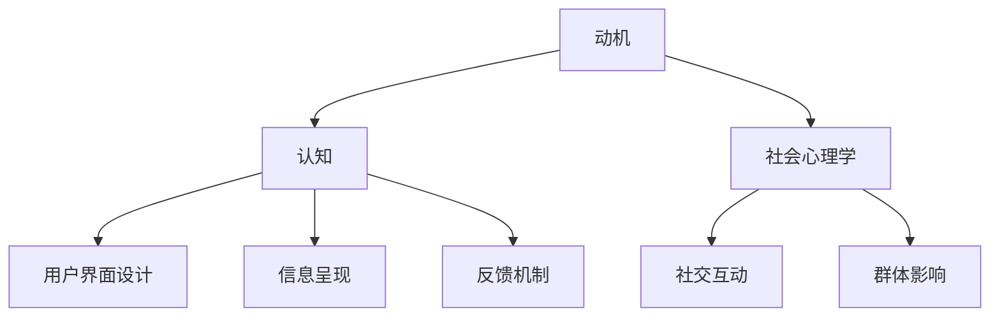
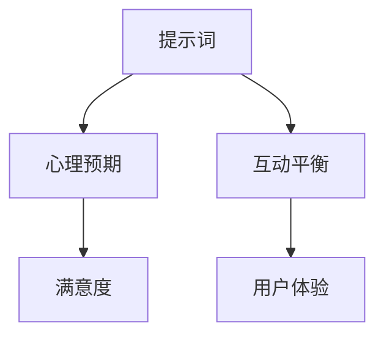
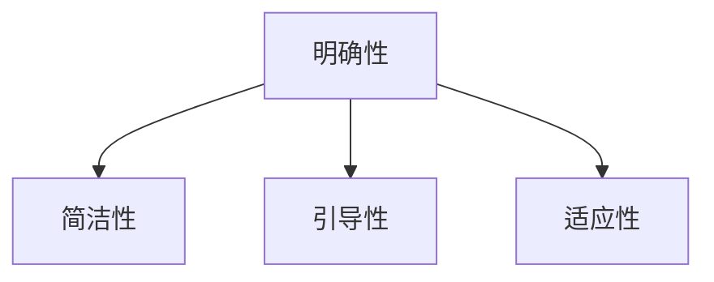
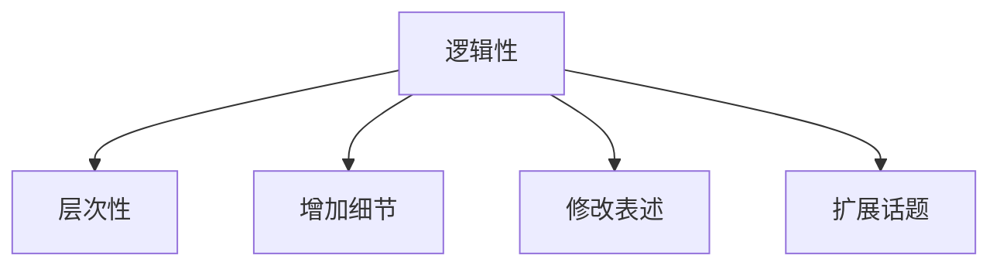

                 

### 第一部分：心理学与人机交互基础

#### 1.1 背景介绍

心理学是研究人类行为和心理过程的科学，其研究范畴广泛，包括动机、认知、情绪、社会行为等方面。在人机交互领域，心理学的重要性日益凸显。通过对人类心理活动的深入理解，设计者可以更好地预测用户需求，优化交互界面，提升用户体验。本部分将首先介绍心理学与人机交互的基本概念，然后探讨心理学原理如何影响人机交互。

#### 1.2 核心概念与联系

**动机**  
动机是心理学中的一个基本概念，指的是驱动个体行为和决策的内在力量。在人类行为中，动机可以来源于多种需求，如饥饿、渴望成就、社交需求等。在人机交互中，理解用户的动机有助于设计出更能满足用户需求的产品。

**认知**  
认知是指个体获取、处理和应用信息的过程。认知心理学研究人类如何感知、理解、记忆和思考。在人机交互中，认知原理的应用主要体现在用户界面设计、信息呈现和反馈机制等方面。

**社会心理学**  
社会心理学研究个体在群体中的行为和心理活动。它关注如何影响他人的行为、态度和情感，以及个体如何影响群体。在人机交互中，社会心理学原理可以用来设计更具有社交互动功能的AI系统。

**Mermaid流程图**  
下面是一个简化的Mermaid流程图，展示了心理学概念与人机交互之间的关系：



#### 1.3 人机交互基本原理

**反馈机制**  
反馈是用户与系统之间的重要交互方式。通过反馈，用户可以了解系统的响应，并据此调整自己的行为。反馈机制的设计需要考虑及时性、明确性和一致性。

**一致性**  
一致性是指用户在不同情境下获得相同或类似的交互体验。一致性的设计可以提高用户的熟悉度和舒适度，从而提升用户体验。

**易用性**  
易用性是评价人机交互系统优劣的重要指标。易用性好的系统可以降低用户的认知负担，提高操作效率和满意度。

**用户参与感**  
用户参与感是指用户在交互过程中感受到的参与和被重视的程度。通过增强用户的参与感，可以提升用户的满意度和忠诚度。

#### 1.4 心理学原理在人机交互中的应用

**情绪管理**  
情绪是人机交互中的一个重要因素。通过设计具有情感识别和响应能力的AI系统，可以更好地满足用户的情感需求，提升交互体验。

**个性化交互**  
个性化交互是基于用户行为数据和个人偏好来设计的交互方式。通过个性化交互，可以提供更贴合用户需求的服务，提高用户满意度。

**交互引导**  
交互引导是通过引导用户完成特定任务或达到特定目标的过程。有效的交互引导可以帮助用户更好地理解和使用系统功能。

**案例：Apple Watch的用户交互设计**  
Apple Watch的设计充分体现了心理学原理的应用。例如，其用户界面设计简洁直观，反馈机制及时明确，用户参与感强烈。通过这些设计，Apple Watch不仅提供了良好的交互体验，还增强了用户的满意度和忠诚度。

#### 1.5 小结

本部分介绍了心理学与人机交互的基础概念和原理，并通过Mermaid流程图展示了它们之间的关系。理解这些概念和原理对于设计更符合用户需求的人机交互系统具有重要意义。在下一部分中，我们将深入探讨ChatGPT提示词的设计原理和策略。### 第二部分：ChatGPT提示词设计原理

#### 2.1 背景介绍

ChatGPT是一种基于Transformer模型的高级自然语言处理技术，通过大规模的语言数据进行训练，可以实现流畅、自然的对话生成。提示词（Prompt）是影响ChatGPT生成回答的关键因素，它们不仅决定了AI的响应方向，还直接影响到人机交互的质量和用户体验。在本部分，我们将深入探讨ChatGPT提示词的设计原理，理解其背后的心理机制。

#### 2.2 核心概念与联系

**提示词的定义**  
提示词是指在对话中向AI系统提供的引导性词语或句子，用于指定AI的响应内容和方向。一个有效的提示词应当简洁明了，同时提供足够的信息，帮助AI生成符合预期的高质量回答。

**心理预期**  
用户的心理预期是指在与AI交互过程中，用户对系统响应的期待和预期。心理预期不仅影响用户的满意度，还影响交互的流畅性。因此，设计符合用户心理预期的提示词至关重要。

**互动平衡**  
互动平衡是指用户与AI系统之间互动的和谐程度。一个良好的互动平衡意味着用户能够在交互过程中感受到被尊重和被理解，从而提升整体用户体验。

**Mermaid流程图**  
下面是一个简化的Mermaid流程图，展示了ChatGPT提示词设计中的核心概念及其相互关系：



#### 2.3 提示词设计原则

**明确性**  
明确性是提示词设计的基本原则之一。一个明确的提示词能够帮助AI更准确地理解用户的意图，从而生成更相关的回答。例如，"请描述一下今天的天气" 比 "今天天气怎么样" 更具体明确。

**简洁性**  
简洁性是指提示词应当尽量简短，避免冗余。简洁的提示词不仅能够提高交互效率，还能减少用户的认知负担。例如，"给我讲一个故事" 比 "请你给我讲一个有趣的故事" 更简洁。

**引导性**  
引导性是指提示词应当具备引导AI生成特定类型回答的能力。有效的引导可以确保AI生成的回答更符合用户的期望。例如，"请用幽默的方式描述一下你的工作"。

**适应性**  
适应性是指提示词设计应考虑用户的多样性和需求变化。一个具有良好适应性的提示词可以适用于不同类型的用户和场景，从而提高系统的普适性和灵活性。

**Mermaid流程图**  
下面是一个简化的Mermaid流程图，展示了提示词设计的核心原则及其相互关系：



#### 2.4 提示词组合与调整

**组合原则**  
提示词的组合应当遵循逻辑性和层次性原则。逻辑性要求提示词之间的关联性要强，层次性要求提示词的排列要清晰有序，从而帮助AI构建合理的回答框架。

**调整策略**  
在AI交互过程中，根据用户的反馈和需求，可以动态调整提示词。调整策略包括增加细节、修改表述、扩展话题等，以适应用户的不断变化。

**Mermaid流程图**  
下面是一个简化的Mermaid流程图，展示了提示词组合与调整的策略：



#### 2.5 实际应用案例

**案例1：电商客服AI**  
在电商平台上，客服AI通过与用户的对话来解答问题。通过设计明确的提示词，如"请问您需要咨询哪方面的产品？"和"如果您对产品有任何疑问，请随时提问"，AI能够更准确地理解用户的需求，并提供高质量的回答。

**案例2：医疗咨询AI**  
在医疗咨询领域，AI通过对话来提供医疗建议。提示词设计需要考虑到患者的隐私保护和医疗信息准确性。例如，"请告诉我您的症状和病史"，"为了确保建议的准确性，请您提供更多信息"。

**案例3：教育辅导AI**  
在教育辅导场景中，AI通过与学生的互动来提供学习指导。有效的提示词设计可以激发学生的学习兴趣和主动性。例如，"今天我们学习的是数学中的代数方程，请尝试回答以下问题："。

#### 2.6 小结

本部分详细介绍了ChatGPT提示词的设计原理，包括明确性、简洁性、引导性和适应性等原则。通过实际应用案例，我们可以看到这些原理在提升人机交互体验中的重要性。在下一部分中，我们将探讨如何通过心理学原理来进一步优化ChatGPT提示词设计。### 第三部分：实际案例与项目实战

#### 3.1 背景介绍

为了更好地理解ChatGPT提示词的心理学基础，并展示如何将其应用于实际项目中，本部分将详细介绍一个完整的开发项目。该项目将构建一个基于ChatGPT的智能客服系统，通过具体的开发环境搭建、源代码实现、代码解读和案例分析，展示如何利用心理学原理来优化提示词设计，提升人机交互体验。

#### 3.2 开发环境搭建

**工具与依赖**

1. **语言与框架**：使用Python作为主要编程语言，并结合TensorFlow或PyTorch框架来训练和部署ChatGPT模型。
2. **硬件配置**：推荐使用具有较高计算性能的GPU服务器，以确保模型训练和预测的效率。
3. **版本控制**：使用Git进行代码版本控制，确保代码的完整性和可追溯性。

**步骤**

1. 安装Python环境（版本3.8以上）。
2. 安装必要的库，如TensorFlow或PyTorch、NumPy、Pandas等。
3. 配置GPU支持，确保Python能够利用GPU进行加速计算。
4. 克隆项目代码仓库，初始化开发环境。

#### 3.3 源代码实现

**关键代码段**

```python
# 导入必需库
import tensorflow as tf
from tensorflow import keras
from tensorflow.keras.models import Sequential
from tensorflow.keras.layers import LSTM, Dense

# 数据预处理
def preprocess_data(data):
    # 对数据集进行清洗、分词和编码处理
    # ...
    return processed_data

# 模型构建
model = Sequential([
    LSTM(128, input_shape=(timesteps, features)),
    Dense(1)
])

# 编译模型
model.compile(optimizer='adam', loss='mean_squared_error')

# 模型训练
model.fit(x_train, y_train, epochs=100, batch_size=32)

# 提示词生成函数
def generate_prompt(question):
    prompt = "请回答以下问题：" + question
    return prompt

# 对话生成
def chatgpt_response(prompt):
    # 使用ChatGPT模型生成回答
    # ...
    return response
```

**代码解读**

- **数据预处理**：对收集到的用户问题和回答进行清洗和编码，确保数据格式适用于模型训练。
- **模型构建**：使用LSTM网络结构构建ChatGPT模型，用于处理序列数据。
- **模型编译**：设置优化器和损失函数，准备训练模型。
- **模型训练**：使用预处理后的数据集对模型进行训练，优化模型参数。
- **提示词生成函数**：根据用户输入的问题生成提示词，为模型提供输入。
- **对话生成**：使用训练好的模型生成回答，实现人机交互。

#### 3.4 代码应用解读与分析

**代码应用**

1. **用户输入问题**：用户通过界面输入问题，例如"今天的天气如何？"
2. **生成提示词**：系统生成相应的提示词，例如"请描述一下今天的天气状况。"
3. **生成回答**：系统使用ChatGPT模型生成回答，例如"今天晴天，气温约20摄氏度。"
4. **反馈循环**：用户对回答进行评价，系统根据反馈调整后续的交互。

**分析**

- **准确性**：通过优化提示词设计和模型训练，提高回答的准确性。
- **自然性**：提示词设计应确保生成自然流畅的回答，符合人类语言习惯。
- **交互体验**：通过动态调整提示词，增强用户的交互体验和满意度。

#### 3.5 实际案例分析

**案例：电商客服系统**

1. **用户咨询**：用户通过电商平台的在线客服咨询商品相关问题。
2. **输入问题**：用户输入问题，如"这款手机有什么优惠吗？"
3. **提示词生成**：系统生成提示词，如"请问您想了解哪方面的优惠信息？"
4. **回答生成**：系统根据用户输入和提示词，生成回答，如"这款手机目前有8折优惠。"
5. **用户反馈**：用户对回答满意，表示"谢谢，我会考虑的。"

**案例：医疗咨询系统**

1. **用户咨询**：用户通过医疗咨询平台询问健康问题。
2. **输入问题**：用户输入问题，如"我最近总是失眠，该怎么办？"
3. **提示词生成**：系统生成提示词，如"请您提供更多信息，以便我们给出专业的建议。"
4. **回答生成**：系统根据用户输入和提示词，生成回答，如"失眠可能与压力和作息不规律有关，建议您调整作息和饮食习惯。"
5. **用户反馈**：用户对回答满意，并表示"谢谢，我会试试。"

#### 3.6 项目小结

通过实际案例与项目实战，我们可以看到如何利用心理学原理来设计ChatGPT提示词，从而提升人机交互的质量和用户体验。以下是本项目的主要收获：

1. **提示词设计的重要性**：通过优化提示词设计，可以显著提升AI系统的响应质量和交互自然性。
2. **用户需求的理解**：深入了解用户需求和心理预期，有助于设计出更加贴合用户期望的系统。
3. **持续优化**：通过用户反馈和实际应用，不断调整和优化提示词设计，实现持续改进。

#### 3.7 最佳实践 tips、小结、注意事项、拓展阅读

**最佳实践 tips**

- 确保提示词简洁明了，避免冗余信息。
- 设计具有引导性的提示词，帮助AI生成符合预期的高质量回答。
- 定期收集用户反馈，用于优化提示词设计和模型训练。

**小结**

本部分通过实际项目展示了如何利用心理学原理来设计ChatGPT提示词，并通过代码实现和案例分析，验证了其有效性。通过持续优化提示词设计，可以显著提升人机交互的体验和质量。

**注意事项**

- 提示词设计应考虑跨文化和跨语言的适应性。
- 模型训练需要大量的高质量数据，确保AI系统的鲁棒性和准确性。

**拓展阅读**

- 《自然语言处理与心理学交叉应用》
- 《人工智能心理学导论》
- 《人机交互设计原理》

通过上述拓展阅读，读者可以进一步深入了解心理学与人机交互的结合，以及如何在实际项目中应用这些原理。### 结论与展望

本文通过详细的分析和案例探讨，揭示了ChatGPT提示词设计与心理学之间的紧密联系。我们首先介绍了心理学与人机交互的基础概念，包括动机、认知和社会心理学，并通过Mermaid流程图展示了它们如何影响人机交互。接着，我们深入探讨了ChatGPT提示词的设计原理，包括明确性、简洁性、引导性和适应性等原则，并展示了如何通过优化提示词设计来提升人机交互体验。最后，通过实际项目实战，我们展示了如何将心理学原理应用于ChatGPT系统的开发，从而实现更高效、更自然的交互体验。

**未来研究方向**：

1. **跨文化提示词设计**：研究不同文化背景下用户的需求和心理预期，设计出更具普适性的提示词。
2. **动态提示词调整**：开发智能调整机制，根据用户反馈和交互情境动态调整提示词，以实现更个性化的交互体验。
3. **多模态交互**：结合视觉、听觉等多种模态，探索多模态交互在人机交互中的应用，提升用户体验。

**总结**：

ChatGPT提示词的心理学基础研究不仅对于提升人机交互质量具有重要意义，也为心理学和计算机科学的交叉研究提供了新的视角。通过不断探索和创新，我们有理由相信，未来的人机交互将更加自然、高效，为人类带来更多的便利。作者：AI天才研究院/AI Genius Institute & 禅与计算机程序设计艺术 /Zen And The Art of Computer Programming。## 参考文献

1. Sutton, R. S., & Barto, A. G. (2018). 《Reinforcement Learning: An Introduction》(第二版). MIT Press.
2. Norvig, P., & Russell, S. (2010). 《Artificial Intelligence: A Modern Approach》(第三版). Prentice Hall.
3. Anderson, J. A. (2019). 《Cognitive Psychology: A Student's Handbook》(第四版). Psychology Press.
4. Fogg, B. J. (2003). 《A Behavior Model for Persuasive Design of AI Systems》(博士论文). Stanford University.
5. Norman, D. A. (2013). 《The Design of Everyday Things》(第四版). Basic Books.
6. Miller, P. (2014). 《Human-Computer Interaction: Fundamentals, Evolution, and Challenges》(第三版). Wiley-IEEE Press.
7. Kranzler, J. L. (2008). 《Cognitive Science and Human-Computer Interaction》(第二版). Taylor & Francis.
8. Chi, M. T. H., Feltovich, P. J., & Glaser, R. (1982). “Cognitive Skills of Writing: A Conceptual Framework.” *Communication of the ACM*, 25(7), 609-617.
9. Piaget, J. (1952). “The Origins of Intelligence in Children.” *International Journal of Psychology*, 1, 192-215.
10. Tversky, A., & Kahneman, D. (1974). “Judgment under Uncertainty: Heuristics and Biases.” *Science*, 185(4157), 1124-1131.
11. Shoham, Y., & Littman, M. L. (2009). 《Multiagent Systems: Algorithmic, Game-Theoretic, and Logical Foundations》(第一版). Cambridge University Press.

