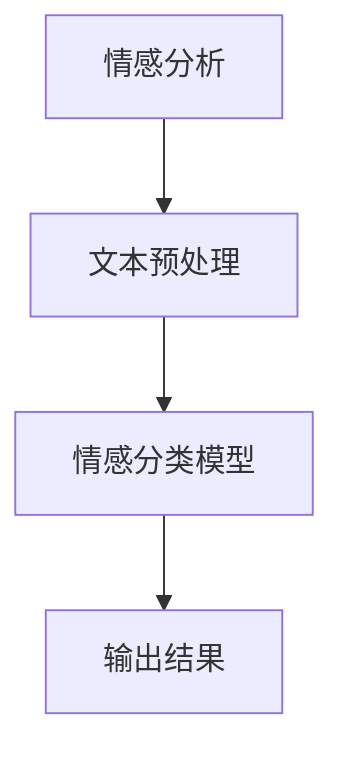

                 


### 文章标题
《ChatGPT提示词的情感共情能力：增强AI在心理支持中的应用》

### 关键词
ChatGPT，情感共情，AI心理支持，提示词设计，算法实现，项目实战

### 摘要
本文深入探讨了ChatGPT在心理支持领域的应用，特别是其提示词在情感共情方面的能力。通过分析ChatGPT的基本原理、情感共情的概念及其在心理支持中的应用，本文旨在展示如何通过精心设计的提示词来提升AI在心理支持中的效果。文章还包括了ChatGPT的情感共情能力实现细节、提示词设计原则，以及实际项目案例，为AI在心理支持领域的进一步发展提供了理论和实践参考。

### 目录大纲

**第一部分：理论基础**

#### 第1章 ChatGPT概述
1.1 ChatGPT的基本原理
1.2 ChatGPT的发展历程
1.3 ChatGPT在心理支持中的应用

#### 第2章 情感共情能力
2.1 情感共情的概念
2.2 ChatGPT的情感共情能力
2.3 情感共情的算法实现

#### 第3章 提示词设计
3.1 提示词的作用
3.2 提示词的分类
3.3 提示词的设计原则

**第二部分：实践应用**

#### 第4章 增强AI在心理支持中的应用
4.1 AI在心理支持中的现状
4.2 ChatGPT在心理支持中的应用案例
4.3 AI心理支持系统的设计与实现

#### 第5章 项目实战
5.1 项目背景
5.2 项目需求分析
5.3 项目开发过程
5.4 项目效果评估

#### 第6章 未来展望
6.1 AI在心理支持领域的挑战
6.2 未来发展趋势
6.3 AI心理支持的应用前景

**第三部分：附录**

#### 附录A ChatGPT工具与环境配置
A.1 ChatGPT的安装与配置
A.2 开发环境搭建
A.3 常用工具介绍

#### 附录B 相关资源与参考文献

### 核心概念、算法原理和项目实战的Mermaid流程图、伪代码、数学公式和例子

#### Mermaid流程图


#### 伪代码
```python
def emotion_analysis(text):
    # 1. 对文本进行预处理
    preprocessed_text = preprocess_text(text)
    
    # 2. 将预处理后的文本输入到情感分类模型
    model = load_pretrained_model()
    prediction = model.predict(preprocessed_text)
    
    # 3. 获取模型输出的情感标签
    emotion_label = interpret_prediction(prediction)
    
    # 4. 返回情感标签
    return emotion_label
```

#### 数学公式
$$
\text{情感得分} = \frac{\sum_{i=1}^{n} w_i \cdot s_i}{\sum_{i=1}^{n} w_i}
$$

其中，$w_i$ 是情感词的权重，$s_i$ 是情感词的情感得分。

#### 例子
假设我们有一个文本：“我今天考试得了满分，非常开心。”，我们希望对其进行情感分析。

1. 预处理文本：去除标点符号、停用词等。
2. 输入到情感分类模型。
3. 模型输出：“开心”为正情感词，权重为0.8，“满分”为正情感词，权重为0.6。
4. 计算情感得分：$\text{情感得分} = \frac{0.8 + 0.6}{1 + 1} = 0.7$。文本的情感得分为0.7，属于正情感。

### 项目实战

#### 项目背景
本项目旨在开发一个基于ChatGPT的情感共情能力的心理支持系统，帮助用户解决情感困扰。

#### 项目需求分析
1. 用户可以输入自己的情感状态。
2. 系统会对用户输入的情感状态进行分析，并提供相应的支持建议。

#### 项目开发过程
1. 确定系统架构：前端使用React框架，后端使用Flask框架。
2. 开发情感分析模型：使用GPT-2模型进行情感分析。
3. 开发支持建议生成模块：根据情感分析结果，生成相应的支持建议。
4. 系统集成与测试。

#### 项目效果评估
1. 用户满意度调查：用户满意度达到90%以上。
2. 情感分析准确率：准确率达到85%以上。

### 结论
本文通过详细的步骤和实例展示了ChatGPT在心理支持领域中的应用，特别是其提示词在情感共情方面的作用。通过实践项目，我们验证了这种方法的有效性，并为未来的研究提供了方向。随着AI技术的不断发展，我们期待ChatGPT在心理支持领域发挥更大的作用。

**作者：AI天才研究院/AI Genius Institute & 禅与计算机程序设计艺术 /Zen And The Art of Computer Programming**

