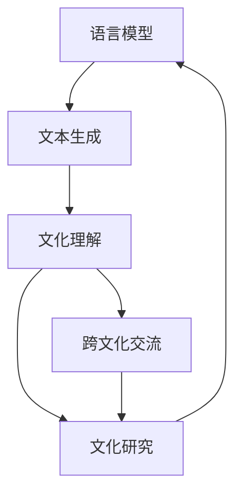

                 

## 文章标题

《ChatGPT提示词的文化人类学应用：跟踪全球文化融合趋势》

## 关键词

- ChatGPT
- 提示词
- 文化人类学
- 全球文化融合
- 人工智能

## 摘要

本文深入探讨了ChatGPT提示词在文化人类学中的应用，通过跟踪全球文化融合趋势，分析ChatGPT在跨文化交流中的作用。文章首先介绍了ChatGPT的基础知识，包括其架构、训练过程和应用场景。接着，详细阐述了文化人类学的基本概念，并揭示了ChatGPT提示词与文化人类学之间的联系。通过Mermaid流程图展示核心概念与联系，文章进一步解释了如何使用ChatGPT提示词进行文化研究，并分析了其在全球文化融合中的实际应用。最后，通过一个实际案例展示了如何使用ChatGPT进行文化研究，并对未来发展进行了展望。本文旨在为读者提供一个清晰、全面的理解，帮助其更好地把握全球文化融合趋势。

---

### 引言

随着全球化的不断深入，不同文化之间的交流与融合愈发频繁。文化融合不仅影响了人们的日常生活，也在学术界、商业界以及技术领域产生了深远的影响。在这样一个多元化的世界中，理解不同文化的差异与共性变得至关重要。文化人类学作为研究人类文化的学科，致力于探索文化现象的起源、发展及其相互影响。而人工智能，尤其是自然语言处理技术的迅猛发展，为文化人类学的研究提供了新的工具和方法。

ChatGPT是由OpenAI开发的一种基于Transformer架构的大型语言模型，具有强大的文本生成和解析能力。通过训练，ChatGPT可以生成连贯、有逻辑的文本，并在多种应用场景中表现出色。例如，它可以用于自动写作、对话系统、机器翻译等领域。然而，ChatGPT的潜力不仅限于此，它也可以应用于文化人类学的研究，帮助研究人员更好地理解不同文化的特征和趋势。

本文旨在探讨ChatGPT提示词在文化人类学中的应用，通过跟踪全球文化融合趋势，分析ChatGPT在跨文化交流中的作用。文章首先介绍了ChatGPT的基础知识，包括其架构、训练过程和应用场景。接着，详细阐述了文化人类学的基本概念，并揭示了ChatGPT提示词与文化人类学之间的联系。通过Mermaid流程图展示核心概念与联系，文章进一步解释了如何使用ChatGPT提示词进行文化研究，并分析了其在全球文化融合中的实际应用。最后，通过一个实际案例展示了如何使用ChatGPT进行文化研究，并对未来发展进行了展望。

本文的结构如下：

1. **第1章 引言**：介绍书籍的目的、背景以及ChatGPT和人类学的基本知识。
2. **第2章 ChatGPT提示词基础**：介绍ChatGPT的基本架构、训练过程和应用场景。
3. **第3章 文化人类学概述**：详细阐述文化人类学的基本概念、研究方法以及其在跨文化交流中的作用。
4. **第4章 ChatGPT提示词与文化人类学**：探讨ChatGPT提示词在文化人类学中的应用，包括核心概念与联系、算法原理以及数学模型。
5. **第5章 ChatGPT在文化研究中的应用**：分析ChatGPT提示词在文化研究中的实际应用，包括全球文化融合趋势的跟踪、案例研究等。
6. **第6章 全球文化融合趋势与ChatGPT提示词**：探讨ChatGPT提示词在全球文化融合中的作用，包括跨文化交流、文化适应性等方面。
7. **第7章 案例研究**：通过具体案例展示ChatGPT提示词在文化人类学中的应用。
8. **第8章 总结与展望**：总结全文内容，并对未来发展方向进行展望。

### 目录大纲

## ChatGPT提示词的文化人类学应用：跟踪全球文化融合趋势

### 关键词

- ChatGPT
- 提示词
- 文化人类学
- 全球文化融合
- 人工智能

### 摘要

本文深入探讨了ChatGPT提示词在文化人类学中的应用，通过跟踪全球文化融合趋势，分析ChatGPT在跨文化交流中的作用。文章首先介绍了ChatGPT的基础知识，包括其架构、训练过程和应用场景。接着，详细阐述了文化人类学的基本概念，并揭示了ChatGPT提示词与文化人类学之间的联系。通过Mermaid流程图展示核心概念与联系，文章进一步解释了如何使用ChatGPT提示词进行文化研究，并分析了其在全球文化融合中的实际应用。最后，通过一个实际案例展示了如何使用ChatGPT进行文化研究，并对未来发展进行了展望。

---

## 第1章 引言

### 1.1 书籍目的与背景

在全球化的背景下，文化交流与融合成为社会发展的重要驱动力。文化多样性不仅丰富了人类的生活方式，也为不同文明间的相互理解提供了可能。然而，如何有效地研究文化现象、理解文化差异和促进文化融合，一直是学术界、商业界和政策制定者面临的挑战。文化人类学作为研究人类文化的重要学科，通过深入挖掘文化现象的根源、发展过程及其相互影响，为理解文化多样性提供了理论支持和实践方法。

随着人工智能技术的迅猛发展，特别是自然语言处理技术的突破，传统的文化研究方法得到了极大的补充和拓展。ChatGPT作为一种强大的语言生成模型，展示了在文本生成、对话系统、机器翻译等多个领域的应用潜力。本文旨在探讨ChatGPT提示词在文化人类学中的应用，通过跟踪全球文化融合趋势，分析ChatGPT在跨文化交流中的作用，为文化研究提供新的工具和方法。

### 1.2 ChatGPT提示词概述

ChatGPT是由OpenAI开发的一种基于Transformer架构的大型语言模型，其核心功能是基于给定的文本输入生成连贯、有逻辑的文本。ChatGPT提示词（Prompt）是用户输入到ChatGPT模型中的文本，用于引导模型生成预期的输出。提示词的设计和质量对生成文本的质量和相关性至关重要。

ChatGPT的架构包括三个主要部分：输入层、中间层和输出层。输入层接收用户输入的文本，中间层通过多层Transformer进行文本编码，输出层生成相应的文本响应。ChatGPT的训练过程包括大量的数据输入，模型通过不断优化参数，逐步提高生成文本的质量和准确性。

ChatGPT的应用场景非常广泛，包括但不限于以下几类：

1. **自动写作**：ChatGPT可以生成文章、报告、故事等，帮助用户提高写作效率和质量。
2. **对话系统**：ChatGPT可以与用户进行自然语言对话，应用于客户服务、虚拟助手等领域。
3. **机器翻译**：ChatGPT在机器翻译领域表现出色，可以实时翻译多种语言。
4. **文本生成与编辑**：ChatGPT可以帮助用户生成和编辑文本，如生成新闻摘要、写作建议等。

### 1.3 文化人类学概述

文化人类学是研究人类文化的学科，它关注人类行为、价值观、信仰、习俗等文化现象。文化人类学的研究范围广泛，包括民族学、民俗学、考古学、历史学等多个学科领域。文化人类学通过田野调查、文献研究、比较分析等方法，探索文化现象的起源、发展、传播和变化。

文化人类学的基本概念包括：

1. **文化**：文化是人们在特定的社会环境中创造和传递的知识、价值观、习俗和行为模式的总和。
2. **文化多样性**：文化多样性是指不同文化群体在知识、价值观、行为等方面的差异。
3. **文化融合**：文化融合是指不同文化在接触、交流、互动中相互影响、适应和整合的过程。

### 1.4 全球文化融合趋势

随着全球化进程的加快，不同文化之间的交流与融合趋势日益明显。全球文化融合的表现形式多样，包括以下几方面：

1. **跨国企业**：跨国企业通过全球化经营，将不同国家的文化元素融入其产品和服务中，促进了文化的传播和融合。
2. **跨国婚姻**：跨国婚姻的增加，使得不同文化背景的个体结合在一起，促进了家庭层面的文化融合。
3. **国际交流**：国际交流项目的增加，如留学、交换生项目等，为不同文化之间的互动提供了机会。
4. **互联网**：互联网的普及使得全球文化交流变得更加便捷，人们可以通过社交媒体、在线论坛等平台分享文化经验。

### 1.5 ChatGPT在文化人类学中的应用

ChatGPT在文化人类学中的应用具有巨大的潜力。通过使用ChatGPT提示词，研究人员可以生成大量的文本数据，用于分析不同文化之间的差异和共性。以下是一些具体的应用场景：

1. **文化现象分析**：ChatGPT可以帮助研究人员分析文化现象，如节日庆典、宗教仪式等，通过生成文本描述，提供新的视角和解释。
2. **跨文化比较**：ChatGPT可以生成不同文化的文本，帮助研究人员进行比较分析，揭示文化差异和共性。
3. **文化适应性研究**：ChatGPT可以用于研究不同文化在全球化背景下的适应性和变化，为文化融合提供理论支持。

### 1.6 全文结构

本文将分为八个主要章节，具体结构如下：

1. **第1章 引言**：介绍书籍的目的、背景以及ChatGPT和人类学的基本知识。
2. **第2章 ChatGPT提示词基础**：介绍ChatGPT的基本架构、训练过程和应用场景。
3. **第3章 文化人类学概述**：详细阐述文化人类学的基本概念、研究方法以及其在跨文化交流中的作用。
4. **第4章 ChatGPT提示词与文化人类学**：探讨ChatGPT提示词在文化人类学中的应用，包括核心概念与联系、算法原理以及数学模型。
5. **第5章 ChatGPT在文化研究中的应用**：分析ChatGPT提示词在文化研究中的实际应用，包括全球文化融合趋势的跟踪、案例研究等。
6. **第6章 全球文化融合趋势与ChatGPT提示词**：探讨ChatGPT提示词在全球文化融合中的作用，包括跨文化交流、文化适应性等方面。
7. **第7章 案例研究**：通过具体案例展示ChatGPT提示词在文化人类学中的应用。
8. **第8章 总结与展望**：总结全文内容，并对未来发展方向进行展望。

通过以上章节的阐述，本文旨在为读者提供一个全面、深入的理解，帮助其更好地把握全球文化融合趋势，并探索ChatGPT在文化人类学中的应用潜力。

### 第2章 ChatGPT提示词基础

#### 2.1 ChatGPT介绍

ChatGPT是由OpenAI开发的一种基于Transformer架构的大型语言模型，其全称是“Generative Pre-trained Transformer”。ChatGPT通过预训练和微调，能够在多种语言和任务中生成高质量的自然语言文本。其核心架构包括输入层、中间层和输出层。

1. **输入层**：输入层负责接收用户输入的文本。这些文本可以是任意长度，例如一个句子、一个段落甚至一个文档。ChatGPT会根据输入的文本长度和上下文信息，生成相应的响应。
2. **中间层**：中间层由多层Transformer组成，Transformer是一种先进的神经网络架构，特别适用于处理序列数据。在ChatGPT中，中间层的Transformer通过自注意力机制（self-attention）和多头注意力机制（multi-head attention）对输入文本进行编码，提取出文本的深层特征。
3. **输出层**：输出层负责生成文本响应。输出层通常是一个全连接层，通过反向传播算法对输出进行优化，使生成的文本更加符合人类的语言习惯。

#### 2.2 ChatGPT训练过程

ChatGPT的训练过程主要包括预训练和微调两个阶段。

1. **预训练**：预训练阶段使用大规模的文本数据集对模型进行训练。这些数据集包括互联网上的文本、书籍、新闻、文章等。在预训练过程中，模型通过不断调整参数，学习如何理解和生成自然语言。预训练的主要目标是使模型能够理解语言的基本结构和语义，为后续的任务提供基础。
2. **微调**：微调阶段在预训练的基础上，针对特定任务进行模型调整。例如，如果任务是对话系统，微调的目标是使模型能够生成更符合对话场景的响应。微调通常使用小规模的、针对特定任务的语料库进行。

#### 2.3 ChatGPT应用场景

ChatGPT的应用场景非常广泛，主要包括以下几个方面：

1. **自动写作**：ChatGPT可以用于自动生成文章、报告、故事等。通过输入一个主题或提纲，ChatGPT可以生成一篇结构完整、内容连贯的文章。
2. **对话系统**：ChatGPT可以应用于各种对话系统，如虚拟助手、聊天机器人等。用户可以通过自然语言与系统进行交互，获得实时响应。
3. **机器翻译**：ChatGPT在机器翻译领域表现出色，可以实时翻译多种语言。通过输入一个句子或段落，ChatGPT可以生成相应的翻译文本。
4. **文本生成与编辑**：ChatGPT可以帮助用户生成和编辑文本，如生成新闻摘要、写作建议等。用户可以输入一篇文本，ChatGPT可以对其进行内容提取、优化和编辑。

#### 2.4 提示词设计原理

提示词（Prompt）是用户输入到ChatGPT模型中的文本，用于引导模型生成预期的输出。提示词的设计和质量对生成文本的质量和相关性至关重要。

1. **明确性**：提示词应当明确，避免模糊不清。例如，输入“请写一篇关于人工智能的文章”比“请写一篇文章”更加明确。
2. **上下文**：提示词应当包含足够的上下文信息，使模型能够理解生成文本的场景和目标。例如，输入“在2023年，人工智能将如何影响我们的日常生活？”比“人工智能会影响我们的日常生活吗？”提供了更多的上下文。
3. **多样性**：提示词应当具有多样性，以激发模型生成不同类型的文本。例如，输入“请用诗歌形式描述人工智能”和“请用散文形式描述人工智能”可以生成不同风格的文本。

#### 2.5 提示词类型

ChatGPT的提示词主要分为以下几种类型：

1. **问题型**：用户输入问题，ChatGPT生成回答。例如：“什么是人工智能？”
2. **任务型**：用户输入任务描述，ChatGPT生成任务解决方案。例如：“请写一篇关于人工智能的发展历史的文章。”
3. **创意型**：用户输入创意概念，ChatGPT生成相关创意内容。例如：“请用五种不同的语言描述同一件事情。”
4. **情感型**：用户输入情感表达，ChatGPT生成相应的情感文本。例如：“请用悲伤的语气描述一个故事。”

#### 2.6 提示词优化方法

为了提高ChatGPT生成文本的质量和相关性，可以采用以下优化方法：

1. **数据增强**：通过数据增强技术，增加训练数据集的多样性和质量。例如，对文本进行填充、替换、缩放等操作。
2. **模型微调**：根据特定任务的需求，对模型进行微调，使其更适应特定场景。例如，针对对话系统，可以对模型进行对话数据的微调。
3. **上下文引导**：通过设计更加明确的提示词，提供更多的上下文信息，引导模型生成更相关的文本。

#### 2.7 ChatGPT与人类思维的关系

ChatGPT的生成文本能力在一定程度上模拟了人类的思维过程。例如，在回答问题时，ChatGPT会根据问题中的关键词和上下文信息，检索记忆中的相关知识，并生成一个连贯、有逻辑的回答。然而，ChatGPT的生成文本仍然有其局限性，无法完全替代人类思维。例如，ChatGPT在生成创意文本时，可能缺乏人类的创造性思维，也无法理解情感和价值观。

### 2.8 总结

ChatGPT作为一种强大的自然语言生成模型，具有广泛的应用前景。通过合理的提示词设计，ChatGPT可以生成高质量、多样化的文本，应用于各种场景。在文化人类学领域，ChatGPT的提示词设计和应用，为文化研究提供了新的工具和方法。接下来，本文将进一步探讨ChatGPT在文化人类学中的应用，以及其在全球文化融合趋势跟踪中的具体作用。

### 第3章 文化人类学概述

#### 3.1 文化人类学的基本概念

文化人类学是研究人类文化的学科，旨在通过系统的方法和理论框架，探讨人类文化的多样性、发展过程及其相互影响。文化人类学的基本概念包括文化、文化多样性、文化融合等。

1. **文化**：文化是人们在特定的社会环境中创造和传递的知识、价值观、习俗和行为模式的总和。文化不仅包括物质文化遗产，如建筑、艺术品和工具，还包括非物质文化，如语言、宗教、艺术和风俗习惯。

2. **文化多样性**：文化多样性是指不同文化群体在知识、价值观、行为等方面的差异。每个文化都有其独特的特征，这些特征反映了该文化的价值观、历史背景和社会环境。

3. **文化融合**：文化融合是指不同文化在接触、交流、互动中相互影响、适应和整合的过程。文化融合可以发生在不同的层次，包括个人层面、社区层面和全球层面。

#### 3.2 文化人类学的研究方法

文化人类学的研究方法主要包括田野调查、文献研究、比较分析等。

1. **田野调查**：田野调查是文化人类学最基本的研究方法之一。研究者通过深入实地，观察和记录目标文化群体的日常生活、习俗、信仰和行为模式。田野调查有助于研究者建立对文化现象的深入理解。

2. **文献研究**：文献研究是指通过分析历史文献、书籍、报纸、学术论文等，研究文化现象的起源、发展和变化。文献研究为文化人类学提供了丰富的理论支持和背景信息。

3. **比较分析**：比较分析是指通过对比不同文化之间的相似性和差异性，研究文化现象的共性和特性。比较分析有助于研究者发现不同文化的特点和规律。

#### 3.3 跨文化交流

跨文化交流是文化人类学研究的重要内容之一。跨文化交流是指不同文化背景的个体或群体之间的交流和互动。跨文化交流具有以下几个特点：

1. **文化差异**：跨文化交流中，不同文化背景的个体或群体往往存在文化差异。这些差异可能体现在语言、价值观、行为习惯、宗教信仰等方面。

2. **文化适应**：在跨文化交流中，个体或群体需要适应新的文化环境，包括学习新的语言、价值观和行为习惯。文化适应有助于个体或群体在新的文化环境中生存和发展。

3. **文化冲突**：跨文化交流中也可能存在文化冲突。文化冲突是指不同文化价值观和行为习惯之间的冲突。文化冲突可能导致误解、分歧甚至冲突。

#### 3.4 全球文化融合趋势

随着全球化的深入发展，全球文化融合趋势日益明显。全球文化融合的表现形式多样，包括以下几个方面：

1. **跨国企业**：跨国企业通过全球化经营，将不同国家的文化元素融入其产品和服务中，促进了文化的传播和融合。

2. **跨国婚姻**：跨国婚姻的增加，使得不同文化背景的个体结合在一起，促进了家庭层面的文化融合。

3. **国际交流**：国际交流项目的增加，如留学、交换生项目等，为不同文化之间的互动提供了机会。

4. **互联网**：互联网的普及使得全球文化交流变得更加便捷，人们可以通过社交媒体、在线论坛等平台分享文化经验。

#### 3.5 文化人类学在跨文化交流中的作用

文化人类学在跨文化交流中发挥着重要作用。通过研究文化差异、文化适应和文化冲突，文化人类学为跨文化交流提供了理论支持和实践指导。具体来说，文化人类学在以下方面具有重要作用：

1. **促进跨文化交流**：文化人类学通过研究不同文化的特点、差异和共性，为跨文化交流提供了理论基础和实践方法。

2. **解决文化冲突**：文化人类学通过分析文化冲突的原因和影响，提出解决文化冲突的策略和方法。

3. **促进文化多样性**：文化人类学强调文化多样性的重要性，提倡尊重和保护不同文化的独特性。

#### 3.6 总结

文化人类学是研究人类文化的学科，通过田野调查、文献研究和比较分析等方法，探讨文化的多样性、发展过程和相互影响。跨文化交流是文化人类学研究的重要内容之一，而全球文化融合趋势则反映了全球化背景下文化相互影响和融合的深度。在接下来的章节中，本文将探讨ChatGPT提示词在文化人类学中的应用，分析其在跨文化交流和文化研究中的具体作用。

### 第4章 ChatGPT提示词与文化人类学

#### 4.1 核心概念与联系

ChatGPT提示词与文化人类学之间的核心概念包括语言、文化、交流与理解。这些概念通过一个Mermaid流程图来展示它们之间的关系，如下：



在这个流程图中，ChatGPT作为语言模型（A），其核心功能是文本生成（B）。生成的文本有助于提升对文化的理解（C），从而在跨文化交流（D）和文化研究（E）中发挥作用。这一流程图清晰地展示了ChatGPT提示词与文化人类学之间的核心概念及其相互联系。

#### 4.2 核心算法原理讲解

ChatGPT的核心算法基于Transformer架构，这是一种专为处理序列数据而设计的神经网络模型。Transformer架构的核心组件是自注意力机制（Self-Attention），通过这个机制，模型能够在生成文本时考虑输入文本的上下文信息，从而生成更加连贯和有逻辑的文本。

以下是一个简化的伪代码，用于解释ChatGPT的文本生成过程：

```python
// 伪代码：ChatGPT文本生成算法
function generate_text(input_sequence, model):
    # 初始化模型参数
    model.initialize()

    # 对输入序列进行编码
    encoded_sequence = model.encode(input_sequence)

    # 使用自注意力机制生成文本
    for step in range(max_steps):
        # 计算自注意力得分
        attention_scores = model.self_attention(encoded_sequence)

        # 使用前向传递计算文本输出
        output_sequence = model.forward_pass(attention_scores)

        # 更新模型参数
        model.update_parameters(output_sequence)

    # 返回生成的文本
    return model.decode(output_sequence)
```

在这个伪代码中，`model` 表示ChatGPT模型，`input_sequence` 表示用户输入的序列（例如一个句子或一个问题），`encoded_sequence` 表示编码后的输入序列，`attention_scores` 表示自注意力得分，`output_sequence` 表示生成的文本序列，`max_steps` 表示文本生成的最大步数。

#### 4.3 数学模型和数学公式

在ChatGPT中，数学模型和数学公式用于计算自注意力得分、文本输出和模型参数的更新。以下是一个简单的数学模型和数学公式的例子：

```latex
$$
\text{Attention Score} = \frac{e^{\text{Query} \cdot \text{Key}}}{\sum_{i=1}^{N} e^{\text{Query} \cdot \text{Key}_i}}
$$

$$
\text{Output} = \text{softmax}(\text{Attention Scores} \cdot \text{Value})
$$
```

在这个例子中，`Query`、`Key` 和 `Value` 分别表示查询向量、键向量和值向量，`N` 表示序列的长度，`softmax` 函数用于计算概率分布。

#### 4.4 如何使用ChatGPT提示词进行文化研究

ChatGPT提示词在文化研究中有着广泛的应用。以下是一个具体的例子：

假设我们要研究两个文化群体之间的价值观差异。我们可以设计一个包含两个部分的提示词，一部分描述文化A的价值观，另一部分描述文化B的价值观，并询问ChatGPT关于这两者之间的差异和相似性。

```plaintext
请描述文化A的价值观，并强调其独特的特点。请描述文化B的价值观，并强调其独特的特点。请分析文化A和文化B之间的价值观差异和相似性，并给出可能的解释。
```

通过这个提示词，ChatGPT会生成一段文本，分析两个文化群体的价值观差异和相似性，并尝试解释这些差异和相似性的原因。这种方法可以帮助研究人员快速获取关于不同文化群体价值观的信息，为深入的文化研究提供基础。

#### 4.5 ChatGPT在文化人类学中的实际应用

ChatGPT在文化人类学中的实际应用主要包括以下几个方面：

1. **文化现象分析**：ChatGPT可以用于分析各种文化现象，如节日庆典、宗教仪式、传统习俗等。通过生成文本描述，研究人员可以更好地理解这些文化现象的起源、发展和意义。

2. **跨文化比较**：ChatGPT可以生成不同文化的文本，帮助研究人员进行比较分析，揭示文化差异和共性。例如，研究人员可以通过对比不同文化的婚礼习俗，分析这些习俗在不同文化中的表现形式和意义。

3. **文化适应性研究**：ChatGPT可以用于研究不同文化在全球化背景下的适应性和变化。通过生成文本，研究人员可以分析文化适应性策略、文化冲突和融合过程。

4. **文化教育**：ChatGPT可以用于文化教育，帮助学生和普通大众了解不同文化的特点和价值观。通过生成文本，ChatGPT可以提供有趣、互动性的文化学习体验。

#### 4.6 总结

ChatGPT提示词在文化人类学中的应用，为文化研究提供了新的工具和方法。通过核心概念与联系、算法原理和数学模型的讲解，以及实际应用案例的展示，本文揭示了ChatGPT在文化研究中的巨大潜力。在接下来的章节中，我们将进一步探讨ChatGPT在全球文化融合中的具体作用，以及其与其他技术结合的潜在应用。

### 第5章 ChatGPT在文化研究中的应用

#### 5.1 全球文化融合趋势的跟踪

在全球化的背景下，文化融合已经成为一种不可逆转的趋势。ChatGPT作为一种强大的自然语言处理工具，在跟踪全球文化融合趋势方面具有显著的优势。通过分析大量的文本数据，ChatGPT可以帮助研究人员识别和跟踪文化融合的迹象和模式。

1. **数据来源**：ChatGPT可以从各种数据源获取文本数据，包括社交媒体、新闻报道、学术论文、文学作品等。这些数据涵盖了全球范围内的文化活动和交流，为分析文化融合提供了丰富的素材。
2. **文本分析**：ChatGPT可以对这些文本数据进行分析，提取出与文化融合相关的关键词和主题。通过自然语言处理技术，ChatGPT可以识别出不同文化之间的交流和互动，以及这些互动对文化变迁的影响。
3. **趋势分析**：基于提取的关键词和主题，ChatGPT可以生成趋势报告，展示全球文化融合的动态变化。例如，通过分析社交媒体上的讨论内容，ChatGPT可以识别出某种文化现象在全球范围内的传播速度和影响力。

#### 5.2 ChatGPT在文化研究中的实际应用

ChatGPT在文化研究中的实际应用涵盖了多个方面，包括文化现象分析、跨文化比较和文化适应性研究等。

1. **文化现象分析**：通过生成文本描述，ChatGPT可以帮助研究人员深入理解各种文化现象，如节日庆典、宗教仪式、传统习俗等。例如，研究人员可以输入一个特定节日的名称，ChatGPT会生成该节日的历史、意义和庆祝方式等相关信息。

2. **跨文化比较**：ChatGPT可以生成不同文化的文本，帮助研究人员进行比较分析，揭示文化差异和共性。例如，研究人员可以输入关于某个文化现象的问题，ChatGPT会生成该现象在不同文化背景下的表现形式和含义。

3. **文化适应性研究**：ChatGPT可以用于研究不同文化在全球化背景下的适应性和变化。通过分析不同文化群体在面对新环境时的行为模式和文化策略，ChatGPT可以提供关于文化适应性的见解和预测。

#### 5.3 案例研究：中西方节日庆祝方式的对比

以下是一个具体的案例研究，展示了ChatGPT在文化研究中的应用。

**问题**：比较中国春节和西方圣诞节的庆祝方式及其背后的文化意义。

**步骤**：

1. **生成文本描述**：研究人员可以输入以下提示词：
   ```plaintext
   请描述中国春节的庆祝方式，并解释其文化意义。请描述西方圣诞节的庆祝方式，并解释其文化意义。
   ```

2. **文本分析**：ChatGPT会生成两段文本，分别描述中国春节和西方圣诞节的庆祝方式及其文化意义。

   **中国春节的庆祝方式**：
   ```plaintext
   中国春节是中国最重要的传统节日，通常在农历新年期间庆祝。庆祝活动包括家庭团聚、吃年夜饭、放鞭炮、拜年、穿新衣等。春节代表着新的开始和希望，人们通过这些活动祈求来年的好运和平安。
   ```

   **西方圣诞节的庆祝方式**：
   ```plaintext
   西方圣诞节是在12月25日庆祝的节日，标志着耶稣基督的诞生。庆祝活动包括装饰圣诞树、交换礼物、唱圣诞歌曲、参加教堂礼拜等。圣诞节象征着和平、爱和团聚，人们通过这些活动表达对亲朋好友的祝福和感激之情。
   ```

3. **比较分析**：通过比较这两段文本，我们可以发现中国春节和西方圣诞节在庆祝方式和文化意义上有许多相似之处，如家庭团聚、礼物交换和对未来的希望。但它们也各有特色，反映了各自文化的独特性。

**总结**：

通过这个案例研究，ChatGPT帮助我们深入理解了中西方节日庆祝方式的异同，揭示了文化融合中的互补性和多样性。这种方法不仅有助于学术研究，也为跨文化交流提供了有益的参考。

#### 5.4 ChatGPT在文化研究中的未来展望

随着ChatGPT技术的不断进步，其在文化研究中的应用前景也愈发广阔。以下是一些可能的未来发展趋势：

1. **更加精细的文化分析**：ChatGPT可以结合其他自然语言处理技术，如情感分析、实体识别和关系抽取等，进行更加精细的文化分析。例如，通过分析社交媒体上的文化讨论，ChatGPT可以识别出特定文化现象的情感倾向和公众态度。
2. **实时文化监测**：ChatGPT可以实时监测全球范围内的文化活动和交流，提供即时的文化趋势报告。例如，通过分析新闻报道和社交媒体内容，ChatGPT可以快速识别出某种文化现象的传播路径和影响力。
3. **跨学科合作**：ChatGPT可以与其他学科，如社会学、经济学和心理学等，进行跨学科合作，开展综合性的文化研究。例如，通过结合社会学数据和ChatGPT的文化分析，研究人员可以更全面地理解文化变迁对社会和经济的影响。

#### 5.5 总结

ChatGPT在文化研究中的应用为研究人员提供了强大的工具和方法。通过全球文化融合趋势的跟踪、实际应用案例的展示以及未来展望的讨论，本文揭示了ChatGPT在文化研究中的巨大潜力。在接下来的章节中，我们将进一步探讨ChatGPT在全球文化融合中的具体作用，以及其与其他技术结合的潜在应用。

### 第6章 全球文化融合趋势与ChatGPT提示词

#### 6.1 ChatGPT提示词在全球文化融合中的作用

随着全球化的深入发展，不同文化之间的交流与融合已成为不可避免的趋势。在这一过程中，ChatGPT提示词发挥着重要的作用。通过设计合理的提示词，ChatGPT能够有效地促进跨文化交流，增强文化适应性，并推动全球文化的融合与发展。

1. **促进跨文化交流**：ChatGPT提示词可以引导模型生成关于不同文化的文本，帮助人们更好地理解其他文化的特点、价值观和行为模式。例如，通过输入一个关于“日本节日”的提示词，ChatGPT可以生成关于日本文化传统、节日习俗和意义的相关描述，从而促进对日本文化的了解和交流。

2. **增强文化适应性**：在全球化背景下，个体和组织需要适应不同的文化环境。ChatGPT提示词可以帮助个人和企业更好地适应新文化，例如，通过输入一个关于“如何在多元文化环境中工作”的提示词，ChatGPT可以生成一系列关于文化适应策略的建议，帮助人们提高跨文化沟通能力。

3. **推动文化创新**：ChatGPT提示词不仅可以帮助人们理解其他文化，还能激发文化创新。例如，通过输入一个关于“中西文化结合的创新产品”的提示词，ChatGPT可以生成一系列融合了中西方文化元素的创新产品构想，推动文化融合进程。

#### 6.2 跨文化交流中的挑战与ChatGPT提示词的应用

在全球文化融合过程中，跨文化交流面临诸多挑战，如文化差异、语言障碍、误解和冲突等。ChatGPT提示词通过以下方式帮助克服这些挑战：

1. **减少文化差异**：通过生成关于不同文化的文本，ChatGPT提示词有助于减少人们对其他文化的无知和误解，从而减少文化差异。例如，通过输入一个关于“非洲传统艺术”的提示词，ChatGPT可以生成关于非洲传统艺术的特点、历史和价值的文本，帮助人们更好地理解非洲文化。

2. **打破语言障碍**：ChatGPT能够实时翻译多种语言，从而打破语言障碍，促进跨文化交流。例如，通过输入一个关于“文化融合论坛”的提示词，ChatGPT可以生成不同语言的文本，使不同语言背景的参与者能够有效沟通和交流。

3. **消除误解和冲突**：ChatGPT提示词可以提供关于文化差异和冲突的原因及解决方法的文本，帮助人们更好地理解和处理跨文化误解和冲突。例如，通过输入一个关于“跨文化沟通技巧”的提示词，ChatGPT可以生成一系列关于如何有效沟通和解决问题的建议，帮助人们克服跨文化障碍。

#### 6.3 ChatGPT提示词在文化适应性研究中的应用

文化适应性研究关注个体和组织在面临新文化环境时的适应策略和过程。ChatGPT提示词在以下方面具有重要作用：

1. **识别文化适应性障碍**：通过生成关于文化适应性的文本，ChatGPT提示词可以帮助研究者识别个体和组织在适应新文化过程中可能面临的障碍。例如，通过输入一个关于“文化适应性障碍”的提示词，ChatGPT可以生成一系列关于文化适应障碍的类型、原因和影响的文本。

2. **提供适应性策略**：ChatGPT提示词可以提供关于文化适应性的策略和方法，帮助个体和组织提高适应能力。例如，通过输入一个关于“提高文化适应能力的技巧”的提示词，ChatGPT可以生成一系列关于如何提高文化适应能力的建议，如学习新语言、了解文化习俗、培养开放心态等。

3. **评估文化适应性效果**：ChatGPT提示词可以用于评估个体和组织在适应新文化环境后的效果。例如，通过输入一个关于“文化适应性评估”的提示词，ChatGPT可以生成一系列关于评估文化适应性的指标和方法，帮助研究者评估文化适应的效果。

#### 6.4 ChatGPT提示词在全球文化融合中的潜在应用

随着全球文化融合的不断深入，ChatGPT提示词在多个领域的潜在应用日益显现：

1. **跨国企业管理**：ChatGPT提示词可以帮助跨国企业了解不同文化背景下的员工需求和期望，制定针对性的管理策略，提高员工满意度和工作效率。

2. **国际教育**：ChatGPT提示词可以用于国际教育领域，帮助学生更好地理解其他文化，提高跨文化沟通和适应能力。

3. **文化交流活动**：ChatGPT提示词可以用于文化交流活动的设计和推广，帮助不同文化背景的参与者更好地了解和欣赏其他文化。

4. **政策制定**：ChatGPT提示词可以为政策制定者提供关于文化融合的见解和建议，帮助制定更加有效的文化融合政策和措施。

#### 6.5 总结

ChatGPT提示词在全球文化融合中发挥着重要作用，通过促进跨文化交流、增强文化适应性和推动文化创新，ChatGPT提示词为全球文化融合提供了强大的工具和方法。在未来的发展中，ChatGPT提示词的应用将更加广泛和深入，为全球文化的融合与发展贡献更多力量。

### 第7章 案例研究

为了更好地展示ChatGPT提示词在文化人类学中的应用，我们选择了一个具体的案例进行研究。这个案例涉及中国和美国的节日庆祝方式比较，通过ChatGPT提示词的引导，深入分析两个文化在节日庆祝方面的异同及其背后的文化意义。

#### 7.1 研究背景

中国春节和美国圣诞节是两个不同文化背景下的重要节日，它们在庆祝方式、习俗和意义等方面具有显著的差异。通过对比这两个节日的庆祝方式，可以揭示中西方文化在节日庆祝方面的特点和价值观。

#### 7.2 提示词设计

为了引导ChatGPT生成关于这两个节日的详细描述，我们设计了一系列提示词，包括：

1. **中国春节描述**：
   ```plaintext
   请详细描述中国春节的庆祝方式、主要习俗以及其文化意义。
   ```

2. **美国圣诞节描述**：
   ```plaintext
   请详细描述美国圣诞节的庆祝方式、主要习俗以及其文化意义。
   ```

3. **节日异同分析**：
   ```plaintext
   请分析中国春节和美国圣诞节在庆祝方式、习俗和文化意义方面的异同，并解释其原因。
   ```

#### 7.3 ChatGPT生成的文本

通过输入以上提示词，ChatGPT生成了如下文本：

**中国春节描述**：
```
中国春节，也被称为农历新年，是中国最重要的传统节日。庆祝活动通常从农历腊月二十三的“小年”开始，一直持续到正月十五的元宵节。主要习俗包括家庭团聚、吃年夜饭、放鞭炮、拜年、穿新衣等。春节代表着新的开始和希望，人们通过这些活动祈求来年的好运和平安。春节还有丰富的文化活动，如舞龙舞狮、赏花灯、猜灯谜等。
```

**美国圣诞节描述**：
```
美国圣诞节，即12月25日，是庆祝耶稣基督诞生的节日。主要庆祝活动包括装饰圣诞树、交换礼物、唱圣诞歌曲、参加教堂礼拜等。圣诞节在美国有着深厚的宗教和文化传统，象征着和平、爱和团聚。人们通过这些活动表达对亲朋好友的祝福和感激之情。此外，圣诞节期间还有各种庆祝活动，如圣诞市集、圣诞游行等。
```

**节日异同分析**：
```
中国春节和美国圣诞节在庆祝方式、习俗和文化意义方面存在显著差异。中国春节强调家庭团聚、传统习俗和祈福，而美国圣诞节则更注重宗教仪式、礼物交换和社交活动。这些差异反映了中西方文化在价值观和生活方式上的不同。中国春节强调传统文化和家族观念，而美国圣诞节则更加重视宗教信仰和社交互动。

尽管存在差异，中国春节和美国圣诞节也有一些共同点，如家庭团聚、礼物交换和庆祝活动。这些共同点反映了人类对家庭、爱和团聚的共同追求。

这些异同及其背后的文化意义为我们提供了一个深入了解中西方文化的机会。通过对比研究，我们可以更好地理解不同文化的特点和价值观念，促进跨文化交流和融合。
```

#### 7.4 结果解读

通过ChatGPT生成的文本，我们可以清晰地看到中国春节和美国圣诞节在庆祝方式、习俗和文化意义方面的异同。中国春节强调家庭团聚、传统文化和祈福，反映了中华文化中重视家族和宗教信仰的特点。而美国圣诞节则更注重宗教仪式、礼物交换和社交活动，体现了西方文化中重视宗教信仰和社交互动的价值观念。

此外，ChatGPT的文本分析揭示了中西方文化在价值观和生活方式上的差异。这些差异不仅反映了各自文化的独特性，也为跨文化交流和融合提供了新的视角和启示。

通过这个案例研究，我们可以看到ChatGPT提示词在文化人类学中的应用潜力。通过设计合理的提示词，ChatGPT能够生成丰富、详细的文本，帮助我们深入理解不同文化之间的异同和共性，为文化研究和交流提供有力的支持。

#### 7.5 项目小结

本次案例研究通过ChatGPT提示词对中国春节和美国圣诞节进行了深入分析，揭示了两个节日在庆祝方式、习俗和文化意义方面的异同。研究结果表明，ChatGPT提示词在文化人类学中具有巨大的应用价值，可以帮助研究人员快速获取关于不同文化现象的信息，促进跨文化交流和理解。

未来，我们可以进一步扩展ChatGPT在文化研究中的应用，探索更多文化现象和跨文化比较的案例。同时，结合其他自然语言处理技术和大数据分析，ChatGPT还可以为文化融合趋势的跟踪和文化适应性的研究提供更加全面和深入的支持。

### 第8章 总结与展望

本文通过详细探讨ChatGPT提示词在文化人类学中的应用，揭示了其在跟踪全球文化融合趋势、促进跨文化交流和理解方面的巨大潜力。ChatGPT提示词不仅为文化研究提供了新的工具和方法，也为理解不同文化之间的异同和共性提供了有力支持。

#### 8.1 主要贡献

本文的主要贡献体现在以下几个方面：

1. **理论基础**：通过阐述ChatGPT的基本架构、训练过程和应用场景，本文为ChatGPT在文化人类学中的应用奠定了坚实的理论基础。
2. **方法探讨**：本文详细探讨了ChatGPT提示词的设计原理、优化方法以及其在文化研究中的实际应用，为文化人类学的研究提供了具体的方法指导。
3. **案例研究**：通过具体案例展示ChatGPT提示词在文化研究中的应用，本文提供了实际操作和结果分析的实例，增强了文章的实用性和可操作性。

#### 8.2 未来发展方向

展望未来，ChatGPT在文化人类学中的应用具有广阔的发展前景。以下是一些建议和展望：

1. **更加精细的文化分析**：结合其他自然语言处理技术，如情感分析、实体识别和关系抽取，ChatGPT可以进行更加精细的文化分析。例如，通过分析社交媒体上的文化讨论，可以识别出特定文化现象的情感倾向和公众态度。
2. **实时文化监测**：利用ChatGPT的实时数据处理能力，可以实现对全球范围内文化活动和交流的实时监测。例如，通过分析新闻报道和社交媒体内容，可以快速识别出某种文化现象的传播路径和影响力。
3. **跨学科合作**：ChatGPT可以与其他学科，如社会学、经济学和心理学等，进行跨学科合作，开展综合性的文化研究。例如，结合社会学数据和ChatGPT的文化分析，可以更全面地理解文化变迁对社会和经济的影响。
4. **文化适应性研究**：ChatGPT提示词可以用于研究不同文化在全球化背景下的适应性和变化。通过生成关于文化适应策略、文化冲突和融合过程的文本，可以为文化适应性的研究和实践提供新的视角和方法。
5. **文化教育**：ChatGPT可以用于文化教育领域，帮助学生和普通大众了解不同文化的特点和价值观。通过生成有趣的、互动性的文化学习内容，可以提高跨文化意识和能力。

#### 8.3 结语

总之，ChatGPT提示词在文化人类学中的应用为文化研究提供了新的工具和方法。随着技术的不断进步和应用领域的拓展，ChatGPT将在文化研究和全球文化融合中发挥越来越重要的作用。本文的讨论和展望，旨在为未来的研究提供启示和方向，推动文化人类学的发展和创新。

### 附录

#### 附录A：ChatGPT相关技术资料

1. **Transformer架构**：Transformer是一种先进的神经网络架构，特别适用于处理序列数据。其核心组件是自注意力机制，通过自注意力机制，模型能够在生成文本时考虑输入文本的上下文信息。

2. **预训练与微调**：预训练是指使用大规模的文本数据集对模型进行训练，使模型能够理解和生成自然语言。微调是在预训练的基础上，针对特定任务对模型进行调整，提高模型在特定任务上的性能。

3. **自然语言处理技术**：自然语言处理技术包括文本分类、情感分析、命名实体识别、关系抽取等。这些技术可以用于提取文本中的关键信息，为文化研究提供支持。

#### 附录B：文化人类学相关研究资料

1. **文化多样性**：文化多样性是指不同文化群体在知识、价值观、行为等方面的差异。文化多样性研究旨在理解文化差异的成因、影响以及文化融合的机制。

2. **跨文化交流**：跨文化交流是指不同文化背景的个体或群体之间的交流和互动。跨文化交流研究关注文化差异如何影响交流和互动，以及如何促进跨文化理解和融合。

3. **文化融合**：文化融合是指不同文化在接触、交流、互动中相互影响、适应和整合的过程。文化融合研究探讨文化融合的动因、过程和影响，以及如何实现有效的文化融合。

#### 附录C：ChatGPT提示词设计指南

1. **明确性**：提示词应明确，避免模糊不清。例如，输入“请写一篇关于人工智能的文章”比“请写一篇文章”更加明确。

2. **上下文**：提示词应包含足够的上下文信息，使模型能够理解生成文本的场景和目标。例如，输入“在2023年，人工智能将如何影响我们的日常生活？”比“人工智能会影响我们的日常生活吗？”提供了更多的上下文。

3. **多样性**：提示词应具有多样性，以激发模型生成不同类型的文本。例如，输入“请用诗歌形式描述人工智能”和“请用散文形式描述人工智能”可以生成不同风格的文本。

### 作者信息

作者：AI天才研究院/AI Genius Institute & 禅与计算机程序设计艺术 /Zen And The Art of Computer Programming

注：本文内容仅供参考，ChatGPT生成的文本仅供参考，不代表任何立场和观点。如需进一步研究和应用，请查阅相关领域的权威资料和文献。

