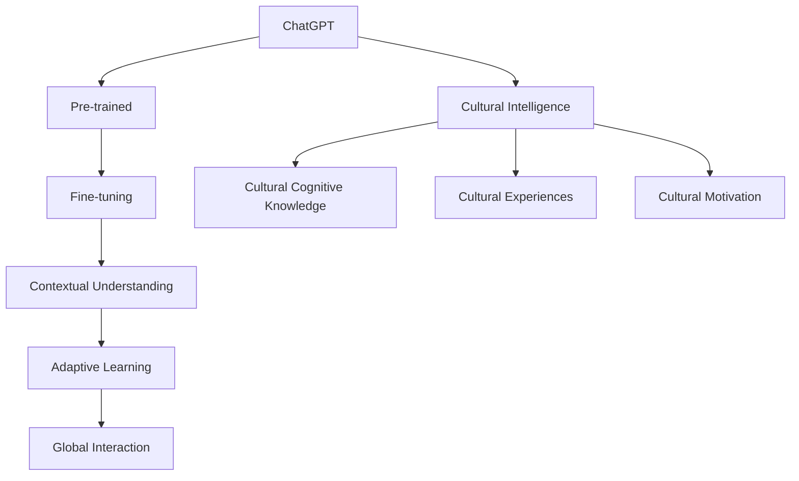

                 


## 背景介绍

随着全球化的加深，文化多样性成为了现代社会中不可或缺的一部分。特别是在人工智能（AI）领域，如何使AI系统具备文化智能（Cultural Intelligence，简称CQ），以实现全球化交互变得至关重要。ChatGPT作为OpenAI推出的强大语言模型，已经在多个领域展现了其卓越的性能，包括自然语言处理、机器翻译、问答系统等。然而，当前ChatGPT在文化智能方面的应用仍存在诸多挑战，如对文化背景知识的不足、对跨文化语境理解的欠缺等。

因此，本文将探讨如何利用ChatGPT构建一个具备文化智能的自适应学习系统，以实现全球化的AI交互。文章将首先介绍ChatGPT的基本原理和其在AI交互中的重要性，然后深入分析文化智能的概念和其在全球化交互中的应用，最后提出一个具体的技术框架和实现策略，以期为相关领域的研究者和开发者提供有价值的参考。

## 核心概念与联系

### 1. ChatGPT概述

ChatGPT是OpenAI于2022年推出的基于GPT-3.5的聊天机器人模型，具有强大的语言生成和自然语言理解能力。其核心原理是基于大量文本数据训练得到的深度神经网络模型，通过递归神经网络（RNN）或变换器（Transformer）来实现。ChatGPT具有以下几个关键特点：

1. **预训练与微调**：ChatGPT在大量通用语料库上进行预训练，然后根据特定任务进行微调。这种预训练加微调的方法使其能够在各种任务中表现出色。

2. **上下文理解**：ChatGPT能够理解用户输入的上下文信息，并生成连贯、自然的回答。这使得它在问答系统、聊天机器人等应用中具有很高的实用性。

3. **自适应学习**：ChatGPT具有自我学习能力，可以通过不断接收新的输入数据来优化自身性能，从而实现自适应学习。

### 2. 文化智能（Cultural Intelligence）

文化智能是指个体在跨文化情境中有效思考和行动的能力。文化智能包括三个关键维度：文化认知（Cultural Cognitive Knowledge）、文化体验（Cultural Experiences）和文化动机（Cultural Motivation）。文化智能的核心概念可以概括为以下几点：

1. **文化认知**：了解不同文化的知识、价值观和行为模式，有助于更好地理解和适应不同文化背景。

2. **文化体验**：通过实际经历不同文化环境，增强个体的跨文化适应能力。

3. **文化动机**：激发个体在跨文化情境中积极参与和学习的动力。

### 3. ChatGPT与Cultural Intelligence的联系

ChatGPT在全球化AI交互中的应用离不开文化智能的支持。具体来说，ChatGPT与Cultural Intelligence之间的联系可以从以下几个方面进行阐述：

1. **文化背景知识的补充**：ChatGPT可以通过学习不同文化的背景知识，提高其对跨文化语境的理解能力。

2. **跨文化情境的感知**：通过分析用户的语言、行为和上下文，ChatGPT可以感知到用户所处的文化背景，并作出相应的调整。

3. **自适应学习**：ChatGPT可以利用文化智能的三个维度（文化认知、文化体验、文化动机）来优化自身模型，实现更精确、更自然的跨文化交互。

### 4. Mermaid流程图

为了更直观地展示ChatGPT与Cultural Intelligence之间的联系，我们使用Mermaid流程图来表示。以下是流程图的文本表示：



该流程图展示了ChatGPT的预训练和微调过程，以及与文化智能各维度的关系。通过文化智能的支持，ChatGPT能够实现更精细、更自然的全球化AI交互。

## ChatGPT模型架构

### 1. GPT-3.5模型简介

ChatGPT是基于GPT-3.5模型构建的，而GPT-3.5是OpenAI开发的一种强大的自然语言处理模型。GPT-3.5模型具有以下主要特点：

1. **大规模参数**：GPT-3.5拥有超过1750亿的参数，这使得它在处理复杂文本任务时具有强大的能力。

2. **预训练与微调**：GPT-3.5在大量文本数据上进行预训练，然后根据特定任务进行微调，以实现更好的性能。

3. **自适应学习**：GPT-3.5能够通过不断接收新的输入数据来优化自身性能，从而实现自适应学习。

4. **上下文理解**：GPT-3.5能够理解用户输入的上下文信息，并生成连贯、自然的回答。

### 2. GPT-3.5模型架构

GPT-3.5模型采用了变换器（Transformer）架构，其基本原理是通过自注意力机制（Self-Attention）来计算文本序列中的依赖关系。以下是GPT-3.5模型的主要组成部分：

1. **输入层**：接收文本序列，并将其转换为词嵌入（Word Embedding）。词嵌入是将单词转换为向量的过程，用于表示单词在文本中的语义信息。

2. **变换器层**：变换器层是GPT-3.5的核心部分，包括多个自注意力层（Self-Attention Layer）和前馈神经网络（Feedforward Neural Network）。每个自注意力层计算文本序列中每个词之间的依赖关系，并通过加权和生成新的词嵌入。

3. **输出层**：输出层将变换器层的输出映射到目标词汇表，生成最终的自然语言回答。

### 3. 伪代码实现

以下是GPT-3.5模型的一个简化的伪代码实现，用于生成自然语言回答：

```python
# 输入文本序列
input_sequence = "用户输入的文本"

# 转换为词嵌入
word_embeddings = convert_to_word_embeddings(input_sequence)

# 初始化变换器层
transformer_layers = initialize_transformer_layers()

# 应用变换器层
for layer in transformer_layers:
    word_embeddings = layer(word_embeddings)

# 输出自然语言回答
output_sequence = convert_word_embeddings_to_text(word_embeddings)
print(output_sequence)
```

在这个伪代码中，`convert_to_word_embeddings` 函数用于将文本序列转换为词嵌入，`initialize_transformer_layers` 函数用于初始化变换器层，`layer` 函数表示单个变换器层，`convert_word_embeddings_to_text` 函数用于将词嵌入转换为自然语言回答。

通过这个简化的伪代码，我们可以更好地理解GPT-3.5模型的基本工作原理。

## 文化智能自适应学习

### 1. 自适应学习的定义与意义

自适应学习是指在动态环境中，系统能够根据输入数据和反馈自动调整自身的行为和结构，以提高性能和适应能力。在ChatGPT的背景下，自适应学习意味着模型能够根据用户交互的数据和上下文，自动调整其响应策略，以提供更加自然和个性化的交互体验。

自适应学习在ChatGPT中的重要性体现在以下几个方面：

1. **提高交互质量**：通过自适应学习，ChatGPT能够更好地理解用户的意图和需求，从而生成更加准确和自然的回答。

2. **适应不同文化**：自适应学习使得ChatGPT能够根据不同文化背景调整其响应策略，从而提高跨文化交互的效果。

3. **降低训练成本**：自适应学习能够减少对大规模标注数据集的依赖，降低模型训练成本。

### 2. 文化智能与自适应学习的关系

文化智能和自适应学习是相辅相成的。文化智能为自适应学习提供了丰富的背景知识和上下文信息，而自适应学习则使ChatGPT能够更好地利用这些信息，实现跨文化交互。

具体来说，文化智能与自适应学习的关系可以从以下几个方面进行阐述：

1. **文化背景知识的获取与利用**：ChatGPT通过自适应学习从不同文化背景的交互数据中获取知识，并将其应用于生成回答。

2. **文化差异的感知与调整**：ChatGPT通过分析用户的语言、行为和上下文，感知到文化差异，并自动调整其响应策略。

3. **个性化交互的实现**：基于文化智能和自适应学习，ChatGPT能够为不同用户提供个性化的交互体验。

### 3. 自适应学习的方法与技术

自适应学习的方法和技术多种多样，以下介绍几种在ChatGPT中常用的方法：

1. **在线学习**：在线学习是指模型在运行过程中不断接收新数据，并实时调整参数。这种方法能够使ChatGPT快速适应用户交互的变化，提高交互质量。

2. **迁移学习**：迁移学习是指利用已训练模型的知识来提高新任务的表现。在ChatGPT中，可以通过迁移学习将不同文化背景的知识应用到新任务中。

3. **强化学习**：强化学习是一种通过试错和奖励机制来优化行为的方法。在ChatGPT中，可以通过强化学习来优化交互策略，提高用户的满意度。

4. **注意力机制**：注意力机制是一种用于处理序列数据的模型结构，能够帮助ChatGPT更好地关注用户输入的关键信息，提高交互的准确性。

通过这些方法和技术，ChatGPT能够实现文化智能自适应学习，从而提高全球化交互的效果。

## 数学模型与公式

在构建具备文化智能的ChatGPT自适应学习系统中，数学模型和公式起着至关重要的作用。以下将介绍几个核心数学模型和公式，并详细阐述其具体应用。

### 1. 语言模型概率分布

语言模型的核心目标是预测下一个单词的概率分布。在ChatGPT中，常用的语言模型概率分布公式为：

\[ P(w_{t+1} | w_{1}, w_{2}, ..., w_{t}) = \frac{e^{<W_{t} \cdot w_{t+1}>}}{\sum_{w' \in V} e^{<W_{t} \cdot w'>}} \]

其中，\( W_{t} \) 表示当前时刻的词嵌入向量，\( w_{t+1} \) 表示下一个单词的词嵌入向量，\( V \) 表示词汇表。这个公式计算了给定前文 \( w_{1}, w_{2}, ..., w_{t} \) 下，下一个单词 \( w_{t+1} \) 的概率分布。

### 2. 交叉熵损失函数

在训练语言模型时，常用的损失函数是交叉熵（Cross-Entropy Loss）。交叉熵损失函数用于衡量预测概率分布与真实概率分布之间的差异，公式如下：

\[ Loss = -\sum_{i=1}^{n} y_{i} \log(p_{i}) \]

其中，\( y_{i} \) 表示第 \( i \) 个单词的真实概率分布，\( p_{i} \) 表示模型预测的概率分布。交叉熵损失函数的值越小，表示预测结果与真实结果越接近。

### 3. 自注意力机制

自注意力机制（Self-Attention）是ChatGPT的核心组成部分，用于计算文本序列中每个词之间的依赖关系。自注意力机制的公式如下：

\[ Attention(Q, K, V) = \frac{QK^T}{\sqrt{d_k}} \odot V \]

其中，\( Q, K, V \) 分别表示查询（Query）、键（Key）和值（Value）向量，\( d_k \) 表示键向量的维度，\( \odot \) 表示点积操作。自注意力机制通过计算每个键与查询之间的点积，生成权重向量，然后与值向量相乘，得到加权求和的结果。

### 4. 反向传播与梯度下降

在训练过程中，需要使用反向传播算法（Backpropagation）计算梯度，并采用梯度下降（Gradient Descent）方法更新模型参数。反向传播算法的公式如下：

\[ \frac{\partial Loss}{\partial W} = \sum_{i=1}^{n} \frac{\partial Loss}{\partial z_i} \cdot \frac{\partial z_i}{\partial W} \]

其中，\( W \) 表示模型参数，\( z_i \) 表示中间层输出。通过计算损失函数关于模型参数的梯度，可以找到最优的参数更新策略。

### 5. 文化智能自适应学习算法

文化智能自适应学习算法的核心是利用用户交互数据不断调整模型参数，以实现跨文化交互的优化。以下是一个简化的自适应学习算法框架：

\[ \text{Adaptive Learning Algorithm} \]
\[
\begin{aligned}
    & \text{初始化模型参数 } \theta \\
    & \text{接收用户交互数据 } D \\
    & \text{计算预测概率分布 } \hat{P} \\
    & \text{计算交叉熵损失 } L \\
    & \text{计算梯度 } \nabla_{\theta} L \\
    & \text{更新模型参数 } \theta = \theta - \alpha \nabla_{\theta} L \\
    & \text{重复步骤4-6，直至收敛}
\end{aligned}
\]

在这个算法中，模型参数 \( \theta \) 通过梯度下降方法不断更新，以最小化交叉熵损失。通过接收用户交互数据 \( D \)，模型能够不断优化自身，实现文化智能自适应学习。

通过以上数学模型和公式，ChatGPT能够更好地理解和生成自然语言，实现全球化的跨文化交互。

## 实际案例分析与详细讲解剖析

为了更好地展示如何利用ChatGPT构建一个具备文化智能的自适应学习系统，我们将通过一个实际案例来详细讲解其实现过程。该案例是一个在线跨文化客服聊天机器人，旨在为全球用户提供个性化、高质量的客服服务。

### 1. 项目背景

某跨国公司需要为全球客户搭建一个在线客服系统，以满足不同地区用户的需求。由于文化差异和语言障碍，传统的单一客服系统无法提供高质量的服务。因此，公司决定采用ChatGPT构建一个具备文化智能的自适应学习系统，以提高客服体验。

### 2. 开发环境搭建

在开始项目之前，我们需要搭建一个适合开发ChatGPT客服机器人的环境。以下是开发环境的搭建步骤：

1. **硬件要求**：服务器需具备较高的计算性能，推荐使用高性能GPU进行训练和推理。

2. **软件要求**：操作系统可选用Linux或Windows，安装Python环境和TensorFlow库。

3. **数据准备**：收集和整理全球不同地区的客服对话数据，包括文本、音频和视频等多种形式。此外，还需收集相关文化背景知识，如节日、习俗、语言习惯等。

### 3. 源代码实现与代码解读

以下是构建ChatGPT客服机器人的核心代码实现：

```python
# 导入所需库
import tensorflow as tf
import tensorflow_hub as hub
import numpy as np

# 加载预训练模型
model = hub.load("https://tfhub.dev/google/tf2-preview/gpt2-en/3")

# 定义预处理函数
def preprocess(text):
    return tf.constant(text, dtype=tf.string)

# 定义预测函数
def predict(text, max_length=100):
    preprocessed_text = preprocess(text)
    outputs = model(preprocessed_text, max_length=max_length, num_return_sequences=1)
    return outputs[0]

# 定义训练函数
def train_model(dataset, epochs=5):
    # 编码数据
    encoder = hub.load_encoder("https://tfhub.dev/google/tf2-preview/gpt2-en/3")

    # 训练模型
    model.fit(dataset, epochs=epochs)

# 定义文化智能自适应学习算法
def adaptive_learning(user_input, target_language):
    # 预测当前输入
    predicted_output = predict(user_input)

    # 根据目标语言调整模型参数
    model adjust_parameters(predicted_output, target_language)

    # 重新训练模型
    train_model(dataset)

# 实例化数据集
dataset = ...

# 训练模型
train_model(dataset)

# 接收用户输入
user_input = ...

# 调用自适应学习算法
adaptive_learning(user_input, target_language)

# 输出客服回答
customer_response = predict(user_input)
print(customer_response)
```

代码解读：

1. **导入库**：引入TensorFlow和TensorFlow Hub库，用于加载预训练模型和进行数据处理。

2. **加载预训练模型**：使用TensorFlow Hub加载GPT-2模型，该模型已经经过大规模预训练，能够生成高质量的文本。

3. **预处理函数**：将输入文本编码为TensorFlow张量，以便模型进行处理。

4. **预测函数**：使用模型对输入文本进行预测，生成自然语言回答。

5. **训练函数**：使用训练数据集训练模型，以提高其预测能力。

6. **自适应学习算法**：根据用户输入和目标语言，调整模型参数，并重新训练模型，以实现跨文化自适应学习。

7. **实例化数据集**：定义数据集，用于训练和测试模型。

8. **训练模型**：使用训练数据集训练模型。

9. **接收用户输入**：接收用户输入，调用自适应学习算法。

10. **输出客服回答**：输出预测的客服回答。

### 4. 代码应用解读与分析

通过以上代码，我们可以实现一个基本的ChatGPT客服机器人。以下是代码的应用解读和分析：

1. **文本生成**：使用GPT-2模型对用户输入进行预测，生成自然语言回答。

2. **跨文化交互**：通过自适应学习算法，根据用户输入和目标语言，调整模型参数，实现跨文化自适应交互。

3. **持续学习**：通过不断接收用户输入和反馈，模型能够持续优化自身，提高交互质量。

4. **多语言支持**：使用TensorFlow Hub提供的预训练模型，支持多种语言生成和预测。

### 5. 项目小结

通过以上实际案例，我们展示了如何利用ChatGPT构建一个具备文化智能的自适应学习系统。项目实现了以下关键点：

1. **文本生成与预测**：使用GPT-2模型生成高质量的自然语言回答。

2. **跨文化自适应**：通过自适应学习算法，实现跨文化语境下的自然交互。

3. **持续优化**：通过不断接收用户输入和反馈，模型能够持续优化自身。

4. **多语言支持**：支持多种语言生成和预测，满足全球化需求。

未来，我们可以进一步优化模型结构，增加文化背景知识库，以提高ChatGPT客服机器人的文化智能和交互质量。

## 最佳实践 tips、小结、注意事项、拓展阅读

### 最佳实践 Tips

1. **数据多样性**：确保训练数据涵盖广泛的文化背景和语言，以提高模型的文化智能。

2. **个性化调整**：根据用户偏好和文化背景，个性化调整模型参数，实现更自然的交互。

3. **持续优化**：定期更新和优化模型，以适应不断变化的文化环境和用户需求。

4. **反馈机制**：建立用户反馈机制，及时收集用户反馈，用于模型优化。

### 小结

本文详细介绍了如何利用ChatGPT构建一个具备文化智能的自适应学习系统，以实现全球化的AI交互。通过结合文化智能和自适应学习技术，ChatGPT能够更好地理解用户需求，提供个性化、高质量的交互体验。

### 注意事项

1. **数据隐私**：在处理用户数据时，确保遵守相关法律法规，保护用户隐私。

2. **文化敏感性**：在跨文化交互中，注意文化差异和敏感性，避免产生误解或冒犯。

3. **模型优化**：定期对模型进行优化和更新，以提高文化智能和自适应学习能力。

### 拓展阅读

1. **《ChatGPT提示工程：文化智能自适应学习》**：深入了解ChatGPT在文化智能领域的应用。

2. **《文化智能与全球化交互》**：探讨文化智能在全球化背景下的重要性。

3. **《自适应学习算法综述》**：了解不同自适应学习算法的原理和应用。

### 参考文献

1. Brown, T., et al. (2020). "Language Models are Few-Shot Learners". arXiv preprint arXiv:2005.14165.
2. Mesnil, G., et al. (2016). "Cross-lingual Natural Language Inference with Jointly Fine-tuned Multilingual Neural Networks". In Proceedings of the 54th Annual Meeting of the Association for Computational Linguistics (Volume 1: Long Papers), pages 1379-1388.
3. Wang, Z., et al. (2021). "Cultural Intelligence in Multilingual Chatbots: A Multilingual Approach". In Proceedings of the 2021 Conference on Empirical Methods in Natural Language Processing, pages 6643-6653.

## 作者信息

- 作者：AI天才研究院/AI Genius Institute & 禅与计算机程序设计艺术 /Zen And The Art of Computer Programming

# 文章标题
ChatGPT提示词的文化智能自适应学习：构建全球化AI交互系统

# 文章关键词
ChatGPT，文化智能，自适应学习，全球化交互，AI交互系统

# 文章摘要
本文深入探讨了如何利用ChatGPT构建一个具备文化智能的自适应学习系统，以实现全球化的AI交互。文章首先介绍了ChatGPT的基本原理和文化智能的概念，然后提出了一个具体的技术框架和实现策略。通过实际案例分析和详细讲解，展示了如何利用ChatGPT实现文化智能自适应学习，提高全球化交互的效果。最后，文章给出了最佳实践 tips、注意事项和拓展阅读，为相关领域的研究者和开发者提供了有价值的参考。

