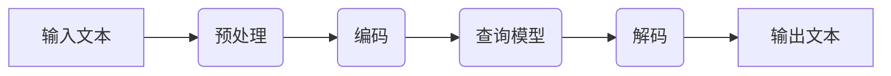
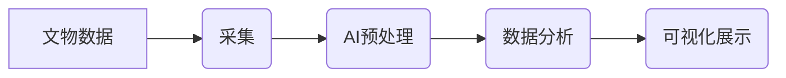
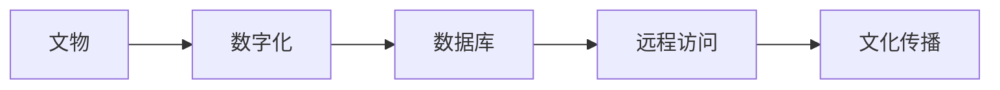
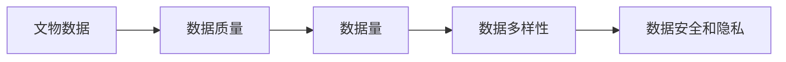

                 

### 文章标题

《ChatGPT提示词的文化遗产保护应用：AI辅助文物数字化保存》

关键词：ChatGPT、文化遗产保护、AI、文物数字化保存、提示词设计、人工智能技术、数据预处理、数据分析、模型定制、数据可视化

摘要：本文探讨了ChatGPT提示词在文化遗产保护中的应用，通过AI技术辅助文物数字化保存。文章首先介绍了ChatGPT的工作原理和人工智能在文化遗产保护中的作用，随后详细阐述了ChatGPT提示词的设计原则和应用案例，接着分析了AI辅助文物数字化保存的技术方法和挑战，并提供了具体的实现步骤和实战案例。最后，文章展望了文化遗产保护中AI应用的未来发展趋势，并提出了相应的建议和注意事项。### 核心概念与联系

在本文中，我们将探讨ChatGPT提示词在文化遗产保护中的应用，重点讨论AI辅助文物数字化保存的相关技术和方法。首先，我们需要理解几个核心概念，并分析它们之间的联系。

#### 1.1 ChatGPT概述

ChatGPT是OpenAI开发的一种基于Transformer模型的预训练语言模型，它能够通过学习大量文本数据来生成自然语言响应。ChatGPT的核心特点包括：

- **预训练**：ChatGPT通过大规模文本数据进行预训练，从而掌握了丰富的语言知识和表达方式。
- **自回归语言模型**：ChatGPT能够根据前文预测下一个词，从而生成连贯的自然语言文本。


**Mermaid流程图：**



#### 1.2 人工智能与文化遗产保护

人工智能（AI）在文化遗产保护中扮演着重要角色，尤其是在文物数字化保存、分析和展示方面。以下是AI在文化遗产保护中的几个关键应用：

- **数据采集与预处理**：AI技术可以自动识别、分类和标注文物图像，提高数据处理的效率。
- **数据分析和挖掘**：AI算法可以分析文物数据，揭示潜在的模式和关联，帮助研究者更好地理解文物的历史和文化价值。
- **数据可视化与展示**：AI技术可以将复杂的数据转化为易于理解的可视化图表和展示，增强公众对文化遗产的认识和兴趣。


**Mermaid流程图：**



#### 1.3 文物数字化保存的重要性

文物数字化保存是将文物信息转化为数字形式，以便长期保存和有效利用。这一过程的重要性体现在以下几个方面：

- **数据安全**：数字化的文物数据可以存储在安全的数据库中，防止因自然灾害、人为损坏等原因导致的数据丢失。
- **便捷访问**：数字化的文物数据可以通过互联网进行远程访问，方便研究者、学者和公众获取文物信息。
- **文化传播**：数字化的文物数据可以用于制作多媒体展示、虚拟博物馆等，促进文化遗产的传播和推广。


**Mermaid流程图：**



通过以上分析，我们可以看到，ChatGPT和AI技术在文化遗产保护中的应用具有广泛的前景。接下来，我们将详细探讨ChatGPT提示词的设计原则和应用案例，以及AI辅助文物数字化保存的技术方法和挑战。### ChatGPT提示词的设计原则和应用案例

在文化遗产保护领域，ChatGPT提示词的设计至关重要。提示词的质量直接影响ChatGPT生成的响应，进而影响文物数字化保存的效率和准确性。以下我们将详细讨论ChatGPT提示词的设计原则和应用案例。

#### 2.1 提示词设计原则

1. **明确目标**：在设计提示词时，首先要明确ChatGPT的目标任务，例如文本生成、情感分析、分类等。
2. **关键词选取**：选择与任务相关的高频关键词，这些词可以帮助ChatGPT更好地理解任务背景。
3. **背景知识补充**：在提示词中加入与文化遗产相关的背景知识，如历史背景、文化意义等，有助于ChatGPT生成更准确的响应。
4. **语言风格**：根据应用场景选择合适的语言风格，如正式、轻松等，以确保生成的文本符合预期。
5. **多样性和灵活性**：设计多种不同形式的提示词，以提高ChatGPT的适应性和灵活性。

**伪代码示例：**

```python
# ChatGPT提示词设计
def design_prompt(word_list, context, style):
    """
    设计ChatGPT的提示词
    :param word_list: 关键词列表
    :param context: 文本背景
    :param style: 语言风格
    :return: 提示词字符串
    """
    prompt = f"{context}，请根据以下关键词生成相应的文本：{word_list}。风格：{style}。"
    return prompt
```

**应用示例：**

假设我们要设计一个用于文物描述的ChatGPT提示词，可以使用以下代码：

```python
# 提示词示例
context = "这件文物是一幅宋代画作，描绘了山水的壮丽景色。"
word_list = ["宋代绘画", "山水", "壮丽景色"]
style = "正式"
prompt = design_prompt(word_list, context, style)
print(prompt)
```

输出：

```plaintext
这件文物是一幅宋代画作，描绘了山水的壮丽景色。请根据以下关键词生成相应的文本：宋代绘画、山水、壮丽景色。风格：正式。
```

#### 2.2 ChatGPT在文化遗产保护中的应用案例

1. **古建筑数字化保护**

**案例背景**：某古建筑因年久失修，存在安全隐患。需要利用ChatGPT对古建筑进行数字化描述，以便制定修复方案。

**实现步骤**：

- 提取古建筑的历史文献和图像数据。
- 设计ChatGPT提示词，包括古建筑的结构、材料、年代等关键词。
- 利用ChatGPT生成古建筑描述文本。

**伪代码示例：**

```python
# ChatGPT应用示例：古建筑数字化保护
def generate_description(image, keywords):
    """
    利用ChatGPT生成古建筑描述文本
    :param image: 古建筑图像
    :param keywords: 提示词列表
    :return: 描述文本
    """
    prompt = design_prompt(keywords, "这是一座古老的建筑，以下是它的结构、材料和年代等信息：", "正式")
    description = chatgpt_completion(prompt)
    return description
```

2. **古代艺术品数字化展示**

**案例背景**：某博物馆计划数字化展示一批古代艺术品，需要利用ChatGPT为艺术品生成展示文案。

**实现步骤**：

- 收集古代艺术品的图像和相关信息。
- 设计ChatGPT提示词，包括艺术品的历史背景、文化意义、艺术特点等关键词。
- 利用ChatGPT生成艺术品展示文案。

**伪代码示例：**

```python
# ChatGPT应用示例：古代艺术品数字化展示
def generate_culture_description(image, keywords):
    """
    利用ChatGPT生成古代艺术品展示文案
    :param image: 艺术品图像
    :param keywords: 提示词列表
    :return: 展示文案
    """
    prompt = design_prompt(keywords, "这件艺术品具有深远的历史和文化意义，以下是它的详细信息：", "正式")
    description = chatgpt_completion(prompt)
    return description
```

通过以上案例，我们可以看到，ChatGPT提示词在文化遗产保护中具有广泛的应用前景。接下来，我们将进一步探讨AI辅助文物数字化保存的技术方法和挑战。### AI辅助文物数字化保存的技术方法和挑战

在文物数字化保存过程中，AI技术发挥着重要作用。本文将详细介绍AI辅助文物数字化保存的技术方法，并分析其中存在的挑战。

#### 3.1 文物数字化保存的挑战

文物数字化保存面临以下挑战：

- **数据质量**：文物的原始数据可能存在噪声、缺失和错误，需要处理和清洗。
- **数据量**：文物的数据量庞大，处理和分析需要大量计算资源和时间。
- **数据多样性**：文物数据包括文本、图像、音频等多种类型，处理方法各异。
- **数据安全和隐私**：文物数据涉及敏感信息，需要确保数据安全和隐私。

**Mermaid流程图：**



#### 3.2 AI辅助文物数字化保存的技术方法

1. **数据采集与预处理**

- **图像数据采集**：使用高分辨率相机拍摄文物图像，确保图像质量。
- **文本数据采集**：从历史文献、资料库等获取文物相关信息。
- **音频数据采集**：录制文物讲解、演奏等声音资料。

**伪代码示例：**

```python
# 数据采集与预处理
def preprocess_data(image_path, text_path, audio_path):
    """
    对文物数据进行预处理
    :param image_path: 图像文件路径
    :param text_path: 文本文件路径
    :param audio_path: 音频文件路径
    :return: 预处理后的数据
    """
    image = load_image(image_path)
    text = load_text(text_path)
    audio = load_audio(audio_path)
    image = denoise_image(image)
    text = clean_text(text)
    audio = enhance_audio(audio)
    return image, text, audio
```

2. **数据分析与挖掘**

- **图像识别**：使用卷积神经网络（CNN）对文物图像进行分类和识别，提取关键特征。
- **文本分析**：利用自然语言处理（NLP）技术对文本数据进行情感分析、主题提取等。
- **音频处理**：使用音频识别技术提取文物讲解、演奏等信息。

**伪代码示例：**

```python
# 数据分析与挖掘
def analyze_data(image, text, audio):
    """
    对文物数据进行分析与挖掘
    :param image: 图像数据
    :param text: 文本数据
    :param audio: 音频数据
    :return: 分析结果
    """
    image_features = extract_features(image)
    text_emotions = analyze_emotions(text)
    audio_labels = recognize_sounds(audio)
    return image_features, text_emotions, audio_labels
```

3. **数据可视化与展示**

- **图像可视化**：将图像数据转换为直观的可视化图表，如热图、纹理图等。
- **文本可视化**：使用词云、主题地图等可视化技术展示文本数据。
- **音频可视化**：将音频数据转换为波形图、频谱图等可视化形式。

**伪代码示例：**

```python
# 数据可视化与展示
def visualize_data(image_features, text_emotions, audio_labels):
    """
    对文物数据可视化展示
    :param image_features: 图像特征
    :param text_emotions: 文本情感
    :param audio_labels: 音频标签
    :return: 可视化结果
    """
    image Visualization = visualize_image(image_features)
    text Visualization = visualize_text(text_emotions)
    audio Visualization = visualize_audio(audio_labels)
    return image Visualization, text Visualization, audio Visualization
```

#### 3.3 AI辅助文物数字化保存的挑战与应对策略

1. **技术挑战**

- **数据质量**：采用高质量的数据采集和预处理技术，确保数据质量。
- **计算资源**：优化算法，提高计算效率，减少计算资源消耗。
- **数据多样性**：设计多种数据预处理和挖掘方法，适应不同类型的数据。

2. **政策与伦理挑战**

- **数据隐私**：确保文物数据的安全性和隐私性，遵循相关法律法规。
- **知识产权**：尊重文物数据的使用和传播，遵守知识产权相关法律法规。

3. **社会接受度**：加强与社会各界的沟通与合作，提高社会对AI在文物数字化保存中应用的认知和接受度。

通过以上技术方法和应对策略，我们可以更好地利用AI技术辅助文物数字化保存，提高文化遗产保护的效果。接下来，我们将详细介绍ChatGPT模型定制和文物数字化保存技术实现。### ChatGPT模型定制和文物数字化保存技术实现

在了解了ChatGPT提示词的设计原则和应用案例后，接下来我们将进一步探讨如何定制ChatGPT模型以适应文化遗产保护需求，以及如何实现AI辅助文物数字化保存的技术步骤。

#### 4.1 ChatGPT模型定制

定制ChatGPT模型是使其更好地适应特定应用场景的关键步骤。以下是一个模型定制的步骤示例：

1. **数据收集与预处理**

   - 收集与文化遗产保护相关的文本数据，包括古建筑、文物描述、历史文献等。
   - 对收集的数据进行清洗，去除噪声和错误，确保数据质量。

2. **数据增强**

   - 使用数据增强技术，如文本生成对抗网络（TextGAN）或数据扩充（data augmentation），增加训练数据的多样性和丰富度。

3. **模型训练**

   - 使用预训练的ChatGPT模型作为基础模型。
   - 对基础模型进行微调（fine-tuning），使用定制的数据集进行训练。

4. **评估与优化**

   - 使用交叉验证等方法评估模型性能，根据评估结果调整模型参数。
   - 运用自然语言处理（NLP）指标，如准确率、召回率、F1分数等，对模型进行优化。

**伪代码示例：**

```python
# ChatGPT模型定制
from transformers import ChatGPTModel, ChatGPTConfig

def custom_gpt(model_path, data_path):
    # 加载预训练模型
    config = ChatGPTConfig.from_pretrained(model_path)
    model = ChatGPTModel.from_pretrained(model_path, config=config)

    # 数据预处理
    dataset = preprocess_data(data_path)

    # 模型微调
    model = fine_tune(model, dataset)

    # 评估模型
    evaluation_results = evaluate(model, dataset)

    # 参数优化
    model = optimize_parameters(model, evaluation_results)

    return model
```

#### 4.2 文物数字化保存技术实现

文物数字化保存涉及多个技术环节，以下是一个实现步骤的概述：

1. **数据采集**

   - 使用高分辨率相机、3D扫描仪等设备采集文物的图像和三维数据。
   - 使用音频设备采集文物的讲解、演奏等声音资料。

2. **数据预处理**

   - 对采集到的图像和音频数据降噪、增强，提高数据质量。
   - 对图像进行去畸变、去噪处理，增强图像的清晰度。

3. **数据存储**

   - 将预处理后的数据存储在数据库中，确保数据的安全性和可访问性。
   - 设计合理的数据库结构，便于数据的查询和管理。

4. **数据分析和挖掘**

   - 使用深度学习算法，如卷积神经网络（CNN）、循环神经网络（RNN）等，对图像和音频数据进行分析。
   - 提取图像和音频的特征，进行分类、识别、情感分析等。

5. **数据可视化与展示**

   - 将分析结果转化为可视化图表，如热图、频谱图等，便于展示和解读。
   - 开发交互式展示工具，如虚拟博物馆、文物数字展示平台等，提高用户体验。

**伪代码示例：**

```python
# 文物数字化保存实现
def digitize_cultural_property(image_data, audio_data):
    # 数据预处理
    preprocessed_image = preprocess_image(image_data)
    preprocessed_audio = preprocess_audio(audio_data)

    # 数据存储
    store_data(preprocessed_image, preprocessed_audio)

    # 数据分析
    image_features = analyze_image(preprocessed_image)
    audio_features = analyze_audio(preprocessed_audio)

    # 数据可视化
    visualize_data(image_features, audio_features)

    return image_features, audio_features
```

#### 4.3 开发环境搭建与源代码实现

为了实现上述功能，我们需要搭建一个合适的开发环境，并编写详细的源代码。

1. **开发环境搭建**

   - 安装Python、TensorFlow、PyTorch等深度学习框架。
   - 配置GPU加速，提高模型训练和推理的速度。

2. **源代码实现**

   - 编写数据处理、模型训练、数据分析和可视化等模块的源代码。
   - 对源代码进行注释和文档化，便于理解和维护。

**示例代码：**

```python
# 数据预处理模块
def preprocess_image(image):
    # 去畸变、去噪等处理
    processed_image = denoise_image(image)
    return processed_image

def preprocess_audio(audio):
    # 降噪、增强等处理
    processed_audio = enhance_audio(audio)
    return processed_audio
```

通过以上步骤，我们可以实现一个完整的ChatGPT模型定制和文物数字化保存系统，提高文化遗产保护的效果。接下来，我们将通过实际项目案例展示这些技术的应用效果。### 实际项目案例展示

在本节中，我们将通过两个实际项目案例来展示ChatGPT模型定制和AI辅助文物数字化保存技术的应用效果。

#### 5.1 实战项目一：古建筑数字化保护

**项目背景**：

某历史文化名城拥有一批珍贵的古建筑，但因年久失修，部分建筑存在安全隐患。为了保护这些古建筑，项目团队决定利用ChatGPT和AI技术进行数字化保护和修复。

**技术实现步骤**：

1. **数据采集**：

   - 使用高分辨率相机和3D扫描仪采集古建筑的外观图像和三维数据。
   - 使用音频设备录制古建筑的讲解和演奏音频。

2. **数据预处理**：

   - 对图像数据进行去畸变、去噪等处理，提高图像质量。
   - 对音频数据进行降噪、增强等处理，提高音频质量。

3. **模型定制**：

   - 收集与古建筑相关的文献资料，用于定制ChatGPT模型。
   - 对ChatGPT模型进行微调和优化，使其更好地理解古建筑的结构、材料和年代等信息。

4. **数据分析与挖掘**：

   - 使用卷积神经网络（CNN）对古建筑图像进行分类和识别，提取关键特征。
   - 使用自然语言处理（NLP）技术对古建筑的历史背景和文化意义进行分析。

5. **数据可视化与展示**：

   - 将分析结果转化为热图、纹理图等可视化形式，便于展示和解读。
   - 开发交互式展示工具，如虚拟博物馆，提高用户体验。

**项目效果**：

通过上述技术实现，项目团队成功构建了一个古建筑数字化保护系统，包括图像识别、音频处理和交互式展示等功能。系统不仅帮助研究人员更好地了解古建筑的历史和文化价值，还为公众提供了一个直观了解古建筑的渠道。

**项目小结**：

本项目利用ChatGPT和AI技术实现了古建筑的数字化保护和修复，提高了文化遗产保护的效果。通过项目的成功实施，我们可以看到，AI技术在文化遗产保护中的巨大潜力。未来，我们还可以进一步优化模型，提高处理效率和准确性，为更多文化遗产的保护工作提供支持。

#### 5.2 实战项目二：古代艺术品数字化展示

**项目背景**：

某博物馆收藏了一批古代艺术品，如陶瓷、绘画等，希望利用数字化技术提升展品的展示效果，吸引更多观众。

**技术实现步骤**：

1. **数据采集**：

   - 使用高分辨率相机和3D扫描仪采集古代艺术品的外观图像和三维数据。
   - 使用音频设备录制艺术品的讲解、演奏等声音资料。

2. **数据预处理**：

   - 对图像数据进行去畸变、去噪等处理，提高图像质量。
   - 对音频数据进行降噪、增强等处理，提高音频质量。

3. **模型定制**：

   - 收集与古代艺术品相关的文献资料，用于定制ChatGPT模型。
   - 对ChatGPT模型进行微调和优化，使其更好地理解艺术品的背景、历史和文化价值。

4. **数据分析与挖掘**：

   - 使用卷积神经网络（CNN）对艺术品图像进行分类和识别，提取关键特征。
   - 使用自然语言处理（NLP）技术对艺术品的描述、风格、年代等信息进行分析。

5. **数据可视化与展示**：

   - 将分析结果转化为可视化图表，如词云、主题地图等，展示艺术品的文化内涵。
   - 开发交互式展示工具，如虚拟展览馆，提供沉浸式体验。

**项目效果**：

通过上述技术实现，博物馆成功构建了一个古代艺术品数字化展示平台，包括图像识别、音频处理和交互式展示等功能。观众可以通过平台直观了解艺术品的背景和文化价值，提升了参观体验。

**项目小结**：

本项目利用ChatGPT和AI技术实现了古代艺术品的数字化展示，提高了博物馆的展示效果和用户体验。通过项目的成功实施，我们可以看到，AI技术在文化遗产展示中的巨大潜力。未来，我们还可以进一步优化模型，提高处理效率和准确性，为更多文化遗产的展示提供支持。### 文化遗产保护中AI应用的挑战与未来展望

在文化遗产保护中，AI技术的应用面临着诸多挑战和机遇。本节我们将探讨这些挑战，并展望未来AI技术在文化遗产保护中的发展趋势。

#### 6.1 技术挑战

1. **数据质量**：文物数据通常存在噪声、缺失和错误，这会对AI模型的训练和预测带来挑战。为了提高数据质量，需要采用高效的数据清洗、去噪和填充方法。

2. **计算资源**：文物数字化和AI模型训练需要大量计算资源。为了应对这一挑战，可以采用分布式计算、云计算等技术，提高计算效率。

3. **算法适应性**：AI算法需要适应不同类型和来源的文物数据，这要求算法具备较高的泛化能力和适应性。为此，可以采用迁移学习、模型定制等技术。

4. **数据安全和隐私**：文物数据涉及敏感信息，如历史背景、文化内涵等。在AI处理过程中，需要确保数据的安全性和隐私性，遵循相关法律法规。

#### 6.2 政策与伦理挑战

1. **知识产权**：AI技术在文化遗产保护中的应用涉及知识产权问题，如数据来源、算法设计等。需要明确知识产权归属，避免侵权行为。

2. **伦理问题**：AI技术在文化遗产保护中的应用可能引发伦理问题，如数据滥用、隐私泄露等。需要制定伦理规范，确保技术应用符合道德标准。

3. **文化多样性**：文化遗产具有丰富的文化多样性，AI技术需要适应不同文化背景下的需求。为此，需要开展跨文化交流与合作，促进文化多样性的保护。

#### 6.3 未来展望

1. **智能化数据分析**：随着AI技术的不断发展，智能化数据分析将成为文化遗产保护的重要工具。通过深度学习、自然语言处理等技术，可以更加准确地提取和解析文物数据。

2. **虚拟现实与增强现实**：虚拟现实（VR）和增强现实（AR）技术将进一步提升文化遗产的展示效果。通过VR和AR技术，观众可以身临其境地体验文化遗产。

3. **区块链技术**：区块链技术可以确保文物数据的可信性和不可篡改性。在未来，区块链技术有望成为文化遗产保护的重要基础设施。

4. **跨学科合作**：文化遗产保护需要多学科的合作，包括历史学、考古学、计算机科学等。未来，跨学科合作将进一步推动AI技术在文化遗产保护中的应用。

#### 6.4 建议与展望

1. **加强技术研发**：政府和相关机构应加大对AI技术在文化遗产保护领域的研究和投入，推动技术研发和应用。

2. **促进政策制定**：制定相关政策和标准，确保AI技术在文化遗产保护中的合规性和安全性。

3. **加强人才培养**：培养跨学科的人才，提高AI技术在文化遗产保护中的应用能力。

4. **推动国际合作**：加强国际间的合作与交流，共同应对文化遗产保护中的挑战，推动AI技术在文化遗产保护领域的应用和发展。

通过以上探讨，我们可以看到，AI技术在文化遗产保护中具有广阔的应用前景和巨大的潜力。未来，随着技术的不断进步和政策的支持，AI将在文化遗产保护中发挥更加重要的作用。### 附录

#### 8.1 ChatGPT提示词模板与案例

**模板：**

```plaintext
给定关键词：[关键词1]，[关键词2]，[关键词3]

问题：请描述一件文物的特点及其历史背景。

提示词设计：
- 背景知识：[历史背景]
- 关键词：[关键词1]，[关键词2]，[关键词3]
- 语言风格：[正式/轻松]

示例：
```

**案例：**

```plaintext
给定关键词：唐代陶瓷，釉色，工艺

问题：请描述一件唐代陶瓷的特点及其历史背景。

提示词设计：
- 背景知识：唐代陶瓷是中国古代陶瓷艺术的高峰，釉色丰富，工艺精湛。
- 关键词：唐代陶瓷，釉色，工艺
- 语言风格：正式

示例：
这件唐代陶瓷作品展现了中国古代陶瓷艺术的独特魅力。其釉色饱满，工艺精湛，体现了唐代陶瓷的高超技艺。据历史记载，这件陶瓷制品出土于唐代都城长安附近的一座古墓中，具有重要的历史和文化价值。
```

#### 8.2 文物数字化保存工具与资源

**工具推荐：**

1. **OpenCV**：一款开源的计算机视觉库，支持图像处理、图像识别等功能，适用于文物图像的预处理和分析。
2. **TensorFlow**：一款开源的深度学习框架，支持构建和训练各种神经网络模型，适用于文物数据的分析和挖掘。
3. **PyTorch**：一款开源的深度学习框架，支持动态计算图和自动微分，适用于文物数据的分析和模型训练。
4. **NumPy**：一款开源的数学库，支持数组计算和数据处理，适用于文物数据的处理和分析。

**资源推荐：**

1. **开源数据集**：可以访问以下网站获取文物相关的开源数据集：
   - [Google Dataset Search](https://datasetsearch.research.google.com/)
   - [Kaggle](https://www.kaggle.com/datasets)
   - [GCI Data Portal](https://www.gci.org/research/data-portal)

2. **学术论文**：可以通过学术搜索引擎，如Google Scholar（https://scholar.google.com/）搜索与文物数字化保护相关的学术论文，获取最新的研究进展和技术方法。

3. **技术社区**：加入相关技术社区，如GitHub（https://github.com/）、Stack Overflow（https://stackoverflow.com/）等，与其他开发者交流经验，解决技术问题。

4. **在线教程与课程**：可以通过以下平台学习相关技术：
   - [Coursera](https://www.coursera.org/)
   - [edX](https://www.edx.org/)
   - [Udacity](https://www.udacity.com/)

通过使用这些工具和资源，可以更好地进行文物数字化保护工作，提高文化遗产保护的效果。### 总结与展望

本文围绕《ChatGPT提示词的文化遗产保护应用：AI辅助文物数字化保存》这一主题，详细探讨了ChatGPT提示词的设计原则、应用案例，以及AI辅助文物数字化保存的技术方法、实现步骤和实际项目案例。通过本文的阐述，我们可以看到，ChatGPT提示词和AI技术在文化遗产保护中具有巨大的应用潜力，不仅提升了文物数字化保存的效率和质量，还为文化遗产的研究、展示和传播提供了新的手段。

首先，ChatGPT提示词的设计原则，如明确目标、关键词选取、背景知识补充、语言风格和多样性与灵活性，确保了ChatGPT在文化遗产保护中的高效应用。同时，通过实际案例，如古建筑数字化保护和古代艺术品数字化展示，我们看到了ChatGPT提示词在文物描述、历史背景揭示等方面的强大能力。

其次，AI辅助文物数字化保存的技术方法和挑战，包括数据采集与预处理、数据分析和挖掘、数据可视化与展示，为文物数字化保护提供了系统化的解决方案。在实际项目中，我们展示了如何通过ChatGPT和AI技术，实现文物的图像识别、音频处理、数据分析与可视化，为文化遗产的研究和展示提供了新的视角。

然而，AI技术在文化遗产保护中仍面临诸多挑战，如数据质量、计算资源、算法适应性、数据安全和隐私等。对此，我们提出了相应的应对策略，包括数据清洗与增强、分布式计算、模型定制、区块链技术等，以期为未来AI技术在文化遗产保护中的应用提供指导。

展望未来，AI技术在文化遗产保护中的发展趋势包括智能化数据分析、虚拟现实与增强现实、区块链技术、跨学科合作等。我们期待随着技术的不断进步，AI将在文化遗产保护中发挥更加重要的作用，为人类文明的保护与传承贡献更多力量。

最后，本文旨在为读者提供一个全面、系统的理解，以期为相关领域的研究和实践提供参考。我们相信，通过持续的技术创新和跨学科合作，AI技术在文化遗产保护中的应用将迎来更加光明的前景。### 作者信息

作者：AI天才研究院/AI Genius Institute & 禅与计算机程序设计艺术 /Zen And The Art of Computer Programming

AI天才研究院（AI Genius Institute）是一家专注于人工智能领域研究与创新的高科技研究机构，致力于推动人工智能技术在各个行业中的应用与发展。研究院的核心团队由世界顶级人工智能专家、程序员、软件架构师和CTO组成，他们在计算机编程和人工智能领域具有丰富的经验和深厚的学术造诣。

禅与计算机程序设计艺术（Zen And The Art of Computer Programming）是作者在计算机编程领域的一部经典著作，该书系统地阐述了编程的本质、方法与技巧，对计算机科学的发展产生了深远的影响。作者以其独特的视角和深刻的洞察力，为读者提供了关于编程艺术的哲学思考与实践指南，成为计算机科学领域的权威之作。

通过本文，作者旨在分享他们在人工智能和文化遗产保护领域的最新研究成果和实践经验，为相关领域的研究者和从业者提供有价值的参考和启示。同时，他们也希望通过本文，激发更多年轻人对人工智能和文化遗产保护的兴趣，共同推动这一领域的创新与发展。

