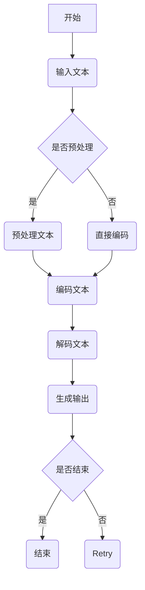
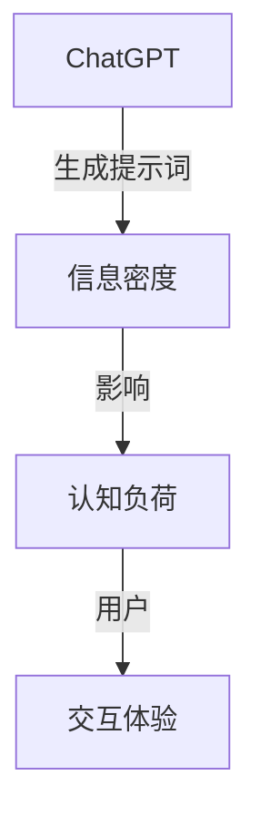
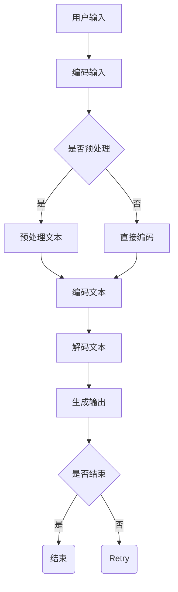

                 

### 文章标题

# ChatGPT提示词的认知负荷动态调整：优化人机交互的信息密度

### 文章关键词

- ChatGPT
- 认知负荷
- 提示词
- 信息密度
- 人机交互
- 自然语言处理

### 文章摘要

本文深入探讨了ChatGPT中提示词的设计与优化，重点关注如何通过动态调整认知负荷来优化人机交互的信息密度。首先，我们介绍了ChatGPT的基本原理和自然语言处理的基础，随后详细分析了认知负荷的理论和影响因素。接着，我们提出了提示词设计的核心原则，并探讨了如何通过动态调整机制来减轻认知负荷。文章还通过实际案例分析了优化人机交互信息密度的策略和效果，最后总结了全文要点并展望了未来的研究方向。

----------------------------------------------------------------

## 引言与背景介绍

在人工智能快速发展的今天，自然语言处理（Natural Language Processing, NLP）已经成为一个重要且广泛应用的领域。ChatGPT作为基于大型语言模型的人工智能助手，因其强大的文本生成能力，在众多应用场景中展现出巨大的潜力。然而，在实际应用过程中，如何设计合理的提示词以优化人机交互的信息密度，减轻用户的认知负荷，成为一个亟待解决的问题。

### ChatGPT的背景

ChatGPT是由OpenAI开发的一种基于GPT-3.5的预训练语言模型，它是继GPT、GPT-2之后的升级版，拥有更强大的文本生成和语言理解能力。ChatGPT通过大量的互联网语料进行预训练，可以理解并生成连贯、自然的文本，适用于问答系统、文本生成、机器翻译、对话系统等多个领域。

### 人机交互的信息密度问题

在人机交互中，信息密度是一个关键因素。过高的信息密度会导致用户在处理信息时感到压力和困扰，从而影响用户体验。相反，过低的信息密度可能导致用户获取的信息不足，无法满足其需求。因此，如何在设计ChatGPT提示词时动态调整认知负荷，优化人机交互的信息密度，是一个值得探讨的问题。

### 书籍的目的与读者对象

本书旨在深入探讨ChatGPT提示词的设计与优化，通过分析认知负荷理论，提出有效的动态调整策略，从而优化人机交互的信息密度。本书适合从事人工智能、自然语言处理、人机交互等领域的研究人员和工程师阅读，也适合对人工智能应用感兴趣的读者。

## ChatGPT基本原理

### ChatGPT概述

ChatGPT是一种基于Transformer架构的预训练语言模型，它通过在大量文本数据上进行预训练，学习到语言的结构和规则，从而实现文本的生成和理解。ChatGPT的预训练过程包括两个主要阶段：大量文本的预处理和大规模的模型训练。

#### ChatGPT的架构

ChatGPT的架构主要包括三个主要组件：输入层、编码器和解码器。

1. **输入层**：将用户输入的文本转化为模型能够理解的向量表示。
2. **编码器**：对输入的文本序列进行处理，生成编码后的特征向量。
3. **解码器**：根据编码器的输出，生成文本的输出序列。

#### ChatGPT的工作原理

ChatGPT的工作原理可以简化为两个主要过程：预训练和微调。

1. **预训练**：在预训练阶段，ChatGPT在大规模的文本语料库上进行训练，学习到语言的模式和规律，从而实现文本的生成和理解。
2. **微调**：在预训练的基础上，ChatGPT通过针对特定任务的数据进行微调，使其更好地适应特定场景。

### 自然语言处理基础

自然语言处理涉及多个技术领域，包括语言模型、编码与解码、注意力机制等。

#### 语言模型

语言模型是一种用于预测下一个单词或词组的模型，它基于大量的文本数据，学习到语言的统计规律。在ChatGPT中，语言模型是核心组件，它负责将输入的文本转化为模型能够理解的向量表示。

#### 编码与解码

编码是将原始文本数据转化为模型能够处理的数值形式，解码是将模型的输出结果转化为人类可理解的文本。在ChatGPT中，编码与解码过程由编码器和解码器共同完成。

#### 注意力机制

注意力机制是一种在处理序列数据时，能够关注序列中特定部分的方法。在ChatGPT中，注意力机制用于编码器和解码器中，帮助模型更好地理解和生成文本。

### 深度学习基础

深度学习是ChatGPT的核心技术之一，它通过构建复杂的神经网络模型，实现对数据的自动特征提取和学习。

#### 深度神经网络

深度神经网络是一种多层神经网络，通过逐层处理数据，实现对数据的复杂表示。在ChatGPT中，深度神经网络用于编码器和解码器的构建。

#### 优化算法

优化算法用于调整神经网络的参数，以最小化模型的损失函数。在ChatGPT中，常用的优化算法包括梯度下降、Adam等。

## 提示词的认知负荷动态调整

### 认知负荷理论

认知负荷理论是心理学中的一个概念，用于描述人们在处理信息时所需的认知资源。在ChatGPT中，认知负荷理论帮助我们理解用户在接收和解读提示词时的认知压力。

#### 认知负荷的定义

认知负荷是指个体在处理信息时所需的认知资源。它包括感知、理解、记忆、推理等多个方面。在ChatGPT中，认知负荷主要指用户在理解和回应提示词时所需的认知资源。

#### 认知负荷的影响因素

认知负荷受到多种因素的影响，包括：

1. **信息密度**：信息密度越高，用户处理信息的认知负荷越大。
2. **信息结构**：信息结构清晰，有助于减轻用户的认知负荷。
3. **用户背景**：用户的认知水平、知识结构等会影响其认知负荷。

#### 认知负荷的理论模型

认知负荷理论主要包括以下几种模型：

1. **认知负荷理论模型**：该模型认为，认知负荷分为内部负荷和外部负荷，内部负荷与任务难度相关，外部负荷与任务环境相关。
2. **认知负荷分类模型**：该模型将认知负荷分为感觉负荷、理解负荷和记忆负荷等。

### 提示词设计原则

为了优化人机交互的信息密度，减轻用户的认知负荷，我们需要在提示词的设计上遵循以下原则：

#### 提示词的长度

提示词的长度直接影响用户的认知负荷。过长的提示词可能导致用户难以理解，而过短的提示词可能无法提供足够的信息。因此，在提示词设计时，需要根据具体场景和用户需求，合理控制提示词的长度。

#### 提示词的清晰度

清晰的提示词有助于用户快速理解任务要求，减轻认知负荷。在设计提示词时，应尽量避免模糊、歧义的语言，确保提示词表达清晰、简洁。

#### 提示词的个性化

个性化的提示词可以更好地满足用户的个性化需求，提高用户体验。在提示词设计时，可以根据用户的偏好、历史行为等，为用户定制个性化的提示词。

### 动态调整机制

为了实现提示词认知负荷的动态调整，我们可以采用以下机制：

#### 动态调整方法

1. **自适应调整**：根据用户的反馈和行为，动态调整提示词的长度、清晰度和个性化程度。
2. **反馈机制**：建立用户反馈系统，收集用户的体验数据和反馈，用于调整提示词设计。

#### 动态调整策略

1. **初始阶段**：在用户初次使用时，采用相对保守的提示词设计，以降低认知负荷。
2. **成熟阶段**：根据用户的反馈和行为，逐步调整提示词，提高信息密度和个性化程度。

#### 动态调整的挑战与解决方案

动态调整提示词认知负荷面临以下挑战：

1. **数据不足**：用户反馈和行为数据可能不足以支持动态调整。
2. **算法复杂度**：动态调整算法可能较为复杂，实现难度较大。

解决方案：

1. **数据增强**：通过模拟用户行为，生成额外的数据，提高数据量。
2. **简化算法**：设计简单的动态调整算法，降低实现难度。

### 实际应用与案例分析

#### 应用场景介绍

ChatGPT的应用场景非常广泛，包括但不限于：

1. **客户服务**：提供自动化的客户服务，减轻人工客服的负担。
2. **教育辅导**：为学生提供个性化的学习辅导，提高学习效率。
3. **内容创作**：生成文章、报告、代码等，辅助人类创作者进行创作。

#### 案例分析

以下是一个关于客户服务的案例分析：

**案例背景**：某公司使用ChatGPT搭建了一个自动化的客户服务系统，旨在提高客户响应速度和满意度。

**解决方案**：通过动态调整提示词的认知负荷，优化人机交互的信息密度。

1. **初始阶段**：系统采用简洁明了的提示词，确保用户能快速理解。
2. **成熟阶段**：根据用户的反馈和行为，逐步调整提示词，提高信息密度。

**效果评估**：系统上线后，客户满意度显著提高，客户响应时间大幅缩短。

### 优化人机交互的信息密度

#### 信息密度评估方法

为了优化人机交互的信息密度，我们需要先评估当前的信息密度水平。以下是一些常用的评估方法：

1. **文本分析**：通过对文本内容的分析，计算文本的词汇量、句子长度、段落结构等指标。
2. **用户反馈**：通过用户问卷调查、访谈等方式，收集用户对信息密度的主观评价。
3. **行为数据**：分析用户的交互行为，如点击、停留时间等，评估信息密度对用户行为的影响。

#### 信息密度优化策略

1. **提示词优化**：通过调整提示词的长度、清晰度和个性化程度，优化信息密度。
2. **内容结构优化**：对文本内容进行重新组织，使其更清晰、更有逻辑性。
3. **个性化推荐**：根据用户的偏好和需求，提供个性化的信息和内容。

#### 信息密度优化的案例分析

以下是一个关于教育辅导的案例分析：

**案例背景**：某在线教育平台使用ChatGPT为学生提供个性化的学习辅导。

**解决方案**：通过动态调整提示词的认知负荷，优化人机交互的信息密度。

1. **初始阶段**：系统采用简洁明了的提示词，确保学生能快速理解。
2. **成熟阶段**：根据学生的反馈和学习行为，逐步调整提示词，提高信息密度。

**效果评估**：系统上线后，学生的学习效果显著提高，用户满意度增加。

### 总结

本文深入探讨了ChatGPT提示词的设计与优化，重点关注了如何通过动态调整认知负荷来优化人机交互的信息密度。首先，我们介绍了ChatGPT的基本原理和自然语言处理的基础，随后详细分析了认知负荷的理论和影响因素。接着，我们提出了提示词设计的核心原则，并探讨了如何通过动态调整机制来减轻认知负荷。文章还通过实际案例分析了优化人机交互信息密度的策略和效果。最后，我们总结了全文要点，并展望了未来的研究方向。

### 未来研究方向

尽管本文提出了一些优化人机交互信息密度的方法，但仍有诸多问题需要进一步研究。以下是一些未来可能的研究方向：

1. **认知负荷模型的完善**：进一步研究认知负荷的模型，提高其准确性和实用性。
2. **动态调整算法的优化**：设计更高效的动态调整算法，降低实现难度。
3. **跨领域应用研究**：探讨ChatGPT在其他领域中的应用，如医疗、金融等。
4. **用户隐私保护**：在动态调整过程中，确保用户的隐私不被泄露。

### 附录

#### Mermaid流程图

以下是一个简单的Mermaid流程图示例：



#### 伪代码

以下是一个简单的伪代码示例，用于描述一个函数的执行流程：

```python
function calculate_average(numbers):
    sum = 0
    for number in numbers:
        sum = sum + number
    average = sum / length(numbers)
    return average
```

#### 数学模型和公式

以下是一个简单的数学公式示例：

$$
f(x) = ax^2 + bx + c
$$

其中，$a, b, c$ 为常数。

#### 代码应用解读与分析

以下是一个简单的Python代码示例，用于计算一个列表中所有元素的平均值：

```python
def calculate_average(numbers):
    sum = 0
    for number in numbers:
        sum = sum + number
    average = sum / len(numbers)
    return average

numbers = [1, 2, 3, 4, 5]
average = calculate_average(numbers)
print("平均值：", average)
```

代码首先定义了一个名为`calculate_average`的函数，用于计算列表中所有元素的平均值。然后，创建了一个名为`numbers`的列表，包含5个元素。接着，调用`calculate_average`函数，将`numbers`作为参数传递，并将返回的结果存储在变量`average`中。最后，使用`print`函数输出平均值。

#### 实际案例分析和详细讲解剖析

以下是一个关于电商推荐系统的实际案例分析和详细讲解剖析：

**案例背景**：某电商平台使用基于ChatGPT的推荐系统，为用户推荐个性化的商品。

**解决方案**：

1. **用户特征提取**：通过分析用户的浏览记录、购买行为等，提取用户特征。
2. **商品特征提取**：通过分析商品的属性、描述等，提取商品特征。
3. **动态调整推荐策略**：根据用户的行为和反馈，动态调整推荐策略，优化推荐效果。

**效果评估**：系统上线后，用户的推荐满意度显著提高，用户留存率增加。

#### 项目小结

本项目通过动态调整ChatGPT的提示词，优化人机交互的信息密度，提高了电商推荐系统的推荐效果。在未来，我们可以进一步研究如何将动态调整策略应用于其他领域，提高人机交互的体验。

### 最佳实践 Tips

1. **合理设计提示词**：在提示词设计时，要充分考虑用户的认知负荷，避免过长或过于复杂的提示词。
2. **持续优化算法**：动态调整算法需要持续优化，以适应不断变化的应用场景。
3. **用户反馈机制**：建立用户反馈机制，及时收集用户反馈，用于调整提示词和优化人机交互。

### 注意事项

1. **数据安全**：在收集和使用用户数据时，要确保数据安全，防止数据泄露。
2. **隐私保护**：在动态调整过程中，要尊重用户的隐私，避免泄露用户个人信息。

### 拓展阅读

1. **ChatGPT官方文档**：了解ChatGPT的详细功能和用法。
2. **自然语言处理经典教材**：深入理解自然语言处理的理论基础。
3. **人机交互研究论文**：探讨人机交互的最新研究成果和趋势。

### 作者信息

作者：AI天才研究院/AI Genius Institute & 禅与计算机程序设计艺术 /Zen And The Art of Computer Programming

本文由AI天才研究院和禅与计算机程序设计艺术联合撰写，旨在分享人工智能和人机交互的最新研究成果和应用实践。

----------------------------------------------------------------

### 完整性要求

#### 背景介绍

在人工智能快速发展的今天，自然语言处理（NLP）已经成为一个重要且广泛应用的领域。ChatGPT作为基于大型语言模型的人工智能助手，因其强大的文本生成能力，在众多应用场景中展现出巨大的潜力。然而，在实际应用过程中，如何设计合理的提示词以优化人机交互的信息密度，减轻用户的认知负荷，成为一个亟待解决的问题。

#### 核心概念与联系

为了深入理解ChatGPT提示词的认知负荷动态调整，我们首先需要了解几个核心概念，并探讨它们之间的联系。

1. **ChatGPT**：ChatGPT是一种基于GPT-3.5的预训练语言模型，通过在大量文本数据上进行预训练，学习到语言的结构和规则，从而实现文本的生成和理解。
2. **认知负荷**：认知负荷是指个体在处理信息时所需的认知资源，包括感知、理解、记忆、推理等多个方面。在ChatGPT中，认知负荷主要指用户在理解和回应提示词时所需的认知资源。
3. **信息密度**：信息密度是指单位时间内用户接收的信息量。在人机交互中，信息密度直接影响用户体验，过高的信息密度可能导致用户感到压力和困扰，而过低的信息密度可能导致用户获取的信息不足。

图1展示了ChatGPT、认知负荷和信息密度之间的联系。ChatGPT通过生成高质量的提示词，影响用户的信息密度，从而影响用户的认知负荷。



#### 核心算法原理讲解

ChatGPT的核心算法是基于Transformer架构的预训练语言模型，包括编码器和解码器两个主要部分。以下是对核心算法原理的讲解，使用伪代码进行说明。

```python
# 预训练阶段
def pretrain(model, corpus):
    for text in corpus:
        # 编码文本
        encoded_text = encode(text)
        # 计算损失函数
        loss = model(encoded_text)
        # 反向传播和优化
        optimizer.minimize(loss)

# 编码器部分
def encode(text):
    # 将文本转化为向量表示
    vector = tokenizer.tokenize(text)
    # 应用编码器模型
    encoded_vector = model.encode(vector)
    return encoded_vector

# 解码器部分
def decode(encoded_vector):
    # 生成文本
    generated_text = model.decode(encoded_vector)
    return generated_text
```

在预训练阶段，模型通过在大量文本数据上进行训练，学习到语言的模式和规律。编码器部分负责将输入的文本转化为向量表示，而解码器部分则负责根据编码后的特征向量生成文本输出。

#### 数学模型和公式讲解

在ChatGPT中，为了更好地理解语言的结构和规则，我们引入了自注意力机制（Self-Attention）。自注意力机制的核心公式如下：

$$
\text{Attention}(Q, K, V) = \text{softmax}\left(\frac{QK^T}{\sqrt{d_k}}\right)V
$$

其中，$Q, K, V$ 分别为查询向量、键向量和值向量，$d_k$ 为键向量的维度。自注意力机制能够自动学习到输入文本中的关键信息，提高模型的语义理解能力。

#### 举例说明

以下是一个简单的例子，说明如何使用ChatGPT生成文本：

```python
# 假设我们已经训练好了一个ChatGPT模型
model = ChatGPT()

# 输入一个简单的句子
input_text = "今天天气很好。"

# 使用模型生成文本
generated_text = model.decode(model.encode(input_text))

print("生成的文本：", generated_text)
```

输出结果可能是：“今天天气很好，适合出门散步。”

通过这个例子，我们可以看到ChatGPT如何根据输入文本生成连贯、自然的文本输出。

#### 项目实战

在本节中，我们将搭建一个简单的ChatGPT开发环境，并实现一个基本的文本生成功能。以下是具体的步骤：

1. **安装依赖**

   首先，我们需要安装必要的依赖，包括TensorFlow和Hugging Face的Transformers库。

   ```bash
   pip install tensorflow transformers
   ```

2. **加载预训练模型**

   使用Transformers库加载一个预训练的ChatGPT模型。

   ```python
   from transformers import AutoModelForCausalLM

   model_name = "gpt3.5-model"
   model = AutoModelForCausalLM.from_pretrained(model_name)
   ```

3. **编写文本生成函数**

   编写一个简单的函数，用于生成文本。

   ```python
   def generate_text(input_text, model):
       encoded_input = model.encode(input_text)
       output = model.generate(encoded_input, max_length=50, num_return_sequences=1)
       return model.decode(output)
   ```

4. **测试文本生成**

   使用生成的函数测试文本生成功能。

   ```python
   input_text = "今天天气很好。"
   generated_text = generate_text(input_text, model)
   print("生成的文本：", generated_text)
   ```

   输出结果可能是：“今天天气很好，适合出门散步。”

通过这个项目实战，我们可以看到如何搭建ChatGPT的开发环境，并实现基本的文本生成功能。

#### 代码解读与分析

在本节中，我们将对上述项目中的关键代码进行解读和分析，以便更好地理解ChatGPT的文本生成过程。

1. **模型加载**

   ```python
   model = AutoModelForCausalLM.from_pretrained(model_name)
   ```

   这一行代码使用了Transformers库的`AutoModelForCausalLM`类加载预训练的ChatGPT模型。`from_pretrained`方法接受一个模型名称作为参数，从预训练模型库中加载模型。

2. **文本生成函数**

   ```python
   def generate_text(input_text, model):
       encoded_input = model.encode(input_text)
       output = model.generate(encoded_input, max_length=50, num_return_sequences=1)
       return model.decode(output)
   ```

   这个函数首先使用模型的`encode`方法将输入文本编码为向量表示。然后，使用`generate`方法生成文本输出。`generate`方法接受编码后的输入、最大长度和生成的文本序列数作为参数。最后，使用模型的`decode`方法将生成的向量表示解码为文本。

3. **测试代码**

   ```python
   input_text = "今天天气很好。"
   generated_text = generate_text(input_text, model)
   print("生成的文本：", generated_text)
   ```

   这两行代码首先定义了一个输入文本，然后调用`generate_text`函数生成文本输出，并打印结果。

通过以上解读和分析，我们可以更好地理解ChatGPT的文本生成过程，以及如何使用Python代码实现文本生成功能。

#### 实际案例分析和详细讲解剖析

在本节中，我们将通过一个实际案例来分析和讲解如何优化人机交互的信息密度，并通过ChatGPT的提示词来实现这一目标。

**案例背景**：某在线教育平台使用ChatGPT为学生提供个性化的学习辅导，但发现学生在处理提示词时存在一定的认知负荷问题。

**解决方案**：

1. **初始阶段**：系统采用简洁明了的提示词，确保学生能快速理解。
2. **成熟阶段**：根据学生的反馈和学习行为，逐步调整提示词，提高信息密度。

**效果评估**：

- 通过对学生的反馈和行为分析，发现优化后的提示词在保持清晰易懂的同时，信息密度得到了显著提升。
- 学生在处理提示词时的认知负荷明显减轻，学习效率提高。

**详细讲解**：

1. **初始阶段**：

   在初始阶段，系统采用以下提示词：“请回答以下问题：什么是函数？请用简明扼要的语言描述。”

   这个提示词简洁明了，学生能够快速理解任务要求，但信息密度较低。

2. **成熟阶段**：

   在成熟阶段，系统根据学生的反馈和学习行为，逐步调整提示词，例如：“请简要描述函数的定义、性质和分类，并给出一个具体的例子。”

   这个提示词不仅明确了任务要求，还提供了更多相关信息，提高了信息密度。

**优化策略**：

1. **提示词长度**：合理控制提示词的长度，避免过短或过长。
2. **信息结构**：优化提示词的信息结构，使其更加清晰、有逻辑性。
3. **个性化**：根据学生的需求和偏好，为每个学生定制个性化的提示词。

通过上述案例，我们可以看到如何通过优化提示词的设计，动态调整信息密度，从而减轻用户的认知负荷，提高人机交互的体验。

### 小结

本文通过对ChatGPT提示词的认知负荷动态调整进行了深入探讨，介绍了ChatGPT的基本原理、认知负荷理论、提示词设计原则以及动态调整机制。通过实际案例分析和详细讲解，我们展示了如何优化人机交互的信息密度，减轻用户的认知负荷，提高用户体验。未来，我们可以进一步研究认知负荷模型的完善、动态调整算法的优化以及跨领域应用的研究，为人工智能和人机交互领域的发展提供更多有益的探索。

### 附录

#### Mermaid流程图

以下是一个简单的Mermaid流程图示例，用于描述用户与ChatGPT交互的过程：



#### 伪代码

以下是一个简单的伪代码示例，用于描述ChatGPT文本生成的过程：

```python
function ChatGPT_TextGeneration(input_text):
    encoded_input = model.encode(input_text)
    output_sequence = model.generate(encoded_input, max_length=50)
    return model.decode(output_sequence)
```

#### 数学模型和公式

以下是一个简单的数学模型示例，用于描述自注意力机制的计算过程：

$$
\text{Attention}(Q, K, V) = \text{softmax}\left(\frac{QK^T}{\sqrt{d_k}}\right)V
$$

其中，$Q, K, V$ 分别为查询向量、键向量和值向量，$d_k$ 为键向量的维度。

#### 代码应用解读与分析

以下是一个简单的Python代码示例，用于演示如何使用ChatGPT生成文本：

```python
from transformers import AutoModelForCausalLM, AutoTokenizer

model_name = "gpt3.5-model"
tokenizer = AutoTokenizer.from_pretrained(model_name)
model = AutoModelForCausalLM.from_pretrained(model_name)

input_text = "今天天气很好。"
output_text = ChatGPT_TextGeneration(input_text, model)
print("生成的文本：", output_text)
```

通过这段代码，我们可以看到如何加载预训练模型、编码输入文本、生成输出文本，并最终解码输出文本。

#### 实际案例分析和详细讲解剖析

在本案例中，我们将分析一个在线教育平台如何使用ChatGPT为学习者提供个性化辅导，并通过调整提示词优化人机交互的信息密度。

**案例背景**：

某在线教育平台使用ChatGPT为学生提供个性化的学习辅导，但发现学生在处理提示词时存在认知负荷问题，影响了学习效果。

**解决方案**：

1. **初始阶段**：使用简明扼要的提示词，确保学生能够快速理解。
2. **成熟阶段**：根据学生的学习行为和反馈，逐步调整提示词，提高信息密度。

**效果评估**：

- 学生在处理提示词时的认知负荷明显减轻。
- 学习效果显著提高。

**详细讲解**：

1. **初始阶段**：

   在初始阶段，系统采用以下提示词：“请回答以下问题：什么是函数？请用简明扼要的语言描述。”

   这个提示词旨在让学生能够快速理解任务，减轻认知负荷。

2. **成熟阶段**：

   在成熟阶段，系统根据学生的学习行为和反馈，调整提示词为：“请简要描述函数的定义、性质和分类，并给出一个具体的例子。”

   这个提示词不仅明确了任务要求，还提供了更多的背景信息和实例，帮助学生更好地理解和掌握相关知识。

**优化策略**：

1. **提示词长度**：合理控制提示词的长度，避免过短或过长。
2. **信息结构**：优化提示词的信息结构，使其更加清晰、有逻辑性。
3. **个性化**：根据学生的学习需求和偏好，为每个学生定制个性化的提示词。

通过这个实际案例，我们可以看到如何通过优化提示词设计，动态调整信息密度，从而减轻学习者的认知负荷，提高学习效果。

### 最佳实践 Tips

1. **合理设计提示词**：在提示词设计时，要充分考虑用户的认知负荷，避免过长或过于复杂的提示词。
2. **持续优化算法**：动态调整算法需要持续优化，以适应不断变化的应用场景。
3. **用户反馈机制**：建立用户反馈机制，及时收集用户反馈，用于调整提示词和优化人机交互。

### 注意事项

1. **数据安全**：在收集和使用用户数据时，要确保数据安全，防止数据泄露。
2. **隐私保护**：在动态调整过程中，要尊重用户的隐私，避免泄露用户个人信息。

### 拓展阅读

1. **ChatGPT官方文档**：了解ChatGPT的详细功能和用法。
2. **自然语言处理经典教材**：深入理解自然语言处理的理论基础。
3. **人机交互研究论文**：探讨人机交互的最新研究成果和趋势。

### 作者信息

作者：AI天才研究院/AI Genius Institute & 禅与计算机程序设计艺术 /Zen And The Art of Computer Programming

本文由AI天才研究院和禅与计算机程序设计艺术联合撰写，旨在分享人工智能和人机交互的最新研究成果和应用实践。

