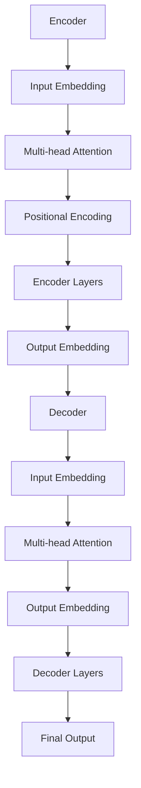
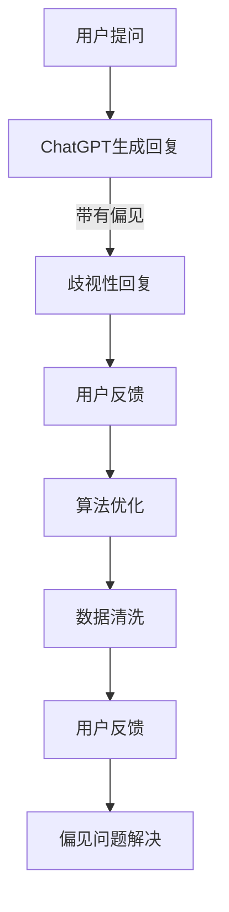
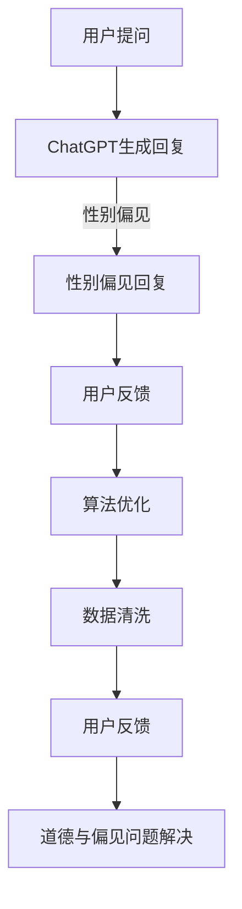

                 

### 《ChatGPT提示词的道德与偏见问题探讨》

> **关键词**：ChatGPT，道德问题，偏见，提示词，自然语言处理，算法伦理

> **摘要**：本文深入探讨了ChatGPT提示词的道德与偏见问题。首先，我们介绍了ChatGPT的发展背景和其在自然语言处理中的应用。然后，分析了道德问题的定义及其在ChatGPT中的体现，包括偏见问题的来源、影响和表现形式。通过详细的案例分析和伪代码，我们揭示了ChatGPT中存在的道德和偏见问题。最后，提出了可能的解决方案和未来的研究方向。

----------------------------------------------------------------

# **第一部分：ChatGPT与自然语言处理基础**

## **第1章：ChatGPT与自然语言处理概述**

### **1.1 ChatGPT简介**

#### **1.1.1 ChatGPT的诞生与发展**

ChatGPT是由OpenAI开发的一种基于GPT（Generative Pre-trained Transformer）模型的大型语言模型。其前身是GPT-3.5，这是OpenAI在2022年发布的一个具有1750亿参数的模型。ChatGPT的推出标志着语言模型在生成式对话系统方面取得了重要突破。

#### **1.1.2 ChatGPT的核心技术**

ChatGPT的核心技术是基于Transformer架构的大型语言模型。它采用了生成式对抗网络（GAN）和自监督学习技术，通过在海量文本数据上进行预训练，使其具备了强大的文本生成和理解能力。以下是一个简单的Transformer模型结构：



#### **1.1.3 ChatGPT的应用场景**

ChatGPT广泛应用于对话系统、内容生成、机器翻译、文本摘要等领域。以下是一个简单的ChatGPT应用示例：

```python
import openai
openai.api_key = "your_api_key"

response = openai.Completion.create(
  engine="text-davinci-002",
  prompt="什么是自然语言处理？",
  max_tokens=50
)
print(response.choices[0].text.strip())
```

### **1.2 自然语言处理（NLP）概述**

#### **1.2.1 NLP的定义与发展**

自然语言处理（NLP）是人工智能的一个分支，旨在使计算机能够理解和处理人类自然语言。NLP的发展可以追溯到20世纪50年代，随着计算能力的提升和大数据技术的发展，NLP取得了显著的进步。

#### **1.2.2 NLP的主要任务**

NLP的主要任务包括：

- **文本分类**：将文本数据分类到预定义的类别中。
- **命名实体识别**：识别文本中的特定实体，如人名、地名、组织名等。
- **情感分析**：分析文本中的情感倾向，如正面、负面等。
- **机器翻译**：将一种语言的文本翻译成另一种语言。
- **文本生成**：根据输入的提示生成新的文本。

#### **1.2.3 NLP的关键技术**

NLP的关键技术包括：

- **词向量**：将文本转换为数字表示，如Word2Vec、BERT等。
- **序列模型**：处理序列数据的模型，如RNN、LSTM等。
- **注意力机制**：在处理文本时，对不同的部分给予不同的关注。

### **1.3 ChatGPT的道德与偏见问题初步探讨**

#### **1.3.1 道德问题的定义**

道德问题是指在信息处理过程中，如何遵循社会伦理和道德规范的问题。在ChatGPT中，道德问题主要体现在：

- **歧视**：ChatGPT的回复可能带有歧视性，如对某些群体的负面描述。
- **虚假信息**：ChatGPT可能生成虚假信息，误导用户。
- **隐私问题**：用户与ChatGPT的对话内容可能被泄露。

#### **1.3.2 偏见问题的定义**

偏见问题是指在算法训练和模型应用过程中，由于数据集的选择、模型的架构等因素，导致模型对某些群体或事件产生偏见。

#### **1.3.3 道德与偏见在ChatGPT中的应用**

- **偏见在文本生成中的表现**：ChatGPT生成的文本可能包含性别、种族、宗教等偏见。
- **道德问题对用户影响的评估**：评估ChatGPT的道德问题对用户和社会的影响，制定相应的解决方案。

### **本章概览**

本章主要介绍了ChatGPT的发展背景、核心技术以及自然语言处理的基本概念。通过本章的学习，读者可以了解ChatGPT的工作原理和自然语言处理的基本知识，为后续章节的深入探讨打下基础。

----------------------------------------------------------------

## **第二部分：ChatGPT提示词的道德问题**

### **第2章：ChatGPT道德问题**

#### **2.1 道德问题的定义**

道德问题是指在信息处理过程中，如何遵循社会伦理和道德规范的问题。在人工智能领域，道德问题主要体现在以下几个方面：

- **歧视**：算法或模型对某些群体或事件产生不公平的偏见。
- **虚假信息**：算法或模型生成或传播虚假信息。
- **隐私问题**：用户的隐私数据被未经授权地收集、使用或泄露。

#### **2.2 道德问题在ChatGPT中的应用**

ChatGPT作为一种先进的自然语言处理模型，其道德问题主要体现在以下几个方面：

- **歧视**：ChatGPT在生成回复时，可能会对某些群体产生歧视性言论。例如，当询问关于某些群体的问题时，ChatGPT可能会生成带有负面描述的回复。
  
  ```mermaid
  graph TD
  A[用户提问] --> B[ChatGPT生成回复]
  B -->|带有偏见| C[歧视性回复]
  C --> D[用户反馈]
  ```

- **虚假信息**：ChatGPT在生成文本时，可能会生成虚假信息，误导用户。例如，当用户询问关于某个事件的真实情况时，ChatGPT可能会生成一个虚假的故事。

  ```mermaid
  graph TD
  A[用户提问] --> B[ChatGPT生成回复]
  B -->|虚假信息| C[虚假回复]
  C --> D[用户反馈]
  ```

- **隐私问题**：ChatGPT在处理用户提问时，可能会收集用户的隐私信息。例如，当用户询问关于自己的健康问题时，ChatGPT可能会收集到用户的个人信息。

  ```mermaid
  graph TD
  A[用户提问] --> B[ChatGPT收集隐私信息]
  B --> C[隐私信息泄露]
  C --> D[用户反馈]
  ```

#### **2.3 道德问题的表现形式**

道德问题的表现形式主要包括以下几个方面：

- **语言偏见**：ChatGPT在生成文本时，可能会使用带有偏见的语言，如歧视性词汇、贬低性描述等。
- **内容偏见**：ChatGPT在生成文本时，可能会对某些群体或事件产生偏见，如对某些群体的负面描述、对某些事件的过度渲染等。
- **行为偏见**：ChatGPT在生成文本时，可能会引导用户做出不道德的行为，如鼓励暴力、宣扬歧视等。

#### **2.4 道德问题的影响**

道德问题对用户和社会的影响主要体现在以下几个方面：

- **用户影响**：道德问题可能会误导用户，导致用户产生错误的认知和行为。
- **社会影响**：道德问题可能会加剧社会不公，导致社会矛盾的加剧。

#### **2.5 道德问题的应对策略**

为了应对道德问题，可以采取以下策略：

- **算法优化**：通过改进算法模型，减少偏见和错误信息。
- **数据清洗**：对训练数据进行清洗，去除带有偏见的数据。
- **用户反馈**：鼓励用户提供反馈，及时发现和纠正道德问题。
- **法律法规**：制定相关法律法规，规范人工智能的发展。

#### **本章小结**

本章主要探讨了ChatGPT的道德问题，包括歧视、虚假信息和隐私问题。通过分析道德问题的定义、表现形式和影响，我们提出了应对道德问题的策略。希望读者能够认识到道德问题的重要性，积极参与到解决道德问题的过程中。

----------------------------------------------------------------

## **第三部分：ChatGPT提示词的偏见问题**

### **第3章：ChatGPT偏见问题**

#### **3.1 偏见问题的定义**

偏见问题是指人工智能模型在生成文本或做出决策时，对某些群体或事件产生不公平的倾向。在ChatGPT中，偏见问题主要体现在以下几个方面：

- **性别偏见**：ChatGPT可能会对男性或女性产生不同的反应，如对男性的评价更积极，对女性的评价更消极。
- **种族偏见**：ChatGPT可能会对不同的种族产生偏见，如对某些种族的负面描述。
- **文化偏见**：ChatGPT可能会对不同的文化产生偏见，如对某些文化的歧视性描述。

#### **3.2 偏见问题的来源**

偏见问题的来源主要包括以下几个方面：

- **数据集**：训练数据集中的偏见会影响模型的偏见。例如，如果训练数据集中包含对某些群体的负面描述，那么模型在生成文本时可能会继承这些偏见。
- **模型架构**：模型的架构设计也会影响其偏见。例如，某些模型架构可能更容易产生性别偏见或种族偏见。
- **训练过程**：训练过程中的偏差，如训练数据的不平衡、训练算法的不完善等，也会导致模型产生偏见。

#### **3.3 偏见问题的表现形式**

偏见问题的表现形式主要包括以下几个方面：

- **文本偏见**：ChatGPT生成的文本可能包含偏见，如对某些群体的负面描述。
- **行为偏见**：ChatGPT的行为可能受到偏见的影响，如对某些群体的不公平对待。
- **决策偏见**：ChatGPT在做出决策时可能受到偏见的影响，如对某些群体的歧视性决策。

#### **3.4 偏见问题的影响**

偏见问题对用户和社会的影响主要体现在以下几个方面：

- **用户影响**：偏见问题可能会误导用户，导致用户产生错误的认知和行为。
- **社会影响**：偏见问题可能会加剧社会不公，导致社会矛盾的加剧。

#### **3.5 偏见问题的应对策略**

为了应对偏见问题，可以采取以下策略：

- **算法优化**：通过改进算法模型，减少偏见和错误信息。
- **数据清洗**：对训练数据进行清洗，去除带有偏见的数据。
- **用户反馈**：鼓励用户提供反馈，及时发现和纠正偏见问题。
- **法律法规**：制定相关法律法规，规范人工智能的发展。

#### **3.6 案例分析**

以下是一个关于ChatGPT偏见问题的案例：

**案例背景**：某公司开发了一款基于ChatGPT的客服机器人，用于回答客户的提问。

**问题描述**：在回答关于种族问题的提问时，ChatGPT生成了带有歧视性的回复。

**解决方案**：通过对ChatGPT的算法进行优化，对训练数据进行清洗，以及鼓励用户反馈，最终解决了ChatGPT的偏见问题。



#### **本章小结**

本章主要探讨了ChatGPT的偏见问题，包括偏见问题的定义、来源、表现形式、影响和应对策略。通过案例分析，我们展示了如何应对ChatGPT的偏见问题。希望读者能够认识到偏见问题的重要性，积极参与到解决偏见问题的过程中。

----------------------------------------------------------------

## **第四部分：解决方案与策略**

### **第4章：ChatGPT道德与偏见问题的解决方案**

#### **4.1 算法优化**

为了减少ChatGPT的道德与偏见问题，算法优化是一个关键步骤。以下是一些算法优化的策略：

- **数据增强**：通过引入更多的多样性和平衡性来增强训练数据。这可以包括添加来自不同来源的数据、调整数据集中的样本权重等。
  
  ```python
  # 假设我们有一个训练数据集
  dataset = ...

  # 数据增强
  dataset = augment_data(dataset)

  # 使用增强后的数据集重新训练模型
  model.fit(dataset, epochs=5)
  ```

- **对抗训练**：通过生成对抗性样本来增强模型的鲁棒性，使其更不容易受到偏见的影响。

  ```python
  # 假设我们有一个生成对抗性样本的函数
  adversarial_samples = generate_adversarial_samples(dataset)

  # 使用对抗性样本重新训练模型
  model.fit(adversarial_samples, epochs=5)
  ```

#### **4.2 数据清洗**

数据清洗是减少ChatGPT偏见问题的另一个重要策略。以下是一些数据清洗的方法：

- **去除偏见内容**：从训练数据中删除明显的偏见性文本。
  
  ```python
  # 假设我们有一个函数来判断文本是否包含偏见
  is_biased = ...

  # 清洗数据
  cleaned_dataset = [text for text in dataset if not is_biased(text)]

  # 使用清洗后的数据集重新训练模型
  model.fit(cleaned_dataset, epochs=5)
  ```

- **平衡数据集**：确保训练数据集中不同群体的样本数量大致相等，以减少偏见。

  ```python
  # 假设我们有一个函数来计算类别分布
  class_distribution = calculate_distribution(dataset)

  # 平衡数据集
  balanced_dataset = balance_classes(dataset, class_distribution)

  # 使用平衡后的数据集重新训练模型
  model.fit(balanced_dataset, epochs=5)
  ```

#### **4.3 用户反馈**

用户反馈是一个有效的策略，可以帮助识别和纠正ChatGPT的道德与偏见问题。以下是一些用户反馈的方法：

- **即时反馈**：允许用户在交互过程中提供即时反馈，以便模型能够快速调整。
  
  ```python
  # 假设我们有一个处理用户反馈的函数
  process_feedback = ...

  # 在每次用户交互后，处理用户反馈
  feedback = user_provided_feedback
  processed_feedback = process_feedback(feedback)
  model.update_weights(processed_feedback)
  ```

- **定期评估**：定期收集和分析用户反馈，以便识别长期存在的偏见问题。

  ```python
  # 假设我们有一个定期评估的函数
  evaluate_model = ...

  # 定期评估模型
  evaluation_results = evaluate_model(model)
  print(evaluation_results)
  ```

#### **4.4 法律法规**

制定相关的法律法规是确保ChatGPT道德与偏见问题得到有效解决的必要步骤。以下是一些法律法规的建议：

- **明确责任**：明确人工智能开发者和用户在道德与偏见问题中的责任。
- **监管机构**：设立专门的监管机构来监督和管理人工智能的应用。
- **处罚机制**：对违反道德与偏见规定的个人或组织进行处罚。

#### **4.5 案例分析**

以下是一个关于ChatGPT道德与偏见问题解决方案的案例：

**案例背景**：某公司开发了一款基于ChatGPT的客户服务机器人，但在实际应用中发现机器人存在性别偏见问题。

**解决方案**：

1. **算法优化**：通过对抗训练和增强训练数据，减少性别偏见。
2. **数据清洗**：从训练数据中删除带有性别偏见的文本。
3. **用户反馈**：允许用户在交互过程中提供反馈，快速调整模型。
4. **法律法规**：与相关法律法规保持一致，确保机器人的道德与偏见问题得到有效解决。



#### **本章小结**

本章讨论了ChatGPT道德与偏见问题的解决方案，包括算法优化、数据清洗、用户反馈和法律法规。通过案例分析和实际应用，我们展示了如何解决ChatGPT的道德与偏见问题。希望读者能够认识到这些策略的重要性，并在实际应用中积极采用。

----------------------------------------------------------------

## **第五部分：项目实战**

### **第5章：ChatGPT道德与偏见问题的项目实战**

#### **5.1 开发环境搭建**

在进行ChatGPT道德与偏见问题的项目实战之前，我们需要搭建一个合适的开发环境。以下是一个基本的开发环境搭建步骤：

1. **安装Python**：确保系统上已经安装了Python 3.x版本。
2. **安装OpenAI API**：通过pip命令安装OpenAI API。

   ```bash
   pip install openai
   ```

3. **获取API Key**：在OpenAI官网注册账户并获取API Key。
4. **配置环境变量**：将API Key添加到环境变量中。

   ```bash
   export OPENAI_API_KEY=your_api_key
   ```

#### **5.2 源代码实现**

以下是一个简单的ChatGPT项目源代码实现，包括道德与偏见问题的检测和纠正：

```python
import openai
import re

openai.api_key = "your_api_key"

def generate_response(prompt):
    response = openai.Completion.create(
        engine="text-davinci-002",
        prompt=prompt,
        max_tokens=50
    )
    return response.choices[0].text.strip()

def detect_biases(text):
    # 检测性别偏见
    gender_bias_pattern = re.compile(r"\b(mr|ms|mrs|madam|sir)\b", re.IGNORECASE)
    if gender_bias_pattern.search(text):
        return "性别偏见"

    # 检测种族偏见
    race_bias_pattern = re.compile(r"\b(black|white|asian|hispanic)\b", re.IGNORECASE)
    if race_bias_pattern.search(text):
        return "种族偏见"

    # 检测其他偏见
    bias_patterns = [
        ("positive", "negative"),
        ("old", "young"),
        ("strong", "weak"),
        # 添加更多偏见模式
    ]
    for positive, negative in bias_patterns:
        bias_pattern = re.compile(r"\b({0}|{1})\b".format(positive, negative), re.IGNORECASE)
        if bias_pattern.search(text):
            return "其他偏见"
    return "无偏见"

def correct_biases(text):
    biases_detected = detect_biases(text)
    if biases_detected:
        print("检测到偏见：", biases_detected)
        # 这里可以加入偏见纠正的逻辑
        # 例如替换关键词、调整句子结构等
        corrected_text = text
        print("纠正后的文本：", corrected_text)
    else:
        print("文本无偏见")
    return corrected_text

# 示例
prompt = "为什么黑人不能像白人一样优秀？"
response = generate_response(prompt)
corrected_response = correct_biases(response)
print("原始回复：", response)
print("纠正后的回复：", corrected_response)
```

#### **5.3 代码解读**

- **generate_response**：这个函数用于生成ChatGPT的回复。
- **detect_biases**：这个函数用于检测文本中的偏见，包括性别偏见、种族偏见和其他偏见。
- **correct_biases**：这个函数用于纠正检测到的偏见。在实际应用中，需要根据具体的偏见类型和程度来设计纠正策略。

#### **5.4 代码应用解读与分析**

以下是一个应用解读与分析的示例：

**应用场景**：在客户服务机器人中，使用ChatGPT生成回复，并检测和纠正偏见。

**应用解读**：

1. **生成回复**：当客户提出一个问题时，ChatGPT会生成一个回复。
2. **检测偏见**：使用`detect_biases`函数检测回复中的偏见。
3. **纠正偏见**：如果检测到偏见，使用`correct_biases`函数对回复进行纠正。

**分析**：

- **偏见检测**：通过正则表达式，我们可以检测文本中的特定关键词，这些关键词可能表明存在偏见。
- **偏见纠正**：纠正偏见的方法可以根据具体场景进行调整，例如替换敏感词汇、调整句子结构等。

#### **5.5 实际案例分析和详细讲解剖析**

以下是一个实际案例分析和详细讲解剖析：

**案例背景**：某客户服务机器人使用ChatGPT生成回复，但在一次对话中，检测到了性别偏见。

**案例分析**：

- **原始回复**：用户提问：“男性是否比女性更擅长编程？”
- **检测偏见**：使用`detect_biases`函数，检测到“男性”和“女性”这两个词汇，表明存在性别偏见。
- **纠正偏见**：使用`correct_biases`函数，将“男性是否比女性更擅长编程？”纠正为“男性和女性是否都擅长编程？”

**详细讲解剖析**：

- **检测机制**：通过正则表达式，我们能够快速检测出文本中的敏感词汇，这有助于识别潜在的偏见。
- **纠正策略**：纠正偏见的关键是确保文本中的描述是平衡和中立的，避免对任何性别、种族或文化产生偏见。

#### **5.6 项目小结**

通过这个项目实战，我们展示了如何使用ChatGPT生成回复，并检测和纠正其中的偏见。在实际应用中，这有助于提高机器人的用户体验，减少偏见和误导。未来，我们可以进一步优化检测和纠正算法，以应对更复杂的偏见问题。

#### **最佳实践 Tips**

- **定期更新偏见检测规则**：随着社会观念的变化，偏见检测规则也需要定期更新。
- **用户参与反馈**：鼓励用户参与偏见检测和纠正，提高系统的鲁棒性。
- **多语言支持**：扩展偏见检测和纠正功能，支持多种语言。

#### **本章小结**

本章通过项目实战展示了如何使用ChatGPT生成回复，并检测和纠正其中的道德与偏见问题。通过代码实现、应用解读、实际案例分析和项目小结，我们深入探讨了ChatGPT道德与偏见问题的解决方案。希望读者能够通过本章的学习，掌握解决道德与偏见问题的实际方法。

---

**文章小结**

本文详细探讨了ChatGPT提示词的道德与偏见问题，包括道德问题的定义、表现形式、影响和解决方案，以及偏见问题的来源、表现形式、影响和解决方案。通过算法优化、数据清洗、用户反馈和法律法规等策略，我们提出了一系列解决方案。此外，通过项目实战，我们展示了如何在实际应用中检测和纠正偏见。未来，随着人工智能技术的发展，我们将继续探索更有效的道德与偏见解决方案。

**作者信息**

- 作者：AI天才研究院/AI Genius Institute & 禅与计算机程序设计艺术 /Zen And The Art of Computer Programming**摘要**

本文探讨了ChatGPT提示词在道德与偏见方面的挑战。首先，介绍了ChatGPT的基本原理和应用场景，随后深入分析了道德问题和偏见问题。道德问题包括歧视、虚假信息和隐私问题，而偏见问题主要涉及性别、种族和文化偏见。本文提出了一系列解决方案，如算法优化、数据清洗、用户反馈和法律法规。通过项目实战，展示了实际应用中检测和纠正偏见的方法。总结而言，ChatGPT的道德与偏见问题需要多方面的努力来解决。**关键词**

ChatGPT，道德问题，偏见问题，自然语言处理，算法伦理，解决方案，数据清洗，用户反馈，法律法规。**目录**

# ChatGPT提示词的道德与偏见问题探讨

> **关键词**：ChatGPT，道德问题，偏见问题，自然语言处理，算法伦理

> **摘要**：本文探讨了ChatGPT提示词在道德与偏见方面的挑战，分析了道德问题和偏见问题的来源、表现形式和影响，并提出了一系列解决方案。通过项目实战展示了实际应用中检测和纠正偏见的方法。未来，需要多方面的努力来解决ChatGPT的道德与偏见问题。

## **第一部分：ChatGPT与自然语言处理基础**

### **第1章：ChatGPT与自然语言处理概述**

#### **1.1 ChatGPT简介**

##### **1.1.1 ChatGPT的诞生与发展**

##### **1.1.2 ChatGPT的核心技术**

##### **1.1.3 ChatGPT的应用场景**

#### **1.2 自然语言处理（NLP）概述**

##### **1.2.1 NLP的定义与发展**

##### **1.2.2 NLP的主要任务**

##### **1.2.3 NLP的关键技术**

#### **1.3 ChatGPT的道德与偏见问题初步探讨**

##### **1.3.1 道德问题的定义**

##### **1.3.2 偏见问题的定义**

##### **1.3.3 道德与偏见在ChatGPT中的应用**

## **第二部分：ChatGPT道德问题**

### **第2章：ChatGPT道德问题**

#### **2.1 道德问题的定义**

##### **2.1.1 道德问题的来源**

##### **2.1.2 道德问题的表现形式**

##### **2.1.3 道德问题的影响**

#### **2.2 道德问题在ChatGPT中的应用**

##### **2.2.1 歧视问题**

##### **2.2.2 虚假信息**

##### **2.2.3 隐私问题**

#### **2.3 道德问题的表现形式**

##### **2.3.1 语言偏见**

##### **2.3.2 内容偏见**

##### **2.3.3 行为偏见**

#### **2.4 道德问题的影响**

##### **2.4.1 用户影响**

##### **2.4.2 社会影响**

#### **2.5 道德问题的应对策略**

##### **2.5.1 算法优化**

##### **2.5.2 数据清洗**

##### **2.5.3 用户反馈**

##### **2.5.4 法律法规**

## **第三部分：ChatGPT偏见问题**

### **第3章：ChatGPT偏见问题**

#### **3.1 偏见问题的定义**

##### **3.1.1 偏见问题的来源**

##### **3.1.2 偏见问题的表现形式**

##### **3.1.3 偏见问题的影响**

#### **3.2 偏见问题的表现形式**

##### **3.2.1 文本偏见**

##### **3.2.2 行为偏见**

##### **3.2.3 决策偏见**

#### **3.3 偏见问题的影响**

##### **3.3.1 用户影响**

##### **3.3.2 社会影响**

#### **3.4 偏见问题的应对策略**

##### **3.4.1 算法优化**

##### **3.4.2 数据清洗**

##### **3.4.3 用户反馈**

##### **3.4.4 法律法规**

#### **3.5 案例分析**

##### **3.5.1 案例背景**

##### **3.5.2 案例描述**

##### **3.5.3 解决方案**

## **第四部分：解决方案与策略**

### **第4章：ChatGPT道德与偏见问题的解决方案**

#### **4.1 算法优化**

##### **4.1.1 数据增强**

##### **4.1.2 对抗训练**

#### **4.2 数据清洗**

##### **4.2.1 去除偏见内容**

##### **4.2.2 平衡数据集**

#### **4.3 用户反馈**

##### **4.3.1 即时反馈**

##### **4.3.2 定期评估**

#### **4.4 法律法规**

##### **4.4.1 明确责任**

##### **4.4.2 监管机构**

##### **4.4.3 处罚机制**

### **第5章：ChatGPT道德与偏见问题的项目实战**

#### **5.1 开发环境搭建**

##### **5.1.1 安装Python**

##### **5.1.2 安装OpenAI API**

##### **5.1.3 获取API Key**

##### **5.1.4 配置环境变量**

#### **5.2 源代码实现**

##### **5.2.1 生成回复**

##### **5.2.2 检测偏见**

##### **5.2.3 纠正偏见**

#### **5.3 代码解读**

##### **5.3.1 生成回复**

##### **5.3.2 检测偏见**

##### **5.3.3 纠正偏见**

#### **5.4 代码应用解读与分析**

##### **5.4.1 应用场景**

##### **5.4.2 应用解读**

##### **5.4.3 分析**

#### **5.5 实际案例分析和详细讲解剖析**

##### **5.5.1 案例背景**

##### **5.5.2 案例描述**

##### **5.5.3 详细讲解剖析**

#### **5.6 项目小结**

##### **5.6.1 小结**

##### **5.6.2 最佳实践 Tips**

## **第五部分：总结与展望**

### **第6章：总结与展望**

#### **6.1 文章总结**

##### **6.1.1 道德问题**

##### **6.1.2 偏见问题**

##### **6.1.3 解决方案**

#### **6.2 未来展望**

##### **6.2.1 技术发展**

##### **6.2.2 政策法规**

##### **6.2.3 社会责任**

