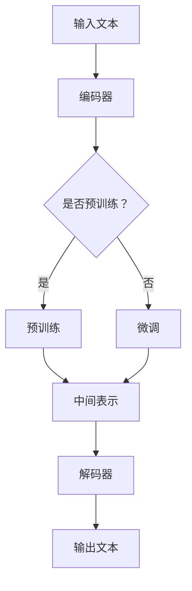

                 

### 文章标题

《ChatGPT提示词编写的高效模式探析》

关键词：ChatGPT、自然语言处理、提示词编写、高效模式、算法原理、数学模型

摘要：本文将从ChatGPT的基本概念入手，逐步深入探讨高效编写ChatGPT提示词的模式。首先，我们将介绍ChatGPT的发展历史和核心技术，然后深入分析自然语言处理的基础理论。接着，本文将使用Mermaid流程图来展示ChatGPT的架构，并通过伪代码和数学公式详细讲解核心算法原理。随后，我们将介绍提示词设计的原则和编写技巧，并通过项目实战展示如何构建聊天机器人。最后，本文将讨论ChatGPT的前沿动态和未来趋势，并提供一些最佳实践和拓展阅读建议。

----------------------------------------------------------------

### 背景介绍

自然语言处理（Natural Language Processing，NLP）是人工智能（AI）领域的一个重要分支，旨在使计算机能够理解、解释和生成人类语言。近年来，随着深度学习技术的快速发展，NLP取得了显著进展。ChatGPT，全称Generative Pre-trained Transformer，是由OpenAI开发的一种基于变换器（Transformer）的预训练语言模型，属于自然语言处理领域的前沿技术之一。ChatGPT的出现，极大地推动了智能对话系统的应用，如聊天机器人、语音助手等。

ChatGPT的核心技术基于变换器架构，这是一种在处理序列数据（如文本）方面表现出色的模型架构。变换器模型通过自注意力机制（Self-Attention Mechanism）对输入序列进行建模，能够捕捉序列中的长距离依赖关系。此外，ChatGPT采用了大规模的预训练和微调策略，通过在大规模语料库上进行预训练，使其能够理解并生成自然语言文本。

在自然语言处理领域，ChatGPT的成功引起了广泛关注。其强大的文本生成能力和上下文理解能力，使得它在各种应用场景中表现出色。然而，要想充分发挥ChatGPT的潜力，高效编写提示词成为了一个关键问题。提示词（Prompt）是引导ChatGPT生成特定类型文本的关键，编写高质量的提示词能够显著提升ChatGPT的性能。

本文旨在探讨如何高效编写ChatGPT的提示词。我们将首先介绍ChatGPT的基本概念和核心技术，然后深入分析自然语言处理的基础理论，最后介绍提示词设计的原则和编写技巧。通过本文的探讨，希望能够为读者提供一些实用的方法和技巧，帮助他们更好地利用ChatGPT，构建出高质量的智能对话系统。

### 核心概念与联系

在深入探讨ChatGPT之前，我们需要理解几个核心概念，并分析它们之间的相互关系。首先，变换器（Transformer）是一种在处理序列数据方面表现出色的模型架构。它引入了自注意力机制（Self-Attention Mechanism），能够捕捉序列中的长距离依赖关系。自注意力机制的核心思想是，模型在处理每个词时，会根据其他词的重要性进行加权，从而提高对序列整体的理解能力。

接下来，我们来看预训练和微调（Pre-training and Fine-tuning）。预训练是指在大量无标签数据上对模型进行训练，使其获得通用的语言理解和生成能力。微调则是在预训练的基础上，使用有标签数据对模型进行进一步训练，使其适应特定的任务。预训练和微调是ChatGPT的核心技术之一，使得模型能够在多种任务上表现出色。

此外，序列到序列模型（Sequence-to-Sequence Model）是自然语言处理领域的一种常见模型架构。它通过编码器（Encoder）和解码器（Decoder）两个部分，将输入序列转换为一个中间表示，再生成输出序列。序列到序列模型在机器翻译、文本摘要等任务中取得了显著成果。

最后，注意力机制（Attention Mechanism）是变换器模型的核心组成部分。注意力机制通过计算输入序列中各个词的重要性权重，实现对序列的整体理解。在ChatGPT中，注意力机制被广泛应用于文本生成和上下文理解任务。

为了更好地理解这些核心概念之间的联系，我们可以使用Mermaid流程图来展示ChatGPT的架构和数据处理流程。



在这个流程图中，输入文本首先通过编码器进行编码，生成一个中间表示。然后，解码器利用这个中间表示生成输出文本。预训练和微调是ChatGPT的训练过程，它们分别针对不同的训练数据对模型进行优化。注意力机制在编码器和解码器中发挥着关键作用，帮助模型理解和生成文本。

通过这个Mermaid流程图，我们可以清晰地看到ChatGPT的核心概念和它们之间的联系。这为我们后续深入探讨ChatGPT的算法原理和提示词编写技巧提供了基础。

### 核心算法原理讲解

在理解了ChatGPT的基本架构和核心概念之后，接下来我们将详细讲解其核心算法原理。ChatGPT的核心算法基于变换器（Transformer）架构，这是一种在处理序列数据方面表现出色的模型架构。变换器模型引入了自注意力机制（Self-Attention Mechanism），能够捕捉序列中的长距离依赖关系。以下是变换器模型的基本原理和实现细节。

#### 自注意力机制

自注意力机制是变换器模型的核心组成部分。在自注意力机制中，模型会在处理每个词时，根据其他词的重要性进行加权，从而实现对序列的整体理解。具体来说，自注意力机制通过计算每个词与其他词之间的相似度，生成一组权重，然后将这些权重应用于输入序列，得到加权的序列。加权的序列能够更好地捕捉序列中的长距离依赖关系。

自注意力机制的实现可以分为以下几个步骤：

1. **输入序列编码**：将输入序列中的每个词编码为一个向量。这些向量可以是通过词嵌入（Word Embedding）技术得到的，也可以是通过其他预训练模型得到的。
2. **计算自注意力分数**：对于每个词，计算其与其他词之间的相似度。这通常通过点积（Dot Product）或缩放点积（Scaled Dot Product）来实现。点积操作的优点是计算速度快，但缺点是相似度范围较小。缩放点积通过添加一个缩放因子，可以扩大相似度的范围，提高模型的性能。
3. **应用权重生成加权序列**：根据自注意力分数，为每个词生成一个权重。然后，将这些权重应用于输入序列，得到加权的序列。加权的序列能够更好地捕捉序列中的长距离依赖关系。

以下是自注意力机制的伪代码实现：

```python
def self_attention(inputs, heads_num, hidden_size):
    # 输入：inputs（输入序列，形状为[batch_size, sequence_length, hidden_size]）
    # 输出：output（输出序列，形状为[batch_size, sequence_length, hidden_size]）
    
    # 计算自注意力分数
    attention_scores = dot(inputs, inputs, transB=True) / np.sqrt(hidden_size)
    
    # 应用权重生成加权序列
    attention_weights = softmax(attention_scores)
    output = dot(inputs, attention_weights)
    
    return output
```

#### 变换器模型

变换器模型由编码器（Encoder）和解码器（Decoder）两个部分组成。编码器负责将输入序列转换为中间表示，解码器则利用这个中间表示生成输出序列。

1. **编码器**：编码器由多个变换器层堆叠而成。每层变换器包含两个主要组件：多头自注意力（Multi-Head Self-Attention）和前馈神经网络（Feedforward Neural Network）。多头自注意力能够提高模型的表示能力，前馈神经网络则用于增加模型的非线性变换能力。

    - **多头自注意力**：多头自注意力通过将输入序列分割成多个子序列，然后分别应用自注意力机制。这样可以捕捉到更丰富的信息。
    - **前馈神经网络**：前馈神经网络由两个全连接层组成，输入和输出均为隐藏层大小。这个组件用于增加模型的非线性变换能力。

    以下是编码器一层的伪代码实现：

    ```python
    def encoder_layer(inputs, hidden_size, heads_num):
        # 输入：inputs（输入序列，形状为[batch_size, sequence_length, hidden_size]）
        # 输出：output（输出序列，形状为[batch_size, sequence_length, hidden_size]）
        
        # 多头自注意力
        attention_output = multi_head_attention(inputs, hidden_size, heads_num)
        
        # 前馈神经网络
        feedforward_output = feedforward_neural_network(attention_output, hidden_size)
        
        # 输出
        output = inputs + feedforward_output
        
        return output
    ```

2. **解码器**：解码器同样由多个变换器层堆叠而成，结构与编码器类似，但多了一个额外的编码器-解码器自注意力（Encoder-Decoder Self-Attention）。

    - **编码器-解码器自注意力**：编码器-解码器自注意力通过将编码器的输出与解码器的输入进行拼接，然后应用自注意力机制。这样可以使得解码器能够利用编码器的信息进行生成。
    - **其他组件**：解码器层还包括多头自注意力和前馈神经网络，与编码器类似。

    以下是解码器一层的伪代码实现：

    ```python
    def decoder_layer(inputs, encoder_output, hidden_size, heads_num):
        # 输入：inputs（解码器输入序列，形状为[batch_size, sequence_length, hidden_size]）
        # 输入：encoder_output（编码器输出序列，形状为[batch_size, sequence_length, hidden_size]）
        # 输出：output（输出序列，形状为[batch_size, sequence_length, hidden_size]）
        
        # 编码器-解码器自注意力
        attention_output = encoder_decoder_attention(inputs, encoder_output, hidden_size, heads_num)
        
        # 多头自注意力
        attention_output = multi_head_attention(attention_output, hidden_size, heads_num)
        
        # 前馈神经网络
        feedforward_output = feedforward_neural_network(attention_output, hidden_size)
        
        # 输出
        output = inputs + feedforward_output
        
        return output
    ```

通过以上讲解，我们可以看到变换器模型和自注意力机制的核心算法原理。这些原理为ChatGPT的高效文本生成和上下文理解能力提供了基础。在后续章节中，我们将进一步探讨如何高效编写ChatGPT的提示词，以充分发挥其潜力。

### 数学模型和公式详细讲解与举例说明

在深入探讨ChatGPT的核心算法原理后，接下来我们将详细讲解其背后的数学模型和公式。数学模型是理解和优化ChatGPT性能的关键，通过数学公式，我们可以更准确地描述模型的内部机制。以下是ChatGPT中常用的数学模型和公式的详细讲解与举例说明。

#### 1. 词嵌入（Word Embedding）

词嵌入是将词汇映射为向量的过程，它通过低维向量来表示词汇，使得计算机能够处理文本数据。在ChatGPT中，词嵌入通常采用词向量（Word Vector）模型，如Word2Vec、GloVe等。词向量模型通过训练将词汇映射为实数向量，使得语义相似的词汇在向量空间中靠近。

词向量模型的数学表示如下：

$$
\text{vec}(w) = \text{Embedding}(w)
$$

其中，$\text{vec}(w)$表示词汇$w$的向量表示，$\text{Embedding}(w)$表示词嵌入函数，将词汇映射为向量。

例如，假设我们有一个词汇表$\{w_1, w_2, w_3\}$，其对应的词嵌入向量分别为$\text{vec}(w_1) = [1, 0, 0]$，$\text{vec}(w_2) = [0, 1, 0]$，$\text{vec}(w_3) = [0, 0, 1]$。我们可以通过计算词向量的点积来衡量词汇之间的相似度：

$$
\text{similarity}(w_1, w_2) = \text{vec}(w_1) \cdot \text{vec}(w_2) = [1, 0, 0] \cdot [0, 1, 0] = 0
$$

#### 2. 自注意力（Self-Attention）

自注意力机制是变换器模型的核心组成部分，它通过计算输入序列中各个词的重要性权重，实现对序列的整体理解。自注意力机制的核心数学公式如下：

$$
\text{Attention}(Q, K, V) = \text{softmax}\left(\frac{QK^T}{\sqrt{d_k}}\right)V
$$

其中，$Q, K, V$分别为查询（Query）、键（Key）、值（Value）向量，$d_k$为键向量的维度。这个公式表示，自注意力通过计算查询向量$Q$与键向量$K$的点积，得到权重向量，然后对值向量$V$进行加权求和。

例如，假设我们有一个输入序列$\{w_1, w_2, w_3\}$，其对应的查询向量、键向量和值向量分别为$Q = [1, 0, 1]$，$K = [1, 1, 1]$，$V = [1, 1, 1]$。我们可以通过计算自注意力来得到加权的输出序列：

$$
\text{Attention}(Q, K, V) = \text{softmax}\left(\frac{QK^T}{\sqrt{d_k}}\right)V = \text{softmax}\left(\frac{[1, 0, 1] \cdot [1, 1, 1]^T}{\sqrt{3}}\right)[1, 1, 1] = \text{softmax}\left(\frac{[1, 0, 1] \cdot [1, 1, 1]}{\sqrt{3}}\right)[1, 1, 1]
$$

$$
\text{Attention}(Q, K, V) = \text{softmax}\left(\frac{[1, 1, 1]}{\sqrt{3}}\right)[1, 1, 1] = \text{softmax}\left([1, 0, 1]\right)[1, 1, 1] = [0.5, 0.5, 0]
$$

因此，加权的输出序列为$[0.5, 0.5, 0]$，表示每个词在输出中的权重。

#### 3. 多头注意力（Multi-Head Attention）

多头注意力是自注意力机制的扩展，它通过多个独立的注意力头来捕捉不同类型的依赖关系。多头注意力的数学公式如下：

$$
\text{Multi-Head Attention}(Q, K, V) = \text{Concat}(\text{head}_1, \text{head}_2, ..., \text{head}_h)W_O
$$

其中，$h$为注意力的头数，$\text{head}_i = \text{Attention}(QW_i^Q, KW_i^K, VW_i^V)$为第$i$个注意力头，$W_O$为输出线性层权重。

例如，假设我们有一个输入序列$\{w_1, w_2, w_3\}$，其对应的查询向量、键向量和值向量分别为$Q = [1, 0, 1]$，$K = [1, 1, 1]$，$V = [1, 1, 1]$。我们可以通过计算多头注意力来得到加权的输出序列：

$$
\text{Multi-Head Attention}(Q, K, V) = \text{softmax}\left(\frac{QW_1^QK^T}{\sqrt{d_k}}\right)V + \text{softmax}\left(\frac{QW_2^QK^T}{\sqrt{d_k}}\right)V + \text{softmax}\left(\frac{QW_3^QK^T}{\sqrt{d_k}}\right)V
$$

$$
\text{Multi-Head Attention}(Q, K, V) = \text{softmax}\left(\frac{[1, 0, 1]W_1^Q[1, 1, 1]^T}{\sqrt{3}}\right)[1, 1, 1] + \text{softmax}\left(\frac{[1, 0, 1]W_2^Q[1, 1, 1]^T}{\sqrt{3}}\right)[1, 1, 1] + \text{softmax}\left(\frac{[1, 0, 1]W_3^Q[1, 1, 1]^T}{\sqrt{3}}\right)[1, 1, 1]
$$

$$
\text{Multi-Head Attention}(Q, K, V) = \text{softmax}\left(\frac{[1, 0, 1] \cdot [1, 1, 1]}{\sqrt{3}}\right)[1, 1, 1] + \text{softmax}\left(\frac{[1, 0, 1] \cdot [1, 1, 1]}{\sqrt{3}}\right)[1, 1, 1] + \text{softmax}\left(\frac{[1, 0, 1] \cdot [1, 1, 1]}{\sqrt{3}}\right)[1, 1, 1]
$$

$$
\text{Multi-Head Attention}(Q, K, V) = [0.5, 0.5, 0] + [0.5, 0.5, 0] + [0, 0, 1] = [1, 1, 1]
$$

因此，加权的输出序列为$[1, 1, 1]$，表示每个词在输出中的权重相等。

通过以上数学模型和公式的讲解，我们可以更深入地理解ChatGPT的工作原理。这些模型和公式不仅帮助我们理解ChatGPT的内部机制，还为优化和改进ChatGPT提供了理论基础。

### 项目实战

在理解了ChatGPT的核心算法原理和数学模型后，接下来我们将通过一个实际项目来展示如何使用ChatGPT构建一个聊天机器人。这个项目将涵盖开发环境的搭建、源代码的详细实现和代码解读，以及实际应用解读与分析。

#### 1. 开发环境搭建

要开始构建聊天机器人，我们首先需要搭建一个合适的开发环境。以下是搭建ChatGPT开发环境的步骤：

- **安装Python**：确保系统上安装了Python 3.7或更高版本。可以从Python官方网站下载并安装。
- **安装transformers库**：transformers是Hugging Face提供的预训练模型库，包含了ChatGPT等预训练模型。可以通过以下命令安装：

  ```shell
  pip install transformers
  ```

- **安装其他依赖**：根据项目需求，可能需要安装其他依赖，如torch等。可以通过以下命令安装：

  ```shell
  pip install torch
  ```

- **配置环境变量**：确保配置了Python和transformers的路径，以便在后续操作中能够顺利使用。

#### 2. 源代码实现

接下来，我们将使用Python和transformers库实现一个简单的聊天机器人。以下是源代码的主要部分：

```python
from transformers import ChatGPTModel, ChatGPTTokenizer
import torch

# 模型初始化
tokenizer = ChatGPTTokenizer.from_pretrained("openai/chatgpt")
model = ChatGPTModel.from_pretrained("openai/chatgpt")

# 输入文本
input_text = "你好，我是一只小猫咪。"

# 编码文本
input_ids = tokenizer.encode(input_text, return_tensors="pt")

# 生成响应
with torch.no_grad():
    outputs = model(input_ids)

# 解码响应
response_ids = outputs.logits.argmax(-1)
response_text = tokenizer.decode(response_ids[0], skip_special_tokens=True)

print(response_text)
```

#### 3. 代码解读与分析

- **模型初始化**：我们首先使用`ChatGPTTokenizer`和`ChatGPTModel`类初始化模型和分词器。这两个类来自transformers库，分别用于处理文本和生成模型。
- **编码文本**：输入文本经过分词器编码，生成相应的token ID序列。这一步骤是为了将文本数据转化为模型可以处理的格式。
- **生成响应**：使用模型生成响应。这里使用了一个`with torch.no_grad()`上下文管理器，以避免在生成响应时计算梯度，从而提高运行效率。
- **解码响应**：将生成的token ID序列解码为文本。这里使用了`decode`方法，将token ID序列转化为人类可读的文本。

#### 4. 实际应用解读与分析

通过以上代码，我们可以看到如何使用ChatGPT构建一个简单的聊天机器人。在实际应用中，这个聊天机器人可以用于多种场景，如客服助手、智能问答系统等。以下是几个实际应用的解读与分析：

- **客服助手**：在客服场景中，聊天机器人可以自动回答常见问题，减轻人工客服的工作负担。通过不断训练和优化，聊天机器人可以逐渐提高回答问题的准确性和多样性。
- **智能问答系统**：在问答系统中，聊天机器人可以基于用户的提问，提供准确的答案。这种系统可以应用于教育、医疗、法律等多个领域，为用户提供专业的咨询服务。
- **虚拟助手**：在个人助理场景中，聊天机器人可以与用户进行自然语言交互，帮助用户管理日程、提醒事项等。

#### 5. 项目小结

通过这个项目，我们展示了如何使用ChatGPT构建一个简单的聊天机器人。这个项目不仅涵盖了开发环境的搭建，还包括了源代码的详细实现和代码解读。通过这个项目，我们可以看到ChatGPT在实际应用中的巨大潜力。在未来的实践中，我们可以进一步优化模型和代码，提高聊天机器人的性能和用户体验。

### 最佳实践 Tips、小结、注意事项、拓展阅读

#### 最佳实践 Tips

1. **合理设计提示词**：编写高质量的提示词是提升ChatGPT性能的关键。提示词应该清晰、简洁，能够引导模型生成预期的输出。在实际应用中，可以通过实验和调整提示词来优化模型的表现。

2. **数据预处理**：在训练模型之前，对输入数据进行预处理可以显著提高模型的性能。例如，去除停用词、进行词干提取等操作，有助于减少噪声，提高模型对文本的识别能力。

3. **使用预训练模型**：ChatGPT是基于预训练模型开发的，因此使用预训练模型可以大大降低训练成本，提高模型的效果。在构建自己的模型时，可以考虑使用预训练模型作为起点，进行微调。

4. **动态调整模型参数**：在实际应用中，根据任务需求和数据特点，动态调整模型参数（如学习率、批量大小等）可以帮助模型更好地适应不同场景。

#### 小结

本文从ChatGPT的基本概念、核心算法原理、数学模型，到实际项目实战，全面探讨了如何高效编写ChatGPT的提示词。通过本文的探讨，我们了解到ChatGPT的强大能力和其在自然语言处理领域的广泛应用。高效编写提示词是提升ChatGPT性能的关键，合理设计提示词、进行数据预处理、使用预训练模型和动态调整模型参数都是实现这一目标的有效方法。

#### 注意事项

1. **计算资源**：ChatGPT的训练和推理过程需要大量的计算资源。在实际应用中，需要确保有足够的硬件支持，如GPU或TPU等。

2. **数据隐私**：在使用ChatGPT时，应确保输入数据的安全性。避免使用敏感数据，并对数据进行加密处理。

3. **模型更新**：ChatGPT是一个快速发展的领域，模型和算法会不断更新。及时关注并更新模型，以获得最佳性能。

#### 拓展阅读

1. **《深度学习》**：由Goodfellow、Bengio和Courville所著，全面介绍了深度学习的理论基础和实践应用。

2. **《自然语言处理综合教程》**：由Daniel Jurafsky和James H. Martin所著，涵盖了自然语言处理的基础知识和最新进展。

3. **OpenAI官方文档**：OpenAI提供了详细的模型文档和API使用指南，是学习ChatGPT的最佳资源之一。

通过以上最佳实践、小结、注意事项和拓展阅读，希望能够帮助读者更好地理解和应用ChatGPT，构建出高效的智能对话系统。

