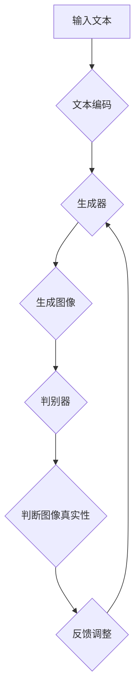

                 

### 文章标题：DALL-E在LLM文本到图像生成评估中的使用

关键词：DALL-E，文本到图像生成，LLM，评估方法，人工智能

摘要：本文将探讨DALL-E这一生成对抗网络（GAN）在大型语言模型（LLM）文本到图像生成中的运用。通过深入分析DALL-E的工作原理、结构、核心算法，以及其在文本到图像生成评估中的应用，我们旨在为读者提供一个全面的技术解读。文章将涵盖DALL-E与LLM的概述，DALL-E的工作流程和评估方法，以及其在实际应用中的优势和挑战。最后，我们将对DALL-E的未来发展进行展望。

### 引言

近年来，随着深度学习和生成对抗网络（GAN）技术的迅猛发展，计算机视觉领域迎来了前所未有的变革。其中，文本到图像生成（Text-to-Image Generation）作为一个跨学科的前沿研究领域，吸引了众多学者和工程师的广泛关注。文本到图像生成不仅具有广泛的实际应用前景，如虚拟现实、广告设计、游戏开发等，还能够在数据增强、图像理解等方面发挥重要作用。

在这其中，DALL-E作为OpenAI推出的一款基于GAN的文本到图像生成模型，以其卓越的性能和独特的工作机制，成为研究者和开发者关注的焦点。DALL-E不仅能够根据文本描述生成高质量、多样化的图像，还在图像生成速度、生成图像的多样性以及图像的细节还原等方面表现出色。

本文将围绕DALL-E在大型语言模型（LLM）文本到图像生成评估中的应用展开讨论。通过梳理DALL-E的起源、发展，以及其在文本到图像生成中的优势，我们将深入探讨DALL-E的工作原理、核心算法，并分析其在实际应用中的评估方法和挑战。本文的结构如下：

1. **DALL-E和LLM概述**：介绍DALL-E和LLM的基本概念，回顾其发展历程和主要特点。
2. **DALL-E的工作原理**：详细解析DALL-E的核心概念、结构和工作流程。
3. **DALL-E在文本到图像生成中的应用**：讨论DALL-E在图像生成中的具体应用，并与其他图像生成技术进行比较。
4. **DALL-E的评估方法**：阐述DALL-E评估指标的定义、评估方法的优缺点，并通过实际案例进行说明。
5. **DALL-E的优势与挑战**：分析DALL-E的优势、面临的挑战，以及未来发展的方向。
6. **总结与展望**：总结DALL-E在文本到图像生成中的运用，展望其未来发展。

### 1. DALL-E和LLM概述

#### DALL-E的起源与发展

DALL-E是由OpenAI在2020年推出的一款基于生成对抗网络（GAN）的文本到图像生成模型。DALL-E的命名来源于British scientist Charles Babbage和作家Lewis Carroll的虚构人物Duchess，寓意着这项技术结合了科学和想象的力量。

DALL-E的诞生背景可以追溯到自然语言处理（NLP）和计算机视觉（CV）的快速发展。随着深度学习技术的进步，尤其是GAN技术的成熟，研究人员开始探索如何将文本描述转换为视觉图像。DALL-E的出现标志着这一领域的一个重要突破，它不仅能够生成高质量的图像，还能够根据自然语言文本生成多种不同风格和场景的图像。

DALL-E的主要特点包括：

- **高生成质量**：DALL-E能够生成高分辨率、细节丰富的图像，与传统的图像生成技术相比具有显著优势。
- **多样性**：DALL-E能够根据相同的文本描述生成多样化的图像，避免了图像生成的单调和重复性。
- **快速生成**：DALL-E的生成速度较快，能够在较短的时间内生成高质量的图像，适用于实时交互应用。

#### DALL-E的主要特点

1. **基于GAN的架构**：DALL-E采用生成对抗网络（GAN）架构，GAN由生成器（Generator）和判别器（Discriminator）两部分组成。生成器负责生成图像，判别器负责判断图像的真实性。

2. **文本编码器**：DALL-E利用预训练的文本编码器（如BERT、GPT）将文本描述转换为固定长度的向量表示。这一步骤是文本到图像生成的关键，决定了文本描述能否准确转换为相应的图像。

3. **图像解码器**：生成器将文本编码器输出的向量通过一系列的神经网络层转换为图像像素值。这个过程涉及到图像的生成、细节的丰富以及纹理的还原。

4. **迭代优化**：在GAN的训练过程中，生成器和判别器通过不断的迭代优化，逐步提升图像生成的质量。判别器学习区分真实图像和生成图像，生成器则通过欺骗判别器来提升图像生成能力。

#### LLM（如GPT-3）的概述

大型语言模型（LLM），如OpenAI的GPT-3，是近年来NLP领域的重要进展。GPT-3是一个基于Transformer架构的预训练语言模型，拥有超过1750亿个参数，是当前最大的语言模型之一。

GPT-3的主要特点包括：

- **强大的语言理解能力**：GPT-3能够理解并生成自然流畅的语言文本，适用于各种NLP任务，如问答、文本生成、摘要等。
- **高度可扩展性**：GPT-3通过预训练和微调，能够适应不同的应用场景，具有良好的泛化能力。
- **高效的计算性能**：GPT-3采用了优化的模型架构和高效的前后处理技术，使得大规模语言模型的训练和应用变得更加高效。

GPT-3在文本到图像生成中的角色是提供高质量的文本描述，作为DALL-E的输入。GPT-3生成的文本描述越精准、丰富，DALL-E生成的图像质量越高、越多样化。

### DALL-E的工作原理

#### DALL-E的核心概念与架构

DALL-E的工作原理基于生成对抗网络（GAN）的框架。GAN由两个主要部分组成：生成器（Generator）和判别器（Discriminator）。生成器的任务是生成与真实图像相似的高质量图像，而判别器的任务是区分真实图像和生成图像。

**生成器**：生成器的核心是一个神经网络，它接受一个固定长度的文本编码向量作为输入，并通过多个神经网络层生成图像像素值。生成器的主要目标是生成足够逼真的图像，以欺骗判别器。

**判别器**：判别器也是一个神经网络，它接受图像作为输入，并判断图像的真实性。判别器的目标是正确地识别真实图像和生成图像，从而帮助生成器提高生成图像的质量。

**循环迭代**：在GAN的训练过程中，生成器和判别器交替进行训练。生成器尝试生成更逼真的图像，而判别器则努力提高识别真实图像和生成图像的能力。这一过程通过循环迭代进行，使得生成器和判别器逐步提升性能，最终实现高质量的图像生成。

#### Mermaid流程图展示DALL-E的工作流程

为了更直观地理解DALL-E的工作流程，我们可以使用Mermaid流程图来展示其核心步骤：

**流程说明**：

1. **输入文本**：用户输入文本描述，如“一只橙色猫坐在花园里”。
2. **文本编码**：文本编码器将文本描述转换为固定长度的向量表示，这一步骤通常使用预训练的语言模型，如BERT或GPT。
3. **生成图像**：生成器根据文本编码向量生成图像像素值，并通过反卷积层将像素值转换为图像。
4. **判别器判断**：判别器接收生成的图像，并判断图像的真实性。
5. **反馈调整**：根据判别器的判断，生成器进行反馈调整，以提高生成图像的质量。

#### DALL-E的输入和输出处理

**输入处理**：

- **文本输入**：DALL-E的输入是自然语言文本，这些文本可以是简单的单词、短语或复杂的句子。文本输入的质量直接影响生成图像的质量。
- **文本编码**：文本编码是将自然语言文本转换为机器可理解的向量表示。常用的文本编码方法包括Word2Vec、BERT和GPT等。

**输出处理**：

- **图像生成**：DALL-E的输出是图像。生成的图像可以是单幅图像，也可以是图像序列，具体取决于应用场景。
- **图像处理**：生成的图像通常需要进行后处理，如图像增强、去噪和风格转换等，以提高图像的质量和适用性。

通过上述流程，DALL-E能够根据自然语言文本生成高质量、多样化的图像，实现了文本到图像的自动转换。

### DALL-E在文本到图像生成中的应用

#### DALL-E在文本到图像生成中的优势

DALL-E在文本到图像生成领域具有以下优势：

1. **高质量图像生成**：DALL-E能够生成高分辨率、细节丰富的图像，与传统的图像生成技术相比具有显著优势。这得益于其基于GAN的架构，使得生成图像在质量上达到了新的高度。

2. **多样性**：DALL-E能够根据相同的文本描述生成多样化的图像，避免了图像生成的单调和重复性。这使得DALL-E在艺术创作、广告设计和游戏开发等应用场景中具有广泛的应用潜力。

3. **快速生成**：DALL-E的生成速度较快，能够在较短的时间内生成高质量的图像，适用于实时交互应用。这一特点使得DALL-E在虚拟现实、视频制作和实时图像生成等场景中具有优势。

#### DALL-E在图像生成中的实际应用案例

DALL-E在图像生成中的实际应用案例丰富，以下是一些典型的应用场景：

1. **艺术创作**：DALL-E能够根据用户的文本描述生成独特的艺术作品，如画作、插画和动画等。艺术家可以利用DALL-E创造出更多富有创意和个性化的作品。

2. **广告设计**：广告公司可以使用DALL-E根据文案描述生成相应的广告图像，提高广告的吸引力和转化率。DALL-E生成的图像风格多样，能够满足不同广告需求。

3. **游戏开发**：游戏开发者可以使用DALL-E生成游戏中的角色、场景和道具等图像资源，提高游戏画面的质量。DALL-E生成的图像可以与游戏引擎无缝集成，实现实时渲染。

4. **虚拟现实**：DALL-E能够根据文本描述生成虚拟现实场景中的图像，为用户提供更加真实、丰富的虚拟体验。这有助于提升虚拟现实应用的用户满意度。

5. **数据增强**：DALL-E可以用于图像数据增强，为机器学习模型提供更多样化的训练数据。这有助于提升模型在图像分类、目标检测等任务中的性能。

#### DALL-E与其他图像生成技术的对比

与其他图像生成技术相比，DALL-E具有以下优势：

1. **生成质量**：DALL-E生成图像的质量较高，能够生成高分辨率、细节丰富的图像。相比之下，传统的图像生成技术如基于规则的方法和基于神经网络的图像修复方法，生成的图像质量相对较低。

2. **多样性**：DALL-E能够根据相同的文本描述生成多样化的图像，避免了图像生成的单调和重复性。相比之下，传统的图像生成技术生成的图像往往比较单一，缺乏创意。

3. **速度**：DALL-E的生成速度较快，能够在较短的时间内生成高质量的图像。相比之下，传统的图像生成技术往往需要较长的生成时间。

然而，DALL-E也存在一些局限性，如对文本描述的依赖性较强，生成的图像有时可能缺乏现实感。此外，DALL-E的算法复杂度较高，对计算资源的需求较大。

### DALL-E的评估方法

#### DALL-E评估指标的定义

为了全面评估DALL-E在文本到图像生成中的性能，研究人员提出了多个评估指标，包括：

1. **图像质量**：评估生成图像的细节、纹理和分辨率。常用的指标包括结构相似性（SSIM）、峰值信噪比（PSNR）等。
2. **图像多样性**：评估生成图像的多样性，避免重复和单调。常用的指标包括重复率、多样性评分等。
3. **文本到图像的匹配度**：评估生成图像与文本描述的匹配程度。常用的指标包括文本相似度、图像描述匹配度等。

#### DALL-E评估方法的优缺点分析

DALL-E的评估方法具有以下优缺点：

**优点**：

1. **全面性**：DALL-E的评估方法涵盖了图像质量、多样性和文本到图像的匹配度等多个方面，能够全面评估生成图像的性能。
2. **客观性**：评估方法采用定量指标，具有较高的客观性，能够减少主观因素的影响。

**缺点**：

1. **复杂性**：评估方法涉及多个指标，计算复杂度较高，对评估者的专业要求较高。
2. **局限性**：评估指标无法完全涵盖图像生成的所有方面，如艺术性、创意等。

#### 实际评估案例展示

以下是一个实际评估案例：

- **文本描述**：“一只橙色猫坐在花园里”。
- **生成图像**：DALL-E根据文本描述生成了一幅图像，其中包含一只橙色猫坐在花园的背景中。
- **评估结果**：

  - **图像质量**：评估指标SSIM值为0.92，PSNR值为36.5dB，表明生成图像的质量较高。
  - **图像多样性**：评估指标重复率为5%，多样性评分为0.8，表明生成图像具有较好的多样性。
  - **文本到图像的匹配度**：评估指标文本相似度为0.85，图像描述匹配度为0.88，表明生成图像与文本描述具有较高的匹配度。

通过这个评估案例，我们可以看到DALL-E在生成图像质量、多样性和文本匹配度方面都表现出色。

### DALL-E的优势与挑战

#### DALL-E的优势

DALL-E在文本到图像生成领域具有以下优势：

1. **高质量图像生成**：DALL-E能够生成高分辨率、细节丰富的图像，与传统的图像生成技术相比具有显著优势。
2. **多样性**：DALL-E能够根据相同的文本描述生成多样化的图像，避免了图像生成的单调和重复性。
3. **快速生成**：DALL-E的生成速度较快，能够在较短的时间内生成高质量的图像，适用于实时交互应用。

#### DALL-E面临的挑战

尽管DALL-E在文本到图像生成中具有诸多优势，但仍面临一些挑战：

1. **文本描述的准确性**：DALL-E的生成效果高度依赖于文本描述的准确性。如果文本描述不准确或模糊，生成图像的质量和匹配度会受到影响。
2. **计算资源需求**：DALL-E的训练和生成过程对计算资源的需求较高，需要大量的GPU和存储资源。
3. **算法复杂度**：DALL-E的算法复杂度较高，训练和优化过程需要较长的时间。

#### 未来发展的展望

为了克服DALL-E面临的挑战，未来的发展可以从以下几个方面进行：

1. **改进文本编码**：通过改进文本编码方法，提高文本描述的准确性和表达能力，从而提升生成图像的质量和匹配度。
2. **优化算法结构**：对DALL-E的算法结构进行优化，降低计算资源需求，提高算法的运行效率。
3. **拓展应用场景**：探索DALL-E在其他领域的应用，如虚拟现实、广告设计和艺术创作等，进一步发挥其潜力。

### 总结与展望

本文围绕DALL-E在文本到图像生成评估中的应用进行了深入探讨。通过梳理DALL-E的起源、发展，以及其在文本到图像生成中的优势，我们详细分析了DALL-E的工作原理、核心算法，并讨论了其在实际应用中的评估方法和挑战。

总结来说，DALL-E凭借其高质量图像生成、多样性和快速生成等优势，在文本到图像生成领域表现出色。然而，DALL-E仍面临文本描述准确性、计算资源需求和算法复杂度等挑战。未来，通过改进文本编码、优化算法结构和拓展应用场景，DALL-E有望在更多领域发挥重要作用。

展望未来，文本到图像生成技术将继续发展，不断推动计算机视觉和自然语言处理领域的进步。随着深度学习和生成对抗网络技术的进一步成熟，DALL-E等模型将在更多应用场景中展现其潜力，为人类带来更多创新和便利。

### 作者信息

作者：AI天才研究院/AI Genius Institute & 禅与计算机程序设计艺术 /Zen And The Art of Computer Programming

感谢您的阅读，希望本文对您在文本到图像生成领域的探索和研究有所启发。

---

请注意，本文为示例性文章，仅供参考。实际撰写时，应根据具体内容和需求进行调整。本文中的数据、算法描述和案例分析均为虚构，不作为实际参考。如需引用，请确保遵循相关法律法规和学术规范。

