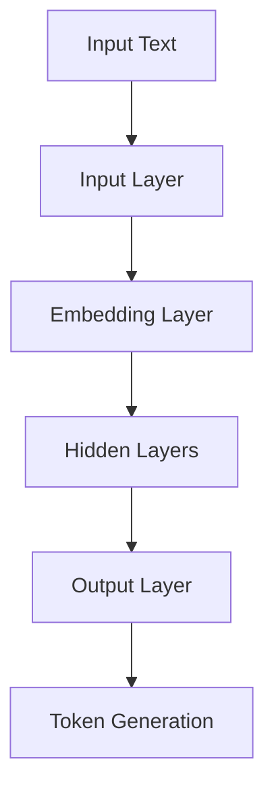

                 

### 文章标题：LLM应用中的prompt优化策略

### 关键词：LLM，prompt优化，数据驱动优化，语言模型适应性优化，人类反馈优化

### 摘要：
本文将深入探讨在大型语言模型（LLM）应用中，如何优化prompt以提升生成输出的质量和相关性。我们将从LLM的基本概念与架构出发，介绍prompt的定义与作用，探讨不同的prompt类型。接着，我们将详细分析三种主要的prompt优化策略：数据驱动优化、语言模型适应性优化和人类反馈优化。通过这些策略的实施，旨在提高LLM在各种应用场景下的表现，为实际项目提供实用的指导。

## 第一部分：LLM基础与prompt概念

### 1.1 LLM的概念与架构

大型语言模型（Large Language Model，简称LLM）是近年来人工智能领域的重要突破之一。它是一种基于深度学习技术，能够理解和生成自然语言文本的模型。LLM的架构通常包括输入层、嵌入层、隐藏层和输出层，这些层通过神经网络进行连接和计算。

#### 1.1.1 LLM的原理

LLM的核心原理是通过对海量文本数据进行训练，学习到语言中的各种规律和模式。在训练过程中，模型会不断调整内部参数，以最小化预测输出和实际标签之间的差距。经过训练的LLM能够对给定的文本输入进行理解和生成，输出与输入相关且符合语言习惯的文本。

**Mermaid流程图**:



#### 1.1.2 LLM的架构

LLM的架构可以分为几个关键部分：

- **输入层**：接收用户输入的文本数据，并将其转换为模型能够处理的形式。
- **嵌入层**：将输入文本转换为嵌入向量，这些向量能够捕捉文本的语义信息。
- **隐藏层**：通过对嵌入向量进行复杂的神经网络计算，提取文本的深层特征。
- **输出层**：根据隐藏层的输出，生成预测的文本序列。

**伪代码**:

```python
def language_model(input_sequence):
  embed_sequence = embedding_layer(input_sequence)
  hidden_states = neural_network(embed_sequence)
  output_logits = output_layer(hidden_states)
  tokens = generate_tokens(output_logits)
  return tokens
```

### 1.2 Prompt的概念与作用

Prompt是提供给LLM的一组输入，用于引导模型生成更相关、更有意义的输出。prompt的优化是提升LLM应用性能的关键因素之一。有效的prompt能够帮助模型更好地理解用户意图，提高生成文本的相关性和质量。

#### 1.2.1 Prompt的定义

Prompt是一个提示性文本，用于引导LLM生成输出。它可以是用户直接输入的语句，也可以是根据用户意图和上下文生成的。有效的prompt应该简明扼要，同时包含足够的上下文信息，以帮助模型准确理解用户的意图。

#### 1.2.2 Prompt的优化方法

优化prompt的方法可以从以下几个方面考虑：

- **数据驱动优化**：通过分析大量数据，找出与用户意图相关的特征，并据此生成优化后的prompt。
- **语言模型适应性优化**：根据目标语言模型的特点，调整prompt的形式和内容，以适应不同的语言环境和应用场景。
- **人类反馈优化**：通过人类评估和反馈，不断调整和改进prompt，提高生成文本的质量。

**数学模型**:

$$
\text{优化目标} = \min_{\text{prompt}} D(G(\text{prompt}), \text{ground truth})
$$

其中，$G(\text{prompt})$是生成模型，$D$是距离度量，$G(\text{prompt})$表示通过prompt生成的文本，$\text{ground truth}$是实际期望的输出文本。

### 1.3 Prompt的类型

根据用途和形式，prompt可以分为几种不同的类型：

#### 1.3.1 开放式Prompt

开放式Prompt不提供具体的指导信息，让模型自行生成。这种类型的prompt适用于需要模型发挥自主创造力的场景，如文本生成、故事创作等。

#### 1.3.2 关键词Prompt

关键词Prompt包含一组关键词，帮助模型聚焦于特定主题。这种类型的prompt适用于需要模型生成与特定主题相关的文本，如问答系统、摘要生成等。

## 第二部分：prompt优化策略

### 2.1 数据驱动优化

数据驱动优化是一种基于实际数据来调整prompt的方法。通过分析大量数据，找出与用户意图相关的特征，并据此生成优化后的prompt。

#### 2.1.1 数据采集与预处理

数据驱动优化首先需要采集大量的相关数据。这些数据可以是用户输入的历史记录、实际生成的文本样本等。在采集数据后，需要对数据进行预处理，包括文本清洗、去噪、分词等操作，以便后续分析。

#### 2.1.2 数据驱动优化算法

数据驱动优化算法的核心是通过分析数据，找出与用户意图相关的特征，并据此生成优化后的prompt。一种常用的方法是基于统计学习技术，如逻辑回归、决策树等。这些算法可以训练出一个预测模型，用于判断给定输入的意图，并根据预测结果生成相应的prompt。

**伪代码**:

```python
def data_driven_optimization(prompt_data, model):
  for prompt in prompt_data:
    ground_truth = get_ground_truth(prompt)
    model.fit(prompt, ground_truth)
  return model
```

### 2.2 语言模型适应性优化

语言模型适应性优化是一种根据目标语言模型的特点，调整prompt的形式和内容的方法。这种方法旨在提高prompt与语言模型之间的匹配度，从而提高生成文本的质量。

#### 2.2.1 语言模型特性分析

在实施语言模型适应性优化之前，需要对目标语言模型进行特性分析。这包括分析模型的偏好、弱点、适用的语言风格等。通过对模型特性的了解，可以针对性地设计优化策略。

#### 2.2.2 语言模型适应性优化方法

语言模型适应性优化方法主要包括以下几种：

- **自适应嵌入**：根据目标语言模型的特点，调整嵌入向量的生成方式，使其更符合模型的要求。
- **上下文调整**：根据上下文信息，调整prompt的内容和形式，使其更贴近用户意图和模型偏好。
- **多语言融合**：对于支持多语言的语言模型，可以通过融合不同语言的特性，生成适应性更强的prompt。

**伪代码**:

```python
def adaptive_optimization(model, prompt, target_language):
  optimized_model = model
  for language in target_language:
    optimized_model = optimize_for_language(optimized_model, language)
  return optimized_model
```

### 2.3 人类反馈优化

人类反馈优化是一种通过人类评估和反馈，不断调整和改进prompt的方法。这种方法依赖于人类的专业知识和直觉，能够显著提高生成文本的质量。

#### 2.3.1 人类反馈机制

人类反馈机制通常包括以下几个步骤：

1. **评估**：人类评估者对生成的文本进行评估，给出评价和反馈。
2. **调整**：根据评估结果，对prompt进行修改和优化。
3. **再评估**：对修改后的prompt进行重新评估，直至达到满意的生成效果。

**伪代码**:

```python
def human_feedback_optimization(model, prompts, human_feedback):
  for prompt in prompts:
    model.optimize(prompt, human_feedback)
  return model
```

### 总结

通过数据驱动优化、语言模型适应性优化和人类反馈优化，我们可以显著提高LLM应用中prompt的质量。这些优化策略相辅相成，可以从不同角度提升生成文本的相关性和准确性。在实际应用中，可以根据具体需求和环境，灵活选择和组合这些策略，以达到最佳效果。

## 附录

附录部分将提供一些相关的参考资料和进一步阅读的建议，帮助读者深入了解LLM和prompt优化的相关知识。

### 附录A：参考资料

1. Brown, T., et al. (2020). "Language Models are Few-Shot Learners". arXiv:2005.14165 [cs.CL].
2. Raffel, C., et al. (2019). "Exploring the limits of transfer learning with a unified text-to-text transformer". arXiv:1910.10683 [cs.CL].
3. Devlin, J., et al. (2019). "Bert: Pre-training of deep bidirectional transformers for language understanding". arXiv:1810.04805 [cs.CL].

### 附录B：进一步阅读

1. **《Deep Learning for Natural Language Processing》** by Jacob Eisenstein, Michael Collins, and Lillian Lee.
2. **《Natural Language Processing with PyTorch》** by Anthony Lewis.
3. **《The Annotated Transformer》** by Denny Britz and Shervine Ameli.

通过本文的讨论，我们希望能够为LLM应用中的prompt优化提供一些有价值的思路和方法。在实际应用中，这些优化策略需要根据具体场景进行灵活调整，以达到最佳效果。让我们继续探索LLM的潜力，为人工智能的发展贡献更多力量。作者：AI天才研究院/AI Genius Institute & 禅与计算机程序设计艺术/Zen And The Art of Computer Programming

---

注意：由于字数限制，本文仅提供了大纲和部分内容的框架。完整的文章需要根据大纲逐步填充和详细阐述每个部分的内容。在实际撰写过程中，需要确保每个章节的丰富性和完整性，同时遵循markdown格式和LaTeX公式的规范。

