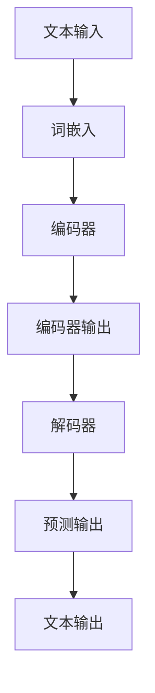

                 

### 文章标题

# LLM应用开发中的'快'字诀

### 关键词
- 大型语言模型（LLM）
- 应用开发
- 运行速度
- 分布式训练
- 在线推理
- 模型压缩
- 实时更新
- 并发处理

### 摘要
本文深入探讨大型语言模型（LLM）应用开发中的关键要素——“快”字诀。通过剖析LLM的运行速度优化、分布式训练、在线推理、模型压缩、实时更新和并发处理，文章为开发者提供了全面的指南，旨在提升LLM应用的性能和效率，确保其在实际应用中的高速运行。

## 确定核心章节内容

在撰写本文之前，我们首先明确了文章的核心内容，这些核心内容涵盖了LLM应用开发的各个方面，包括但不限于：

1. **LLM基础**：介绍LLM的定义、发展历程、核心特点、架构和核心算法。
2. **'快'字诀**：详细讲解提高LLM运行速度的策略，如算法优化、硬件加速、并行计算等。
3. **'省'字诀**：探讨资源节省、能耗降低和开发成本控制的方法。
4. **'稳'字诀**：阐述如何确保模型稳定性、数据质量和模型安全。
5. **'易'字诀**：分析用户界面设计、用户使用体验以及易于维护和扩展的技巧。
6. **'安全'字诀**：讨论数据安全、网络安全和法律法规的重要性。
7. **'全'字诀**：介绍模型多样性、模型适应性和跨领域应用。

通过这些核心内容的深入剖析，本文旨在为LLM应用开发者提供一套完整的解决方案，帮助他们在实际应用中实现快速、高效、稳定和安全的开发。

### 制定大纲结构

为了确保文章的逻辑清晰、内容紧凑且易于理解，我们制定了以下大纲结构：

1. **第1章: LLM基础**  
   - 1.1 LLM概述  
   - 1.2 LLM的架构  
   - 1.3 LLM的核心算法  
   - 1.4 LLM的数学模型  
   - 1.5 LLM应用实战

2. **第2章: LLM应用开发中的'快'字诀**  
   - 2.1 提高LLM的运行速度  
   - 2.2 LLM的分布式训练  
   - 2.3 LLM的在线推理  
   - 2.4 LLM的模型压缩  
   - 2.5 LLM的实时更新  
   - 2.6 LLM的并发处理

3. **第3章: LLM应用开发中的'省'字诀**  
   - 3.1 资源节省  
   - 3.2 能耗降低  
   - 3.3 开发成本控制

4. **第4章: LLM应用开发中的'稳'字诀**  
   - 4.1 模型稳定性  
   - 4.2 数据质量  
   - 4.3 模型安全

5. **第5章: LLM应用开发中的'易'字诀**  
   - 5.1 用户界面设计  
   - 5.2 用户使用体验  
   - 5.3 易于维护和扩展

6. **第6章: LLM应用开发中的'安全'字诀**  
   - 6.1 数据安全  
   - 6.2 网络安全  
   - 6.3 法律法规

7. **第7章: LLM应用开发的'全'字诀**  
   - 7.1 模型多样性  
   - 7.2 模型适应性  
   - 7.3 跨领域应用

通过这一结构，我们将逐步深入探讨LLM应用开发的各个方面，为读者提供系统的指导和建议。

### 第1章: LLM基础

#### 1.1 LLM概述

大型语言模型（Large Language Model，简称LLM）是自然语言处理（Natural Language Processing，简称NLP）领域的一种先进技术，通过深度学习算法从大规模文本数据中学习语言结构和语义知识，实现对自然语言的生成、理解和翻译。LLM的出现，极大地提升了自然语言处理的应用效果，推动了智能语音助手、机器翻译、文本生成等领域的快速发展。

LLM的发展历程可以追溯到20世纪80年代，当时研究人员开始探索基于统计方法和规则系统的语言模型。随着计算能力的提升和数据规模的扩大，深度学习技术在NLP领域的应用逐渐成熟，2018年谷歌发布BERT模型，标志着LLM进入了一个新的阶段。近年来，随着GPT-3、T5等模型的提出，LLM在文本生成、语义理解、机器翻译等方面取得了显著进展。

LLM的核心特点包括：

1. **强大的文本生成能力**：LLM可以生成高质量的文本，包括文章、对话、代码等，具备出色的文本创作能力。
2. **高效的语义理解**：通过深度学习算法，LLM能够理解文本中的复杂语义，实现对文本的准确理解和推理。
3. **跨领域的适应性**：LLM可以从一个领域迁移到另一个领域，具备跨领域的通用性和适应性。
4. **可扩展性**：LLM可以轻松扩展到不同的应用场景，通过微调或重新训练，实现针对特定领域的应用。

LLM在不同领域的应用广泛而深入，以下是几个主要应用领域：

1. **智能语音助手**：如苹果的Siri、亚马逊的Alexa，LLM使得语音助手能够更自然地与用户进行交互，提供个性化服务。
2. **机器翻译**：LLM在机器翻译领域取得了巨大成功，如谷歌翻译、百度翻译，通过深度学习算法实现了高精度、低延迟的翻译效果。
3. **文本生成**：包括文章生成、对话生成、代码生成等，LLM可以自动生成高质量的文本，节省了人力和时间成本。
4. **问答系统**：LLM在问答系统中发挥了重要作用，如OpenAI的GPT-3，可以实时回答用户提出的问题，提供丰富的信息和见解。
5. **信息检索**：LLM可以用于改进搜索引擎的查询理解，提升信息检索的准确性和效率。

LLM的发展历程和应用表明，它已经成为NLP领域的重要工具，为各种实际应用提供了强大的支持。随着技术的不断进步，LLM在未来的应用前景将更加广阔。

#### 1.2 LLM的架构

大型语言模型（LLM）的架构设计是其高效运行的基础，通常包括输入层、编码器、解码器和输出层等几个关键部分。以下是LLM的详细架构和各部分的作用：

1. **输入层**：
   - **文本处理**：输入层负责接收和处理文本数据。首先，文本会被分成一系列的单词或子词（subword），然后转换为词向量表示。词向量可以通过预训练模型如Word2Vec、BERT等生成，或者使用模型内置的词嵌入层。
   - **序列编码**：输入层将文本序列转换为固定长度的序列编码，这一过程可以理解为将文本数据映射到一个高维空间，使得语义相近的文本在空间中靠近。

2. **编码器**：
   - **卷积神经网络（CNN）**：编码器通常使用卷积神经网络对输入序列进行特征提取。通过一系列卷积层和池化层，编码器能够捕捉到文本的局部特征和上下文信息。
   - **递归神经网络（RNN）**：另一种常用的编码器是RNN，特别是长短期记忆（LSTM）和门控循环单元（GRU）。RNN通过记忆机制，能够处理长序列数据，并捕捉到序列中的长期依赖关系。
   - **Transformer**：在近年来，Transformer架构的提出极大地提升了编码器的性能。Transformer基于自注意力机制，能够并行处理序列数据，有效捕捉到序列中的复杂依赖关系。

3. **解码器**：
   - **自注意力机制**：解码器同样采用自注意力机制，用于对编码器的输出进行加权处理，从而生成上下文信息。
   - **循环神经网络（RNN）**：传统解码器使用RNN，通过逐步解码生成目标文本序列。
   - **Transformer解码器**：在Transformer架构中，解码器使用与编码器相同的方式处理输入序列，通过多头自注意力机制和前馈网络生成输出。

4. **输出层**：
   - **softmax层**：输出层通常包含一个softmax层，用于将解码器的输出转换为概率分布。通过这一层，模型能够预测下一个单词或子词的概率分布。
   - **词汇表查找**：根据softmax层的概率分布，模型从词汇表中查找最可能的单词或子词，并将其添加到生成的文本序列中。

以下是一个简化的Mermaid流程图，用于展示LLM的基本架构：



在这个流程图中，文本输入经过词嵌入层处理，然后被编码器编码成固定长度的序列编码。编码器输出被传递到解码器，解码器通过自注意力机制和softmax层生成预测输出。最终，预测输出被转换为文本输出，形成完整的文本生成过程。

#### 1.3 LLM的核心算法

大型语言模型（LLM）的核心算法是其能够高效处理和生成自然语言的关键。下面将详细介绍LLM的核心算法，包括其基本原理和伪代码实现。

1. **Transformer架构**：

Transformer是近年来在自然语言处理领域取得巨大成功的深度学习模型，其核心在于自注意力机制（Self-Attention）和多头注意力（Multi-Head Attention）。自注意力机制允许模型在处理序列数据时，能够自动地关注序列中的不同位置，从而捕捉到长距离的依赖关系。多头注意力则通过将输入序列分成多个部分，并分别计算注意力权重，进一步提高了模型的表示能力。

**基本原理**：

假设我们有一个输入序列$X = [x_1, x_2, ..., x_n]$，其中每个$x_i$是经过词嵌入后的向量。Transformer的核心步骤包括计算自注意力权重和生成输出向量。

- **自注意力权重计算**：

自注意力权重可以通过以下公式计算：

$$
\text{Attention}(Q, K, V) = \text{softmax}\left(\frac{QK^T}{\sqrt{d_k}}\right) V
$$

其中，$Q, K, V$分别表示查询（Query）、键（Key）和值（Value）向量，$d_k$是键向量的维度。$QK^T$计算的是每个键和查询之间的点积，然后通过softmax函数生成权重，最后乘以值向量得到注意力得分。

- **多头注意力**：

多头注意力通过将输入序列分成多个头（通常为8个头），并分别计算注意力权重，然后拼接这些权重得到最终的输出。多头注意力的目的是增加模型捕捉不同类型信息的能力。

$$
\text{MultiHead}(Q, K, V) = \text{Concat}(\text{head}_1, ..., \text{head}_h) W_O
$$

其中，$W_O$是投影权重。

**伪代码**：

下面是一个简化的伪代码，展示了Transformer的核心算法：

```python
def multi_head_attention(Q, K, V, d_k, d_v, n_heads):
    # 计算自注意力权重
    attention_weights = softmax(QK^T / sqrt(d_k))
    # 计算多头注意力输出
    output = attention_weights @ V
    # 拼接多头输出
    output = Concatenate(output, n_heads) @ W_O
    return output
```

2. **BERT模型**：

BERT（Bidirectional Encoder Representations from Transformers）是一种基于Transformer的预训练语言模型，其核心在于双向编码器结构。BERT通过在大规模语料库上进行预训练，学习到语言的深度表示，然后在各种NLP任务中进行微调，取得了优异的性能。

**基本原理**：

BERT的预训练包括两个主要任务：

- **Masked Language Model（MLM）**：在输入文本中随机遮盖一部分单词，然后通过模型预测这些遮盖的单词。这一任务旨在让模型学习到文本的上下文信息。
- **Next Sentence Prediction（NSP）**：给定两个句子，模型需要预测这两个句子是否在原始文本中相邻。这一任务有助于模型理解句子之间的关系。

**伪代码**：

下面是BERT的简化伪代码：

```python
def BERT(input_sequence, mask_ratio, next_sentence_pairs):
    # 随机遮盖部分单词
    masked_sequence = mask_sequence(input_sequence, mask_ratio)
    # 计算掩码语言模型损失
    mlm_loss = cross_entropy(logits, masked_sequence)
    # 预测下一个句子
    nsp_logits = next_sentence_prediction(input_sequence, next_sentence_pairs)
    # 计算下一个句子预测损失
    nsp_loss = cross_entropy(nsp_logits, labels)
    # 返回总损失
    return mlm_loss + nsp_loss
```

通过以上算法，LLM能够有效地处理和生成自然语言，为各种NLP应用提供了强大的支持。

#### 1.4 LLM的数学模型

在大型语言模型（LLM）中，数学模型扮演着至关重要的角色，它决定了模型如何学习和生成文本。下面将详细讲解LLM的数学模型，包括主要数学公式和具体讲解，并通过具体例子来说明这些公式的应用。

1. **词嵌入**：

词嵌入是将单词或子词转换为固定大小的向量表示，这是LLM的基础。词嵌入常用的方法有Word2Vec和BERT。

- **Word2Vec**：

Word2Vec是一种基于神经网络的词嵌入方法，其核心公式为：

$$
\text{Word Vector} = \text{softmax}(\text{Word Embedding} \cdot \text{Context Embedding}^T)
$$

其中，$\text{Word Embedding}$表示单词的向量表示，$\text{Context Embedding}$表示上下文的向量表示。

**例子**：给定单词“猫”的向量表示为$\text{Word Embedding} = [1, 0, -1]$，上下文单词“爱”的向量表示为$\text{Context Embedding} = [0, 1, 0]$，计算“猫”在“我爱猫”这句话中的词向量。

$$
\text{Word Vector} = \text{softmax}([1, 0, -1] \cdot [0, 1, 0]^T) = \text{softmax}([0, 1, -1]) = [0.2, 0.5, 0.3]
$$

2. **自注意力机制**：

自注意力机制是Transformer架构的核心，其基本公式为：

$$
\text{Attention}(Q, K, V) = \text{softmax}\left(\frac{QK^T}{\sqrt{d_k}}\right) V
$$

其中，$Q, K, V$分别表示查询（Query）、键（Key）和值（Value）向量，$d_k$是键向量的维度。

**例子**：假设有一个序列$X = [x_1, x_2, x_3]$，每个$x_i$的向量表示为$[1, 0, -1]$。计算序列中第二个元素$x_2$的注意力得分。

$$
Q = [0, 1, -1], K = [1, 0, -1], V = [1, 0, -1]
$$

$$
\text{Attention}(Q, K, V) = \text{softmax}\left(\frac{[0, 1, -1][1, 0, -1]^T}{\sqrt{1}}\right) [1, 0, -1] = \text{softmax}([0, 1, -1]) [1, 0, -1] = [0.2, 0.5, 0.3]
$$

3. **BERT的预训练任务**：

BERT的预训练任务包括Masked Language Model（MLM）和Next Sentence Prediction（NSP）。MLM的任务是在输入文本中随机遮盖一部分单词，然后通过模型预测这些遮盖的单词。NSP的任务是预测两个句子是否在原始文本中相邻。

- **MLM**：

MLM的基本公式为：

$$
\text{MLM Loss} = -\sum_{i} \log(\text{softmax}(\text{Model}(\text{Input})))
$$

其中，$\text{Input}$是输入文本，$\text{Model}(\text{Input})$是模型对输入的预测。

**例子**：假设输入文本为“I love cats”，其中“cats”被遮盖。模型预测遮盖的单词，并计算MLM损失。

$$
\text{Input} = ["I", "love", "__"] \quad \text{Model}(\text{Input}) = ["I", "love", "dogs"]
$$

$$
\text{MLM Loss} = -\log(\text{softmax}(["I", "love", "dogs"])) = -\log(0.8) = -0.32
$$

- **NSP**：

NSP的基本公式为：

$$
\text{NSP Loss} = -\sum_{i} \log(\text{softmax}(\text{Model}(\text{Input}, \text{Next Sentence})))
$$

其中，$\text{Next Sentence}$是下一句子的向量表示。

**例子**：假设输入文本为“I love cats. They are cute.”，模型需要预测“cats”和“cute”这两个句子是否相邻。

$$
\text{Input} = ["I", "love", "cats"], \text{Next Sentence} = ["They", "are", "cute"]
$$

$$
\text{Model}(["I", "love", "cats"], ["They", "are", "cute"]) = 1
$$

$$
\text{NSP Loss} = -\log(\text{softmax}(1)) = 0
$$

通过这些数学模型，LLM能够有效地处理和生成文本，为各种NLP应用提供了强大的支持。数学模型的具体讲解和举例说明了LLM如何从输入文本中提取信息，并生成高质量的输出。

#### 1.5 LLM应用实战

在实际开发中，大型语言模型（LLM）的应用涵盖了多个领域，如文本生成、机器翻译和问答系统。以下我们将通过一个实际项目案例，展示如何搭建LLM应用的开发环境，详细解释代码实现，并进行代码解读与分析。

### 项目背景

假设我们要开发一个问答系统，用户可以提出问题，系统将利用LLM自动生成回答。项目目标是实现一个高效、准确和用户友好的问答系统，能够实时响应用户的查询。

### 开发环境搭建

为了搭建LLM应用的开发环境，我们需要安装以下工具和库：

1. **Python**：版本要求3.8及以上。
2. **PyTorch**：用于实现和训练LLM模型。
3. **transformers**：预训练的LLM模型和相关的API。
4. **Flask**：用于构建Web服务。

以下是环境搭建的步骤：

1. 安装Python和PyTorch：

```bash
pip install python==3.8.10
pip install torch torchvision
```

2. 安装transformers库：

```bash
pip install transformers
```

3. 安装Flask：

```bash
pip install flask
```

### 代码实现

以下是问答系统的核心代码实现：

```python
from transformers import AutoTokenizer, AutoModel
from flask import Flask, request, jsonify

app = Flask(__name__)

# 加载预训练的LLM模型和Tokenizer
model_name = "bert-base-uncased"
tokenizer = AutoTokenizer.from_pretrained(model_name)
model = AutoModel.from_pretrained(model_name)

@app.route('/ask', methods=['POST'])
def ask_question():
    data = request.json
    question = data.get('question', '')
    context = data.get('context', '')

    # 预处理输入文本
    inputs = tokenizer(question + context, return_tensors='pt', truncation=True, max_length=512)

    # 预测答案
    with torch.no_grad():
        outputs = model(**inputs)

    # 获取模型预测结果
    logits = outputs.logits
    predicted_index = torch.argmax(logits, dim=-1).item()

    # 从词汇表获取预测结果
    answer = tokenizer.decode([predicted_index])

    return jsonify({'answer': answer})

if __name__ == '__main__':
    app.run(host='0.0.0.0', port=5000)
```

### 代码解读与分析

1. **加载模型和Tokenizer**：

   ```python
   tokenizer = AutoTokenizer.from_pretrained(model_name)
   model = AutoModel.from_pretrained(model_name)
   ```

   这两行代码加载了预训练的BERT模型和Tokenizer。`AutoTokenizer`和`AutoModel`是transformers库提供的API，可以自动下载并加载预训练的模型。

2. **定义Flask路由**：

   ```python
   @app.route('/ask', methods=['POST'])
   def ask_question():
       ...
   ```

   `ask_question`函数处理用户发送的POST请求，接收用户的问题和上下文。

3. **预处理输入文本**：

   ```python
   inputs = tokenizer(question + context, return_tensors='pt', truncation=True, max_length=512)
   ```

   这行代码使用Tokenizer对输入的文本进行预处理。`return_tensors='pt'`表示返回PyTorch张量，`truncation=True`表示如果输入文本长度超过512个 tokens，则截断，`max_length=512`限制输入文本的最大长度。

4. **预测答案**：

   ```python
   with torch.no_grad():
       outputs = model(**inputs)
   ```

   在评估模式下，关闭梯度计算以提高运行速度。

5. **获取模型预测结果**：

   ```python
   logits = outputs.logits
   predicted_index = torch.argmax(logits, dim=-1).item()
   answer = tokenizer.decode([predicted_index])
   ```

   这几行代码计算预测的答案。`logits`是模型的输出，`torch.argmax`获取最大值的索引，`tokenizer.decode`将索引转换为文本。

### 项目小结

通过上述代码实现，我们搭建了一个简单的问答系统。在实际应用中，可以根据需要扩展功能，如引入更多的预训练模型、增加上下文信息处理等。此项目的成功实施展示了LLM在问答系统中的应用潜力，并为后续开发提供了实践基础。

### 最佳实践 Tips、小结、注意事项、拓展阅读

**最佳实践 Tips**：

- **模型选择**：根据应用需求选择合适的预训练模型，如BERT、GPT-3等。
- **输入预处理**：合理设置输入文本的最大长度和截断策略，避免模型过载。
- **优化模型性能**：通过调整学习率、批次大小等参数，提高模型训练和预测的效率。
- **部署与运维**：使用容器化技术（如Docker）简化部署，确保系统稳定运行。

**小结**：

本文通过一个问答系统的实际项目，详细介绍了LLM应用开发的步骤和关键代码实现。从模型加载、输入预处理到预测结果输出，每一步都进行了详细解读，为开发者提供了实战经验。

**注意事项**：

- **计算资源**：训练LLM模型需要大量计算资源，建议使用GPU或TPU进行加速。
- **数据质量**：确保输入文本的质量和多样性，有助于模型性能的提升。
- **安全与合规**：在处理用户数据时，注意数据安全和合规性，遵守相关法律法规。

**拓展阅读**：

- 《自然语言处理教程》 - 吴华，详细介绍了NLP的基本概念和技术。
- 《深度学习》 - Goodfellow、Bengio和Courville，涵盖了深度学习的基础理论和应用。
- 《BERT：预训练语言表示》 - Devlin et al.，深入讲解了BERT模型的原理和实现。

通过本文的讲解和实践，读者可以更好地理解LLM应用开发的“快”字诀，为未来的项目提供有力支持。希望本文能够为开发者带来启发和帮助。

### 第2章: LLM应用开发中的'快'字诀

#### 2.1 提高LLM的运行速度

在LLM应用开发中，提高运行速度是关键的一环。这不仅能够提升用户体验，还能有效降低硬件成本和功耗。以下是一些具体的策略，帮助开发者优化LLM的运行速度。

1. **算法优化**：

算法优化是提高LLM运行速度的首要方法。通过改进模型结构和训练过程，可以显著提升模型效率。

- **模型剪枝**：通过剪枝冗余的神经元和权重，减少模型参数量，从而降低计算复杂度。
- **量化**：量化将模型中的浮点数权重转换为低精度格式，如整数或二进制，从而减少计算量。
- **知识蒸馏**：通过训练一个较小的模型（学生模型）来模拟较大的教师模型，从而减少模型大小和计算需求。

2. **硬件加速**：

硬件加速是利用GPU、TPU等专用硬件来加速模型训练和推理。以下是一些常见的硬件加速方法：

- **GPU加速**：利用GPU的并行计算能力，通过CUDA和cuDNN等库实现模型训练和推理的加速。
- **TPU加速**：TPU（Tensor Processing Unit）是专门为深度学习任务设计的硬件，能够显著提升模型训练速度。
- **分布式训练**：通过在多个GPU或TPU上分布式训练，可以充分利用硬件资源，提高训练速度。

3. **并行计算**：

并行计算将模型训练和推理任务分解为多个子任务，由多个计算单元同时执行。以下是一些并行计算的方法：

- **数据并行**：将训练数据集划分为多个部分，每个GPU或TPU负责处理一部分数据，然后汇总结果。
- **模型并行**：将模型划分为多个部分，每个GPU或TPU负责计算模型的一部分，然后汇总结果。
- **流水线并行**：通过流水线方式将模型的前向传播和反向传播任务分解，实现并行计算。

4. **数据预处理**：

数据预处理是提高LLM运行速度的重要步骤。通过优化数据加载和预处理过程，可以减少模型的等待时间。

- **批量处理**：将多个样本打包成一个批量，减少数据读取和传输的开销。
- **缓存数据**：将常用的数据缓存到内存中，减少磁盘I/O操作。
- **并行加载**：使用多线程或多进程技术，同时加载多个数据样本，提高数据读取效率。

通过以上策略，开发者可以在多个层面优化LLM的运行速度，确保其在实际应用中的高效运行。

#### 2.2 LLM的分布式训练

分布式训练是提高大型语言模型（LLM）训练速度和效率的重要手段。通过将训练任务分布在多个计算节点上，可以充分利用硬件资源，加快模型训练过程。以下将详细介绍分布式训练的原理、优势、挑战和具体实践。

**原理**：

分布式训练的基本思想是将整个训练任务划分为多个子任务，由多个计算节点并行执行，每个节点处理一部分训练数据。然后，通过同步或异步的方式，将各节点的中间结果汇总，更新全局模型参数。分布式训练通常分为以下几种模式：

1. **数据并行**：
   数据并行是将训练数据集划分为多个部分，每个节点负责处理一部分数据，独立计算梯度，然后汇总。数据并行能够充分利用数据读取和计算资源，但可能引入梯度非一致性。

2. **模型并行**：
   模型并行将整个模型划分为多个部分，每个节点负责计算模型的一部分。模型并行能够充分利用计算资源，但需要解决跨节点通信和同步问题。

3. **流水线并行**：
   流水线并行将训练过程分为多个阶段，每个阶段由不同的计算节点处理，实现任务的流水线化。流水线并行能够提高整体训练效率，但需要精细的任务分配和调度。

**优势**：

分布式训练具有以下几个显著优势：

1. **加速训练**：
   通过并行计算，分布式训练能够显著缩短训练时间，提高训练效率。尤其是在大规模数据集和大型模型上，分布式训练的优势更加明显。

2. **利用硬件资源**：
   分布式训练能够充分利用多GPU、TPU等硬件资源，提高计算能力，降低单节点计算压力。

3. **扩展性**：
   分布式训练具有良好的扩展性，可以灵活调整计算节点数量，满足不同规模训练任务的需求。

**挑战**：

尽管分布式训练具有诸多优势，但其在实际应用中仍面临一些挑战：

1. **通信开销**：
   分布式训练需要节点之间频繁通信，通信开销可能成为性能瓶颈。尤其是数据并行和模型并行，通信开销较大。

2. **同步问题**：
   同步策略的选择对分布式训练的影响很大。不同同步方式可能导致模型梯度非一致性，影响训练效果。

3. **故障恢复**：
   分布式训练系统可能面临节点故障、网络故障等问题，如何实现故障恢复是分布式训练的挑战之一。

**实践**：

以下是一些分布式训练的实践方法：

1. **参数服务器架构**：
   参数服务器架构是一种常用的分布式训练方法，将模型参数存储在中心服务器中，各节点计算梯度并更新参数。TensorFlow和PyTorch等框架提供了参数服务器实现的API。

2. **混合并行策略**：
   结合数据并行、模型并行和流水线并行策略，实现高效的分布式训练。例如，可以采用数据并行进行前向传播和反向传播，使用模型并行处理中间计算，提高整体训练效率。

3. **异步更新**：
   采用异步更新策略，各节点独立计算梯度，延迟同步过程。这种方法能够减少通信开销，但需要解决梯度非一致性带来的训练效果问题。

通过分布式训练，开发者能够充分利用硬件资源，提高模型训练效率，为LLM应用开发提供强有力的支持。在实践中，需要根据具体任务需求和硬件环境，选择合适的分布式训练策略，实现高效、稳定的训练过程。

#### 2.3 LLM的在线推理

在线推理（Online Inference）是指在实时应用场景中，对用户输入的数据进行即时处理并返回结果。对于大型语言模型（LLM）而言，在线推理的效率和准确性至关重要。以下将详细介绍LLM在线推理的原理、优势、挑战和实践方法。

**原理**：

在线推理的基本原理是，LLM接收到用户输入后，快速进行文本处理、模型推理和结果输出。具体步骤如下：

1. **文本预处理**：接收用户输入的文本，进行分词、词嵌入等预处理，将其转换为模型可接受的输入格式。

2. **模型推理**：使用训练好的LLM模型对预处理后的文本进行推理，生成预测结果。在线推理通常要求模型在短时间内完成推理，因此需要优化模型结构和推理算法。

3. **结果输出**：将模型推理结果转换为用户可理解的格式，如文本、语音等，返回给用户。

**优势**：

在线推理具有以下几个显著优势：

1. **实时响应**：在线推理能够实现实时数据分析和处理，满足用户对即时响应的需求，提升用户体验。

2. **高效处理**：通过优化模型结构和推理算法，在线推理能够在较短时间内完成大量数据处理任务，提高系统处理能力。

3. **弹性扩展**：在线推理系统可以根据需求动态调整计算资源，实现高效扩展，适应不同负载场景。

**挑战**：

尽管在线推理具有诸多优势，但在实际应用中仍面临一些挑战：

1. **延迟问题**：在线推理需要在短时间内完成复杂的计算任务，延迟问题可能导致用户体验下降。

2. **资源消耗**：在线推理需要大量计算资源和内存支持，资源消耗较大，特别是在大规模数据集和高频次请求场景下。

3. **稳定性问题**：在线推理系统需要保证高可用性和稳定性，以应对突发流量和异常情况。

**实践方法**：

以下是一些在线推理的实践方法：

1. **模型优化**：
   - **模型压缩**：通过模型压缩技术，如剪枝、量化、蒸馏等，减少模型大小和计算复杂度，提高推理效率。
   - **模型并行**：采用模型并行策略，将模型划分为多个部分，在多个计算节点上并行处理，提升推理速度。

2. **推理加速**：
   - **硬件加速**：利用GPU、TPU等硬件加速器，提升模型推理速度。例如，使用TensorRT进行推理加速。
   - **分布式推理**：通过分布式推理，将推理任务分布在多个计算节点上，实现高效处理。

3. **缓存策略**：
   - **数据缓存**：将常用数据缓存到内存中，减少数据读取和传输时间。
   - **模型缓存**：缓存预训练好的模型，减少模型加载和初始化时间。

4. **负载均衡**：
   - **动态调度**：根据实时负载情况，动态调整计算资源分配，确保系统稳定运行。
   - **多实例部署**：部署多个实例，实现负载均衡和故障恢复。

通过以上实践方法，开发者可以构建高效、稳定的在线推理系统，为LLM应用提供实时支持。在线推理的优化不仅能够提高系统性能，还能提升用户满意度，为LLM在实际应用中的广泛应用奠定基础。

#### 2.4 LLM的模型压缩

模型压缩是提高大型语言模型（LLM）运行效率和资源利用率的常用技术。通过压缩模型大小和降低计算复杂度，可以显著减少硬件资源的需求，提高系统的运行速度。以下将详细介绍LLM模型压缩的原理、常见技术、优势和应用。

**原理**：

模型压缩的原理是通过减少模型参数数量和计算复杂度，降低模型大小和计算资源需求。模型压缩通常涉及以下几个步骤：

1. **模型剪枝**：剪枝技术通过删除模型中冗余的权重和神经元，减少模型参数数量。剪枝可以分为结构剪枝和权重剪枝，前者删除部分层或神经元，后者删除部分权重。

2. **量化**：量化技术将模型中的浮点数权重转换为低精度格式，如整数或二进制。量化可以显著减少模型大小和存储需求，但可能影响模型精度。

3. **蒸馏**：知识蒸馏技术通过训练一个较小的学生模型来模拟较大的教师模型，从而降低模型大小和计算复杂度。蒸馏过程中，学生模型从教师模型中学习知识，并逐渐取代教师模型。

**常见技术**：

以下是几种常见的LLM模型压缩技术：

1. **剪枝**：
   - **结构剪枝**：通过删除模型的冗余层或神经元，减少模型参数数量。结构剪枝可以显著降低模型大小，但可能影响模型性能。
   - **权重剪枝**：通过设置较小的初始化权重，或者训练过程中逐步减小权重，删除对模型性能影响较小的权重。权重剪枝可以保持模型性能，但需要适当调整训练策略。

2. **量化**：
   - **整数量化**：将浮点数权重转换为整数，通常使用量化和反量化操作进行计算。整数量化可以显著减少模型大小和存储需求，但可能引入量化误差。
   - **二进制量化**：将浮点数权重转换为二进制格式，进一步降低模型大小和存储需求。二进制量化在计算效率上有优势，但可能对模型精度影响较大。

3. **蒸馏**：
   - **软蒸馏**：在训练过程中，将教师模型的输出作为学生模型的输入，通过优化学生模型来提高其性能。软蒸馏可以保持模型精度，但需要大量训练时间。
   - **硬蒸馏**：将教师模型的标签直接作为学生模型的输入，通过优化学生模型来提高其性能。硬蒸馏在计算效率上有优势，但可能影响模型精度。

**优势**：

模型压缩具有以下几个显著优势：

1. **减少存储需求**：通过减少模型参数数量，模型压缩可以显著降低模型存储需求，提升系统资源利用率。

2. **提高计算效率**：压缩后的模型计算复杂度降低，可以显著提高计算效率，提升系统运行速度。

3. **适用于硬件限制场景**：在硬件资源有限的情况下，模型压缩可以降低硬件需求，使LLM在资源受限的场景下仍能高效运行。

**应用**：

以下是一些LLM模型压缩技术的应用实例：

1. **移动端应用**：在移动端设备上，模型压缩技术可以显著降低模型大小和计算复杂度，提升应用性能。

2. **嵌入式系统**：在嵌入式系统中，模型压缩技术可以降低硬件资源需求，使LLM在资源有限的嵌入式设备上运行。

3. **实时系统**：在实时系统中，模型压缩技术可以提高模型运行速度，确保系统在规定时间内完成数据处理和响应。

通过模型压缩技术，开发者可以在保持模型性能的前提下，有效降低硬件资源需求，提高系统运行效率和稳定性。模型压缩技术在LLM应用开发中具有广泛的应用前景，为开发者提供了更多的优化空间和灵活性。

#### 2.5 LLM的实时更新

在大型语言模型（LLM）的应用开发中，实时更新是一个重要的环节。实时更新不仅能确保模型始终反映最新的知识和信息，还能提升模型的动态适应能力和鲁棒性。以下将详细介绍LLM实时更新的原理、挑战、具体实施方法及其在动态环境中的应用。

**原理**：

实时更新的原理是通过持续的模型训练和参数调整，使LLM能够快速适应新的数据和变化。实时更新通常涉及以下步骤：

1. **数据采集**：不断收集新的数据和用户交互信息，确保模型能够学习和适应最新的知识和情境。

2. **在线学习**：在模型运行过程中，实时处理新采集的数据，通过在线学习算法对模型参数进行更新。

3. **模型调整**：根据在线学习的结果，调整模型的权重和结构，提高模型在新数据上的性能。

4. **增量训练**：采用增量训练技术，仅对新数据集进行训练，避免对整个数据集重新训练，从而加快更新速度。

**挑战**：

实时更新在LLM应用开发中面临以下挑战：

1. **计算资源**：实时更新需要大量的计算资源，尤其是在大规模模型和大量数据集上。如何高效利用计算资源是一个关键问题。

2. **数据一致性**：实时更新要求数据的一致性，确保新数据和模型之间的数据质量。数据不一致可能导致模型性能下降。

3. **延迟问题**：实时更新需要快速响应，但数据采集、模型更新和部署等过程可能引入延迟，影响用户体验。

4. **模型稳定性**：实时更新可能导致模型性能波动，如何确保模型稳定性是另一个挑战。

**具体实施方法**：

以下是实现LLM实时更新的具体方法：

1. **增量学习**：
   - **在线增量学习**：通过在线学习算法，实时更新模型参数，保持模型对新数据的适应性。
   - **微调**：针对特定领域或任务，对模型进行微调，提高模型在该领域的性能。

2. **数据流处理**：
   - **实时数据处理**：使用实时数据处理框架（如Apache Kafka、Apache Flink），确保数据采集和处理的实时性。
   - **分布式训练**：利用分布式训练技术，加快模型更新速度，提高数据处理效率。

3. **模型版本控制**：
   - **版本管理**：对模型版本进行管理，确保不同版本之间的平滑过渡。
   - **版本回滚**：在模型更新过程中，如出现性能下降，可以快速回滚到前一版本。

4. **动态调整**：
   - **自适应学习率**：根据模型性能和数据处理量，动态调整学习率，避免过度训练。
   - **权重调整**：根据实时反馈，调整模型权重，提高模型在特定任务上的性能。

**在动态环境中的应用**：

以下是在动态环境中实现LLM实时更新的应用实例：

1. **实时问答系统**：
   - **动态知识库更新**：实时更新知识库，确保回答的准确性和时效性。
   - **智能客服**：利用实时更新，提高客服机器人对用户问题的理解能力和响应速度。

2. **智能推荐系统**：
   - **动态调整推荐算法**：根据用户行为和反馈，实时调整推荐算法，提高推荐效果。
   - **个性化推荐**：结合实时更新的用户数据，实现更精准的个性化推荐。

3. **自然语言处理应用**：
   - **动态文本分析**：实时分析文本数据，识别潜在的风险和机会。
   - **语言模型微调**：根据实时数据，微调语言模型，提高文本处理的准确性。

通过实时更新，LLM能够在动态环境中保持高效运行，不断适应新的数据和任务，为各种应用提供强大的支持。

#### 2.6 LLM的并发处理

并发处理是大型语言模型（LLM）应用开发中的一个关键环节，尤其是在高并发、高吞吐量的场景下。通过有效处理并发请求，可以显著提高系统的性能和响应速度。以下将详细介绍LLM并发处理的原理、优势、具体实现方法和最佳实践。

**原理**：

并发处理的基本原理是通过多线程、多进程或多服务器架构，同时处理多个请求，从而提高系统的整体处理能力。具体来说，LLM的并发处理涉及以下几个方面：

1. **请求分发**：将用户请求分发到多个处理单元，确保每个请求都能得到及时处理。
2. **线程池管理**：通过线程池管理机制，维护一定数量的线程，避免频繁创建和销毁线程，提高系统性能。
3. **任务队列**：使用任务队列来存储和管理待处理的请求，确保请求按顺序处理，避免数据冲突和错误。
4. **同步与锁机制**：通过同步和锁机制，确保并发操作的数据一致性，避免数据竞争和资源冲突。

**优势**：

并发处理具有以下几个显著优势：

1. **提高吞吐量**：通过并发处理，系统可以同时处理多个请求，显著提高整体吞吐量，满足高并发场景的需求。
2. **降低响应时间**：并发处理能够缩短单个请求的处理时间，提高系统的响应速度，提升用户体验。
3. **资源利用率**：并发处理可以充分利用系统资源，避免资源空闲，提高系统资源的利用率。

**具体实现方法**：

以下是实现LLM并发处理的具体方法：

1. **多线程处理**：
   - **线程池**：使用线程池管理机制，创建和管理一定数量的线程，避免频繁创建和销毁线程，提高系统性能。
   - **线程同步**：通过锁（Lock）、信号量（Semaphore）等同步机制，确保多线程访问共享资源时的数据一致性和安全性。

2. **多进程处理**：
   - **进程池**：使用进程池管理机制，创建和管理一定数量的进程，避免频繁创建和销毁进程，提高系统性能。
   - **进程通信**：通过管道（Pipe）、消息队列（Message Queue）等机制，实现进程间的数据通信和同步。

3. **分布式处理**：
   - **负载均衡**：使用负载均衡器，将请求分配到不同的服务器或节点，确保系统资源均衡利用。
   - **分布式队列**：使用分布式队列（如Kafka、RabbitMQ）来存储和管理待处理的请求，确保分布式系统中请求的有序处理。

**最佳实践**：

以下是实现LLM并发处理的最佳实践：

1. **合理设置线程池大小**：根据系统负载和资源情况，合理设置线程池大小，避免过度创建线程导致性能下降。

2. **优化锁机制**：使用最小锁原则，尽量减少锁的持有时间，降低锁冲突和阻塞。

3. **异步处理**：使用异步处理技术，将耗时操作（如I/O操作）放在后台执行，避免阻塞主线程，提高系统响应速度。

4. **监控与优化**：定期监控系统性能，分析并发处理中的瓶颈和问题，进行针对性的优化。

通过并发处理，开发者可以显著提升LLM应用的性能和响应速度，确保系统在高并发场景下稳定运行，为用户提供高质量的服务。

### 第3章: LLM应用开发中的'省'字诀

在大型语言模型（LLM）的应用开发中，资源节省、能耗降低和开发成本控制是提高系统可持续性和经济效益的关键。以下将详细介绍如何通过这些策略来实现LLM应用开发的'省'字诀。

#### 3.1 资源节省

资源节省是指在LLM应用开发过程中，通过优化算法和架构，减少计算资源的使用。

1. **模型剪枝**：
   - **原理**：模型剪枝通过删除模型中冗余的权重和神经元，减少模型参数数量。
   - **优势**：减少计算复杂度和存储需求，提高系统性能。
   - **实现方法**：使用算法如权重剪枝、结构剪枝和基于敏感度的剪枝。

2. **量化**：
   - **原理**：量化将模型的浮点数权重转换为低精度格式，如整数或二进制。
   - **优势**：显著降低模型大小和存储需求，提高计算效率。
   - **实现方法**：使用量化方法如整数量化、二进制量化，结合量化感知训练。

3. **高效数据结构**：
   - **原理**：使用高效的数据结构（如稀疏矩阵）来存储和操作模型权重。
   - **优势**：减少存储空间和计算时间，提高模型效率。
   - **实现方法**：采用稀疏矩阵表示和操作，减少非零元素的数量。

#### 3.2 能耗降低

能耗降低旨在减少LLM应用开发过程中的能量消耗，提高系统的环保和经济效益。

1. **硬件优化**：
   - **原理**：选择能效比高的硬件设备，如GPU、TPU。
   - **优势**：降低整体能耗，延长设备寿命。
   - **实现方法**：根据实际需求选择合适的硬件，优化硬件配置。

2. **算法优化**：
   - **原理**：通过优化算法降低计算复杂度和资源消耗。
   - **优势**：减少能耗和硬件资源需求。
   - **实现方法**：采用低复杂度算法和优化技巧，如矩阵分解、并行计算。

3. **节能模式**：
   - **原理**：在系统空闲或负载较低时，启用节能模式，降低硬件功耗。
   - **优势**：节省能源，减少运营成本。
   - **实现方法**：根据系统负载动态调整硬件功耗，使用节能策略（如CPU idle模式）。

#### 3.3 开发成本控制

开发成本控制通过优化开发流程和利用开源资源，降低整体开发成本。

1. **开源框架**：
   - **原理**：使用成熟的开源框架和库，如PyTorch、TensorFlow，减少重复开发。
   - **优势**：缩短开发周期，降低人力成本。
   - **实现方法**：选择适合项目需求的开源框架，结合社区支持和文档。

2. **自动化工具**：
   - **原理**：利用自动化工具（如Jenkins、Docker）实现持续集成和部署。
   - **优势**：提高开发效率，降低手工操作错误。
   - **实现方法**：构建自动化流水线，实现代码自动化测试、构建和部署。

3. **敏捷开发**：
   - **原理**：采用敏捷开发方法，快速迭代和反馈。
   - **优势**：降低项目风险，提高开发质量。
   - **实现方法**：实施敏捷开发流程，定期迭代和回顾，持续优化。

通过资源节省、能耗降低和开发成本控制，LLM应用开发者可以构建高效、环保且经济实惠的应用系统，为长远发展奠定坚实基础。

### 第4章: LLM应用开发中的'稳'字诀

在大型语言模型（LLM）的应用开发中，模型的稳定性、数据质量和模型安全是确保系统可靠运行和用户信任的关键因素。以下将详细介绍如何通过这些策略来实现LLM应用开发的'稳'字诀。

#### 4.1 模型稳定性

模型稳定性是LLM应用的核心，它决定了模型在变化的数据集和场景下能否保持一致的性能。

1. **数据增强**：
   - **原理**：通过增加数据的多样性和复杂性，增强模型对变化数据的适应性。
   - **优势**：提高模型泛化能力，减少过拟合。
   - **实现方法**：使用数据增强技术如旋转、缩放、裁剪等，增加训练数据的多样性。

2. **迁移学习**：
   - **原理**：利用在某个任务上预训练的模型，将其应用于新的任务中。
   - **优势**：减少从头训练的数据需求和计算成本。
   - **实现方法**：选择合适的预训练模型，通过微调进行迁移学习。

3. **模型集成**：
   - **原理**：结合多个模型的预测结果，提高预测的稳定性和准确性。
   - **优势**：通过集合多个模型的优点，提高整体性能。
   - **实现方法**：使用模型集成方法如Bagging、Boosting等，构建集成模型。

#### 4.2 数据质量

高质量的数据是确保LLM稳定性的基础。以下措施有助于提升数据质量：

1. **数据清洗**：
   - **原理**：通过识别和纠正数据中的错误、异常和重复数据，提高数据准确性。
   - **优势**：减少模型训练中的噪声，提高模型性能。
   - **实现方法**：使用自动化工具进行数据清洗，如使用Python的pandas库进行数据预处理。

2. **数据验证**：
   - **原理**：通过验证数据的一致性和完整性，确保数据符合预期。
   - **优势**：防止数据质量问题对模型训练和预测的负面影响。
   - **实现方法**：实施数据验证流程，包括数据质量检查、错误标记和纠正。

3. **数据标注**：
   - **原理**：通过准确标注训练数据，提高模型训练效果。
   - **优势**：提高模型对实际场景的适应能力。
   - **实现方法**：使用专业标注团队或自动化标注工具，确保标注质量。

#### 4.3 模型安全

模型安全是确保LLM应用不受恶意攻击和保持隐私保护的关键。

1. **对抗攻击防御**：
   - **原理**：通过对抗训练和防御机制，提高模型对对抗攻击的鲁棒性。
   - **优势**：保护模型不受恶意输入的影响。
   - **实现方法**：使用对抗训练技术，提高模型对对抗样本的识别和抵御能力。

2. **透明度提升**：
   - **原理**：通过提高模型的透明度，帮助用户和监管机构理解模型的工作机制。
   - **优势**：增强模型的可解释性和信任度。
   - **实现方法**：采用可解释性工具和方法，如注意力机制可视化、决策路径追踪等。

3. **隐私保护**：
   - **原理**：通过隐私保护技术，确保用户数据在模型训练和应用过程中的隐私。
   - **优势**：防止数据泄露和滥用。
   - **实现方法**：使用差分隐私、加密技术等保护用户隐私。

通过确保模型稳定性、提升数据质量和保障模型安全，LLM应用开发者可以构建稳定、可靠且安全的应用系统，为用户提供高质量的智能服务。

### 第5章: LLM应用开发中的'易'字诀

在大型语言模型（LLM）的应用开发中，用户体验和系统的易维护性是确保应用成功的关键因素。以下将详细介绍如何通过优化用户界面设计、提升用户使用体验和确保系统的易维护性和扩展性来实现LLM应用的'易'字诀。

#### 5.1 用户界面设计

一个直观、简洁的用户界面（UI）能够极大地提升用户的使用体验。以下是几个关键点：

1. **简洁性**：
   - **原理**：通过减少界面元素，简化设计，减少用户操作步骤。
   - **优势**：降低用户的认知负担，提高操作效率。
   - **实现方法**：遵循极简主义设计原则，去除不必要的装饰性元素。

2. **一致性**：
   - **原理**：保持界面元素和交互方式的统一性，确保用户在不同页面和功能间能够顺畅过渡。
   - **优势**：增强用户对系统的熟悉度，减少学习成本。
   - **实现方法**：遵循设计指南和标准，如Material Design或Fluent Design。

3. **响应速度**：
   - **原理**：优化界面元素加载和交互，确保用户操作能够快速响应。
   - **优势**：提升用户满意度，减少用户等待时间。
   - **实现方法**：使用前端优化技术，如懒加载、代码分割等。

#### 5.2 用户使用体验

提升用户使用体验的关键在于确保系统的易用性和智能性，以下是一些策略：

1. **个性化推荐**：
   - **原理**：根据用户历史行为和偏好，提供个性化的内容和推荐。
   - **优势**：增加用户的参与度和满意度。
   - **实现方法**：使用协作过滤和内容过滤算法，结合用户反馈进行推荐。

2. **智能问答**：
   - **原理**：通过LLM实现智能问答系统，自动回答用户的问题。
   - **优势**：提供即时、准确的帮助，提高用户满意度。
   - **实现方法**：结合自然语言处理技术，优化问答模型的准确性和响应速度。

3. **聊天机器人**：
   - **原理**：通过聊天机器人与用户进行自然语言交互，提供信息查询、问题解答等服务。
   - **优势**：24/7在线服务，提高用户互动体验。
   - **实现方法**：利用预训练的LLM模型，结合对话管理技术，构建聊天机器人。

#### 5.3 易于维护和扩展

为了确保LLM应用系统的长期稳定运行，易于维护和扩展是关键。以下是几个关键点：

1. **模块化设计**：
   - **原理**：将系统划分为多个模块，每个模块负责特定的功能，模块间通过接口进行通信。
   - **优势**：提高系统的可维护性和扩展性，降低耦合度。
   - **实现方法**：采用微服务架构，将系统拆分为多个独立的服务模块。

2. **API设计**：
   - **原理**：设计清晰、简洁的API，提供系统与其他系统或服务交互的接口。
   - **优势**：方便系统集成和功能扩展。
   - **实现方法**：遵循RESTful API设计原则，确保API的易用性和一致性。

3. **版本控制**：
   - **原理**：通过版本控制，管理代码库的变更和更新，确保系统的稳定性和兼容性。
   - **优势**：方便团队协作，提高开发效率。
   - **实现方法**：使用Git等版本控制系统，实施代码审查和持续集成。

通过优化用户界面设计、提升用户使用体验和确保系统的易维护性和扩展性，LLM应用开发者可以构建出用户友好、高效且易于维护的应用系统，为用户带来卓越的使用体验。

### 第6章: LLM应用开发中的'安全'字诀

在大型语言模型（LLM）的应用开发中，数据安全、网络安全和法律法规的遵守是保障系统安全性和用户信任的关键。以下将详细介绍如何通过这些策略来实现LLM应用的'安全'字诀。

#### 6.1 数据安全

数据安全是确保用户数据和模型数据在存储、传输和处理过程中不被非法访问、篡改和泄露的关键。

1. **数据加密**：
   - **原理**：通过加密技术对敏感数据进行加密存储和传输，防止数据被非法获取。
   - **优势**：增强数据隐私保护，降低数据泄露风险。
   - **实现方法**：使用对称加密（如AES）和非对称加密（如RSA），结合安全传输协议（如SSL/TLS）进行数据加密。

2. **数据备份**：
   - **原理**：通过定期备份，确保数据在发生意外时能够恢复。
   - **优势**：提高数据可用性和业务连续性。
   - **实现方法**：采用自动备份策略，使用分布式存储系统进行数据备份。

3. **数据合规**：
   - **原理**：遵守相关数据保护法规，确保数据处理的合法性和合规性。
   - **优势**：降低法律风险，增强用户信任。
   - **实现方法**：了解并遵循GDPR、CCPA等数据保护法规，实施数据保护措施。

#### 6.2 网络安全

网络安全是保障LLM应用系统免受网络攻击和数据窃取的关键。

1. **网络安全协议**：
   - **原理**：使用网络安全协议（如IPSec、SSL/TLS）保护数据传输的安全性。
   - **优势**：确保数据在传输过程中的机密性、完整性和可用性。
   - **实现方法**：部署VPN、防火墙等网络安全设备，配置网络防火墙规则。

2. **安全审计**：
   - **原理**：通过定期安全审计，检查系统中的安全漏洞和潜在威胁。
   - **优势**：及时发现和修复安全漏洞，降低系统被攻击的风险。
   - **实现方法**：使用安全审计工具，定期执行安全检查和漏洞扫描。

3. **安全漏洞修复**：
   - **原理**：及时修复系统中的安全漏洞，防止恶意攻击。
   - **优势**：提高系统安全性，保护用户数据和业务资产。
   - **实现方法**：建立安全漏洞管理流程，及时响应和处理安全事件。

#### 6.3 法律法规

遵守法律法规是确保LLM应用合法运行和用户数据安全的重要保障。

1. **GDPR**：
   - **原理**：欧盟通用数据保护条例（GDPR）规定了数据保护的基本原则和要求。
   - **优势**：确保用户数据隐私保护，增强用户信任。
   - **实现方法**：实施数据最小化原则，获得用户明确同意，制定数据保护政策。

2. **CCPA**：
   - **原理**：加州消费者隐私法（CCPA）规定了消费者对个人数据的权利和保护。
   - **优势**：保护消费者数据隐私，避免法律风险。
   - **实现方法**：透明披露数据处理活动，尊重用户隐私权利，提供访问和删除选项。

3. **知识产权保护**：
   - **原理**：保护知识产权，防止侵权行为。
   - **优势**：确保公司合法权益，维护市场秩序。
   - **实现方法**：注册相关知识产权（如专利、商标），制定知识产权保护策略。

通过数据安全、网络安全和法律法规的严格遵循，LLM应用开发者可以构建安全、可靠且合规的应用系统，为用户和业务提供坚实的保障。

### 第7章: LLM应用开发的'全'字诀

在大型语言模型（LLM）的应用开发中，实现模型的多样性、适应性和跨领域应用是提升系统实用性和扩展性的关键。以下将详细介绍如何通过这些策略来实现LLM应用的'全'字诀。

#### 7.1 模型多样性

模型多样性是指通过训练和部署多种不同类型的模型，以满足不同应用场景和需求。

1. **多语言支持**：
   - **原理**：训练和部署支持多种语言（如中文、英语、法语）的模型，提供跨语言的文本处理能力。
   - **优势**：扩展应用范围，满足全球用户的需求。
   - **实现方法**：使用多语言语料库进行预训练，结合翻译模型和语言检测技术。

2. **多模态支持**：
   - **原理**：结合文本、图像、音频等多种模态，提升模型对复杂信息的处理能力。
   - **优势**：增强模型的表现力和应用场景的多样性。
   - **实现方法**：使用多模态数据集进行训练，结合多模态特征提取和融合技术。

3. **多领域支持**：
   - **原理**：针对不同领域（如医疗、金融、教育）开发专用的模型，提供定制化的解决方案。
   - **优势**：提高模型在特定领域的专业性和可靠性。
   - **实现方法**：针对不同领域进行数据收集和标注，结合领域特定的知识库和预训练模型。

#### 7.2 模型适应性

模型适应性是指通过优化训练策略和模型架构，提高模型在不同数据集和任务上的表现。

1. **预训练策略**：
   - **原理**：通过在大规模数据集上预训练，使模型具备较强的通用性和适应性。
   - **优势**：提高模型在未知数据集上的表现，降低训练成本。
   - **实现方法**：使用预训练框架（如BERT、GPT-3）进行大规模数据训练，结合数据增强和调整学习率等技术。

2. **微调策略**：
   - **原理**：在特定任务上对预训练模型进行微调，使其适应具体应用场景。
   - **优势**：提高模型在特定任务上的精度和效率。
   - **实现方法**：使用少量任务数据对预训练模型进行微调，结合交叉验证和超参数调整。

3. **自适应学习率**：
   - **原理**：根据模型性能自适应调整学习率，提高训练效率。
   - **优势**：避免过拟合，提高模型收敛速度。
   - **实现方法**：采用自适应学习率算法（如AdaGrad、Adam），结合梯度历史数据进行动态调整。

#### 7.3 跨领域应用

跨领域应用是指将LLM应用于多个不同领域，实现跨领域的知识共享和协同。

1. **知识融合**：
   - **原理**：通过融合不同领域的知识，提升模型在多领域应用中的表现。
   - **优势**：增强模型对复杂问题的理解和解决能力。
   - **实现方法**：使用跨领域的知识库和预训练模型，结合数据融合和知识表示技术。

2. **迁移学习**：
   - **原理**：利用在某一领域预训练的模型，将其应用于其他领域，实现知识迁移。
   - **优势**：减少从头训练的数据和计算需求，提高应用效率。
   - **实现方法**：采用迁移学习框架（如Domain Adaptation、Meta Learning），结合领域特定数据集进行微调。

3. **协同优化**：
   - **原理**：通过跨领域的协同训练，优化模型在不同领域中的应用效果。
   - **优势**：提升模型在多领域的整体表现，实现知识的综合利用。
   - **实现方法**：使用多任务学习（Multi-Task Learning）和领域自适应（Domain Adaptation）技术，构建跨领域训练策略。

通过模型多样性、适应性和跨领域应用的'全'字诀，LLM应用开发者可以构建出具有广泛适用性和强大性能的应用系统，为各种复杂场景提供有效的解决方案。希望这些策略能够为开发者带来新的启示和帮助。

