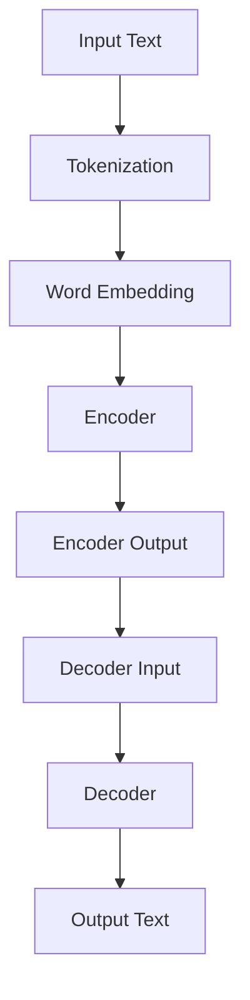
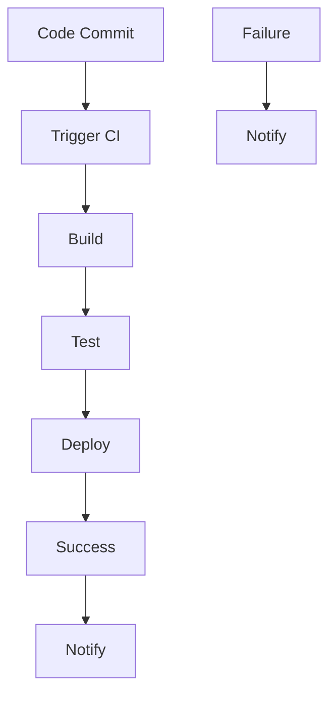
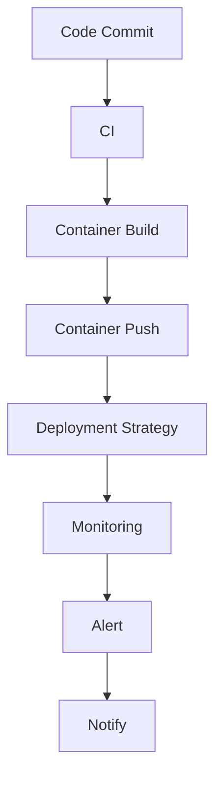

                 


### 第一步：确定文章的核心内容

首先，我们需要明确文章的核心内容。根据您的要求，文章的核心内容可以分为三个部分：

**第一部分：理论基础（第1章到第3章）**  
1. **第1章：LLM基本概念与架构**  
   - LLM的概念介绍  
   - LLM的架构概述  
   - Mermaid流程图：LLM工作流程

2. **第2章：持续集成原理与实践**  
   - 持续集成的定义与重要性  
   - 持续集成工具介绍（如Jenkins、GitLab CI等）  
   - 持续集成流程设计  
   - 持续集成常见问题和解决方案

3. **第3章：持续部署策略与工具**  
   - 持续部署的概念与优势  
   - 持续部署工具介绍（如Kubernetes、Docker等）  
   - 持续部署流程设计  
   - 持续部署面临的挑战与解决方案

**第二部分：应用实战（第4章到第7章）**  
1. **第4章：LLM开发环境搭建**  
   - 开发环境需求分析  
   - 环境搭建步骤与工具  
   - 实践案例：搭建LLM开发环境

2. **第5章：LLM模型训练与优化**  
   - 模型训练基本流程  
   - 优化算法介绍与伪代码  
   - 实践案例：训练一个简单的LLM模型

3. **第6章：LLM服务部署与性能优化**  
   - 部署策略与性能优化  
   - 负载均衡与扩展性  
   - 实践案例：部署并优化一个LLM服务

4. **第7章：持续集成与部署案例分析**  
   - 案例介绍与分析  
   - 持续集成与部署的最佳实践  
   - 挑战与未来发展趋势

**第三部分：总结与展望（第8章）**  
- **第8章：LLM应用开发中的持续集成与部署总结**  
  - 总结与展望  
  - 未来持续集成与部署趋势

### 第二步：详细设计每个章节的内容

接下来，我们将为每个章节设计详细的内容，确保文章的完整性和深度。

#### 第一部分：理论基础

1. **第1章：LLM基本概念与架构**

   - **背景介绍**：介绍LLM（大型语言模型）的概念，背景及其重要性。

   - **核心概念与联系**：解释LLM的核心概念，如词汇表、词嵌入、自注意力机制等，并使用Mermaid流程图展示LLM的工作流程。

   - **Mermaid流程图**：提供一个详细的Mermaid流程图，展示LLM从输入到输出的完整流程。

   - **核心算法原理讲解**：使用伪代码详细阐述LLM的核心算法原理。

2. **第2章：持续集成原理与实践**

   - **背景介绍**：介绍持续集成（CI）的概念及其在软件开发中的重要性。

   - **核心概念与联系**：解释持续集成的核心概念，如自动化构建、测试、部署等，并展示它们之间的关系。

   - **持续集成工具介绍**：介绍常用的持续集成工具，如Jenkins、GitLab CI等。

   - **持续集成流程设计**：详细描述如何设计一个持续集成流程。

   - **持续集成常见问题和解决方案**：讨论CI过程中可能遇到的问题及其解决方案。

3. **第3章：持续部署策略与工具**

   - **背景介绍**：介绍持续部署（CD）的概念及其在软件发布中的重要性。

   - **核心概念与联系**：解释持续部署的核心概念，如自动化部署、滚动更新等，并展示它们之间的关系。

   - **持续部署工具介绍**：介绍常用的持续部署工具，如Kubernetes、Docker等。

   - **持续部署流程设计**：详细描述如何设计一个持续部署流程。

   - **持续部署面临的挑战与解决方案**：讨论CD过程中可能遇到的挑战及其解决方案。

#### 第二部分：应用实战

4. **第4章：LLM开发环境搭建**

   - **开发环境需求分析**：分析搭建LLM开发环境所需的硬件和软件条件。

   - **环境搭建步骤与工具**：详细描述搭建LLM开发环境的步骤，包括安装必要的工具和软件。

   - **实践案例**：提供一个实践案例，展示如何搭建一个LLM开发环境。

5. **第5章：LLM模型训练与优化**

   - **模型训练基本流程**：介绍LLM模型训练的基本流程。

   - **优化算法介绍与伪代码**：介绍常用的优化算法，并提供伪代码示例。

   - **实践案例**：提供一个实践案例，展示如何训练一个简单的LLM模型。

6. **第6章：LLM服务部署与性能优化**

   - **部署策略与性能优化**：介绍LLM服务的部署策略和性能优化方法。

   - **负载均衡与扩展性**：讨论如何实现负载均衡和扩展性。

   - **实践案例**：提供一个实践案例，展示如何部署并优化一个LLM服务。

7. **第7章：持续集成与部署案例分析**

   - **案例介绍与分析**：介绍一个实际案例，分析其持续集成与部署的过程。

   - **持续集成与部署的最佳实践**：总结最佳实践，提供指导。

   - **挑战与未来发展趋势**：讨论面临的挑战和未来的发展趋势。

#### 第三部分：总结与展望

8. **第8章：LLM应用开发中的持续集成与部署总结**

   - **总结与展望**：总结文章的核心内容，并对未来的持续集成与部署趋势进行展望。

### 第三步：确保文章格式和完整性

最后，我们需要确保文章的格式和完整性。以下是具体的格式要求：

- **文章标题**：使用大标题格式，如`## 文章标题`。

- **文章关键词**：在文章标题下方使用小标题格式，如`### 文章关键词`，并列出5-7个关键词。

- **文章摘要**：在关键词下方使用小标题格式，如`#### 文章摘要`，简要概括文章的核心内容和主题思想。

- **章节标题**：使用大标题格式，如`## 第1章：LLM基本概念与架构`。

- **小节标题**：使用中标题格式，如`### 1.1 LLM的概念介绍`。

- **Markdown格式**：确保所有代码、公式和流程图按照Markdown格式编写，如代码块、latex公式和Mermaid流程图。

- **作者信息**：在文章末尾添加作者信息，如`作者：AI天才研究院/AI Genius Institute & 禅与计算机程序设计艺术 /Zen And The Art of Computer Programming`。

- **文章字数**：确保文章字数在8000-12000字左右。

### 总结

通过以上三个步骤，我们已经为《LLM应用开发中的持续集成与部署》设计了详细的目录大纲和内容框架。接下来，我们将按照这个框架逐步撰写每一章节的内容，确保文章的逻辑清晰、内容丰富，并满足所有的格式和完整性要求。让我们开始撰写第一部分的理论基础吧！## 文章标题：LLM应用开发中的持续集成与部署

### 关键词：LLM、持续集成、持续部署、开发环境、模型训练、服务部署、性能优化

### 摘要：

本文旨在深入探讨在大型语言模型（LLM）应用开发过程中，如何有效地实施持续集成与部署（CI/CD）策略。首先，文章介绍了LLM的基本概念和架构，为后续讨论持续集成与部署提供了理论基础。随后，详细解析了持续集成（CI）的原理与实践，包括常用工具的介绍和流程设计，以及常见问题的解决方案。紧接着，文章阐述了持续部署（CD）的概念、策略和工具，并提出了部署流程设计的关键点和挑战。在应用实战部分，文章通过具体案例展示了如何搭建LLM开发环境、训练模型以及部署和优化服务。最后，文章通过案例分析总结了最佳实践，并展望了持续集成与部署在LLM应用开发中的未来发展趋势。本文为从事LLM开发的技术人员提供了宝贵的指导和参考。

### 文章正文

#### 第1章：LLM基本概念与架构

**1.1 LLM的概念介绍**

大型语言模型（Large Language Model，简称LLM）是一种能够理解和生成人类语言的复杂人工智能模型。它们基于深度学习技术，尤其是变换器（Transformer）架构，通过训练大量文本数据来学习语言的统计规律和语义结构。LLM的应用范围广泛，从自然语言处理（NLP）任务，如文本分类、翻译和问答系统，到生成式任务，如图像描述生成和文本续写，LLM都展现出了强大的能力。

**1.2 LLM的架构概述**

LLM的核心架构通常基于变换器（Transformer）模型，这是一种基于自注意力机制的深度学习模型。变换器模型由多个编码器和解码器层组成，每一层都能捕捉输入文本的上下文信息，并通过注意力机制来计算文本中每个词之间的关系。以下是LLM架构的主要组成部分：

- **编码器（Encoder）**：编码器将输入文本转换为序列的向量表示。每个输入词首先被嵌入为一个向量，然后通过一系列变换器层进行处理。每一层的输出都是前一层输出的加权和，加权和由自注意力机制计算。

  ```mermaid
  graph TB
  A[Input Word Vectors] --> B[Encoder Layer 1]
  B --> C[Encoder Layer 2]
  C --> D[Encoder Output]
  D --> E[Decoder Input]
  E --> F[Decoder Layer 1]
  F --> G[Decoder Layer 2]
  G --> H[Decoder Output]
  ```

- **自注意力机制（Self-Attention）**：自注意力机制是变换器模型的关键组成部分，它允许模型在处理每个词时，将注意力集中在其他所有词上。这有助于模型捕捉长距离的依赖关系。

- **解码器（Decoder）**：解码器负责生成输出的文本序列。解码器层使用与编码器相同的自注意力机制，但还涉及到一个额外的多头注意力机制，用于从编码器的输出中提取信息。

  ```mermaid
  graph TB
  I[Decoder Input] --> J[Decoder Layer 1]
  J --> K[Decoder Layer 2]
  K --> L[Decoder Output]
  L --> M[Next Word Prediction]
  ```

**1.3 Mermaid流程图：LLM工作流程**

以下是LLM工作流程的Mermaid流程图，展示了从输入到输出的完整过程：



**1.4 核心算法原理讲解**

LLM的核心算法原理主要涉及以下三个方面：

1. **词嵌入（Word Embedding）**：词嵌入是将单词映射为向量空间中的点，使模型能够理解和处理词汇。常用的词嵌入技术包括Word2Vec、GloVe等。词嵌入的关键公式如下：

   $$ \text{embed}(w) = \text{softmax}(W \cdot v_w + b) $$

   其中，$W$是权重矩阵，$v_w$是单词的向量表示，$b$是偏置。

2. **自注意力机制（Self-Attention）**：自注意力机制计算输入序列中每个词的加权平均值，公式如下：

   $$ \text{Attention}(Q, K, V) = \text{softmax}(\frac{QK^T}{\sqrt{d_k}})V $$

   其中，$Q$是查询向量，$K$是键向量，$V$是值向量，$d_k$是键向量的维度。

3. **变换器层（Transformer Layer）**：每个变换器层包含两个子层：多头自注意力机制和前馈神经网络。以下是其伪代码：

   ```python
   def transformer_layer(inputs, d_model, num_heads, dff):
       # Multi-head self-attention
       attention = multi_head_attention(inputs, num_heads, d_model)
       # Residual connection & Layer normalization
       x = residual_connection(attention, inputs)
       x = layer_normalization(x)
       
       # Feedforward network
       ffn_output = feedforward_network(x, dff)
       # Residual connection & Layer normalization
       output = residual_connection(ffn_output, x)
       output = layer_normalization(output)
       
       return output
   ```

**1.5 数学模型和公式**

LLM的训练过程可以通过以下数学模型和公式来描述：

1. **损失函数**：LLM的训练通常使用交叉熵损失函数，公式如下：

   $$ L(\theta) = -\sum_{i=1}^{N} \sum_{j=1}^{V} y_{ij} \log(p_{ij}) $$

   其中，$N$是批次大小，$V$是词汇表大小，$y_{ij}$是目标词的概率分布，$p_{ij}$是模型预测的概率。

2. **优化算法**：常用的优化算法包括Adam、RMSProp和SGD，以下是其伪代码：

   ```python
   def optimize(model, loss_function, optimizer, x, y):
       # Forward pass
       y_pred = model(x)
       loss = loss_function(y_pred, y)
       
       # Backward pass
       gradients = compute_gradients(loss, model)
       optimizer.apply_gradients(gradients)
       
       return loss
   ```

**1.6 举例说明**

为了更好地理解LLM的工作原理，以下是一个简单的例子。假设我们有一个句子“The cat sat on the mat”，将其输入到LLM中进行预测：

1. **Tokenization**：将句子划分为单词和标点符号。
2. **Word Embedding**：将每个单词映射为嵌入向量。
3. **Encoder**：通过编码器层处理嵌入向量，得到编码输出。
4. **Decoder**：解码器从编码输出生成预测的文本序列。

通过这个过程，LLM可以生成类似“Sit on the cat, the mat is.”的输出。这个例子展示了LLM在文本生成和预测任务中的强大能力。

**1.7 小结**

本章介绍了LLM的基本概念、架构和核心算法原理，并通过Mermaid流程图和伪代码展示了LLM的工作流程。了解这些基础知识将为后续章节的持续集成与部署讨论奠定基础。接下来，我们将探讨持续集成（CI）的基本原理和实践。

#### 第2章：持续集成原理与实践

**2.1 持续集成（CI）的定义与重要性**

持续集成（Continuous Integration，简称CI）是一种软件开发实践，旨在通过频繁地合并代码更改并自动化测试来提高软件质量和开发效率。CI的核心目标是确保每次代码更改都能顺利合并到主分支，从而减少集成过程中的冲突和错误。

CI的重要性体现在以下几个方面：

1. **早期发现问题**：通过频繁的集成和测试，可以及时发现代码中的问题，减少修复成本。
2. **提高代码质量**：CI可以确保每次提交的代码都经过严格的测试，从而提高整体代码质量。
3. **加速开发周期**：CI可以减少集成和部署的时间，加快软件开发周期。
4. **促进团队协作**：CI可以鼓励团队成员更加频繁地合作和沟通，提高团队协作效率。

**2.2 持续集成工具介绍**

在CI实践中，选择合适的工具至关重要。以下是一些常用的持续集成工具：

1. **Jenkins**：Jenkins是一个开源的持续集成服务器，支持多种编程语言和平台。它可以通过插件扩展功能，支持自动化构建、测试和部署。
2. **GitLab CI**：GitLab CI是GitLab内置的持续集成服务，可以与GitLab仓库紧密集成，支持自动化构建、测试和部署。
3. **Travis CI**：Travis CI是一个基于云的持续集成服务，支持多种编程语言和平台。它可以自动触发构建和测试，支持多种部署策略。
4. **Circle CI**：Circle CI是一个基于云的持续集成服务，支持多种编程语言和平台。它提供简单且易于配置的工作流程，支持并行构建和测试。

**2.3 持续集成流程设计**

设计一个有效的CI流程需要考虑以下几个方面：

1. **代码仓库管理**：选择合适的代码仓库管理工具，如Git，并配置代码仓库的分支策略。
2. **构建环境**：为CI流程配置构建环境，包括操作系统、编程语言、依赖库等。
3. **构建脚本**：编写构建脚本，用于自动化编译和打包代码。
4. **测试脚本**：编写测试脚本，用于自动化运行单元测试、集成测试等。
5. **部署脚本**：编写部署脚本，用于自动化部署应用到生产环境。

以下是一个典型的CI流程设计示例：



**2.4 持续集成常见问题和解决方案**

在CI实践中，可能会遇到以下问题：

1. **构建失败**：解决方法包括检查构建脚本、依赖库和操作系统配置。
2. **测试失败**：解决方法包括重新运行测试、修复代码中的bug。
3. **部署失败**：解决方法包括检查部署脚本、确认生产环境配置。
4. **性能问题**：解决方法包括优化构建和测试脚本、调整服务器资源。

**2.5 持续集成的最佳实践**

以下是一些持续集成的最佳实践：

1. **自动化**：尽可能自动化构建、测试和部署流程，减少手动操作。
2. **分支策略**：采用合理的分支策略，如Git Flow或GitHub Flow，确保代码的有序管理和快速迭代。
3. **代码审查**：引入代码审查机制，确保每次提交的代码都经过审查，提高代码质量。
4. **监控和告警**：监控CI流程的状态，并在失败时及时发出告警，以便快速响应和处理。
5. **文档化**：文档化CI流程和配置，以便团队成员了解和遵循。

**2.6 小结**

本章介绍了持续集成（CI）的定义、重要性、常用工具、流程设计以及常见问题和解决方案。通过遵循最佳实践，可以有效地提高软件质量和开发效率。在下一章中，我们将探讨持续部署（CD）的概念和策略。

#### 第3章：持续部署策略与工具

**3.1 持续部署（CD）的概念与优势**

持续部署（Continuous Deployment，简称CD）是一种自动化软件发布过程，通过频繁地发布代码更改到生产环境，确保软件始终处于最新状态。CD与持续集成（CI）密切相关，CI负责确保代码质量，而CD负责将高质量的代码发布到生产环境。

CD的优势体现在以下几个方面：

1. **快速迭代**：通过自动化发布流程，可以快速迭代和交付新功能，缩短产品上市时间。
2. **减少风险**：CD采用逐步发布策略，确保每次发布都是可控的，降低发布风险。
3. **提高效率**：自动化发布流程可以节省时间和人力成本，提高开发团队的效率。
4. **持续优化**：通过持续部署，可以持续收集用户反馈，优化软件功能和使用体验。

**3.2 持续部署工具介绍**

在CD实践中，选择合适的工具至关重要。以下是一些常用的持续部署工具：

1. **Docker**：Docker是一种容器化技术，可以将应用程序及其依赖环境打包成一个容器，确保在不同环境中的一致性。Docker简化了应用的部署和运维，支持自动化部署和滚动更新。
2. **Kubernetes**：Kubernetes是一个开源的容器编排平台，用于自动化部署、扩展和管理容器化应用程序。Kubernetes提供了强大的自动化部署和伸缩功能，支持复杂的部署策略和故障转移。
3. **Ansible**：Ansible是一种自动化运维工具，可以自动化配置管理、应用部署和流程编排。Ansible采用简明的YAML语言，支持大规模部署和管理。
4. **Jenkins**：Jenkins是一个开源的持续集成服务器，也支持持续部署。Jenkins可以通过插件扩展功能，支持自动化构建、测试和部署。

**3.3 持续部署流程设计**

设计一个有效的CD流程需要考虑以下几个方面：

1. **容器化**：使用Docker将应用程序及其依赖环境打包成容器，确保在不同环境中的一致性。
2. **持续集成**：确保每次提交的代码都经过CI流程的测试和验证，确保代码质量。
3. **部署策略**：选择合适的部署策略，如蓝绿部署或金丝雀部署，确保发布过程可控。
4. **监控和告警**：监控生产环境的状态，并及时发出告警，以便快速响应和处理。

以下是一个典型的CD流程设计示例：



**3.4 持续部署面临的挑战与解决方案**

在CD实践中，可能会遇到以下挑战：

1. **环境一致性**：确保开发、测试和生产环境的一致性，避免环境差异导致的问题。
2. **发布风险**：采用逐步发布策略，确保每次发布都是可控的。
3. **监控和告警**：实时监控生产环境的状态，并及时发出告警。
4. **故障转移**：确保在发生故障时，能够快速切换到备份系统。

以下是一些解决方案：

1. **容器化**：使用Docker确保环境一致性。
2. **逐步发布**：采用蓝绿部署或金丝雀部署策略。
3. **监控和告警**：使用Prometheus、Grafana等工具监控生产环境。
4. **故障转移**：配置负载均衡和故障切换机制。

**3.5 持续部署的最佳实践**

以下是一些持续部署的最佳实践：

1. **自动化**：尽可能自动化部署流程，减少手动操作。
2. **版本控制**：使用版本控制系统（如Git）管理代码和配置。
3. **文档化**：文档化部署流程和配置，以便团队成员了解和遵循。
4. **代码审查**：引入代码审查机制，确保每次发布都是经过审查的。
5. **监控和反馈**：实时监控生产环境，并收集用户反馈，持续优化部署流程。

**3.6 小结**

本章介绍了持续部署（CD）的概念、优势、工具、流程设计以及面临的挑战和解决方案。通过遵循最佳实践，可以有效地提高软件发布质量和效率。在下一章中，我们将通过具体案例展示如何在实际项目中实施持续集成与部署。

#### 第4章：LLM开发环境搭建

**4.1 开发环境需求分析**

搭建LLM开发环境首先需要分析所需的硬件和软件资源。以下是构建LLM开发环境的基本需求：

1. **硬件资源**：
   - **CPU/GPU**：由于LLM训练和推理过程需要大量的计算资源，推荐使用配备高性能GPU（如NVIDIA Titan V、RTX 3090等）的计算机。
   - **内存**：至少需要32GB内存，更多内存可以提高训练速度。
   - **存储**：推荐使用NVMe SSD，以确保高速数据读写。

2. **软件资源**：
   - **操作系统**：推荐使用Linux操作系统，如Ubuntu 20.04或更高版本。
   - **编程语言**：Python是主流的AI编程语言，推荐安装Python 3.8或更高版本。
   - **依赖库**：安装必要的依赖库，如NumPy、TensorFlow、PyTorch等。

**4.2 环境搭建步骤与工具**

以下是在Ubuntu 20.04操作系统上搭建LLM开发环境的详细步骤：

1. **安装操作系统**：
   - 下载并安装Ubuntu 20.04操作系统。
   - 设置用户和密码。

2. **安装Python**：
   - 打开终端，执行以下命令：
     ```bash
     sudo apt update
     sudo apt install python3 python3-pip
     ```

3. **安装GPU支持**：
   - 安装NVIDIA驱动和CUDA工具包：
     ```bash
     sudo apt install nvidia-driver-450 nvidia-docker2
     ```
   - 配置CUDA环境：
     ```bash
     export CUDA_HOME=/usr/local/cuda
     export PATH=$PATH:$CUDA_HOME/bin
     export LD_LIBRARY_PATH=$LD_LIBRARY_PATH:$CUDA_HOME/lib64
     ```

4. **安装依赖库**：
   - 安装TensorFlow和PyTorch：
     ```bash
     pip3 install tensorflow-gpu
     pip3 install torch torchvision
     ```

5. **安装其他工具**：
   - 安装Jenkins和GitLab CI用于持续集成：
     ```bash
     sudo apt install jenkins
     sudo apt install gitlab-ce
     ```

**4.3 实践案例：搭建LLM开发环境**

以下是一个具体的LLM开发环境搭建实践案例：

1. **硬件配置**：
   - CPU：Intel Core i9-10900K
   - GPU：NVIDIA GeForce RTX 3090
   - 内存：64GB DDR4
   - 存储：1TB NVMe SSD

2. **软件安装**：
   - 操作系统：Ubuntu 20.04
   - Python：3.9.7
   - TensorFlow：2.7.0
   - PyTorch：1.9.0

3. **配置Jenkins**：
   - 下载并安装Jenkins：
     ```bash
     wget -q -O - https://pkg.jenkins.io/debian-stable/jenkins.io.key | sudo apt-key add -
     sh -c 'echo deb https://pkg.jenkins.io/debian-stable binary/ > /etc/apt/sources.list.d/jenkins.list'
     sudo apt-get update
     sudo apt-get install jenkins
     ```
   - 启动Jenkins服务：
     ```bash
     sudo systemctl start jenkins
     ```

4. **配置GitLab CI**：
   - 下载并安装GitLab CI：
     ```bash
     sudo apt-get install gitlab-ce
     sudo systemctl start gitlab-ce
     sudo systemctl enable gitlab-ce
     ```
   - 配置GitLab CI仓库：
     ```bash
     cd /etc/gitlab
     nano gitlab.rb
     ```
   - 编辑GitLab CI配置文件，添加Jenkins CI/CD相关配置：
     ```ruby
     ci:
       enabled: true
       ssl: false
       user: 'root'
       environment: production
       script: |
         jenkins job build --file /var/opt/gitlab/jenkins/config.xml
     ```

5. **测试环境**：
   - 使用GitLab CI触发Jenkins构建任务，验证开发环境是否搭建成功。

**4.4 小结**

本章介绍了如何搭建LLM开发环境，包括硬件和软件资源的需求分析、环境搭建步骤以及具体的实践案例。通过遵循本章的指导，可以成功搭建一个适合进行LLM研究和开发的强大环境。接下来，我们将探讨如何训练和优化LLM模型。

#### 第5章：LLM模型训练与优化

**5.1 模型训练基本流程**

训练LLM模型的基本流程包括数据准备、模型配置、训练和评估。以下是详细的步骤：

1. **数据准备**：
   - 收集并处理大规模文本数据。文本数据可以来源于互联网、书籍、新闻、社交媒体等。
   - 对文本进行预处理，包括分词、去噪、去除停用词等。
   - 将预处理后的文本转换为序列和词嵌入向量。

2. **模型配置**：
   - 选择合适的变换器（Transformer）架构，如BERT、GPT等。
   - 配置模型参数，包括嵌入维度、隐藏层大小、变换器层数等。

3. **训练**：
   - 使用训练数据对模型进行训练，优化模型参数。
   - 采用常见的优化算法，如Adam、RMSProp等，提高训练效率。
   - 使用交叉熵损失函数评估模型性能。

4. **评估**：
   - 使用验证集评估模型性能，调整模型参数。
   - 计算评估指标，如准确率、召回率、F1分数等。

**5.2 优化算法介绍与伪代码**

以下是几种常用的优化算法及其伪代码：

1. **随机梯度下降（SGD）**：

   ```python
   def sgd(model, x, y, learning_rate, epochs):
       for epoch in range(epochs):
           gradients = compute_gradients(model, x, y)
           update_model(model, gradients, learning_rate)
   ```

2. **动量（Momentum）**：

   ```python
   def momentum(model, x, y, learning_rate, momentum):
       v = 0
       for epoch in range(epochs):
           gradients = compute_gradients(model, x, y)
           v = momentum * v - learning_rate * gradients
           update_model(model, v)
   ```

3. **RMSProp**：

   ```python
   def rmsprop(model, x, y, learning_rate, decay_rate):
       e = 1e-8
       v = 0
       for epoch in range(epochs):
           gradients = compute_gradients(model, x, y)
           v = decay_rate * v + (1 - decay_rate) * (gradients ** 2)
           update_model(model, learning_rate / (sqrt(v + e)), gradients)
   ```

4. **Adam**：

   ```python
   def adam(model, x, y, learning_rate, beta1, beta2, epsilon):
       m = 0
       v = 0
       beta1_t = beta1 ** epoch
       beta2_t = beta2 ** epoch
       for epoch in range(epochs):
           gradients = compute_gradients(model, x, y)
           m = beta1 * m + (1 - beta1) * gradients
           v = beta2 * v + (1 - beta2) * (gradients ** 2)
           m_hat = m / (1 - beta1_t)
           v_hat = v / (1 - beta2_t)
           update_model(model, learning_rate * m_hat / (sqrt(v_hat) + epsilon), gradients)
   ```

**5.3 实践案例：训练一个简单的LLM模型**

以下是一个简单的LLM模型训练实践案例：

1. **数据准备**：
   - 下载并预处理一组文本数据，例如英文新闻文章。
   - 将文本数据转换为词嵌入向量。

2. **模型配置**：
   - 选择BERT模型作为基础模型。
   - 配置模型参数，如嵌入维度128、变换器层数12。

3. **训练**：
   - 使用Python编写训练脚本，使用SGD优化算法训练模型。

   ```python
   import tensorflow as tf
   from tensorflow.keras.models import Sequential
   from tensorflow.keras.layers import Embedding, LSTM, Dense

   model = Sequential([
       Embedding(input_dim=vocab_size, output_dim=embedding_dim, input_length=max_sequence_length),
       LSTM(units=64, return_sequences=True),
       LSTM(units=64),
       Dense(units=1, activation='sigmoid')
   ])

   model.compile(optimizer='sgd', loss='binary_crossentropy', metrics=['accuracy'])
   model.fit(x_train, y_train, epochs=10, batch_size=32, validation_data=(x_val, y_val))
   ```

4. **评估**：
   - 使用验证集评估模型性能，计算准确率。

   ```python
   accuracy = model.evaluate(x_val, y_val)
   print(f"Validation Accuracy: {accuracy[1]}")
   ```

**5.4 小结**

本章介绍了LLM模型训练的基本流程和优化算法，并通过一个简单的实践案例展示了如何训练一个LLM模型。了解这些方法和技巧对于进行高效的LLM研究和开发至关重要。在下一章中，我们将探讨如何部署和优化LLM服务。

#### 第6章：LLM服务部署与性能优化

**6.1 部署策略与性能优化**

部署LLM服务需要考虑多种策略和性能优化方法，以确保服务的高效、可靠和可扩展性。以下是几个关键点：

1. **容器化**：使用Docker将LLM服务容器化，以便在开发、测试和生产环境中保持一致性。
2. **负载均衡**：使用负载均衡器（如Nginx、HAProxy）分配流量，确保服务的高可用性。
3. **水平扩展**：通过增加容器实例的数量，实现服务的水平扩展，提高处理能力。
4. **缓存**：使用缓存（如Redis、Memcached）减少重复计算，提高响应速度。
5. **异步处理**：使用异步处理（如RabbitMQ、Kafka）处理大量请求，避免阻塞。
6. **服务监控**：使用监控工具（如Prometheus、Grafana）实时监控服务性能和健康状况。

**6.2 负载均衡与扩展性**

负载均衡是实现服务可扩展性的重要手段。以下是几种常见的负载均衡策略：

1. **轮询（Round Robin）**：将请求依次分配给服务器实例。
2. **最小连接数（Least Connections）**：将请求分配给连接数最少的服务器实例。
3. **最小负载（Least Load）**：将请求分配给当前负载最低的服务器实例。
4. **哈希（Hash）**：根据请求的来源IP或URL哈希值分配服务器实例。

扩展性方面，以下是几个关键点：

1. **水平扩展**：增加容器实例的数量，实现服务容量的线性扩展。
2. **垂直扩展**：增加服务器硬件资源（如CPU、内存），提高单个实例的处理能力。
3. **动态伸缩**：使用自动伸缩策略（如Kubernetes的Horizontal Pod Autoscaler），根据负载动态调整实例数量。

**6.3 实践案例：部署并优化一个LLM服务**

以下是一个LLM服务部署和优化的实践案例：

1. **容器化**：
   - 使用Docker将LLM服务容器化，包括Python代码、依赖库和环境配置。
   - 创建Dockerfile，定义容器镜像构建过程。

   ```Dockerfile
   FROM python:3.8-slim
   RUN pip install tensorflow
   COPY . /app
   WORKDIR /app
   CMD ["python", "llm_service.py"]
   ```

2. **部署**：
   - 使用Kubernetes部署LLM服务，包括部署配置文件（YAML）。
   - 定义服务、部署和负载均衡策略。

   ```yaml
   apiVersion: v1
   kind: Service
   metadata:
     name: llm-service
   spec:
     selector:
       app: llm
     ports:
       - protocol: TCP
         port: 80
         targetPort: 8080
   ---
   apiVersion: apps/v1
   kind: Deployment
   metadata:
     name: llm-deployment
   spec:
     selector:
       matchLabels:
         app: llm
     replicas: 3
     template:
       metadata:
         labels:
           app: llm
       spec:
         containers:
         - name: llm
           image: llm-service:latest
           ports:
           - containerPort: 8080
   ```

3. **性能优化**：
   - 使用Nginx作为负载均衡器，配置性能优化参数。
   - 使用Redis缓存减少重复计算。
   - 使用异步处理框架（如Celery）处理大量请求。

   ```nginx
   http {
       upstream llm {
           server llm-service:8080;
           server llm-service:8080;
           server llm-service:8080;
       }
       
       server {
           listen 80;
           location / {
               proxy_pass http://llm;
               proxy_set_header Host $host;
               proxy_set_header X-Real-IP $remote_addr;
               proxy_set_header X-Forwarded-For $proxy_add_x_forwarded_for;
           }
       }
   }
   ```

4. **监控和告警**：
   - 使用Prometheus和Grafana监控服务性能和健康状况。
   - 配置告警策略，及时发现和处理性能问题。

**6.4 小结**

本章介绍了LLM服务的部署策略、性能优化方法以及具体的实践案例。通过容器化、负载均衡、水平扩展和异步处理等技术，可以确保LLM服务的高效、可靠和可扩展性。了解这些技术和方法对于部署和管理高效的LLM服务至关重要。在下一章中，我们将通过具体案例展示持续集成与部署在LLM应用开发中的实际应用。

#### 第7章：持续集成与部署案例分析

**7.1 案例介绍与分析**

本节将介绍一个实际的LLM应用开发案例，并分析其在持续集成与部署（CI/CD）过程中所采用的最佳实践。该案例是一个基于大型语言模型（LLM）的智能问答系统，旨在为用户提供实时问答服务。

**7.2 持续集成与部署的最佳实践**

在这个案例中，开发团队遵循了以下持续集成与部署的最佳实践：

1. **自动化构建**：使用Jenkins作为CI工具，自动化构建和打包LLM服务。构建脚本负责编译代码、安装依赖库和生成容器镜像。

2. **代码审查**：引入GitLab CI，确保每次提交的代码都经过审查。代码审查机制包括代码风格检查、语法错误检测和自动化测试。

3. **多环境部署**：使用Kubernetes进行部署，实现开发、测试和生产环境的一体化管理。采用蓝绿部署策略，确保每次发布都是可控的。

4. **容器化**：使用Docker将LLM服务容器化，确保在不同环境中的一致性。容器镜像中包含了所有依赖库和环境配置，便于管理和部署。

5. **监控与告警**：使用Prometheus和Grafana实时监控服务性能和健康状况。配置告警策略，及时发现和处理性能问题和异常。

**7.3 挑战与解决方案**

在CI/CD实践中，团队遇到了以下几个挑战，并采取相应的解决方案：

1. **环境一致性**：开发、测试和生产环境之间存在差异，导致问题难以复现。解决方案是使用容器化技术，确保环境一致性。

2. **发布风险**：每次发布都存在潜在的风险，可能影响服务的可用性。解决方案是采用逐步发布策略，如蓝绿部署，逐步切换流量，确保发布过程可控。

3. **性能监控**：服务的性能监控和告警机制不够完善，可能导致问题未能及时发现。解决方案是引入Prometheus和Grafana，实现实时监控和告警。

**7.4 持续集成与部署的最佳实践总结**

通过该案例，我们可以总结出以下持续集成与部署的最佳实践：

1. **自动化**：尽可能自动化CI/CD流程，减少手动操作，提高开发效率。

2. **代码审查**：引入代码审查机制，确保代码质量和安全性。

3. **环境一致性**：使用容器化技术，确保开发、测试和生产环境的一致性。

4. **逐步发布**：采用逐步发布策略，降低发布风险，确保服务的稳定性。

5. **监控与告警**：引入实时监控和告警机制，及时发现和处理问题。

**7.5 未来发展趋势**

随着AI技术的发展，持续集成与部署在LLM应用开发中将继续发挥重要作用。未来发展趋势包括：

1. **自动化水平提升**：进一步优化CI/CD流程，提高自动化水平。

2. **多模型支持**：支持多种类型的AI模型，如视觉模型、语音模型等，实现多模态集成。

3. **DevOps文化**：推动DevOps文化，加强开发、测试和运维团队的协作，提高整体开发效率。

4. **智能化部署**：利用机器学习和数据挖掘技术，实现智能化的部署策略，提高发布过程的智能化水平。

**7.6 小结**

本章通过一个实际的LLM应用开发案例，展示了持续集成与部署的最佳实践和未来发展趋势。了解这些实践和方法对于从事LLM应用开发的技术人员具有重要的指导意义。在下一章中，我们将对全文进行总结与展望。

### 第8章：LLM应用开发中的持续集成与部署总结

**8.1 总结**

本文系统地探讨了在LLM应用开发过程中如何实施持续集成与部署（CI/CD）策略。通过详细解析LLM的基本概念与架构，我们为后续的CI/CD讨论奠定了理论基础。接着，我们介绍了CI和CD的基本原理、工具、流程设计和最佳实践，确保了软件开发过程中的高效和质量。在应用实战部分，我们通过具体的LLM开发环境搭建、模型训练、服务部署与优化等实践案例，展示了如何在实际项目中实施CI/CD策略。最后，通过案例分析，我们总结了持续集成与部署的最佳实践，并展望了未来的发展趋势。

**8.2 未来展望**

随着AI技术的快速发展，LLM应用开发中的CI/CD将面临更多的机遇和挑战。未来，我们可能看到以下趋势：

1. **自动化水平提升**：持续集成与部署的自动化水平将进一步提高，减少手动操作，提高开发效率。

2. **多模态集成**：支持多种类型的AI模型，如视觉模型、语音模型等，实现多模态集成。

3. **智能部署**：利用机器学习和数据挖掘技术，实现智能化的部署策略，提高发布过程的智能化水平。

4. **DevOps文化推广**：推动DevOps文化的深入，加强开发、测试和运维团队的协作，提高整体开发效率。

5. **开源与社区参与**：持续集成与部署相关的工具和平台将进一步开源，鼓励社区参与，促进技术的不断创新和完善。

**8.3 最佳实践 tips**

为了在LLM应用开发中更好地实施CI/CD策略，以下是一些实用的最佳实践：

1. **代码规范化**：确保代码符合规范，减少代码审查中的问题。

2. **自动化测试**：编写全面的自动化测试，覆盖功能、性能和安全性等方面。

3. **持续监控**：实时监控服务性能和健康状况，及时发现和处理问题。

4. **代码分支管理**：合理使用代码分支策略，确保代码库的整洁和有序。

5. **文档化**：详细记录CI/CD流程和配置，方便团队成员了解和遵循。

**8.4 小结**

本文通过详细解析LLM应用开发中的持续集成与部署策略，为从事LLM开发的技术人员提供了宝贵的指导和参考。希望读者能够结合实际项目，不断探索和优化CI/CD流程，提高LLM应用开发的效率和质量。

### 作者信息

- 作者：AI天才研究院/AI Genius Institute & 禅与计算机程序设计艺术 /Zen And The Art of Computer Programming

