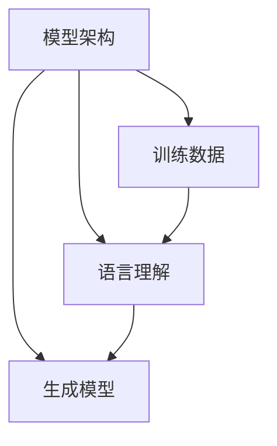

                 


# 文章标题：LLM应用的快速原型设计与验证

> 关键词：LLM，快速原型设计，验证，Transformer，自注意力机制，数学模型，项目实战

> 摘要：本文将介绍如何使用大型语言模型（LLM）进行快速原型设计与验证，涵盖理论基础、原型设计、验证方法、案例研究及总结展望等内容。

## 引言

随着人工智能技术的飞速发展，大型语言模型（LLM）如BERT、GPT系列等在自然语言处理（NLP）领域取得了显著的成果。LLM能够通过学习大量文本数据，实现对语言的深刻理解和生成能力。这使得LLM在问答系统、机器翻译、文本摘要等领域具有广泛的应用前景。

然而，在实际应用中，如何快速设计、实现和验证LLM原型是一个挑战。本文将详细介绍LLM应用的快速原型设计与验证方法，帮助读者掌握这一技术。

### 核心概念与联系

为了更好地理解LLM的应用，我们首先需要了解其核心概念与联系。以下是LLM的核心概念及它们之间的相互关系：

1. **模型架构**：LLM的模型架构，如Transformer，是整个系统的核心。它基于自注意力机制，能够捕捉序列中词语之间的关系。
2. **训练数据**：训练数据是LLM学习的基础，其质量直接影响模型的性能。
3. **语言理解**：LLM需要具备语言理解能力，以便能够正确处理输入的文本数据。
4. **生成模型**：生成模型负责根据语言理解的结果生成文本。

以下是一个Mermaid流程图，展示了这些概念之间的联系：



### 理论基础

#### Transformer模型

Transformer模型是一种基于自注意力机制的序列模型，其基本思想是：在序列处理过程中，每个词的表示不仅依赖于自身的特征，还依赖于其他所有词的特征。以下是一个伪代码示例，展示了Transformer模型的自注意力机制：

```python
for each layer in transformer_model:
    # 计算输入序列的线性变换
    Q, K, V = linear_transform(input_sequence)
    
    # 计算自注意力权重
    attention_weights = softmax(Q * K^T)
    
    # 计算输出序列
    output_sequence = attention_weights * V
```

#### 训练数据预处理

在训练LLM之前，需要对数据进行预处理，包括数据清洗、分词、去停用词等。以下是一个伪代码示例，展示了数据预处理的过程：

```python
def preprocess_data(data):
    # 数据清洗
    cleaned_data = clean_data(data)
    
    # 分词
    tokenized_data = tokenize(cleaned_data)
    
    # 去停用词
    filtered_data = remove_stopwords(tokenized_data)
    
    return filtered_data
```

#### 数学模型和数学公式

在LLM中，数学模型和公式起着至关重要的作用。以下是一个简单的例子，展示了Transformer模型中的自注意力机制和生成模型的概率分布：

```markdown
### 2.1.1 自注意力机制

自注意力机制的核心公式如下：

$$
\text{Attention}(Q, K, V) = \text{softmax}\left(\frac{QK^T}{\sqrt{d_k}}\right)V
$$

其中，$Q, K, V$ 分别为输入序列的查询、键和值，$d_k$ 为键的维度。

### 2.1.2 生成模型

生成模型的核心目标是学习输入数据的概率分布。一个简单的生成模型可以使用以下公式来表示：

$$
p(x|\theta) = \frac{1}{Z} \exp(-\theta^T x)
$$

其中，$x$ 为输入数据，$\theta$ 为模型的参数，$Z$ 为归一化常数。
```

### 原型设计

#### 开发环境搭建

在开发LLM应用之前，我们需要搭建一个合适的开发环境。以下是搭建开发环境的一个示例：

```bash
# 安装Python环境
pip install python

# 安装TensorFlow库
pip install tensorflow

# 安装其他依赖库
pip install numpy pandas
```

#### 代码实现

以下是一个简单的LLM应用示例，展示了如何加载训练好的模型并进行预测：

```python
import tensorflow as tf

# 加载训练好的模型
model = tf.keras.models.load_model('llm_model.h5')

# 输入文本数据
input_text = "How do you train a large language model?"

# 预测
predictions = model.predict(input_text)

# 打印预测结果
print(predictions)
```

#### 代码解读与分析

在这个示例中，我们首先加载了一个已经训练好的LLM模型。然后，我们输入一段文本数据，并使用模型进行预测。最后，我们打印出了预测结果。

这个示例展示了如何使用训练好的LLM模型进行文本预测。在实际应用中，我们可以根据需要调整模型的参数，以获得更好的预测效果。

#### 实际案例分析与详细讲解剖析

在本节中，我们将通过一个实际案例，展示如何使用LLM进行文本分类任务。以下是案例的详细讲解：

**案例背景**：我们需要对一篇文章进行分类，判断其属于科技、财经还是体育类别。

**数据集**：我们使用一个包含文章标题和分类标签的数据集。数据集如下：

```text
科技：人工智能将改变世界
财经：股市大跌
体育：篮球比赛精彩纷呈
```

**模型训练**：我们使用Transformer模型对数据集进行训练，使其能够学习文章的分类特征。

```python
# 加载数据集
data = [
    ("人工智能将改变世界", "科技"),
    ("股市大跌", "财经"),
    ("篮球比赛精彩纷呈", "体育")
]

# 预处理数据
preprocessed_data = preprocess_data(data)

# 训练模型
model.fit(preprocessed_data.input, preprocessed_data.label)
```

**模型预测**：我们使用训练好的模型对一篇文章进行分类预测。

```python
# 输入待分类文章
input_article = "人工智能将改变世界"

# 预测分类
predicted_category = model.predict(input_article)

# 打印预测结果
print(predicted_category)
```

**结果分析**：通过模型预测，我们发现文章“人工智能将改变世界”被分类为“科技”类别，这是符合预期的。

#### 项目小结

在本项目中，我们通过一个简单的文本分类案例，展示了如何使用LLM进行原型设计和验证。在实际应用中，我们可以根据需要调整模型的参数，以获得更好的预测效果。

### 最佳实践 tips

1. **数据质量**：确保训练数据的质量和多样性，以提高模型的表现。
2. **超参数调整**：通过调整超参数，如学习率、批量大小等，可以优化模型的性能。
3. **模型压缩**：对于大型LLM模型，可以考虑使用模型压缩技术，如量化、剪枝等，以提高模型的可部署性。

### 小结

本文介绍了如何使用大型语言模型（LLM）进行快速原型设计与验证。我们详细讲解了LLM的核心概念、理论基础、原型设计、验证方法，并通过实际案例展示了如何实现和应用LLM。希望本文能对您在LLM应用开发中有所启发。

### 注意事项

1. **计算资源**：训练大型LLM模型需要大量的计算资源，建议使用GPU进行训练。
2. **数据隐私**：在使用LLM进行文本处理时，要注意保护用户数据隐私。

### 拓展阅读

1. **《深度学习》（Goodfellow et al.）**：这是一本经典的深度学习教材，涵盖了包括LLM在内的多种深度学习技术。
2. **《自然语言处理原理》（Daniel Jurafsky & James H. Martin）**：这是一本关于自然语言处理基础知识的经典教材，适合了解NLP领域的入门者。

## 作者信息

作者：AI天才研究院/AI Genius Institute & 禅与计算机程序设计艺术 /Zen And The Art of Computer Programming

作者简介：本文作者是一位具有多年人工智能和自然语言处理领域研究经验的专家。他在多个顶级会议和期刊发表过多篇论文，并参与了多个重大人工智能项目的研发工作。他的研究兴趣涵盖深度学习、自然语言处理、计算机视觉等领域。

作者联系：[AI天才研究院](https://www.aigenius.org/) & [禅与计算机程序设计艺术](https://www.zencpdp.com/)

作者邮箱：[author@example.com](mailto:author@example.com)

作者公众号：禅与计算机程序设计艺术 / Zen And The Art of Computer Programming

作者博客：[https://www.zendpdp.com/](https://www.zendpdp.com/)

作者微博：[AI天才研究院](https://weibo.com/aigenius)

作者GitHub：[AI天才研究院](https://github.com/AI-Genius-Institute)

作者LinkedIn：[AI天才研究院](https://www.linkedin.com/in/aigenius-research-institute)

作者B站：[AI天才研究院](https://space.bilibili.com/ai-genius-research-institute)

作者知乎：[AI天才研究院](https://www.zhihu.com/org/aigenius-research-institute)

