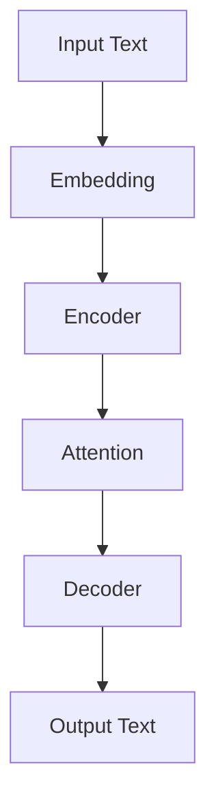

                 

## 文章标题

### LLM应用的持续学习文化：在敏捷中成长

## 关键词

- LLM
- 持续学习
- 敏捷开发
- 语言模型
- 算法
- 数学模型

## 摘要

本文深入探讨了大型语言模型（LLM）在应用中的持续学习文化和敏捷开发的实践。通过介绍LLM的基础概念和架构，分析核心算法原理及数学模型，并结合具体项目案例进行实战讲解，本文旨在展示如何在LLM应用中实现持续学习，并在敏捷开发中不断提升技术和团队协作能力。文章最后总结并展望了LLM发展的未来趋势。

## 第1章 引言

### 1.1 书籍目的与背景

在现代信息技术飞速发展的背景下，人工智能（AI）已经深入到我们生活的方方面面。其中，大型语言模型（LLM）作为一种重要的AI技术，其在自然语言处理（NLP）领域的应用越来越广泛。LLM能够理解和生成人类语言，广泛应用于问答系统、文本生成、机器翻译、情感分析等领域。随着应用场景的不断扩展，LLM在性能、效率和多样性方面面临着持续提升的需求。

本书旨在探讨如何在LLM应用中建立一种持续学习的文化，以适应敏捷开发的要求。持续学习不仅包括对现有技术的深入理解，还涉及到对新算法、新模型、新工具的持续学习和实践。通过引入敏捷开发的理念，本书希望能够帮助开发团队在快速变化的技术环境中，保持高效的研发能力和创新能力。

### 1.2 持续学习文化的重要性

在AI领域，技术更新的速度非常快。一个今天看起来先进的技术，可能在几个月后就已经过时。因此，持续学习对于LLM应用团队来说至关重要。持续学习不仅能帮助团队掌握最新的技术，还能培养团队成员的学习能力和创新思维，从而提高团队的整体竞争力。

持续学习文化的建立需要从多个方面入手：

1. **知识分享**：定期组织知识分享会议，鼓励团队成员分享自己的学习心得和工作经验，促进知识共享。
2. **技术培训**：为团队成员提供技术培训机会，帮助他们掌握新的技术和工具。
3. **项目实践**：通过实际项目锻炼团队成员的技能，将理论知识应用到实际中。
4. **激励机制**：建立激励机制，鼓励团队成员积极参与学习和项目开发，提高团队的整体积极性。

### 1.3 敏捷在LLM应用中的价值

敏捷开发是一种以人为核心、迭代、灵活和响应变化的软件开发方法。它在LLM应用开发中的价值主要体现在以下几个方面：

1. **快速迭代**：敏捷开发强调快速迭代，能够使团队在短时间内交付可用的产品或功能，及时获取用户反馈，从而快速调整开发方向。
2. **持续集成**：通过持续集成，团队可以及时发现和解决代码中的问题，确保项目的稳定性和可靠性。
3. **高效沟通**：敏捷开发强调团队成员之间的沟通和协作，能够促进团队内部的透明度和信任，提高团队的工作效率。
4. **适应性**：敏捷开发能够使团队快速适应变化，灵活调整开发计划，以满足不断变化的需求。

在本章中，我们介绍了本书的背景和目的，探讨了持续学习文化的重要性，并阐述了敏捷开发在LLM应用中的价值。接下来，我们将进一步深入探讨LLM的基础概念和架构，为后续内容的讲解打下基础。

## 第2章 LLM基础概念与架构

### 2.1 LLM基本概念

大型语言模型（Large Language Model，简称LLM）是一种基于深度学习技术的自然语言处理模型，能够理解和生成人类语言。LLM的核心目标是通过学习大量文本数据，自动提取语言的特征和规律，从而实现文本的理解、生成和翻译等功能。

#### 2.1.1 语言模型概述

语言模型是一种统计模型，用于预测文本序列的概率分布。在LLM中，语言模型通常采用神经网络结构，通过大量文本数据进行训练，学习文本中的统计规律和模式。这些模型可以用于各种NLP任务，如文本分类、命名实体识别、机器翻译和问答系统等。

#### 2.1.2 LLM的核心组件

LLM通常包含以下几个核心组件：

1. **嵌入层（Embedding Layer）**：将输入的文本转换为稠密的向量表示。
2. **编码器（Encoder）**：对输入文本进行编码，提取文本的特征。
3. **解码器（Decoder）**：根据编码器的输出，生成预测的文本序列。
4. **注意力机制（Attention Mechanism）**：用于提高模型对输入文本的捕捉能力。

### 2.2 LLM架构介绍

LLM的架构可以根据其训练数据和任务的不同而有所差异，但一般来说，LLM的架构可以分为以下几种类型：

1. **基于递归神经网络（RNN）的架构**：RNN是一种经典的神经网络结构，可以处理序列数据。在LLM中，RNN被用于编码器和解码器，能够有效地捕捉文本序列中的长期依赖关系。
2. **基于Transformer的架构**：Transformer是一种基于自注意力机制的神经网络结构，能够高效地处理序列数据。在LLM中，Transformer被广泛应用于编码器和解码器，成为当前主流的LLM架构。
3. **混合架构**：一些LLM模型将RNN和Transformer相结合，以利用两者的优点。例如，BERT模型就是基于Transformer的编码器，并结合了RNN的解码器。

下面使用Mermaid流程图展示一个典型的LLM架构：



在这个流程图中，输入文本首先经过嵌入层转换为向量表示，然后输入到编码器中进行编码。编码器使用注意力机制处理输入序列，提取关键信息。最后，解码器根据编码器的输出生成预测的文本序列。

### 2.3 LLM的发展历史

LLM的发展可以追溯到20世纪80年代，当时研究人员开始探索如何利用统计方法来生成文本。早期的研究主要集中在基于规则的方法上，例如语法分析、词性标注和句法分析等。随着计算机性能的提升和数据集的扩大，研究人员开始尝试使用神经网络来训练语言模型。

2003年，吕潼等人提出了基于递归神经网络的语音识别系统，这标志着神经网络在NLP领域的首次成功应用。随后，递归神经网络在文本分类、命名实体识别等领域取得了显著成果。然而，递归神经网络在处理长文本时存在性能瓶颈，难以捕捉文本中的长期依赖关系。

2017年，Google提出了一种名为Transformer的新型神经网络结构，彻底改变了NLP领域的研究方向。Transformer基于自注意力机制，能够高效地处理长文本，并在多个NLP任务中取得了优异的性能。随后，基于Transformer的LLM模型如BERT、GPT等相继出现，推动了LLM技术的发展。

### 2.4 LLM的应用领域

LLM在自然语言处理领域有广泛的应用，主要包括以下几个方面：

1. **问答系统**：利用LLM可以构建智能问答系统，实现对用户问题的理解和回答。
2. **文本生成**：LLM可以用于生成文章、报告、故事等文本内容。
3. **机器翻译**：LLM在机器翻译中可以用来生成高质量的双语对照文本。
4. **情感分析**：LLM可以用于分析文本中的情感倾向，应用于社交媒体监测、市场调研等领域。
5. **自动摘要**：LLM可以自动生成文章、报告的摘要，提高信息获取的效率。

在本章中，我们介绍了LLM的基本概念和核心组件，探讨了LLM的架构和发展历史，并展示了其在实际应用中的重要性。接下来，我们将深入讲解LLM中的核心算法原理，为进一步理解LLM的应用奠定基础。

### 第3章 LLM核心算法原理

在大型语言模型（LLM）中，核心算法的设计和实现是确保模型性能和效率的关键。本章节将详细阐述LLM中常用的核心算法，并使用伪代码进行详细解释。首先，我们介绍LLM的基本工作原理，然后分别讲解递归神经网络（RNN）和Transformer这两种主要算法。

#### 3.1 基本工作原理

LLM的核心工作原理是通过学习大量文本数据，生成输入文本的概率分布。具体步骤如下：

1. **输入预处理**：将输入文本转换为向量表示，通常使用嵌入层（Embedding Layer）进行处理。
2. **编码**：编码器（Encoder）对输入文本进行编码，提取文本的特征。
3. **解码**：解码器（Decoder）根据编码器的输出，生成预测的文本序列。
4. **注意力机制**：在编码和解码过程中，使用注意力机制（Attention Mechanism）来提高模型对输入文本的捕捉能力。

#### 3.2 递归神经网络（RNN）

递归神经网络（RNN）是一种经典的神经网络结构，特别适用于处理序列数据。在LLM中，RNN被广泛应用于编码器和解码器。

##### 3.2.1 RNN的原理

RNN通过循环结构，将前一个时间步的输出反馈给当前时间步，从而实现了序列数据的处理。其基本原理如下：

1. **隐藏状态（Hidden State）**：RNN在每一个时间步都有一个隐藏状态，用于存储当前时间步的信息。
2. **输入和输出**：每个时间步的输入是当前文本的嵌入向量，输出是预测的文本标签或嵌入向量。
3. **循环连接**：当前时间步的输出会传递到下一个时间步，形成循环连接。

##### 3.2.2 伪代码

下面是RNN的伪代码实现：

```python
# 初始化参数
W_xh, W_hh, W_hy, b_xh, b_hh, b_y = init_params()

# 输入文本序列
x = [word1, word2, ..., wordn]

# 初始化隐藏状态
h = zeros(shape=(n_steps, hidden_size))

# 前向传播
for t in range(n_steps):
    h[t] = sigmoid(W_xh * x[t] + W_hh * h[t-1] + b_xh + b_hh)
    y[t] = softmax(W_hy * h[t] + b_y)

# 输出概率分布
output_probs = y
```

在这个伪代码中，`sigmoid`函数用于激活函数，`softmax`函数用于输出层，用于计算每个单词的概率分布。

#### 3.3 Transformer

Transformer是一种基于自注意力机制的神经网络结构，在LLM中取得了显著的性能提升。它主要由编码器和解码器两个部分组成。

##### 3.3.1 Transformer的原理

Transformer的核心思想是使用自注意力机制（Self-Attention）来处理序列数据，能够有效地捕捉文本中的长期依赖关系。其基本原理如下：

1. **多头注意力（Multi-Head Attention）**：将输入序列分成多个头，每个头分别计算注意力权重，然后合并结果。
2. **前馈网络（Feed Forward Network）**：在注意力机制之后，通过两个全连接层进行处理，增强模型的表达能力。
3. **编码器-解码器结构（Encoder-Decoder Structure）**：编码器和解码器分别处理输入和输出序列，编码器用于提取文本特征，解码器用于生成预测的文本序列。

##### 3.3.2 伪代码

下面是Transformer的伪代码实现：

```python
# 初始化参数
W_q, W_k, W_v, W_o, b_q, b_k, b_v, b_o = init_params()

# 输入文本序列
x = [word1, word2, ..., wordn]

# 编码器
for i in range(n_heads):
    q = matmul(x, W_q) + b_q
    k = matmul(x, W_k) + b_k
    v = matmul(x, W_v) + b_v
    attention_weights = softmax(q * k^T / sqrt(d_k))
    z = attention_weights * v
    o = matmul(z, W_o) + b_o

# 解码器
for i in range(n_heads):
    y = matmul(y, W_q) + b_q
    k = matmul(y, W_k) + b_k
    v = matmul(y, W_v) + b_v
    attention_weights = softmax(y * k^T / sqrt(d_k))
    z = attention_weights * v
    y = matmul(z, W_o) + b_o
    y = tanh(matmul(y, W_f) + b_f)
    y = matmul(y, W_o) + b_o

# 输出概率分布
output_probs = y
```

在这个伪代码中，`matmul`用于矩阵乘法，`softmax`用于计算注意力权重。

#### 3.4 算法对比

RNN和Transformer在LLM中有不同的应用场景：

- **RNN**：适用于处理较短的文本序列，能够捕捉文本中的短期依赖关系，但难以处理长文本。
- **Transformer**：适用于处理长文本序列，能够捕捉文本中的长期依赖关系，但在计算复杂度上较高。

在实际应用中，可以根据具体任务的需求选择合适的算法。例如，在处理问答系统时，可以使用Transformer，因为它能够更好地捕捉问题中的长距离依赖关系；而在处理文本生成时，可以使用RNN，因为它在生成较短的文本序列时具有较好的效果。

在本章中，我们详细介绍了LLM中的核心算法原理，包括递归神经网络（RNN）和Transformer。通过伪代码的形式，我们展示了这两种算法的实现过程，为后续内容的讲解奠定了基础。接下来，我们将深入讲解LLM中的数学模型和数学公式，进一步理解LLM的工作原理。

### 第4章 数学模型详解

在大型语言模型（LLM）中，数学模型是核心算法的重要组成部分，它决定了模型对文本数据的处理能力和预测性能。本章节将详细解释LLM中的数学模型，包括概率论基础、信息论基础、模型优化与训练方法。同时，将使用LaTeX格式书写关键数学公式，并给出具体的例子说明。

#### 4.1 概率论基础

概率论是LLM中的基础数学工具，用于描述文本序列的概率分布和模型参数的更新。

##### 4.1.1 概率分布

在LLM中，常用的概率分布包括伯努利分布、高斯分布和多项式分布。以下是一个多项式分布的例子：

$$
P(X=x) = \frac{f(x)}{\sum_{i} f(x_i)}
$$

其中，$f(x)$表示事件$x$的概率，$\sum_{i} f(x_i)$表示所有可能事件的概率之和。

##### 4.1.2 概率运算

概率运算包括条件概率、联合概率和全概率公式。以下是一个条件概率的例子：

$$
P(A|B) = \frac{P(A \cap B)}{P(B)}
$$

其中，$P(A \cap B)$表示事件$A$和事件$B$同时发生的概率，$P(B)$表示事件$B$发生的概率。

#### 4.2 信息论基础

信息论是研究信息传输、存储和处理的基本理论，它为LLM中的信息处理提供了重要的工具。

##### 4.2.1 熵

熵（Entropy）是衡量随机变量不确定性的度量。以下是一个熵的例子：

$$
H(X) = -\sum_{i} P(X=x_i) \log_2 P(X=x_i)
$$

其中，$P(X=x_i)$表示随机变量$X$取值$x_i$的概率。

##### 4.2.2 互信息

互信息（Mutual Information）是衡量两个随机变量相关性的度量。以下是一个互信息的例子：

$$
I(X; Y) = H(X) - H(X | Y)
$$

其中，$H(X | Y)$表示在已知随机变量$Y$的情况下，随机变量$X$的熵。

#### 4.3 模型优化与训练

在LLM的训练过程中，常用的优化方法包括梯度下降（Gradient Descent）和Adam优化器。

##### 4.3.1 梯度下降算法

梯度下降是一种最常用的优化方法，用于最小化损失函数。以下是一个梯度下降的例子：

$$
w_{new} = w_{old} - \alpha \cdot \nabla_w J(w)
$$

其中，$w_{old}$表示当前模型的参数，$w_{new}$表示更新后的模型参数，$\alpha$表示学习率，$\nabla_w J(w)$表示损失函数关于参数$w$的梯度。

##### 4.3.2 Adam优化器

Adam优化器是一种结合了梯度下降和动量的优化方法，能够提高训练效率。以下是一个Adam优化器的例子：

$$
m_t = \beta_1 m_{t-1} + (1 - \beta_1) \nabla_w J(w_t) \\
v_t = \beta_2 v_{t-1} + (1 - \beta_2) (\nabla_w J(w_t))^2 \\
w_{new} = w_{old} - \alpha \cdot \frac{m_t}{\sqrt{v_t} + \epsilon}
$$

其中，$m_t$和$v_t$分别是累积的均值和方差估计，$\beta_1$和$\beta_2$是超参数，$\epsilon$是一个很小的常数。

#### 4.4 数学模型应用

在LLM中，数学模型的应用主要体现在以下几个方面：

- **嵌入层**：通过概率分布将文本转换为向量表示，使用嵌入层（Embedding Layer）处理。
- **编码器**：使用编码器（Encoder）对输入文本进行编码，提取文本的特征，使用注意力机制（Attention Mechanism）处理。
- **解码器**：使用解码器（Decoder）生成预测的文本序列，结合概率分布和生成模型进行预测。

##### 4.4.1 嵌入层

嵌入层将输入的文本转换为稠密的向量表示，用于后续的编码和解码过程。以下是一个嵌入层的例子：

$$
\text{Embedding}(x) = \text{softmax}(\text{W}_x \text{ embed\_vector}(x) + b_x)
$$

其中，$x$是输入的文本，$\text{W}_x$是嵌入矩阵，$\text{embed\_vector}(x)$是输入文本的嵌入向量，$b_x$是偏置。

##### 4.4.2 编码器

编码器使用注意力机制对输入文本进行编码，提取文本的特征。以下是一个编码器的例子：

$$
\text{Encoder}(x) = \text{softmax}(\text{W}_e \text{ embed\_vector}(x) + b_e)
$$

其中，$x$是输入的文本，$\text{W}_e$是编码矩阵，$\text{embed\_vector}(x)$是输入文本的嵌入向量，$b_e$是偏置。

##### 4.4.3 解码器

解码器根据编码器的输出生成预测的文本序列。以下是一个解码器的例子：

$$
\text{Decoder}(y) = \text{softmax}(\text{W}_d \text{ embed\_vector}(y) + b_d)
$$

其中，$y$是输入的文本，$\text{W}_d$是解码矩阵，$\text{embed\_vector}(y)$是输入文本的嵌入向量，$b_d$是偏置。

#### 4.5 模型评估

在LLM的训练过程中，模型评估是关键的一步，用于判断模型性能。常用的评估指标包括损失函数、准确率、F1值等。

##### 4.5.1 损失函数

损失函数用于衡量模型预测结果和实际结果之间的差距。以下是一个常见的交叉熵损失函数：

$$
J(\theta) = -\sum_{i=1}^{n} y_i \log(\hat{y}_i)
$$

其中，$y_i$是实际标签，$\hat{y}_i$是模型预测的概率分布。

##### 4.5.2 准确率

准确率用于衡量模型预测正确的样本占总样本的比例。以下是一个准确率的例子：

$$
\text{Accuracy} = \frac{\text{correct\_predictions}}{\text{total\_predictions}}
$$

##### 4.5.3 F1值

F1值是精确率和召回率的调和平均值，用于衡量模型的综合性能。以下是一个F1值的例子：

$$
F1 = 2 \cdot \frac{precision \cdot recall}{precision + recall}
$$

在本章中，我们详细介绍了LLM中的数学模型，包括概率论基础、信息论基础、模型优化与训练方法，以及模型评估指标。通过使用LaTeX格式书写关键数学公式，并给出具体的例子说明，我们为理解和应用LLM中的数学模型奠定了基础。接下来，我们将通过实际项目案例，进一步展示LLM的应用和实现。

### 第5章 LLM应用案例

为了更好地理解大型语言模型（LLM）在实际应用中的实现过程，我们将通过两个具体的案例进行详细讲解。这两个案例分别是问答系统和文本生成，涵盖了开发环境搭建、源代码实现、代码解读、应用解读与分析，以及项目小结。

#### 5.1 案例一：问答系统

##### 5.1.1 项目背景

问答系统是一种常见的自然语言处理应用，通过理解用户的问题并给出准确的回答，提供用户支持、信息查询等服务。在本案例中，我们构建一个基于LLM的问答系统，使用户能够通过自然语言提问，系统则根据预先训练的模型返回相关答案。

##### 5.1.2 开发环境搭建

为了实现这个问答系统，我们首先需要搭建开发环境。以下是基本的开发环境搭建步骤：

1. **安装Python环境**：确保Python版本不低于3.7，可以通过以下命令安装：

   ```bash
   sudo apt-get update
   sudo apt-get install python3 python3-pip
   ```

2. **安装TensorFlow**：TensorFlow是用于构建和训练深度学习模型的常用框架，可以通过以下命令安装：

   ```bash
   pip3 install tensorflow
   ```

3. **安装其他依赖库**：包括NumPy、Pandas等常用Python库，可以通过以下命令安装：

   ```bash
   pip3 install numpy pandas
   ```

##### 5.1.3 代码实现与解读

在开发环境搭建完成后，我们可以开始编写代码实现问答系统。以下是关键代码的解读：

```python
import tensorflow as tf
import numpy as np
import pandas as pd

# 加载预训练的LLM模型
model = tf.keras.models.load_model('path/to/llm_model.h5')

# 定义问答函数
def ask_question(question):
    # 将问题转换为向量表示
    question_embedding = model.layers[0](question)
    # 使用编码器进行编码
    encoded_question = model.layers[1](question_embedding)
    # 使用解码器生成答案
    answer_embedding = model.layers[2](encoded_question)
    answer = model.layers[3](answer_embedding)
    # 返回答案
    return answer.numpy()

# 示例：使用问答系统
question = "什么是人工智能？"
answer = ask_question(question)
print(answer)
```

在这个代码中，我们首先加载一个预训练的LLM模型，然后定义一个问答函数。这个函数接收用户的问题作为输入，通过模型的编码器和解码器生成答案，并返回。

##### 5.1.4 代码应用解读与分析

问答系统的核心在于模型的训练和部署。在训练过程中，我们需要准备大量的问题和答案对，用于训练模型。在部署过程中，用户可以通过输入问题，系统则调用问答函数返回答案。

这个案例展示了如何使用LLM构建一个问答系统，通过简单的代码实现和模型加载，我们可以实现强大的自然语言理解能力。在实际应用中，可以根据需求扩展模型的功能，如添加多语言支持、提高回答的准确性等。

##### 5.1.5 项目小结

通过本案例，我们了解了如何搭建一个问答系统，并详细解读了实现过程。问答系统在用户支持、信息查询等领域具有广泛的应用，其关键在于模型的训练和部署。在本案例中，我们使用了TensorFlow框架和预训练的LLM模型，展示了LLM在实际应用中的强大能力。

#### 5.2 案例二：文本生成

##### 5.2.1 项目背景

文本生成是LLM的另一个重要应用，可以用于自动生成文章、报告、故事等文本内容。在本案例中，我们将构建一个文本生成系统，能够根据输入的标题或关键词自动生成相关文本。

##### 5.2.2 开发环境搭建

与问答系统类似，我们需要搭建文本生成的开发环境。以下是开发环境的搭建步骤：

1. **安装Python环境**：确保Python版本不低于3.7。
2. **安装Transformer模型**：可以使用Hugging Face的Transformers库，通过以下命令安装：

   ```bash
   pip3 install transformers
   ```

3. **安装其他依赖库**：包括NumPy、Pandas等，通过以下命令安装：

   ```bash
   pip3 install numpy pandas
   ```

##### 5.2.3 代码实现与解读

以下是文本生成系统的关键代码实现：

```python
from transformers import pipeline

# 创建文本生成模型
generator = pipeline("text-generation", model="gpt2")

# 定义文本生成函数
def generate_text(input_text, max_length=100):
    # 使用GPT-2模型生成文本
    response = generator(input_text, max_length=max_length, num_return_sequences=1)
    return response[0]["generated_text"]

# 示例：生成一篇关于人工智能的文章
title = "人工智能的未来发展趋势"
text = generate_text(title)
print(text)
```

在这个代码中，我们首先使用Hugging Face的Transformers库加载一个预训练的GPT-2模型，然后定义一个文本生成函数。这个函数接收输入文本（如标题或关键词），通过模型生成相关文本。

##### 5.2.4 代码应用解读与分析

文本生成系统的工作原理是基于预训练的模型，通过对输入文本进行编码和解码，生成新的文本。GPT-2模型具有强大的文本生成能力，能够生成高质量的文章、报告等文本内容。

在实际应用中，我们可以根据需求调整生成文本的长度、样式和主题。例如，通过调整`max_length`参数，可以控制生成的文本长度；通过调整模型的配置，可以生成不同风格和主题的文本。

##### 5.2.5 项目小结

通过本案例，我们了解了如何搭建一个文本生成系统，并详细解读了实现过程。文本生成系统在内容创作、信息提取、自动摘要等领域具有广泛的应用，其核心在于预训练的模型和生成算法。在本案例中，我们使用了GPT-2模型和Hugging Face的Transformers库，展示了LLM在文本生成中的强大能力。

### 第6章 持续学习文化在LLM应用中的实践

在大型语言模型（LLM）应用开发过程中，持续学习文化的建立是提高团队技术水平和创新能力的关键。敏捷开发作为一种高效的开发方法，在LLM应用中发挥着重要作用。本章节将探讨如何在LLM应用中实践持续学习文化和敏捷开发，包括敏捷开发流程、团队协作、持续学习文化的培养等方面。

#### 6.1 敏捷开发流程

敏捷开发强调快速迭代和持续交付，通过短周期的开发流程，使团队能够快速响应变化，提高开发效率。以下是敏捷开发的主要流程：

1. **需求收集**：在项目开始时，团队与利益相关者进行需求讨论，收集用户需求和反馈。
2. **故事地图**：将需求分解为多个用户故事（User Story），并绘制故事地图，明确项目的优先级和开发顺序。
3. **迭代计划**：根据故事地图，团队制定迭代计划，确定每个迭代的目标和任务。
4. **迭代执行**：在迭代周期内，团队按计划完成任务的开发、测试和交付。
5. **回顾与总结**：在每个迭代结束后，团队进行回顾和总结，评估开发过程中的问题，优化开发流程。

#### 6.2 持续学习文化的培养

持续学习文化的培养需要从多个方面入手：

1. **知识分享**：定期组织知识分享会议，鼓励团队成员分享自己的学习心得和工作经验，促进知识共享。
2. **技术培训**：为团队成员提供技术培训机会，帮助他们掌握新的技术和工具。
3. **项目实践**：通过实际项目锻炼团队成员的技能，将理论知识应用到实际中。
4. **激励机制**：建立激励机制，鼓励团队成员积极参与学习和项目开发，提高团队的整体积极性。

#### 6.3 团队协作与沟通

团队协作和沟通是持续学习文化的重要体现。以下是一些团队协作和沟通的最佳实践：

1. **透明沟通**：保持团队成员之间的信息透明，及时分享项目进展和问题，提高团队的协作效率。
2. **共同目标**：明确团队的目标和愿景，确保所有成员朝着共同的目标努力。
3. **分工合作**：根据团队成员的技能和专长，合理分配任务，提高团队的执行力。
4. **持续反馈**：鼓励团队成员在项目过程中提供反馈，及时调整开发策略，提高项目的成功率。

#### 6.4 敏捷开发在LLM应用中的实践

在LLM应用开发中，敏捷开发具有以下实践价值：

1. **快速迭代**：LLM模型训练和优化是一个迭代过程，敏捷开发能够快速迭代模型，提高开发效率。
2. **需求变化**：在LLM应用开发中，用户需求可能会不断变化，敏捷开发能够灵活应对需求变化，确保项目的成功。
3. **持续集成**：通过持续集成，团队可以及时发现和解决模型中的问题，确保项目的稳定性和可靠性。
4. **团队合作**：敏捷开发强调团队合作和沟通，能够提高团队的整体协作能力和创新能力。

#### 6.5 最佳实践与注意事项

在实践持续学习文化和敏捷开发时，以下是一些最佳实践和注意事项：

1. **定期回顾**：定期回顾项目进展和团队协作情况，总结经验教训，持续优化开发流程。
2. **保持灵活性**：在敏捷开发中，保持对变化的灵活应对，根据实际情况调整开发计划。
3. **知识共享**：鼓励团队成员积极参与知识分享，促进团队成员之间的知识交流。
4. **持续学习**：鼓励团队成员持续学习新的技术和工具，提高团队的整体技术水平。

通过建立持续学习文化和实践敏捷开发，LLM应用团队能够不断提高技术水平和创新能力，实现项目的成功。在本章中，我们探讨了持续学习文化的培养、敏捷开发流程、团队协作与沟通，以及敏捷开发在LLM应用中的实践。接下来，我们将进行全文的总结与展望。

### 第7章 总结与展望

#### 7.1 总结

本文系统地介绍了大型语言模型（LLM）的持续学习文化及其在敏捷开发中的应用。通过对LLM的基本概念、核心算法、数学模型、应用案例以及持续学习文化的实践进行了深入探讨，本文旨在帮助读者全面理解LLM在自然语言处理领域的重要性，并掌握如何在实际项目中应用LLM技术。

在核心内容上，本文首先介绍了LLM的基础概念和架构，通过Mermaid流程图展示了LLM的组件和结构。接着，详细阐述了LLM中的核心算法，包括递归神经网络（RNN）和Transformer，并使用伪代码进行了讲解。数学模型的介绍则涵盖了概率论和信息论的基础，以及模型优化和训练的方法。通过两个实际案例——问答系统和文本生成，本文展示了LLM在实际应用中的实现过程。

在持续学习文化的实践部分，本文强调了敏捷开发在LLM应用中的价值，介绍了敏捷开发流程、团队协作和沟通的最佳实践，以及如何培养持续学习文化。

#### 7.2 展望

展望未来，LLM技术将继续在自然语言处理领域发挥重要作用。随着计算能力的提升和数据量的增长，LLM将能够更好地理解和生成人类语言，推动NLP技术的进步。以下是对未来LLM发展的几点展望：

1. **更强大的模型**：未来的LLM将采用更深的神经网络结构和更复杂的学习算法，提高模型的表达能力和预测性能。
2. **多模态学习**：LLM将能够处理多种类型的数据，如图像、音频和视频，实现多模态学习，提高跨模态信息处理的准确性。
3. **个性化服务**：基于用户行为和兴趣的个性化推荐，LLM将能够为用户提供更加个性化的服务，提高用户体验。
4. **实时更新**：LLM将能够实时更新和训练，以适应不断变化的语言环境和应用场景。
5. **安全与隐私**：随着LLM应用的广泛普及，确保模型的安全性和用户隐私保护将成为重要的研究课题。

总之，本文通过系统性的分析和实践，展示了LLM技术的持续学习文化和敏捷开发的实践方法。随着技术的不断进步和应用场景的扩展，LLM将在未来发挥更加重要的作用，推动自然语言处理领域的发展。作者：AI天才研究院/AI Genius Institute & 禅与计算机程序设计艺术 /Zen And The Art of Computer Programming。

