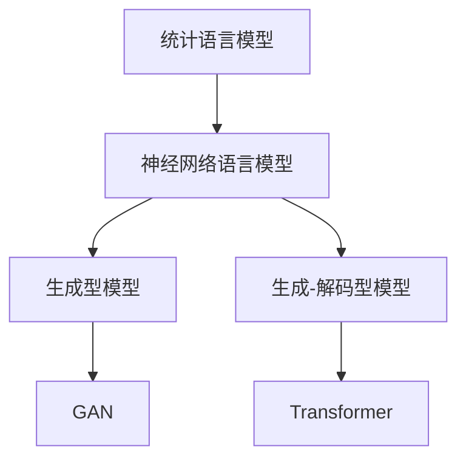
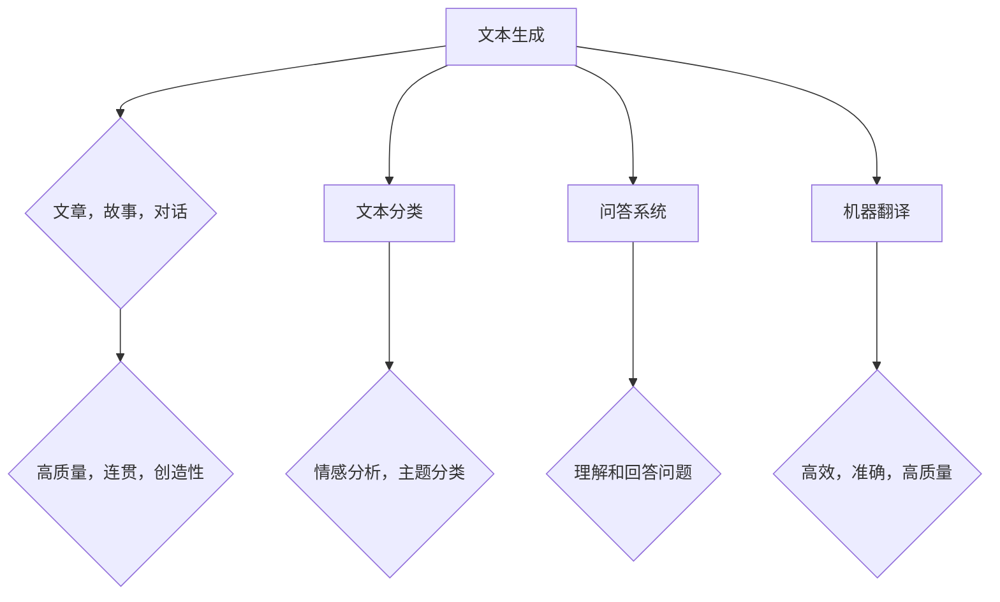
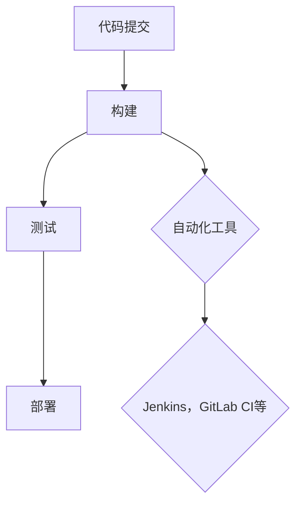
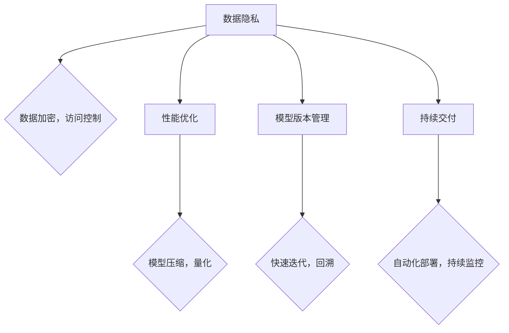
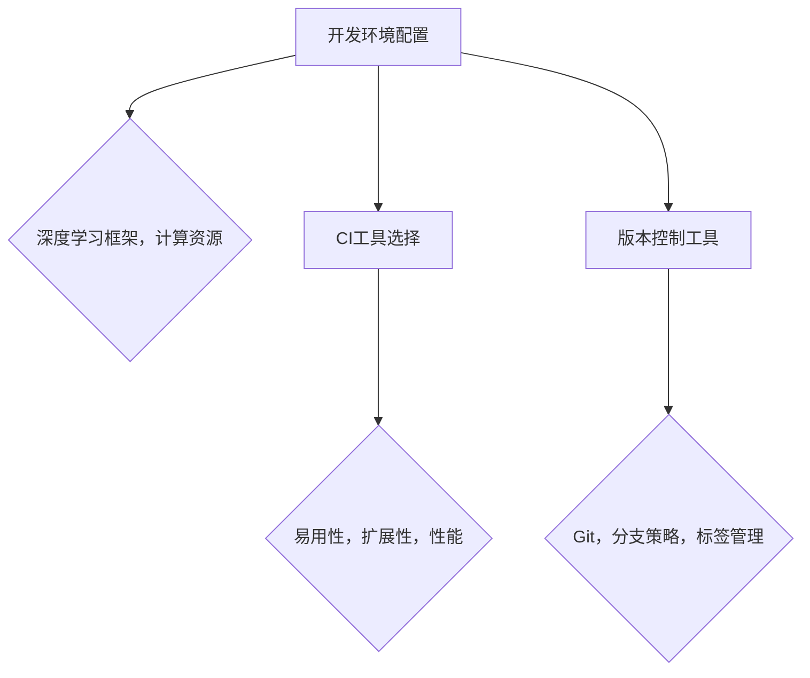
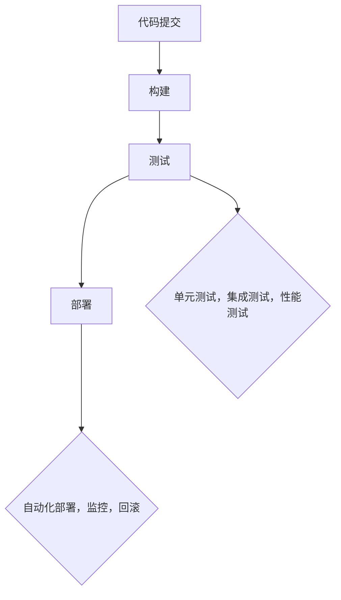
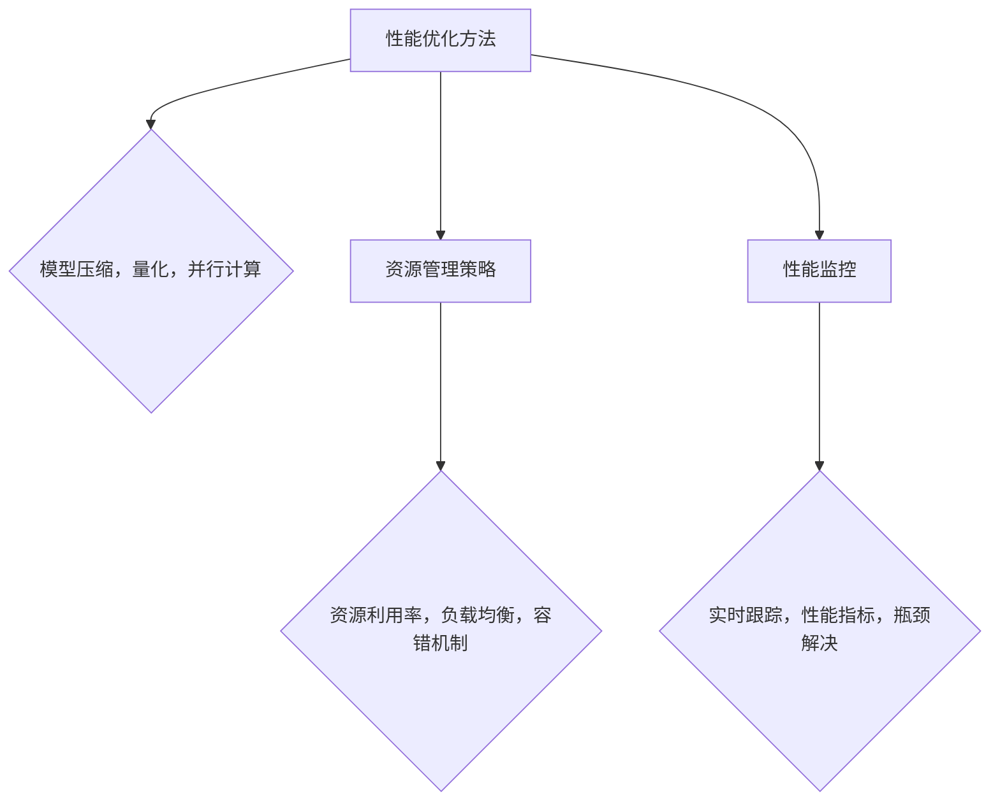

                 

### 文章标题：LLM应用的持续集成最佳实践

#### 文章关键词：
- 大型语言模型（LLM）
- 持续集成（CI）
- 持续交付（CD）
- 预训练模型
- 自动化测试
- 环境配置
- 性能优化
- 模型版本管理

#### 文章摘要：
本文将探讨如何将大型语言模型（LLM）应用于持续集成（CI）的最佳实践。我们首先介绍LLM的基本概念和其在不同应用场景中的表现。接着，详细解析CI的基本原理，探讨其在软件开发中的作用和优势。然后，针对LLM特有的挑战，提出解决策略。最后，提供具体的CI最佳实践，包括环境配置、工具选择、持续集成流水线构建、性能优化和资源管理。通过案例分析，展示这些实践如何在实际项目中应用，并提供扩展阅读和最佳实践小结。

### 第一部分：LLM概述

#### 第1章：LLM的基本概念

1.1 LLM的定义：
大型语言模型（Large Language Model，简称LLM）是一种通过大规模预训练学习语言模式和语义的神经网络模型。它们基于深度学习技术，通过无监督学习从大量文本数据中提取知识。

1.2 LLM的原理：
LLM的核心原理是基于自注意力机制（Self-Attention Mechanism）和变分自编码器（Variational Autoencoder，VAE）等先进的人工智能算法。自注意力机制使得模型能够捕捉长文本中的关系，而变分自编码器则有助于生成高质量的文本。

1.3 LLM的主要类型：
LLM可以分为生成型模型（Generative Models）和生成-解码型模型（Generator-Decoder Models）。生成型模型，如生成对抗网络（GAN），能够生成全新的文本；而生成-解码型模型，如Transformer，则能够根据输入文本生成对应的输出文本。

1.4 LLM的发展历史：
LLM的发展可以追溯到早期的统计语言模型和神经网络语言模型。近年来，随着计算资源和数据量的增加，深度学习和自然语言处理（NLP）技术的进步，LLM取得了显著的进展，涌现出如GPT-3、BERT等代表性模型。

### Mermaid 流程图：

#### 第2章：LLM的应用场景

2.1 文本生成：
LLM在文本生成中的应用非常广泛，包括生成文章、故事、对话等。通过预训练和微调，LLM能够生成高质量、连贯且具有创造性的文本。

2.2 文本分类：
LLM可以用于文本分类任务，如情感分析、主题分类等。通过学习大量标注数据，LLM能够对未知文本进行准确的分类。

2.3 问答系统：
LLM在问答系统中的应用使得计算机能够理解和回答用户的问题。通过预训练和特定领域的微调，LLM可以提供智能化的问答服务。

2.4 机器翻译：
LLM在机器翻译中的应用使得翻译过程更加高效和准确。通过大规模双语语料库的预训练，LLM能够生成高质量的翻译文本。

### Mermaid 流程图：

### 第二部分：持续集成（CI）的基本原理

#### 第3章：持续集成的概念与优势

3.1 CI的概念：
持续集成（Continuous Integration，简称CI）是一种软件开发实践，通过将代码更改自动集成到主分支中，确保代码库始终保持一致和可运行状态。

3.2 CI与传统开发模式的区别：
与传统开发模式相比，CI强调自动化和持续性。传统模式往往依赖于手动合并代码和进行测试，而CI通过自动化工具实现代码的合并、构建和测试。

3.3 CI的优势：
CI带来了一系列显著的优势，包括提高开发效率、减少错误、加快发布速度等。通过自动化流程，CI有助于及早发现问题并快速修复。

3.4 CI的实施流程：
CI的实施流程包括代码提交、构建、测试和部署。自动化工具（如Jenkins、GitLab CI等）在整个流程中发挥着关键作用。

### Mermaid 流程图：

### 第三部分：LLM持续集成最佳实践

#### 第4章：LLM持续集成的挑战

4.1 数据隐私：
由于LLM的训练和推理过程涉及大量敏感数据，数据隐私成为一个关键挑战。我们需要采取严格的隐私保护措施，如数据加密和访问控制。

4.2 性能优化：
LLM模型通常需要大量的计算资源，因此性能优化成为一个重要课题。我们可以通过模型压缩、量化等技术来提高性能。

4.3 模型版本管理：
随着LLM的应用不断演进，模型版本管理变得尤为重要。我们需要建立一套完善的模型版本管理体系，以便快速迭代和回溯。

4.4 持续交付：
持续交付（Continuous Delivery，简称CD）是CI的自然延伸。通过自动化部署和持续监控，我们可以确保LLM应用的高可用性和可靠性。

### Mermaid 流程图：

### 第四部分：LLM持续集成最佳实践

#### 第5章：环境配置与工具选择

5.1 开发环境配置：
为了确保LLM应用的可重复性和一致性，我们需要仔细配置开发环境。这包括安装深度学习框架、配置计算资源等。

5.2 CI工具选择：
选择合适的CI工具对于LLM应用的持续集成至关重要。我们需要考虑工具的易用性、扩展性和性能。

5.3 版本控制工具：
版本控制是CI的核心环节。我们需要选择适合的版本控制工具（如Git），并建立合理的分支策略和标签管理。

### Mermaid 流程图：

#### 第6章：持续集成流水线

6.1 持续集成流水线构建：
持续集成流水线是CI的核心，它包括代码提交、构建、测试和部署等环节。我们需要设计一个高效的流水线，确保每个环节都能自动化执行。

6.2 自动化测试：
自动化测试是确保LLM应用质量的关键。我们需要编写和执行一系列测试用例，包括单元测试、集成测试和性能测试。

6.3 持续交付：
通过持续交付，我们可以将LLM应用快速、安全地部署到生产环境。这包括自动化部署脚本、监控和回滚机制。

### Mermaid 流程图：

#### 第7章：性能优化与资源管理

7.1 性能优化方法：
为了提高LLM应用的性能，我们可以采用多种优化方法，如模型压缩、量化、并行计算等。

7.2 资源管理策略：
合理分配和管理计算资源对于LLM应用的持续集成至关重要。我们需要考虑资源的利用率、负载均衡和容错机制。

7.3 性能监控：
性能监控可以帮助我们实时跟踪LLM应用的性能指标，及时发现和解决性能瓶颈。

### Mermaid 流程图：

#### 第8章：实战案例

8.1 案例一：文本生成应用
我们以文本生成应用为例，展示如何将LLM应用于持续集成，并实现自动化测试和部署。

8.2 案例二：问答系统应用
通过问答系统应用案例，探讨如何在持续集成过程中优化性能，并实现高效的模型版本管理。

8.3 案例三：机器翻译应用
机器翻译应用案例将展示如何利用LLM实现自动化测试、持续交付和性能监控。

### 附录

#### 附录A：常用工具和资源列表
A.1 深度学习框架
A.2 CI工具
A.3 版本控制工具

### 作者信息：
作者：AI天才研究院/AI Genius Institute & 禅与计算机程序设计艺术 /Zen And The Art of Computer Programming

### 结束

---

现在，我已经完成了文章标题、关键词、摘要以及目录大纲的设计。接下来，我将逐步撰写每章的内容，确保满足完整性要求和包含核心概念、原理讲解、数学模型、项目实战以及最佳实践小结。文章的总字数将控制在8000到12000字之间。如果您有任何具体的建议或要求，请随时告知我。我们将一起确保文章的质量和完整性。下一步，我将开始撰写第1章“LLM的基本概念”的具体内容。请稍等。

