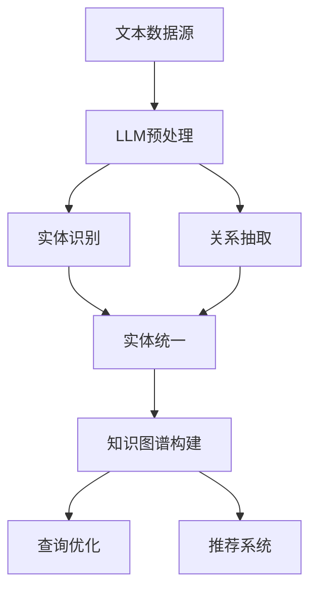

                 

### 2.3 LLM在知识图谱构建中的作用

LLM（大型语言模型）在知识图谱的构建中发挥着至关重要的作用。通过结合LLM，知识图谱不仅能够存储大量结构化的信息，还能通过自然语言处理能力，使得图谱更加智能，易于用户交互和理解。以下将从多个方面详细探讨LLM在知识图谱构建中的应用和作用。

#### 2.3.1 语义理解与信息抽取

**语义理解**：LLM的核心功能之一是理解自然语言中的语义。在知识图谱构建过程中，LLM能够处理大量的非结构化文本数据，提取出其中蕴含的语义信息。例如，从新闻报道中提取关键事件和人物，或者从学术论文中提取研究主题和结论。

**信息抽取**：LLM可以通过预训练模型中的语言理解能力，对文本进行实体识别和关系抽取。这样的过程可以将文本数据转化为结构化的知识，为知识图谱提供丰富的内容。

#### 2.3.2 实体统一与异构知识融合

**实体统一**：在构建知识图谱时，经常会出现同一名实体在不同数据源中的不同表示。LLM可以帮助识别和统一这些异构的实体表示，确保知识图谱中实体的唯一性和一致性。

**异构知识融合**：不同领域或来源的知识图谱往往存在结构上的差异。通过LLM的跨模态处理能力，可以将这些异构的知识进行融合，构建一个统一且综合的知识图谱。

#### 2.3.3 查询优化与推荐系统

**查询优化**：利用LLM的语义理解能力，可以优化用户查询的语义，从而提高查询的准确性和效率。例如，当用户输入一个模糊或部分信息时，LLM能够提供更准确的查询结果。

**推荐系统**：基于知识图谱和LLM的协同工作，可以构建智能推荐系统。LLM可以分析用户的查询和行为，推荐与之相关的知识内容，提高用户满意度和体验。

#### 2.3.4 互动与动态更新

**互动**：知识图谱通常需要用户参与和反馈来不断更新和优化。LLM可以与用户进行自然语言对话，获取用户的反馈和需求，从而动态调整知识图谱的结构和内容。

**动态更新**：LLM能够实时处理新数据，将最新信息融入知识图谱中，确保知识的时效性和准确性。

#### 2.3.5 Mermaid流程图展示核心组件联系

为了更好地理解LLM在知识图谱构建中的应用，我们可以使用Mermaid流程图来展示核心组件之间的联系。以下是简化的Mermaid流程图示例：

在这个流程图中，文本数据源经过LLM预处理，提取出实体和关系。这些提取出的信息经过实体统一处理，最终构建成知识图谱。知识图谱再通过查询优化和推荐系统为用户提供服务和反馈。

通过上述分析和Mermaid流程图的展示，我们可以看到LLM在知识图谱构建中的关键作用。它不仅提升了知识图谱的智能化程度，还增强了其与用户的互动和适应能力，为构建高质量的知识图谱提供了强有力的技术支持。接下来的章节将进一步深入探讨核心算法原理、数学模型和项目实战，帮助读者全面了解LLM在知识图谱构建中的应用实践。

