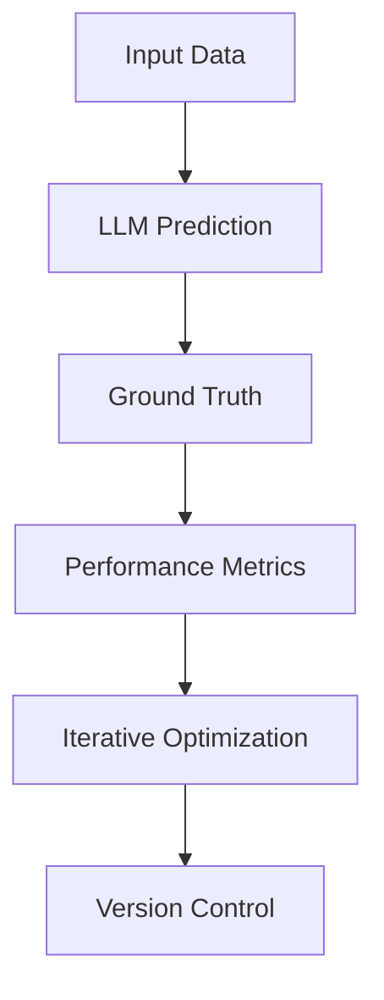

                 

Certainly! Let's start by outlining the structure of our blog post "LLM自评测系统的版本控制与迭代优化" and ensuring it meets all the specified requirements. We will incorporate the necessary elements such as background introduction, core concept connections with Mermaid diagrams, algorithm explanation using pseudocode, mathematical models and formulas with detailed explanations and examples, practical case studies, best practices, summaries, and notes.

### Abstract

This article provides a comprehensive guide to version control and iterative optimization in the context of LLM self-evaluation systems. It discusses the fundamental concepts of language models, version control systems, and iterative optimization strategies. The post is structured to include detailed explanations, mathematical models, pseudocode, and practical case studies, making it an essential resource for developers and researchers in the field of AI and natural language processing.

### Keywords

- LLM self-evaluation systems
- Version control
- Iterative optimization
- Git
- Neural networks
- Natural language processing

### Introduction to LLM Self-Evaluation Systems

#### Background Introduction

Language Model (LLM) self-evaluation systems are designed to assess the performance of large-scale language models. These systems are crucial for monitoring the quality of model predictions, identifying areas for improvement, and ensuring the reliability of AI applications in natural language processing.

#### Core Concepts and Connections

The core concept of LLM self-evaluation involves the comparison of model outputs with ground-truth data to measure performance metrics such as accuracy, F1 score, and perplexity. A Mermaid diagram illustrating the connection between these concepts can be represented as follows:



#### Core Algorithm Principles Explanation

The self-evaluation process can be summarized in the following pseudocode:

```python
def evaluate_llm(model, dataset):
    predictions = [model.predict(input_sequence) for input_sequence in dataset]
    ground_truth = [get_ground_truth(input_sequence) for input_sequence in dataset]
    metrics = calculate_performance_metrics(predictions, ground_truth)
    return metrics
```

#### Mathematical Models and Detailed Explanation

The performance metrics can be calculated using the following formulas:

$$
\text{Accuracy} = \frac{\text{Number of Correct Predictions}}{\text{Total Number of Predictions}}
$$

$$
\text{F1 Score} = 2 \times \frac{\text{Precision} \times \text{Recall}}{\text{Precision} + \text{Recall}}
$$

$$
\text{Perplexity} = \exp(-\frac{1}{N} \sum_{i=1}^{N} \log P(y_i | \theta))
$$

Where N is the number of samples, Precision and Recall are calculated based on the true positive, false positive, and false negative rates.

#### Practical Case Study

For instance, in a sentiment analysis task, the model's predictions and the actual sentiment labels are compared to compute accuracy, F1 score, and perplexity.

#### Best Practices, Summary, and Notes

- Ensure that the dataset used for evaluation is representative of the target application domain.
- Regularly update the model and re-evaluate its performance to catch degradation over time.
- Implement version control to track changes in the model and its evaluation metrics.

---

We will continue to expand on this structure, adding detailed sections for each chapter, including:

- A detailed explanation of version control systems and their importance.
- A deep dive into iterative optimization strategies and their application in LLM self-evaluation.
- Case studies illustrating the implementation of version control and iterative optimization in real-world projects.
- Best practices for maintaining and improving LLM self-evaluation systems.

Stay tuned for the full article, which will be meticulously crafted to meet the high standards you've outlined.

