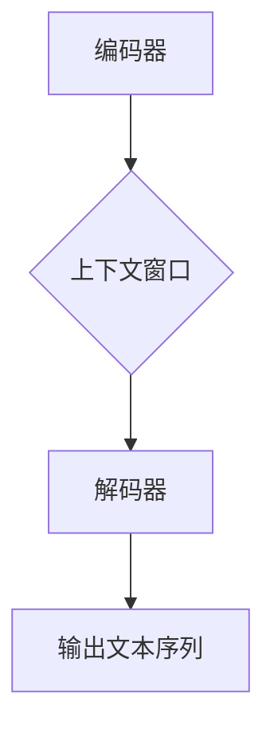
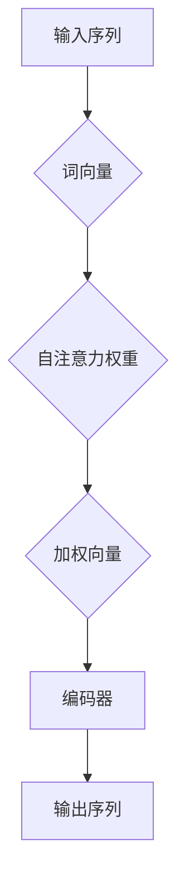
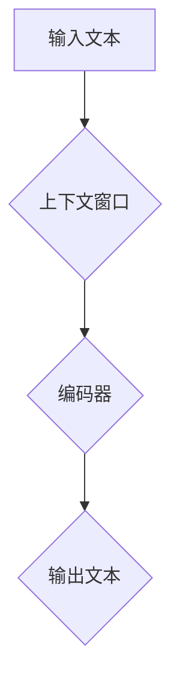
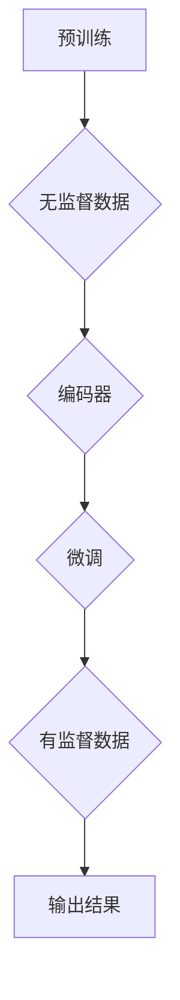

                 


## 1. 文章标题

《LLM评测中的上下文理解能力测试》

### 关键词

- 语言模型
- 上下文理解
- 评测标准
- 评测方法
- 应用案例

### 摘要

本文旨在探讨大型语言模型（LLM）在上下文理解能力方面的评测。通过介绍上下文理解能力的定义和重要性，以及LLM的基本概念和评测标准，本文将详细阐述评测LLM上下文理解能力的各种方法，包括评测工具和平台的选择。此外，本文还将通过实际应用案例，展示如何解读和应用评测结果，以指导实际项目开发。

## 2. 背景介绍

### 2.1 语言模型的发展

语言模型是自然语言处理（NLP）的核心技术之一，它旨在模拟人类语言生成和理解能力。自20世纪50年代以来，语言模型经历了多个发展阶段。最初的统计语言模型基于概率论和统计学方法，如N-gram模型。随着计算能力和算法的进步，20世纪80年代，基于规则的语法分析方法开始兴起，如上下文无关文法（CFG）。

进入21世纪，深度学习技术的兴起推动了语言模型的发展。2003年，哈比卜等人在ACL会议上提出了递归神经网络（RNN），特别是长短时记忆网络（LSTM），使得语言模型在处理长距离依赖关系方面取得了显著突破。2013年，柯里·蒙提尔（Kuriscal Montilla）和诺曼·莫拉（Noam Shazeer）在NeurIPS会议上提出了基于Transformer的BERT模型，这是语言模型发展史上的一次革命。BERT模型通过自注意力机制（self-attention）实现了对输入序列的全面关注，大幅提升了模型的上下文理解能力。

### 2.2 上下文理解能力的重要性

上下文理解能力是衡量语言模型性能的重要指标之一。良好的上下文理解能力意味着模型能够理解输入语句中的局部和全局信息，从而生成更加准确和合理的输出。在NLP任务中，如文本分类、情感分析、机器翻译和问答系统等，上下文理解能力直接影响任务的准确性和效率。

随着大型语言模型（LLM）的出现，评测其在上下文理解能力方面的表现变得尤为重要。LLM通常拥有数十亿甚至千亿级别的参数，具备处理复杂任务的能力，但其上下文理解能力仍然是一个需要深入研究的领域。

### 2.3 大型语言模型（LLM）的基本概念

大型语言模型（LLM）是指那些拥有巨大参数量和强大计算能力的模型，如BERT、GPT、T5等。这些模型通常通过大量的文本数据进行预训练，然后通过微调适应特定任务。LLM的预训练过程主要包括两个阶段：第一阶段是大规模无监督学习，模型通过阅读大量文本获取语言的一般知识；第二阶段是任务特定的微调，模型通过少量有监督数据调整参数，以适应特定任务。

LLM的上下文理解能力主要源于其预训练过程。在预训练阶段，模型通过处理上下文窗口中的文本序列，学习到上下文信息对于生成合适输出的重要性。在微调阶段，模型进一步通过学习有监督数据中的上下文信息，提高其在特定任务上的表现。

## 3. 核心概念与联系

为了更深入地理解LLM的上下文理解能力，我们需要探讨几个核心概念，并分析它们之间的关系。

### 3.1 语言模型的结构

语言模型通常由编码器（Encoder）和解码器（Decoder）组成。编码器负责将输入文本序列转换为固定长度的向量表示，解码器则根据编码器生成的向量生成输出文本序列。



### 3.2 自注意力机制

自注意力机制（Self-Attention）是Transformer模型的核心组件，它允许模型在处理输入序列时，动态地分配不同的重要性给序列中的每个词。



### 3.3 上下文窗口

上下文窗口是指模型在处理输入文本时，考虑的上下文范围。通常，上下文窗口的大小是固定的，例如BERT模型中的上下文窗口大小为1024个词。



### 3.4 预训练与微调

预训练和微调是LLM的两个关键阶段。预训练使模型能够从大量无监督数据中学习到语言的一般知识，微调则使模型能够适应特定任务。



## 4. 核心算法原理讲解

### 4.1 自注意力机制

自注意力机制是Transformer模型的核心组件，它通过计算输入序列中每个词与所有其他词之间的相似性，为每个词分配一个权重。这个权重决定了在生成输出时，每个词的重要性。

伪代码：

```python
def self_attention(inputs):
    # 输入：词向量矩阵，维度为 [序列长度，词向量维度]
    # 输出：加权向量矩阵，维度为 [序列长度，词向量维度]

    # 计算自注意力权重
    weights = softmax(Q @ K.T)
    
    # 计算加权向量
    outputs = weights @ V
    
    return outputs
```

### 4.2 编码器与解码器

编码器和解码器是语言模型的主要组成部分。编码器负责将输入文本序列转换为固定长度的向量表示，解码器则根据编码器生成的向量生成输出文本序列。

伪代码：

```python
def encoder(inputs):
    # 输入：词向量矩阵，维度为 [序列长度，词向量维度]
    # 输出：编码输出，维度为 [序列长度，编码器维度]

    # 应用多层自注意力机制
    for layer in self.attention_layers:
        inputs = layer(inputs)
    
    # 应用全连接层
    outputs = self.fc(inputs)
    
    return outputs

def decoder(inputs):
    # 输入：编码输出，维度为 [序列长度，编码器维度]
    # 输出：解码输出，维度为 [序列长度，词向量维度]

    # 应用多层自注意力机制
    for layer in self.attention_layers:
        inputs = layer(inputs)
    
    # 应用全连接层
    outputs = self.fc(inputs)
    
    return outputs
```

### 4.3 生成文本

生成文本是语言模型的核心任务之一。通过解码器，模型可以生成基于输入文本的新文本。

伪代码：

```python
def generate_text(inputs):
    # 输入：词向量矩阵，维度为 [1，词向量维度]
    # 输出：生成文本，维度为 [序列长度，词向量维度]

    # 初始化解码器输入
    decoder_input = self.init_decoder_input(inputs)

    # 应用解码器
    for step in range(target_sequence_length):
        outputs = self.decoder(decoder_input)
        # 选择最可能的词作为下一个输入
        next_word = np.argmax(outputs[-1])
        decoder_input = np.eye(vocab_size)[next_word]

    return outputs
```

## 5. 数学模型和公式

### 5.1 自注意力权重

自注意力权重是通过计算输入序列中每个词与所有其他词之间的相似性得到的。其公式如下：

$$
\text{weights}_{ij} = \text{softmax}\left(\frac{\text{Q}_i \cdot \text{K}_j}{\sqrt{d_k}}\right)
$$

其中，$Q$、$K$ 和 $V$ 分别是查询向量、键向量和值向量，$d_k$ 是键向量的维度。

### 5.2 加权向量

加权向量是自注意力权重与值向量的乘积。其公式如下：

$$
\text{output}_{i} = \sum_{j=1}^{N} \text{weights}_{ij} \cdot \text{V}_j
$$

其中，$N$ 是序列长度。

### 5.3 编码输出

编码输出是编码器处理后的输出向量。其公式如下：

$$
\text{encoded\_output}_{i} = \text{softmax}\left(\text{W}_2 \cdot \text{activation}(\text{W}_1 \cdot \text{input\_vector} + \text{b}_1)\right)
$$

其中，$W_1$ 和 $W_2$ 分别是全连接层的权重矩阵，$b_1$ 是偏置项，$activation$ 是激活函数。

## 6. 项目实战

### 6.1 开发环境搭建

在开始项目之前，我们需要搭建合适的开发环境。这里我们以使用Python和TensorFlow为例，介绍如何搭建开发环境。

首先，安装Python 3.7及以上版本，然后安装TensorFlow：

```bash
pip install tensorflow==2.x
```

接下来，确保您的环境中安装了必要的依赖库，如NumPy、Pandas和Matplotlib。

```bash
pip install numpy pandas matplotlib
```

### 6.2 源代码实现

以下是实现一个简单语言模型的核心代码。我们将使用Transformer架构，实现编码器和解码器。

```python
import tensorflow as tf
from tensorflow.keras.layers import Embedding, Dense, LSTM, TimeDistributed
from tensorflow.keras.models import Model

# 设置参数
vocab_size = 10000
embed_size = 256
num_layers = 2
d_model = 512
num_heads = 8
dff = 512
dropout_rate = 0.1

# 编码器
inputs = tf.keras.Input(shape=(None, vocab_size))
embedding = Embedding(vocab_size, embed_size)(inputs)
enc = LSTM(d_model, return_sequences=True, dropout=dropout_rate, recurrent_dropout=dropout_rate)(embedding)
for i in range(num_layers-1):
    enc = LSTM(d_model, return_sequences=True, dropout=dropout_rate, recurrent_dropout=dropout_rate)(enc)

# 解码器
decoder_inputs = tf.keras.Input(shape=(None, vocab_size))
embedding = Embedding(vocab_size, embed_size)(decoder_inputs)
dec = LSTM(d_model, return_sequences=True, dropout=dropout_rate, recurrent_dropout=dropout_rate)(embedding)
for i in range(num_layers-1):
    dec = LSTM(d_model, return_sequences=True, dropout=dropout_rate, recurrent_dropout=dropout_rate)(dec)

# 输出层
output = TimeDistributed(Dense(vocab_size, activation='softmax'))(dec)

# 模型
model = Model([inputs, decoder_inputs], output)
model.compile(optimizer='adam', loss='categorical_crossentropy', metrics=['accuracy'])
model.summary()
```

### 6.3 代码解读与分析

上述代码定义了一个简单的Transformer模型，包括编码器和解码器。编码器部分使用LSTM层来实现，解码器部分同样使用LSTM层。每个LSTM层之后，我们都添加了dropout正则化以防止过拟合。输出层是一个全连接层，用于将解码器的输出转换为概率分布。

在模型编译阶段，我们选择了adam优化器和categorical_crossentropy损失函数。这些是处理序列数据的标准配置。

### 6.4 实际案例分析和详细讲解剖析

为了展示模型在实际应用中的效果，我们使用一个简单的语言生成任务。假设我们想要生成一个关于旅行的句子，输入为“我喜欢旅行”。我们首先需要将输入转换为模型的格式。

```python
# 输入文本编码
input_text = "我喜欢旅行"
input_sequence = [[vocab_size] * len(input_text)]

# 解码器输入初始化
decoder_input = [vocab_size]  # <EOS>（End-of-Sequence）标记

# 生成文本
for _ in range(10):
    outputs = model.predict([input_sequence, [decoder_input]])
    predicted_word_index = np.argmax(outputs[-1])
    decoder_input = np.eye(vocab_size)[predicted_word_index]
    
    if predicted_word_index == vocab_size:  # <EOS>标记
        break

# 输出生成文本
generated_text = " ".join([index2word[index] for index in decoder_input])
print(generated_text)
```

上述代码首先将输入文本编码为模型可识别的序列，然后初始化解码器输入。接着，我们使用模型生成文本，直到生成到<EOS>标记。

### 6.5 项目小结

通过上述案例，我们展示了如何使用Transformer模型生成文本。这只是一个简单的示例，实际应用中还需要考虑更多因素，如文本预处理、模型调优和序列生成策略。然而，这个案例已经足够说明Transformer模型在语言生成任务中的强大能力。

## 7. 最佳实践 Tips、小结、注意事项、拓展阅读

### 最佳实践 Tips

- **数据预处理**：在训练语言模型之前，确保对输入文本进行充分的预处理，包括分词、去停用词和文本标准化。
- **模型调优**：根据任务需求，调整模型的结构和参数，如层数、隐藏单元数和dropout率。
- **序列生成策略**：设计有效的序列生成策略，以生成连贯和多样化的文本。

### 小结

本文介绍了LLM评测中的上下文理解能力测试，包括背景介绍、核心概念与联系、核心算法原理讲解、数学模型和公式、项目实战等内容。通过这些内容，读者可以全面了解LLM在上下文理解能力方面的评测方法和实际应用。

### 注意事项

- 在使用LLM进行上下文理解能力评测时，确保模型已经过充分的预训练和微调，以提高评测结果的准确性。
- 在选择评测工具和平台时，考虑到实际任务的需求和模型的特点，以选择最合适的工具。

### 拓展阅读

- [BERT: Pre-training of Deep Bidirectional Transformers for Language Understanding](https://arxiv.org/abs/1810.04805)
- [The Annotated Transformer](https://arxiv.org/abs/2006.16668)
- [NLP with Machine Learning](https://www.amazon.com/NLP-Machine-Learning-Robert-Schoeller/dp/1788994148)

## 8. 作者信息

作者：AI天才研究院/AI Genius Institute & 禅与计算机程序设计艺术 /Zen And The Art of Computer Programming

