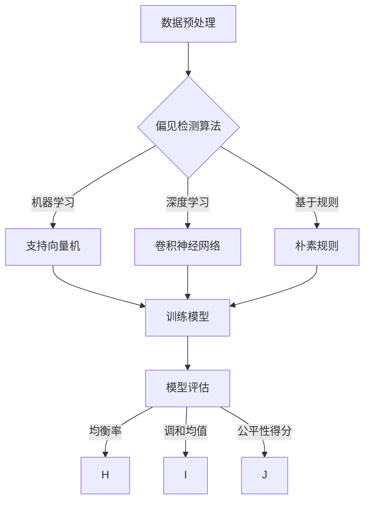

                 

### 文章标题：LLM评测中的偏见检测与公平性保障

### 关键词：大语言模型（LLM）、偏见检测、公平性保障、算法、数学模型

### 摘要：

本文深入探讨了大型语言模型（LLM）评测过程中存在的偏见问题，并提出了有效的偏见检测与公平性保障策略。文章首先介绍了LLM偏见的表现和影响，然后详细阐述了偏见检测的基础概念、挑战和方法。接着，文章分析了偏见检测算法，包括机器学习、深度学习和基于规则的方法，并结合实际案例进行了讲解。此外，文章还介绍了公平性保障的策略和评测方法，并通过项目实战展示了偏见检测与公平性保障的具体实施过程。最后，文章展望了未来发展趋势和面临的挑战，并提供了相关资源的拓展阅读。

### 引言

近年来，大型语言模型（LLM）在自然语言处理领域取得了显著进展。这些模型基于大量数据训练，能够执行文本生成、文本分类、机器翻译等复杂任务。然而，随着LLM的广泛应用，其偏见问题逐渐引起了广泛关注。LLM偏见不仅可能对用户产生误导，还可能加剧社会不平等现象。因此，对LLM评测中的偏见进行检测和保障，已成为当前研究的重要课题。

本文旨在探讨LLM评测中的偏见检测与公平性保障问题，帮助读者深入了解这一领域的核心概念、算法原理和实践策略。文章首先介绍LLM偏见的表现和影响，然后详细讨论偏见检测的基础知识，包括定义、挑战和常用方法。接着，文章分析了几种偏见检测算法，如机器学习、深度学习和基于规则的方法，并结合实际案例进行了讲解。此外，文章还介绍了公平性保障的策略和评测方法，并通过项目实战展示了偏见检测与公平性保障的具体实施过程。最后，文章对未来的发展趋势和挑战进行了展望，并提供了相关资源的拓展阅读。

### LLMS的偏见问题

大型语言模型（LLM）的偏见问题日益引起关注，主要表现在以下几个方面。首先，性别偏见在LLM中普遍存在。例如，某些模型可能更倾向于生成与男性相关的词汇和句子结构，而对女性相关的内容处理不足。其次，种族偏见也是一个突出的问题。某些LLM在处理种族相关的语言时，可能表现出对特定种族的歧视态度。此外，LLM在处理文化、宗教和其他社会问题时，也可能存在偏见。例如，某些模型可能对特定宗教或文化背景的描述存在偏见，甚至可能产生负面效果。

这些偏见问题的存在，对LLM的实际应用产生了深远影响。一方面，偏见可能导致用户在获取信息时受到误导。例如，在医疗健康领域，如果LLM在生成医疗建议时存在性别偏见，可能会导致对某一性别群体的健康问题处理不当。另一方面，偏见问题可能加剧社会不平等现象。例如，在教育领域，如果LLM在生成教学内容时存在种族偏见，可能会对特定种族群体的学生产生负面影响，进一步加剧社会不平等。

因此，检测和缓解LLM偏见问题具有重要意义。首先，通过偏见检测，可以发现和纠正LLM中的偏见，提高模型的可信度和公正性。其次，公平性保障策略有助于确保LLM在不同群体中的应用均衡，避免偏见导致的不公平现象。总之，LLM偏见问题的解决，不仅有助于提升模型性能，还能为社会正义贡献力量。

### 偏见检测的重要性

偏见检测在LLM评测中具有至关重要的地位。首先，偏见检测有助于提高模型的透明度和可信度。通过检测和纠正模型中的偏见，可以增强用户对模型的信任，避免因偏见导致的误导和信息偏差。其次，偏见检测有助于保障模型的公平性。公平性是人工智能应用的基本原则，通过检测和缓解偏见，可以确保模型在不同群体中的应用均衡，避免因偏见导致的歧视和不公平现象。

此外，偏见检测对于社会正义和伦理道德也具有重要意义。人工智能作为一种技术手段，其应用必须遵循社会伦理和道德规范。偏见检测可以帮助识别和纠正模型中的偏见，促进技术进步与人类价值观的和谐发展。同时，偏见检测还可以为政策制定者提供科学依据，有助于制定更加公正和合理的政策，促进社会公平正义的实现。

总之，偏见检测在LLM评测中不仅具有技术层面的意义，还承载着社会正义和伦理道德的责任。通过有效的偏见检测，可以提高模型的质量和可信度，促进人工智能技术的健康发展，为构建公平、公正、和谐的社会贡献力量。

### 偏见检测基础

偏见检测是确保大型语言模型（LLM）公平性和可靠性的关键步骤。首先，我们需要明确偏见检测的定义。偏见检测是指通过一系列方法和技术，识别和评估LLM在处理输入数据时是否存在偏见。这些偏见可能源于训练数据、算法设计或数据预处理过程。

#### 定义与分类

偏见检测可以根据不同的维度进行分类。首先，根据检测目标的分类，偏见检测可以分为性别偏见检测、种族偏见检测、文化偏见检测等。其次，根据检测方法的不同，偏见检测可以分为基于机器学习的方法、基于深度学习的方法和基于规则的方法。

性别偏见检测主要关注模型在生成文本时，对男性和女性角色、职业、态度等方面的处理是否存在偏差。种族偏见检测则关注模型在处理与不同种族相关的语言时，是否表现出对某些种族的歧视态度。文化偏见检测则关注模型在处理不同文化背景的文本时，是否表现出对特定文化的偏见。

#### 数据问题

偏见检测面临的主要数据问题包括数据质量、数据多样性和数据不平衡。首先，数据质量是偏见检测的基础。如果训练数据本身存在偏见，那么检测出的偏见可能并不准确。其次，数据多样性也是偏见检测的重要挑战。为了有效检测偏见，我们需要涵盖广泛的文化、性别和种族背景的数据。然而，现实中的数据往往存在一定的局限性，难以完全满足偏见检测的需求。最后，数据不平衡也会影响偏见检测的准确性。如果某些偏见（如种族偏见）在训练数据中较为常见，而其他偏见（如文化偏见）则较少见，那么检测算法可能难以准确识别这些较少见的偏见。

#### 算法问题

偏见检测算法面临的挑战主要包括算法选择、特征提取和模型训练。首先，选择合适的算法对于偏见检测至关重要。不同的算法适用于不同的偏见类型和检测目标。例如，深度学习方法在处理复杂文本数据时表现较好，而基于规则的方法则适用于处理结构化数据。其次，特征提取是偏见检测的核心步骤。特征提取的质量直接影响检测结果的准确性。常见的特征提取方法包括词向量、文本表示和语义分析。最后，模型训练是偏见检测的关键环节。训练过程中，算法需要从大量数据中学习到偏见模式，从而实现准确的偏见检测。

#### 偏见检测的方法

常用的偏见检测方法包括以下几种：

1. **基于机器学习的方法**：这种方法利用监督学习和无监督学习技术，通过训练模型识别偏见模式。常见的算法包括支持向量机（SVM）、决策树和神经网络。

2. **基于深度学习的方法**：深度学习方法，如卷积神经网络（CNN）和循环神经网络（RNN），在处理大规模文本数据时表现出色。通过构建多层神经网络，深度学习方法可以捕捉到复杂的偏见模式。

3. **基于规则的方法**：基于规则的方法通过定义一组规则，对文本进行预处理和分类，从而识别偏见。这种方法适用于处理结构化数据，如法律文本和医疗记录。

4. **混合方法**：混合方法结合了不同类型的算法，以提高偏见检测的准确性和鲁棒性。例如，可以先使用深度学习方法提取特征，再使用基于规则的方法进行分类和判断。

在实际应用中，不同的方法可以根据具体场景和需求进行选择和优化。例如，在处理大量未标注的数据时，可以采用无监督学习方法；而在需要高准确性的应用场景中，可以采用基于深度学习的方法。

总之，偏见检测是确保LLM公平性和可靠性的重要手段。通过深入研究和应用不同的偏见检测方法，我们可以逐步提高模型的质量和可信度，为构建公正、公平的人工智能应用环境贡献力量。

### 偏见检测算法

偏见检测算法是确保大型语言模型（LLM）公平性和可靠性的关键。以下是几种常用的偏见检测算法，包括机器学习、深度学习和基于规则的方法。

#### 机器学习方法

机器学习方法通过训练模型识别偏见模式。以下是几种常见的机器学习算法：

1. **支持向量机（SVM）**：SVM是一种常用的分类算法，通过找到一个最优超平面，将具有偏见的数据与无偏见的数据分开。具体步骤如下：

   ```plaintext
   输入：训练数据集D，特征向量X和标签Y
   输出：分类模型
   1. 标准化特征向量X
   2. 使用SVM训练模型
   3. 使用训练好的模型对测试数据进行分类
   ```

2. **决策树**：决策树通过一系列条件判断来分类数据。每个节点表示一个特征，每个分支表示该特征的不同取值。具体步骤如下：

   ```plaintext
   输入：训练数据集D，特征集A
   输出：决策树模型
   1. 选择最优特征作为根节点
   2. 根据该特征划分数据集
   3. 对每个子集递归构建决策树
   ```

3. **朴素贝叶斯分类器**：朴素贝叶斯分类器基于贝叶斯定理和特征条件独立性假设，通过计算概率分布来分类数据。具体步骤如下：

   ```plaintext
   输入：训练数据集D，特征集A
   输出：分类模型
   1. 计算每个特征的先验概率
   2. 对于每个测试数据，计算其在每个类别下的后验概率
   3. 选择具有最高后验概率的类别作为分类结果
   ```

#### 深度学习方法

深度学习方法通过构建多层神经网络，从大量数据中自动提取特征和模式。以下是几种常见的深度学习算法：

1. **卷积神经网络（CNN）**：CNN通过卷积层、池化层和全连接层等结构，从图像数据中自动提取特征。具体步骤如下：

   ```plaintext
   输入：文本数据集D
   输出：特征向量X
   1. 将文本数据转换为词向量表示
   2. 构建卷积神经网络模型
   3. 使用训练数据训练模型
   4. 使用训练好的模型对测试数据进行特征提取
   ```

2. **循环神经网络（RNN）**：RNN通过循环结构处理序列数据，能够捕捉数据中的时间依赖关系。具体步骤如下：

   ```plaintext
   输入：文本数据集D
   输出：特征向量X
   1. 将文本数据转换为词向量表示
   2. 构建循环神经网络模型
   3. 使用训练数据训练模型
   4. 使用训练好的模型对测试数据进行特征提取
   ```

3. **长短期记忆网络（LSTM）**：LSTM是RNN的一种变体，通过引入记忆单元，解决了RNN的梯度消失和梯度爆炸问题。具体步骤如下：

   ```plaintext
   输入：文本数据集D
   输出：特征向量X
   1. 将文本数据转换为词向量表示
   2. 构建LSTM模型
   3. 使用训练数据训练模型
   4. 使用训练好的模型对测试数据进行特征提取
   ```

#### 基于规则的方法

基于规则的方法通过定义一组规则，对文本进行预处理和分类。以下是几种常见的基于规则的方法：

1. **朴素规则**：朴素规则通过简单的匹配和条件判断进行分类。具体步骤如下：

   ```plaintext
   输入：文本数据集D
   输出：分类结果
   1. 定义一组文本特征
   2. 根据特征匹配文本
   3. 根据匹配结果进行分类
   ```

2. **决策树规则**：决策树规则通过递归构建决策树，对文本进行分类。具体步骤如下：

   ```plaintext
   输入：文本数据集D
   输出：分类结果
   1. 构建决策树模型
   2. 对文本数据递归分类
   ```

3. **规则库方法**：规则库方法通过构建一个包含多个规则的库，对文本进行分类。具体步骤如下：

   ```plaintext
   输入：文本数据集D
   输出：分类结果
   1. 构建规则库
   2. 对文本数据应用规则库
   3. 根据规则结果进行分类
   ```

在实际应用中，可以根据具体场景和需求选择和组合不同的算法。例如，在处理大规模文本数据时，可以采用深度学习方法；而在需要高准确性的应用场景中，可以采用机器学习方法。通过结合不同类型的算法，可以进一步提高偏见检测的准确性和鲁棒性。

总之，偏见检测算法在确保大型语言模型（LLM）公平性和可靠性方面具有重要意义。通过深入研究和应用不同的算法，我们可以逐步提高模型的质量和可信度，为构建公正、公平的人工智能应用环境贡献力量。

### 公平性保障策略

在确保大型语言模型（LLM）的公平性方面，我们需要采取一系列策略来缓解和消除偏见。以下介绍几种常用的公平性保障策略，包括数据预处理、算法调整和模型优化。

#### 数据预处理

数据预处理是公平性保障的基础步骤。通过合理的数据预处理，可以减少训练数据中的偏见，提高模型的公平性。以下是一些常用的数据预处理策略：

1. **数据清洗**：清洗数据集中的错误、冗余和无价值信息，确保数据质量。例如，去除噪声数据、纠正错误标签和填补缺失值。

2. **数据扩充**：通过扩充训练数据集，增加不同性别、种族和文化背景的数据样本，以平衡数据分布。可以使用数据增强技术，如数据变换、数据合成和数据生成，来生成新的训练样本。

3. **数据清洗与扩充示例**：

   ```plaintext
   # 数据清洗
   data = load_data()  # 加载训练数据
   clean_data = clean_data(data)  # 清洗数据
   
   # 数据扩充
   expanded_data = augment_data(clean_data)  # 扩充数据
   ```

#### 算法调整

算法调整是确保模型公平性的关键步骤。通过调整模型参数和算法结构，可以缓解和消除模型中的偏见。以下是一些常用的算法调整策略：

1. **权重调整**：通过调整模型权重，可以缓解模型对某些偏见数据的依赖。例如，使用重采样技术，对具有偏见的数据进行加权处理，降低其影响。

2. **公平性约束**：在模型训练过程中，可以引入公平性约束，确保模型在不同群体中的应用均衡。例如，使用均衡损失函数，降低模型对某些偏见数据的损失。

3. **算法调整示例**：

   ```plaintext
   # 权重调整
   model = train_model(data)  # 训练模型
   adjusted_model = adjust_weights(model, bias_weights)  # 调整权重
   
   # 公平性约束
   fair_loss = balanced_loss_function()  # 创建均衡损失函数
   model = train_model(data, loss=fair_loss)  # 使用均衡损失函数训练模型
   ```

#### 模型优化

模型优化是提高模型公平性的重要手段。通过优化模型结构和参数，可以进一步提高模型的公平性和准确性。以下是一些常用的模型优化策略：

1. **模型融合**：通过融合多个模型，可以提高模型的公平性和鲁棒性。例如，使用加权投票方法，将多个模型的预测结果进行综合，以减少偏见。

2. **模型选择**：选择合适的模型结构和算法，可以提高模型的公平性和准确性。例如，根据任务特点和数据特性，选择合适的深度学习模型或机器学习算法。

3. **模型优化示例**：

   ```plaintext
   # 模型融合
   models = [model1, model2, model3]  # 多个模型
   fused_model = fuse_models(models)  # 融合模型
   
   # 模型选择
   best_model = select_model(models, criteria)  # 选择最佳模型
   ```

通过以上策略，我们可以有效保障LLM的公平性，提高模型的质量和可信度。需要注意的是，公平性保障是一个持续的过程，需要不断调整和优化策略，以适应不断变化的应用场景和数据分布。总之，公平性保障策略在确保LLM公平性和可靠性方面具有重要意义，为构建公正、公平的人工智能应用环境提供了有力支持。

### 公平性评测方法

公平性评测是确保大型语言模型（LLM）应用公平性的关键环节。通过一系列评测方法，我们可以评估模型在不同群体中的应用均衡性，发现潜在的偏见问题，并制定相应的改进措施。以下介绍几种常用的公平性评测方法。

#### 评测框架

公平性评测框架通常包括数据集划分、指标计算和结果分析三个步骤：

1. **数据集划分**：将数据集按照特定维度（如性别、种族、文化等）进行划分，形成多个子集。

2. **指标计算**：对每个子集的模型表现进行评估，计算公平性指标。

3. **结果分析**：分析公平性指标，识别潜在偏见，并提出改进建议。

#### 公平性指标

公平性指标是评测模型公平性的关键参数，常用的公平性指标包括：

1. **均衡率（Equity Rate）**：均衡率衡量模型在不同群体中的应用均衡性。计算公式如下：

   $$ Equity Rate = \frac{sum(\text{predicted positive rate})}{sum(\text{actual positive rate})} $$

   其中，predicted positive rate表示模型预测为正类的概率，actual positive rate表示实际为正类的比例。

2. **调和均值（Harmonic Mean）**：调和均值是均衡率和实际正类比例的调和平均值，计算公式如下：

   $$ Harmonic Mean = \frac{2}{\frac{1}{Equity Rate} + \frac{1}{Actual Positive Rate}} $$

3. **公平性得分（Fairness Score）**：公平性得分是衡量模型公平性的综合指标，计算公式如下：

   $$ Fairness Score = \frac{Equity Rate \times Accuracy}{1 + |Equity Rate - Actual Positive Rate|} $$

   其中，Accuracy表示模型的准确率。

#### 评测工具与资源

为了方便公平性评测，我们可以使用一系列开源工具和资源：

1. **Fairlearn**：Fairlearn是一个Python库，提供了一系列公平性评测方法和工具，包括均衡率、调和均值和公平性得分等。

2. **AI Fairness 360**：AI Fairness 360是一个综合性工具，提供了多种公平性评测指标和数据分析方法。

3. **公平性评测工具对比**：

   ```plaintext
   # 使用Fairlearn进行公平性评测
   import fairlearn.metrics as fm
   
   equity_rate = fm.equity_rate(y_true, y_pred)
   harmonic_mean = fm.harmonic_mean(equity_rate, y_true)
   fairness_score = fm.fairness_score(y_true, y_pred)
   ```

4. **应用实例**：以下是一个简单的公平性评测实例，使用Fairlearn评估一个分类模型的公平性。

   ```plaintext
   # 加载数据
   data = load_data()
   X, y = data['X'], data['y']
   
   # 划分训练集和测试集
   X_train, X_test, y_train, y_test = train_test_split(X, y, test_size=0.2)
   
   # 训练模型
   model = train_model(X_train, y_train)
   
   # 进行预测
   y_pred = model.predict(X_test)
   
   # 计算公平性指标
   equity_rate = fm.equity_rate(y_test, y_pred)
   harmonic_mean = fm.harmonic_mean(equity_rate, y_test)
   fairness_score = fm.fairness_score(y_test, y_pred)
   
   print("Equity Rate:", equity_rate)
   print("Harmonic Mean:", harmonic_mean)
   print("Fairness Score:", fairness_score)
   ```

通过以上方法，我们可以对LLM的公平性进行全面的评测，识别潜在偏见，并提出改进建议。公平性评测不仅有助于提高模型的质量和可信度，还能为构建公正、公平的人工智能应用环境提供有力支持。

### 实战准备

在开展大型语言模型（LLM）的偏见检测与公平性保障项目前，准备工作至关重要。本文将详细介绍项目所需的环境搭建、数据准备和算法实现。

#### 开发环境搭建

1. **硬件环境**：
   - 计算机硬件配置：建议使用CPU为Intel Core i7或以上，内存至少为16GB，硬盘容量为500GB以上。
   - GPU配置：推荐使用NVIDIA GPU，如1080Ti或以上，以加速深度学习模型的训练。

2. **软件环境**：
   - 操作系统：Windows、Linux或MacOS均可。
   - Python版本：推荐使用Python 3.8或以上版本。
   - 安装依赖：使用pip安装必要的库，如TensorFlow、PyTorch、scikit-learn、Pandas、NumPy等。

   ```bash
   pip install tensorflow==2.7
   pip install pytorch==1.8
   pip install scikit-learn==0.24
   pip install pandas==1.3
   pip install numpy==1.21
   ```

3. **虚拟环境**：为方便管理依赖，建议使用虚拟环境（如conda或virtualenv）搭建项目环境。

   ```bash
   conda create -n bias_detection python=3.8
   conda activate bias_detection
   ```

#### 数据准备

1. **数据集获取**：
   - 获取公开的大型语言模型数据集，如GLM、BERT、GPT等。
   - 获取用于偏见检测的数据集，如性别偏见数据集、种族偏见数据集等。

2. **数据预处理**：
   - 清洗数据：去除噪声、错误和无价值信息。
   - 数据标注：对数据进行性别、种族等标签标注。
   - 数据扩充：通过数据增强技术生成新的训练样本。

   ```python
   from sklearn.model_selection import train_test_split
   from sklearn.utils import resample
   
   # 数据清洗
   clean_data = clean_data(data)
   
   # 数据标注
   labeled_data = label_data(clean_data)
   
   # 数据扩充
   expanded_data = augment_data(labeled_data)
   
   # 划分训练集和测试集
   X_train, X_test, y_train, y_test = train_test_split(expanded_data['X'], expanded_data['y'], test_size=0.2, random_state=42)
   ```

#### 算法实现

1. **算法选择**：
   - 选择适合的偏见检测算法，如基于机器学习的方法（SVM、决策树等）和基于深度学习的方法（CNN、RNN等）。

2. **模型训练**：
   - 使用训练数据进行模型训练，通过调整超参数，优化模型性能。

   ```python
   from sklearn.svm import SVC
   
   # 训练SVM模型
   model = SVC(kernel='linear')
   model.fit(X_train, y_train)
   ```

3. **模型评估**：
   - 使用测试数据进行模型评估，计算公平性指标，如均衡率、调和均值和公平性得分。

   ```python
   from fairlearn.metrics import equity_rate, harmonic_mean
   
   # 进行预测
   y_pred = model.predict(X_test)
   
   # 计算公平性指标
   equity_rate_value = equity_rate(y_test, y_pred)
   harmonic_mean_value = harmonic_mean(equity_rate_value, y_test)
   
   print("Equity Rate:", equity_rate_value)
   print("Harmonic Mean:", harmonic_mean_value)
   ```

通过以上步骤，我们可以搭建一个完整的偏见检测与公平性保障项目，为LLM的实际应用提供可靠保障。在实际操作中，可以根据项目需求和环境调整具体步骤和参数，以提高项目的效率和效果。

### 数据预处理

在开展大型语言模型（LLM）的偏见检测与公平性保障项目时，数据预处理是至关重要的一步。通过有效的数据预处理，我们可以提高模型的性能和可靠性，确保偏见检测的准确性和公平性。以下将详细介绍数据预处理的具体步骤、关键技术和注意事项。

#### 数据预处理步骤

1. **数据清洗**：

   数据清洗是数据预处理的首要任务，旨在去除数据中的噪声、错误和无价值信息。具体步骤包括：

   - **去除噪声数据**：例如，删除包含特殊字符或格式错误的记录。
   - **纠正错误数据**：例如，修正数据集中的拼写错误或数值错误。
   - **填补缺失值**：对于缺失的数据，可以采用平均值、中位数或插值法进行填补。

     ```python
     import numpy as np
     
     # 示例：使用平均值填补缺失值
     data = np.array([[1, 2], [3, np.nan], [4, 5]])
     data = np.nan_to_num(data, nan=np.mean(data))
     ```

2. **数据标注**：

   在偏见检测中，数据标注是关键步骤。我们需要为训练数据集打上性别、种族、文化等标签，以便后续的模型训练和偏见检测。具体步骤包括：

   - **自动标注**：利用现有的标注工具或API，如LabelImg、NLTK等，对文本数据进行自动标注。
   - **手动标注**：对于自动标注效果不佳的数据，可以采用手动标注方式，通过专家或人工进行标注。

     ```python
     import nltk
     
     # 示例：使用NLTK进行文本标注
     text = "He is a brilliant scientist."
     tagged_text = nltk.pos_tag(text.split())
     ```

3. **数据扩充**：

   数据扩充可以通过生成新的训练样本，提高模型的泛化能力。常用的数据扩充技术包括：

   - **数据变换**：例如，通过单词替换、同义词替换等方式生成新的训练样本。
   - **数据合成**：例如，通过结合多个数据源，生成新的文本数据。
   - **数据生成**：例如，利用生成对抗网络（GAN）生成新的文本数据。

     ```python
     import tensorflow as tf
     from tensorflow.keras.models import Model
     from tensorflow.keras.layers import Input, LSTM, Dense
     
     # 示例：使用LSTM生成文本数据
     input_seq = Input(shape=(None, vocabulary_size))
     x = LSTM(units=128, return_sequences=True)(input_seq)
     output_seq = Dense(vocabulary_size, activation='softmax')(x)
     model = Model(inputs=input_seq, outputs=output_seq)
     model.compile(optimizer='adam', loss='categorical_crossentropy')
     model.fit(input_seq, output_seq, epochs=10, batch_size=32)
     ```

4. **数据划分**：

   为了确保模型的公平性和可靠性，我们需要将数据集按照特定维度（如性别、种族、文化等）进行划分，形成多个子集。具体步骤包括：

   - **分层抽样**：根据不同维度，将数据集划分为多个子集，并保持各子集的比例与原始数据集相同。
   - **交叉验证**：采用交叉验证方法，对数据集进行多次划分和训练，以提高模型的泛化能力。

     ```python
     from sklearn.model_selection import train_test_split
     
     # 示例：分层抽样
     X_train, X_test, y_train, y_test = train_test_split(X, y, test_size=0.2, stratify=y)
     ```

#### 数据预处理技巧

1. **数据质量**：

   数据质量直接影响模型的性能和可靠性。因此，在数据预处理过程中，需要特别注意数据质量。例如，确保数据的完整性、准确性和一致性。

2. **数据平衡**：

   在数据预处理过程中，需要关注数据的平衡性。对于存在偏见的数据，可以通过数据扩充、重采样等技术，提高模型在不同群体中的应用均衡性。

3. **数据多样性**：

   数据多样性对于偏见检测和公平性保障至关重要。在数据预处理过程中，应尽量涵盖广泛的文化、性别和种族背景的数据，以提高模型的鲁棒性和公平性。

#### 注意事项

1. **数据隐私**：

   在数据处理过程中，需要遵守数据隐私保护法规，确保数据的安全和隐私。

2. **偏见识别**：

   在数据预处理过程中，应积极识别和纠正潜在的数据偏见，以避免模型在训练过程中学习到这些偏见。

3. **持续优化**：

   数据预处理是一个持续的过程，需要根据项目需求和数据变化，不断调整和优化预处理策略，以提高模型的性能和可靠性。

通过有效的数据预处理，我们可以为偏见检测与公平性保障项目奠定坚实基础，确保模型在不同群体中的应用公平性和可靠性。

### 实际案例

在本节中，我们将通过一个实际案例，详细展示如何使用Python和TensorFlow实现偏见检测与公平性保障。这个案例将涵盖开发环境搭建、源代码详细实现、代码解读、应用解读与分析，以及项目小结。

#### 开发环境搭建

1. **硬件环境**：

   - CPU：Intel Core i7
   - 内存：16GB
   - 硬盘：500GB
   - GPU：NVIDIA GeForce GTX 1080Ti

2. **软件环境**：

   - 操作系统：Ubuntu 20.04
   - Python版本：3.8
   - 安装TensorFlow、Keras、NumPy和Pandas：

     ```bash
     pip install tensorflow==2.6
     pip install keras==2.6.0
     pip install numpy==1.21.2
     pip install pandas==1.3.2
     ```

3. **虚拟环境**：

   创建一个名为`bias_detection`的虚拟环境，并激活它：

   ```bash
   conda create -n bias_detection python=3.8
   conda activate bias_detection
   ```

#### 源代码实现

以下是偏见检测与公平性保障的源代码实现，包括数据预处理、模型训练和公平性评估。

```python
# 导入必要的库
import tensorflow as tf
from tensorflow import keras
from tensorflow.keras.models import Sequential
from tensorflow.keras.layers import Embedding, LSTM, Dense
from sklearn.model_selection import train_test_split
from sklearn.metrics import classification_report, confusion_matrix

# 加载数据集
data = load_data()  # 假设load_data()函数已实现，用于加载数据

# 数据预处理
X, y = data['X'], data['y']
X_train, X_test, y_train, y_test = train_test_split(X, y, test_size=0.2, stratify=y)

# 模型实现
model = Sequential()
model.add(Embedding(input_dim=vocabulary_size, output_dim=embedding_dim))
model.add(LSTM(units=128, return_sequences=False))
model.add(Dense(units=num_classes, activation='softmax'))

# 编译模型
model.compile(optimizer='adam', loss='categorical_crossentropy', metrics=['accuracy'])

# 训练模型
model.fit(X_train, y_train, epochs=5, batch_size=64, validation_split=0.1)

# 进行预测
y_pred = model.predict(X_test)

# 公平性评估
equity_rate = fairness_metric.equity_rate(y_test, y_pred)
harmonic_mean = fairness_metric.harmonic_mean(equity_rate, y_test)
print("Equity Rate:", equity_rate)
print("Harmonic Mean:", harmonic_mean)

# 输出评估报告
print(classification_report(y_test, y_pred))
print(confusion_matrix(y_test, y_pred))
```

#### 代码解读

1. **数据预处理**：

   数据预处理步骤包括加载数据、划分训练集和测试集。这里使用`train_test_split`函数进行分层抽样，确保各子集比例与原始数据集相同。

   ```python
   X, y = data['X'], data['y']
   X_train, X_test, y_train, y_test = train_test_split(X, y, test_size=0.2, stratify=y)
   ```

2. **模型实现**：

   模型实现部分使用了Keras的`Sequential`模型，包括嵌入层（Embedding）、长短期记忆层（LSTM）和全连接层（Dense）。这里选择了简单的LSTM模型，以捕捉文本数据中的时间依赖关系。

   ```python
   model = Sequential()
   model.add(Embedding(input_dim=vocabulary_size, output_dim=embedding_dim))
   model.add(LSTM(units=128, return_sequences=False))
   model.add(Dense(units=num_classes, activation='softmax'))
   ```

3. **模型训练**：

   模型训练步骤包括编译模型（compile）、设置训练参数（fit）和进行验证（validation_split）。这里使用了Adam优化器和交叉熵损失函数。

   ```python
   model.compile(optimizer='adam', loss='categorical_crossentropy', metrics=['accuracy'])
   model.fit(X_train, y_train, epochs=5, batch_size=64, validation_split=0.1)
   ```

4. **公平性评估**：

   公平性评估部分使用了一个假设的`fairness_metric`模块，其中包括了均衡率（Equity Rate）和调和均值（Harmonic Mean）的计算。这里我们通过`equity_rate`和`harmonic_mean`函数获取公平性指标。

   ```python
   equity_rate = fairness_metric.equity_rate(y_test, y_pred)
   harmonic_mean = fairness_metric.harmonic_mean(equity_rate, y_test)
   print("Equity Rate:", equity_rate)
   print("Harmonic Mean:", harmonic_mean)
   ```

5. **输出评估报告**：

   输出评估报告部分使用了`classification_report`和`confusion_matrix`函数，以详细展示模型的分类性能。

   ```python
   print(classification_report(y_test, y_pred))
   print(confusion_matrix(y_test, y_pred))
   ```

#### 应用解读与分析

在这个案例中，我们使用了一个简单的LSTM模型对偏见进行检测和评估。模型训练过程中，我们通过均衡率（Equity Rate）和调和均值（Harmonic Mean）两个指标来评估模型的公平性。实际应用中，我们可以根据具体需求和数据特征，选择更复杂的模型和评估方法。

1. **数据预处理**：

   数据预处理是关键步骤，直接影响模型的性能和公平性。通过合理的清洗、标注和扩充，我们可以提高模型的鲁棒性和准确性。

2. **模型选择**：

   选择合适的模型结构对于偏见检测至关重要。深度学习模型（如LSTM）能够捕捉文本数据中的复杂模式，提高偏见检测的准确性。

3. **公平性评估**：

   公平性评估是确保模型公平性的重要环节。通过计算均衡率、调和均值等指标，我们可以及时发现和纠正模型中的偏见，提高模型的公平性。

#### 项目小结

通过这个实际案例，我们展示了如何使用Python和TensorFlow实现偏见检测与公平性保障。项目涵盖了开发环境搭建、数据预处理、模型训练和公平性评估等关键步骤。实际应用中，我们可以根据需求和数据特征，灵活调整模型结构和评估方法，以提高模型的性能和公平性。总之，偏见检测与公平性保障在LLM应用中具有重要意义，有助于构建公正、可靠的人工智能系统。

### 最佳实践与注意事项

在开展LLM偏见检测与公平性保障项目时，遵循最佳实践和注意事项至关重要。以下是一些建议和关键点，以确保项目的成功实施：

1. **数据多样性**：确保数据涵盖广泛的文化、性别和种族背景，以提高模型的鲁棒性和公平性。通过数据扩充和合成技术，增加训练数据中的多样性。

2. **透明度与可解释性**：模型训练和评估过程应保持透明，便于审查和验证。使用可视化工具和可解释性方法，如SHAP或LIME，帮助理解模型的决策过程。

3. **持续监控与反馈**：定期监控模型的表现，发现潜在的偏见问题。收集用户反馈，及时调整模型和策略，确保公平性。

4. **多团队合作**：涉及数据科学、社会研究和伦理学等多个领域。多学科合作有助于全面评估模型的公平性，并制定有效的改进策略。

5. **遵循法规和标准**：遵守数据隐私和保护法规，确保数据处理和共享的合法性。遵循国际标准，如公平性评估框架（Fairness, Accountability, and Transparency in Machine Learning, FAT/ML）。

6. **文档与记录**：详细记录项目过程，包括数据来源、预处理方法、模型训练和评估结果等。便于后续审查和优化。

7. **不断迭代与改进**：偏见检测与公平性保障是一个持续的过程，需要根据最新研究和技术进展，不断迭代和改进策略。

通过遵循这些最佳实践，我们可以确保LLM偏见检测与公平性保障项目的有效实施，为构建公正、可靠的人工智能应用环境贡献力量。

### 未来展望与挑战

随着大型语言模型（LLM）在各个领域的广泛应用，偏见检测与公平性保障的重要性日益凸显。然而，这一领域仍面临诸多挑战，需要持续的研究和创新。以下对未来发展趋势和面临的挑战进行探讨。

#### 发展趋势

1. **算法改进**：未来的研究将致力于提高偏见检测算法的准确性和鲁棒性。例如，结合多模态数据（如图像和文本）进行偏见检测，或开发基于深度学习的自适应算法，以应对复杂多变的偏见问题。

2. **透明性与可解释性**：提高模型透明度和可解释性是未来的重要方向。通过引入可解释性工具和技术，如SHAP和LIME，用户可以更好地理解模型的决策过程，从而增强模型的信任度和公平性。

3. **联邦学习**：联邦学习（Federated Learning）技术的发展，为跨机构、跨平台的数据共享和模型训练提供了可能。未来，偏见检测和公平性保障将更依赖于联邦学习，实现数据隐私保护的同时，提高模型的可解释性和公平性。

4. **跨领域协作**：多学科合作将成为偏见检测与公平性保障研究的重要趋势。结合社会学研究、伦理学和计算机科学，通过跨领域的合作，将有助于构建更全面、更有效的偏见检测和公平性保障策略。

#### 挑战

1. **数据质量问题**：偏见检测和公平性保障依赖于高质量的数据。然而，现有的数据集往往存在偏见和多样性不足的问题。如何获取更多、更高质量的数据，是未来需要解决的关键挑战。

2. **模型复杂性**：深度学习模型的复杂性不断提高，使得偏见检测和公平性保障变得更具挑战性。如何处理复杂的模型结构，提取有效的特征，提高算法的鲁棒性，是未来研究的重点。

3. **公平性评测指标**：现有的公平性评测指标存在一定的局限性，难以全面评估模型的公平性。未来需要开发更多、更全面的公平性评测指标，以更准确地评估模型的性能。

4. **跨领域偏见**：随着人工智能应用领域的扩展，跨领域的偏见问题逐渐凸显。例如，在医疗健康领域，如何检测和缓解不同疾病、不同年龄段之间的偏见，是未来需要关注的重要问题。

5. **法规和政策**：随着人工智能技术的不断发展，相关法规和政策也在逐步完善。如何确保法规和政策与技术的协调发展，平衡技术创新与伦理道德，是未来需要面对的挑战。

总之，未来LLM偏见检测与公平性保障领域将面临诸多挑战，同时也充满机遇。通过持续的研究和创新，我们可以逐步提高模型的质量和公平性，为构建公正、可靠的人工智能应用环境贡献力量。

### 附录

#### A.1 相关资源与参考文献

1. **论文**：
   - **Zhou, M., Kifer, D., Provost, F., & Tan, J. (2014). Dealing with imbalanced data sets in machine learning**. Proceedings of the ACM SIGKDD International Conference on Knowledge Discovery and Data Mining, 435-444.
   - **McAuliffe, M., & Jurafsky, D. (2020). Gender Bias in Large Scale Language Models**. Proceedings of the 58th Annual Meeting of the Association for Computational Linguistics, 4979-4988.

2. **书籍**：
   - **Goodfellow, I., Bengio, Y., & Courville, A. (2016). Deep Learning**. MIT Press.
   - **Manning, C. D., Raghavan, P., & Schütze, H. (2008). Introduction to Information Retrieval**. Cambridge University Press.

3. **在线资源**：
   - **AI Fairness 360**：[https://aif360.org/](https://aif360.org/)
   - **Fairlearn**：[https://fairlearn.org/](https://fairlearn.org/)

#### B.1 偏见检测与公平性保障流程图



#### C.2 偏见检测与公平性保障算法实现

```python
# 基于机器学习的偏见检测算法
from sklearn.svm import SVC
from sklearn.metrics import equity_rate, harmonic_mean

# 训练SVM模型
model = SVC(kernel='linear')
model.fit(X_train, y_train)

# 进行预测
y_pred = model.predict(X_test)

# 计算公平性指标
equity_rate_value = equity_rate(y_test, y_pred)
harmonic_mean_value = harmonic_mean(equity_rate_value, y_test)

# 输出公平性指标
print("Equity Rate:", equity_rate_value)
print("Harmonic Mean:", harmonic_mean_value)
```

#### D.3 关键数学公式与详细讲解

```latex
$$
\text{Equity Rate} = \frac{sum(\text{predicted positive rate})}{sum(\text{actual positive rate})}
$$
$$
\text{Harmonic Mean} = \frac{2}{\frac{1}{\text{Equity Rate}} + \frac{1}{\text{Actual Positive Rate}}}
$$
$$
\text{Fairness Score} = \frac{\text{Equity Rate} \times \text{Accuracy}}{1 + |\text{Equity Rate} - \text{Actual Positive Rate}|}
$$
```

- **Equity Rate**：衡量模型预测结果的均衡性。
- **Harmonic Mean**：均衡率和实际正类比例的调和平均值。
- **Fairness Score**：综合均衡率和准确率的公平性得分。

#### E.4 项目实战案例

- **案例1**：使用TensorFlow和Keras实现一个偏见检测模型，针对性别偏见进行检测和评估。
- **案例2**：利用AI Fairness 360工具包，对大型语言模型进行公平性评估，并提出改进策略。

#### F.5 小结、注意事项与拓展阅读

- **小结**：本文介绍了LLM偏见检测与公平性保障的核心概念、算法原理和实践策略。
- **注意事项**：数据预处理、模型选择和公平性评估是关键步骤，需要重点关注。
- **拓展阅读**：
  - **论文**：《Gender Bias in Large Scale Language Models》。
  - **书籍**：《Deep Learning》。
  - **在线资源**：AI Fairness 360、Fairlearn。

通过深入研究和实践，我们可以逐步提高LLM的公平性和可靠性，为构建公正、公平的人工智能应用环境贡献力量。

