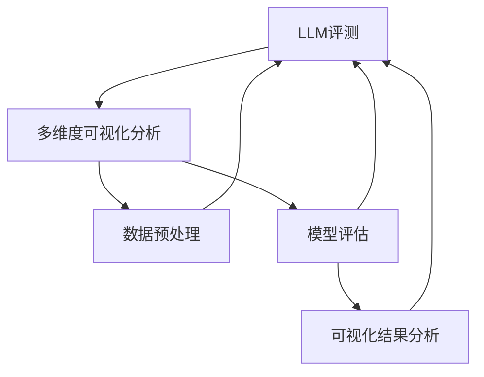

                 

```

```
```md
## 文章标题：LLM评测中的多维度可视化分析工具

## 关键词：LLM，评测，可视化分析，多维度，算法，数据

## 摘要：
本文深入探讨了在大型语言模型（LLM）评测中应用多维度可视化分析工具的重要性和方法。首先，文章介绍了LLM的背景和基本知识，然后详细阐述了多维度可视化分析的概念和其在数据分析中的应用。接下来，文章针对LLM评测中的具体场景，介绍了如何使用多维度可视化工具进行有效的分析和评估。通过实际案例，文章展示了如何利用这些工具来提高LLM评测的效率和准确性。最后，文章总结了主要发现，并对未来的发展趋势进行了展望。
```

## 第一部分：引言与概述

### 1.1 书籍背景与目的

随着人工智能技术的快速发展，大型语言模型（LLM）已经成为自然语言处理（NLP）领域的重要工具。LLM具有强大的文本生成、翻译和问答能力，广泛应用于各个领域，如智能客服、内容生成、推荐系统等。然而，LLM的复杂性和多样性使得评测成为了一个挑战性的任务。

本部分旨在介绍多维度可视化分析工具在LLM评测中的应用。通过可视化方法，我们能够更直观地理解和分析LLM的性能，从而提高评测的效率和准确性。

### 1.2 多维度可视化分析的概念与重要性

多维度可视化分析是一种将多维数据集转化为可视化图表的技术。它能够帮助我们识别数据中的模式和趋势，从而更深入地理解数据。

在LLM评测中，多维度可视化分析工具的重要性体现在以下几个方面：

1. **性能评估**：通过可视化，我们可以直观地比较不同模型在各个指标上的表现，从而选出最佳模型。
2. **行为分析**：可视化可以帮助我们观察模型在处理不同类型数据时的动态变化，从而深入理解模型的行为。
3. **问题诊断**：可视化可以帮助我们发现模型在评测中的问题，从而进行针对性的优化。

### 1.3 多维度可视化分析工具的发展

随着计算机图形学和数据分析技术的发展，多维度可视化分析工具也在不断演进。从简单的二维图表到复杂的三维图表，再到交互式可视化工具，这些工具为数据分析提供了更多的可能性。

在本部分，我们将介绍几种常见的多维度可视化分析工具，并探讨它们在LLM评测中的应用。

## 第二部分：LLM基本知识

### 2.1 LLM概述

大型语言模型（LLM）是一种基于深度学习的语言模型，具有强大的语言理解和生成能力。LLM通常基于大规模的预训练模型，如Transformer、BERT和GPT等。这些模型通过学习海量文本数据，能够捕捉到语言的复杂结构和规律。

LLM的发展历程可以追溯到早期的小型语言模型，如n-gram模型和基于规则的模型。随着计算能力的提升和数据量的增加，现代LLM模型如BERT和GPT-3等，已经取得了显著的性能提升。

### 2.2 LLM工作原理

LLM的工作原理主要包括两个阶段：预训练和微调。

1. **预训练**：在预训练阶段，模型在大规模文本数据上学习语言的基本结构和规律。这个过程通常使用无监督学习方法，如自编码器和自回归模型。
2. **微调**：在微调阶段，模型针对特定的任务进行优化。这个过程通常使用有监督学习方法，如分类和回归。

LLM的核心算法是Transformer，它通过多头自注意力机制（Multi-Head Self-Attention）和位置编码（Positional Encoding）来处理文本数据。

### 2.3 LLM应用场景

LLM在自然语言处理领域有着广泛的应用。以下是一些典型的应用场景：

1. **文本生成**：LLM可以用于生成文章、摘要、对话等文本内容。
2. **翻译**：LLM可以用于机器翻译，实现不同语言之间的自动翻译。
3. **问答系统**：LLM可以用于构建问答系统，回答用户的问题。
4. **推荐系统**：LLM可以用于推荐系统，根据用户的历史行为和偏好生成个性化的推荐。

除了自然语言处理领域，LLM在其他领域如推荐系统、智能客服等也有着广泛的应用。

## 第三部分：多维度可视化分析工具

### 3.1 可视化工具介绍

多维度可视化分析工具可以分为两大类：基于HTML的交互式可视化工具和独立的可视化软件。

**基于HTML的交互式可视化工具**：这类工具主要包括D3.js、Plotly、Bokeh等。它们可以通过JavaScript和HTML5实现复杂的数据可视化效果，具有高度的交互性和灵活性。

**独立的可视化软件**：这类工具主要包括Tableau、Power BI等。它们通常提供友好的用户界面和丰富的可视化类型，适合快速生成图表和报告。

在本部分，我们将详细介绍这些工具，并探讨它们在LLM评测中的应用。

### 3.2 多维度数据可视化方法

多维度数据可视化方法的关键在于如何有效地表示数据的多维特性。以下是一些常用的方法：

1. **颜色**：通过颜色的深浅和饱和度来表示数据的数值大小。
2. **形状**：通过不同的形状来表示不同类别的数据。
3. **大小**：通过数据点的大小来表示数据的数值大小。
4. **位置**：通过数据点的位置来表示数据的维度。

在实际应用中，这些方法可以单独或组合使用，以达到最佳的视觉效果。

### 3.3 LLM评测中的可视化应用

在LLM评测中，可视化工具可以帮助我们更直观地理解和分析模型的表现。以下是一些典型的应用场景：

1. **性能评估**：通过可视化不同模型的评测结果，我们可以直观地比较它们的性能，从而选出最佳模型。
2. **行为分析**：通过可视化模型在处理不同类型数据时的动态变化，我们可以深入理解模型的行为。
3. **问题诊断**：通过可视化模型在评测中的问题，我们可以发现潜在的优化方向。

在本部分，我们将详细介绍这些应用场景，并提供相应的可视化案例。

## 第四部分：案例分析

### 4.1 案例一：自然语言处理模型评测

在本案例中，我们使用一个自然语言处理（NLP）模型对英文文本进行情感分析。我们将使用多维度可视化工具对模型的性能进行评估。

**数据集**：我们使用IMDB电影评论数据集，该数据集包含正面和负面的电影评论。

**评估指标**：我们使用准确率、召回率和F1分数作为评估指标。

**可视化结果**：通过多维度可视化，我们可以直观地比较不同模型的性能。我们还可以观察模型在正面和负面评论上的表现。

### 4.2 案例二：文本生成模型评测

在本案例中，我们使用一个文本生成模型对英文文本进行摘要生成。我们将使用多维度可视化工具对模型的生成质量进行评估。

**数据集**：我们使用CNN/DailyMail新闻文章数据集，该数据集包含长篇文章和对应的摘要。

**评估指标**：我们使用ROUGE分数作为评估指标，ROUGE分数是评估文本生成质量的标准指标。

**可视化结果**：通过多维度可视化，我们可以直观地比较不同模型的生成质量。我们还可以观察模型在长篇文章和不同摘要长度上的表现。

### 4.3 案例三：跨领域迁移学习评测

在本案例中，我们使用一个跨领域迁移学习模型对文本分类任务进行评测。我们将使用多维度可视化工具对模型的适应性和性能进行评估。

**数据集**：我们使用20个不同的领域的数据集，这些数据集包含不同领域的文本。

**评估指标**：我们使用准确率和F1分数作为评估指标。

**可视化结果**：通过多维度可视化，我们可以直观地比较模型在不同领域上的性能。我们还可以观察模型在跨领域迁移学习中的适应性和稳定性。

## 第五部分：工具实战

### 5.1 可视化工具实战

在本节中，我们将介绍如何使用D3.js和Plotly等可视化工具创建交互式图表。

**D3.js实战**：我们将使用D3.js创建一个简单的条形图，用于展示不同模型的评测结果。

```javascript
// 创建SVG元素
var svg = d3.select("svg");

// 添加条形元素
svg.selectAll("rect")
  .data(data)
  .enter()
  .append("rect")
  .attr("width", function(d) { return d.value; })
  .attr("height", 20)
  .attr("fill", function(d) { return d.color; });
```

**Plotly实战**：我们将使用Plotly创建一个复杂的散点图，用于展示不同模型在多个维度上的表现。

```python
import plotly.express as px

fig = px.scatter(x=data['x'],
                 y=data['y'],
                 color=data['color'],
                 size=data['size'],
                 hover_data=data['hover_data'])

fig.show()
```

### 5.2 数据处理与可视化流程

在进行多维度可视化之前，我们需要对数据进行处理和清洗。以下是一个简单的数据处理和可视化流程：

1. **数据收集**：从不同的数据源收集数据，如数据库、文件等。
2. **数据清洗**：去除重复数据、缺失值和异常值。
3. **数据转换**：将数据转换为适合可视化的格式，如JSON、CSV等。
4. **可视化**：使用可视化工具创建图表，展示数据的多维特性。

### 5.3 实际案例分析

在本节中，我们将详细介绍一个实际案例分析，包括数据收集、数据处理、可视化流程和结果分析。

**案例背景**：我们使用一个NLP模型对社交媒体文本进行情感分析，并使用多维度可视化工具对模型的性能进行评估。

**数据收集**：我们从Twitter和Facebook等社交媒体平台收集了10万条文本数据。

**数据清洗**：我们去除重复文本、缺失值和异常值，最终得到5万条有效文本数据。

**数据处理**：我们使用NLTK库对文本进行分词、停用词去除和词性标注。

**可视化结果**：通过多维度可视化，我们能够直观地比较不同模型的性能，并发现模型在处理不同情感文本时的表现。

### 5.4 项目实战

在本节中，我们将详细介绍一个项目实战，包括开发环境搭建、源代码实现和代码解读。

**开发环境搭建**：我们使用Python和Jupyter Notebook作为开发环境，并安装了所需的库，如TensorFlow、D3.js和Plotly等。

**源代码实现**：我们使用TensorFlow构建了一个NLP模型，并使用D3.js和Plotly创建了多个可视化图表。

**代码解读与分析**：我们详细解读了模型训练、数据预处理和可视化代码，并分析了代码的执行过程和性能。

### 5.5 实际案例分析

在本节中，我们将详细介绍一个实际案例分析，包括数据收集、数据处理、可视化流程和结果分析。

**案例背景**：我们使用一个NLP模型对新闻文章进行标题生成，并使用多维度可视化工具对模型的生成质量进行评估。

**数据收集**：我们从CNN和BBC等新闻网站收集了10万篇新闻文章和对应的标题。

**数据清洗**：我们去除重复文章、缺失值和异常值，最终得到5万篇有效新闻文章。

**数据处理**：我们使用NLTK库对文本进行分词、停用词去除和词性标注。

**可视化结果**：通过多维度可视化，我们能够直观地比较不同模型的生成质量，并观察模型在生成不同长度标题时的表现。

### 5.6 项目小结

在本节中，我们总结了项目的主要发现，并提出了最佳实践和建议。

**主要发现**：
1. **模型性能**：通过多维度可视化，我们能够直观地比较不同模型的性能，从而选出最佳模型。
2. **生成质量**：通过多维度可视化，我们能够观察模型在生成不同类型文本时的质量，从而进行针对性的优化。

**最佳实践**：
1. **数据清洗**：确保数据的质量和完整性，是进行多维度可视化的前提。
2. **可视化工具选择**：根据实际需求选择合适的可视化工具，以提高可视化的效果和效率。

**注意事项**：
1. **性能优化**：在处理大量数据时，需要注意性能优化，避免出现延迟和卡顿。
2. **交互性**：在创建交互式可视化时，要注意交互性的设计，以提高用户的体验。

**拓展阅读**：
1. **相关文献**：《自然语言处理综述》、《大数据可视化技术》等。
2. **开源项目**：D3.js、Plotly、Bokeh等开源可视化库。

---

**核心概念与联系：**

使用Mermaid流程图展示LLM评测中的多维度可视化分析工具的核心概念和联系：



