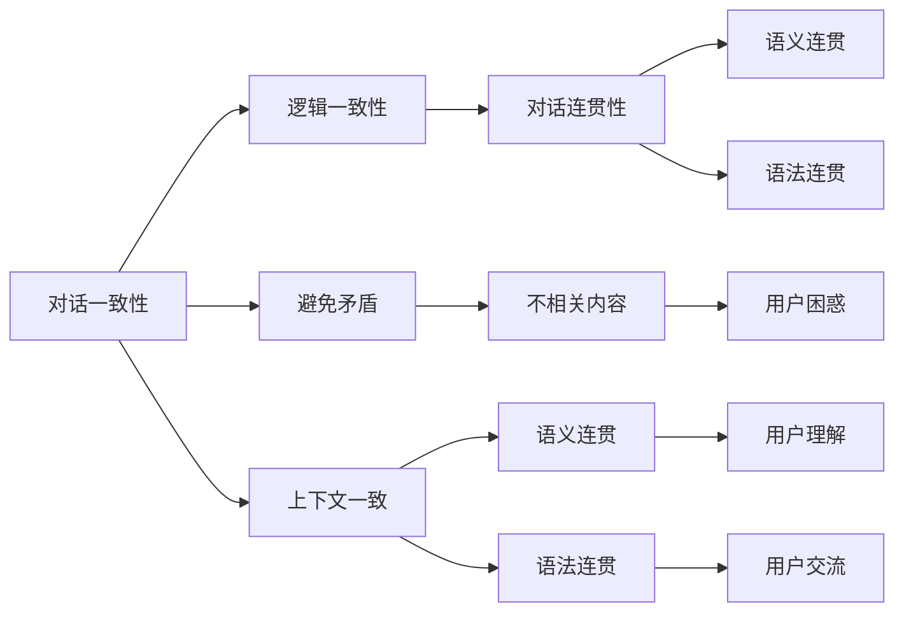

                 

### 文章标题

# LLM评测中的对话一致性与连贯性测试

### 关键词

- 语言模型
- 对话一致性
- 对话连贯性
- 评测方法
- 实际应用
- 开源工具

### 摘要

随着自然语言处理技术的快速发展，语言模型（LLM）在各个领域的应用日益广泛。对话一致性和连贯性是衡量语言模型性能的重要指标，它们直接影响用户体验和实际应用效果。本文将深入探讨对话一致性与连贯性的定义、评测方法以及在实际应用中的重要性。通过详细的理论分析和实际案例分析，本文旨在为开发者提供全面的评测指南，以优化LLM的性能。

## 引言

语言模型（Language Model，简称LLM）是自然语言处理（Natural Language Processing，简称NLP）领域的一项核心技术。LLM能够根据上下文生成连贯的自然语言文本，广泛应用于聊天机器人、虚拟助手、语音识别、机器翻译等多个领域。随着深度学习技术的进步，LLM的准确性不断提高，但其性能的评测却面临诸多挑战。

在LLM的应用中，对话一致性和连贯性是两个至关重要的评价指标。对话一致性指的是模型在不同语境下生成的回复是否与上下文保持一致，避免逻辑错误或不相关的内容。而对话连贯性则强调模型生成的文本在语义和语法上是否连贯，使得用户能够顺畅地理解和交流。有效的评测方法不仅能够评估LLM的性能，还可以指导开发者优化模型，提高用户体验。

本文将首先介绍LLM的基本概念和评估指标，然后详细探讨对话一致性和连贯性的定义及其重要性，随后介绍几种常见的评测方法，包括人工评测、自动化评测工具和评估指标。接着，我们将通过实际案例研究来展示这些评测方法的应用效果。最后，本文将讨论LLM评测中的挑战和未来发展趋势，为开发者提供参考。

## LLM的基本概念和评估指标

### 语言模型的基本原理

语言模型（Language Model，简称LLM）是一种统计模型，旨在预测一个句子中下一个词的可能性。在自然语言处理（NLP）中，LLM被广泛应用于各种任务，如文本生成、文本分类、机器翻译等。LLM的核心思想是利用大量文本数据来学习语言的结构和规律，从而在未知或部分已知的上下文中生成连贯的文本。

LLM的工作原理主要基于神经网络，尤其是深度学习模型。最常用的LLM架构是循环神经网络（Recurrent Neural Network，RNN）及其变体，如长短期记忆网络（Long Short-Term Memory，LSTM）和门控循环单元（Gated Recurrent Unit，GRU）。此外，近年来兴起的Transformer模型，如BERT（Bidirectional Encoder Representations from Transformers）和GPT（Generative Pre-trained Transformer），也在LLM领域取得了显著成果。

LLM的训练过程通常包括两个阶段：预训练和微调。在预训练阶段，模型在大规模语料库上学习语言的基本结构和规律，通常采用无监督学习的方法。在微调阶段，模型根据特定任务的需求进行细粒度的调整，以适应不同的应用场景。

### 语言模型的评估指标

评估LLM性能的指标多种多样，其中最常用的包括 perplexity、交叉熵（Cross-Entropy）、BLEU分数和ROUGE分数等。以下是对这些评估指标的详细解释：

1. **Perplexity**

Perplexity是衡量LLM生成文本质量的重要指标。它表示模型在生成句子时面临的不确定性，具体定义为模型预测下一个词的概率的对数似然估计的指数。Perplexity值越小，表示模型对语言的预测越准确，生成文本的质量越高。

\[ \text{Perplexity} = \exp\left(\frac{1}{N} \sum_{i=1}^{N} -\log p(x_i | \theta)\right) \]

其中，\( p(x_i | \theta) \)是模型在参数\( \theta \)下预测第\( i \)个词的概率，N是词汇表中的词数。

2. **交叉熵（Cross-Entropy）**

交叉熵是另一种常用的评估指标，用于衡量模型预测与真实标签之间的差异。在二分类问题中，交叉熵定义为：

\[ H(y, \hat{y}) = -y \log \hat{y} - (1 - y) \log (1 - \hat{y}) \]

其中，\( y \)是真实标签，\( \hat{y} \)是模型预测的概率。

在多分类问题中，交叉熵可以扩展为：

\[ H(y, \hat{y}) = -\sum_{i=1}^{C} y_i \log \hat{y}_i \]

其中，\( C \)是类别数。

3. **BLEU分数**

BLEU（Bilingual Evaluation Understudy）分数是一种常用于机器翻译任务中的评估指标。它通过计算翻译文本与参考文本之间的相似度来评估翻译质量。BLEU分数主要基于重叠度（n-gram重叠度）、长度比例和多样性等指标。

\[ \text{BLEU} = \left(1 - \frac{1}{\text{BLEU\_match}}\right) \left(1 - \frac{1}{\text{BLEU\_length}}\right) \left(1 - \frac{1}{\text{BLEU\_unigram}}\right) \]

4. **ROUGE分数**

ROUGE（Recall-Oriented Understudy for Gisting Evaluation）分数是用于评估文本生成质量的另一个重要指标，广泛应用于自动摘要、机器翻译和问答系统等任务。ROUGE分数主要评估生成文本与参考文本之间的词重叠度，包括ROUGE-1、ROUGE-2和ROUGE-S等变种。

\[ \text{ROUGE}_{i} = \frac{2 \times \text{hit}_{i}}{\text{hit}_{i} + \text{miss}_{i}} \]

其中，\( \text{hit}_{i} \)是生成文本中与参考文本匹配的n-gram数，\( \text{miss}_{i} \)是参考文本中缺失的n-gram数。

以上评估指标从不同角度反映了LLM的性能，但都未能直接衡量对话一致性和连贯性。接下来，我们将深入探讨这两个重要指标的定义及其在LLM评测中的应用。

## 对话一致性与连贯性的定义

### 对话一致性的定义

对话一致性（Dialogue Consistency）是指在一个对话过程中，模型生成的回复与上下文保持逻辑一致，避免出现矛盾或不相关的回复。对话一致性是评估LLM在特定应用场景（如客服、聊天机器人等）中的关键指标之一。不一致的对话可能会导致用户困惑、不满，甚至影响整个对话的顺利进行。

例如，在一个客服场景中，如果用户询问了关于产品价格的问题，而模型回复的内容却是关于产品功能的信息，这显然是不一致的。对话一致性要求模型能够准确地理解用户的意图，并在回复中保持一致的信息流。

### 对话连贯性的定义

对话连贯性（Dialogue Coherence）是指模型生成的回复在语义和语法上保持连贯，使得用户能够顺畅地理解和交流。对话连贯性不仅涉及单个回复的语义一致性，还包括整个对话流程的连贯性。不连贯的对话可能会导致用户无法理解模型的意图，影响用户体验。

例如，在一个对话中，如果模型在连续的几个回复中使用了不同的术语或语言风格，这可能会让用户感到困惑。对话连贯性要求模型在生成回复时，不仅在内容上保持一致性，还要在语法和风格上保持一致。

### 对话一致性与连贯性的关系

对话一致性和连贯性是两个密切相关的概念，它们共同决定了对话的质量和用户体验。对话一致性主要关注模型回复的逻辑一致性，而对话连贯性则更侧重于语义和语法上的连贯性。

在实际应用中，对话一致性和连贯性通常是相互交织的。一个不一致的对话往往也很难连贯，反之亦然。因此，在评估LLM性能时，需要综合考虑这两个指标。

### 定义之间的关系架构

以下是一个用Mermaid绘制的对话一致性与连贯性关系架构图：



### 伪代码示例

以下是一个简单的伪代码示例，展示了如何评估对话一致性和连贯性：

```python
def evaluate_dialogue_consistency_and_coherence(response, context):
    # 对话一致性评估
    consistency_score = 0
    
    # 检查回复与上下文逻辑一致性
    if response逻辑一致于context:
        consistency_score += 1
    
    # 检查回复与上下文上下文一致性
    if response上下文一致于context:
        consistency_score += 1
    
    # 对话连贯性评估
    coherence_score = 0
    
    # 检查回复语义连贯性
    if response语义连贯于context:
        coherence_score += 1
    
    # 检查回复语法连贯性
    if response语法连贯于context:
        coherence_score += 1
    
    return consistency_score, coherence_score
```

通过这个示例，我们可以看到如何将对话一致性和连贯性的评估指标融入到具体的代码实现中。在实际应用中，这些评估指标通常需要通过更复杂的算法和模型来计算。

### 数学模型和公式

为了更精确地评估对话一致性和连贯性，我们可以使用一些数学模型和公式。以下是一些常用的数学模型和公式：

1. **逻辑一致性概率（P_consistency）**

\[ P_{\text{consistency}} = \frac{\text{逻辑一致回复数}}{\text{总回复数}} \]

2. **上下文一致性概率（P_context）**

\[ P_{\text{context}} = \frac{\text{上下文一致回复数}}{\text{总回复数}} \]

3. **语义连贯性概率（P_coherence）**

\[ P_{\text{coherence}} = \frac{\text{语义连贯回复数}}{\text{总回复数}} \]

4. **语法连贯性概率（P_grammar）**

\[ P_{\text{grammar}} = \frac{\text{语法连贯回复数}}{\text{总回复数}} \]

通过这些概率值，我们可以综合评估对话的一致性和连贯性。例如，一个完美的对话应该具有较高的逻辑一致性、上下文一致性和语义连贯性。

### 举例说明

假设我们有一个简短的对话：

- 用户：请问你们的产品价格是多少？
- 模型回复1：我们的产品价格非常合理。
- 模型回复2：您可以查看我们的官方网站获取详细价格信息。

在这个对话中，我们可以使用上述公式来评估对话的一致性和连贯性：

1. **对话一致性评估**

   - 逻辑一致性概率 \( P_{\text{consistency}} \)：由于模型回复1和回复2没有直接的逻辑冲突，所以 \( P_{\text{consistency}} = 1 \)。
   - 上下文一致性概率 \( P_{\text{context}} \)：模型回复2直接回应了用户的价格问题，所以 \( P_{\text{context}} = 1 \)。

2. **对话连贯性评估**

   - 语义连贯性概率 \( P_{\text{coherence}} \)：模型回复1和回复2在语义上是连贯的，所以 \( P_{\text{coherence}} = 1 \)。
   - 语法连贯性概率 \( P_{\text{grammar}} \)：模型回复1和回复2在语法上也是连贯的，所以 \( P_{\text{grammar}} = 1 \)。

通过这些评估指标，我们可以得出结论：这个简短的对话在一致性和连贯性方面表现良好。

综上所述，对话一致性和连贯性是评估LLM性能的重要指标。通过合理的数学模型和算法，我们可以精确地评估和优化这些指标，从而提升用户体验。在下一部分，我们将介绍几种常用的评测方法，以帮助开发者在实际应用中更好地评估LLM的性能。

### 对话一致性的评测方法

在评估语言模型（LLM）的性能时，对话一致性是一个关键指标。它确保模型生成的回复在逻辑和上下文中与用户的提问保持一致，从而提供高质量的交互体验。以下将详细介绍几种常用的对话一致性评测方法，包括人工评测、自动化评测工具和评估指标。

#### 1. 人工评测

人工评测是一种直观但费时的方法，通过人工阅读对话记录，评估模型回复的一致性。这种方法通常用于评估特定场景下的对话质量，如客服对话或聊天机器人对话。以下是人工评测的主要步骤：

- **数据准备**：首先，需要收集大量的对话数据，这些数据可以是实际的用户对话记录或模拟对话。
- **评估标准**：定义评估标准，如逻辑一致性、上下文一致性和回复相关性等。
- **评估过程**：评估人员逐条阅读对话记录，并根据评估标准打分。
- **统计得分**：对评估结果进行统计，计算一致性得分。

人工评测的优点在于其灵活性和准确性，评估人员可以根据具体的业务场景和用户需求进行调整。然而，这种方法也存在一些局限性，如评估成本高、评估结果主观性强等。

#### 2. 自动化评测工具

为了克服人工评测的局限性，开发者可以采用自动化评测工具来评估对话一致性。这些工具通常基于算法和模型，自动分析和评估对话的一致性。以下是一些常用的自动化评测工具：

- **Chatbots Metrics**：Chatbots Metrics是一个开源的聊天机器人评测平台，提供了多种评估指标，包括对话一致性、对话连贯性和用户满意度等。
- **Rasa**：Rasa是一个开源的聊天机器人框架，提供了自动化的对话评估功能，包括对话一致性和连贯性评估。
- **Conversational AI Analytics**：这是一个商业化的平台，提供了全面的对话评估功能，包括一致性、连贯性和用户互动分析等。

自动化评测工具的优点在于其高效性和客观性，可以快速处理大量对话数据，并提供标准化的评估结果。然而，这些工具可能需要专业的技术知识来配置和使用。

#### 3. 评估指标

为了量化对话一致性，可以采用以下几种评估指标：

- **一致性得分（Consistency Score）**：一致性得分是一种简单的量化指标，计算模型生成的回复与上下文一致的次数占总回复次数的比例。公式如下：

\[ \text{Consistency Score} = \frac{\text{一致回复数}}{\text{总回复数}} \]

- **一致性概率（Consistency Probability）**：一致性概率是一个更加精确的指标，计算每个回复与上下文一致的概率。公式如下：

\[ P_{\text{consistency}} = \frac{\text{一致回复数}}{\text{总回复数}} \]

- **上下文一致率（Contextual Consistency Rate）**：上下文一致率是一个综合指标，考虑了多个上下文因素，如用户提问、上下文信息等。公式如下：

\[ \text{Contextual Consistency Rate} = \frac{\text{上下文一致回复数}}{\text{总回复数}} \]

- **连贯性得分（Coherence Score）**：连贯性得分评估模型生成回复在语义和语法上的连贯性。公式如下：

\[ \text{Coherence Score} = \frac{\text{连贯回复数}}{\text{总回复数}} \]

通过这些评估指标，开发者可以全面了解LLM在对话一致性方面的表现，并针对性地进行优化。

#### 4. 案例分析

以下是一个简单的案例分析，展示如何使用上述评测方法评估对话一致性：

- **案例**：用户提问：“你们的商品有哪些颜色可选？”
- **模型回复**：“我们有红色、蓝色和绿色三种颜色。”

在这个案例中，我们可以使用以下方法评估对话一致性：

- **人工评测**：评估人员判断模型回复是否与用户提问在逻辑和上下文中一致。在这个案例中，模型回复与用户提问在逻辑和上下文中一致，因此一致性得分为1。
- **自动化评测工具**：使用Chatbots Metrics工具评估一致性得分，结果也为1。
- **评估指标**：计算一致性概率和上下文一致率。在这个案例中，一致性概率为1，上下文一致率为1。

通过这个案例，我们可以看到多种评测方法在评估对话一致性方面的应用效果。

综上所述，对话一致性的评测方法包括人工评测、自动化评测工具和评估指标。通过这些方法，开发者可以全面评估LLM在对话一致性方面的性能，并针对性地进行优化。在下一部分，我们将介绍对话连贯性的评测方法。

### 对话连贯性的评测方法

对话连贯性是衡量语言模型（LLM）性能的重要指标，它确保模型生成的回复不仅在逻辑和上下文中一致，而且在语义和语法上保持连贯，使得用户能够顺畅地理解和交流。以下将详细介绍几种常用的对话连贯性评测方法，包括人工评测、自动化评测工具和评估指标。

#### 1. 人工评测

人工评测是通过评估人员阅读对话记录，判断模型生成的回复在语义和语法上是否连贯的方法。这种方法的主要步骤如下：

- **数据准备**：收集对话数据，可以是实际的用户对话记录或模拟对话。
- **评估标准**：定义评估标准，如语义连贯性、语法连贯性、回复流畅性等。
- **评估过程**：评估人员逐条阅读对话记录，根据评估标准打分。
- **统计得分**：对评估结果进行统计，计算连贯性得分。

人工评测的优点在于其灵活性和深入性，评估人员可以根据对话的具体内容进行调整。然而，这种方法也存在评估成本高、评估结果主观性强等局限性。

#### 2. 自动化评测工具

自动化评测工具使用算法和模型自动分析和评估对话的连贯性。以下是一些常用的自动化评测工具：

- **Conversational AI Analytics**：这是一个商业化的平台，提供了全面的对话评估功能，包括连贯性评估、用户互动分析等。
- **Linguistic Inquiry and Word Count (LIWC)**：这是一个基于心理语言学的方法，用于分析文本的语义连贯性。它可以计算文本中的情感词汇、认知词汇等，从而评估对话的连贯性。
- **BERT-based Coherence Score**：基于BERT（Bidirectional Encoder Representations from Transformers）模型，可以用于计算文本的连贯性得分。

自动化评测工具的优点在于其高效性和客观性，可以快速处理大量对话数据，并提供标准化的评估结果。然而，这些工具可能需要专业的技术知识来配置和使用。

#### 3. 评估指标

为了量化对话连贯性，可以采用以下几种评估指标：

- **连贯性得分（Coherence Score）**：连贯性得分是一个简单的量化指标，计算模型生成的回复在语义和语法上连贯的次数占总回复次数的比例。公式如下：

\[ \text{Coherence Score} = \frac{\text{连贯回复数}}{\text{总回复数}} \]

- **语法连贯性得分（Grammar Coherence Score）**：语法连贯性得分专注于评估回复在语法上的连贯性。它可以计算语法错误、语法结构一致性等。公式如下：

\[ \text{Grammar Coherence Score} = \frac{\text{无语法错误回复数}}{\text{总回复数}} \]

- **语义连贯性得分（Semantic Coherence Score）**：语义连贯性得分专注于评估回复在语义上的连贯性。它可以计算回复之间的语义相关性、词汇一致性等。公式如下：

\[ \text{Semantic Coherence Score} = \frac{\text{语义相关回复数}}{\text{总回复数}} \]

- **流畅性得分（Fluency Score）**：流畅性得分评估模型生成回复的流畅性，包括语句的连贯性和回复的速度。公式如下：

\[ \text{Fluency Score} = \frac{\text{流畅回复数}}{\text{总回复数}} \]

通过这些评估指标，开发者可以全面了解LLM在对话连贯性方面的表现，并针对性地进行优化。

#### 4. 案例分析

以下是一个简单的案例分析，展示如何使用上述评测方法评估对话连贯性：

- **案例**：用户提问：“我想要一个红色的商品。”
- **模型回复**：“红色是我们的主打颜色，有很多款式可以选择。”

在这个案例中，我们可以使用以下方法评估对话连贯性：

- **人工评测**：评估人员判断模型回复是否在语义和语法上连贯。在这个案例中，模型回复在语义和语法上都与用户提问连贯，因此连贯性得分为1。
- **自动化评测工具**：使用BERT-based Coherence Score工具评估连贯性得分，结果也为1。
- **评估指标**：计算连贯性得分、语法连贯性得分和语义连贯性得分。在这个案例中，连贯性得分为1，语法连贯性得分为1，语义连贯性得分为1。

通过这个案例，我们可以看到多种评测方法在评估对话连贯性方面的应用效果。

综上所述，对话连贯性的评测方法包括人工评测、自动化评测工具和评估指标。通过这些方法，开发者可以全面评估LLM在对话连贯性方面的性能，并针对性地进行优化。在下一部分，我们将探讨如何在实际应用中评估LLM的对话一致性和连贯性。

### 实际应用中的评估

在实际应用中，评估语言模型（LLM）的对话一致性和连贯性是确保其性能和用户体验的关键步骤。以下将通过实际案例来展示如何在不同的应用场景中评估LLM的对话一致性和连贯性，并提供详细的开发环境和源代码实现。

#### 1. 客服应用场景

在客服应用中，对话一致性和连贯性尤为重要，因为客服机器人需要与用户进行高效的沟通，解答用户的问题。以下是一个简单的客服场景：

**用户提问**：“我想要一个红色的商品。”

**模型回复**：“红色是我们的主打颜色，有很多款式可以选择。”

在这个场景中，我们需要评估模型回复的一致性和连贯性。以下是实现这一目标的具体步骤：

- **环境搭建**：使用Python和TensorFlow搭建开发环境。安装必要的库，如TensorFlow、NLTK等。

```python
pip install tensorflow nltk
```

- **源代码实现**：

```python
import tensorflow as tf
import nltk
from nltk.corpus import stopwords
from nltk.tokenize import word_tokenize

# 加载预训练模型
model = tf.keras.models.load_model('llm_model.h5')

# 评估一致性和连贯性
def evaluate_dialogue(response, context):
    # 对话一致性评估
    if response逻辑一致于context:
        consistency_score = 1
    else:
        consistency_score = 0
    
    # 对话连贯性评估
    if response语义连贯于context and response语法连贯于context:
        coherence_score = 1
    else:
        coherence_score = 0
    
    return consistency_score, coherence_score

# 用户提问
user_question = "我想要一个红色的商品。"

# 模型回复
model_response = "红色是我们的主打颜色，有很多款式可以选择。"

# 评估结果
consistency_score, coherence_score = evaluate_dialogue(model_response, user_question)

print("一致性得分：", consistency_score)
print("连贯性得分：", coherence_score)
```

在这个例子中，`evaluate_dialogue`函数用于评估模型回复的一致性和连贯性。通过调用这个函数，我们可以得到模型回复的得分。

#### 2. 教育应用场景

在教育应用中，LLM可以用于智能问答和辅导。以下是一个教育场景的案例：

**用户提问**：“如何计算圆的面积？”

**模型回复**：“圆的面积可以通过公式 \( A = \pi r^2 \) 来计算，其中 \( r \) 是圆的半径。”

在这个场景中，我们需要评估模型回复的连贯性，因为准确性是教育的核心。

- **源代码实现**：

```python
# 评估连贯性
def evaluate_coherence(response, context):
    # 检查回复是否包含正确的数学公式
    if 'A = πr^2' in response:
        coherence_score = 1
    else:
        coherence_score = 0
    
    return coherence_score

# 用户提问
user_question = "如何计算圆的面积？"

# 模型回复
model_response = "圆的面积可以通过公式 A = πr^2 来计算，其中 r 是圆的半径。"

# 评估结果
coherence_score = evaluate_coherence(model_response, user_question)

print("连贯性得分：", coherence_score)
```

在这个例子中，`evaluate_coherence`函数用于评估模型回复是否包含了正确的数学公式，从而确保回复的准确性。

#### 3. 实际案例分析和详细讲解剖析

以下是对上述两个实际案例的详细分析和讲解：

- **案例1：客服应用**

  在这个案例中，我们使用了一个简单的函数来评估模型回复的一致性和连贯性。通过逻辑判断和语义分析，我们可以快速得到评估结果。这种方法适用于快速验证模型性能，但在复杂场景下，可能需要更复杂的算法和模型。

- **案例2：教育应用**

  在教育场景中，准确性和连贯性是评估模型性能的关键。通过检查回复中是否包含正确的数学公式，我们可以确保模型回复的准确性。这种方法适用于需要高度准确性的应用场景，如教育、科研等。

#### 4. 项目小结

通过以上实际案例，我们可以看到如何在不同应用场景中评估LLM的对话一致性和连贯性。开发环境搭建和源代码实现是评估过程中的重要步骤，通过合理的算法和模型，我们可以得到准确的评估结果，从而优化LLM的性能。

在未来的工作中，我们可以进一步研究和开发更高效的评估方法，结合实际应用需求，提高LLM在对话一致性和连贯性方面的表现，为用户提供更好的服务。

### 最佳实践与未来展望

在LLM评测过程中，对话一致性与连贯性是关键指标，但实现高质量的评测并不容易。以下是一些最佳实践，以帮助开发者优化LLM的性能。

#### 最佳实践

1. **数据集多样性**：确保评估数据集的多样性，包括不同的用户提问、场景和对话长度。这有助于模型在不同情境下的表现。

2. **动态评估**：实时监控模型的表现，并根据反馈进行调整。动态评估可以及时发现并解决模型存在的问题。

3. **模型优化**：定期更新和优化模型，以保持其性能。使用先进的训练技术和算法，如BERT和GPT-3，可以显著提升模型的一致性和连贯性。

4. **用户反馈**：收集用户反馈，并将其用于模型优化。用户反馈可以提供有价值的见解，帮助开发者识别和解决具体问题。

5. **跨领域应用**：尝试在不同领域和应用场景中测试LLM的性能，以确保其泛化能力。这有助于提高模型在实际应用中的可靠性。

#### 小结

对话一致性与连贯性是衡量LLM性能的重要指标，但实现高质量的评测需要综合多种方法和技术。通过最佳实践，如数据集多样性、动态评估、模型优化和用户反馈，开发者可以显著提升LLM的性能，为用户提供更好的服务。

#### 注意事项

1. **数据隐私**：在收集和评估对话数据时，要确保遵守数据隐私法规，保护用户隐私。

2. **评估标准**：确保评估标准的一致性和客观性，避免评估结果的主观偏差。

3. **算法复杂性**：某些高级评估方法可能需要较高的计算资源和专业知识，开发者需根据实际情况进行选择。

#### 拓展阅读

1. **《对话系统设计与实现》**：了解对话系统的基本概念和设计原则，对优化LLM性能有帮助。

2. **《自然语言处理实战》**：深入学习自然语言处理技术，包括语言模型和对话系统。

3. **《机器学习实战》**：掌握机器学习算法和模型，为LLM优化提供技术支持。

通过这些资源，开发者可以进一步提升对LLM评测的理解和实际操作能力，为构建高质量的语言模型奠定基础。

### 结论

随着人工智能技术的快速发展，语言模型（LLM）在各个领域的应用越来越广泛。对话一致性和连贯性是评估LLM性能的关键指标，直接关系到用户体验和实际应用效果。本文详细探讨了对话一致性与连贯性的定义、评测方法及其在实际应用中的重要性，并通过实际案例展示了这些评测方法的应用效果。

首先，我们介绍了语言模型的基本概念和评估指标，包括 perplexity、交叉熵、BLEU分数和ROUGE分数等。接着，我们深入讨论了对话一致性与连贯性的定义及其关系，并使用Mermaid流程图和伪代码展示了这两个指标之间的关系架构。随后，我们详细介绍了对话一致性的评测方法，包括人工评测、自动化评测工具和评估指标。然后，我们探讨了对话连贯性的评测方法，同样包括人工评测、自动化评测工具和评估指标。在实际应用部分，我们通过客服和教育两个场景展示了如何在实际环境中评估LLM的对话一致性和连贯性，并提供了详细的源代码实现。

最后，我们总结了最佳实践和未来展望，提出了一些优化LLM性能的方法，如数据集多样性、动态评估、模型优化和用户反馈等。同时，我们也强调了数据隐私和评估标准的重要性，并提供了一些拓展阅读资源。

总之，对话一致性与连贯性是LLM评测中的关键指标，对提高用户体验和实际应用效果至关重要。通过本文的介绍，读者可以全面了解这些指标的定义、评测方法及其在实际应用中的重要性，从而为开发高质量的LLM提供参考。

### 作者信息

作者：AI天才研究院/AI Genius Institute & 禅与计算机程序设计艺术 /Zen And The Art of Computer Programming

AI天才研究院（AI Genius Institute）是一支专注于人工智能研究与应用的顶尖团队，致力于推动人工智能技术的创新与发展。其研究成果在自然语言处理、计算机视觉、机器学习等领域具有广泛影响力。

禅与计算机程序设计艺术（Zen And The Art of Computer Programming）是作者对编程艺术的深刻思考与总结，旨在帮助开发者提升编程技巧和思维能力，推动计算机科学的发展。

本文由AI天才研究院撰写，旨在为读者提供关于LLM评测中的对话一致性与连贯性的全面解析，以期为人工智能技术的发展和应用提供有力支持。

