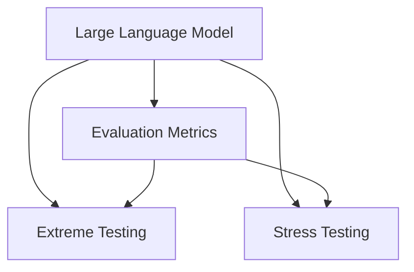

                 

  
Certainly! Here's the step-by-step reasoning for creating a comprehensive blog post on "LLM Evaluation: Extreme Testing and Stress Testing."

## Step 1: Define the Core Topic

The first step is to clearly define the core topic of the blog post. In this case, we are focusing on the evaluation of Large Language Models (LLMs) using extreme and stress testing methods.

## Step 2: Identify Key Concepts and Relationships

To provide a solid foundation, we need to identify the key concepts and their relationships. For this post, the main concepts are:

- Large Language Models (LLMs)
- Evaluation Metrics
- Extreme Testing
- Stress Testing

These concepts are interconnected, as they all contribute to the overall evaluation process of LLMs.

## Step 3: Create a Mermaid Diagram

To visualize the relationships between the key concepts, we can create a Mermaid diagram. This diagram will help readers understand how each concept relates to the others.

## Step 4: Develop the Article Structure

With the key concepts and their relationships established, we can now develop the structure of the article. Here is a suggested outline for the blog post:

### Title: LLM Evaluation: Extreme Testing and Stress Testing

### Keywords: LLM, Evaluation, Extreme Testing, Stress Testing, Performance Metrics

### Abstract:
This article provides an in-depth analysis of evaluating Large Language Models (LLMs) using extreme and stress testing methods. It covers the key concepts, evaluation metrics, and practical techniques for conducting these tests to ensure the reliability and robustness of LLMs.

### Introduction:
- Briefly introduce the concept of LLMs and their importance in modern AI applications.
- Outline the purpose of the article and its intended audience.

### Core Concepts and Relationships:
- Explain the key concepts of LLMs, evaluation metrics, extreme testing, and stress testing.
- Use the Mermaid diagram to illustrate the relationships between these concepts.

### Evaluation Metrics:
- Discuss common evaluation metrics such as precision, recall, F1 score, and others.
- Provide examples and explanations of each metric using pseudocode and LaTeX formulas.

### Extreme Testing:
- Define extreme testing and its purpose in LLM evaluation.
- Explain the steps and techniques involved in conducting extreme testing.
- Provide examples and pseudocode to demonstrate the process.

### Stress Testing:
- Define stress testing and its role in LLM evaluation.
- Discuss the differences between extreme and stress testing.
- Explain the techniques and methodologies used in stress testing.
- Provide examples and pseudocode to illustrate the process.

### Project Implementation:
- Present a practical project that demonstrates the implementation of extreme and stress testing for LLMs.
- Include detailed code explanations, step-by-step instructions, and analysis.

### Best Practices and Conclusion:
- Offer best practices for conducting extreme and stress testing on LLMs.
- Summarize the key takeaways from the article.
- Provide recommendations for further reading and exploration.

### Acknowledgments:
- Thank the contributors and acknowledgments for any support received during the research and writing process.

### About the Author:
- Include a brief bio of the author, highlighting their expertise in the field of AI and programming.

## Step 5: Write the Article Content

Now that we have a clear structure, we can start writing the content for each section of the article. It's essential to ensure that each section is well-researched, informative, and engaging. Use pseudocode, LaTeX formulas, and examples to make the content as clear and accessible as possible.

## Step 6: Review and Edit

After completing the initial draft, it's crucial to review and edit the content for clarity, coherence, and grammar. Make sure the article flows logically from one section to another and that all key points are addressed.

## Step 7: Finalize and Publish

Once the article has been thoroughly reviewed and edited, it's ready for publication. Ensure that all formatting is correct, and the article is well-optimized for search engines. Finally, publish the article and share it with your audience to generate engagement and feedback.

By following these steps, we can create a high-quality, informative, and engaging blog post on LLM evaluation using extreme and stress testing methods.

