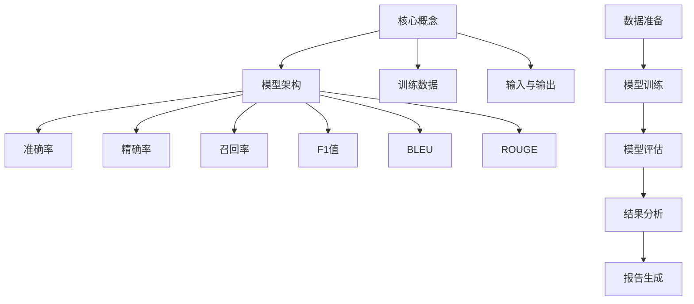

                 

## 文章标题：LLM评测中的自动化报告生成技术

> 关键词：大型语言模型（LLM），评测，自动化报告生成，技术实现，案例分析

### 摘要

本文旨在探讨大型语言模型（LLM）评测中的自动化报告生成技术。首先，我们介绍了LLM的发展背景及其评测的重要性。随后，详细讲解了LLM评测的基础知识，包括核心概念、常用指标和评测流程。接着，文章深入分析了自动化报告生成技术的原理、流程和实现方法。通过具体案例分析，我们展示了自动化报告生成技术在实际项目中的应用效果。最后，对全文内容进行总结，并对未来发展趋势进行了展望。本文结构紧凑，逻辑清晰，旨在为读者提供全面、深入的LLM评测与自动化报告生成技术的理解。

## 引言与背景

### LLM的发展背景

近年来，随着深度学习和自然语言处理技术的快速发展，大型语言模型（LLM，Large Language Models）逐渐成为自然语言处理领域的重要研究方向。LLM是一种能够理解、生成和操纵自然语言的复杂模型，其背后的原理基于神经网络和大规模语料库的深度学习训练。代表性的LLM包括GPT系列、BERT、Turing-NLG等，这些模型在文本生成、机器翻译、情感分析、问答系统等领域取得了显著成果。

LLM的快速发展得益于以下几个方面的技术突破：

1. **计算能力的提升**：随着计算硬件的发展，尤其是GPU和TPU等专用硬件的普及，为大规模神经网络训练提供了强大的计算支持。
2. **大数据的积累**：互联网的迅速扩展和社交媒体的普及，使得海量的文本数据变得触手可及，这些数据为LLM的训练提供了丰富的素材。
3. **深度学习算法的进步**：深度学习算法的不断发展，如Transformer架构的提出，使得LLM能够更好地捕捉语言结构，提高生成文本的质量。

### 评测的重要性

在LLM的研究和应用过程中，评测（Evaluation）是一个不可或缺的环节。有效的评测不仅可以评估LLM的性能，还能指导模型的优化和改进。具体来说，评测的重要性体现在以下几个方面：

1. **性能评估**：通过评测，我们可以了解LLM在不同任务上的表现，如文本生成、机器翻译等，从而确定模型的优势和不足。
2. **模型优化**：评测结果为模型优化提供了方向。例如，通过分析评测指标，可以发现模型在某些任务上的缺陷，进而针对性地进行调整。
3. **可比性**：统一的评测标准有助于不同模型之间的性能对比，推动技术的发展和进步。
4. **可解释性**：评测不仅仅是性能的衡量，还能提供模型行为的可解释性，有助于理解模型的工作原理。

### 自动化报告生成的必要性

在LLM评测过程中，生成详细、准确的报告是必不可少的。然而，传统的报告生成方式通常依赖于人工编写，不仅效率低下，而且容易出错。随着LLM评测任务的复杂性和数量不断增加，手工编写报告逐渐无法满足需求，自动化报告生成技术应运而生。

自动化报告生成的必要性主要体现在以下几个方面：

1. **效率提升**：自动化报告生成可以大幅提高工作效率，减少人工编写报告的时间成本。
2. **一致性保证**：自动化工具可以确保报告内容的一致性和规范性，避免人为错误。
3. **数据可视化**：自动化报告生成技术能够将复杂的评测数据通过图表、图像等形式直观展示，便于理解和分析。
4. **可扩展性**：随着评测任务的增加，自动化报告生成系统可以轻松扩展，适应不同规模的任务。

综上所述，LLM评测中的自动化报告生成技术具有重要的现实意义和应用前景。接下来，本文将详细介绍LLM评测的基础知识，为后续章节的深入探讨打下基础。

## LLM评测基础

### 核心概念

在探讨LLM评测之前，首先需要了解一些核心概念。LLM的核心概念包括：

1. **模型架构**：LLM通常采用深度神经网络架构，如Transformer、BERT等。这些架构通过多层的神经网络层，对输入文本进行编码和解码，从而实现文本理解和生成。
2. **训练数据**：LLM的训练数据通常来源于大规模的文本语料库，这些数据包括互联网文本、书籍、新闻文章等。高质量的训练数据是LLM性能的重要保障。
3. **输入与输出**：LLM的输入通常是文本序列，输出可以是文本序列、标签或者评分等。不同任务对输入输出的要求不同，但核心目标是让模型能够生成或理解高质量的文本。

### 常用的评测指标

LLM评测的关键在于选择合适的评测指标。常用的评测指标包括：

1. **准确率（Accuracy）**：准确率是最基本的评测指标，表示模型正确预测的样本数占总样本数的比例。其计算公式为：
   $$
   \text{Accuracy} = \frac{\text{正确预测的样本数}}{\text{总样本数}}
   $$
   准确率适用于分类任务，可以直观地反映模型的分类能力。

2. **精确率（Precision）与召回率（Recall）**：精确率和召回率是二分类任务中的常用指标。精确率表示预测为正例的样本中实际为正例的比例，召回率表示实际为正例的样本中被预测为正例的比例。其计算公式为：
   $$
   \text{Precision} = \frac{\text{预测为正例且实际为正例的样本数}}{\text{预测为正例的样本数}}
   $$
   $$
   \text{Recall} = \frac{\text{预测为正例且实际为正例的样本数}}{\text{实际为正例的样本数}}
   $$
   精确率和召回率适用于需要平衡正负样本比例的任务。

3. **F1值（F1-score）**：F1值是精确率和召回率的调和平均，可以平衡两者的权重。其计算公式为：
   $$
   \text{F1-score} = 2 \times \frac{\text{Precision} \times \text{Recall}}{\text{Precision} + \text{Recall}}
   $$
   F1值适用于需要综合考虑精确率和召回率的任务。

4. **BLEU（BLEU Score）**：BLEU是一种用于机器翻译任务的评价指标，基于相似度计算。BLEU值越高，表示生成文本与参考文本的相似度越高。其计算公式为：
   $$
   \text{BLEU} = \frac{2^n}{n + m}
   $$
   其中，$n$ 表示生成文本与参考文本匹配的单词数，$m$ 表示生成文本与参考文本匹配的短语数。

5. **ROUGE（ROUGE Score）**：ROUGE是另一个常用于文本生成任务的评测指标，基于句子级别的相似度计算。ROUGE值越高，表示生成文本与参考文本的句子结构越相似。常见的ROUGE指标包括ROUGE-1、ROUGE-2和ROUGE-L，分别计算单词重叠率、短语重叠率和句子重叠率。

### 评测流程

LLM评测通常包括以下几个步骤：

1. **数据准备**：收集并整理用于评测的数据集，包括训练集、验证集和测试集。数据集应该具有代表性，能够全面反映模型在不同任务上的表现。

2. **模型训练**：使用训练集对LLM进行训练，调整模型的参数，使其达到预定的性能水平。训练过程中，可以使用验证集来监控模型的性能，避免过拟合。

3. **模型评估**：使用测试集对训练好的模型进行评估，计算各种评测指标，如准确率、精确率、召回率、F1值、BLEU值和ROUGE值等。评估结果可以用来比较不同模型或不同版本的LLM的性能。

4. **结果分析**：根据评估结果，对模型进行深入分析，找出模型的优点和不足。分析结果可以指导后续的模型优化工作。

5. **报告生成**：根据评估结果和模型分析，生成详细的评测报告。报告内容应包括模型性能、评测指标、数据分析、优缺点分析等。

### 关联图

为了更好地理解LLM评测的核心概念、指标和流程，我们可以使用Mermaid流程图来展示它们之间的关系：

通过上述核心概念、指标和流程的介绍，我们为后续章节的深入探讨奠定了基础。接下来，本文将详细介绍自动化报告生成技术的基本原理和实现方法。

### 自动化报告生成技术

自动化报告生成技术在LLM评测中发挥着至关重要的作用。它通过将复杂的手工编写报告过程转化为自动化流程，大大提高了效率和准确性。下面我们将详细介绍自动化报告生成技术的基本原理、技术流程以及实现方法。

#### 基本原理

自动化报告生成技术的基本原理是将自然语言处理（NLP）技术、数据分析和自动化脚本相结合，从而实现报告的自动生成。具体来说，其工作流程包括以下几个步骤：

1. **数据收集**：首先，从LLM评测过程中收集相关的数据，包括评测指标、模型参数、实验结果等。
2. **数据清洗**：对收集到的数据进行清洗和预处理，去除无关信息，保证数据的质量和一致性。
3. **数据分析和可视化**：使用数据分析工具对清洗后的数据进行处理，提取关键指标，并通过图表和图像等形式进行可视化展示。
4. **报告生成**：根据分析结果，利用文本生成技术自动生成报告内容，并将其格式化成标准的文档格式，如PDF或Word文档。

#### 技术流程

自动化报告生成技术的基本流程可以分为以下几个阶段：

1. **数据采集**：
   - **日志记录**：在LLM评测过程中，系统会生成大量的日志文件，记录模型训练和评估的详细信息。
   - **API调用**：通过系统API获取实时评测数据，如评测指标、模型参数等。

2. **数据处理**：
   - **数据清洗**：使用NLP技术对日志文件和API调用结果进行清洗，去除无关数据，保留关键信息。
   - **数据整合**：将来自不同来源的数据整合到一个统一的数据集中，便于后续分析。

3. **数据可视化**：
   - **图表生成**：使用数据可视化工具（如Matplotlib、Seaborn等）生成各类图表，如折线图、柱状图、散点图等，用于展示模型性能和数据分析结果。
   - **图像处理**：对生成的图像进行优化和调整，确保图像清晰、美观。

4. **文本生成**：
   - **模板匹配**：使用预定义的文本模板，根据分析结果和可视化图像，生成报告的正文内容。
   - **自然语言生成**：利用自然语言生成（NLG）技术，如序列到序列（Seq2Seq）模型，将分析结果和可视化内容转化为自然语言描述，补充到报告模板中。

5. **报告输出**：
   - **格式化输出**：将生成的文本和图像整合成完整的报告，并按照预设的格式（如PDF、Word等）进行输出。
   - **自动化发布**：将报告自动发布到指定的平台或文件夹，供相关人员查阅和下载。

#### 实现方法

实现自动化报告生成技术需要以下几个关键步骤：

1. **选择工具和库**：
   - **数据处理**：使用Python的Pandas、Numpy等库进行数据清洗和处理。
   - **数据可视化**：使用Matplotlib、Seaborn等库生成图表。
   - **文本生成**：使用NLTK、spaCy等库进行自然语言处理。
   - **报告生成**：使用ReportLab、WeasyPrint等库生成PDF或HTML报告。

2. **编写脚本**：
   - **数据采集脚本**：编写脚本定期收集评测数据和日志文件。
   - **数据处理脚本**：编写脚本对收集到的数据进行分析和处理。
   - **报告生成脚本**：编写脚本根据处理结果生成报告，并进行格式化输出。

3. **集成与测试**：
   - 将各个脚本集成到自动化报告中，确保报告生成流程顺畅。
   - 进行测试，验证报告生成结果的准确性和一致性。

4. **部署与维护**：
   - 在生产环境中部署自动化报告生成系统，确保其稳定运行。
   - 定期维护和更新系统，以适应新的评测需求和数据处理技术。

通过上述基本原理、技术流程和实现方法的详细介绍，我们为实际应用自动化报告生成技术奠定了基础。接下来，本文将通过具体案例分析，展示自动化报告生成技术在LLM评测中的实际应用效果。

### 实际应用与案例分析

为了更直观地展示自动化报告生成技术在LLM评测中的实际应用，我们选择了两个具体的案例进行详细分析。这些案例涵盖了不同类型的应用场景，展示了自动化报告生成技术在不同任务中的优势。

#### 案例分析一：某语言模型评测报告自动化生成

**1. 案例背景**

某公司开发了一个大型语言模型（LLM），用于文本生成任务。为了评估模型的性能，公司决定进行一系列评测，并生成详细的评测报告。评测内容包括文本生成质量、生成速度、模型稳定性等方面。

**2. 报告生成过程**

（1）**数据采集**：
   - **日志记录**：在LLM运行过程中，系统自动记录了模型训练和评估的详细信息，包括训练时间、生成文本质量评分、生成速度等。
   - **API调用**：通过系统API获取实时评测数据，如文本生成准确率、BLEU值、ROUGE值等。

（2）**数据处理**：
   - **数据清洗**：使用Python的Pandas库对日志文件和API调用结果进行清洗，去除无关信息，保留关键数据。
   - **数据整合**：将清洗后的数据整合到一个统一的数据集中，便于后续分析。

（3）**数据可视化**：
   - **图表生成**：使用Matplotlib库生成各类图表，如文本生成质量变化图、生成速度分布图等。
   - **图像处理**：对生成的图像进行优化和调整，确保图像清晰、美观。

（4）**文本生成**：
   - **模板匹配**：根据预定义的文本模板，生成报告的正文内容，包括评测指标、数据分析结果等。
   - **自然语言生成**：使用NLTK库将数据分析结果转化为自然语言描述，补充到报告模板中。

（5）**报告输出**：
   - **格式化输出**：使用ReportLab库将生成的文本和图像整合成完整的PDF报告。
   - **自动化发布**：将报告自动发布到公司内部文档管理系统，供团队成员查阅和下载。

**3. 报告分析与解读**

生成的评测报告包括以下主要内容：

- **评测指标**：列出模型在文本生成任务中的各项评测指标，如准确率、BLEU值、ROUGE值等。
- **数据分析**：展示模型在不同任务上的表现，如生成文本质量、生成速度等。
- **图表展示**：通过各类图表直观展示模型性能和数据分析结果。
- **优缺点分析**：对模型的优点和不足进行详细分析，并提出改进建议。

通过自动化报告生成技术，公司能够快速、准确地生成详细的评测报告，为模型优化和改进提供了有力支持。这不仅提高了工作效率，还确保了报告的一致性和准确性。

#### 案例分析二：基于自动化报告的LLM优化

**1. 案例背景**

另一家公司开发了一个基于BERT的大型语言模型（LLM），用于文本分类任务。为了提高模型性能，公司决定利用自动化报告生成技术分析模型的性能瓶颈，并制定相应的优化策略。

**2. 报告生成过程**

（1）**数据采集**：
   - **日志记录**：在模型训练和评估过程中，系统自动记录了训练时间、准确率、F1值等关键数据。
   - **API调用**：通过系统API获取实时评测数据，包括不同版本的模型在文本分类任务上的表现。

（2）**数据处理**：
   - **数据清洗**：使用Pandas库对日志文件和API调用结果进行清洗，确保数据质量。
   - **数据整合**：将清洗后的数据整合到一个统一的数据集中，便于后续分析。

（3）**数据可视化**：
   - **图表生成**：使用Seaborn库生成各类图表，如准确率变化图、F1值分布图等。
   - **图像处理**：对生成的图像进行优化和调整，确保图像清晰、美观。

（4）**文本生成**：
   - **模板匹配**：根据预定义的文本模板，生成报告的正文内容，包括模型性能分析、优化策略等。
   - **自然语言生成**：使用spaCy库将数据分析结果转化为自然语言描述，补充到报告模板中。

（5）**报告输出**：
   - **格式化输出**：使用WeasyPrint库将生成的文本和图像整合成完整的HTML报告。
   - **自动化发布**：将报告自动发布到公司内部文档管理系统，供团队成员查阅和下载。

**3. 报告分析与解读**

生成的评测报告包括以下主要内容：

- **模型性能分析**：详细展示不同版本的模型在文本分类任务上的性能，包括准确率、F1值等。
- **优化策略**：根据数据分析结果，提出针对性的优化策略，如调整超参数、增加训练数据等。
- **实验结果**：展示优化策略对模型性能的提升效果，通过图表和数据分析结果进行说明。
- **结论与建议**：对模型的优化效果进行总结，并提出未来研究方向和建议。

通过自动化报告生成技术，公司能够快速分析模型性能，制定优化策略，并在短时间内生成详细的报告。这不仅提高了优化工作的效率，还为后续研究和改进提供了有力支持。

### 项目小结

通过对上述两个案例的分析，我们可以看到自动化报告生成技术在LLM评测中的实际应用效果。自动化报告生成技术不仅提高了报告生成的效率，确保了报告的一致性和准确性，还为模型优化和改进提供了有力支持。

未来，随着自动化报告生成技术的不断成熟和广泛应用，LLM评测将变得更加高效和精确。同时，随着人工智能技术的不断发展，自动化报告生成技术也将不断引入新的方法和工具，进一步提升其性能和应用范围。

总之，自动化报告生成技术是LLM评测中不可或缺的重要组成部分，其应用前景十分广阔。通过不断探索和实践，我们将能够更好地利用这一技术，推动人工智能技术的发展和应用。

### 总结与展望

本文从多个角度详细探讨了LLM评测中的自动化报告生成技术。首先，我们介绍了LLM的发展背景和评测的重要性，强调了自动化报告生成的必要性。接着，我们详细讲解了LLM评测的基础知识，包括核心概念、常用指标和评测流程。然后，本文深入分析了自动化报告生成技术的基本原理、技术流程和实现方法，并通过具体案例分析展示了其在实际应用中的效果。最后，我们对全文内容进行了总结，并对未来发展趋势进行了展望。

#### 成就与挑战

在自动化报告生成技术的应用过程中，我们已经取得了显著的成就：

1. **效率提升**：自动化报告生成技术大幅提高了报告生成的工作效率，减少了人工编写报告的时间成本。
2. **一致性保证**：通过自动化工具生成报告，确保了报告内容的一致性和规范性，降低了人为错误的风险。
3. **数据可视化**：自动化报告生成技术能够将复杂的评测数据通过图表、图像等形式直观展示，便于理解和分析。
4. **可扩展性**：随着评测任务的增加，自动化报告生成系统可以轻松扩展，适应不同规模的任务。

然而，自动化报告生成技术也面临着一些挑战：

1. **数据质量**：自动化报告生成依赖于高质量的数据，数据质量直接影响到报告的准确性。因此，确保数据的质量和一致性是一个重要挑战。
2. **可解释性**：自动化生成的报告可能缺乏详细的分析和解释，使得读者难以深入理解评测结果。提高报告的可解释性是一个亟待解决的问题。
3. **算法优化**：随着技术的不断发展，自动化报告生成技术需要不断优化和更新，以适应新的评测需求和数据处理方法。

#### 未来发展趋势

未来，自动化报告生成技术有望在以下几个方面取得进一步发展：

1. **算法改进**：随着深度学习和自然语言处理技术的进步，自动化报告生成技术将引入更多先进的算法，如生成对抗网络（GAN）、强化学习等，进一步提升报告生成的质量和效率。
2. **智能化**：通过结合人工智能技术，自动化报告生成系统将具备更高的智能化水平，能够自动识别和解释评测结果，提供更深入的洞见。
3. **跨领域应用**：自动化报告生成技术将不仅限于LLM评测，还将在更多领域得到应用，如医学影像分析、金融风控等，为各个领域的科研和业务决策提供支持。
4. **标准化**：为了推动自动化报告生成技术的广泛应用，制定统一的标准和规范势在必行。这包括数据格式、报告结构、评测指标等方面，有助于实现不同系统之间的互操作性。

总之，自动化报告生成技术是LLM评测中不可或缺的重要组成部分，其发展前景十分广阔。通过不断探索和创新，我们有望在未来实现更高效、更准确、更智能的自动化报告生成技术，为人工智能领域的研究和应用提供更强有力的支持。

### 对未来的展望

随着人工智能技术的不断进步，LLM评测中的自动化报告生成技术将迎来更多的发展机遇。以下是几个关键方向和潜在影响：

#### 技术进步的方向

1. **算法的智能化**：未来的自动化报告生成技术将更加依赖于智能算法，如深度学习和自然语言处理（NLP）技术。这些算法将能够更好地理解和生成复杂报告内容，提高报告的准确性和可读性。

2. **多模态数据处理**：除了文本数据，自动化报告生成技术还将整合图像、音频等多模态数据。这有助于生成更全面、更直观的报告，提高分析结果的呈现效果。

3. **实时分析与报告生成**：随着边缘计算和5G技术的发展，自动化报告生成将实现实时性。LLM评测过程中，即时生成的报告将有助于快速响应和调整模型训练，提高研发效率。

#### 行业应用前景

1. **科研领域**：自动化报告生成技术将极大地促进科学研究，加速科研成果的发布和验证。研究者可以利用自动化报告生成工具，快速生成详细的实验报告，提高科研效率。

2. **企业内部**：在企业发展过程中，自动化报告生成技术将帮助企业更高效地进行模型评估和性能监控。通过自动化的报告生成，企业可以更好地了解模型的优缺点，指导模型优化和产品改进。

3. **医疗健康**：自动化报告生成技术在医疗健康领域具有巨大的潜力。通过对患者数据进行分析和生成报告，医疗专业人员可以更快地诊断病情，提高医疗服务质量。

#### 研究与开发的重点

1. **数据质量和清洗**：为了生成高质量的报告，数据质量和清洗是关键。未来的研究应重点关注数据预处理技术，提高自动化报告生成对噪声数据的容忍度和处理能力。

2. **可解释性和透明性**：提高报告的可解释性是自动化报告生成技术的重要研究方向。未来需要开发能够提供详细解释和推理过程的工具，帮助用户更好地理解报告内容。

3. **标准化与互操作性**：为了推动自动化报告生成技术的广泛应用，制定统一的标准和协议是必要的。这将有助于实现不同系统和工具之间的互操作性，促进技术生态的健康发展。

总之，自动化报告生成技术在LLM评测中的应用前景广阔，随着技术的不断进步，它将在人工智能领域发挥越来越重要的作用。通过持续的研究和开发，我们有望实现更高效、更智能、更可靠的自动化报告生成技术，推动整个行业的发展和创新。

## 附录：拓展阅读

以下是几篇关于LLM评测与自动化报告生成技术的相关文献，供读者进一步学习：

1. **“Automated Report Generation for Machine Learning Experiments”**：作者介绍了使用自动化报告生成技术来简化机器学习实验的过程，详细讨论了工具和方法。
   
2. **“Using Natural Language Processing for Automated Report Generation”**：该文章探讨了如何利用自然语言处理技术（NLP）来生成高质量的自动化报告，提供了实用的案例和算法。

3. **“The Importance of Evaluation in Large Language Model Development”**：本文深入分析了LLM评测的重要性，包括评测指标、流程和方法，为理解和优化LLM模型提供了宝贵的见解。

4. **“Application of Deep Learning in Automated Report Generation”**：作者讨论了深度学习在自动化报告生成中的应用，介绍了如何利用深度学习模型提高报告的生成质量和效率。

通过阅读这些文献，读者可以更深入地了解LLM评测与自动化报告生成技术的理论、方法和实践，为实际应用提供有力支持。

