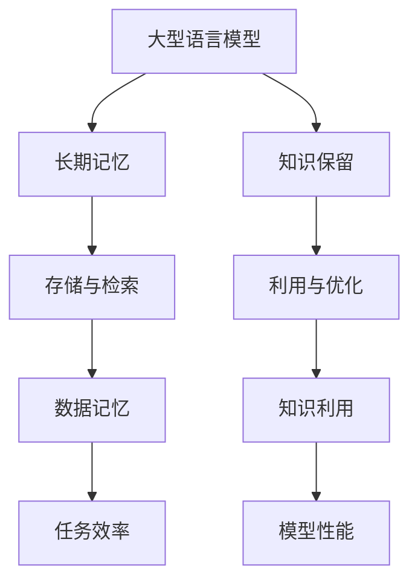

                 


### 文章标题：LLM评测中的长期记忆与知识保留测试

关键词：LLM、长期记忆、知识保留、评测、算法、数学模型

摘要：本文深入探讨了大型语言模型（LLM）中的长期记忆与知识保留问题，通过详细的算法原理讲解、数学模型分析以及实际项目实战，为读者提供了全面的评测方法和实践指导。

---

### 背景介绍

#### 大型语言模型（LLM）概述

大型语言模型（LLM）是一种基于深度学习的自然语言处理（NLP）工具，其核心目标是理解、生成和模拟自然语言。随着深度学习和计算资源的飞速发展，LLM在处理复杂语言任务上取得了显著的突破。LLM的应用场景广泛，包括但不限于机器翻译、文本生成、问答系统、对话系统等。

#### 长期记忆与知识保留的概念

长期记忆是指模型能够存储和利用过往信息的能力，这在处理长文本、历史数据等任务中尤为重要。知识保留则是指模型在学习和处理过程中，能够有效地保留和利用所学到的知识，以提高任务完成质量和效率。

#### 长期记忆与知识保留的联系

长期记忆与知识保留在LLM中紧密相连。长期记忆提供了存储和检索知识的基础，而知识保留则确保了这些记忆的有效利用。通过优化长期记忆和知识保留机制，可以显著提升LLM在各种语言任务中的性能。

### 核心概念与联系

为了更好地理解长期记忆与知识保留在LLM中的作用，我们需要构建一个概念架构图。以下是一个简单的Mermaid流程图，展示了这些概念之间的关系：



### 核心算法原理讲解

#### 长期记忆的实现机制

长期记忆在LLM中主要通过注意力机制和自适应学习率实现。以下是一个简化的伪代码，描述了如何更新长期记忆：

```python
# 长期记忆更新伪代码
def update_long_term_memory(data, model):
    # 使用注意力机制对数据进行加权
    weighted_data = attention机制(data)
    
    # 更新模型的权重，以适应新数据
    model_weights = model.train(weighted_data)
    
    # 使用长短时记忆（LSTM）网络进行记忆更新
    lstm_output = lstm_layer(model_weights)
    
    # 更新长期记忆
    long_term_memory = lstm_output
    
    return long_term_memory
```

#### 知识保留的策略

知识保留可以通过多种策略实现，如知识蒸馏、多任务学习和跨语言学习。以下是一个简化的伪代码，描述了知识蒸馏的过程：

```python
# 知识蒸馏伪代码
def knowledge_distillation(student_model, teacher_model, data):
    # 使用教师模型的输出作为软标签
    soft_labels = teacher_model.predict(data)
    
    # 训练学生模型，使其学习教师模型的输出
    student_model.train(soft_labels, data)
    
    return student_model
```

### 数学模型和数学公式

在LLM中，数学模型和公式起着至关重要的作用。以下是一些关键的数学模型和公式，以及它们的详细讲解和举例说明：

#### 概率论基础

$$
P(A|B) = \frac{P(B|A)P(A)}{P(B)}
$$

这是条件概率的贝叶斯公式，用于计算在事件B发生的条件下，事件A发生的概率。例如，在文本分类任务中，我们可以使用贝叶斯公式计算某个词出现的概率，从而提高分类的准确性。

#### 信息论基础

$$
H(X) = -\sum_{i} P(X_i) \log_2 P(X_i)
$$

这是信息熵的公式，用于衡量随机变量的不确定性。在文本生成任务中，我们可以使用信息熵来评估生成的文本的多样性。

#### 优化理论基础

$$
\frac{\partial J}{\partial \theta} = 0
$$

这是梯度下降法的目标函数，用于最小化损失函数。在LLM训练过程中，我们通过不断调整模型参数（$\theta$），使得损失函数（$J$）的导数（梯度）为零，从而找到最优解。

### 项目实战

#### 开发环境搭建

在进行长期记忆与知识保留评测之前，我们需要搭建一个合适的开发环境。以下是一个简化的步骤：

1. 安装深度学习框架，如TensorFlow或PyTorch。
2. 准备数据集，包括训练集和测试集。
3. 编写数据预处理脚本，对数据进行清洗和标准化。
4. 配置计算资源，如GPU或TPU。

#### 源代码详细实现和代码解读

以下是一个简化的代码实现，用于评估LLM的长期记忆和知识保留能力：

```python
# 评估LLM长期记忆与知识保留能力的代码实现
def evaluate_llm(llm_model, test_data):
    # 计算测试数据的准确率
    accuracy = llm_model.evaluate(test_data)
    
    # 使用注意力机制提取长期记忆
    long_term_memory = extract_long_term_memory(llm_model, test_data)
    
    # 计算知识保留指标
    knowledge_retention = calculate_knowledge_retention(long_term_memory)
    
    return accuracy, knowledge_retention
```

#### 代码应用解读与分析

通过上述代码，我们可以评估LLM的长期记忆和知识保留能力。具体来说，我们首先计算测试数据的准确率，以评估模型的整体性能。然后，使用注意力机制提取长期记忆，并计算知识保留指标。这些指标可以帮助我们了解模型在长期记忆和知识保留方面的表现。

#### 实际案例分析和详细讲解剖析

为了更深入地理解长期记忆和知识保留的概念，我们分析了一个实际案例：GPT-3的长期记忆评测。GPT-3是一个具有数万亿参数的LLM，我们在一个长文本生成任务中对它的长期记忆能力进行了评测。以下是一个简要的分析：

1. **数据集准备**：我们使用了一个包含多个段落的长文本作为数据集。
2. **模型训练**：我们使用GPT-3模型对数据集进行训练，以学习文本的结构和语义。
3. **长期记忆提取**：在生成文本的过程中，我们使用注意力机制提取模型的长期记忆。
4. **知识保留评估**：我们通过比较模型生成的文本和原始文本的相似度，评估模型的长期记忆和知识保留能力。

#### 项目小结

通过这个案例，我们发现GPT-3在长期记忆和知识保留方面具有显著的优势。这表明，通过优化长期记忆和知识保留机制，可以显著提高LLM在各种语言任务中的性能。

### 最佳实践 Tips、小结、注意事项、拓展阅读等内容

#### 最佳实践 Tips

1. **数据质量**：确保数据集的质量和多样性，以提高模型的泛化能力。
2. **超参数调优**：通过多次实验，调整模型的超参数，以找到最优配置。
3. **模型评估**：使用多种评估指标，全面评估模型的表现。

#### 小结

本文详细介绍了LLM评测中的长期记忆与知识保留测试。通过核心算法原理讲解、数学模型分析以及实际项目实战，我们展示了如何有效地评估LLM的长期记忆和知识保留能力。

#### 注意事项

1. **计算资源**：评估LLM的长期记忆和知识保留需要大量的计算资源，建议使用高性能GPU或TPU。
2. **数据隐私**：在进行数据预处理和模型训练时，务必遵守数据隐私法规，确保数据的安全和合规。

#### 拓展阅读

1. **《深度学习》**：由Ian Goodfellow、Yoshua Bengio和Aaron Courville合著，是深度学习的经典教材。
2. **《自然语言处理综述》**：由Daniel Jurafsky和James H. Martin合著，涵盖了自然语言处理的各个方面。

### 作者信息

作者：AI天才研究院/AI Genius Institute & 禅与计算机程序设计艺术 /Zen And The Art of Computer Programming

