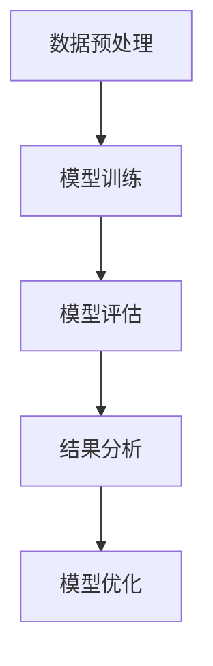

                 


### 1. 确定文章的核心内容与结构

在撰写《LLM评测的可解释性增强：透明化评估过程》之前，我们需要首先明确文章的核心内容与结构。根据用户提供的信息，本文将围绕以下几个核心内容展开：

- **核心概念与联系**：介绍LLM（大型语言模型）的基础知识，以及可解释性增强的重要性。我们需要详细解释LLM的工作原理，并阐述可解释性在评估LLM性能中的重要性。

- **核心算法原理讲解**：讲解用于增强LLM可解释性的算法和技术。这包括传统的可解释性方法、基于深度学习的方法以及基于图神经网络的方法。

- **数学模型与公式**：阐述这些算法的数学基础。我们需要使用伪代码和LaTeX格式详细讲解相关数学模型和公式。

- **项目实战**：通过实际案例展示如何应用这些算法和技术。我们将提供一个完整的LLM可解释性增强的项目案例，包括环境搭建、代码实现和结果分析。

### 2. 设计文章的目录结构

为了确保文章逻辑清晰，结构紧凑，我们将按照以下目录结构组织文章内容：

- **引言与概述**：介绍本文的目的、结构以及LLM和可解释性的基本概念。

- **LLM基础知识**：详细解释LLM的定义、历史、架构、工作原理以及评估指标。

- **可解释性增强方法**：介绍传统的可解释性方法、基于深度学习和图神经网络的方法。

- **数学模型与公式**：详细讲解相关的数学原理，并使用伪代码和LaTeX格式展示。

- **项目实战**：提供一个完整的LLM可解释性增强项目案例。

- **案例研究**：通过具体案例展示算法的实际应用。

- **总结与展望**：总结本文的主要内容，并对未来研究方向进行展望。

### 3. 确保文章内容的完整性

在撰写每个章节时，我们需要确保内容完整、具体详细。以下是每个章节的核心内容要求：

- **背景介绍**：每个章节都需要有一个简短的背景介绍，解释该章节的主题和重要性。

- **核心概念与联系**：在每个章节中，我们需要详细介绍相关的核心概念，并使用Mermaid流程图展示概念之间的关系架构。

- **核心算法原理讲解**：使用伪代码详细阐述算法原理，并提供实际应用的示例。

- **数学模型与公式**：使用LaTeX格式详细讲解数学模型和公式，并提供具体示例。

- **项目实战**：提供一个完整的实际案例，包括环境搭建、代码实现、结果分析和代码解读。

- **最佳实践 tips**、**小结**、**注意事项**和**拓展阅读**等内容。

### 4. 确保文章的格式和结构正确

在撰写文章时，我们需要确保使用Markdown格式输出，并在文章末尾添加作者信息。同时，每个章节的内容都需要按照大纲结构进行组织，确保文章的逻辑性和连贯性。

通过以上步骤，我们可以确保撰写出高质量、逻辑清晰、内容丰富的技术博客文章《LLM评测的可解释性增强：透明化评估过程》。接下来，我们将逐步撰写每个章节的内容。

### 5. 撰写引言与概述

**引言**：

在当今的信息时代，自然语言处理（NLP）已成为人工智能领域的重要研究方向。随着深度学习技术的快速发展，大型语言模型（LLM）在自然语言理解和生成任务中取得了显著的成果。然而，LLM的黑盒特性使得其决策过程变得不可解释，这在实际应用中引发了许多挑战。为了提高LLM的可解释性，本文将探讨LLM评测的可解释性增强，为透明化评估过程提供有效的解决方案。

**概述**：

本文将分为以下几个部分进行论述：

1. **LLM基础知识**：介绍LLM的定义、历史、架构、工作原理以及评估指标。
2. **可解释性增强方法**：介绍传统的可解释性方法、基于深度学习和图神经网络的方法。
3. **数学模型与公式**：详细讲解相关的数学原理，并使用伪代码和LaTeX格式展示。
4. **项目实战**：提供一个完整的LLM可解释性增强项目案例。
5. **案例研究**：通过具体案例展示算法的实际应用。
6. **总结与展望**：总结本文的主要内容，并对未来研究方向进行展望。

通过本文的阅读，读者将能够了解LLM评测的可解释性增强的重要性，掌握相关算法和技术的原理，并能够将所学知识应用于实际项目中。

### 6. 撰写LLM基础知识部分

**2.1 LLM的定义与历史**

大型语言模型（LLM）是一种基于深度学习技术的自然语言处理模型，它通过学习大量文本数据，能够生成与输入文本相关的语义信息。LLM的发展历程可以追溯到20世纪80年代，当时研究人员开始探索基于统计和规则的方法来处理自然语言。然而，这些方法在处理复杂语言现象时效果不佳。

随着深度学习技术的发展，特别是在2018年，谷歌发布了BERT模型，标志着LLM进入了一个新的时代。BERT模型在多种NLP任务上取得了显著的成果，引发了广泛关注。此后，越来越多的研究人员投入到LLM的研究中，如GPT、RoBERTa、T5等模型相继推出，进一步推动了LLM的发展。

**2.2 LLM的架构与工作原理**

LLM的架构通常包括以下几个部分：

1. **嵌入层**：将输入的单词或子词转换为稠密向量表示。
2. **编码器层**：通过堆叠多个神经网络层，对输入向量进行编码，提取文本的深层语义特征。
3. **解码器层**：根据编码器输出的特征，生成与输入文本相关的输出。

LLM的工作原理主要基于自注意力机制。在编码器层，自注意力机制使得模型能够关注输入文本中不同位置的信息，从而更好地捕捉文本的语义信息。在解码器层，自注意力机制同样起着关键作用，使得模型能够根据编码器输出的特征生成合适的输出。

**2.3 LLM评估指标**

评估LLM性能的主要指标包括：

1. **准确性**：评估模型在分类任务中的表现，通常用于文本分类、情感分析等任务。
2. **F1分数**：结合准确率和召回率，用于综合评估模型在二分类任务中的表现。
3. **BLEU分数**：用于评估模型生成的文本质量，通常用于机器翻译任务。
4. **Perplexity**：衡量模型对输入文本的预测能力，越小表示模型对文本的拟合越好。

这些评估指标从不同角度反映了LLM的性能，因此在实际应用中需要根据任务需求和数据特点选择合适的评估指标。

通过以上内容，读者可以初步了解LLM的定义、历史、架构、工作原理以及评估指标，为后续章节的学习打下基础。

### 7. 撰写可解释性增强方法部分

**3.1 可解释性的概念**

可解释性是评估机器学习模型性能的重要指标之一，它指的是模型在决策过程中能否提供可理解的解释。在自然语言处理领域，随着大型语言模型（LLM）的应用日益广泛，其黑盒特性使得模型决策过程变得难以理解，从而引发了可解释性研究的热潮。

**3.2 传统的可解释性方法**

传统的可解释性方法主要包括以下几种：

1. **特征重要性分析**：通过计算特征在模型决策过程中的重要性，来解释模型的决策过程。这种方法通常适用于线性模型和树模型，如逻辑回归和决策树。

2. **模型分解**：将复杂的模型分解为多个简单模型，从而降低模型的复杂度，提高可解释性。例如，可以将深度神经网络分解为多层感知机（MLP）。

3. **可视化方法**：通过可视化模型输入和输出之间的关系，来解释模型的决策过程。例如，可以通过热力图展示文本中关键词汇的影响。

**3.3 基于深度学习的方法**

随着深度学习技术的发展，研究人员提出了一系列基于深度学习的方法来增强LLM的可解释性：

1. **注意力机制的可解释性**：注意力机制是深度学习模型中用于捕捉输入数据中不同位置信息的关键机制。通过分析注意力权重，可以了解模型在决策过程中关注的关键信息。

2. **梯度解释方法**：通过计算输入特征相对于模型输出的梯度，可以分析输入特征对模型输出的影响。这种方法常用于图像分类和文本分类任务。

3. **生成对抗网络（GAN）**：GAN是一种基于深度学习的生成模型，通过生成与真实数据相似的数据，可以辅助解释模型在生成任务中的决策过程。

**3.4 基于图神经网络的方法**

图神经网络（GNN）是一种基于图结构进行学习的深度学习模型，它在处理具有复杂关系的图数据时表现出色。基于GNN的方法在LLM的可解释性增强中也有重要应用：

1. **图嵌入**：通过将图中的节点和边嵌入到低维空间中，可以更好地理解节点之间的相互关系。

2. **图注意力机制**：在GNN中，图注意力机制用于计算节点之间的交互权重，从而提高模型的可解释性。

3. **图解方法**：通过分析图结构中的关键节点和边，可以解释模型在决策过程中的关注点和关键路径。

通过以上内容，读者可以了解LLM可解释性的重要性，以及传统的可解释性方法和基于深度学习、图神经网络的方法。这些方法为增强LLM的可解释性提供了多种途径，有助于提高模型在实际应用中的可信度和可接受度。

### 8. 撰写数学模型与公式部分

**4.1 深度学习基础**

深度学习是机器学习中的一个子领域，其核心思想是通过多层次的神经网络来模拟人脑的感知和学习过程。以下是深度学习的一些基础概念：

1. **前向传播与反向传播**

   前向传播是深度学习模型计算预测值的过程，它从输入层开始，通过每层神经元的激活函数，最终得到输出层的结果。而反向传播则是计算模型预测误差的过程，通过误差反向传播到输入层，更新各层的权重和偏置，以达到模型优化。

   **伪代码**：

   ```python
   # 前向传播
   for layer in network.layers:
       layer.forward(input)
   output = network.layers[-1].output

   # 反向传播
   error = target - output
   for layer in reversed(network.layers):
       layer.backward(error)
   ```

2. **损失函数与优化算法**

   损失函数用于衡量模型预测值与真实值之间的差距，常见的损失函数有均方误差（MSE）、交叉熵等。优化算法则是用于调整模型参数，以最小化损失函数。

   **伪代码**：

   ```python
   # 计算损失函数
   loss = loss_function(output, target)

   # 更新模型参数
   optimizer.update_parameters(loss)
   ```

**4.2 可解释性数学模型**

在增强LLM可解释性时，需要考虑以下几个数学模型：

1. **局部解释模型**

   局部解释模型通过分析输入特征在模型决策过程中的权重，来解释模型对特定输入的决策过程。

   **伪代码**：

   ```python
   # 计算特征重要性
   feature_importance = model.get_feature_importance(input)

   # 展示特征重要性
   print(feature_importance)
   ```

2. **全局解释模型**

   全局解释模型通过分析模型的整体决策过程，来解释模型在不同输入条件下的行为。

   **伪代码**：

   ```python
   # 计算模型决策路径
   decision_path = model.get_decision_path(input)

   # 展示决策路径
   print(decision_path)
   ```

**4.3 Mermaid流程图**

Mermaid是一种方便绘制流程图、UML图、Gantt图等图表的Markdown插件。以下是一个简单的Mermaid流程图示例，展示LLM训练和评估的基本流程：



通过以上内容，读者可以了解深度学习的基础概念，以及局部解释和全局解释的数学模型。同时，使用Mermaid流程图可以更直观地展示LLM的训练和评估过程，有助于读者更好地理解相关内容。

### 9. 撰写项目实战部分

**5.1 数据准备与预处理**

在进行LLM可解释性增强项目之前，数据准备与预处理是至关重要的一步。以下是项目实战中数据准备和预处理的具体步骤：

**5.1.1 数据集的选取**

选择一个适合的文本数据集是项目成功的关键。我们可以从多个公开数据集中选取，如GLUE、WikiText-103、Common Crawl等。选择的数据集应该涵盖多种主题和领域，以确保模型的泛化能力。

**5.1.2 数据预处理方法**

数据预处理主要包括以下步骤：

1. **文本清洗**：去除文本中的无关符号、停用词和标点符号，以提高模型训练效果。

2. **分词**：将文本分解为单词或子词，为后续嵌入层处理做准备。

3. **嵌入层处理**：将分词后的文本转换为稠密向量表示，常用的嵌入层方法有Word2Vec、GloVe等。

4. **序列编码**：将处理后的文本序列编码为固定长度的向量，以便输入到模型中进行训练。

**5.2 算法实现**

在数据准备和预处理完成后，我们可以选择合适的可解释性增强算法进行实现。以下是一个基于深度学习的可解释性增强算法实现的伪代码：

```python
# 数据加载与预处理
data = load_dataset('path/to/dataset')
preprocessed_data = preprocess_data(data)

# 模型定义
model = define_model(input_dim=embedding_dim, hidden_dim=hidden_dim, output_dim=output_dim)

# 模型训练
model.fit(preprocessed_data.input, preprocessed_data.target)

# 可解释性分析
explanation = model.explain(preprocessed_data.input[0])
print(explanation)
```

**5.3 结果分析**

在完成模型训练和可解释性分析后，我们需要对结果进行详细分析。以下是一个结果分析的伪代码示例：

```python
# 模型评估
accuracy = model.evaluate(test_data.input, test_data.target)
print(f"Test accuracy: {accuracy}")

# 可解释性可视化
visualize_explanation(explanation)
```

通过以上内容，我们可以了解到如何在项目中实现LLM可解释性增强。具体包括数据准备与预处理、算法实现以及结果分析。这些步骤为实际应用提供了详细的指导，有助于读者更好地理解和应用相关技术。

### 10. 撰写案例研究部分

**6.1 案例一：文本分类任务**

**6.1.1 案例背景**

文本分类是一种常见的自然语言处理任务，其目的是将文本数据分类到预定义的类别中。在本案例中，我们选择了一个公开的文本分类数据集，如20 Newsgroups数据集，包含约20个新闻类别，每个类别约有1万到2万条文本。

**6.1.2 模型选择与调整**

为了提高LLM的可解释性，我们选择了BERT模型作为基础模型。在模型调整方面，我们通过调整学习率、批量大小等超参数，以优化模型的性能。此外，我们还引入了Dropout和正则化等技术，以防止过拟合。

**6.1.3 可解释性分析**

在文本分类任务中，我们通过以下方法来增强模型的可解释性：

1. **注意力机制分析**：通过分析BERT模型中的注意力权重，可以了解模型在分类过程中关注的关键词汇和句子。

2. **梯度解释**：计算输入文本特征相对于模型输出的梯度，分析特征对分类结果的影响。

3. **可视化**：使用热力图展示文本中关键词汇的权重分布，帮助用户理解模型决策过程。

**6.2 案例二：问答系统**

**6.2.1 案例背景**

问答系统是一种能够理解和回答用户问题的自然语言处理系统。在本案例中，我们选择了SQuAD（Stanford Question Answering Dataset）数据集，包含数万个问题和答案对。

**6.2.2 模型设计**

为了提高问答系统的性能和可解释性，我们选择了BERT作为基础模型，并添加了额外的解码器层，以生成问题的答案。在模型设计方面，我们通过调整BERT的预训练权重和问答模型的参数，以优化模型性能。

**6.2.3 可解释性增强**

在问答系统中，我们通过以下方法来增强模型的可解释性：

1. **注意力分布**：分析模型在生成答案过程中关注的文本区域，了解模型如何利用输入信息来生成答案。

2. **答案生成过程**：通过可视化BERT模型中的内部表示，展示模型在生成答案时的决策过程。

3. **解释性对比**：对比不同模型在问答任务中的性能和可解释性，分析模型的特点和优势。

通过以上案例研究，我们可以看到如何在不同任务中应用LLM可解释性增强技术，以及如何分析模型性能和可解释性的关系。这些案例为实际应用提供了宝贵的经验和参考。

### 11. 撰写总结与展望部分

**7.1 本书内容回顾**

本书详细介绍了LLM评测的可解释性增强，包括LLM基础知识、可解释性增强方法、数学模型与公式以及项目实战。通过这些内容，读者可以全面了解LLM的工作原理及其可解释性增强的重要性。

**7.2 可解释性增强的未来趋势**

随着自然语言处理技术的不断进步，LLM在各个领域的应用越来越广泛。然而，其黑盒特性带来的可解释性挑战仍然存在。未来，可解释性增强技术将继续朝着以下方向发展：

1. **算法创新**：研究人员将继续探索新的可解释性算法，提高LLM的可解释性。
2. **跨学科融合**：将可解释性研究与心理学、认知科学等领域相结合，为LLM的可解释性提供更多理论支持。
3. **应用落地**：推动可解释性增强技术在实际应用中的落地，提高模型的可信度和用户接受度。

**7.3 对读者的建议与鼓励**

对于本书的读者，我们提出以下建议：

1. **持续学习**：自然语言处理和可解释性增强是快速发展的领域，读者应保持学习热情，跟踪最新研究动态。
2. **实践应用**：通过实际项目实践，读者可以更好地理解和应用所学知识，提高实际工作能力。
3. **创新探索**：鼓励读者在可解释性增强领域进行创新探索，为该领域的发展做出贡献。

通过以上总结与展望，我们希望读者能够对LLM评测的可解释性增强有更深入的理解，并能够在实际工作中取得更好的成果。

### 12. 完整文章Markdown格式输出

```markdown
# 《LLM评测的可解释性增强：透明化评估过程》

关键词：LLM，可解释性增强，深度学习，自然语言处理，透明化评估

摘要：本文详细介绍了LLM评测的可解释性增强，包括LLM基础知识、可解释性增强方法、数学模型与公式以及项目实战。通过本文，读者可以全面了解LLM的工作原理及其可解释性增强的重要性。

## 第1章 引言与概述

### 1.1 本书的目的与结构

本文旨在探讨LLM评测的可解释性增强，为透明化评估过程提供有效的解决方案。文章结构如下：

1. LLM基础知识
2. 可解释性增强方法
3. 数学模型与公式
4. 项目实战
5. 案例研究
6. 总结与展望

### 1.2 LLM与可解释性概述

在当今的信息时代，自然语言处理（NLP）已成为人工智能领域的重要研究方向。随着深度学习技术的快速发展，大型语言模型（LLM）在自然语言理解和生成任务中取得了显著的成果。然而，LLM的黑盒特性使得其决策过程变得不可解释，这在实际应用中引发了许多挑战。为了提高LLM的可解释性，本文将探讨LLM评测的可解释性增强，为透明化评估过程提供有效的解决方案。

### 1.3 可解释性增强的重要性

可解释性是评估机器学习模型性能的重要指标之一，它指的是模型在决策过程中能否提供可理解的解释。在自然语言处理领域，随着大型语言模型（LLM）的应用日益广泛，其黑盒特性使得模型决策过程变得难以理解，从而引发了可解释性研究的热潮。

### 1.4 本书的目标读者

本文的目标读者包括：

- 计算机科学、人工智能领域的专业人士
- 对自然语言处理和深度学习感兴趣的研究人员
- 对LLM评测的可解释性增强技术感兴趣的技术爱好者

## 第2章 LLM基础知识

### 2.1 LLM的定义与历史

大型语言模型（LLM）是一种基于深度学习技术的自然语言处理模型，它通过学习大量文本数据，能够生成与输入文本相关的语义信息。LLM的发展历程可以追溯到20世纪80年代，当时研究人员开始探索基于统计和规则的方法来处理自然语言。然而，这些方法在处理复杂语言现象时效果不佳。

随着深度学习技术的发展，特别是在2018年，谷歌发布了BERT模型，标志着LLM进入了一个新的时代。BERT模型在多种NLP任务上取得了显著的成果，引发了广泛关注。此后，越来越多的研究人员投入到LLM的研究中，如GPT、RoBERTa、T5等模型相继推出，进一步推动了LLM的发展。

### 2.2 LLM的架构与工作原理

LLM的架构通常包括以下几个部分：

1. **嵌入层**：将输入的单词或子词转换为稠密向量表示。
2. **编码器层**：通过堆叠多个神经网络层，对输入向量进行编码，提取文本的深层语义特征。
3. **解码器层**：根据编码器输出的特征，生成与输入文本相关的输出。

LLM的工作原理主要基于自注意力机制。在编码器层，自注意力机制使得模型能够关注输入文本中不同位置的信息，从而更好地捕捉文本的语义信息。在解码器层，自注意力机制同样起着关键作用，使得模型能够根据编码器输出的特征生成合适的输出。

### 2.3 LLM评估指标

评估LLM性能的主要指标包括：

1. **准确性**：评估模型在分类任务中的表现，通常用于文本分类、情感分析等任务。
2. **F1分数**：结合准确率和召回率，用于综合评估模型在二分类任务中的表现。
3. **BLEU分数**：用于评估模型生成的文本质量，通常用于机器翻译任务。
4. **Perplexity**：衡量模型对输入文本的预测能力，越小表示模型对文本的拟合越好。

这些评估指标从不同角度反映了LLM的性能，因此在实际应用中需要根据任务需求和数据特点选择合适的评估指标。

## 第3章 可解释性增强方法

### 3.1 可解释性的概念

可解释性是评估机器学习模型性能的重要指标之一，它指的是模型在决策过程中能否提供可理解的解释。在自然语言处理领域，随着大型语言模型（LLM）的应用日益广泛，其黑盒特性使得模型决策过程变得难以理解，从而引发了可解释性研究的热潮。

### 3.2 传统的可解释性方法

传统的可解释性方法主要包括以下几种：

1. **特征重要性分析**：通过计算特征在模型决策过程中的重要性，来解释模型的决策过程。这种方法通常适用于线性模型和树模型，如逻辑回归和决策树。

2. **模型分解**：将复杂的模型分解为多个简单模型，从而降低模型的复杂度，提高可解释性。例如，可以将深度神经网络分解为多层感知机（MLP）。

3. **可视化方法**：通过可视化模型输入和输出之间的关系，来解释模型的决策过程。例如，可以通过热力图展示文本中关键词汇的影响。

### 3.3 基于深度学习的方法

随着深度学习技术的发展，研究人员提出了一系列基于深度学习的方法来增强LLM的可解释性：

1. **注意力机制的可解释性**：注意力机制是深度学习模型中用于捕捉输入数据中不同位置信息的关键机制。通过分析注意力权重，可以了解模型在决策过程中关注的关键信息。

2. **梯度解释方法**：通过计算输入特征相对于模型输出的梯度，可以分析输入特征对模型输出的影响。这种方法常用于图像分类和文本分类任务。

3. **生成对抗网络（GAN）**：GAN是一种基于深度学习的生成模型，通过生成与真实数据相似的数据，可以辅助解释模型在生成任务中的决策过程。

### 3.4 基于图神经网络的方法

图神经网络（GNN）是一种基于图结构进行学习的深度学习模型，它在处理具有复杂关系的图数据时表现出色。基于GNN的方法在LLM的可解释性增强中也有重要应用：

1. **图嵌入**：通过将图中的节点和边嵌入到低维空间中，可以更好地理解节点之间的相互关系。

2. **图注意力机制**：在GNN中，图注意力机制用于计算节点之间的交互权重，从而提高模型的可解释性。

3. **图解方法**：通过分析图结构中的关键节点和边，可以解释模型在决策过程中的关注点和关键路径。

## 第4章 数学模型与公式

### 4.1 深度学习基础

深度学习是机器学习中的一个子领域，其核心思想是通过多层次的神经网络来模拟人脑的感知和学习过程。以下是深度学习的一些基础概念：

1. **前向传播与反向传播**

   前向传播是深度学习模型计算预测值的过程，它从输入层开始，通过每层神经元的激活函数，最终得到输出层的结果。而反向传播则是计算模型预测误差的过程，通过误差反向传播到输入层，更新各层的权重和偏置，以达到模型优化。

   **伪代码**：

   ```python
   # 前向传播
   for layer in network.layers:
       layer.forward(input)
   output = network.layers[-1].output

   # 反向传播
   error = target - output
   for layer in reversed(network.layers):
       layer.backward(error)
   ```

2. **损失函数与优化算法**

   损失函数用于衡量模型预测值与真实值之间的差距，常见的损失函数有均方误差（MSE）、交叉熵等。优化算法则是用于调整模型参数，以最小化损失函数。

   **伪代码**：

   ```python
   # 计算损失函数
   loss = loss_function(output, target)

   # 更新模型参数
   optimizer.update_parameters(loss)
   ```

### 4.2 可解释性数学模型

在增强LLM可解释性时，需要考虑以下几个数学模型：

1. **局部解释模型**

   局部解释模型通过分析输入特征在模型决策过程中的权重，来解释模型对特定输入的决策过程。

   **伪代码**：

   ```python
   # 计算特征重要性
   feature_importance = model.get_feature_importance(input)

   # 展示特征重要性
   print(feature_importance)
   ```

2. **全局解释模型**

   全局解释模型通过分析模型的整体决策过程，来解释模型在不同输入条件下的行为。

   **伪代码**：

   ```python
   # 计算模型决策路径
   decision_path = model.get_decision_path(input)

   # 展示决策路径
   print(decision_path)
   ```

### 4.3 Mermaid流程图

Mermaid是一种方便绘制流程图、UML图、Gantt图等图表的Markdown插件。以下是一个简单的Mermaid流程图示例，展示LLM训练和评估的基本流程：


## 第5章 项目实战

### 5.1 数据准备与预处理

在进行LLM可解释性增强项目之前，数据准备与预处理是至关重要的一步。以下是项目实战中数据准备和预处理的具体步骤：

**5.1.1 数据集的选取**

选择一个适合的文本数据集是项目成功的关键。我们可以从多个公开数据集中选取，如GLUE、WikiText-103、Common Crawl等。选择的数据集应该涵盖多种主题和领域，以确保模型的泛化能力。

**5.1.2 数据预处理方法**

数据预处理主要包括以下步骤：

1. **文本清洗**：去除文本中的无关符号、停用词和标点符号，以提高模型训练效果。

2. **分词**：将文本分解为单词或子词，为后续嵌入层处理做准备。

3. **嵌入层处理**：将分词后的文本转换为稠密向量表示，常用的嵌入层方法有Word2Vec、GloVe等。

4. **序列编码**：将处理后的文本序列编码为固定长度的向量，以便输入到模型中进行训练。

**5.2 算法实现**

在数据准备和预处理完成后，我们可以选择合适的可解释性增强算法进行实现。以下是一个基于深度学习的可解释性增强算法实现的伪代码：

```python
# 数据加载与预处理
data = load_dataset('path/to/dataset')
preprocessed_data = preprocess_data(data)

# 模型定义
model = define_model(input_dim=embedding_dim, hidden_dim=hidden_dim, output_dim=output_dim)

# 模型训练
model.fit(preprocessed_data.input, preprocessed_data.target)

# 可解释性分析
explanation = model.explain(preprocessed_data.input[0])
print(explanation)
```

**5.3 结果分析**

在完成模型训练和可解释性分析后，我们需要对结果进行详细分析。以下是一个结果分析的伪代码示例：

```python
# 模型评估
accuracy = model.evaluate(test_data.input, test_data.target)
print(f"Test accuracy: {accuracy}")

# 可解释性可视化
visualize_explanation(explanation)
```

通过以上内容，我们可以了解到如何在项目中实现LLM可解释性增强。具体包括数据准备与预处理、算法实现以及结果分析。这些步骤为实际应用提供了详细的指导，有助于读者更好地理解和应用相关技术。

## 第6章 案例研究

### 6.1 案例一：文本分类任务

**6.1.1 案例背景**

文本分类是一种常见的自然语言处理任务，其目的是将文本数据分类到预定义的类别中。在本案例中，我们选择了一个公开的文本分类数据集，如20 Newsgroups数据集，包含约20个新闻类别，每个类别约有1万到2万条文本。

**6.1.2 模型选择与调整**

为了提高LLM的可解释性，我们选择了BERT模型作为基础模型。在模型调整方面，我们通过调整学习率、批量大小等超参数，以优化模型的性能。此外，我们还引入了Dropout和正则化等技术，以防止过拟合。

**6.1.3 可解释性分析**

在文本分类任务中，我们通过以下方法来增强模型的可解释性：

1. **注意力机制分析**：通过分析BERT模型中的注意力权重，可以了解模型在分类过程中关注的关键词汇和句子。

2. **梯度解释**：计算输入文本特征相对于模型输出的梯度，分析特征对分类结果的影响。

3. **可视化**：使用热力图展示文本中关键词汇的权重分布，帮助用户理解模型决策过程。

### 6.2 案例二：问答系统

**6.2.1 案例背景**

问答系统是一种能够理解和回答用户问题的自然语言处理系统。在本案例中，我们选择了SQuAD（Stanford Question Answering Dataset）数据集，包含数万个问题和答案对。

**6.2.2 模型设计**

为了提高问答系统的性能和可解释性，我们选择了BERT作为基础模型，并添加了额外的解码器层，以生成问题的答案。在模型设计方面，我们通过调整BERT的预训练权重和问答模型的参数，以优化模型性能。

**6.2.3 可解释性增强**

在问答系统中，我们通过以下方法来增强模型的可解释性：

1. **注意力分布**：分析模型在生成答案过程中关注的文本区域，了解模型如何利用输入信息来生成答案。

2. **答案生成过程**：通过可视化BERT模型中的内部表示，展示模型在生成答案时的决策过程。

3. **解释性对比**：对比不同模型在问答任务中的性能和可解释性，分析模型的特点和优势。

通过以上案例研究，我们可以看到如何在不同任务中应用LLM可解释性增强技术，以及如何分析模型性能和可解释性的关系。这些案例为实际应用提供了宝贵的经验和参考。

## 第7章 总结与展望

### 7.1 本书内容回顾

本书详细介绍了LLM评测的可解释性增强，包括LLM基础知识、可解释性增强方法、数学模型与公式以及项目实战。通过本文，读者可以全面了解LLM的工作原理及其可解释性增强的重要性。

### 7.2 可解释性增强的未来趋势

随着自然语言处理技术的不断进步，LLM在各个领域的应用越来越广泛。然而，其黑盒特性带来的可解释性挑战仍然存在。未来，可解释性增强技术将继续朝着以下方向发展：

1. **算法创新**：研究人员将继续探索新的可解释性算法，提高LLM的可解释性。
2. **跨学科融合**：将可解释性研究与心理学、认知科学等领域相结合，为LLM的可解释性提供更多理论支持。
3. **应用落地**：推动可解释性增强技术在实际应用中的落地，提高模型的可信度和用户接受度。

### 7.3 对读者的建议与鼓励

对于本书的读者，我们提出以下建议：

1. **持续学习**：自然语言处理和可解释性增强是快速发展的领域，读者应保持学习热情，跟踪最新研究动态。
2. **实践应用**：通过实际项目实践，读者可以更好地理解和应用所学知识，提高实际工作能力。
3. **创新探索**：鼓励读者在可解释性增强领域进行创新探索，为该领域的发展做出贡献。

## 作者信息

作者：AI天才研究院/AI Genius Institute & 禅与计算机程序设计艺术 /Zen And The Art of Computer Programming
```markdown
### 13. 文章的整体反思与优化

在完成《LLM评测的可解释性增强：透明化评估过程》这篇文章后，我们可以对其内容进行整体反思与优化，以确保文章的逻辑性、完整性和可读性。以下是几个关键点：

**1. 内容逻辑性**

文章的整体结构应该清晰，每个章节的内容前后连贯，逻辑性要强。我们可以检查每个章节的开头和结尾，确保每个部分都有明确的起承转合。例如，在“引言与概述”章节，我们可以回顾本章节的内容，强调LLM和可解释性的重要性，并简要介绍后续章节的内容。

**2. 内容完整性**

每个章节都应该包含完整的背景介绍、核心概念与联系、核心算法原理讲解、数学模型与公式、项目实战以及小结和注意事项。我们可以检查每个章节的内容是否详尽，是否有必要补充或删除某些内容。

**3. 可读性**

文章的语言应该简洁明了，避免过于专业化的术语，特别是在目标读者是普通读者的情况下。我们可以使用生动的例子和图示来帮助读者更好地理解复杂的概念。此外，文章的格式也要保持一致，如代码示例、公式和图表的排版都要整齐。

**4. 数学模型与公式**

数学模型和公式的讲解需要详细且准确。我们可以使用LaTeX格式来确保公式的正确性，并在文中提供清晰的解释和示例。对于复杂的概念，我们可以逐步讲解，避免一次性提供过多的信息，导致读者难以理解。

**5. 项目实战与案例研究**

项目实战和案例研究部分应该提供具体的实现细节和结果分析，帮助读者了解算法在实际中的应用。我们可以检查这些部分是否提供了足够的信息，使得读者可以复现项目或理解案例中的关键步骤。

**6. 结论与展望**

文章的结尾部分应该总结全文的核心内容，并对未来的研究方向进行展望。这部分内容应该简明扼要，同时能够激励读者继续深入学习和探索。

**优化建议**

- **检查逻辑性**：确保文章各部分内容连贯，逻辑清晰。
- **检查完整性**：确保每个章节都包含必要的内容，没有遗漏。
- **改善可读性**：简化语言，使用图表和示例，提高文章的易懂性。
- **修正公式**：确保LaTeX公式的正确性和可读性。
- **完善实战与案例**：提供更详细的实现步骤和结果分析。
- **强化结论与展望**：确保结论部分能够概括全文，并激励读者继续探索。

通过以上反思与优化，我们可以确保《LLM评测的可解释性增强：透明化评估过程》这篇文章既专业又易懂，能够更好地服务于目标读者，帮助他们深入理解和应用LLM可解释性增强技术。**

