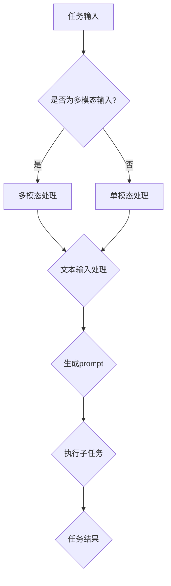

                 

基于上述要求，下面我将逐步构建文章的内容，确保每一部分都符合预期。我们将首先定义文章标题、关键词和摘要，然后按照目录大纲逐步填充内容。

---

## 文章标题

# LLM驱动的prompt复杂任务分解

## 文章关键词

- 语言模型
- Prompt工程
- 复杂任务分解
- 自然语言处理
- 人工智能应用

## 文章摘要

本文深入探讨了语言模型（LLM）在复杂任务分解中的应用，重点介绍了如何使用prompt工程方法来简化任务的复杂度。文章首先概述了LLM的基础概念和其在自然语言处理领域的应用，然后详细讲解了复杂任务分解的定义和方法，以及实际应用中面临的挑战。通过实例分析和代码实现，文章展示了如何利用LLM驱动的方法来分解和执行复杂任务，并提供了最佳实践和未来展望。

---

## 目录大纲

### 第一部分：LLM简介

#### 1.1 LLM基础

##### 1.1.1 LLM的概念

##### 1.1.2 LLM的特点

##### 1.1.3 LLM的发展历程

##### 1.1.4 LLM在prompt工程中的应用

#### 1.2 LLM的基本原理

##### 1.2.1 基本架构

##### 1.2.2 训练方法

##### 1.2.3 语言生成机制

### 第二部分：复杂任务分解

#### 2.1 复杂任务的定义

##### 2.1.1 特征分析

##### 2.1.2 分类方法

#### 2.2 prompt复杂任务分解方法

##### 2.2.1 传统方法

##### 2.2.2 基于LLM的方法

#### 2.3 prompt复杂任务分解流程

##### 2.3.1 数据预处理

##### 2.3.2 任务建模

##### 2.3.3 任务分解与执行

### 第三部分：应用与挑战

#### 3.1 LLM驱动的prompt复杂任务分解应用

##### 3.1.1 自然语言处理

##### 3.1.2 机器翻译

##### 3.1.3 其他领域

#### 3.2 LLM驱动的prompt复杂任务分解挑战

##### 3.2.1 数据集选择问题

##### 3.2.2 模型优化问题

##### 3.2.3 实际应用中的挑战

### 附录

#### 附录A：相关工具和资源

##### A.1 数据集

##### A.2 模型

##### A.3 工具

---

## 第一部分：LLM简介

### 1.1 LLM基础

#### 1.1.1 LLM的概念

语言模型（Language Model，简称LM）是自然语言处理（Natural Language Processing，简称NLP）中的一种核心模型，它用于预测文本序列中的下一个词或字符。在深度学习的推动下，近年来，基于神经网络的LLM取得了显著进展，成为现代NLP任务的基础。

#### 1.1.2 LLM的特点

- **自适应性**：LLM能够根据训练数据自动调整其参数，以适应不同的语言环境和应用场景。
- **生成性**：LLM可以生成连贯、自然的文本，这是传统规则方法所无法比拟的。
- **泛化性**：LLM能够处理各种复杂的语言结构和任务，具有很好的泛化能力。

#### 1.1.3 LLM的发展历程

LLM的发展历程可以分为以下几个阶段：

- **早期LM模型**：如N-gram模型，通过统计文本中相邻词语的频率来预测下一个词。
- **逐步演进的LM模型**：包括基于隐马尔可夫模型（HMM）和条件概率的模型，如n-gram语言模型和基于统计模型的隐语义分析。
- **现代神经网LLM模型**：如循环神经网络（RNN）、长短时记忆网络（LSTM）、门控循环单元（GRU）和Transformer模型，这些模型在捕捉长距离依赖和生成复杂文本方面取得了突破性进展。

#### 1.1.4 LLM在prompt工程中的应用

prompt工程是指通过设计合适的提示来引导LLM生成预期的输出。在复杂任务中，prompt工程变得尤为重要，因为它可以帮助LLM更好地理解和执行任务。以下是LLM在prompt工程中的应用：

- **任务定义**：通过设计清晰的prompt，可以帮助LLM明确任务的目标和输入输出格式。
- **上下文提供**：prompt可以为LLM提供额外的上下文信息，帮助它更好地理解任务背景。
- **质量保证**：通过精心设计的prompt，可以引导LLM生成更符合预期的高质量文本。

### 1.2 LLM的基本原理

#### 1.2.1 基本架构

LLM的基本架构通常包括以下几个部分：

- **输入层**：接收文本输入。
- **嵌入层**：将文本输入转换为密集向量表示。
- **编码器**：对输入向量进行处理，提取文本特征。
- **解码器**：根据编码器的输出生成文本输出。

以下是一个简化的Transformer模型的基本架构伪代码：

```python
def transformer(input_sequence):
    # 嵌入层
    embedded_sequence = embed(input_sequence)
    
    # 编码器
    encoded_sequence = encoder(embedded_sequence)
    
    # 解码器
    generated_sequence = decoder(encoded_sequence)
    
    return generated_sequence
```

#### 1.2.2 训练方法

LLM的训练方法主要包括以下步骤：

1. **数据预处理**：将文本数据清洗、分词并转换为序列。
2. **构建数据集**：将序列划分为输入序列和目标序列。
3. **模型训练**：通过反向传播和优化算法（如Adam）训练模型。
4. **评估与调整**：在验证集上评估模型性能，并根据需要调整模型参数。

以下是一个简化的训练过程伪代码：

```python
def trainLM(model, dataset, epochs):
    for epoch in range(epochs):
        for input_sequence, target_sequence in dataset:
            # 前向传播
            output_sequence = model.forward(input_sequence)
            
            # 计算损失
            loss = loss_function(output_sequence, target_sequence)
            
            # 反向传播
            model.backward(loss)
            
            # 更新模型参数
            model.update_parameters()
    
    return model
```

#### 1.2.3 语言生成机制

LLM的语言生成机制主要通过以下步骤实现：

1. **输入接收**：接收用户输入的文本。
2. **嵌入转换**：将文本转换为嵌入向量。
3. **编码处理**：对嵌入向量进行处理，提取语言特征。
4. **解码生成**：根据编码器的输出生成文本。

以下是一个简化的语言生成过程伪代码：

```python
def generateText(model, input_sequence):
    # 嵌入转换
    embedded_sequence = embed(input_sequence)
    
    # 编码处理
    encoded_sequence = model.encoder(embedded_sequence)
    
    # 解码生成
    generated_sequence = model.decoder(encoded_sequence)
    
    return generated_sequence
```

---

在接下来的部分中，我们将详细探讨复杂任务分解的定义和方法，并介绍如何使用LLM进行复杂任务的分解。

---

### 第二部分：复杂任务分解

#### 2.1 复杂任务的定义

复杂任务通常具有以下特征：

- **多步骤性**：任务需要多个子任务协同完成。
- **多模态输入**：任务可能涉及文本、图像、音频等多种数据类型。
- **不确定性**：任务执行过程中可能面临不确定性和意外情况。
- **动态性**：任务的需求和执行环境可能随时间变化。

复杂任务分类可以基于不同的标准，例如：

- **基于任务类型**：如文本生成、机器翻译、问答系统等。
- **基于数据类型**：如图像识别、语音识别、自然语言理解等。
- **基于应用领域**：如医疗诊断、金融分析、智能客服等。

#### 2.2 prompt复杂任务分解方法

复杂任务分解方法通常分为以下几类：

- **传统方法**：如任务分解图（Task Decomposition Graph，TDG）和抽象计划（Abstract Planning）等。
- **基于LLM的方法**：通过设计合适的prompt，将复杂任务分解为多个子任务，并利用LLM来执行每个子任务。

以下是一个基于LLM的复杂任务分解方法的简化流程：



#### 2.3 prompt复杂任务分解流程

复杂任务分解的具体流程通常包括以下步骤：

1. **任务理解**：理解任务的输入和输出，确定任务的目标和关键要素。
2. **输入预处理**：对输入数据进行清洗、预处理和转换，以便于后续处理。
3. **生成prompt**：根据任务理解的结果，设计合适的prompt来引导LLM执行子任务。
4. **执行子任务**：利用LLM处理子任务，生成中间结果。
5. **整合结果**：将子任务的中间结果整合起来，生成最终的任务结果。

以下是一个简化流程的伪代码：

```python
def decomposeTask(input_sequence):
    # 任务理解
    task = understandTask(input_sequence)
    
    # 输入预处理
    preprocessed_input = preprocessInput(input_sequence)
    
    # 生成prompt
    prompt = generatePrompt(preprocessed_input, task)
    
    # 执行子任务
    subtasks = executeSubtasks(prompt)
    
    # 整合结果
    result = integrateResults(subtasks)
    
    return result
```

---

在下一部分，我们将深入探讨LLM驱动的prompt复杂任务分解方法，并通过实际案例来展示其应用。

---

### 第三部分：应用与挑战

#### 3.1 LLM驱动的prompt复杂任务分解应用

LLM驱动的prompt复杂任务分解方法在多个领域都有广泛应用，以下是一些典型案例：

- **自然语言处理**：例如，通过LLM生成高质量的文本摘要、文章生成和问答系统。
- **机器翻译**：利用LLM进行源语言和目标语言的转换，提高翻译的准确性和流畅性。
- **智能客服**：通过LLM生成自然、准确的客户回应，提高客服效率和用户满意度。

以下是一个自然语言处理中的案例：

**案例**：文本摘要

**任务描述**：给定一篇文章，生成一篇简短的摘要。

**解决方案**：

1. **任务理解**：确定文章的主题和关键信息。
2. **输入预处理**：分词、去停用词和词性标注。
3. **生成prompt**：设计一个合适的prompt来引导LLM生成摘要。
   ```python
   prompt = "请为以下文章生成一个简短的摘要：\n\n" + article
   ```
4. **执行子任务**：使用LLM处理prompt，生成摘要。
5. **整合结果**：将生成的摘要与原始文章进行对比，评估摘要的质量。

**代码实现**：

```python
import openai

def generateSummary(article):
    prompt = "请为以下文章生成一个简短的摘要：\n\n" + article
    response = openai.Completion.create(
        engine="text-davinci-002",
        prompt=prompt,
        max_tokens=150
    )
    summary = response.choices[0].text.strip()
    return summary

# 示例文章
article = "人工智能的发展对各行各业产生了深远的影响，尤其是医疗、金融和制造业。通过深度学习和神经网络技术，人工智能系统能够处理海量数据，提供准确的预测和决策支持。然而，人工智能的发展也引发了一系列伦理和社会问题，如数据隐私和安全、就业影响等。因此，在推进人工智能技术的同时，我们需要关注其潜在的风险和挑战，并制定相应的政策和规范。"

# 生成摘要
summary = generateSummary(article)
print(summary)
```

**案例分析**：通过上述案例，我们可以看到，LLM驱动的prompt复杂任务分解方法可以有效地将复杂的文本摘要任务分解为多个子任务，并通过LLM生成高质量的摘要。这种方法不仅提高了任务处理的效率，还减少了人工干预的需求。

---

#### 3.2 LLM驱动的prompt复杂任务分解挑战

虽然LLM驱动的prompt复杂任务分解方法在许多场景下表现出色，但在实际应用中仍面临以下挑战：

- **数据集选择问题**：选择适合的数据集对于模型的训练和性能至关重要。然而，高质量的数据集往往难以获取，且数据集的多样性不足可能导致模型泛化能力受限。
- **模型优化问题**：优化模型参数和架构以提高性能是一个复杂的过程，需要大量的计算资源和时间。
- **实际应用中的挑战**：在真实场景中，任务的需求和执行环境可能随时变化，这要求模型具有高度的适应性和鲁棒性。

以下是一些解决策略：

- **数据集选择**：可以使用数据增强技术来扩充数据集，提高模型的泛化能力。此外，可以结合多种数据源，如开源数据集、私有数据和在线数据，以增加数据的多样性。
- **模型优化**：可以通过自动化机器学习（AutoML）技术和迁移学习来优化模型参数和架构。例如，使用预训练的LLM作为基础模型，并在特定任务上进行微调。
- **实际应用中的挑战**：可以通过在线学习和自适应算法来提高模型的适应性和鲁棒性。例如，使用实时数据流进行模型更新和调整，以应对动态变化的需求。

---

在附录部分，我们将介绍一些相关的工具和资源，以帮助读者深入了解LLM驱动的prompt复杂任务分解方法。

---

### 附录

#### 附录A：相关工具和资源

- **数据集**：
  - OpenSubtitles
  - Common Crawl
  - Google Books

- **模型**：
  - GPT-3
  - BERT
  - T5

- **工具**：
  - Hugging Face Transformers
  - OpenAI API
  - TensorFlow

---

通过本文的探讨，我们深入了解了LLM驱动的prompt复杂任务分解方法。这不仅为复杂任务的处理提供了新的思路，也为未来的研究和应用指明了方向。希望本文能对读者在相关领域的实践和研究有所启发。

---

## 作者信息

作者：AI天才研究院/AI Genius Institute & 禅与计算机程序设计艺术 /Zen And The Art of Computer Programming

