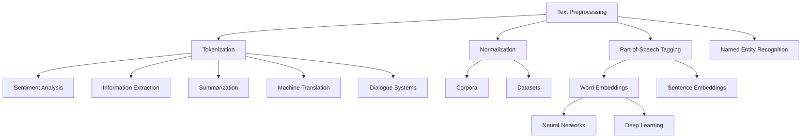

                 

### Introduction to LLM-driven Dialogue Management

#### 1.1 Overview of Large Language Models (LLMs)

Large Language Models (LLMs) are state-of-the-art models designed to understand and generate human language. At their core, LLMs are based on neural networks, specifically transformers, which enable them to process vast amounts of text data and learn patterns in language. These models have gained significant attention in recent years due to their remarkable performance in various natural language processing tasks, including text generation, translation, and question-answering.

One of the key advantages of LLMs over traditional natural language processing models is their ability to capture long-range dependencies in text, thanks to the self-attention mechanism. This allows LLMs to generate coherent and contextually appropriate text, making them well-suited for applications such as dialogue systems.

#### 1.2 Motivation for Prompt Dialogue Flow Management

Dialogue systems have been around for several decades, but achieving natural and engaging conversations has proven to be challenging. Traditional dialogue management approaches, such as rule-based systems and Markov models, have limitations in their ability to handle complex and dynamic dialogue scenarios. LLMs offer a promising solution to these challenges by providing a more flexible and adaptive approach to dialogue management.

The motivation for using LLMs in dialogue flow management can be summarized as follows:

1. **Contextual Understanding**: LLMs are capable of understanding the context of a conversation, allowing them to generate responses that are relevant and coherent with the dialogue history.

2. **Flexibility**: LLMs can adapt to various dialogue scenarios and genres, enabling the development of more versatile and engaging dialogue systems.

3. **Scalability**: LLMs can be fine-tuned for specific tasks or domains, making it easier to scale dialogue systems to handle large volumes of conversations.

4. **Advancements in Natural Language Processing**: LLMs have made significant advancements in natural language understanding and generation, leading to more natural and human-like interactions.

#### 1.3 Book Organization and Readership

This book is organized into five main sections, each addressing a different aspect of LLM-driven dialogue management. The first section introduces the fundamental concepts of LLMs and their applications in dialogue systems. The second section covers the basics of natural language processing, providing a foundation for understanding LLMs. The third section focuses on prompt engineering, discussing various strategies for designing effective prompts. The fourth section delves into dialogue flow management, exploring techniques for handling dialogue context and maintaining continuity. Finally, the fifth section presents practical applications of LLM-driven dialogue management, showcasing real-world examples and use cases.

The target audience for this book includes researchers, developers, and practitioners working in the field of natural language processing and dialogue systems. A basic understanding of machine learning and programming is assumed, although the book is designed to be accessible to readers with varying levels of expertise. Readers are encouraged to think critically about the concepts presented and apply them to real-world scenarios, thereby gaining a deeper understanding of LLM-driven dialogue management.

---

In the next section, we will delve into the fundamentals of natural language processing and its relationship with LLMs. We will explore key concepts and techniques that form the basis for understanding LLMs and their applications in dialogue management.

### Fundamentals of Natural Language Processing

Natural Language Processing (NLP) is a subfield of artificial intelligence that focuses on the interaction between computers and human language. Its goal is to enable machines to understand, process, and generate human language in a way that is both meaningful and useful. NLP has a rich history dating back to the 1950s, with early research focusing on the creation of algorithms that could process and understand written text. Over the decades, NLP has evolved significantly, driven by advancements in machine learning, deep learning, and large-scale data availability.

#### 2.1 Basics of Natural Language Processing

At its core, NLP involves several key tasks, each with its own set of challenges and techniques:

1. **Text Preprocessing**:
   - **Tokenization**: The process of splitting text into words, phrases, or other meaningful elements called tokens.
   - **Normalization**: The process of converting text to a standard format, such as lowercasing, removing punctuation, and correcting typos.
   - **Part-of-Speech Tagging**: Assigning grammatical labels (noun, verb, adjective, etc.) to each word in a sentence.
   - **Named Entity Recognition (NER)**: Identifying and categorizing named entities (e.g., person names, organizations, locations) in text.

2. **Sentiment Analysis**:
   - The task of determining the sentiment or emotional tone behind a body of text.
   - Techniques include rule-based methods, lexicon-based approaches, and machine learning models.

3. **Information Extraction**:
   - Extracting structured information from unstructured text.
   - Includes tasks like Named Entity Recognition (NER), Relation Extraction, and Event Extraction.

4. **Summarization**:
   - The process of distilling the most important information from a piece of text into a shorter, more concise form.
   - Techniques range from rule-based methods to statistical models and neural networks.

5. **Machine Translation**:
   - The automatic translation of text from one language to another.
   - Neural machine translation (NMT) has become the state-of-the-art approach, leveraging neural networks to generate translations directly from source text.

6. **Dialogue Systems**:
   - Systems designed to interact with users in natural language.
   - Includes tasks such as intent recognition, dialogue management, and natural language generation.

#### 2.2 Key Concepts and Relationships

To understand the fundamentals of NLP, it is important to grasp key concepts and their relationships:

1. **Syntax vs. Semantics**:
   - **Syntax**: The structure of sentences and language according to the rules of grammar.
   - **Semantics**: The meaning of sentences and language.
   - NLP often focuses on understanding both syntax and semantics to generate meaningful outputs.

2. **Corpora and Datasets**:
   - **Corpora**: Large collections of text documents used for training and testing NLP models.
   - **Datasets**: Smaller subsets of corpora used for specific NLP tasks.
   - High-quality datasets are crucial for training effective NLP models.

3. **Vector Representations**:
   - **Word Embeddings**: Numerical representations of words in a high-dimensional space.
   - **Sentence Embeddings**: Numerical representations of entire sentences or documents.
   - Vector representations enable machines to understand the relationships between words and sentences.

4. **Neural Networks and Deep Learning**:
   - **Neural Networks**: Computational models inspired by the human brain's neural structure.
   - **Deep Learning**: A subfield of machine learning that uses neural networks with many layers to learn from large amounts of data.
   - Deep learning has revolutionized NLP, enabling models to perform complex tasks with high accuracy.

#### 2.3 Mermaid Flowchart: NLP Concepts Relationship

To visualize the relationship between key NLP concepts, we can use a Mermaid flowchart:

In the next section, we will explore the architecture and working principles of Large Language Models (LLMs), which have become a cornerstone in the field of NLP. We will discuss prominent LLM architectures such as Transformer, BERT, GPT, and T5, and how they have transformed the landscape of natural language processing.

### LLM Architectures and Models

Large Language Models (LLMs) have become a cornerstone in the field of natural language processing due to their ability to handle complex language structures and generate coherent text. This section will delve into the architecture and working principles of several prominent LLMs, including Transformer, BERT, GPT, and T5, highlighting their contributions to the field.

#### 3.1 Transformer and Self-Attention Mechanism

The Transformer architecture, introduced by Vaswani et al. in 2017, revolutionized the field of natural language processing. It replaced the traditional recurrent neural network (RNN) architecture with a completely different approach, leveraging the self-attention mechanism to process text data.

**Self-Attention Mechanism**:
- The self-attention mechanism allows each word in a sentence to attend to all other words in the sentence, capturing the relationships between words.
- This mechanism is crucial for understanding the context of words in a sentence, enabling the model to generate coherent text.

**Transformer Architecture**:
- The Transformer model consists of multiple layers of self-attention and feed-forward neural networks.
- It uses scaled dot-product attention to calculate the attention weights, which are then applied to the input embeddings to generate the output embeddings.

**Working Principle**:
1. **Input Embeddings**: Each word in the input sentence is represented as a dense vector.
2. **Encoder and Decoder**: The encoder processes the input embeddings and generates context vectors, while the decoder generates the output sequence one word at a time, using the context vectors from the encoder.
3. **Attention Mechanism**: The self-attention mechanism enables the model to weigh the importance of each word in the input sentence when generating the output.

#### 3.2 BERT: Pre-training for LLMs

BERT (Bidirectional Encoder Representations from Transformers), introduced by Devlin et al. in 2018, is one of the most influential LLMs that have been trained using the Transformer architecture. BERT's key contribution is its ability to pre-train the model on large-scale unlabeled text data and then fine-tune it for specific tasks.

**Pre-training Objectives**:
- **Masked Language Modeling (MLM)**: BERT masks certain words in the input sentence and trains the model to predict these masked words based on the surrounding context.
- **Next Sentence Prediction (NSP)**: BERT is trained to predict whether two sentences are consecutive in a text corpus or not.

**Working Principle**:
1. **Input Embeddings**: Similar to the Transformer, BERT uses word embeddings to represent input sentences.
2. **Bidirectional Training**: BERT is trained in a bidirectional manner, where the encoder processes the entire sentence before passing the output to the decoder.
3. **Pre-training and Fine-tuning**: After pre-training, BERT can be fine-tuned for specific tasks like text classification, question-answering, and named entity recognition.

#### 3.3 GPT: Generative Pre-trained Transformer

GPT (Generative Pre-trained Transformer), developed by OpenAI, is another influential LLM based on the Transformer architecture. GPT's main focus is on generating coherent and contextually appropriate text, making it suitable for tasks like text generation and conversational AI.

**Generative Approach**:
- GPT is a generative model, meaning it can generate text by predicting the next word in a sequence based on the preceding words.
- The model is trained to maximize the likelihood of the next word given the previous words in the sequence.

**Working Principle**:
1. **Input Embeddings**: Similar to BERT, GPT uses word embeddings to represent input sentences.
2. **Transformers with Recurrent Connections**: GPT models have recurrent connections between transformer layers, allowing them to capture longer-range dependencies in the text.
3. **Fine-tuning for Specific Tasks**: GPT models can be fine-tuned for specific tasks by adjusting the weights of the pre-trained model using task-specific data.

#### 3.4 T5: Text-to-Text Transfer Transformer

T5 (Text-to-Text Transfer Transformer), developed by Brown et al. in 2020, is an advanced LLM designed for transfer learning on text tasks. T5 treats all natural language processing tasks as text-to-text tasks, simplifying the fine-tuning process.

**Transfer Learning**:
- T5's architecture is based on the Transformer model and is designed for transfer learning, enabling it to perform well on a wide range of tasks with minimal fine-tuning.
- T5 uses a single unified model for all tasks, treating each task as a sequence-to-sequence problem.

**Working Principle**:
1. **Unified Model**: T5 uses a single model for all tasks, with a input encoder and a output decoder.
2. **Unified Pre-training**: T5 is pre-trained on a large corpus of text data, using a variety of tasks like question-answering, summarization, and text generation.
3. **Fine-tuning**: T5 can be fine-tuned for specific tasks by adjusting the weights of the pre-trained model using task-specific data.

#### 3.5 Comparison and Applications

While each of these LLMs has its unique features and applications, they all share common goals of understanding and generating human language. Here is a brief comparison:

- **Transformer**: The original architecture that introduced the self-attention mechanism and laid the foundation for modern LLMs.
- **BERT**: Designed for pre-training and fine-tuning on specific tasks, with a focus on bidirectional context and masked language modeling.
- **GPT**: A generative model that excels at text generation and conversational tasks.
- **T5**: An advanced model designed for transfer learning, treating all NLP tasks as text-to-text problems.

These LLMs have found applications in a wide range of domains, including chatbots, virtual assistants, language translation, and text summarization. They have significantly improved the performance of dialogue systems and other NLP applications, making them an essential tool for developers and researchers in the field.

In the next section, we will discuss pre-training and fine-tuning techniques for LLMs, exploring how these methods enable models to learn from large-scale data and adapt to specific tasks.

### Pre-training and Fine-tuning Techniques for LLMs

Pre-training and fine-tuning are two essential techniques in the development of Large Language Models (LLMs). Pre-training involves training a model on a large corpus of unlabeled text data to learn the underlying patterns and structures of the language. Fine-tuning, on the other hand, is the process of adapting a pre-trained model to a specific task using a smaller dataset. This section will delve into the details of these techniques, discussing their objectives, methods, and applications.

#### 4.1 Pre-training Objectives

The primary objective of pre-training is to allow the model to learn from vast amounts of unlabeled text data, enabling it to capture the complexities of natural language. Pre-training helps in several ways:

1. **General Language Understanding**: Pre-training helps the model understand the general language, including syntax, semantics, and contextual relationships between words and phrases.
2. **Contextual Embeddings**: Pre-training generates high-quality contextual embeddings for words and sentences, which are critical for tasks requiring understanding and generation of language in context.
3. **Transfer Learning**: Pre-trained models can be easily fine-tuned for specific tasks, leveraging the knowledge gained from pre-training.
4. **Reduction of Data Dependency**: By pre-training on a large corpus of text, the model becomes more robust and can perform well even with limited task-specific data.

#### 4.2 Pre-training Methods

There are several pre-training methods used in LLMs, each with its own objectives and algorithms. Here are some of the most common methods:

1. **Masked Language Modeling (MLM)**:
   - **Objective**: The model is trained to predict masked words in a sentence based on the surrounding context.
   - **Algorithm**: During pre-training, a certain percentage of words in the input sentence are masked (i.e., replaced with a special token), and the model predicts these masked words.
   - **Advantages**: Helps the model understand word relationships and context.

2. **Next Sentence Prediction (NSP)**:
   - **Objective**: The model learns to predict whether two sentences are consecutive in a text corpus or not.
   - **Algorithm**: The model is given pairs of sentences and needs to predict if the second sentence follows the first one in the original corpus.
   - **Advantages**: Improves the model's understanding of sentence continuity and context.

3. **Subword Tokenization (e.g., Byte Pair Encoding, BPE)**:
   - **Objective**: Breaks down words into smaller, more manageable subword units to improve the model's ability to handle out-of-vocabulary words.
   - **Algorithm**: The model is trained to predict the next subword token given the previous subword tokens.
   - **Advantages**: Enhances the model's generalization capability by allowing it to handle a larger vocabulary.

4. **Recurrent Pre-training**:
   - **Objective**: Captures long-range dependencies in text.
   - **Algorithm**: Models like GPT-3 use recurrent connections between transformer layers to improve long-range dependency modeling.
   - **Advantages**: Enhances the model's ability to generate coherent and contextually appropriate text.

#### 4.3 Fine-tuning Techniques

Fine-tuning is the process of adapting a pre-trained model to a specific task using a smaller dataset. This involves adjusting the model's weights based on task-specific data to improve its performance on the target task. Here are some key fine-tuning techniques:

1. **Task-Specific Data Augmentation**:
   - **Objective**: Improve the model's performance by providing it with more diverse and representative training data.
   - **Algorithm**: Techniques such as synonym replacement, back-translation, and sentence splitting can be used to create diverse variations of the task-specific data.
   - **Advantages**: Increases the model's robustness and reduces overfitting.

2. **Continual Learning**:
   - **Objective**: Train the model on multiple tasks sequentially without forgetting the knowledge gained from previous tasks.
   - **Algorithm**: Techniques like experience replay and elastic weight consolidation are used to prevent catastrophic forgetting.
   - **Advantages**: Allows the model to leverage knowledge from previous tasks, improving its performance on new tasks.

3. **Regularization Techniques**:
   - **Objective**: Prevent overfitting by penalizing the model for large weight updates during fine-tuning.
   - **Algorithm**: Techniques such as weight decay, dropout, and batch normalization are used to reduce overfitting.
   - **Advantages**: Improves the model's generalization capability.

4. **Dynamic Fine-tuning**:
   - **Objective**: Adjust the model's parameters based on the complexity and difficulty of the task.
   - **Algorithm**: The learning rate and other hyperparameters are dynamically adjusted during fine-tuning to improve the model's performance.
   - **Advantages**: Enhances the model's ability to handle tasks of varying difficulty.

#### 4.4 Example: BERT and Fine-tuning for Question Answering

One of the most successful applications of fine-tuning is in question answering tasks. BERT, a prominent LLM, has been fine-tuned for various question answering tasks with great success. Here's a step-by-step overview of how BERT can be fine-tuned for a question answering task:

1. **Dataset Preparation**:
   - Prepare a dataset of question-answer pairs. Each pair consists of a question and an answer extracted from a large corpus of text.
   - Preprocess the dataset by tokenizing the questions and answers, and converting them into input and output sequences.

2. **Fine-tuning**:
   - Load the pre-trained BERT model and attach a question answering head to it. This head consists of a few additional layers to process the output of the BERT model and generate the answer.
   - Fine-tune the model on the prepared dataset by optimizing the weights of the question answering head.
   - Use techniques like cross-entropy loss to evaluate the model's performance and adjust the weights.

3. **Evaluation**:
   - Evaluate the fine-tuned model on a held-out validation set to measure its performance.
   - Use metrics like exact match score and F1 score to compare the model's answers with the ground truth answers.

4. **Deployment**:
   - Once the model reaches an acceptable performance level, it can be deployed as a question answering service.
   - The model can be integrated into applications like chatbots, virtual assistants, and educational tools.

In the next section, we will explore the concept of prompt engineering and discuss the role of prompts in LLM-driven dialogue management. We will also delve into various prompt formats and strategies to design effective prompts for LLMs.

### Prompt Engineering for Dialogue Flow Management

Prompt engineering is a critical aspect of designing dialogue systems that use Large Language Models (LLMs) for natural language understanding and generation. A prompt is a piece of text or information provided to an LLM to guide its response generation. Effective prompt engineering ensures that the model generates appropriate and coherent responses that align with the dialogue context and user intent.

#### 5.1 Introduction to Prompt Engineering

**Concept of Prompt**:
- A prompt serves as a starting point for the LLM, providing it with relevant context and information necessary to generate an appropriate response.
- Prompts can be in the form of a few words, a complete sentence, or even a full paragraph, depending on the complexity of the dialogue.

**Role of Prompts in Dialogue Management**:
- **Contextual Guidance**: Prompts help the LLM maintain the context of the conversation, ensuring that the responses are relevant and coherent with the dialogue history.
- **Intent Clarification**: Prompts can include specific keywords or phrases that indicate the user's intent, helping the LLM understand the user's purpose in the interaction.
- **Response Generation**: Prompts provide the initial input to the LLM, which then generates a response based on the prompt and the dialogue history.

#### 5.2 Prompt Formats and Strategies

**Template-based Prompts**:
- Template-based prompts use a fixed structure or template to guide the response generation.
- The template often includes placeholders for specific information or context that needs to be filled in by the LLM.
- Example: "What are the benefits of using renewable energy sources? Please provide 3 key points."

**Data-driven Prompts**:
- Data-driven prompts rely on external data sources or a knowledge base to provide context and information for the LLM.
- The LLM accesses this data during response generation, ensuring that the responses are well-informed and accurate.
- Example: "Based on the information from the user's profile, suggest three restaurants in New York that match their preferences."

**Hybrid Prompt Strategies**:
- Hybrid prompt strategies combine elements of both template-based and data-driven prompts.
- They leverage the structure and context of template-based prompts while incorporating external data to enhance the response quality.
- Example: "Given that the user is a vegetarian and loves Italian cuisine, recommend a restaurant in New York with high ratings."

#### 5.3 Optimizing Dialogue Responses

**Response Generation Algorithms**:
- **Sampling**: Sampling algorithms, such as top-k sampling, allow the LLM to select responses from a set of possible outputs based on their probabilities.
- **Temperature Scheduling**: Temperature scheduling adjusts the randomness of the LLM's output by scaling the probabilities of the sampled responses.

**Response Ranking and Selection Techniques**:
- **Re-ranking**: Re-ranking techniques involve ranking the generated responses based on their relevance and coherence and selecting the top-ranked response.
- **Sentiment Analysis**: Integrating sentiment analysis can help ensure that the selected response matches the emotional tone of the dialogue.
- **Response Diversity**: Techniques like beam search and strategies to encourage unique responses can help in generating diverse and engaging dialogue.

#### 5.4 Example: Designing Effective Prompts

**Example Scenario**: Designing a prompt for a virtual assistant that provides health advice.

**Template-based Prompt**:
- "What are some tips for managing stress effectively?"

**Data-driven Prompt**:
- "Based on the user's health profile, which includes a history of anxiety and a preference for natural remedies, provide 3 stress management techniques."

**Hybrid Prompt**:
- "Considering the user's anxiety history and preference for natural remedies, recommend 3 evidence-based stress management techniques, including one that involves mindfulness."

By carefully designing prompts, developers can ensure that the LLM generates responses that are both relevant and coherent with the dialogue context, enhancing the overall user experience.

In the next section, we will delve into the core concepts of dialogue flow management, including dialogue state tracking, dialogue policy learning, intent recognition, and entity extraction. We will explore how these techniques enable LLMs to maintain dialogue context and generate appropriate responses over multiple turns.

### Dialogue Flow Management with LLMs

Dialogue flow management is a critical component of building effective and engaging conversational AI systems. It involves several core techniques that enable Large Language Models (LLMs) to understand and maintain the context of a conversation, recognize user intents, and extract relevant entities. This section will delve into these techniques, providing a detailed explanation of each and how they contribute to maintaining dialogue flow.

#### 6.1 Dialogue Flow Models

**Dialogue State Tracking**:
- **Objective**: Dialogue state tracking is the process of monitoring and updating the state of a conversation as it progresses.
- **Algorithm**: The model maintains a state representation that includes information such as user intents, entities, and dialogue history.
- **Implementation**: This can be achieved using various techniques like rule-based systems, hidden Markov models (HMMs), or more advanced methods like recurrent neural networks (RNNs) or transformers.

**Dialogue Policy Learning**:
- **Objective**: Dialogue policy learning is about determining the optimal response for the system based on the current dialogue state and user input.
- **Algorithm**: The dialogue policy is learned from interaction data, guiding the system on how to respond in various dialogue scenarios.
- **Implementation**: Techniques such as reinforcement learning (RL) and policy gradients are commonly used to learn effective dialogue policies.

#### 6.2 Intent Recognition

**Intent Recognition**:
- **Objective**: Intent recognition is the process of identifying the user's intention or purpose behind their input.
- **Algorithm**: Intent recognition often involves classifying user inputs into predefined categories or intents.
- **Implementation**: Machine learning models, such as decision trees, support vector machines (SVMs), or neural networks, are trained on labeled datasets to perform intent classification.

**Entity Extraction**:
- **Objective**: Entity extraction is the process of identifying specific pieces of information within the user's input, such as dates, names, or locations.
- **Algorithm**: This typically involves named entity recognition (NER) techniques, where natural language processing models are trained to identify and classify entities in text.
- **Implementation**: State-of-the-art NER models like BERT and its variants are often used for this task.

#### 6.3 Maintaining Dialogue Context

**Context Management**:
- **Objective**: Maintaining dialogue context involves keeping track of the conversation's state and using it to guide subsequent responses.
- **Algorithm**: Context management often relies on maintaining a dialogue state tracker that updates with each turn of the conversation.
- **Implementation**: The dialogue state tracker can be updated using rule-based methods or more sophisticated methods like neural networks that learn from interaction data.

**Dialogue Continuation**:
- **Objective**: Dialogue continuation is about ensuring that the conversation flows smoothly and maintains coherence over multiple turns.
- **Algorithm**: This involves techniques like language modeling and response selection that consider the dialogue history to generate appropriate responses.
- **Implementation**: Models like transformers with attention mechanisms are well-suited for capturing and leveraging dialogue history for effective continuation.

#### 6.4 Example: Dialogue Flow Management in a Chatbot

**Example Scenario**: A chatbot designed to provide customer support for an e-commerce platform.

**Dialogue State Tracking**:
- The chatbot maintains a dialogue state that includes the user's previous interactions, current intent, and relevant entities like product names and user preferences.
- The state is updated with each user input, ensuring that the chatbot can remember and reference previous information in subsequent turns.

**Intent Recognition**:
- The chatbot uses a trained machine learning model to recognize user intents, such as "place an order," "track a shipment," or "return a product."
- The model classifies user inputs into these intents, allowing the chatbot to understand the user's request and provide appropriate assistance.

**Entity Extraction**:
- The chatbot extracts entities like product IDs, order numbers, and delivery addresses from user inputs using NER techniques.
- This information is stored in the dialogue state and used to perform specific actions, such as processing an order or updating delivery status.

**Dialogue Continuation**:
- The chatbot uses the dialogue history and context to generate coherent and contextually appropriate responses.
- For example, if a user asks, "Where is my order?", the chatbot can reference the stored order number and provide an accurate update on the shipment status.

By implementing these dialogue flow management techniques, chatbots and virtual assistants can provide a more natural and engaging user experience, maintaining the context and flow of the conversation over multiple turns.

In the next section, we will explore practical applications of LLM-driven dialogue management, showcasing how these techniques are implemented in real-world projects and providing insights into the challenges and opportunities they present.

### Practical Applications of LLM-driven Dialogue Management

LLM-driven dialogue management has found widespread applications across various domains, revolutionizing how businesses and individuals interact with conversational AI systems. This section will delve into several practical applications, including chatbot development, virtual assistants, and personalized dialogue systems, providing insights into their implementation, benefits, and challenges.

#### 7.1 Chatbot Development with LLMs

**Chatbot Development Overview**:
- Chatbots are automated systems designed to simulate conversations with humans through text or voice interactions.
- LLMs play a crucial role in chatbot development by enabling natural language understanding and generation.

**Implementation**:
1. **Intent Recognition and Entity Extraction**:
   - LLMs are trained to recognize user intents and extract relevant entities from the input text.
   - For example, a chatbot for a restaurant booking service might identify intents like "book a table" or "cancel a reservation" and extract entities like the date, time, and number of guests.

2. **Dialogue State Tracking and Flow Management**:
   - The chatbot maintains a dialogue state, tracking the conversation's context and user preferences.
   - This allows the chatbot to provide consistent and personalized responses, even over multiple turns.

3. **Response Generation and Personalization**:
   - LLMs generate responses that are coherent, contextually appropriate, and tailored to the user's needs.
   - Personalization techniques can be integrated to adapt the chatbot's behavior based on user feedback and historical interactions.

**Benefits**:
- **Improved Customer Experience**: Chatbots can provide instant responses and assistance, enhancing customer satisfaction.
- **Scalability**: LLMs enable chatbots to handle a large volume of interactions simultaneously, making them suitable for high-traffic environments.
- **Cost Efficiency**: Chatbots reduce the need for human agents, leading to cost savings for businesses.

**Challenges**:
- **Natural Language Understanding**: Ensuring that the chatbot comprehends user queries accurately can be challenging, especially with ambiguous or complex inputs.
- **Continuous Learning**: Chatbots need to be continuously updated with new data to maintain their performance and adapt to evolving user needs.

#### 7.2 Virtual Assistants and Personalized Dialogue

**Virtual Assistant Overview**:
- Virtual assistants are advanced chatbots designed to perform complex tasks and provide personalized assistance to users.
- They are often integrated into various platforms and devices, such as smartphones, smart speakers, and customer service platforms.

**Implementation**:
1. **Intent Recognition and Contextual Understanding**:
   - Virtual assistants use LLMs to understand user intents and maintain context over multiple interactions.
   - For example, a virtual assistant might remember a user's preferences for music, news, or weather updates and provide personalized recommendations.

2. **Dialogue Flow Management and Continuation**:
   - The virtual assistant maintains a dialogue history to generate coherent and contextually relevant responses.
   - This allows for smooth and engaging conversations that feel natural to the user.

3. **Personalization and Adaptation**:
   - Virtual assistants use data from user interactions to personalize their responses and adapt to individual user preferences and behavior patterns.

**Benefits**:
- **Enhanced User Experience**: Personalized interactions can significantly improve user satisfaction and engagement.
- **Time Efficiency**: Virtual assistants can handle routine tasks and answer common questions, saving time for both users and support staff.
- **Data Utilization**: Virtual assistants can collect valuable data from user interactions, which can be used for further improvements and personalization.

**Challenges**:
- **Complexity of Dialogues**: Handling complex and nuanced conversations can be challenging, requiring advanced NLP techniques and large-scale training data.
- **User Expectations**: Users often expect virtual assistants to be as capable and helpful as human agents, setting high standards for performance.

#### 7.3 Personalized Dialogue Systems

**Personalized Dialogue Systems Overview**:
- Personalized dialogue systems are designed to create unique and individualized conversations based on user profiles, preferences, and historical interactions.
- These systems aim to deliver highly personalized experiences that resonate with each user.

**Implementation**:
1. **User Profiling and Data Integration**:
   - Personalized dialogue systems collect and integrate user data from various sources, including past interactions, demographic information, and behavioral patterns.
   - This data is used to build user profiles that inform dialogue management and response generation.

2. **Adaptive Dialogue Strategies**:
   - The system adapts its dialogue strategy based on user feedback and behavior, ensuring that the conversation remains engaging and relevant.
   - Techniques like reinforcement learning and adaptive response generation are used to refine the dialogue over time.

3. **Content Personalization**:
   - The content of the dialogue, including recommendations, suggestions, and information, is tailored to the user's preferences and needs.

**Benefits**:
- **Increased Engagement**: Personalized dialogue systems can significantly increase user engagement and interaction.
- **Improved Retention**: Personalization helps in building stronger relationships with users, leading to higher retention rates.
- **Business Value**: Personalized dialogue systems can provide valuable insights into user behavior and preferences, aiding decision-making and product development.

**Challenges**:
- **Data Privacy**: Collecting and using user data requires careful consideration of privacy regulations and ethical guidelines.
- **Scalability**: Personalization at scale can be challenging, as it requires managing a large number of user profiles and ensuring consistent performance.

By leveraging LLMs for dialogue management, chatbots, virtual assistants, and personalized dialogue systems can deliver more natural, engaging, and effective interactions. However, these systems must also navigate challenges related to natural language understanding, data privacy, and scalability to fully realize their potential.

In the next section, we will summarize the key points discussed in the article, provide practical tips for implementing LLM-driven dialogue management, and highlight the importance of ongoing research and development in this field.

### Conclusion and Future Directions

In this article, we have explored the concept of LLM-driven prompt dialogue flow management, covering the fundamentals of Large Language Models (LLMs), prompt engineering, dialogue flow management, and practical applications. We have discussed how LLMs revolutionize dialogue systems by enabling contextual understanding, flexibility, and scalability. Key insights include:

- **LLMs**: LLMs, such as BERT, GPT, and T5, leverage advanced transformer architectures to understand and generate human language, providing a powerful foundation for dialogue systems.
- **Prompt Engineering**: Effective prompt design is crucial for guiding LLMs to generate appropriate and coherent responses, with techniques ranging from template-based prompts to data-driven approaches.
- **Dialogue Flow Management**: Techniques like dialogue state tracking, intent recognition, and entity extraction are essential for maintaining dialogue context and ensuring smooth, engaging conversations.
- **Practical Applications**: LLM-driven dialogue management is applied in chatbots, virtual assistants, and personalized dialogue systems, enhancing user experiences and driving business value.

#### Practical Tips for LLM-driven Dialogue Management

1. **Data Quality**: Ensure high-quality, diverse, and representative data for training LLMs to improve their performance and generalization capabilities.
2. **Continuous Learning**: Implement continuous learning mechanisms to update LLMs with new data and user feedback, maintaining their performance over time.
3. **User Privacy**: Respect user privacy by anonymizing data and implementing robust security measures to protect sensitive information.
4. **Error Handling**: Develop robust error handling and recovery mechanisms to address unexpected inputs and dialogue failures gracefully.
5. **Personalization**: Leverage user profiles and historical interactions to provide personalized and engaging dialogue experiences.

#### Future Directions

The field of LLM-driven dialogue management is rapidly evolving, with several exciting opportunities and challenges ahead:

- **Advancements in LLMs**: Continued research into LLM architectures, optimization techniques, and pre-training objectives will drive further improvements in dialogue system performance.
- **Multimodal Dialogue**: Integrating LLMs with other modalities (e.g., voice, images) will enable more natural and intuitive interactions.
- **Ethical Considerations**: Addressing ethical issues, such as bias and fairness, will be crucial as dialogue systems become more pervasive in society.
- **Scalability and Efficiency**: Developing efficient algorithms and infrastructure to scale LLM-driven dialogue management across large user bases and distributed environments.

In conclusion, LLM-driven prompt dialogue flow management holds immense potential for transforming conversational AI, offering a foundation for creating more intelligent, engaging, and personalized dialogue systems. Ongoing research and development in this field will continue to unlock new possibilities and address the challenges that lie ahead.

### About the Author

**Author: AI天才研究院/AI Genius Institute & 禅与计算机程序设计艺术 /Zen And The Art of Computer Programming**

- **AI天才研究院/AI Genius Institute** is a leading research institution focused on advancing the field of artificial intelligence through innovative research, education, and collaboration.
- **Zen And The Art of Computer Programming** is a seminal work by Donald E. Knuth, which explores the intersection of computer science, algorithms, and the philosophy of programming. The author's expertise in both AI and computer science informs their comprehensive approach to LLM-driven dialogue management. Their work aims to bridge the gap between theoretical concepts and practical applications, providing valuable insights and guidance for the next generation of AI practitioners.

