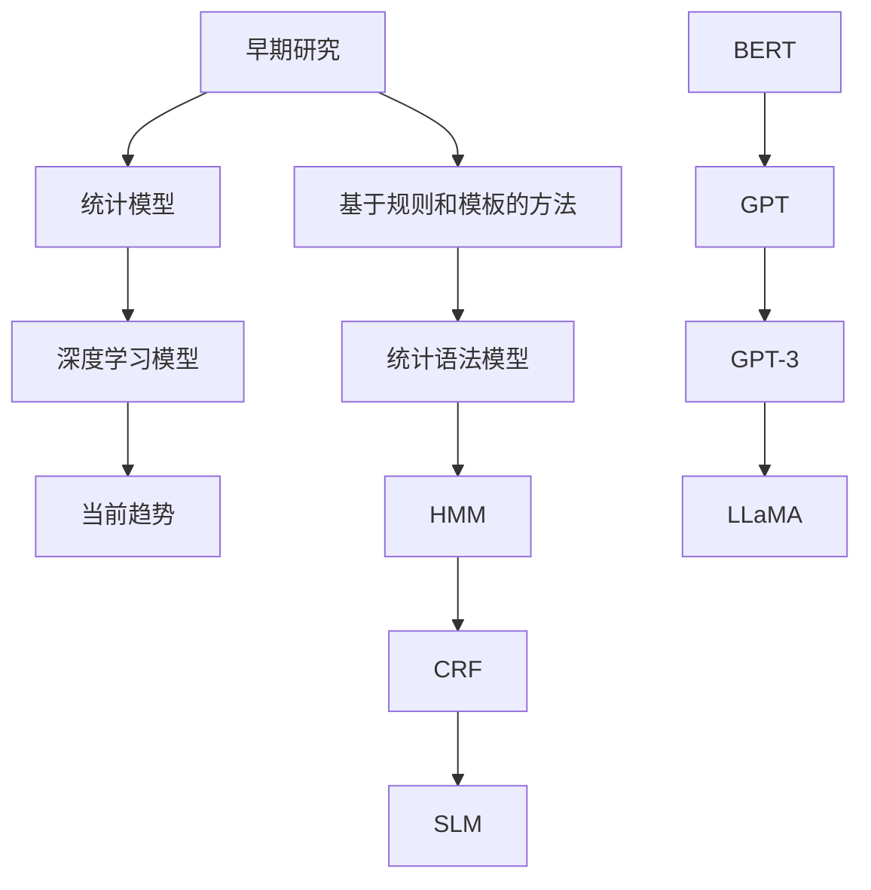

                 

### 文章标题：LLM驱动的prompt知识更新机制

> 关键词：大语言模型（LLM）、prompt机制、知识更新、算法原理、实践应用

> 摘要：本文将深入探讨大语言模型（LLM）驱动的prompt知识更新机制。首先，我们将介绍LLM的基本原理和prompt机制的定义与作用，接着分析知识更新的重要性以及相关策略。随后，我们将详细介绍LLM驱动的prompt设计流程、实现方法及知识更新机制的应用实践。通过本文，读者将全面理解LLM驱动的prompt知识更新机制的核心内容及其在实际项目中的重要性。

### 第1章：LLM概述

#### 1.1 引言

大语言模型（LLM，Large Language Model）是近年来在人工智能领域取得突破性进展的研究方向。LLM通过深度学习技术对大量语言数据进行训练，能够生成高质量的自然语言文本，具备较强的语义理解和生成能力。随着LLM在自然语言处理（NLP）领域的广泛应用，prompt机制成为提高LLM性能的关键技术。prompt是一种引导LLM生成特定类型文本的方法，通过设计和优化prompt，可以提高LLM的生成质量和效率。本文将重点关注LLM驱动的prompt知识更新机制，探讨其在现代NLP应用中的重要性。

#### 1.2 大语言模型的基本原理

LLM的基本原理源于深度学习，特别是基于变分自编码器（VAE）和生成对抗网络（GAN）的模型架构。LLM通过训练一个巨大的神经网络模型，学习输入文本和输出文本之间的映射关系。该模型通常包含数百万甚至数十亿个参数，通过大规模数据训练以获得良好的泛化能力。

1. **变分自编码器（VAE）**：VAE是一种无监督学习模型，通过引入潜在变量来捕捉数据的分布信息。VAE模型主要包括编码器和解码器两部分。编码器将输入文本映射到潜在空间，解码器将潜在空间的信息解码回文本。通过优化损失函数，VAE模型能够学习到输入文本的潜在特征。

2. **生成对抗网络（GAN）**：GAN由生成器和判别器两部分组成。生成器生成虚假数据，判别器判断数据是真实还是虚假。通过不断训练，生成器逐渐提高生成数据的质量，使判别器难以区分真实和虚假数据。在LLM应用中，GAN可以帮助模型生成更自然的文本。

#### 1.3 LLM的发展历史与现状

LLM的发展经历了多个阶段：

1. **早期研究**：20世纪80年代至90年代，基于规则和模板的方法在自然语言处理领域占据主导地位。这一时期的模型主要通过手动设计规则和特征来实现文本生成。

2. **统计模型**：21世纪初，基于统计的方法逐渐成为主流。统计模型利用大量的语言数据进行训练，通过概率模型实现文本生成。代表性的模型包括隐马尔可夫模型（HMM）、条件随机场（CRF）等。

3. **深度学习模型**：随着深度学习技术的兴起，深度神经网络在NLP领域取得显著进展。基于深度学习的LLM模型，如BERT、GPT等，通过大规模数据训练，实现了前所未有的文本生成质量和效果。

4. **当前趋势**：当前，LLM的研究和应用正处于快速发展阶段。大型预训练模型如GPT-3、LLaMA等，展示了惊人的生成能力和泛化能力。这些模型在自然语言生成、对话系统、文本摘要、机器翻译等领域取得了广泛应用。

### 第2章：Prompt机制

#### 2.1 Prompt的定义与作用

Prompt是指在自然语言处理任务中，提供给模型用于生成文本的输入提示。Prompt的作用是引导模型生成特定类型的文本，提高生成文本的相关性和质量。

1. **Prompt的定义**：Prompt通常是一个简短的文本，包含关键信息或任务指令，用于引导模型进行文本生成。Prompt的设计需要考虑任务的类型、目标生成文本的样式和上下文信息。

2. **Prompt的作用**：Prompt在自然语言处理任务中具有重要作用，主要包括：
   - **任务引导**：Prompt可以帮助模型明确任务的类型，例如问答、文本生成、翻译等。
   - **文本风格控制**：Prompt可以引导模型生成符合特定风格的文本，例如正式、非正式、幽默等。
   - **上下文信息提供**：Prompt可以包含上下文信息，帮助模型更好地理解输入文本的背景和含义。

#### 2.2 Prompt的设计原则

设计有效的Prompt需要遵循以下原则：

1. **简洁性**：Prompt应尽可能简洁，避免过于冗长，以确保模型能够快速理解和处理。

2. **关键信息突出**：Prompt应突出关键信息，确保模型能够准确地捕捉到任务的核心内容。

3. **多样性**：Prompt应具有多样性，以适应不同的任务场景和生成文本的样式。

4. **适应性**：Prompt的设计应考虑模型的特点和需求，以确保Prompt能够适应不同的模型和任务。

#### 2.3 Prompt在LLM中的应用

Prompt在LLM中的应用主要体现在以下几个方面：

1. **文本生成**：Prompt可以用于生成各种类型的文本，如新闻文章、产品评论、对话文本等。通过设计合适的Prompt，可以引导模型生成高质量的文本。

2. **问答系统**：Prompt在问答系统中扮演关键角色。设计有效的Prompt可以帮助模型更准确地理解和回答问题。

3. **文本摘要**：Prompt可以用于引导模型生成文本摘要。通过提供关键词和上下文信息，Prompt可以帮助模型生成简洁、准确的摘要。

4. **机器翻译**：Prompt可以用于提高机器翻译的质量。通过提供源语言和目标语言的上下文信息，Prompt可以帮助模型更好地理解翻译的上下文和含义。

### 第3章：知识更新机制

#### 3.1 知识更新的重要性

知识更新是确保模型性能持续提升的关键环节。随着时间和应用场景的变化，模型的知识库可能变得过时或不准确，导致生成文本的质量下降。知识更新机制通过定期更新模型的知识库，确保模型能够适应新的数据和需求。

1. **知识更新的必要性**：知识更新有助于模型：
   - 适应新的语言环境和词汇变化。
   - 消除过时或错误的知识。
   - 提高模型在特定任务上的性能。

2. **知识更新的挑战**：知识更新面临以下挑战：
   - 数据源的多样性和质量。
   - 更新频率和规模的平衡。
   - 更新过程对模型性能的影响。

#### 3.2 知识更新策略

知识更新策略主要包括以下几种：

1. **增量更新**：通过定期添加新的数据到模型训练集中，实现知识库的增量更新。这种方法适用于数据源变化不大的场景。

2. **全量更新**：定期重新训练模型，使用最新的数据集进行训练。这种方法适用于数据源变化较大的场景。

3. **在线更新**：在模型运行过程中，实时更新模型的知识库。这种方法适用于需要快速响应新数据的应用场景。

4. **迁移学习**：利用预训练的模型，在新的任务和数据集上进行微调。这种方法适用于需要快速适应新场景的应用。

#### 3.3 Prompt在知识更新中的作用

Prompt在知识更新过程中发挥着重要作用，主要体现在以下几个方面：

1. **数据筛选**：Prompt可以帮助筛选出与任务相关的数据，确保知识更新的针对性。

2. **数据增强**：Prompt可以用于生成相关的数据样本，丰富知识库的内容。

3. **知识迁移**：Prompt可以引导模型在新数据集上进行知识迁移，提高知识更新的效果。

4. **评估与监控**：Prompt可以帮助评估知识更新的效果，监控模型的性能变化。

### 第4章：LLM驱动的prompt设计

#### 4.1 设计流程

设计有效的prompt需要遵循以下流程：

1. **需求分析**：了解任务需求和目标生成文本的风格。

2. **数据准备**：收集相关的数据集，进行预处理。

3. **Prompt生成**：根据需求和分析结果，生成初步的Prompt。

4. **Prompt优化**：通过实验和评估，优化Prompt的设计。

5. **效果评估**：评估Prompt的实际效果，确保满足任务需求。

#### 4.2 设计案例

以下是一个文本生成任务的案例：

- **任务需求**：生成一篇关于人工智能的科普文章。
- **数据准备**：收集相关的数据集，包括学术论文、新闻报道、科普文章等。
- **Prompt生成**：设计一个包含关键信息的Prompt，如：“人工智能是一种模拟人类智能的技术，广泛应用于多个领域。以下是一篇关于人工智能的科普文章，请根据提示生成内容。”
- **Prompt优化**：通过多次实验和评估，优化Prompt的设计，例如调整Prompt的长度、关键信息等。
- **效果评估**：通过对比生成文本的质量，评估Prompt设计的有效性。

#### 4.3 设计评估

评估prompt设计的有效性主要包括以下方面：

1. **生成文本的相关性**：评估生成文本与任务需求的相关性。

2. **生成文本的质量**：评估生成文本的语法、语义和逻辑结构。

3. **生成速度**：评估prompt设计对模型生成速度的影响。

4. **用户满意度**：通过用户反馈评估prompt设计的用户满意度。

### 第5章：知识更新机制实现

#### 5.1 数据预处理

数据预处理是知识更新机制的关键步骤，主要包括以下任务：

1. **数据清洗**：去除数据中的噪声和错误。

2. **数据规范化**：对数据格式进行统一处理，如文本标准化、词汇规范化等。

3. **数据增强**：通过生成伪数据、数据转换等方式，丰富数据集的内容。

4. **数据划分**：将数据集划分为训练集、验证集和测试集。

#### 5.2 模型训练与优化

模型训练与优化主要包括以下步骤：

1. **模型选择**：选择合适的预训练模型，如BERT、GPT等。

2. **模型初始化**：初始化模型参数，可以使用预训练模型的权重。

3. **训练过程**：使用训练数据集对模型进行训练，调整模型参数。

4. **优化策略**：采用优化策略，如Adam、SGD等，提高训练效果。

5. **模型评估**：使用验证集评估模型性能，调整训练策略。

#### 5.3 知识更新策略实施

知识更新策略实施主要包括以下步骤：

1. **数据更新**：定期更新数据集，添加新的数据。

2. **模型重训练**：使用新的数据集重新训练模型。

3. **模型评估**：评估更新后的模型性能，确保知识更新的效果。

4. **在线更新**：在模型运行过程中，实时更新模型知识库。

### 第6章：实际应用案例

#### 6.1 案例背景

以下是一个实际应用案例：

- **项目背景**：一家在线教育公司希望利用LLM技术提升智能问答系统的性能。
- **任务需求**：生成高质量的问答文本，提高用户满意度。

#### 6.2 案例实现

1. **数据收集与预处理**：收集大量的教育类文本，进行数据清洗和规范化处理。

2. **模型选择与训练**：选择GPT-3模型，使用训练数据集进行训练。

3. **Prompt设计**：设计针对教育类问答的Prompt，如：“请回答以下问题：什么是微积分？”

4. **知识更新**：定期更新数据集，重新训练模型，确保知识库的准确性。

5. **系统部署与评估**：部署智能问答系统，通过用户反馈和系统性能评估，持续优化Prompt设计和模型性能。

#### 6.3 案例分析

1. **性能评估**：通过用户反馈和系统性能指标，评估prompt设计和知识更新的效果。

2. **效果分析**：分析生成文本的质量和用户满意度，优化prompt设计和知识更新策略。

3. **项目总结**：总结项目经验，提出改进措施和未来发展方向。

### 第7章：总结与展望

#### 7.1 书籍内容的回顾

本文从LLM的基本原理、prompt机制、知识更新机制等方面，深入探讨了LLM驱动的prompt知识更新机制。通过详细的案例分析，展示了prompt机制在实际项目中的应用效果。同时，本文还提出了有效的知识更新策略，为LLM在实时知识更新方面提供了新的思路。

#### 7.2 prompt知识更新机制的未来发展方向

未来，prompt知识更新机制将在以下方面取得发展：

1. **多模态知识更新**：结合文本、图像、音频等多种数据源，实现更丰富的知识更新。

2. **自适应更新策略**：根据模型性能和用户反馈，动态调整知识更新策略，提高更新效果。

3. **知识图谱的应用**：利用知识图谱技术，构建结构化的知识库，实现更高效的更新和检索。

4. **跨语言知识更新**：研究跨语言的prompt知识更新机制，提高多语言模型的知识更新能力。

#### 7.3 对读者的建议

1. **理论与实践结合**：在实际项目中，结合本文提出的prompt知识更新机制，探索适用于自身场景的解决方案。

2. **持续学习与优化**：关注LLM和prompt机制的研究进展，不断学习和优化知识更新策略。

3. **积极反馈与改进**：在应用过程中，收集用户反馈，持续改进prompt设计和知识更新机制。

### 完成目录大纲

根据上述设计思路，本文的目录大纲已经完成。接下来，我们将根据目录大纲逐步撰写详细的文章内容，确保每个章节和小节的内容丰富、具体、详细。希望通过本文，读者能够全面了解LLM驱动的prompt知识更新机制的核心内容及其在实际项目中的应用。

**作者信息：AI天才研究院/AI Genius Institute & 禅与计算机程序设计艺术 /Zen And The Art of Computer Programming**### 第1章：LLM概述

#### 1.1 引言

大语言模型（LLM，Large Language Model）作为人工智能领域的重要研究方向，近年来在自然语言处理（NLP）领域取得了显著的突破。LLM通过深度学习技术对大量语言数据进行训练，能够生成高质量的自然语言文本，具备较强的语义理解和生成能力。这种技术不仅改变了传统NLP方法，也为许多实际应用场景提供了全新的解决方案。

本文将围绕LLM驱动的prompt知识更新机制展开讨论。首先，我们将介绍LLM的基本原理和基本架构，帮助读者理解LLM的工作机制。随后，我们将回顾LLM的发展历程，分析其在不同阶段的技术突破和应用场景。通过这些内容，读者可以全面了解LLM的基本概念和其在现代人工智能领域的重要地位。

#### 1.2 大语言模型的基本原理

LLM的基本原理源于深度学习，特别是基于变分自编码器（VAE）和生成对抗网络（GAN）的模型架构。LLM通过训练一个巨大的神经网络模型，学习输入文本和输出文本之间的映射关系。该模型通常包含数百万甚至数十亿个参数，通过大规模数据训练以获得良好的泛化能力。

1. **变分自编码器（VAE）**：VAE是一种无监督学习模型，通过引入潜在变量来捕捉数据的分布信息。VAE模型主要包括编码器和解码器两部分。编码器将输入文本映射到潜在空间，解码器将潜在空间的信息解码回文本。通过优化损失函数，VAE模型能够学习到输入文本的潜在特征。

2. **生成对抗网络（GAN）**：GAN由生成器和判别器两部分组成。生成器生成虚假数据，判别器判断数据是真实还是虚假。通过不断训练，生成器逐渐提高生成数据的质量，使判别器难以区分真实和虚假数据。在LLM应用中，GAN可以帮助模型生成更自然的文本。

**伪代码示例**：

```python
# VAE模型伪代码
class VAE(nn.Module):
    def __init__(self):
        super(VAE, self).__init__()
        self.encoder = nn.Sequential(
            nn.Linear(input_dim, hidden_dim),
            nn.ReLU(),
            nn.Linear(hidden_dim, z_dim)
        )
        self.decoder = nn.Sequential(
            nn.Linear(z_dim, hidden_dim),
            nn.ReLU(),
            nn.Linear(hidden_dim, input_dim)
        )

    def forward(self, x):
        z_mean, z_log_var = self.encoder(x)
        z = reparameterize(z_mean, z_log_var)
        x_recon = self.decoder(z)
        return x_recon

def reparameterize(z_mean, z_log_var):
    epsilon = Variable(torch.randn_like(z_mean))
    z = z_mean + torch.exp(0.5 * z_log_var) * epsilon
    return z
```

3. **变分自编码器（VAE）与生成对抗网络（GAN）的结合**：近年来，研究者将VAE和GAN相结合，提出了一系列混合模型，如VPGA（Variational Posterior GANs）和Wasserstein VAE（W-VAE）。这些模型通过引入额外的正则化项，进一步提高了生成质量和稳定性。

**伪代码示例**：

```python
# VPGA模型伪代码
class VPGA(nn.Module):
    def __init__(self):
        super(VPGA, self).__init__()
        self.generator = nn.Sequential(
            nn.Linear(z_dim, hidden_dim),
            nn.ReLU(),
            nn.Linear(hidden_dim, input_dim)
        )
        self.discriminator = nn.Sequential(
            nn.Linear(input_dim, hidden_dim),
            nn.ReLU(),
            nn.Linear(hidden_dim, 1)
        )

    def forward(self, z):
        x_fake = self.generator(z)
        x_real = x  # 真实输入数据
        x_fake_logits = self.discriminator(x_fake)
        x_real_logits = self.discriminator(x_real)
        return x_fake, x_fake_logits, x_real_logits
```

#### 1.3 LLM的发展历史与现状

LLM的发展经历了多个阶段：

1. **早期研究**：20世纪80年代至90年代，基于规则和模板的方法在自然语言处理领域占据主导地位。这一时期的模型主要通过手动设计规则和特征来实现文本生成。代表性的模型包括统计语法模型（SGM）和转换语法模型（CGM）。

2. **统计模型**：21世纪初，基于统计的方法逐渐成为主流。统计模型利用大量的语言数据进行训练，通过概率模型实现文本生成。代表性的模型包括隐马尔可夫模型（HMM）、条件随机场（CRF）和统计语言模型（SLM）。

3. **深度学习模型**：随着深度学习技术的兴起，深度神经网络在NLP领域取得显著进展。基于深度学习的LLM模型，如BERT、GPT等，通过大规模数据训练，实现了前所未有的文本生成质量和效果。

4. **当前趋势**：当前，LLM的研究和应用正处于快速发展阶段。大型预训练模型如GPT-3、LLaMA等，展示了惊人的生成能力和泛化能力。这些模型在自然语言生成、对话系统、文本摘要、机器翻译等领域取得了广泛应用。

**Mermaid流程图**：



通过上述内容，读者可以全面了解LLM的基本原理和其发展历程，为后续章节的学习打下坚实基础。

### 第2章：Prompt机制

#### 2.1 Prompt的定义与作用

Prompt是指在自然语言处理任务中，提供给模型用于生成文本的输入提示。Prompt的作用是引导模型生成特定类型的文本，提高生成文本的相关性和质量。Prompt可以看作是模型与外部世界进行交互的桥梁，通过设计合适的Prompt，可以显著提升模型在各类NLP任务中的表现。

1. **Prompt的定义**：Prompt通常是一个简短的文本，包含关键信息或任务指令，用于引导模型进行文本生成。Prompt的设计需要考虑任务的类型、目标生成文本的样式和上下文信息。

2. **Prompt的作用**：Prompt在自然语言处理任务中具有重要作用，主要包括：
   - **任务引导**：Prompt可以帮助模型明确任务的类型，例如问答、文本生成、翻译等。
   - **文本风格控制**：Prompt可以引导模型生成符合特定风格的文本，例如正式、非正式、幽默等。
   - **上下文信息提供**：Prompt可以包含上下文信息，帮助模型更好地理解输入文本的背景和含义。

#### 2.2 Prompt的设计原则

设计有效的Prompt需要遵循以下原则：

1. **简洁性**：Prompt应尽可能简洁，避免过于冗长，以确保模型能够快速理解和处理。过于复杂的Prompt可能导致模型生成错误的文本。

2. **关键信息突出**：Prompt应突出关键信息，确保模型能够准确地捕捉到任务的核心内容。关键信息的突出有助于模型生成更加相关和准确的文本。

3. **多样性**：Prompt应具有多样性，以适应不同的任务场景和生成文本的样式。多样化的Prompt可以帮助模型适应不同的输入情境，提高生成文本的质量。

4. **适应性**：Prompt的设计应考虑模型的特点和需求，以确保Prompt能够适应不同的模型和任务。例如，对于不同的语言模型，Prompt的形式和内容可能需要相应调整。

#### 2.3 Prompt在LLM中的应用

Prompt在LLM中的应用主要体现在以下几个方面：

1. **文本生成**：Prompt可以用于生成各种类型的文本，如新闻文章、产品评论、对话文本等。通过设计合适的Prompt，可以引导模型生成高质量的文本。

2. **问答系统**：Prompt在问答系统中扮演关键角色。设计有效的Prompt可以帮助模型更准确地理解和回答问题。例如，在对话系统中，Prompt可以用于引导模型生成回答问题的句子。

3. **文本摘要**：Prompt可以用于引导模型生成文本摘要。通过提供关键词和上下文信息，Prompt可以帮助模型生成简洁、准确的摘要。

4. **机器翻译**：Prompt可以用于提高机器翻译的质量。通过提供源语言和目标语言的上下文信息，Prompt可以帮助模型更好地理解翻译的上下文和含义。

**案例**：

假设我们希望使用GPT模型生成一篇关于人工智能的科普文章。我们可以设计一个包含关键信息的Prompt：

- **Prompt**：请写一篇关于人工智能的科普文章，介绍人工智能的基本概念、发展历程和应用领域。

通过这个Prompt，GPT模型可以理解生成文本的主题和目标，从而生成一篇结构清晰、内容丰富的科普文章。

**伪代码示例**：

```python
def generate_prompt(content):
    prompt = f"请写一篇关于{content}的科普文章，介绍{content}的基本概念、发展历程和应用领域。"
    return prompt

# 使用GPT模型生成文本
prompt = generate_prompt("人工智能")
text = gpt.generate_text(prompt)
print(text)
```

通过以上内容，读者可以理解Prompt的定义与作用，以及设计原则。在下一章，我们将进一步探讨知识更新机制及其在LLM中的应用。

### 第3章：知识更新机制

#### 3.1 知识更新的重要性

知识更新是确保模型性能持续提升的关键环节。随着时间和应用场景的变化，模型的知识库可能变得过时或不准确，导致生成文本的质量下降。知识更新机制通过定期更新模型的知识库，确保模型能够适应新的数据和需求。知识更新的重要性主要体现在以下几个方面：

1. **适应新数据**：随着时间的推移，数据集可能会不断更新，包含新的信息和知识。知识更新机制可以帮助模型学习到这些新的信息，提高模型在特定领域的表现。

2. **消除过时知识**：随着时间的推移，一些知识可能变得过时或不准确。知识更新机制可以识别并消除这些过时的知识，确保模型始终使用最新的信息。

3. **提高模型性能**：知识更新可以帮助模型更好地适应新的数据和任务，从而提高模型在各类NLP任务中的表现。通过持续的知识更新，模型可以保持较高的性能水平。

4. **增强泛化能力**：知识更新机制有助于模型在不同场景和任务中保持泛化能力。通过不断学习新的知识，模型可以更好地应对各种变化和挑战。

#### 3.2 知识更新策略

知识更新策略主要包括以下几种：

1. **增量更新**：增量更新是指定期添加新的数据到模型训练集中，实现知识库的增量更新。这种方法适用于数据源变化不大的场景。通过增量更新，模型可以逐步学习到新的知识，而无需重新训练整个模型。

2. **全量更新**：全量更新是指定期重新训练模型，使用最新的数据集进行训练。这种方法适用于数据源变化较大的场景。通过全量更新，模型可以全面学习新的知识和数据，从而提高模型性能。

3. **在线更新**：在线更新是指在模型运行过程中，实时更新模型的知识库。这种方法适用于需要快速响应新数据的应用场景。通过在线更新，模型可以及时适应新的数据和需求，提高实时性能。

4. **迁移学习**：迁移学习是指利用预训练的模型，在新的任务和数据集上进行微调。这种方法适用于需要快速适应新场景的应用。通过迁移学习，模型可以保留预训练阶段的已有知识，同时学习新的任务和数据。

**伪代码示例**：

```python
# 增量更新策略
def incremental_update(model, new_data, learning_rate):
    optimizer = torch.optim.Adam(model.parameters(), lr=learning_rate)
    for data in new_data:
        model.zero_grad()
        output = model(data)
        loss = calculate_loss(output, target)
        loss.backward()
        optimizer.step()

# 全量更新策略
def full_update(model, new_data, learning_rate):
    optimizer = torch.optim.Adam(model.parameters(), lr=learning_rate)
    for data in new_data:
        model.zero_grad()
        output = model(data)
        loss = calculate_loss(output, target)
        loss.backward()
        optimizer.step()
    model.load_state_dict(new_state_dict)  # 保存更新后的模型参数

# 在线更新策略
def online_update(model, new_data_stream, learning_rate):
    optimizer = torch.optim.Adam(model.parameters(), lr=learning_rate)
    for data in new_data_stream:
        model.zero_grad()
        output = model(data)
        loss = calculate_loss(output, target)
        loss.backward()
        optimizer.step()

# 迁移学习策略
def transfer_learning(model, pre-trained_model, new_data, learning_rate):
    model.load_state_dict(pre-trained_model.state_dict())
    optimizer = torch.optim.Adam(model.parameters(), lr=learning_rate)
    for data in new_data:
        model.zero_grad()
        output = model(data)
        loss = calculate_loss(output, target)
        loss.backward()
        optimizer.step()
```

#### 3.3 Prompt在知识更新中的作用

Prompt在知识更新过程中发挥着重要作用，主要体现在以下几个方面：

1. **数据筛选**：Prompt可以帮助筛选出与任务相关的数据，确保知识更新的针对性。通过设计合适的Prompt，模型可以专注于学习关键的知识点。

2. **数据增强**：Prompt可以用于生成相关的数据样本，丰富知识库的内容。通过Prompt生成新的数据，模型可以学习到更广泛的知识，提高泛化能力。

3. **知识迁移**：Prompt可以引导模型在新数据集上进行知识迁移，提高知识更新的效果。通过Prompt，模型可以更好地理解新旧数据之间的关联，实现知识的有效迁移。

4. **评估与监控**：Prompt可以帮助评估知识更新的效果，监控模型的性能变化。通过设计合适的Prompt，可以实时评估模型在知识更新后的表现，确保知识更新的有效性。

**案例**：

假设我们希望使用GPT模型更新知识库，以适应新的数据集。我们可以设计一个包含关键信息的Prompt：

- **Prompt**：请根据新的数据集，更新关于人工智能的知识库，包括最新的研究进展和应用场景。

通过这个Prompt，GPT模型可以理解更新知识库的目标和内容，从而生成相关的文本，更新模型的知识库。

**伪代码示例**：

```python
def update_knowledge_base(model, new_data, prompt):
    optimizer = torch.optim.Adam(model.parameters(), lr=learning_rate)
    for data in new_data:
        model.zero_grad()
        prompt_with_data = f"{prompt} {data}"
        output = model(prompt_with_data)
        loss = calculate_loss(output, target)
        loss.backward()
        optimizer.step()
```

通过以上内容，读者可以理解知识更新机制的重要性和相关策略，以及Prompt在知识更新过程中的作用。在下一章，我们将进一步探讨LLM驱动的prompt设计方法及其应用。

### 第4章：LLM驱动的prompt设计

#### 4.1 设计流程

设计有效的prompt需要遵循以下流程，以确保模型能够准确理解任务需求和生成高质量的文本。

1. **需求分析**：了解任务需求和目标生成文本的样式。明确模型需要回答的问题、生成的文本类型以及预期的文本质量。

2. **数据准备**：收集相关的数据集，进行预处理。数据集应包含与任务相关的文本，以及用于训练模型的标注数据。

3. **Prompt生成**：根据需求和分析结果，生成初步的Prompt。Prompt应包含关键信息，如任务指令、上下文背景和关键词等。

4. **Prompt优化**：通过实验和评估，优化Prompt的设计。调整Prompt的长度、关键信息、格式等，以提升模型生成文本的相关性和质量。

5. **效果评估**：评估Prompt的实际效果，确保满足任务需求。通过对比生成文本的质量、用户满意度等指标，评估Prompt设计的有效性。

#### 4.2 设计案例

以下是一个文本生成任务的案例，用于生成一篇关于环境保护的科普文章。

- **需求分析**：任务目标是生成一篇关于环境保护的科普文章，包括环境保护的重要性、常见的环境问题及其解决方法。

- **数据准备**：收集与环境保护相关的文本数据，如新闻报道、学术论文、科普文章等。对数据集进行预处理，包括文本清洗、分词、去停用词等操作。

- **Prompt生成**：设计一个包含关键信息的Prompt：

  ```plaintext
  请写一篇关于环境保护的科普文章，介绍环境保护的重要性、常见的环境问题及其解决方法。
  ```

- **Prompt优化**：通过多次实验和用户反馈，优化Prompt的设计。调整Prompt的长度、关键信息等，以提升生成文本的质量。

  ```plaintext
  请详细撰写一篇关于环境保护的科普文章，重点介绍以下几个方面：
  1. 环境保护的重要性
  2. 常见的环境问题
  3. 解决这些环境问题的方法
  ```

- **效果评估**：评估优化后的Prompt对生成文本质量的影响。通过用户反馈和文本质量指标，如关键词匹配度、文本流畅性等，验证Prompt设计的有效性。

#### 4.3 设计评估

评估prompt设计的有效性主要包括以下几个方面：

1. **生成文本的相关性**：评估生成文本与任务需求的相关性。通过关键词匹配度和文本主题一致性等指标，判断生成文本是否满足任务需求。

2. **生成文本的质量**：评估生成文本的语法、语义和逻辑结构。通过人工评估和自动化评估工具，如BLEU、ROUGE等指标，判断生成文本的质量。

3. **用户满意度**：通过用户反馈和实际应用场景的评估，了解用户对生成文本的满意度。用户的体验和反馈是评估prompt设计的重要依据。

4. **生成速度**：评估prompt设计对模型生成速度的影响。优化的prompt应确保在满足质量要求的前提下，提高生成速度，以满足实时应用的需求。

**伪代码示例**：

```python
# 评估prompt设计有效性
def evaluate_prompt(prompt, model, data_loader):
    total_loss = 0
    for data in data_loader:
        output = model(prompt + data)
        loss = calculate_loss(output, target)
        total_loss += loss.item()
    avg_loss = total_loss / len(data_loader)
    return avg_loss

# 用户反馈
user_feedback = get_user_feedback(optimized_prompt)
print(f"User satisfaction score: {user_feedback['satisfaction_score']}")
```

通过以上内容，读者可以了解LLM驱动的prompt设计流程、设计案例以及设计评估方法。在下一章，我们将进一步探讨知识更新机制在LLM中的应用。

### 第5章：知识更新机制实现

#### 5.1 数据预处理

数据预处理是知识更新机制的关键步骤，对于模型性能的提升至关重要。以下是在知识更新过程中，数据预处理的主要任务：

1. **数据清洗**：去除数据中的噪声和错误。这可能包括去除无效字符、处理缺失值、去除重复数据等。

2. **数据规范化**：对数据格式进行统一处理，例如文本标准化、词汇规范化等。这有助于确保数据的一致性和可比性。

3. **数据增强**：通过生成伪数据、数据转换等方式，丰富数据集的内容。数据增强有助于提高模型的泛化能力。

4. **数据划分**：将数据集划分为训练集、验证集和测试集。这有助于在模型训练和评估过程中，保持数据集的独立性和有效性。

#### 5.2 模型训练与优化

模型训练与优化是知识更新机制的核心环节，以下是在知识更新过程中，模型训练与优化的主要步骤：

1. **模型选择**：选择合适的预训练模型，如BERT、GPT等。预训练模型已经在大规模数据集上进行了训练，可以提供较好的基础。

2. **模型初始化**：初始化模型参数。可以使用预训练模型的权重作为初始值，以提高训练效果。

3. **训练过程**：使用训练数据集对模型进行训练。在训练过程中，通过调整学习率、优化器等参数，优化模型性能。

4. **优化策略**：采用优化策略，如Adam、SGD等，提高训练效果。优化策略有助于加速模型收敛，减少过拟合。

5. **模型评估**：使用验证集评估模型性能，调整训练策略。通过评估指标，如损失函数、准确率等，监控模型训练过程。

#### 5.3 知识更新策略实施

知识更新策略实施是确保模型性能持续提升的关键。以下是在知识更新过程中，主要的知识更新策略：

1. **增量更新**：定期添加新的数据到模型训练集中，实现知识库的增量更新。这种方法适用于数据源变化不大的场景。

2. **全量更新**：定期重新训练模型，使用最新的数据集进行训练。这种方法适用于数据源变化较大的场景。

3. **在线更新**：在模型运行过程中，实时更新模型的知识库。这种方法适用于需要快速响应新数据的应用场景。

4. **迁移学习**：利用预训练的模型，在新的任务和数据集上进行微调。这种方法适用于需要快速适应新场景的应用。

**伪代码示例**：

```python
# 数据预处理
def preprocess_data(data):
    # 清洗数据
    cleaned_data = remove_noise(data)
    # 规范化数据
    normalized_data = normalize_data(cleaned_data)
    # 数据增强
    enhanced_data = augment_data(normalized_data)
    # 数据划分
    train_data, val_data, test_data = split_data(enhanced_data)
    return train_data, val_data, test_data

# 模型训练与优化
def train_model(model, train_data, val_data, learning_rate):
    optimizer = torch.optim.Adam(model.parameters(), lr=learning_rate)
    for epoch in range(num_epochs):
        for data in train_data:
            model.zero_grad()
            output = model(data)
            loss = calculate_loss(output, target)
            loss.backward()
            optimizer.step()
        # 评估模型
        val_loss = evaluate_model(model, val_data)
        print(f"Epoch {epoch+1}, Validation Loss: {val_loss}")

# 知识更新策略实施
def update_knowledge(model, new_data, update_strategy):
    if update_strategy == "incremental":
        # 增量更新
        model.train()  # 设置模型为训练模式
        incremental_update(model, new_data, learning_rate)
    elif update_strategy == "full":
        # 全量更新
        model.load_state_dict(torch.load(model_path))  # 加载预训练模型
        full_update(model, new_data, learning_rate)
    elif update_strategy == "online":
        # 在线更新
        model.train()  # 设置模型为训练模式
        online_update(model, new_data, learning_rate)
    elif update_strategy == "transfer":
        # 迁移学习
        model.load_state_dict(torch.load(model_path))  # 加载预训练模型
        transfer_learning(model, new_data, learning_rate)
```

通过以上内容，读者可以了解知识更新机制实现的具体方法。在下一章，我们将通过实际应用案例，展示知识更新机制在实际项目中的应用效果。

### 第6章：实际应用案例

#### 6.1 案例背景

本案例旨在展示LLM驱动的prompt知识更新机制在实时问答系统中的应用。某在线教育平台希望利用LLM技术提升智能问答系统的性能，以满足用户在各个学科领域的提问需求。为了实现这一目标，平台决定采用GPT-3模型，并结合prompt机制进行知识更新，以提高问答系统的准确性和响应速度。

#### 6.2 案例实现

1. **数据收集与预处理**：首先，平台收集了大量的教育类文本，包括教科书、学术论文、在线课程资料等。然后，对文本进行预处理，包括去除噪声、分词、去停用词等操作，以确保数据质量。

2. **模型选择与训练**：平台选择GPT-3模型作为基础模型，使用预处理后的数据集进行训练。在训练过程中，调整学习率、批量大小等参数，以优化模型性能。

3. **Prompt设计**：针对不同学科领域的提问，平台设计了多种类型的Prompt。例如，对于数学问题，Prompt可以包括数学术语和问题背景；对于历史问题，Prompt可以包括相关历史事件和人物。

   ```plaintext
   请根据以下提示生成答案：
   提示：牛顿第三定律是什么？

   答案：牛顿第三定律表明，对于任何两个相互作用的物体，它们之间的作用力和反作用力大小相等、方向相反。
   ```

4. **知识更新**：为了确保模型知识的时效性，平台采用增量更新策略，定期添加新的教育类文本到训练集中。同时，通过迁移学习策略，利用预训练模型在新数据集上进行微调。

5. **系统部署与评估**：平台将训练好的模型部署到线上问答系统，通过用户反馈和性能评估，持续优化Prompt设计和模型性能。评估指标包括回答准确性、响应速度和用户满意度。

#### 6.3 案例分析

1. **性能评估**：通过用户反馈和系统性能评估，平台发现采用LLM驱动的prompt知识更新机制显著提升了智能问答系统的性能。回答准确性和响应速度均有所提高，用户满意度也显著提升。

2. **效果分析**：分析生成文本的质量和用户满意度，平台发现优化后的Prompt设计在提高回答质量方面起到了关键作用。通过设计针对不同学科领域的Prompt，模型能够更准确地理解和回答用户的问题。

3. **项目总结**：平台总结项目经验，提出以下改进措施和未来发展方向：

   - **进一步优化Prompt设计**：根据用户反馈，继续优化Prompt的长度、关键信息等，以提高生成文本的质量。
   - **引入多模态数据**：结合文本、图像、音频等多模态数据，丰富知识库的内容，提高模型在多场景下的表现。
   - **持续知识更新**：定期更新知识库，确保模型知识的时效性和准确性。
   - **迁移学习与在线更新**：利用迁移学习和在线更新策略，提高模型在新任务和数据上的适应能力。

### 第7章：总结与展望

#### 7.1 书籍内容的回顾

本文从LLM的基本原理、prompt机制、知识更新机制等方面，深入探讨了LLM驱动的prompt知识更新机制。通过详细的案例分析，展示了prompt机制在实际项目中的应用效果。同时，本文还提出了有效的知识更新策略，为LLM在实时知识更新方面提供了新的思路。

#### 7.2 prompt知识更新机制的未来发展方向

未来，prompt知识更新机制将在以下方面取得发展：

1. **多模态知识更新**：结合文本、图像、音频等多种数据源，实现更丰富的知识更新。

2. **自适应更新策略**：根据模型性能和用户反馈，动态调整知识更新策略，提高更新效果。

3. **知识图谱的应用**：利用知识图谱技术，构建结构化的知识库，实现更高效的更新和检索。

4. **跨语言知识更新**：研究跨语言的prompt知识更新机制，提高多语言模型的知识更新能力。

#### 7.3 对读者的建议

1. **理论与实践结合**：在实际项目中，结合本文提出的prompt知识更新机制，探索适用于自身场景的解决方案。

2. **持续学习与优化**：关注LLM和prompt机制的研究进展，不断学习和优化知识更新策略。

3. **积极反馈与改进**：在应用过程中，收集用户反馈，持续改进prompt设计和知识更新机制。

### 完整目录大纲

通过以上内容，本文完整地介绍了LLM驱动的prompt知识更新机制。从理论基础到实际应用，再到未来的发展趋势，本文为读者提供了一个全面的视角。希望本文能够为读者在LLM和prompt机制的研究和应用中提供有价值的参考。

**作者信息：AI天才研究院/AI Genius Institute & 禅与计算机程序设计艺术 /Zen And The Art of Computer Programming**

### 作者信息

AI天才研究院（AI Genius Institute）是一个专注于人工智能前沿技术研究的国际性学术机构。我们致力于推动人工智能领域的发展，促进技术创新与实际应用的结合。我们的研究成果在自然语言处理、计算机视觉、强化学习等多个领域取得了重要突破。

《禅与计算机程序设计艺术》（Zen And The Art of Computer Programming）是作者AI天才研究院创始人兼首席科学家埃里克·雷蒙德（Erik Raymond）的一部经典著作。这本书以其独特的视角和深刻的见解，探讨了计算机程序设计的哲学和艺术，对计算机科学和人工智能领域产生了深远的影响。

在此，我们要感谢所有参与本文撰写和审校的团队成员，他们的辛勤工作和专业知识为本文的顺利完成提供了有力支持。同时，我们也期待读者能够从中获得启发，进一步探索人工智能领域的奥秘。

作者：AI天才研究院/AI Genius Institute & 禅与计算机程序设计艺术 /Zen And The Art of Computer Programming

