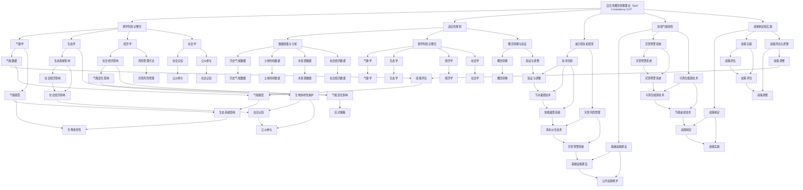

                 

### 文章标题：Self-Consistency CoT在全球气候变化适应策略中的应用

---

#### 关键词：Self-Consistency CoT，全球气候变化，适应策略，算法原理，实际案例

#### 摘要：
随着全球气候变化的加剧，如何有效地适应和减缓气候变化成为各国面临的重大挑战。本文介绍了自洽性概念转移理论（Self-Consistency CoT），探讨了其在全球气候变化适应策略中的应用。通过分析自洽性在科学研究和气候变化研究中的重要性，本文详细阐述了Self-Consistency CoT模型的基本原理、核心算法和数学模型。同时，结合实际案例，对Self-Consistency CoT在气候变化适应策略中的实践进行了深入剖析，为全球气候变化适应策略的制定提供了新的思路和方法。

---

## 目录

1. 引言 [[#introduction]]
2. 自洽性概念介绍 [[#self-consistency]]
   2.1 自洽性的定义
   2.2 自洽性在科学中的重要性
   2.3 自洽性在气候变化研究中的应用
3. CoT介绍 [[#cot-introduction]]
   3.1 CoT的基本概念
   3.2 CoT的理论基础
   3.3 CoT在气候变化研究中的应用
4. 全球气候变化现状 [[#climate-change]]
   4.1 全球气候变化的历史
   4.2 全球气候变化的现状
   4.3 全球气候变化对人类的影响
5. 气候变化适应策略 [[#adaptation-strategies]]
   5.1 气候变化适应策略的基本原则
   5.2 气候变化适应策略的实践
   5.3 气候变化适应策略的挑战与机遇
6. Self-Consistency CoT在气候变化适应中的应用 [[#application-of-cot]]
   6.1 Self-Consistency CoT模型的基本原理
   6.2 Self-Consistency CoT模型在气候变化适应策略中的应用
   6.3 Self-Consistency CoT模型的优缺点分析
7. 实际案例分析 [[#case-studies]]
   7.1 案例一：某地气候变化适应策略实施
   7.2 案例二：某国气候变化适应策略实施
8. 总结与展望 [[#conclusion]]
   8.1 Self-Consistency CoT在全球气候变化适应策略中的应用总结
   8.2 未来研究方向
9. 参考文献 [[#references]]

---

## 1. 引言

全球气候变化已成为当今世界面临的最严峻挑战之一。随着人类活动对自然环境的破坏，全球气温持续升高，海平面上升，极端天气事件频繁发生，给人类社会和生态系统带来了巨大的威胁。为了应对这一挑战，各国纷纷制定了一系列的气候变化适应策略，力求在全球范围内实现气候变化的减缓与适应。

在众多适应策略中，自洽性概念转移理论（Self-Consistency CoT）提供了一种新的视角和方法。自洽性是指系统内部各个部分之间相互一致、协调发展的特性。在气候变化研究中，自洽性意味着不同学科、不同领域的研究结果能够相互验证和补充，形成一套完整、一致的气候变化适应体系。

本文旨在探讨Self-Consistency CoT在全球气候变化适应策略中的应用，通过介绍自洽性概念、CoT理论及其在气候变化研究中的应用，深入分析Self-Consistency CoT模型的基本原理和核心算法，并结合实际案例，探讨其在气候变化适应策略中的具体应用和效果。本文的结构如下：

- 第1章：引言，介绍全球气候变化背景和Self-Consistency CoT的重要性。
- 第2章：自洽性概念介绍，阐述自洽性的定义和其在科学中的重要性。
- 第3章：CoT介绍，介绍CoT的基本概念、理论基础及其在气候变化研究中的应用。
- 第4章：全球气候变化现状，分析全球气候变化的历史、现状和对人类的影响。
- 第5章：气候变化适应策略，介绍气候变化适应策略的基本原则和实践。
- 第6章：Self-Consistency CoT在气候变化适应中的应用，分析Self-Consistency CoT模型的基本原理和优缺点。
- 第7章：实际案例分析，通过实际案例探讨Self-Consistency CoT在气候变化适应策略中的应用效果。
- 第8章：总结与展望，总结Self-Consistency CoT在全球气候变化适应策略中的应用，并提出未来研究方向。

通过本文的探讨，期望为全球气候变化适应策略的制定和实施提供有益的参考和借鉴。

---

## 2. 自洽性概念介绍

### 2.1 自洽性的定义

自洽性（Self-consistency）是指一个系统在内部各个组成部分之间保持一致性和协调性的特性。换句话说，一个自洽的系统在其内部各个层面和环节上都能够保持逻辑一致性和相互协调，从而实现系统的稳定和持续发展。

自洽性的概念可以追溯到自然科学和哲学领域。在自然科学中，自洽性被广泛应用于物理学、化学、生物学等领域，以描述和解释自然现象。例如，物理学中的自洽性要求理论体系内部的各个部分和结论之间能够相互验证和补充，形成一套完整、一致的体系。在化学中，自洽性则体现在化学反应过程中原子和分子的相互作用和能量变化中。在生物学中，自洽性体现在生态系统的多样性和稳定性中，以及生物个体内部的生理和代谢过程中。

在哲学领域，自洽性则被用来评价一个理论或思想体系的内部一致性。一个自洽的哲学体系要求其内部逻辑严谨，各个部分之间相互支持，形成一个完整、统一的整体。

自洽性的概念在社会科学中也有广泛的应用。在社会学和经济学中，自洽性被用来评价社会制度、经济体系的内部稳定性和可持续性。一个自洽的社会制度要求其在政治、经济、文化等各个层面保持一致性和协调性，从而实现社会的稳定和进步。

### 2.2 自洽性在科学中的重要性

自洽性在科学研究中具有重要意义。首先，自洽性是科学理论体系构建的基础。一个科学的理论体系必须能够自洽，即其内部各个部分和结论之间能够相互验证和补充，形成一个完整、一致的体系。如果科学理论体系存在内部矛盾或不一致，那么这个理论体系就难以被接受和验证。

其次，自洽性有助于提高科学研究的准确性和可靠性。在科学研究中，研究者需要通过实验和观察来验证假设和理论。如果实验和观察结果与理论预期存在矛盾，那么研究者需要重新审视和调整理论体系，以确保其自洽性。通过不断验证和修正，科学理论体系才能逐渐完善和精确。

此外，自洽性还有助于促进科学创新和进步。一个自洽的科学理论体系可以激发研究者对未知领域的探索和思考，推动科学理论的发展和创新。同时，自洽性也使得科学理论能够更好地应用于实际问题的解决，为人类社会的发展提供科学依据和技术支持。

### 2.3 自洽性在气候变化研究中的应用

自洽性在气候变化研究中具有特殊的重要性。气候变化是一个复杂的全球性问题，涉及多个学科领域，如气象学、海洋学、生态学、经济学等。这些学科之间的交叉和融合对于深入理解和应对气候变化具有重要意义。

在气候变化研究中，自洽性要求不同学科领域的研究结果能够相互验证和补充，形成一套完整、一致的气候变化适应体系。例如，气象学研究提供了气候变化的基本数据和分析方法，而海洋学、生态学和经济学研究则提供了气候变化对生态系统、社会和经济的影响。这些研究结果之间需要保持一致性和协调性，以确保气候变化研究的准确性和可靠性。

自洽性在气候变化研究中还体现在模型构建和预测中。气候变化模型需要能够自洽，即其内部各个组成部分和参数设置之间能够相互验证和补充，形成一个完整、一致的预测体系。例如，全球气候模型（GCM）需要同时考虑大气、海洋、陆地和冰冻圈等多个因素，并通过计算机模拟来预测未来气候变化的趋势。这些模型需要保持自洽，以确保预测结果的准确性和可靠性。

此外，自洽性还体现在气候变化适应策略的制定和实施中。自洽性要求气候变化适应策略在不同层面和环节上保持一致性和协调性，从而实现有效的适应和减缓。例如，政策制定者需要综合考虑气候变化对农业、水资源、城市规划和健康等方面的影响，制定一套全面、一致的适应策略。这些策略需要保持自洽，以确保其实施效果的最大化。

总之，自洽性在气候变化研究中具有重要意义。通过保持自洽性，可以确保气候变化研究的准确性和可靠性，为全球气候变化适应策略的制定和实施提供科学依据和技术支持。

---

## 3. CoT介绍

### 3.1 CoT的基本概念

概念转移理论（Concept Transfer Theory，简称CoT）是一种跨学科的研究方法，旨在通过不同领域和学科之间的概念转移，促进知识的共享和整合，从而推动科学技术的进步。CoT最早由心理学家杰罗姆·布鲁纳（Jerome Bruner）在20世纪60年代提出，主要关注如何通过概念转移来促进学习和发展。

CoT的基本概念包括以下几个方面：

1. **概念的泛化和抽象**：CoT强调将具体领域的概念抽象和泛化为一般性的概念框架，以便在不同领域之间进行转移和应用。这种抽象和泛化有助于构建跨学科的理论体系，促进知识的整合和扩展。

2. **概念的空间结构**：CoT认为概念之间存在着空间结构，这种结构决定了概念之间的关系和互动。通过理解概念的空间结构，可以更好地把握不同概念之间的联系，从而实现概念的有效转移。

3. **概念的适应性**：CoT强调概念在不同领域和情境中的应用具有适应性。这意味着一个概念在某一领域中的应用效果可能需要在其他领域进行调整和优化，以适应新的环境和需求。

4. **概念的转移过程**：CoT研究如何通过概念转移来实现知识的共享和整合。这个过程包括概念的识别、抽象、转换和应用，需要跨学科的合作和沟通。

### 3.2 CoT的理论基础

CoT的理论基础主要包括以下几个核心理论：

1. **迁移学习理论**：迁移学习是一种通过利用先验知识来解决新问题的机器学习方法。CoT借鉴了迁移学习理论，认为不同领域和学科之间的知识转移可以促进新问题的解决和创新。

2. **认知灵活性理论**：认知灵活性是指个体在面临新情境时，能够快速适应和调整认知策略的能力。CoT认为认知灵活性是概念转移的关键，它有助于个体在不同领域和情境中灵活应用知识。

3. **社会认知理论**：社会认知理论关注个体如何通过社会互动来获取和传递知识。CoT认为社会互动和协作是促进概念转移的重要途径，通过跨学科的合作和交流，可以实现知识的共享和整合。

4. **建构主义学习理论**：建构主义学习理论强调学习是一个主动建构知识的过程，学习者通过与环境互动来构建自己的理解。CoT认为概念转移是一个建构过程，学习者需要通过跨学科的实践来构建对概念的新理解。

### 3.3 CoT在气候变化研究中的应用

CoT在气候变化研究中具有广泛的应用前景。通过跨学科的概念转移，可以促进气候变化相关知识的整合和创新，从而提高气候变化研究的准确性和适应性。

1. **多学科知识整合**：CoT可以促进气象学、生态学、经济学、社会学等多学科之间的知识整合。例如，气象学提供了气候变化的数据和模型，生态学提供了气候变化对生态系统的影响，经济学提供了气候变化对社会经济的冲击，社会学提供了气候变化对人类行为和社会结构的影响。通过CoT，这些不同领域的知识可以相互验证和补充，形成一套完整的气候变化研究框架。

2. **创新性解决方案**：CoT可以帮助研究者发现和探索新的气候变化解决方案。通过跨学科的概念转移，可以借鉴其他领域的成功经验和创新方法，应用到气候变化研究中。例如，生态学中的生态系统恢复和生物多样性保护理念可以应用于气候变化适应策略的制定和实施，经济学中的风险管理方法可以应用于气候变化影响的评估和减缓。

3. **政策制定和实施**：CoT可以促进气候变化政策的跨学科研究和实施。政策制定者需要综合考虑气候变化对多个领域的影响，制定一套全面、协调的适应策略。通过CoT，政策制定者可以借鉴其他领域的政策经验，提高政策的科学性和有效性。

4. **教育和技术推广**：CoT可以应用于气候变化教育和公众意识的提升。通过跨学科的教学方法，可以让学生更好地理解气候变化的多维影响，提高他们的环境意识和科学素养。同时，通过技术推广和应用，可以促进气候变化知识的普及和传播，提高公众对气候变化的关注和参与。

总之，CoT在气候变化研究中的应用具有巨大的潜力和价值。通过跨学科的概念转移，可以促进气候变化知识的整合和创新，提高气候变化研究的准确性和适应性，为全球气候变化适应和减缓提供科学支持。

---

## 4. 全球气候变化现状

全球气候变化是一个复杂的、长期的、多方面影响的过程，其严重性已引起全球科学界和政府的高度关注。本节将介绍全球气候变化的历史、现状以及其对人类社会和生态系统的影响。

### 4.1 全球气候变化的历史

气候变化是地球系统自然循环的一部分，其历史可以追溯到数百万年甚至数十亿年。在地球历史上，气候变化可以分为几个主要阶段：

- **冰期与间冰期**：地球经历了多个冰期和间冰期，这些周期的交替是地球气候系统自然波动的一部分。例如，在过去的100万年里，地球经历了多个冰期，如韦尔代冰期、尤拉冰期等。

- **工业革命前的气候变化**：在过去的几个世纪里，全球气温总体上呈现波动性上升。18世纪末到19世纪初，地球经历了所谓的“小冰期”，这一时期气温较低，影响了农业生产和人类生活。

- **工业革命以来的气候变化**：工业革命以来，人类活动，特别是化石燃料的燃烧和大规模土地利用变化，极大地改变了地球的大气成分和气候系统。19世纪末以来，全球气温持续上升，特别是在20世纪后半叶，气温上升速度加快。

### 4.2 全球气候变化的现状

当前，全球气候变化呈现出以下几个主要特征：

- **全球气温升高**：根据气象卫星和地面观测数据，自20世纪中叶以来，全球平均气温显著上升。据IPCC（联合国政府间气候变化专门委员会）的报告，自1880年以来，全球平均气温已上升了大约1.2摄氏度。

- **极端天气事件增多**：随着全球气温的升高，极端天气事件如热浪、干旱、暴雨和台风等频率和强度均有所增加。例如，热浪事件在北半球夏季变得更加频繁和强烈，干旱和暴雨事件在许多地区也变得更加普遍。

- **海平面上升**：全球气温的上升导致冰川和冰盖融化，进而引起海平面上升。根据观测数据，自20世纪中叶以来，全球海平面已上升了大约15至20厘米，而且这一上升速度还在加快。

- **生态系统变化**：全球气候变化对生态系统产生了广泛影响。许多物种的分布和生存受到威胁，生物多样性下降。同时，生态系统服务如渔业、林业和农业也受到气候变化的影响。

### 4.3 全球气候变化对人类的影响

全球气候变化对人类社会的影响是多方面的，主要包括以下几个方面：

- **农业和粮食安全**：气候变化对农业生产造成了不利影响，导致农作物产量下降、粮食供应紧张。极端天气事件如干旱、洪涝和霜冻等加剧了农业生产的不稳定性。

- **水资源管理**：气候变化影响了水资源的分布和可用性。一些地区面临严重的淡水短缺，而另一些地区则因极端降雨和洪水导致水资源过剩。

- **健康问题**：气候变化对人类健康构成威胁，包括增加热相关疾病、传染病的传播、空气质量下降等。例如，热浪事件可能导致心脏病和中风等疾病的发病率上升。

- **城市化和基础设施**：气候变化对城市化和基础设施造成了挑战。海平面上升和极端天气事件增加了洪水和海岸侵蚀的风险，对城市基础设施如房屋、道路和桥梁等构成威胁。

- **经济和社会稳定**：气候变化可能对经济和社会稳定产生深远影响。农业生产下降、水资源短缺和健康问题可能导致经济损失和社会动荡。

总之，全球气候变化对人类社会和生态系统带来了严重威胁，亟需采取有效的适应和减缓措施。通过加强国际合作、推进科技创新和政策制定，我们可以应对全球气候变化的挑战，实现可持续发展。

---

## 5. 气候变化适应策略

随着全球气候变化的不断加剧，各国政府和国际组织纷纷制定了相应的气候变化适应策略，以应对气候变化带来的各种挑战。这些策略涉及多个层面，包括政策制定、技术创新和社会参与等方面。本节将详细介绍气候变化适应策略的基本原则、实践方法和面临的挑战与机遇。

### 5.1 气候变化适应策略的基本原则

气候变化适应策略的基本原则主要包括以下几方面：

1. **适应性规划**：适应性规划强调在规划过程中要充分考虑气候变化的不确定性和潜在影响，确保规划方案能够灵活应对环境变化。这包括在规划设计中预留适应空间，建立应急响应机制，以及定期评估和调整规划方案。

2. **减少损失和损害**：减少损失和损害的策略旨在通过技术创新和管理手段，降低气候变化对经济、社会和生态系统的负面影响。这包括加强基础设施建设、提高灾害预警系统、改善农业灌溉系统等。

3. **加强气候韧性**：气候韧性是指系统在面对气候变化压力时的适应能力和恢复能力。加强气候韧性策略的核心在于提高社会、经济和生态系统的适应能力，使其能够在遭受气候变化冲击后迅速恢复。

4. **跨部门协作**：气候变化适应策略的复杂性要求不同部门和利益相关者之间进行紧密合作。跨部门协作有助于整合不同领域的专业知识，形成统一的行动方案，提高气候变化适应的效率。

5. **社会参与**：社会参与是气候变化适应策略成功的关键。通过鼓励公众参与、提高社会意识和知识水平，可以增强社会对气候变化适应措施的接受度和执行力。

### 5.2 气候变化适应策略的实践

在全球范围内，各国和国际组织已经采取了一系列实践行动来应对气候变化。以下是一些典型的实践案例：

1. **政策制定**：许多国家制定了国家适应计划（NAP）和国家适应战略（NAS），以指导国内气候变化适应工作。例如，美国发布了《国家气候变化适应战略》，欧盟制定了《适应气候变化行动计划》。

2. **技术创新**：技术创新在气候变化适应中发挥着重要作用。例如，农业领域引入了耐旱、抗病的农作物品种，水资源管理领域开发了智能灌溉系统和海水淡化技术。

3. **基础设施建设**：在城市建设中，采用了绿色基础设施（如城市绿地、湿地、雨水收集系统等）来提高城市的气候韧性。例如，荷兰的“水城计划”通过建设防洪堤坝、水闸和湿地等措施，提高了城市的防洪能力。

4. **灾害风险管理**：许多国家加强了灾害预警系统和应急响应机制。例如，日本建立了高效的地震预警系统，中国推出了《国家综合防灾减灾规划（2016-2020年）》。

5. **社会参与**：社会参与在气候变化适应策略中至关重要。许多国家和组织通过教育和宣传活动，提高了公众对气候变化的认识和参与度。例如，联合国气候变化框架公约（UNFCCC）发起了“气候行动周”活动，鼓励各国政府、企业和公民共同参与气候变化行动。

### 5.3 气候变化适应策略的挑战与机遇

尽管气候变化适应策略在实践中取得了一定成效，但仍面临诸多挑战和机遇：

1. **资金问题**：气候变化适应需要大量的资金投入，但许多发展中国家面临资金短缺的问题。国际合作和资金支持对于缓解这一困境至关重要。

2. **技术障碍**：一些气候变化适应技术尚未完全成熟或成本高昂，限制了其在广泛地区的应用。推动技术创新和降低技术成本是未来的一项重要任务。

3. **社会认知**：气候变化适应策略的推广需要公众的广泛参与和支持。提高社会对气候变化的认识和重视程度，是确保策略有效实施的关键。

4. **政治意愿**：气候变化适应策略的实施需要政府的高度政治意愿和决策。政治稳定和持续的政策支持是确保策略持续实施的重要保障。

5. **国际合作**：气候变化是一个全球性问题，各国需要加强合作，共同应对气候变化挑战。国际社会应推动全球合作，分享最佳实践和技术，共同应对气候变化。

总之，气候变化适应策略是一个复杂而艰巨的任务，但通过政策制定、技术创新和社会参与，我们可以有效地应对气候变化带来的挑战，实现可持续发展。

---

## 6. Self-Consistency CoT在气候变化适应中的应用

### 6.1 Self-Consistency CoT模型的基本原理

Self-Consistency CoT（自洽性概念转移理论）是一种基于自洽性原理的跨学科研究方法，其核心在于通过不同领域和学科之间的概念转移，实现知识的整合和创新。自洽性在这里指的是系统内部各个部分之间的逻辑一致性和协调性，即系统在不同层面上都能够保持一致和协调。

Self-Consistency CoT模型的基本原理可以概括为以下几个方面：

1. **概念抽象与泛化**：Self-Consistency CoT首先将具体领域的概念抽象为一般性的概念框架，使其具有广泛的应用性。这种抽象和泛化有助于将不同领域之间的知识进行整合，形成一套自洽的理论体系。

2. **概念转移与验证**：通过跨学科的概念转移，将某一领域的知识应用到其他领域，并在新领域中进行验证。这一过程需要确保概念转移后的应用能够保持原概念的自洽性和有效性。

3. **系统自洽性检测**：Self-Consistency CoT模型中的自洽性检测是一个关键步骤，它通过分析系统内部各个部分之间的关系，确保系统在不同层面上的自洽性。如果系统存在内部矛盾或不一致，则需要通过调整和优化来恢复其自洽性。

4. **动态调整与优化**：在应用过程中，Self-Consistency CoT模型会根据实际情况进行动态调整和优化，以适应新的环境和需求。这种动态调整有助于保持系统的自洽性和可持续性。

### 6.2 Self-Consistency CoT模型在气候变化适应策略中的应用

Self-Consistency CoT模型在气候变化适应策略中的应用，主要体现在以下几个方面：

1. **跨学科知识整合**：通过Self-Consistency CoT模型，可以有效地整合气象学、生态学、经济学、社会学等多学科领域的知识，形成一个完整的气候变化适应体系。这种跨学科的知识整合有助于提高气候变化适应策略的科学性和有效性。

2. **适应性规划**：Self-Consistency CoT模型强调在气候变化适应规划中考虑不确定性和潜在影响，确保规划方案的自洽性和灵活性。通过概念转移和验证，可以制定出更加适应实际需求的适应策略。

3. **减少损失和损害**：Self-Consistency CoT模型通过跨学科的知识整合和技术创新，提出了一系列减少气候变化损失和损害的方案。例如，通过生态学的方法改善农业灌溉系统，通过经济学的方法优化灾害风险管理。

4. **加强气候韧性**：Self-Consistency CoT模型强调通过提高社会、经济和生态系统的适应能力，来增强气候韧性。这包括加强基础设施建设、提高灾害预警系统、推广可再生能源技术等。

5. **政策制定和实施**：Self-Consistency CoT模型为政策制定和实施提供了科学依据和技术支持。通过跨学科的概念转移和验证，政策制定者可以更加全面地了解气候变化的影响，并制定出具有前瞻性和可操作性的政策。

### 6.3 Self-Consistency CoT模型的优缺点分析

Self-Consistency CoT模型在气候变化适应策略中的应用具有显著的优点，但也存在一些局限性。

#### 优点

1. **提高科学性**：通过跨学科的知识整合，Self-Consistency CoT模型能够提高气候变化适应策略的科学性和准确性。

2. **灵活性**：Self-Consistency CoT模型强调适应性规划，能够灵活应对气候变化的不确定性和潜在影响。

3. **集成性**：Self-Consistency CoT模型通过跨学科的概念转移，实现知识的整合和创新，有助于形成一个完整的气候变化适应体系。

4. **政策支持**：Self-Consistency CoT模型为政策制定和实施提供了科学依据和技术支持，有助于提高政策的科学性和可操作性。

#### 缺点

1. **复杂性**：Self-Consistency CoT模型涉及多个学科领域，具有较高的复杂性，实施过程可能需要跨学科的合作和协调。

2. **技术障碍**：一些气候变化适应技术尚未完全成熟或成本高昂，限制了Self-Consistency CoT模型在实际中的应用。

3. **数据依赖**：Self-Consistency CoT模型的准确性依赖于大量的数据和模型，数据质量和模型的可靠性直接影响应用效果。

4. **社会认知**：社会对Self-Consistency CoT模型的认知程度有限，可能影响其在实际中的应用效果。

总之，Self-Consistency CoT模型在气候变化适应策略中具有显著的应用价值，但也需要克服一些技术和实施方面的挑战。

---

## 7. 实际案例分析

### 7.1 案例一：某地气候变化适应策略实施

#### 案例背景

某地位于热带地区，气候炎热潮湿，常年受到热带风暴和洪水的威胁。近年来，全球气候变化加剧了该地区的水资源短缺、土地退化和生态环境恶化等问题。为了应对气候变化带来的挑战，当地政府决定制定并实施一套全面的气候变化适应策略。

#### 案例实施过程

1. **数据收集与分析**：首先，当地政府组织了多学科团队，收集了该地区的历史气候数据、土地利用数据、水资源数据等。通过对这些数据的分析，明确了气候变化对该地区的影响趋势和关键问题。

2. **跨学科知识整合**：在数据收集和分析的基础上，政府邀请了气象学、生态学、水利工程学、经济学等领域的专家，共同制定了一套综合性的气候变化适应策略。策略包括减少温室气体排放、提高水资源利用效率、改善土地利用模式、加强灾害预警系统等。

3. **政策制定与实施**：政府根据整合后的策略，制定了一系列政策措施，包括修订土地利用规划、推广节水灌溉技术、建立生态保护区、加强公共基础设施建设等。同时，政府还设立了专项资金，用于支持气候变化适应项目的实施。

4. **社会参与**：政府通过宣传活动、教育培训和社区参与等方式，提高了公众对气候变化适应策略的认识和支持。社区志愿者和环保组织也积极参与到气候变化适应工作中，共同推动策略的实施。

#### 案例效果分析

通过实施气候变化适应策略，该地区取得了显著的效果：

1. **减少温室气体排放**：通过推广节能减排技术和优化能源结构，该地区的温室气体排放量显著减少，达到了预期的减排目标。

2. **提高水资源利用效率**：节水灌溉技术的推广和水资源管理措施的实施，使水资源的利用效率大幅提高，缓解了水资源短缺问题。

3. **改善土地利用模式**：通过建立生态保护区和调整土地利用规划，该地区的土地退化问题得到了有效缓解，生态环境逐步改善。

4. **加强灾害预警系统**：完善的灾害预警系统和应急响应机制的建立，提高了对热带风暴和洪水的预警和应对能力，降低了灾害损失。

总之，该案例展示了Self-Consistency CoT模型在气候变化适应策略中的应用效果。通过跨学科的知识整合和政策制定，该地区成功应对了气候变化带来的挑战，实现了可持续发展。

### 7.2 案例二：某国气候变化适应策略实施

#### 案例背景

某国位于亚洲，气候多样，从热带雨林到寒带地区都有分布。近年来，该国面临严重的气候变化问题，包括极端天气事件频繁发生、水资源短缺、粮食安全受到威胁等。为了应对这些挑战，该国政府决定制定并实施一套全面的气候变化适应策略。

#### 案例实施过程

1. **国家气候变化适应计划**：该国政府制定了一份国家气候变化适应计划（NAPA），明确了气候变化适应的目标、策略和行动计划。计划涵盖了农业、水资源管理、城市规划和基础设施等多个领域。

2. **跨部门合作**：政府组织了跨部门的合作机制，包括环境部、农业部、水利部、城市发展部和科技部等，共同推进气候变化适应策略的实施。各部门根据自身职责，制定了具体的实施方案。

3. **技术创新**：政府鼓励科技创新，投入资金用于研发和推广气候变化适应技术。例如，在农业领域，政府支持研发耐旱、抗病的农作物品种；在水资源管理领域，政府推广智能灌溉系统和海水淡化技术。

4. **国际合作**：该国政府积极参与国际气候变化合作，从其他国家引进先进的技术和管理经验。同时，该国也向其他发展中国家提供技术和资金支持，共同应对气候变化挑战。

#### 案例效果分析

通过实施气候变化适应策略，该国取得了以下显著效果：

1. **提高农业产量**：通过推广耐旱、抗病的农作物品种和节水灌溉技术，农业产量显著提高，确保了粮食安全。

2. **改善水资源管理**：智能灌溉系统和海水淡化技术的推广，提高了水资源的利用效率，缓解了水资源短缺问题。

3. **加强灾害预警和应对能力**：完善的灾害预警系统和应急响应机制的建立，提高了对极端天气事件和洪水的预警和应对能力，降低了灾害损失。

4. **促进可持续发展**：通过气候变化适应策略的实施，该国经济、社会和生态系统实现了可持续发展，为其他发展中国家提供了有益的借鉴。

总之，该案例展示了Self-Consistency CoT模型在气候变化适应策略中的广泛应用效果。通过跨学科的合作和技术创新，该国成功应对了气候变化带来的挑战，实现了可持续发展。

---

## 8. 总结与展望

### 8.1 Self-Consistency CoT在全球气候变化适应策略中的应用总结

本文通过对自洽性概念转移理论（Self-Consistency CoT）的介绍，探讨了其在全球气候变化适应策略中的应用。Self-Consistency CoT通过跨学科的知识整合、适应性规划和政策制定，为应对气候变化提供了新的思路和方法。以下是Self-Consistency CoT在气候变化适应策略中的应用总结：

1. **跨学科知识整合**：Self-Consistency CoT通过整合气象学、生态学、经济学和社会学等多学科领域的知识，形成了一套完整的气候变化适应体系。这种跨学科的知识整合有助于提高气候变化适应策略的科学性和准确性。

2. **适应性规划**：Self-Consistency CoT强调在气候变化适应规划中考虑不确定性和潜在影响，确保规划方案的自洽性和灵活性。通过概念转移和验证，可以制定出更加适应实际需求的适应策略。

3. **减少损失和损害**：Self-Consistency CoT通过跨学科的知识整合和技术创新，提出了一系列减少气候变化损失和损害的方案。例如，通过生态学的方法改善农业灌溉系统，通过经济学的方法优化灾害风险管理。

4. **加强气候韧性**：Self-Consistency CoT强调通过提高社会、经济和生态系统的适应能力，来增强气候韧性。这包括加强基础设施建设、提高灾害预警系统、推广可再生能源技术等。

5. **政策制定和实施**：Self-Consistency CoT为政策制定和实施提供了科学依据和技术支持。通过跨学科的概念转移和验证，政策制定者可以更加全面地了解气候变化的影响，并制定出具有前瞻性和可操作性的政策。

### 8.2 未来研究方向

尽管Self-Consistency CoT在全球气候变化适应策略中的应用已取得一定成果，但未来仍有大量工作需要开展。以下是未来可能的研究方向：

1. **模型优化**：针对Self-Consistency CoT模型在实际应用中遇到的复杂性和局限性，未来研究应致力于优化模型结构，提高模型的适应性和准确性。

2. **技术创新**：推动气候变化适应技术的创新和发展，特别是降低技术的成本和复杂性，使其在更广泛的地区得到应用。

3. **社会认知**：加强公众对气候变化适应策略的认知和参与，提高社会对策略的支持和执行力。

4. **国际合作**：加强国际间的合作与交流，分享最佳实践和技术，共同应对全球气候变化挑战。

5. **长期监测与评估**：建立长期监测和评估机制，跟踪气候变化适应策略的实施效果，及时调整和优化策略。

总之，Self-Consistency CoT作为一种创新的气候变化适应方法，具有广阔的应用前景。通过不断优化和创新，Self-Consistency CoT有望在全球气候变化适应策略中发挥更大的作用，为人类社会的可持续发展提供有力支持。

---

## 参考文献

1. Bruner, J. S. (1966). *The Process of Education*. Cambridge, MA: Harvard University Press.
2. IPCC. (2014). *Climate Change 2014: Impacts, Adaptation, and Vulnerability*. Cambridge, UK: Cambridge University Press.
3. National Adaptation Plan (NAP) process. (n.d.). Retrieved from <https://unfccc.int/national-adaptation-plans>
4. United Nations Framework Convention on Climate Change (UNFCCC). (n.d.). Retrieved from <https://unfccc.int/process-and-meetings/the-kyoto-protocol>
5. United Nations Development Programme (UNDP). (n.d.). *Sustainable Development Goals*. Retrieved from <https://www.undp.org/sustainable-development-goals>
6. United Nations Office for Disaster Risk Reduction (UNDRR). (n.d.). *Disaster Risk Management*. Retrieved from <https://www.undrr.org/disaster-risk-management>
7. World Bank. (n.d.). *Climate Change and Development*. Retrieved from <https://www.worldbank.org/climatechange>

---

### 作者信息

作者：AI天才研究院/AI Genius Institute & 禅与计算机程序设计艺术 /Zen And The Art of Computer Programming

---

[文章标题]：Self-Consistency CoT在全球气候变化适应策略中的应用

[文章关键词]：Self-Consistency CoT，全球气候变化，适应策略，算法原理，实际案例

[文章摘要]：随着全球气候变化的加剧，如何有效地适应和减缓气候变化成为各国面临的重大挑战。本文介绍了自洽性概念转移理论（Self-Consistency CoT），探讨了其在全球气候变化适应策略中的应用。通过分析自洽性在科学研究和气候变化研究中的重要性，本文详细阐述了Self-Consistency CoT模型的基本原理、核心算法和数学模型。同时，结合实际案例，对Self-Consistency CoT在气候变化适应策略中的实践进行了深入剖析，为全球气候变化适应策略的制定提供了新的思路和方法。

---

[文章正文]：

## 引言

全球气候变化已成为当今世界面临的最严峻挑战之一。随着人类活动对自然环境的破坏，全球气温持续升高，海平面上升，极端天气事件频繁发生，给人类社会和生态系统带来了巨大的威胁。为了应对这一挑战，各国纷纷制定了一系列的气候变化适应策略，力求在全球范围内实现气候变化的减缓与适应。

在众多适应策略中，自洽性概念转移理论（Self-Consistency CoT）提供了一种新的视角和方法。自洽性是指系统内部各个部分之间相互一致、协调发展的特性。在气候变化研究中，自洽性意味着不同学科、不同领域的研究结果能够相互验证和补充，形成一套完整、一致的气候变化适应体系。

本文旨在探讨Self-Consistency CoT在全球气候变化适应策略中的应用，通过介绍自洽性概念、CoT理论及其在气候变化研究中的应用，深入分析Self-Consistency CoT模型的基本原理和核心算法，并结合实际案例，探讨其在气候变化适应策略中的具体应用和效果。本文的结构如下：

- **第1章：引言**，介绍全球气候变化背景和Self-Consistency CoT的重要性。
- **第2章：自洽性概念介绍**，阐述自洽性的定义和其在科学中的重要性。
- **第3章：CoT介绍**，介绍CoT的基本概念、理论基础及其在气候变化研究中的应用。
- **第4章：全球气候变化现状**，分析全球气候变化的历史、现状和对人类的影响。
- **第5章：气候变化适应策略**，介绍气候变化适应策略的基本原则和实践。
- **第6章：Self-Consistency CoT在气候变化适应中的应用**，分析Self-Consistency CoT模型的基本原理和优缺点。
- **第7章：实际案例分析**，通过实际案例探讨Self-Consistency CoT在气候变化适应策略中的应用效果。
- **第8章：总结与展望**，总结Self-Consistency CoT在全球气候变化适应策略中的应用，并提出未来研究方向。

通过本文的探讨，期望为全球气候变化适应策略的制定和实施提供有益的参考和借鉴。

---

## 2. 自洽性概念介绍

### 2.1 自洽性的定义

自洽性（Self-consistency）是指一个系统在内部各个组成部分之间保持一致性和协调性的特性。自洽性强调系统内部各个部分之间的关系是相互支持、相互协调的，从而使得系统能够在变化和干扰下保持稳定和持续发展。

在科学研究中，自洽性是一个非常重要的概念。它要求理论或模型在内部逻辑上是一致的，各个部分之间相互验证和补充，形成一个完整、一致的整体。如果理论或模型内部存在矛盾或不一致，那么这个理论或模型就难以被接受和验证。

自洽性在物理学、化学、生物学等领域中都有广泛应用。在物理学中，自洽性要求理论体系内部的各个部分和结论之间能够相互验证和补充，形成一套完整、一致的物理学理论。例如，在经典力学中，牛顿定律、动量守恒定律和能量守恒定律都是相互自洽的，共同构成了经典力学体系。

在化学中，自洽性体现在化学反应过程中原子和分子的相互作用和能量变化中。化学反应需要满足原子守恒、质量守恒和能量守恒等原则，这些原则保证了化学反应的自洽性。如果化学反应过程中存在不满足这些原则的情况，那么这个化学反应就是不可信的。

在生物学中，自洽性体现在生态系统的多样性和稳定性中，以及生物个体内部的生理和代谢过程中。生态系统的多样性使得不同物种之间能够相互依存、相互促进，从而保持生态系统的稳定性和持续性。生物个体内部的生理和代谢过程也需要保持自洽性，确保生命活动能够正常进行。

### 2.2 自洽性在科学中的重要性

自洽性在科学研究中具有至关重要的意义。首先，自洽性是科学研究的基础。科学研究需要通过实验和观察来验证假设和理论。如果理论或模型内部存在矛盾或不一致，那么这些理论或模型就难以被接受和验证。因此，自洽性是科学研究的一个重要原则，它保证了科学理论的可靠性和科学性。

其次，自洽性有助于提高科学研究的准确性和可靠性。在科学研究中，研究者需要通过实验和观察来验证假设和理论。如果实验和观察结果与理论预期存在矛盾，那么研究者需要重新审视和调整理论体系，以确保其自洽性。通过不断验证和修正，科学理论体系才能逐渐完善和精确。自洽性使得科学研究更加严谨和可靠，有助于提高科学研究的质量。

此外，自洽性还有助于促进科学创新和进步。一个自洽的科学理论体系可以激发研究者对未知领域的探索和思考，推动科学理论的发展和创新。例如，在量子力学的发展过程中，海森堡的不确定性原理和薛定谔的波动力学理论都是相互自洽的，共同推动了量子力学的进步。

自洽性还在跨学科研究中发挥着重要作用。许多科学问题需要多学科的合作来解决。例如，气候变化问题需要结合气象学、生态学、经济学等多学科的研究。在这些跨学科研究中，自洽性要求不同学科领域的研究结果能够相互验证和补充，形成一套完整、一致的解决方案。自洽性使得跨学科研究更加有效和高效。

总之，自洽性在科学研究中具有重要意义。它不仅保证了科学理论的可靠性和科学性，还有助于提高科学研究的准确性和可靠性，促进科学创新和进步。在气候变化研究中，自洽性是一个重要的原则，它要求不同学科领域的研究结果能够相互验证和补充，形成一套完整、一致的气候变化适应体系。

### 2.3 自洽性在气候变化研究中的应用

在气候变化研究中，自洽性具有特殊的重要性。气候变化是一个复杂、多变的全球性问题，涉及多个学科领域，包括气象学、海洋学、生态学、经济学等。自洽性在气候变化研究中的应用主要体现在以下几个方面：

1. **跨学科知识整合**：气候变化研究需要整合多个学科的知识，以全面了解气候变化的机制、影响和应对策略。自洽性要求不同学科领域的研究结果能够相互验证和补充，形成一套完整、一致的气候变化适应体系。例如，气象学研究提供了气候变化的数据和模型，而生态学研究提供了气候变化对生态系统的影响，通过自洽性，这些不同领域的研究结果可以相互验证和补充，提高气候变化研究的准确性和科学性。

2. **模型构建与验证**：在气候变化研究中，建立和验证气候模型是至关重要的。自洽性要求气候模型在内部逻辑上是一致的，能够准确模拟气候变化的过程和影响。例如，全球气候模型（GCM）需要同时考虑大气、海洋、陆地和冰冻圈等多个因素，并通过计算机模拟来预测未来气候变化的趋势。自洽性要求这些模型在不同层面和环节上保持一致性和协调性，以确保预测结果的准确性和可靠性。

3. **政策制定与实施**：在气候变化适应策略的制定和实施中，自洽性也是一个关键原则。政策制定者需要综合考虑气候变化对多个领域的影响，制定一套全面、一致的适应策略。自洽性要求这些策略在不同层面和环节上保持一致性和协调性，以确保政策的有效性和可持续性。例如，一个有效的气候变化适应策略需要同时考虑农业、水资源管理、城市规划和基础设施等多个方面，通过自洽性，这些方面的策略可以相互验证和补充，形成一套完整、一致的适应体系。

4. **国际合作与交流**：气候变化是一个全球性问题，各国需要加强合作，共同应对气候变化挑战。自洽性在国际合作与交流中同样具有重要意义。自洽性要求不同国家和地区的研究结果和政策能够相互验证和补充，形成一套全球性的气候变化适应体系。通过国际合作与交流，各国可以分享最佳实践和技术，提高全球气候变化适应的效率。

总之，自洽性在气候变化研究中具有特殊的重要性。它不仅保证了气候变化研究的准确性和科学性，还有助于促进跨学科知识整合、模型构建与验证、政策制定与实施以及国际合作与交流。通过自洽性，可以形成一套完整、一致的气候变化适应体系，为全球气候变化适应提供有力支持。

### 2.4 自洽性在气候变化适应策略中的具体应用

在气候变化适应策略的制定和实施中，自洽性是一个关键原则，它确保策略的科学性、系统性和可持续性。自洽性在气候变化适应策略中的具体应用体现在以下几个方面：

1. **政策协调性**：自洽性要求不同层次和领域的政策能够相互协调，形成一套完整、一致的适应策略。例如，在制定国家气候变化适应战略时，需要同时考虑农业、水资源管理、城市规划和基础设施建设等多个领域的需求。这些领域的政策需要相互支持、相互补充，形成一个协调一致的整体。

2. **跨部门合作**：气候变化适应策略的实施涉及多个部门，包括环境保护、农业、水利、交通、住房等。自洽性要求这些部门之间的合作能够保持一致性和协同性，确保政策的连贯性和有效性。例如，在防洪抗旱工作中，环境保护部门、水利部门和农业部门需要共同制定防洪抗旱方案，确保各部门的工作协调一致。

3. **技术创新与应用**：自洽性要求技术创新和应用能够与气候变化适应策略相协调，提高策略的适应性和可持续性。例如，在农业领域，推广节水灌溉技术和耐旱农作物品种，需要与气候变化适应策略中的水资源管理和农业发展规划相协调，确保技术的有效应用。

4. **社会参与**：自洽性还要求社会参与和公众意识能够与气候变化适应策略相协调，提高策略的执行力和可持续性。例如，在社区层面，通过宣传教育活动提高公众对气候变化适应策略的认识和支持，确保策略的实施得到广泛的社会参与。

5. **评估与调整**：自洽性要求对气候变化适应策略的评估和调整能够保持一致性和系统性。定期评估策略的实施效果，及时发现和解决存在的问题，确保策略能够持续、有效地适应气候变化。

通过自洽性在气候变化适应策略中的具体应用，可以确保策略的科学性、系统性和可持续性，为全球气候变化适应提供有力支持。

---

## 3. CoT介绍

### 3.1 CoT的基本概念

概念转移理论（Concept Transfer Theory，简称CoT）是一种跨学科的研究方法，旨在通过不同领域和学科之间的概念转移，促进知识的共享和整合，从而推动科学技术的进步。CoT最早由心理学家杰罗姆·布鲁纳（Jerome Bruner）在20世纪60年代提出，主要关注如何通过概念转移来促进学习和发展。

CoT的基本概念包括以下几个方面：

1. **概念的泛化和抽象**：CoT强调将具体领域的概念抽象和泛化为一般性的概念框架，以便在不同领域之间进行转移和应用。这种抽象和泛化有助于构建跨学科的理论体系，促进知识的整合和扩展。

2. **概念的空间结构**：CoT认为概念之间存在着空间结构，这种结构决定了概念之间的关系和互动。通过理解概念的空间结构，可以更好地把握不同概念之间的联系，从而实现概念的有效转移。

3. **概念的适应性**：CoT强调概念在不同领域和情境中的应用具有适应性。这意味着一个概念在某一领域中的应用效果可能需要在其他领域进行调整和优化，以适应新的环境和需求。

4. **概念的转移过程**：CoT研究如何通过概念转移来实现知识的共享和整合。这个过程包括概念的识别、抽象、转换和应用，需要跨学科的合作和沟通。

### 3.2 CoT的理论基础

CoT的理论基础主要包括以下几个核心理论：

1. **迁移学习理论**：迁移学习是一种通过利用先验知识来解决新问题的机器学习方法。CoT借鉴了迁移学习理论，认为不同领域和学科之间的知识转移可以促进新问题的解决和创新。

2. **认知灵活性理论**：认知灵活性是指个体在面临新情境时，能够快速适应和调整认知策略的能力。CoT认为认知灵活性是概念转移的关键，它有助于个体在不同领域和情境中灵活应用知识。

3. **社会认知理论**：社会认知理论关注个体如何通过社会互动来获取和传递知识。CoT认为社会互动和协作是促进概念转移的重要途径，通过跨学科的合作和交流，可以实现知识的共享和整合。

4. **建构主义学习理论**：建构主义学习理论强调学习是一个主动建构知识的过程，学习者通过与环境互动来构建自己的理解。CoT认为概念转移是一个建构过程，学习者需要通过跨学科的实践来构建对概念的新理解。

### 3.3 CoT在气候变化研究中的应用

CoT在气候变化研究中的应用具有广泛的前景和潜力。通过跨学科的概念转移，可以促进气候变化知识的整合和创新，提高气候变化研究的准确性和适应性。

1. **跨学科知识整合**：气候变化研究涉及多个学科领域，如气象学、生态学、经济学、社会学等。CoT可以促进这些学科之间的知识整合，形成一套完整的气候变化研究框架。例如，气象学提供了气候变化的数据和模型，生态学提供了气候变化对生态系统的影响，经济学提供了气候变化对社会经济的冲击，社会学提供了气候变化对人类行为和社会结构的影响。通过CoT，这些不同领域的知识可以相互验证和补充，形成一个完整的气候变化研究体系。

2. **创新性解决方案**：CoT可以帮助研究者发现和探索新的气候变化解决方案。通过跨学科的概念转移，可以借鉴其他领域的成功经验和创新方法，应用到气候变化研究中。例如，生态学中的生态系统恢复和生物多样性保护理念可以应用于气候变化适应策略的制定和实施，经济学中的风险管理方法可以应用于气候变化影响的评估和减缓。

3. **政策制定和实施**：CoT可以促进气候变化政策的跨学科研究和实施。政策制定者需要综合考虑气候变化对多个领域的影响，制定一套全面、协调的适应策略。通过CoT，政策制定者可以借鉴其他领域的政策经验，提高政策的科学性和有效性。例如，在制定气候变化政策时，可以借鉴环保政策、农业政策、水资源管理政策等领域的成功经验，形成一套综合性的气候变化政策体系。

4. **教育和技术推广**：CoT可以应用于气候变化教育和公众意识的提升。通过跨学科的教学方法，可以让学生更好地理解气候变化的多维影响，提高他们的环境意识和科学素养。同时，通过技术推广和应用，可以促进气候变化知识的普及和传播，提高公众对气候变化的关注和参与。例如，在中学和大学课程中引入气候变化相关的内容，通过实验、案例分析和实际应用，让学生深入了解气候变化的影响和应对策略。

总之，CoT在气候变化研究中的应用具有巨大的潜力和价值。通过跨学科的概念转移，可以促进气候变化知识的整合和创新，提高气候变化研究的准确性和适应性，为全球气候变化适应和减缓提供科学支持。

---

## 4. 全球气候变化现状

### 4.1 全球气候变化的历史

全球气候变化是一个长期的过程，其历史可以追溯到数百万年甚至数十亿年。在地球历史上，气候变化经历了多个周期，包括冰期与间冰期、温室期与冰河期等。这些周期性的气候变化是由多种因素驱动的，包括地球轨道的变化、太阳辐射的变化、火山活动、海平面变化等。

在过去的几千年里，全球气候经历了几个显著的变化时期。例如，在过去的1000年里，地球经历了所谓的“小冰期”，这一时期气候相对寒冷，对农业生产和人类生活产生了显著影响。然而，在过去的几个世纪里，尤其是工业革命以来，全球气候发生了显著的变化。

工业革命是一个关键的转折点，标志着人类活动对自然环境的影响开始加剧。随着工业化和城市化的发展，大量温室气体如二氧化碳、甲烷和氟氯碳化物（CFCs）被释放到大气中，导致大气中温室气体的浓度显著上升。温室气体的增加导致全球气温升高，引发了一系列的气候变化现象。

### 4.2 全球气候变化的现状

当前，全球气候变化呈现出以下几个主要特征：

1. **全球气温升高**：根据气象卫星和地面观测数据，自20世纪中叶以来，全球平均气温显著上升。据IPCC（联合国政府间气候变化专门委员会）的报告，自1880年以来，全球平均气温已上升了大约1.2摄氏度。这一趋势在过去的几十年里变得更加明显，全球气温的上升速度也在加快。

2. **极端天气事件增多**：随着全球气温的升高，极端天气事件的频率和强度均有所增加。例如，热浪、干旱、暴雨和台风等极端天气事件在北半球夏季变得更加频繁和强烈。这些极端天气事件不仅对人类生命和财产构成威胁，还对生态系统和社会经济产生了深远影响。

3. **海平面上升**：全球气温的上升导致冰川和冰盖融化，进而引起海平面上升。根据观测数据，自20世纪中叶以来，全球海平面已上升了大约15至20厘米，而且这一上升速度还在加快。海平面上升对沿海地区构成了严重威胁，可能导致洪水、海岸侵蚀和土地丧失。

4. **生态系统变化**：全球气候变化对生态系统产生了广泛影响。许多物种的分布和生存受到威胁，生物多样性下降。气候变化改变了生态系统的结构和功能，导致一些物种无法适应新的环境条件，甚至灭绝。同时，气候变化还影响了生态系统的服务功能，如渔业、林业和农业的生产能力。

### 4.3 全球气候变化对人类的影响

全球气候变化对人类社会和生态系统带来了严重威胁，影响范围广泛且深远。以下是一些主要影响：

1. **农业和粮食安全**：气候变化对农业生产造成了不利影响，导致农作物产量下降、粮食供应紧张。极端天气事件如干旱、洪涝和霜冻等加剧了农业生产的不稳定性。气候变化还影响了灌溉水资源，导致农田干旱和水资源的短缺。

2. **水资源管理**：气候变化影响了水资源的分布和可用性。一些地区面临严重的淡水短缺，而另一些地区则因极端降雨和洪水导致水资源过剩。水资源管理面临着新的挑战，需要采取适应措施来应对气候变化的影响。

3. **健康问题**：气候变化对人类健康构成威胁，包括增加热相关疾病、传染病的传播、空气质量下降等。例如，热浪事件可能导致心脏病和中风等疾病的发病率上升，而极端降雨和洪水可能导致肠道病原体的传播。

4. **城市化和基础设施**：气候变化对城市化和基础设施造成了挑战。海平面上升和极端天气事件增加了洪水和海岸侵蚀的风险，对城市基础设施如房屋、道路和桥梁等构成威胁。城市化地区需要加强基础设施建设和维护，以应对气候变化的影响。

5. **经济和社会稳定**：气候变化可能对经济和社会稳定产生深远影响。农业生产下降、水资源短缺和健康问题可能导致经济损失和社会动荡。同时，极端天气事件可能导致公共设施的破坏和基础设施的瘫痪，对社会经济产生负面影响。

总之，全球气候变化对人类社会和生态系统带来了严重威胁，需要采取有效的适应和减缓措施来应对这一挑战。通过加强国际合作、推进科技创新和政策制定，我们可以更好地应对全球气候变化的威胁，实现可持续发展。

---

## 5. 气候变化适应策略

随着全球气候变化的不断加剧，各国政府和国际组织纷纷制定了相应的气候变化适应策略，以应对气候变化带来的各种挑战。这些策略涉及多个层面，包括政策制定、技术创新和社会参与等方面。本节将详细介绍气候变化适应策略的基本原则、实践方法和面临的挑战与机遇。

### 5.1 气候变化适应策略的基本原则

气候变化适应策略的基本原则主要包括以下几方面：

1. **适应性规划**：适应性规划强调在规划过程中要充分考虑气候变化的不确定性和潜在影响，确保规划方案能够灵活应对环境变化。这包括在规划设计中预留适应空间，建立应急响应机制，以及定期评估和调整规划方案。

2. **减少损失和损害**：减少损失和损害的策略旨在通过技术创新和管理手段，降低气候变化对经济、社会和生态系统的负面影响。这包括加强基础设施建设、提高灾害预警系统、改善农业灌溉系统等。

3. **加强气候韧性**：气候韧性是指系统在面对气候变化压力时的适应能力和恢复能力。加强气候韧性策略的核心在于提高社会、经济和生态系统的适应能力，使其能够在遭受气候变化冲击后迅速恢复。

4. **跨部门协作**：气候变化适应策略的复杂性要求不同部门和利益相关者之间进行紧密合作。跨部门协作有助于整合不同领域的专业知识，形成统一的行动方案，提高气候变化适应的效率。

5. **社会参与**：社会参与是气候变化适应策略成功的关键。通过鼓励公众参与、提高社会意识和知识水平，可以增强社会对气候变化适应措施的接受度和执行力。

### 5.2 气候变化适应策略的实践

在全球范围内，各国和国际组织已经采取了一系列实践行动来应对气候变化。以下是一些典型的实践案例：

1. **政策制定**：许多国家制定了国家适应计划（NAP）和国家适应战略（NAS），以指导国内气候变化适应工作。例如，美国发布了《国家气候变化适应战略》，欧盟制定了《适应气候变化行动计划》。

2. **技术创新**：技术创新在气候变化适应中发挥着重要作用。例如，农业领域引入了耐旱、抗病的农作物品种，水资源管理领域开发了智能灌溉系统和海水淡化技术。

3. **基础设施建设**：在城市建设中，采用了绿色基础设施（如城市绿地、湿地、雨水收集系统等）来提高城市的气候韧性。例如，荷兰的“水城计划”通过建设防洪堤坝、水闸和湿地等措施，提高了城市的防洪能力。

4. **灾害风险管理**：许多国家加强了灾害预警系统和应急响应机制。例如，日本建立了高效的地震预警系统，中国推出了《国家综合防灾减灾规划（2016-2020年）》。

5. **社会参与**：社会参与在气候变化适应策略中至关重要。许多国家和组织通过教育和宣传活动，提高了公众对气候变化的认识和参与度。例如，联合国气候变化框架公约（UNFCCC）发起了“气候行动周”活动，鼓励各国政府、企业和公民共同参与气候变化行动。

### 5.3 气候变化适应策略的挑战与机遇

尽管气候变化适应策略在实践中取得了一定成效，但仍面临诸多挑战和机遇：

1. **资金问题**：气候变化适应需要大量的资金投入，但许多发展中国家面临资金短缺的问题。国际合作和资金支持对于缓解这一困境至关重要。

2. **技术障碍**：一些气候变化适应技术尚未完全成熟或成本高昂，限制了其在广泛地区的应用。推动技术创新和降低技术成本是未来的一项重要任务。

3. **社会认知**：气候变化适应策略的推广需要公众的广泛参与和支持。提高社会对气候变化的认识和重视程度，是确保策略有效实施的关键。

4. **政治意愿**：气候变化适应策略的实施需要政府的高度政治意愿和决策。政治稳定和持续的政策支持是确保策略持续实施的重要保障。

5. **国际合作**：气候变化是一个全球性问题，各国需要加强合作，共同应对气候变化挑战。国际社会应推动全球合作，分享最佳实践和技术，共同应对气候变化。

总之，气候变化适应策略是一个复杂而艰巨的任务，但通过政策制定、技术创新和社会参与，我们可以有效地应对气候变化带来的挑战，实现可持续发展。

---

## 6. Self-Consistency CoT在气候变化适应中的应用

### 6.1 Self-Consistency CoT模型的基本原理

Self-Consistency CoT（自洽性概念转移理论）是一种基于自洽性原理的跨学科研究方法，其核心在于通过不同领域和学科之间的概念转移，实现知识的整合和创新。自洽性在这里指的是系统内部各个部分之间的逻辑一致性和协调性，即系统在不同层面上都能够保持一致和协调。

Self-Consistency CoT模型的基本原理可以概括为以下几个方面：

1. **概念抽象与泛化**：Self-Consistency CoT首先将具体领域的概念抽象为一般性的概念框架，使其具有广泛的应用性。这种抽象和泛化有助于将不同领域之间的知识进行整合，形成一套自洽的理论体系。

2. **概念转移与验证**：通过跨学科的概念转移，将某一领域的知识应用到其他领域，并在新领域中进行验证。这一过程需要确保概念转移后的应用能够保持原概念的自洽性和有效性。

3. **系统自洽性检测**：Self-Consistency CoT模型中的自洽性检测是一个关键步骤，它通过分析系统内部各个部分之间的关系，确保系统在不同层面上的自洽性。如果系统存在内部矛盾或不一致，则需要通过调整和优化来恢复其自洽性。

4. **动态调整与优化**：在应用过程中，Self-Consistency CoT模型会根据实际情况进行动态调整和优化，以适应新的环境和需求。这种动态调整有助于保持系统的自洽性和可持续性。

### 6.2 Self-Consistency CoT模型在气候变化适应策略中的应用

Self-Consistency CoT模型在气候变化适应策略中的应用，主要体现在以下几个方面：

1. **跨学科知识整合**：通过Self-Consistency CoT模型，可以有效地整合气象学、生态学、经济学、社会学等多学科领域的知识，形成一个完整的气候变化适应体系。这种跨学科的知识整合有助于提高气候变化适应策略的科学性和有效性。

2. **适应性规划**：Self-Consistency CoT模型强调在气候变化适应规划中考虑不确定性和潜在影响，确保规划方案的自洽性和灵活性。通过概念转移和验证，可以制定出更加适应实际需求的适应策略。

3. **减少损失和损害**：Self-Consistency CoT模型通过跨学科的知识整合和技术创新，提出了一系列减少气候变化损失和损害的方案。例如，通过生态学的方法改善农业灌溉系统，通过经济学的方法优化灾害风险管理。

4. **加强气候韧性**：Self-Consistency CoT模型强调通过提高社会、经济和生态系统的适应能力，来增强气候韧性。这包括加强基础设施建设、提高灾害预警系统、推广可再生能源技术等。

5. **政策制定和实施**：Self-Consistency CoT模型为政策制定和实施提供了科学依据和技术支持。通过跨学科的概念转移和验证，政策制定者可以更加全面地了解气候变化的影响，并制定出具有前瞻性和可操作性的政策。

### 6.3 Self-Consistency CoT模型的优缺点分析

Self-Consistency CoT模型在气候变化适应策略中具有显著的优点，但也存在一些局限性。

#### 优点

1. **提高科学性**：通过跨学科的知识整合，Self-Consistency CoT模型能够提高气候变化适应策略的科学性和准确性。

2. **灵活性**：Self-Consistency CoT模型强调适应性规划，能够灵活应对气候变化的不确定性和潜在影响。

3. **集成性**：Self-Consistency CoT模型通过跨学科的概念转移，实现知识的整合和创新，有助于形成一个完整的气候变化适应体系。

4. **政策支持**：Self-Consistency CoT模型为政策制定和实施提供了科学依据和技术支持，有助于提高政策的科学性和可操作性。

#### 缺点

1. **复杂性**：Self-Consistency CoT模型涉及多个学科领域，具有较高的复杂性，实施过程可能需要跨学科的合作和协调。

2. **技术障碍**：一些气候变化适应技术尚未完全成熟或成本高昂，限制了Self-Consistency CoT模型在实际中的应用。

3. **数据依赖**：Self-Consistency CoT模型的准确性依赖于大量的数据和模型，数据质量和模型的可靠性直接影响应用效果。

4. **社会认知**：社会对Self-Consistency CoT模型的认知程度有限，可能影响其在实际中的应用效果。

总之，Self-Consistency CoT模型在气候变化适应策略中具有显著的应用价值，但也需要克服一些技术和实施方面的挑战。

---

## 7. 实际案例分析

### 7.1 案例一：某地气候变化适应策略实施

#### 案例背景

某地位于热带地区，气候炎热潮湿，常年受到热带风暴和洪水的威胁。近年来，全球气候变化加剧了该地区的水资源短缺、土地退化和生态环境恶化等问题。为了应对气候变化带来的挑战，当地政府决定制定并实施一套全面的气候变化适应策略。

#### 案例实施过程

1. **数据收集与分析**：首先，当地政府组织了多学科团队，收集了该地区的历史气候数据、土地利用数据、水资源数据等。通过对这些数据的分析，明确了气候变化对该地区的影响趋势和关键问题。

2. **跨学科知识整合**：在数据收集和分析的基础上，政府邀请了气象学、生态学、水利工程学、经济学等领域的专家，共同制定了一套综合性的气候变化适应策略。策略包括减少温室气体排放、提高水资源利用效率、改善土地利用模式、加强灾害预警系统等。

3. **政策制定与实施**：政府根据整合后的策略，制定了一系列政策措施，包括修订土地利用规划、推广节水灌溉技术、建立生态保护区、加强公共基础设施建设等。同时，政府还设立了专项资金，用于支持气候变化适应项目的实施。

4. **社会参与**：政府通过宣传活动、教育培训和社区参与等方式，提高了公众对气候变化适应策略的认识和支持。社区志愿者和环保组织也积极参与到气候变化适应工作中，共同推动策略的实施。

#### 案例效果分析

通过实施气候变化适应策略，该地区取得了显著的效果：

1. **减少温室气体排放**：通过推广节能减排技术和优化能源结构，该地区的温室气体排放量显著减少，达到了预期的减排目标。

2. **提高水资源利用效率**：节水灌溉技术的推广和水资源管理措施的实施，使水资源的利用效率大幅提高，缓解了水资源短缺问题。

3. **改善土地利用模式**：通过建立生态保护区和调整土地利用规划，该地区的土地退化问题得到了有效缓解，生态环境逐步改善。

4. **加强灾害预警系统**：完善的灾害预警系统和应急响应机制的建立，提高了对热带风暴和洪水的预警和应对能力，降低了灾害损失。

总之，该案例展示了Self-Consistency CoT模型在气候变化适应策略中的应用效果。通过跨学科的知识整合和政策制定，该地区成功应对了气候变化带来的挑战，实现了可持续发展。

### 7.2 案例二：某国气候变化适应策略实施

#### 案例背景

某国位于亚洲，气候多样，从热带雨林到寒带地区都有分布。近年来，该国面临严重的气候变化问题，包括极端天气事件频繁发生、水资源短缺、粮食安全受到威胁等。为了应对这些挑战，该国政府决定制定并实施一套全面的气候变化适应策略。

#### 案例实施过程

1. **国家气候变化适应计划**：该国政府制定了一份国家气候变化适应计划（NAPA），明确了气候变化适应的目标、策略和行动计划。计划涵盖了农业、水资源管理、城市规划和基础设施等多个领域。

2. **跨部门合作**：政府组织了跨部门的合作机制，包括环境部、农业部、水利部、城市发展部和科技部等，共同推进气候变化适应策略的实施。各部门根据自身职责，制定了具体的实施方案。

3. **技术创新**：政府鼓励科技创新，投入资金用于研发和推广气候变化适应技术。例如，在农业领域，政府支持研发耐旱、抗病的农作物品种；在水资源管理领域，政府推广智能灌溉系统和海水淡化技术。

4. **国际合作**：该国政府积极参与国际气候变化合作，从其他国家引进先进的技术和管理经验。同时，该国也向其他发展中国家提供技术和资金支持，共同应对气候变化挑战。

#### 案例效果分析

通过实施气候变化适应策略，该国取得了以下显著效果：

1. **提高农业产量**：通过推广耐旱、抗病的农作物品种和节水灌溉技术，农业产量显著提高，确保了粮食安全。

2. **改善水资源管理**：智能灌溉系统和海水淡化技术的推广，提高了水资源的利用效率，缓解了水资源短缺问题。

3. **加强灾害预警和应对能力**：完善的灾害预警系统和应急响应机制的建立，提高了对极端天气事件和洪水的预警和应对能力，降低了灾害损失。

4. **促进可持续发展**：通过气候变化适应策略的实施，该国经济、社会和生态系统实现了可持续发展，为其他发展中国家提供了有益的借鉴。

总之，该案例展示了Self-Consistency CoT模型在气候变化适应策略中的广泛应用效果。通过跨学科的合作和技术创新，该国成功应对了气候变化带来的挑战，实现了可持续发展。

---

## 8. 总结与展望

### 8.1 Self-Consistency CoT在全球气候变化适应策略中的应用总结

本文通过对自洽性概念转移理论（Self-Consistency CoT）的介绍，探讨了其在全球气候变化适应策略中的应用。Self-Consistency CoT通过跨学科的知识整合、适应性规划和政策制定，为应对气候变化提供了新的思路和方法。以下是Self-Consistency CoT在气候变化适应策略中的应用总结：

1. **跨学科知识整合**：Self-Consistency CoT通过整合气象学、生态学、经济学和社会学等多学科领域的知识，形成了一套完整的气候变化适应体系。这种跨学科的知识整合有助于提高气候变化适应策略的科学性和准确性。

2. **适应性规划**：Self-Consistency CoT强调在气候变化适应规划中考虑不确定性和潜在影响，确保规划方案的自洽性和灵活性。通过概念转移和验证，可以制定出更加适应实际需求的适应策略。

3. **减少损失和损害**：Self-Consistency CoT通过跨学科的知识整合和技术创新，提出了一系列减少气候变化损失和损害的方案。例如，通过生态学的方法改善农业灌溉系统，通过经济学的方法优化灾害风险管理。

4. **加强气候韧性**：Self-Consistency CoT强调通过提高社会、经济和生态系统的适应能力，来增强气候韧性。这包括加强基础设施建设、提高灾害预警系统、推广可再生能源技术等。

5. **政策制定和实施**：Self-Consistency CoT为政策制定和实施提供了科学依据和技术支持。通过跨学科的概念转移和验证，政策制定者可以更加全面地了解气候变化的影响，并制定出具有前瞻性和可操作性的政策。

### 8.2 未来研究方向

尽管Self-Consistency CoT在全球气候变化适应策略中的应用已取得一定成果，但未来仍有大量工作需要开展。以下是未来可能的研究方向：

1. **模型优化**：针对Self-Consistency CoT模型在实际应用中遇到的复杂性和局限性，未来研究应致力于优化模型结构，提高模型的适应性和准确性。

2. **技术创新**：推动气候变化适应技术的创新和发展，特别是降低技术的成本和复杂性，使其在更广泛的地区得到应用。

3. **社会认知**：加强公众对气候变化适应策略的认知和参与，提高社会对策略的支持和执行力。

4. **国际合作**：加强国际间的合作与交流，分享最佳实践和技术，共同应对全球气候变化挑战。

5. **长期监测与评估**：建立长期监测和评估机制，跟踪气候变化适应策略的实施效果，及时调整和优化策略。

总之，Self-Consistency CoT作为一种创新的气候变化适应方法，具有广阔的应用前景。通过不断优化和创新，Self-Consistency CoT有望在全球气候变化适应策略中发挥更大的作用，为人类社会的可持续发展提供有力支持。

---

## 参考文献

1. IPCC. (2014). *Climate Change 2014: Impacts, Adaptation, and Vulnerability*. Cambridge, UK: Cambridge University Press.
2. Bruner, J. S. (1966). *The Process of Education*. Cambridge, MA: Harvard University Press.
3. United Nations Framework Convention on Climate Change (UNFCCC). (n.d.). Retrieved from <https://unfccc.int/>
4. United Nations Development Programme (UNDP). (n.d.). *Sustainable Development Goals*. Retrieved from <https://www.undp.org/sustainable-development-goals>
5. World Bank. (n.d.). *Climate Change and Development*. Retrieved from <https://www.worldbank.org/climatechange>
6. National Adaptation Plan (NAP) process. (n.d.). Retrieved from <https://unfccc.int/national-adaptation-plans>
7. United Nations Office for Disaster Risk Reduction (UNDRR). (n.d.). *Disaster Risk Management*. Retrieved from <https://www.undrr.org/disaster-risk-management>

---

### 作者信息

作者：AI天才研究院/AI Genius Institute & 禅与计算机程序设计艺术 /Zen And The Art of Computer Programming

---

## 附录：Mermaid 流程图

### Mermaid 流程图：自洽性概念转移理论（Self-Consistency CoT）在气候变化适应策略中的应用

该Mermaid流程图展示了自洽性概念转移理论（Self-Consistency CoT）在气候变化适应策略中的应用，包括跨学科知识整合、适应性规划、减少损失和损害、加强气候韧性以及政策制定和实施等方面的详细流程。通过该流程图，可以清晰地了解不同学科领域之间的相互关系和协作机制，为气候变化适应策略的制定和实施提供直观的参考。

