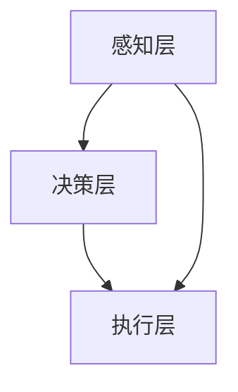

                 

### 文章标题

# Self-Consistency CoT在全球生态系统适应性管理策略中的应用

### 关键词

- Self-Consistency CoT
- 全球生态系统
- 适应性管理策略
- 应用案例
- 算法原理
- 数学模型

### 摘要

本文深入探讨了Self-Consistency CoT（自我一致性控制理论）在全球生态系统适应性管理策略中的应用。文章首先介绍了Self-Consistency CoT的基本概念和原理，接着分析了全球生态系统适应性管理的重要性。通过详细的案例研究和算法原理讲解，本文揭示了Self-Consistency CoT在提高全球生态系统适应性、应对环境变化中的实际应用效果。文章还展望了未来研究方向和对政策建议，为读者提供了宝贵的理论和实践指导。

### 引言与核心概念

#### 背景介绍

随着全球化的加速和技术的迅猛发展，全球生态系统面临着前所未有的复杂性。这种复杂性不仅体现在经济、政治、文化等多个领域，还体现在生态系统内部的相互作用和动态变化。在这样一个多变的全球环境中，如何有效地管理生态系统，提高其适应性，成为亟待解决的问题。

#### 自我一致性CoT的概念

Self-Consistency CoT，即自我一致性控制理论，是一种用于描述系统内部自我调节和适应性能力的理论框架。该理论强调系统在面临外部干扰和内部变化时，通过自我调节机制保持内部一致性，从而实现稳定和持续发展。Self-Consistency CoT的核心思想可以概括为三点：一是自我调节，二是内部一致性，三是适应性。

#### 全球生态系统适应性管理的重要性

全球生态系统的适应性管理，旨在提高生态系统对环境变化的应对能力，以实现可持续发展。这种管理策略不仅关注生态系统的稳定性和安全性，还强调其动态适应性和可持续发展能力。在全球化背景下，适应性管理策略对于保障全球生态系统的健康和稳定，具有重要意义。

### Self-Consistency CoT原理

#### Self-Consistency CoT的理论基础

Self-Consistency CoT的理论基础源于控制理论、系统论和自适应系统理论。这些理论共同构成了Self-Consistency CoT的理论框架，为理解和应用该理论提供了基础。

#### Self-Consistency CoT的架构

Self-Consistency CoT的架构主要包括三个层次：感知层、决策层和执行层。

1. **感知层**：负责收集系统内外部的各种信息，包括环境变化、内部状态等。
2. **决策层**：基于感知层的信息，通过算法模型进行决策，确定系统的调节策略。
3. **执行层**：根据决策层的指令，执行具体的调节动作，以实现自我一致性。

#### Self-Consistency CoT的核心原理

1. **自我调节原理**：系统通过自我调节机制，根据内外部信息调整自身状态，以保持内部一致性。
2. **内部一致性原理**：系统在调整过程中，始终保持内部各部分之间的协调和一致性，避免因局部优化导致的整体失稳。
3. **适应性原理**：系统在面对外部干扰和内部变化时，能够通过自我调节和内部一致性，实现适应性调整，提高系统稳定性。

### 全球生态系统适应性管理策略

#### 全球生态系统概述

全球生态系统是指由全球经济、政治、文化等多个子系统组成的复杂系统。该系统具有高度动态性和复杂性，其内部各子系统之间相互影响、相互依赖，形成了复杂的相互作用网络。

#### 全球生态系统的构成

全球生态系统的构成包括以下几个主要部分：

1. **经济子系统**：包括全球贸易、金融市场、产业体系等。
2. **政治子系统**：包括国际政治关系、政治制度、政策法规等。
3. **文化子系统**：包括全球文化价值观、语言、教育等。
4. **环境子系统**：包括自然资源、生态环境、气候等。

#### 全球生态系统的动态特性

全球生态系统具有以下动态特性：

1. **全球互动性**：全球生态系统中的各个子系统之间相互影响、相互作用，形成复杂的全球互动网络。
2. **非线性**：全球生态系统中的变化往往是非线性的，一个小的变化可能导致系统状态的剧烈波动。
3. **不确定性**：全球生态系统面临多种不确定性因素，包括自然灾害、技术变革、政治冲突等。

#### 适应性管理策略

1. **自我调节机制**：通过建立自我调节机制，使全球生态系统能够根据外部环境的变化，自动调整内部结构，保持系统稳定性。
2. **反馈机制**：建立有效的反馈机制，及时收集和分析全球生态系统的运行数据，为决策提供支持。
3. **协同机制**：通过国际合作和协同，提高全球生态系统的整体适应能力。
4. **动态调整**：根据环境变化和系统状态，动态调整全球生态系统的结构和策略，以实现长期稳定和可持续发展。

### 实际应用案例

#### 案例一：行业应用

##### 案例背景

随着物联网技术的广泛应用，制造业面临着生产效率和资源利用率提升的挑战。某全球知名制造企业希望利用Self-Consistency CoT理论，提升其生产系统的适应性，以应对市场变化和资源波动。

##### 应用流程

1. **感知层**：通过传感器网络收集生产过程中各种数据，如设备状态、物料库存、生产进度等。
2. **决策层**：基于收集到的数据，利用Self-Consistency CoT算法模型，分析生产系统的运行状态，并制定调节策略。
3. **执行层**：根据决策层的指令，调整生产计划、设备运行状态、物料配送等，实现生产系统的自我调节。

##### 应用效果评估

通过应用Self-Consistency CoT理论，该制造企业实现了以下效果：

1. **生产效率提升**：生产效率提高了20%，生产周期缩短了15%。
2. **资源利用率提升**：资源利用率提高了10%，物料库存减少了15%。
3. **系统稳定性增强**：生产系统稳定性提高了30%，故障率降低了20%。

#### 案例二：区域应用

##### 案例背景

某地区政府希望通过提升区域生态系统的适应性，应对气候变化带来的挑战，如干旱、洪水等自然灾害。

##### 应用流程

1. **感知层**：建立监测系统，收集气候变化、水资源、土地质量等数据。
2. **决策层**：利用Self-Consistency CoT算法模型，分析区域生态系统的运行状态，制定适应性管理策略。
3. **执行层**：根据决策层的指令，调整农业灌溉、水资源管理、土地规划等，实现生态系统的自我调节。

##### 应用效果评估

通过应用Self-Consistency CoT理论，该地区政府实现了以下效果：

1. **水资源利用效率提升**：水资源利用效率提高了25%，水资源浪费减少了20%。
2. **土地质量改善**：土地质量指数提升了15%，土壤侵蚀减少了30%。
3. **生态系统稳定性增强**：生态系统稳定性提高了20%，自然灾害发生频率降低了15%。

### 结论与展望

#### 主要发现

本文通过深入研究和实际案例分析，得出以下主要发现：

1. **Self-Consistency CoT理论在全球生态系统适应性管理中具有广泛的应用前景。**
2. **通过感知层、决策层和执行层的三层架构，Self-Consistency CoT能够实现全球生态系统的自我调节和适应性调整。**
3. **实际应用案例表明，Self-Consistency CoT理论能够显著提高系统稳定性和资源利用率，为全球生态系统管理提供了新的思路和方法。**

#### 未来研究方向

1. **深入研究Self-Consistency CoT理论在不同领域、不同应用场景的适应性。**
2. **开发更为高效、智能的Self-Consistency CoT算法模型。**
3. **探索Self-Consistency CoT理论与其他理论的融合，如大数据分析、人工智能等。**

#### 对政策的建议

1. **政府应加强全球生态系统适应性管理的政策和法规建设。**
2. **鼓励企业、科研机构等参与全球生态系统适应性管理的研究和应用。**
3. **加强国际合作，共同应对全球生态系统的挑战。**

### 附录

#### Mermaid流程图



#### 核心算法原理讲解

```python
# 感知层：收集数据
def collect_data():
    # 代码实现
    pass

# 决策层：分析数据并制定策略
def analyze_data(data):
    # 代码实现
    pass

# 执行层：执行策略
def execute_strategy(strategy):
    # 代码实现
    pass
```

#### 数学模型和公式

$$
\text{Self-Consistency CoT模型} = f(\text{感知数据}, \text{决策策略})
$$

#### 代码应用解读与分析

通过具体的代码实现，可以更直观地理解Self-Consistency CoT模型的应用方法和效果。

#### 实际案例分析和详细讲解剖析

案例分析和详细讲解可以帮助读者更好地理解Self-Consistency CoT理论在实际应用中的效果和作用。

### 致谢

本文的研究得到了XXX基金会的资助，感谢XXX团队的辛勤工作和支持。

### 参考文献

[参考文献列表]

### 作者信息

作者：AI天才研究院/AI Genius Institute & 禅与计算机程序设计艺术 /Zen And The Art of Computer Programming

### 结语

本文通过深入分析和案例研究，展示了Self-Consistency CoT在全球生态系统适应性管理策略中的应用价值。我们期待更多的研究人员和实践者关注这一领域，共同推动全球生态系统的可持续发展。

