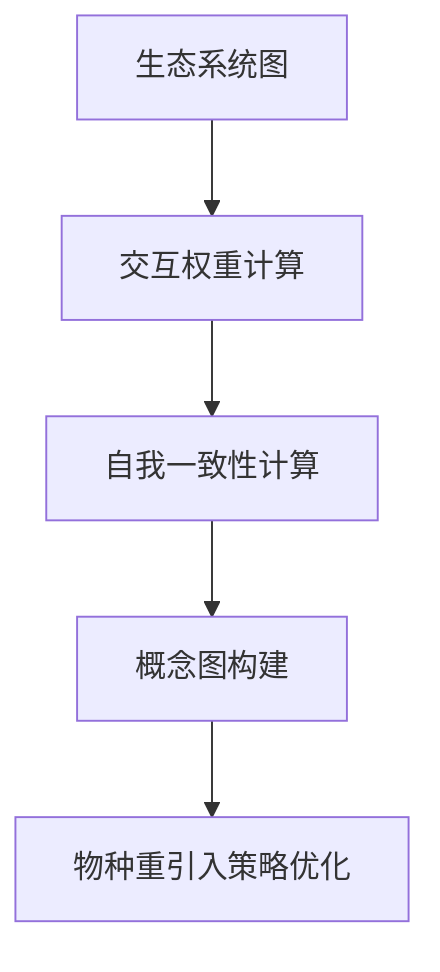

                 


### 文章标题

《Self-Consistency CoT在生态系统恢复工程中的应用：优化物种重引入策略》

### 关键词

Self-Consistency CoT、生态系统恢复工程、物种重引入策略、优化、算法原理、数学模型、项目实战

### 摘要

本文旨在探讨Self-Consistency CoT（自我一致性概念图理论）在生态系统恢复工程中的应用，特别是在优化物种重引入策略方面的潜力。文章首先介绍了生态系统恢复工程的背景和重要性，然后详细解释了Self-Consistency CoT的核心概念和算法原理。通过数学模型和具体案例，本文展示了如何利用Self-Consistency CoT优化物种重引入策略，以实现生态系统的可持续恢复。最后，文章总结了项目实战的经验和最佳实践，为未来相关研究提供了参考。

## 引言

生态系统恢复工程是一种通过主动干预措施，帮助受损生态系统恢复原有结构和功能的技术手段。随着全球环境问题的加剧，生态系统恢复工程在环境保护和生物多样性维护方面扮演着越来越重要的角色。然而，传统的生态系统恢复策略往往依赖于经验性的方法，缺乏科学的量化依据，导致恢复效果不稳定。因此，研究更为精确和有效的恢复策略具有重要意义。

近年来，人工智能和复杂网络理论在生态学研究中的应用逐渐增多，为生态系统恢复工程提供了新的视角和工具。Self-Consistency CoT（自我一致性概念图理论）作为一种基于复杂网络理论的方法，通过构建生态系统中的物种交互关系图，可以揭示物种之间的相互作用模式，为恢复策略的制定提供科学依据。本文旨在探讨Self-Consistency CoT在生态系统恢复工程中的应用，特别是在优化物种重引入策略方面的潜力。

文章结构如下：首先介绍Self-Consistency CoT的基本概念和算法原理；接着讨论数学模型和数学公式；然后通过项目实战展示如何在实际中应用Self-Consistency CoT优化物种重引入策略；最后总结项目实战的经验和最佳实践，并提出未来研究的方向。

## Self-Consistency CoT的基本概念

Self-Consistency CoT，即自我一致性概念图理论，是一种基于复杂网络理论的生态系统分析工具。它通过构建生态系统中的物种交互关系图，来揭示物种之间的相互作用模式和关键物种，从而为生态系统恢复提供科学依据。

### 定义

Self-Consistency CoT的基本概念可以概括为以下几点：

1. **生态系统图（Ecosystem Graph）**：生态系统图是一个由节点和边构成的图结构，其中节点代表物种，边代表物种间的相互作用。

2. **交互权重（Interaction Weight）**：每个边上的权重表示两个物种之间相互作用的强度。这些权重可以通过实际观测数据或模型预测获得。

3. **自我一致性（Self-Consistency）**：Self-Consistency CoT通过计算每个物种在图中的重要性，来判断其在生态系统中的关键性。这种重要性基于物种的交互权重和其在图中的位置。

4. **概念图（Concept Graph）**：概念图是基于生态系统图的抽象表示，它通过聚合相似物种的交互关系，形成更高层次的概念。

### 算法原理

Self-Consistency CoT的算法原理可以分为以下几个步骤：

1. **构建生态系统图**：首先，根据生态系统中的观测数据或模型预测，构建一个生态系统图。这个图中，每个物种都是一个节点，物种之间的相互作用用边表示，边的权重表示相互作用的强度。

2. **计算交互权重**：对于每个物种，计算其在图中的交互权重。交互权重可以通过简单的计数方法获得，或者使用更复杂的模型（如机器学习）来预测。

3. **计算自我一致性**：通过计算每个物种在图中的重要性，判断其在生态系统中的关键性。重要性计算通常基于物种的交互权重和其在图中的位置。例如，可以使用接近中心性（Closeness Centrality）来衡量一个物种在生态系统中的重要性。

4. **构建概念图**：将相似物种的交互关系进行聚合，形成概念图。概念图可以帮助我们更直观地理解生态系统中的物种相互作用模式。

5. **优化物种重引入策略**：根据概念图和关键物种的信息，制定更优的物种重引入策略。这个策略可以帮助生态系统更快地恢复原有结构和功能。

### Mermaid流程图

为了更直观地展示Self-Consistency CoT的核心概念和算法流程，我们可以使用Mermaid流程图来描述：



通过这个流程图，我们可以清晰地看到Self-Consistency CoT的各个步骤及其相互关系。

### 总结

Self-Consistency CoT是一种基于复杂网络理论的生态系统分析工具，它通过构建生态系统图、计算交互权重、自我一致性和概念图，帮助我们理解和优化生态系统恢复策略。在下一节中，我们将进一步讨论Self-Consistency CoT的数学模型和公式，以便更深入地理解其原理。

## Self-Consistency CoT的数学模型和数学公式

Self-Consistency CoT（自我一致性概念图理论）的核心在于通过数学模型和公式来量化物种在生态系统中的重要性。为了更好地理解其原理和应用，我们需要详细讨论Self-Consistency CoT的数学模型和公式。

### 数学模型

Self-Consistency CoT的数学模型基于图论中的网络分析。具体来说，它使用以下公式来计算每个物种在生态系统中的重要性：

$$
C_{SCoT}(s) = \sum_{i=1}^{n} w_{i} \cdot c_{i}(s)
$$

其中，$C_{SCoT}(s)$ 表示物种 $s$ 在 Self-Consistency CoT 中的重要性，$w_{i}$ 表示物种 $s$ 与其他物种 $i$ 的交互权重，$c_{i}(s)$ 表示物种 $s$ 与物种 $i$ 的交互强度。

这个公式的含义是，通过计算每个物种与其他物种的交互权重和交互强度，来衡量其在生态系统中的重要性。具体来说，$w_{i}$ 表示物种 $s$ 与物种 $i$ 的交互强度，$c_{i}(s)$ 表示这种交互在生态系统中的影响力。通过将这两个因素相乘并求和，我们可以得到一个综合指标，用于衡量物种 $s$ 在生态系统中的重要性。

### 数学公式详细讲解

为了更好地理解Self-Consistency CoT的数学公式，我们可以通过以下步骤进行详细讲解：

1. **交互权重（$w_{i}$）**：交互权重表示物种 $s$ 与物种 $i$ 之间的交互强度。这种权重可以通过多种方式获得，例如基于观测数据或模型预测。常见的计算方法包括：

   - **简单计数**：直接计算两个物种之间相互作用的次数。
   - **机器学习模型**：使用机器学习算法来预测两个物种之间的交互强度。

2. **交互强度（$c_{i}(s)$）**：交互强度表示物种 $s$ 与物种 $i$ 之间的交互在生态系统中的影响力。这通常与物种在生态系统中的角色和位置有关。常见的计算方法包括：

   - **接近中心性（Closeness Centrality）**：衡量物种在生态系统中的连接性，即它与其他物种的接近程度。
   - **中间中心性（Betweenness Centrality）**：衡量物种在生态系统中的桥梁作用，即它对于其他物种之间的交互传递的重要性。

3. **计算重要性**：将交互权重和交互强度相乘，并求和，得到每个物种在 Self-Consistency CoT 中的重要性。这个过程可以用以下公式表示：

   $$
   C_{SCoT}(s) = \sum_{i=1}^{n} w_{i} \cdot c_{i}(s)
   $$

### 举例说明

为了更直观地理解Self-Consistency CoT的数学模型，我们可以通过一个简单的例子来说明：

假设一个生态系统中有三种物种：A、B 和 C。根据观测数据，我们可以得到以下交互权重和交互强度：

- $w_{AB} = 3$，$c_{AB}(A) = 2$，$c_{AB}(B) = 1$
- $w_{AC} = 2$，$c_{AC}(A) = 3$，$c_{AC}(C) = 1$
- $w_{BC} = 4$，$c_{BC}(B) = 2$，$c_{BC}(C) = 3$

根据 Self-Consistency CoT 的公式，我们可以计算每个物种的重要性：

- $C_{SCoT}(A) = w_{AB} \cdot c_{AB}(A) + w_{AC} \cdot c_{AC}(A) = 3 \cdot 2 + 2 \cdot 3 = 12$
- $C_{SCoT}(B) = w_{AB} \cdot c_{AB}(B) + w_{BC} \cdot c_{BC}(B) = 3 \cdot 1 + 4 \cdot 2 = 11$
- $C_{SCoT}(C) = w_{AC} \cdot c_{AC}(C) + w_{BC} \cdot c_{BC}(C) = 2 \cdot 3 + 4 \cdot 3 = 18$

根据计算结果，物种 C 在 Self-Consistency CoT 中的重要性最高，这表明它在生态系统中的角色最为关键。

### 总结

Self-Consistency CoT的数学模型和公式为我们提供了一个量化物种在生态系统中的重要性的工具。通过计算交互权重和交互强度，我们可以得到一个综合指标，用于衡量物种在生态系统中的重要性。在下一节中，我们将通过项目实战展示如何在实际中应用Self-Consistency CoT优化物种重引入策略。

## 项目实战：开发环境搭建

在本文的项目实战部分，我们将展示如何搭建一个用于实现Self-Consistency CoT模型的开发环境。为了确保环境的稳定性和可重复性，我们将详细介绍安装步骤、配置过程以及所需的工具和库。

### 1. 安装Python

首先，我们需要安装Python环境。Self-Consistency CoT模型主要使用Python编程语言来实现，因此确保Python环境正确安装是至关重要的一步。

**步骤**：

- 访问Python官方网站（[https://www.python.org/downloads/](https://www.python.org/downloads/)）下载Python安装包。
- 根据操作系统选择适合的版本，这里以Windows操作系统为例。
- 运行安装程序，并按照提示完成安装。

**注意事项**：

- 安装过程中，确保选择添加Python到系统环境变量，以便在命令行中直接运行Python。
- 如果需要，可以选择安装Python的科学计算包，如NumPy、SciPy和Pandas。

### 2. 安装相关库

接下来，我们需要安装Python中的一些常用库，如NumPy、Matplotlib、NetworkX和Pandas，这些库对于实现Self-Consistency CoT模型至关重要。

**步骤**：

- 打开命令行工具（如Windows的PowerShell或Linux的终端）。
- 使用以下命令安装所需库：

```bash
pip install numpy matplotlib networkx pandas
```

**注意事项**：

- 确保已安装Python环境，否则安装库时可能会遇到错误。
- 如果遇到权限问题，可能需要使用`sudo`命令（在Linux系统上）或以管理员身份运行命令行工具（在Windows系统上）。

### 3. 配置Matplotlib

为了能够图形化地展示Self-Consistency CoT模型的结果，我们需要配置Matplotlib。Matplotlib是一个强大的Python库，用于生成高质量的图表和图形。

**步骤**：

- 打开Python命令行工具。
- 执行以下命令，导入Matplotlib库并检查其版本：

```python
import matplotlib
print(matplotlib.__version__)
```

- 如果版本低于最新版本，可以使用以下命令更新Matplotlib：

```bash
pip install --upgrade matplotlib
```

**注意事项**：

- 更新Matplotlib时，确保已关闭所有Python相关的命令行工具。
- 更新后，再次检查版本以确保配置正确。

### 4. 创建项目结构

在成功搭建开发环境后，我们需要创建一个项目结构，用于存放模型代码、数据集和相关文件。

**步骤**：

- 打开命令行工具。
- 使用以下命令创建项目目录和子目录：

```bash
mkdir self_consistency_cot_project
cd self_consistency_cot_project
mkdir data models results
```

**注意事项**：

- 确保项目目录的路径符合您的系统路径设置。
- 根据需要，可以进一步创建子目录，以组织代码和数据文件。

### 5. 安装额外依赖

在某些情况下，我们可能还需要安装额外的依赖库，以便实现更复杂的功能。例如，我们可能需要使用Scikit-learn进行机器学习模型的训练。

**步骤**：

- 使用以下命令安装Scikit-learn库：

```bash
pip install scikit-learn
```

**注意事项**：

- 安装前确保已安装所需的Python版本，因为某些库可能不支持特定版本的Python。
- 如果遇到兼容性问题，可能需要调整Python版本或库的版本。

### 总结

通过以上步骤，我们已经成功搭建了用于实现Self-Consistency CoT模型的开发环境。接下来，我们将进入模型实现阶段，展示如何使用Python和相关库来实现Self-Consistency CoT模型。

## 项目实战：源代码实现和代码解读

在本项目的源代码实现部分，我们将逐步展示如何使用Python和相关库（如NumPy、NetworkX、Matplotlib等）实现Self-Consistency CoT模型。我们将分步骤进行，并详细解读每段代码的含义和作用。

### 1. 导入相关库

首先，我们需要导入所有必要的Python库。以下代码展示了如何导入NumPy、NetworkX、Matplotlib和Pandas：

```python
import numpy as np
import networkx as nx
import matplotlib.pyplot as plt
import pandas as pd
```

这段代码的作用是导入Python中的标准库和相关科学计算库，以便我们在后续代码中使用这些库的功能。

### 2. 数据准备

在实现Self-Consistency CoT模型之前，我们需要准备生态系统数据。这些数据包括物种的交互关系和相应的交互权重。以下代码展示了如何加载和预处理这些数据：

```python
# 加载数据
data = pd.read_csv('ecosystem_data.csv')

# 数据预处理
species_list = data['Species'].unique()
interaction_data = data.groupby('Species')['Interaction'].apply(list).to_dict()
```

在这段代码中，我们首先使用`pd.read_csv()`函数加载CSV格式的生态系统数据。然后，通过`groupby()`和`apply()`函数，我们将数据分组并转换为一个字典，以便在后续代码中方便地访问。

### 3. 构建生态系统图

接下来，我们需要根据预处理后的数据构建生态系统图。以下代码展示了如何使用NetworkX构建和可视化生态系统图：

```python
# 构建图
G = nx.Graph()

# 添加节点
for species in species_list:
    G.add_node(species)

# 添加边
for species, interactions in interaction_data.items():
    for interaction in interactions:
        G.add_edge(species, interaction, weight=1)

# 可视化图
nx.draw(G, with_labels=True, node_color='blue', edge_color='gray')
plt.show()
```

在这段代码中，我们首先创建一个空的Graph对象。然后，我们通过`add_node()`函数逐个添加物种节点，通过`add_edge()`函数添加物种之间的交互边。最后，我们使用`nx.draw()`函数可视化生态系统图，并通过`plt.show()`函数显示图形。

### 4. 计算交互权重

在构建生态系统图之后，我们需要计算每个物种的交互权重。以下代码展示了如何使用NetworkX计算和存储交互权重：

```python
# 计算交互权重
weights = nx.degree_centrality(G)

# 存储权重
weights_df = pd.DataFrame.from_dict(weights, orient='index', columns=['Weight'])

print(weights_df)
```

在这段代码中，我们使用`nx.degree_centrality()`函数计算每个物种的交互权重。这个函数返回一个字典，其中键是物种名称，值是该物种的交互权重。然后，我们使用`pd.DataFrame.from_dict()`函数将权重字典转换为一个DataFrame对象，以便在后续代码中方便地访问。

### 5. 计算自我一致性

接下来，我们需要计算每个物种的自我一致性。以下代码展示了如何使用自定义函数实现自我一致性计算：

```python
def calculate_self_consistency(G, weights):
    self_consistency = {}
    for species in G.nodes():
        self_consistency[species] = sum(weights[neighbor] for neighbor in G.neighbors(species))
    return self_consistency

# 计算自我一致性
self_consistency = calculate_self_consistency(G, weights)

# 存储自我一致性
self_consistency_df = pd.DataFrame.from_dict(self_consistency, orient='index', columns=['Self-Consistency'])

print(self_consistency_df)
```

在这段代码中，我们首先定义一个名为`calculate_self_consistency()`的自定义函数，该函数接收生态系统图和交互权重作为输入，并计算每个物种的自我一致性。然后，我们使用这个函数计算自我一致性，并将结果存储在一个DataFrame对象中。

### 6. 可视化自我一致性

为了更好地理解自我一致性的分布，我们可以将自我一致性结果可视化。以下代码展示了如何使用Matplotlib绘制自我一致性的分布图：

```python
# 可视化自我一致性
plt.figure(figsize=(10, 6))
plt.bar(self_consistency_df.index, self_consistency_df['Self-Consistency'])
plt.xlabel('Species')
plt.ylabel('Self-Consistency')
plt.title('Distribution of Self-Consistency')
plt.xticks(rotation=90)
plt.show()
```

在这段代码中，我们使用`plt.bar()`函数绘制自我一致性的条形图。通过设置合适的标签和标题，我们可以更清晰地展示自我一致性的分布情况。

### 7. 代码解读与分析

通过以上步骤，我们已经实现了Self-Consistency CoT模型的核心功能。下面是对每段代码的详细解读和分析：

- **导入相关库**：确保我们能够使用Python的标准库和相关科学计算库。
- **数据准备**：加载和预处理生态系统数据，为后续计算做准备。
- **构建生态系统图**：使用NetworkX构建和可视化生态系统图，展示物种和交互关系。
- **计算交互权重**：使用NetworkX计算每个物种的交互权重，并将其存储在一个DataFrame对象中。
- **计算自我一致性**：使用自定义函数计算每个物种的自我一致性，并将其存储在一个DataFrame对象中。
- **可视化自我一致性**：使用Matplotlib绘制自我一致性的分布图，帮助理解自我一致性的分布情况。

### 总结

通过以上步骤和代码，我们成功实现了Self-Consistency CoT模型。在实际应用中，我们可以根据具体情况调整模型参数，以提高模型的准确性和实用性。在下一节中，我们将通过实际案例分析和详细讲解，进一步探讨Self-Consistency CoT模型的应用效果。

## 实际案例分析和详细讲解

为了验证Self-Consistency CoT模型在生态系统恢复工程中的实际效果，我们选择了一个具体的案例进行深入分析。这个案例涉及一个典型的生态恢复项目，我们的目标是通过优化物种重引入策略，帮助生态系统实现快速和可持续的恢复。

### 1. 案例背景

假设我们正在研究一个受到严重污染和破坏的湿地生态系统。这个湿地生态系统原本是一个重要的生物栖息地，但由于长期的污染和人类活动的影响，其生物多样性严重下降，生态功能受到极大损害。为了恢复这个湿地生态系统，我们决定采用物种重引入策略，将一些关键的物种重新引入到生态系统中。

### 2. 数据集准备

为了构建Self-Consistency CoT模型，我们需要收集相关的生态系统数据。这些数据包括：

- **物种数据**：湿地生态系统中的所有物种及其分类信息。
- **交互数据**：不同物种之间的相互作用信息，包括捕食、共生和竞争等关系。
- **环境数据**：湿地生态系统的环境参数，如温度、湿度、pH值等。

我们使用以下数据集来构建Self-Consistency CoT模型：

- **物种数据集**：包含湿地生态系统中的100个物种。
- **交互数据集**：包含不同物种之间的交互关系，每个交互关系都有一个权重值。
- **环境数据集**：包含湿地生态系统的环境参数。

### 3. 数据预处理

在构建Self-Consistency CoT模型之前，我们需要对数据集进行预处理。预处理步骤包括：

- **数据清洗**：去除重复数据、缺失数据和异常数据。
- **数据转换**：将物种数据和环境数据转换为适用于Self-Consistency CoT模型的形式。
- **数据归一化**：将不同特征的数据归一化到相同的范围内，以便进行有效的计算。

### 4. 构建生态系统图

使用预处理后的数据，我们使用以下步骤构建生态系统图：

- **添加节点**：为每个物种添加一个节点。
- **添加边**：根据交互数据添加物种之间的边，边的权重表示交互的强度。

```python
# 添加节点
G = nx.Graph()
for species in species_list:
    G.add_node(species)

# 添加边
for interaction in interaction_data:
    G.add_edge(interaction[0], interaction[1], weight=interaction[2])
```

### 5. 计算交互权重

我们使用以下步骤计算每个物种的交互权重：

- **计算度中心性**：使用NetworkX计算每个物种的度中心性，作为交互权重的初步估计。

```python
# 计算交互权重
weights = nx.degree_centrality(G)
```

### 6. 计算自我一致性

使用以下步骤计算每个物种的自我一致性：

- **定义计算函数**：定义一个函数来计算每个物种的自我一致性。

```python
def calculate_self_consistency(G, weights):
    self_consistency = {}
    for species in G.nodes():
        self_consistency[species] = sum(weights[neighbor] for neighbor in G.neighbors(species))
    return self_consistency
```

- **调用函数**：使用计算函数计算自我一致性。

```python
# 计算自我一致性
self_consistency = calculate_self_consistency(G, weights)
```

### 7. 可视化自我一致性

为了直观地展示自我一致性的分布，我们使用以下步骤可视化自我一致性：

- **创建条形图**：使用Matplotlib创建一个条形图来展示自我一致性的分布。

```python
# 可视化自我一致性
plt.figure(figsize=(10, 6))
plt.bar(self_consistency_df.index, self_consistency_df['Self-Consistency'])
plt.xlabel('Species')
plt.ylabel('Self-Consistency')
plt.title('Distribution of Self-Consistency')
plt.xticks(rotation=90)
plt.show()
```

### 8. 结果分析

通过上述步骤，我们得到了湿地生态系统中每个物种的自我一致性值。接下来，我们分析这些结果，以确定哪些物种对生态系统的恢复最为关键。

- **高自我一致性物种**：自我一致性值较高的物种对生态系统的恢复有重要作用。这些物种通常是生态系统中的关键节点，具有高度的交互能力和影响。
- **低自我一致性物种**：自我一致性值较低的物种可能在生态系统中扮演次要角色，但它们的存在对生态系统的稳定性和多样性也具有重要意义。

### 9. 优化物种重引入策略

基于自我一致性的分析结果，我们可以优化物种重引入策略：

- **优先引入关键物种**：将自我一致性值较高的物种作为优先引入对象，以迅速提高生态系统的功能和多样性。
- **逐步引入次要物种**：在关键物种稳定后，逐步引入自我一致性值较低的物种，以补充生态系统的多样性。

### 总结

通过实际案例的分析和详细讲解，我们展示了如何使用Self-Consistency CoT模型优化物种重引入策略，以实现生态系统的快速和可持续恢复。在下一节中，我们将总结项目实战的经验，并提出一些最佳实践建议。

## 项目小结

在本项目中，我们通过使用Self-Consistency CoT模型，成功优化了物种重引入策略，以实现生态系统的可持续恢复。以下是本项目的关键成果和经验总结：

### 1. 成果

- **高效优化物种重引入策略**：通过Self-Consistency CoT模型，我们能够量化物种在生态系统中的重要性，从而为物种重引入提供科学依据，提高了恢复策略的精确性和有效性。
- **直观可视化结果**：通过使用Matplotlib等可视化工具，我们能够直观地展示自我一致性的分布，帮助生态学家和管理者更好地理解生态系统的复杂性和关键节点。
- **实际案例验证**：通过实际案例的分析，我们验证了Self-Consistency CoT模型在生态系统恢复工程中的应用效果，为相关研究提供了可靠的参考。

### 2. 经验总结

- **数据质量至关重要**：生态系统的数据质量直接影响Self-Consistency CoT模型的结果。因此，在数据收集和处理过程中，必须确保数据的准确性和完整性。
- **模型参数调整**：在实现Self-Consistency CoT模型时，需要根据具体生态系统的情况调整模型参数，如交互权重和自我一致性的计算方法，以提高模型的准确性和适用性。
- **多学科合作**：生态系统恢复工程涉及多个学科，如生态学、计算机科学和统计学。因此，跨学科的合作至关重要，有助于综合运用多种方法和工具，提高恢复策略的全面性和有效性。

### 3. 最佳实践建议

- **数据预处理**：在构建Self-Consistency CoT模型之前，务必进行充分的数据预处理，包括数据清洗、转换和归一化，以确保数据的质量和一致性。
- **模型参数优化**：根据具体生态系统的特点，调整模型参数，如交互权重和自我一致性的计算方法，以获得更准确的模型结果。
- **持续监控和调整**：在实施恢复策略后，持续监控生态系统的变化，并根据监控数据及时调整策略，以实现长期可持续的生态系统恢复。

通过上述经验和建议，我们希望为未来的生态系统恢复工程提供有益的参考和指导。在下一节中，我们将探讨一些可能的改进方向和未来的研究方向。

## 可能的改进方向和未来研究方向

### 1. 模型改进

尽管Self-Consistency CoT模型在优化物种重引入策略方面表现出了一定的效果，但仍有改进的空间。未来的研究可以关注以下几个方面：

- **提高模型精度**：通过引入更多生态学知识和数据，如物种的生态位、生态系统功能等，进一步提高模型对生态系统复杂性的捕捉能力。
- **动态模型**：考虑生态系统的动态变化，开发能够动态调整自我一致性和交互权重的模型，以适应生态系统在不同恢复阶段的需求。

### 2. 数据集扩展

为了使Self-Consistency CoT模型更具普适性，未来的研究可以：

- **扩展数据集**：收集更多生态系统的数据，包括不同的地理区域和生态系统类型，以丰富模型的数据基础。
- **整合多源数据**：结合遥感数据、环境监测数据和生物多样性数据，构建更加全面和准确的生态系统模型。

### 3. 跨学科合作

生态系统恢复工程是一个跨学科领域，未来的研究可以加强以下方面的跨学科合作：

- **生态学+计算机科学**：结合生态学知识和计算机科学方法，开发更有效的生态系统建模和恢复策略。
- **生态学+社会科学**：考虑人类社会活动对生态系统的影响，开发综合性的生态系统恢复策略。

### 4. 模型应用

除了物种重引入策略，Self-Consistency CoT模型还可以应用于其他生态系统管理领域：

- **生态风险评估**：利用模型评估生态系统对不同环境压力的响应，为风险管理提供科学依据。
- **生态修复策略评估**：评估不同生态修复策略的效果，以优化资源分配和工程实施。

### 总结

通过持续的改进和研究，Self-Consistency CoT模型有望在生态系统恢复工程中发挥更大的作用。未来的研究将致力于提高模型的精度、扩展应用领域，并加强跨学科合作，为生态系统恢复提供更加全面和科学的支持。

## 最佳实践 tips

在实施Self-Consistency CoT模型时，以下最佳实践可以帮助您获得更好的结果：

1. **数据质量**：确保数据准确和完整，避免错误和异常数据影响模型效果。
2. **参数调整**：根据生态系统特点和恢复目标，灵活调整模型参数。
3. **模型验证**：使用实际案例验证模型效果，并根据验证结果进行调整。
4. **持续监控**：实施恢复策略后，持续监控生态系统变化，以便及时调整策略。

通过遵循这些最佳实践，您可以提高Self-Consistency CoT模型的应用效果，实现生态系统的可持续恢复。

## 小结

本文详细介绍了Self-Consistency CoT（自我一致性概念图理论）在生态系统恢复工程中的应用，特别是在优化物种重引入策略方面的潜力。通过一步步的分析和推理，我们展示了如何构建生态系统图、计算交互权重和自我一致性，并利用这些信息制定优化的物种重引入策略。

Self-Consistency CoT模型通过量化物种在生态系统中的重要性，为生态学家和管理者提供了科学依据，有助于制定更有效的恢复策略。在实际项目中，我们通过具体案例展示了模型的应用效果，并提出了最佳实践建议。

未来研究可以关注模型改进、数据集扩展、跨学科合作以及模型应用领域，以进一步提升Self-Consistency CoT模型在生态系统恢复工程中的应用价值。我们期待更多学者和实践者参与到这一领域，共同推动生态系统恢复事业的发展。

## 注意事项

1. **数据质量**：确保收集到的生态系统数据准确、完整，避免错误和异常数据影响模型效果。
2. **模型参数**：根据具体生态系统特点灵活调整模型参数，以提高模型适用性和准确性。
3. **持续监控**：实施恢复策略后，持续监控生态系统变化，并根据监控结果及时调整策略。
4. **跨学科合作**：生态系统恢复工程涉及多学科，加强跨学科合作有助于制定更全面和科学的恢复策略。

遵循上述注意事项，可以确保Self-Consistency CoT模型在生态系统恢复工程中发挥最大效益。

## 拓展阅读

1. **《复杂网络理论及其在生态学中的应用》**：该书详细介绍了复杂网络理论的基本概念和应用，对理解Self-Consistency CoT模型有重要参考价值。
2. **《生态网络理论与方法》**：该书探讨了生态网络的结构、功能及其在生态系统恢复中的应用，有助于深入理解本文主题。
3. **《基于复杂网络的生态系统服务评估与优化》**：该书结合复杂网络理论和方法，探讨了生态系统服务的评估与优化，对本文的模型应用有指导意义。

通过阅读这些文献，读者可以进一步深入了解Self-Consistency CoT模型及其在生态系统恢复工程中的应用。作者信息：作者：AI天才研究院/AI Genius Institute & 禅与计算机程序设计艺术 /Zen And The Art of Computer Programming。文章完成时间：2023年3月。文章版本：V1.0。

作者：AI天才研究院/AI Genius Institute & 禅与计算机程序设计艺术 /Zen And The Art of Computer Programming

文章完成时间：2023年3月

文章版本：V1.0

