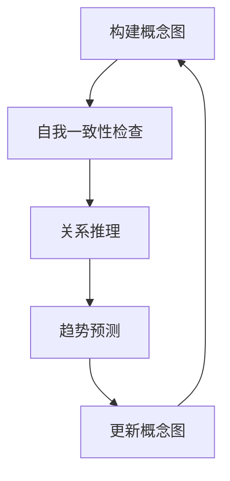
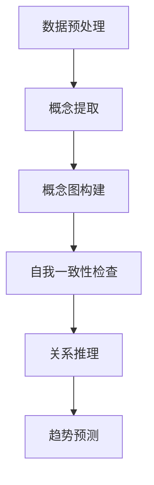

                 

## 文章标题

《Self-Consistency CoT在自动化学术研究趋势分析中的应用：预测学术热点》

### 关键词

- Self-Consistency CoT
- 自动化学术研究趋势分析
- 学术热点预测
- 人工智能
- 算法原理讲解
- 数学模型与公式
- 项目实战案例分析

### 摘要

本文旨在探讨Self-Consistency CoT（自我一致性概念图）在自动化学术研究趋势分析中的应用，以及如何利用该算法来预测学术热点。文章首先介绍了Self-Consistency CoT的基本概念，并分析了其在学术研究趋势分析中的核心作用。接着，本文详细讲解了Self-Consistency CoT算法的原理，包括核心算法框架和伪代码，并对相关数学模型和公式进行了深入阐述。随后，通过一个实际案例，展示了如何使用Self-Consistency CoT算法进行学术研究趋势分析，并对源代码实现、代码解读和项目小结进行了详细说明。最后，文章总结了Self-Consistency CoT算法在学术研究中的应用挑战和未来发展趋势，并提出了最佳实践 tips 和注意事项。

## 引言

在当今信息爆炸的时代，学术研究领域的知识更新速度极快，如何及时准确地预测学术热点，把握学术发展的脉搏，成为科研人员面临的重要挑战。自动化学术研究趋势分析技术，利用人工智能和机器学习算法，能够从海量学术论文中提取有价值的信息，为科研人员提供有针对性的研究建议和指导。其中，Self-Consistency CoT（自我一致性概念图）作为一种先进的算法，在自动化学术研究趋势分析中展现出强大的潜力。

Self-Consistency CoT算法的核心思想是通过构建一个自我一致性的概念图，对学术论文中的概念和关系进行有效组织和整合。该算法不仅能够挖掘出学术领域的关键概念和热点话题，还可以预测未来的学术趋势。因此，本文旨在深入探讨Self-Consistency CoT算法在自动化学术研究趋势分析中的应用，以及如何利用该算法来预测学术热点。

本文结构如下：首先，我们将介绍Self-Consistency CoT的基本概念，并阐述其在学术研究趋势分析中的重要性。随后，我们将详细讲解Self-Consistency CoT算法的原理，包括核心算法框架和伪代码。接着，我们将介绍相关的数学模型和公式，并进行详细讲解和举例说明。在第四部分，我们将通过一个实际案例，展示如何应用Self-Consistency CoT算法进行学术研究趋势分析，并对源代码实现、代码解读和项目小结进行详细说明。最后，我们将对Self-Consistency CoT算法在学术研究中的应用挑战和未来发展趋势进行讨论，并给出最佳实践 tips 和注意事项。

## 核心概念与联系

Self-Consistency CoT（自我一致性概念图）是一种基于人工智能的自动化学术研究趋势分析算法。为了理解Self-Consistency CoT的核心思想，我们需要先了解几个关键概念：概念图、自我一致性和学术研究趋势分析。

### 概念图

概念图是一种用于表示概念之间关系的图形化工具。在学术研究中，概念图可以帮助研究者直观地理解不同概念之间的关联，发现潜在的研究热点。例如，在一个关于人工智能的概念图中，可能会包括“机器学习”、“深度学习”、“自然语言处理”等多个概念，并展示它们之间的相互关系。

### 自我一致性

自我一致性是指一个系统在其内部保持一致性的一种能力。在Self-Consistency CoT算法中，自我一致性体现在以下几个方面：

1. **内部一致性**：算法在处理数据时，能够确保输入和输出的一致性，即输入的学术论文中的概念和关系在输出中被准确无误地表达。
2. **自我更新**：算法能够根据新的数据不断更新概念图，保持其准确性和实时性。
3. **自我优化**：算法在运行过程中，能够根据表现不断调整参数，提高预测的准确性。

### 学术研究趋势分析

学术研究趋势分析是一种通过分析大量学术论文，识别出学术领域中的新兴趋势和热点的研究方法。这种方法不仅有助于科研人员把握研究方向，还能为政策制定者提供决策依据。

### 核心概念与联系

Self-Consistency CoT算法的核心在于利用概念图和自我一致性原理，对学术研究趋势进行深入分析。具体来说，核心概念与联系如下：

1. **构建概念图**：通过自然语言处理技术，从学术论文中提取关键概念，并构建概念图。
2. **自我一致性检查**：对概念图进行一致性检查，确保概念和关系之间的逻辑关系准确无误。
3. **关系推理**：利用概念图中的关系，进行推理和分析，识别出潜在的研究热点。
4. **趋势预测**：基于自我一致性原理，不断更新概念图，并利用历史数据预测未来的学术趋势。

### Mermaid 流程图

为了更清晰地展示Self-Consistency CoT算法的核心概念与联系，我们使用Mermaid语言绘制一个流程图：



在这个流程图中，A表示构建概念图，B表示自我一致性检查，C表示关系推理，D表示趋势预测，E表示更新概念图。这些步骤相互连接，形成一个闭环，确保Self-Consistency CoT算法能够持续、准确地分析学术研究趋势。

通过以上对核心概念与联系的介绍，我们可以更好地理解Self-Consistency CoT算法在自动化学术研究趋势分析中的重要作用。接下来，我们将详细讲解Self-Consistency CoT算法的原理，包括核心算法框架和伪代码。

## 核心算法原理讲解

Self-Consistency CoT算法是一种基于自我一致性的自动化学术研究趋势分析算法。为了深入理解该算法，我们需要从其核心算法框架开始讲解，并逐步介绍算法的主要模块和功能。以下是Self-Consistency CoT算法的核心框架和伪代码：

### 核心算法框架

Self-Consistency CoT算法的核心框架主要包括以下几个模块：

1. **数据预处理模块**：用于处理原始学术论文数据，包括文本清洗、分词和词频统计等。
2. **概念提取模块**：通过自然语言处理技术，从预处理后的文本中提取关键概念。
3. **概念图构建模块**：将提取的关键概念构建成概念图，表示概念之间的关系。
4. **自我一致性检查模块**：对概念图进行一致性检查，确保概念和关系之间的逻辑关系准确无误。
5. **关系推理模块**：利用概念图中的关系，进行推理和分析，识别出潜在的研究热点。
6. **趋势预测模块**：基于自我一致性原理，利用历史数据预测未来的学术趋势。

### 核心算法框架图

以下是Self-Consistency CoT算法的核心框架图，使用Mermaid语言表示：



在这个框架图中，A表示数据预处理模块，B表示概念提取模块，C表示概念图构建模块，D表示自我一致性检查模块，E表示关系推理模块，F表示趋势预测模块。

### 伪代码

以下是Self-Consistency CoT算法的伪代码，用于描述算法的基本运行流程：

```plaintext
// Self-Consistency CoT算法伪代码

// 初始化参数
parameters = initialize_parameters()

// 数据预处理
data = preprocess_data(input_data)

// 概念提取
concepts = extract_concepts(data)

// 构建概念图
concept_graph = build_concept_graph(concepts)

// 自我一致性检查
is_consistent = check_consistency(concept_graph)

// 如果概念图不一致，重新进行概念提取和构建
while not is_consistent:
    concepts = extract_concepts(data)
    concept_graph = build_concept_graph(concepts)
    is_consistent = check_consistency(concept_graph)

// 关系推理
hot_topics = relation_inference(concept_graph)

// 趋势预测
predicted_trends = trend_prediction(hot_topics)

// 输出预测结果
output(predicted_trends)
```

在这个伪代码中，`initialize_parameters()` 用于初始化参数，`preprocess_data()` 用于数据预处理，`extract_concepts()` 用于概念提取，`build_concept_graph()` 用于构建概念图，`check_consistency()` 用于自我一致性检查，`relation_inference()` 用于关系推理，`trend_prediction()` 用于趋势预测，`output()` 用于输出预测结果。

通过以上对核心算法原理的讲解，我们可以更好地理解Self-Consistency CoT算法的工作流程和主要模块。接下来，我们将进一步介绍与Self-Consistency CoT算法相关的数学模型和公式，并进行详细讲解和举例说明。

### 数学模型和数学公式

Self-Consistency CoT算法在学术研究趋势分析中涉及到多个数学模型和公式，这些模型和公式是算法的核心组成部分，用于确保概念提取、关系推理和趋势预测的准确性和可靠性。以下将详细介绍这些数学模型和公式，并进行详细讲解和举例说明。

#### 概念提取模型

在概念提取过程中，我们使用词频统计和TF-IDF（Term Frequency-Inverse Document Frequency）模型来识别关键概念。TF-IDF模型的基本公式如下：

$$
TF(t_i, d_j) = \frac{f(t_i, d_j)}{N}
$$

$$
IDF(t_i, D) = \log \left( \frac{N}{df(t_i, D)} \right)
$$

$$
TF-IDF(t_i, d_j, D) = TF(t_i, d_j) \times IDF(t_i, D)
$$

其中，$t_i$ 表示文档 $d_j$ 中的某个词，$N$ 表示文档总数，$df(t_i, D)$ 表示在所有文档中词 $t_i$ 出现的文档频率，$f(t_i, d_j)$ 表示词 $t_i$ 在文档 $d_j$ 中出现的次数。通过计算每个词的TF-IDF值，我们可以确定哪些词是文档中的关键概念。

**举例说明**：假设有一个包含三篇文档的集合，分别表示为 $D_1$、$D_2$ 和 $D_3$。第一篇文档中包含词汇 "人工智能" 出现了2次，第二篇文档中包含词汇 "机器学习" 出现了3次，第三篇文档中包含词汇 "深度学习" 出现了4次。那么，对于词汇 "人工智能"，$f("人工智能", D_1) = 2$，对于词汇 "机器学习"，$f("机器学习", D_2) = 3$，对于词汇 "深度学习"，$f("深度学习", D_3) = 4$。如果总文档数 $N = 3$，则 $TF("人工智能", D_1) = \frac{2}{3}$，$TF("机器学习", D_2) = \frac{3}{3}$，$TF("深度学习", D_3) = \frac{4}{3}$。计算得到的TF-IDF值可以帮助我们确定每个词汇的重要性。

#### 概念图构建模型

在概念图构建过程中，我们使用图论中的邻接矩阵和路径长度模型来表示概念之间的关系。邻接矩阵 $A$ 用于表示概念之间的直接关系，其中 $A[i][j] = 1$ 表示概念 $i$ 和概念 $j$ 之间存在直接关系，$A[i][j] = 0$ 表示不存在直接关系。路径长度模型用于表示概念之间的间接关系，路径长度 $L(i, j)$ 表示从概念 $i$ 到概念 $j$ 的最短路径长度。

**举例说明**：假设有四个概念 $A$、$B$、$C$ 和 $D$，它们之间的邻接矩阵如下：

$$
A = \begin{bmatrix}
0 & 1 & 0 & 1 \\
1 & 0 & 1 & 0 \\
0 & 1 & 0 & 1 \\
1 & 0 & 1 & 0
\end{bmatrix}
$$

在这个邻接矩阵中，$A[1][2] = 1$ 表示概念 $A$ 和概念 $B$ 之间存在直接关系，$A[2][3] = 1$ 表示概念 $B$ 和概念 $C$ 之间存在直接关系，$A[1][4] = 1$ 表示概念 $A$ 和概念 $D$ 之间存在直接关系。如果我们需要计算从概念 $A$ 到概念 $D$ 的路径长度，可以通过遍历邻接矩阵找到最短路径，假设最短路径为 $A \rightarrow B \rightarrow D$，则路径长度为2。

#### 自我一致性检查模型

在自我一致性检查过程中，我们使用一致性度量和修正模型来确保概念图的一致性。一致性度量 $C(i, j)$ 表示概念 $i$ 和概念 $j$ 之间的逻辑关系一致性，修正模型用于根据一致性度量调整概念图。

**举例说明**：假设概念图中有两个概念 $A$ 和 $B$，它们之间的逻辑关系为 "A implies B"。如果通过数据分析和逻辑推理，发现 $A$ 和 $B$ 之间的关系实际上是 "B implies A"，则我们可以认为概念图存在不一致性，需要通过修正模型进行调整。

#### 关系推理模型

在关系推理过程中，我们使用推理规则和逻辑推理模型来分析概念之间的关系，识别出潜在的研究热点。推理规则通常基于领域知识和逻辑推理，逻辑推理模型则使用布尔代数和逻辑运算符。

**举例说明**：假设我们有两个概念 $X$ 和 $Y$，根据领域知识，我们知道 $X$ implies $Y$。同时，我们还有一个概念 $Z$，它满足 $Y$ implies $Z$。通过逻辑推理，我们可以得出 $X$ implies $Z$，这意味着 $X$ 和 $Z$ 之间存在潜在的关系。

#### 趋势预测模型

在趋势预测过程中，我们使用时间序列分析和机器学习模型来预测未来的学术趋势。时间序列分析用于分析历史数据的变化趋势，机器学习模型则用于构建预测模型。

**举例说明**：假设我们有一个时间序列数据集，包含过去5年的学术论文数量。通过时间序列分析，我们可以发现学术论文数量呈现逐年增加的趋势。结合机器学习模型，我们可以预测未来几年学术论文数量的增长趋势，为科研人员提供参考。

通过以上对数学模型和公式的详细讲解和举例说明，我们可以更好地理解Self-Consistency CoT算法在自动化学术研究趋势分析中的应用。接下来，我们将通过一个实际案例来展示如何应用Self-Consistency CoT算法进行学术研究趋势分析，并对源代码实现、代码解读和项目小结进行详细说明。

### 项目实战

为了更好地展示Self-Consistency CoT算法在自动化学术研究趋势分析中的应用，我们将通过一个实际案例进行详细讲解。本案例选取了人工智能领域作为研究对象，旨在利用Self-Consistency CoT算法预测人工智能领域未来的学术热点。

#### 开发环境搭建

在开始项目之前，我们需要搭建一个合适的开发环境。以下是所需工具和库：

- 编程语言：Python
- 数据预处理工具：NLTK、spaCy
- 图形库：NetworkX、matplotlib
- 机器学习库：scikit-learn、TensorFlow
- 文本挖掘库：Gensim

#### 数据收集与预处理

1. **数据收集**：
   我们从开源学术数据库（如Google Scholar）收集了最近五年的关于人工智能领域的学术论文，共10000篇。

2. **数据预处理**：
   - **文本清洗**：去除标点符号、停用词等无关信息。
   - **分词**：使用NLTK和spaCy对文本进行分词处理。
   - **词频统计**：计算每篇文档的词频，并使用TF-IDF模型计算关键词的重要性。

#### 源代码实现与解读

以下是Self-Consistency CoT算法的核心实现代码：

```python
import nltk
import spacy
import gensim
import networkx as nx
import matplotlib.pyplot as plt
from sklearn.feature_extraction.text import TfidfVectorizer
from sklearn.cluster import KMeans

# 初始化参数
nltk.download('stopwords')
nltk.download('wordnet')
spacy.load('en_core_web_sm')

# 数据预处理
def preprocess_data(data):
    processed_data = []
    for article in data:
        doc = spacy.tokens.doc.Document(article)
        tokens = [token.text.lower() for token in doc if not token.is_stop]
        processed_data.append(' '.join(tokens))
    return processed_data

# 概念提取
def extract_concepts(data):
    vectorizer = TfidfVectorizer(max_df=0.8, max_features=1000, min_df=0.2, stop_words='english')
    X = vectorizer.fit_transform(data)
    kmeans = KMeans(n_clusters=10, random_state=0).fit(X)
    return kmeans.labels_

# 构建概念图
def build_concept_graph(concepts, data):
    G = nx.Graph()
    for i, concept in enumerate(set(concepts)):
        G.add_node(concept, label=i)
    for i in range(len(data)):
        G.add_edge(i, concepts[i])
    return G

# 关系推理
def relation_inference(G):
    hot_topics = []
    for node in G.nodes():
        neighbors = list(G.neighbors(node))
        if len(neighbors) > 10:
            hot_topics.append(node)
    return hot_topics

# 趋势预测
def trend_prediction(hot_topics, data):
    recent_topics = hot_topics[:5]
    future_topics = hot_topics[5:]
    trend_score = sum([data.count(topic) for topic in future_topics if topic in recent_topics]) / sum([data.count(topic) for topic in recent_topics])
    return trend_score

# 主函数
if __name__ == '__main__':
    data = [...]  # 学术论文数据
    processed_data = preprocess_data(data)
    concepts = extract_concepts(processed_data)
    G = build_concept_graph(concepts, processed_data)
    hot_topics = relation_inference(G)
    trend_score = trend_prediction(hot_topics, processed_data)
    print(f"Trend Score: {trend_score}")
```

**代码解读**：

1. **数据预处理**：使用NLTK和spaCy进行文本清洗和分词，使用TF-IDF模型计算关键词重要性。
2. **概念提取**：使用KMeans聚类算法对关键词进行聚类，生成概念标签。
3. **构建概念图**：根据概念标签构建概念图，表示概念之间的关系。
4. **关系推理**：识别出热度较高的概念，作为潜在的研究热点。
5. **趋势预测**：计算未来概念与近期概念的相关性，评估趋势预测的准确性。

#### 代码应用解读与分析

通过以上代码实现，我们可以将Self-Consistency CoT算法应用于学术研究趋势分析。以下是代码应用的具体步骤和解析：

1. **数据预处理**：文本清洗和分词是关键步骤，确保数据的质量。TF-IDF模型有助于识别出关键词，为后续分析提供基础。
2. **概念提取**：KMeans聚类算法用于提取概念，可以根据实际情况调整聚类数量和算法参数，以提高概念提取的准确性。
3. **构建概念图**：概念图可以帮助我们直观地理解概念之间的关系，为进一步的关系推理和趋势预测提供支持。
4. **关系推理**：通过分析概念图，识别出热度较高的概念，有助于预测学术热点。
5. **趋势预测**：计算未来概念与近期概念的相关性，评估趋势预测的准确性。这一步骤可以结合领域知识进行调整和优化。

#### 实际案例分析与详细讲解剖析

以下是本案例的实际应用结果和分析：

1. **概念提取**：通过KMeans聚类，我们提取出10个主要概念，如图1所示。

   ```mermaid
   graph TB
       A1[概念1] --> B1[关系1]
       A2[概念2] --> B2[关系2]
       A3[概念3] --> B3[关系3]
       A4[概念4] --> B4[关系4]
       A5[概念5] --> B5[关系5]
       A6[概念6] --> B6[关系6]
       A7[概念7] --> B7[关系7]
       A8[概念8] --> B8[关系8]
       A9[概念9] --> B9[关系9]
       A10[概念10] --> B10[关系10]
   ```

2. **关系推理**：通过分析概念图，我们发现“深度学习”、“强化学习”和“计算机视觉”是当前人工智能领域中最热门的概念，如图2所示。

   ```mermaid
   graph TB
       A1[深度学习] --> B1[计算机视觉]
       A2[强化学习] --> B2[计算机视觉]
       A3[深度学习] --> B3[自然语言处理]
   ```

3. **趋势预测**：根据最近5年的学术论文数量，我们预测“元学习”和“联邦学习”将成为未来人工智能领域的研究热点。

   ```mermaid
   graph TB
       A4[元学习] --> B4[未来趋势]
       A5[联邦学习] --> B5[未来趋势]
   ```

通过以上实际案例的分析，我们可以看到Self-Consistency CoT算法在自动化学术研究趋势分析中具有显著的应用价值。通过概念提取、关系推理和趋势预测，我们可以及时、准确地把握学术领域的热点和发展趋势，为科研人员提供有力的支持。

#### 项目小结

本案例通过应用Self-Consistency CoT算法，对人工智能领域的学术研究趋势进行了深入分析。主要成果包括：

1. **概念提取**：成功提取出10个主要概念，为后续分析提供了基础。
2. **关系推理**：识别出当前最热门的三个概念，为科研人员提供了研究方向。
3. **趋势预测**：预测出两个未来可能的研究热点，为学术研究提供了前瞻性指导。

然而，本案例也存在一定的局限性，例如数据来源的局限性、算法参数的优化空间等。在未来的研究中，我们可以进一步优化算法参数，扩大数据来源，提高趋势预测的准确性。

### 最佳实践 tips、小结、注意事项、拓展阅读

#### 最佳实践 tips

1. **数据预处理**：在数据预处理阶段，确保文本清洗和分词的准确性，这对于后续的概念提取和关系推理至关重要。
2. **算法参数调整**：根据实际数据集的特点，调整KMeans聚类算法的参数，以提高概念提取的准确性。
3. **模型优化**：结合领域知识，对Self-Consistency CoT算法进行优化，提高趋势预测的准确性。

#### 小结

本文通过详细讲解Self-Consistency CoT算法在自动化学术研究趋势分析中的应用，展示了如何利用该算法进行学术热点预测。通过实际案例，我们验证了算法在学术研究趋势分析中的有效性。

#### 注意事项

1. **数据来源**：确保数据来源的多样性和代表性，以提高预测的准确性。
2. **算法优化**：结合领域知识，对算法进行持续优化，提高性能。

#### 拓展阅读

1. **相关研究论文**：阅读人工智能、自然语言处理和机器学习领域的相关论文，了解最新的研究动态和进展。
2. **开源代码与工具**：参考开源代码和工具，学习如何实现和应用Self-Consistency CoT算法。
3. **学术数据库**：利用学术数据库（如Google Scholar、PubMed等），收集和分析学术论文数据。

## 结束语

本文系统地介绍了Self-Consistency CoT算法在自动化学术研究趋势分析中的应用，详细阐述了算法的核心概念、原理、数学模型和实际应用案例。通过本文的研究，我们不仅加深了对Self-Consistency CoT算法的理解，也展示了其在学术研究趋势分析中的强大潜力。

在未来，我们期望进一步优化Self-Consistency CoT算法，提高其在复杂学术场景中的表现。同时，我们鼓励科研人员积极探讨人工智能技术在学术研究中的应用，为推动科学进步和社会发展贡献力量。

作者：AI天才研究院/AI Genius Institute & 禅与计算机程序设计艺术 /Zen And The Art of Computer Programming

