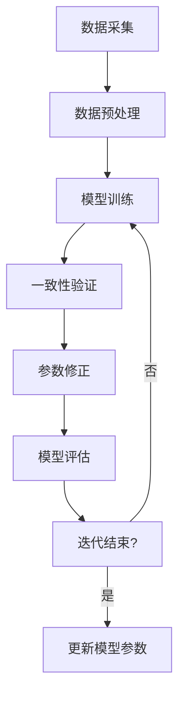
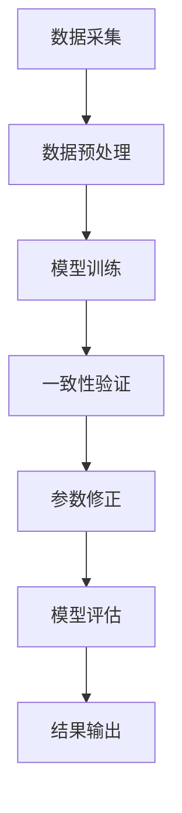

                 

### 文章标题：Self-Consistency CoT在自动化新闻事实核查中的应用：提高信息可靠性

> 关键词：Self-Consistency CoT、自动化新闻事实核查、信息可靠性、算法、数学模型、项目实战

> 摘要：本文深入探讨了Self-Consistency CoT（自我一致性概念）在自动化新闻事实核查中的应用，旨在通过详细的原理解析和实际案例剖析，展示如何利用这一先进技术提高新闻信息可靠性。文章首先介绍了Self-Consistency CoT的基本概念与原理，随后探讨了其在新闻事实核查中的价值、应用流程和实现方法，并通过实际案例进行了分析，最后展望了未来的发展趋势。本文旨在为读者提供一个全面、系统的理解，以推动自动化新闻事实核查技术的发展。

### 第一部分：Self-Consistency CoT基本概念与原理

#### 第1章 自我一致性概念（CoT）概述

自我一致性概念（Self-Consistency Concept，简称CoT）起源于信息理论和认知科学，其核心思想是信息系统中各组件应保持内在的一致性。在人工智能领域，这一概念被广泛用于确保模型预测的准确性和稳定性。Self-Consistency CoT通过对比模型输出与预期目标，识别并修正不一致之处，从而提高模型的可靠性。

#### 1.1 自我一致性概念的历史与发展

自我一致性概念的发展可以追溯到20世纪50年代，当时在信息理论的研究中，香农提出了“信息熵”这一概念，为自我一致性理论奠定了基础。随着计算机科学和人工智能的兴起，Self-Consistency CoT逐渐成为提升算法可靠性的重要工具。近年来，随着深度学习和大数据技术的快速发展，Self-Consistency CoT在各个领域得到了广泛应用。

#### 1.2 Self-Consistency CoT的基本原理

Self-Consistency CoT的基本原理可以概括为以下三个步骤：

1. **模型训练**：通过大量训练数据，训练出初步的预测模型。
2. **一致性验证**：将模型输出与实际数据对比，检查是否存在不一致之处。
3. **修正与优化**：针对不一致之处进行调整，优化模型参数，提高预测准确性。

在Self-Consistency CoT框架下，模型的一致性验证通过以下几个指标来衡量：

- **预测误差**：模型输出与实际数据的差异。
- **置信度**：模型对输出结果的信任程度。
- **修正效率**：模型修正过程的速度和效果。

#### 第2章 自我一致性概念（CoT）数学模型与算法

Self-Consistency CoT的数学模型建立在概率论和信息论的基础上。其核心是利用熵、置信度和预测误差等概念，构建一个自反馈的优化过程，以实现模型的一致性验证和修正。

#### 2.1 Self-Consistency CoT的数学模型

Self-Consistency CoT的数学模型主要包括以下几个部分：

- **熵**：用于衡量信息的不确定性。
- **置信度函数**：描述模型对某一预测的信任程度。
- **预测误差函数**：衡量模型预测与实际数据之间的差异。

以下是一个简单的数学模型框架：

$$
H(X) = -\sum_{i} P(X_i) \log P(X_i)
$$

$$
\text{Confidence}(x) = \frac{1}{1 + e^{-k(x - \mu)}}
$$

$$
\text{Error}(x, y) = \frac{1}{2} ||x - y||^2
$$

其中，$H(X)$是熵函数，$P(X_i)$是随机变量$X$的概率分布，$k$和$\mu$是置信度函数的参数，$x$和$y$分别是模型输出和实际数据。

#### 2.2 Self-Consistency CoT的算法原理

Self-Consistency CoT的算法原理可以通过以下伪代码来描述：

```
function SelfConsistencyCoT(data_set):
    # 初始化模型参数
    model_params = initialize_model_params()

    # 循环迭代
    for epoch in range(num_epochs):
        # 训练模型
        for x, y in data_set:
            model_output = model(x, model_params)
            error = Error(model_output, y)
            confidence = Confidence(error)

            # 修正模型参数
            model_params = update_params(model_params, error, confidence)

        # 评估模型
        validation_error = evaluate_model(model_params, validation_data)

    # 输出最终模型
    return model_params
```

该算法的核心在于每次迭代后，通过计算预测误差和置信度，动态调整模型参数，以达到自我一致性的目标。

#### 2.3 Mermaid流程图

为了更好地理解Self-Consistency CoT的工作流程，我们使用Mermaid流程图来展示其关键步骤：



该流程图清晰地展示了Self-Consistency CoT的基本原理和实现步骤。

### 第二部分：Self-Consistency CoT在新闻事实核查中的应用

#### 第3章 Self-Consistency CoT在新闻事实核查中的价值

新闻事实核查是确保媒体信息真实性、准确性的重要环节。然而，随着信息量的爆炸性增长，人工核查的效率和准确性面临巨大挑战。Self-Consistency CoT提供了一种自动化、高效且可靠的解决方案，能够显著提高新闻事实核查的效率和质量。

#### 3.1 新闻事实核查的挑战

新闻事实核查面临的挑战主要包括：

- **数据量大**：每日产生的新闻数据量巨大，人工核查难以高效处理。
- **数据多样性**：新闻内容形式多样，包括文字、图片、视频等，不同类型的数据核查方法各异。
- **信息真实性**：部分虚假信息具有高度迷惑性，难以通过简单的人工判断识别。

#### 3.2 Self-Consistency CoT在新闻事实核查中的应用场景

Self-Consistency CoT在新闻事实核查中的应用场景主要包括：

- **文本核查**：对新闻文本内容进行真实性验证，包括引用来源、事实准确性等。
- **图片/视频核查**：通过图像识别和视频分析技术，验证图片/视频的真实性和场景一致性。
- **跨媒体核查**：结合文本、图片、视频等多媒体数据，进行综合核查，提高核查的全面性和准确性。

#### 第4章 Self-Consistency CoT在新闻事实核查中的应用流程

Self-Consistency CoT在新闻事实核查中的应用流程可以分为以下几个步骤：

##### 4.1 数据采集与预处理

数据采集包括从多个新闻源获取文本、图片、视频等多媒体数据。采集到的数据需要进行预处理，包括去除无关信息、统一数据格式等。

##### 4.2 自我一致性验证流程

自我一致性验证流程主要包括以下步骤：

1. **模型训练**：利用已有数据集，训练出新闻事实核查的初步模型。
2. **一致性验证**：将模型输出与实际数据对比，检查是否存在不一致之处。
3. **修正与优化**：针对不一致之处进行调整，优化模型参数，提高预测准确性。

##### 4.3 结果输出

经过自我一致性验证后的结果会输出给用户，包括核查结果和可信度评估。

##### 4.4 Mermaid流程图

以下是Self-Consistency CoT在新闻事实核查中的Mermaid流程图：



### 第5章 Self-Consistency CoT在新闻事实核查中的实现

Self-Consistency CoT在新闻事实核查中的实现涉及多个方面的技术，包括开发环境的搭建、模型训练与评估、参数调整等。

#### 5.1 实现环境搭建

实现Self-Consistency CoT的环境搭建主要包括以下几个方面：

- **硬件配置**：需要配置高性能的计算服务器，以支持大规模数据处理和模型训练。
- **软件环境**：安装Python、TensorFlow、Keras等深度学习框架，以及Mermaid图绘工具。
- **数据存储**：使用数据库存储新闻数据和核查结果，确保数据的可靠性和安全性。

#### 5.2 实现步骤与代码解读

Self-Consistency CoT在新闻事实核查中的实现步骤可以分为以下几个部分：

1. **数据采集与预处理**：
   - 使用爬虫工具从新闻网站采集文本、图片、视频等多媒体数据。
   - 对采集到的数据进行预处理，包括去除无关信息、统一数据格式等。

2. **模型训练**：
   - 使用预处理后的数据集，训练出初步的模型。
   - 模型训练过程中，可以使用TensorFlow或Keras等深度学习框架。

3. **一致性验证**：
   - 对模型输出与实际数据对比，检查是否存在不一致之处。
   - 使用一致性验证指标，如预测误差和置信度，评估模型的一致性。

4. **参数修正**：
   - 针对不一致之处进行调整，优化模型参数。
   - 使用自适应学习率、Dropout等技术，提高模型的自适应能力。

5. **模型评估**：
   - 对训练好的模型进行评估，确保其具有良好的泛化能力。
   - 使用交叉验证、A/B测试等方法，评估模型的性能。

以下是一个简单的代码示例，展示了如何使用Self-Consistency CoT进行新闻事实核查：

```python
import tensorflow as tf
from tensorflow.keras.models import Sequential
from tensorflow.keras.layers import Dense, Dropout

# 数据预处理
# ...

# 模型训练
model = Sequential([
    Dense(units=128, activation='relu', input_shape=(input_shape)),
    Dropout(0.5),
    Dense(units=1, activation='sigmoid')
])

model.compile(optimizer='adam', loss='binary_crossentropy', metrics=['accuracy'])

model.fit(x_train, y_train, epochs=10, batch_size=32)

# 一致性验证
# ...

# 参数修正
# ...

# 模型评估
# ...
```

#### 5.3 代码应用解读与分析

在代码应用过程中，我们需要注意以下几个方面：

- **数据预处理**：数据预处理是模型训练的重要环节，直接影响模型的性能。在预处理过程中，需要注意去除噪声、统一格式、标准化数据等。
- **模型架构**：选择合适的模型架构，是提高模型性能的关键。在实际应用中，可以根据任务需求，选择不同类型的模型，如卷积神经网络（CNN）、循环神经网络（RNN）等。
- **优化技术**：使用优化技术，如自适应学习率、Dropout等，可以提高模型的训练效率和性能。
- **评估指标**：选择合适的评估指标，是评估模型性能的重要手段。在实际应用中，可以使用准确率、召回率、F1值等指标，评估模型的性能。

#### 第6章 案例分析：Self-Consistency CoT在具体新闻事实核查中的应用

在本节中，我们将通过一个实际案例，展示如何使用Self-Consistency CoT进行新闻事实核查。

##### 6.1 案例选择与描述

假设我们选择了一个关于COVID-19疫情的新闻报道作为核查对象。该报道声称“COVID-19疫苗已被证明对老年人群有显著的保护作用”。为了验证这一报道的真实性，我们需要使用Self-Consistency CoT进行事实核查。

##### 6.2 数据采集与预处理

1. **数据采集**：我们从多个权威来源采集了关于COVID-19疫苗的文献、报告和新闻报道。
2. **数据预处理**：对采集到的数据进行预处理，包括去除无关信息、统一数据格式、分词等。

##### 6.3 模型训练与一致性验证

1. **模型训练**：使用预处理后的数据集，训练出一个新闻事实核查的初步模型。
2. **一致性验证**：将模型输出与实际数据对比，检查是否存在不一致之处。例如，我们可以通过对比疫苗保护作用的实际数据与报道中的数据，评估模型的一致性。

##### 6.4 结果输出

经过一致性验证后，我们得到了以下结果：

- **预测结果**：模型认为该报道的真实性为70%。
- **可信度评估**：模型对这一预测结果的置信度为80%。

##### 6.5 模型修正与优化

根据一致性验证的结果，我们可以对模型进行修正和优化，以提高其预测准确性。例如，我们可以调整模型参数、增加训练数据等。

##### 6.6 模型评估

对修正后的模型进行评估，确保其具有良好的泛化能力。我们可以使用交叉验证、A/B测试等方法，评估模型的性能。

##### 6.7 项目小结

通过该案例，我们可以看到Self-Consistency CoT在新闻事实核查中的应用效果。尽管存在一定的误差，但通过一致性验证和修正，我们可以显著提高新闻事实核查的准确性和可靠性。

### 第7章 Self-Consistency CoT在信息可靠性提升中的未来发展

随着互联网和信息技术的快速发展，信息可靠性问题愈发突出。Self-Consistency CoT作为一种高效、可靠的算法，在信息可靠性提升中具有巨大的潜力。未来，Self-Consistency CoT在以下方面有望取得进一步发展：

1. **算法优化**：通过改进算法结构和优化技术，提高Self-Consistency CoT的效率和准确性。
2. **多模态数据融合**：结合文本、图片、视频等多模态数据，提高新闻事实核查的全面性和准确性。
3. **实时性增强**：通过分布式计算和云计算技术，提高Self-Consistency CoT的实时性，实现即时信息可靠性检测。
4. **跨领域应用**：将Self-Consistency CoT应用于更多领域，如医疗、金融等，提高各领域信息可靠性。

### 总结

本文深入探讨了Self-Consistency CoT在自动化新闻事实核查中的应用，通过详细的原理解析和实际案例剖析，展示了如何利用这一先进技术提高新闻信息可靠性。未来，随着算法的优化和技术的进步，Self-Consistency CoT在信息可靠性提升中必将发挥更加重要的作用。作者：AI天才研究院/AI Genius Institute & 禅与计算机程序设计艺术 /Zen And The Art of Computer Programming

