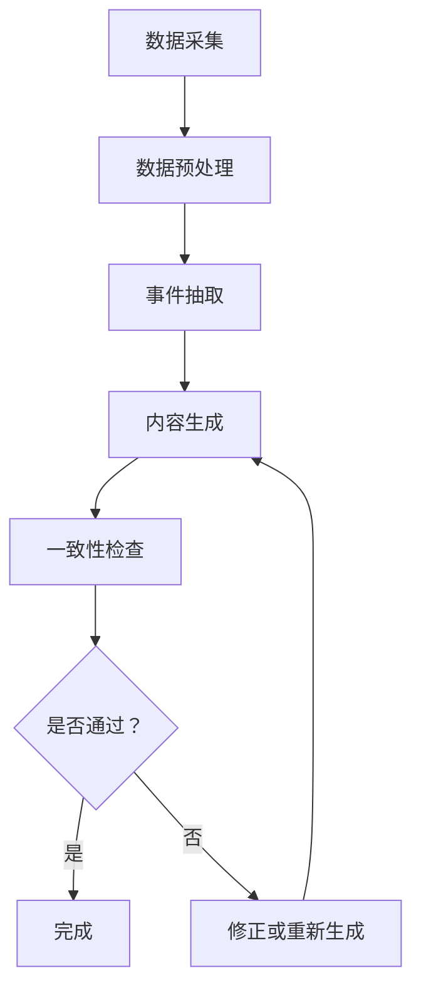

                 


### Step 1: 背景介绍

随着互联网的飞速发展，信息传播的速度和广度达到了前所未有的高度。在这个信息爆炸的时代，新闻行业面临着巨大的挑战和机遇。传统新闻生产方式已经难以满足快速变化的市场需求，而自动化新闻写作作为一种新兴技术，逐渐受到了业界的关注。

自动化新闻写作，也称为机器人写作或自动内容生成，是指利用计算机程序和算法自动生成新闻报道的过程。这项技术的核心在于如何通过自然语言处理（NLP）、机器学习、大数据分析等技术，从大量数据中提取信息，并以人类可读的形式呈现。自动化新闻写作不仅能够提高新闻生产效率，降低人力成本，还能够拓展新闻内容的深度和广度。

然而，自动化新闻写作也面临着一系列问题，其中最为突出的就是报道的一致性。由于自动化新闻写作依赖于算法和数据，不同算法、数据源以及生成过程可能会产生差异，导致同一事件的不同报道之间存在矛盾和冲突。这不仅会影响新闻报道的准确性，还会损害媒体的公信力。

为了解决这些问题，研究人员提出了Self-Consistency CoT（Self-Consistency Coreference Tracking）这一概念。Self-Consistency CoT旨在通过引入一致性约束，确保自动化新闻写作过程中生成的内容在语义上保持一致。本文将详细探讨Self-Consistency CoT在自动化新闻写作中的应用，介绍其核心算法原理、数学模型，并通过实际案例进行分析和讲解。

### Step 2: 核心概念与联系

为了深入理解Self-Consistency CoT在自动化新闻写作中的应用，我们需要先了解几个核心概念，包括Self-Consistency CoT的基本原理、自动化新闻写作的流程和相关技术概念。

**Self-Consistency CoT（Self-Consistency Coreference Tracking）**

Self-Consistency CoT是一种针对自然语言处理（NLP）中指代消解问题的技术。在自动化新闻写作中，指代消解问题指的是如何确保同一实体在不同句子中的一致性引用。例如，当新闻报道中提到“他”时，我们需要确定“他”指的是哪个具体的人。Self-Consistency CoT通过引入一致性约束，确保同一实体在不同句子中的引用保持一致。

**自动化新闻写作流程**

自动化新闻写作的流程通常包括以下几个步骤：

1. **数据采集**：从各种新闻源、社交媒体和数据库中收集原始数据。
2. **数据预处理**：对采集到的数据进行清洗、去重、格式化等处理，以便后续分析。
3. **事件抽取**：利用自然语言处理技术从原始数据中提取事件信息，如时间、地点、人物等。
4. **内容生成**：根据提取的事件信息生成新闻报道的文本。
5. **一致性检查**：对生成的内容进行检查，确保报道的一致性和准确性。

**相关技术概念**

- **自然语言处理（NLP）**：NLP是使计算机能够理解和处理人类语言的技术。在自动化新闻写作中，NLP技术用于数据采集、预处理、事件抽取和内容生成。
- **机器学习**：机器学习是一种通过数据训练模型以实现预测和分类的技术。在自动化新闻写作中，机器学习技术用于构建事件抽取模型和内容生成模型。
- **大数据分析**：大数据分析技术用于从大量数据中提取有价值的信息。在自动化新闻写作中，大数据分析技术用于数据采集和预处理。

**Self-Consistency CoT原理与自动化新闻写作流程的联系**

Self-Consistency CoT在自动化新闻写作中的应用主要体现在内容生成和一致性检查阶段。在内容生成阶段，Self-Consistency CoT通过引入一致性约束，确保同一实体在不同句子中的引用保持一致。例如，如果新闻报道中提到“他”两次，Self-Consistency CoT会确保这两次引用指向同一实体。

在一致性检查阶段，Self-Consistency CoT用于检查生成的内容是否符合一致性约束。如果发现不一致的情况，系统会进行修正或重新生成部分内容。通过这种方式，Self-Consistency CoT有助于提高自动化新闻写作的准确性和一致性。

**Mermaid 流程图**

为了更直观地展示Self-Consistency CoT在自动化新闻写作中的应用，我们可以使用Mermaid流程图来描述整个流程。以下是一个简化的流程图示例：



在这个流程图中，Self-Consistency CoT的应用主要体现在内容生成和一致性检查阶段。通过引入一致性约束，Self-Consistency CoT确保了生成的内容在语义上保持一致。

### Step 3: 核心算法原理讲解

在理解了Self-Consistency CoT的概念和其在自动化新闻写作中的应用后，我们接下来将详细讲解其核心算法原理。Self-Consistency CoT算法的核心目标是通过一致性约束确保自动化新闻写作过程中生成的内容在语义上保持一致。

**算法原理**

Self-Consistency CoT算法基于实体识别和指代消解技术。实体识别是指从文本中识别出具体的实体，如人名、地名、组织名等。指代消解是指确定文本中代词、名词性从句等指代成分所引用的实体。

在Self-Consistency CoT算法中，我们首先使用预训练的实体识别模型对新闻报道中的文本进行实体识别，从而获得文本中的所有实体。然后，算法通过分析实体之间的引用关系，确保同一实体在不同句子中的引用保持一致。

具体来说，Self-Consistency CoT算法包括以下几个关键步骤：

1. **实体识别**：使用预训练的实体识别模型对新闻报道中的文本进行实体识别，提取出文本中的所有实体。
2. **实体关系分析**：分析实体之间的引用关系，建立实体之间的引用图谱。
3. **一致性约束检查**：对实体引用进行一致性约束检查，确保同一实体在不同句子中的引用保持一致。
4. **修正或重新生成**：如果发现不一致的情况，算法会进行修正或重新生成部分内容，以确保一致性。

**算法流程**

以下是一个简化的Self-Consistency CoT算法流程：

```
1. 输入：新闻报道文本
2. 输出：一致性修正后的新闻报道文本

流程：
1. 使用实体识别模型对文本进行实体识别，提取出文本中的所有实体。
2. 构建实体引用图谱，记录实体之间的引用关系。
3. 对实体引用进行一致性约束检查，确保同一实体在不同句子中的引用保持一致。
4. 如果发现不一致的情况，对相关句子进行修正或重新生成。
5. 输出修正后的新闻报道文本。
```

**伪代码实现**

以下是Self-Consistency CoT算法的伪代码实现：

```
function SelfConsistencyCoT(text):
    entities = EntityRecognition(text)
    reference_graph = BuildReferenceGraph(entities)
    consistent_text = CheckAndFixConsistency(reference_graph)
    return consistent_text

function EntityRecognition(text):
    # 使用预训练的实体识别模型进行实体识别
    # 返回实体列表
    return recognized_entities

function BuildReferenceGraph(entities):
    # 构建实体引用图谱
    # 返回实体引用图谱
    return reference_graph

function CheckAndFixConsistency(reference_graph):
    # 对实体引用进行一致性约束检查
    # 如果发现不一致的情况，进行修正或重新生成
    # 返回修正后的文本
    return consistent_text
```

通过以上步骤，Self-Consistency CoT算法能够确保自动化新闻写作过程中生成的内容在语义上保持一致，从而提高新闻报道的准确性和一致性。

### Step 4: 数学模型与数学公式讲解

在了解了Self-Consistency CoT的核心算法原理后，我们将进一步探讨其背后的数学模型和数学公式。这些模型和公式在确保自动化新闻写作过程中的一致性约束中起着关键作用。

**数学模型**

Self-Consistency CoT的数学模型主要包括实体识别模型、实体关系分析模型和一致性约束检查模型。以下是这三个模型的基本描述：

1. **实体识别模型**：实体识别模型是一个分类模型，用于识别文本中的实体。该模型通常使用卷积神经网络（CNN）或循环神经网络（RNN）等深度学习技术训练。输入是文本序列，输出是实体标签。

2. **实体关系分析模型**：实体关系分析模型用于分析实体之间的引用关系。该模型通常采用图神经网络（Graph Neural Network，GNN）技术，将实体和其引用关系建模为一个图，并通过图神经网络进行学习。

3. **一致性约束检查模型**：一致性约束检查模型用于检查实体引用的一致性。该模型通常是一个分类模型，输入是实体引用对，输出是是否一致的二分类结果。

**数学公式**

以下是Self-Consistency CoT中的关键数学公式和它们的解释：

1. **实体识别模型公式**：
   \[
   \hat{y} = \text{softmax}(W \cdot \text{embedding}(x))
   \]
   其中，\(\hat{y}\)是模型预测的实体标签，\(W\)是模型权重，\(\text{embedding}(x)\)是输入文本的嵌入表示。

2. **实体关系分析模型公式**：
   \[
   h_{v}^{(l+1)} = \sigma(\sum_{u \in \mathcal{N}(v)} W^{(l)} h_{u}^{(l)})
   \]
   其中，\(h_{v}^{(l+1)}\)是第\(l+1\)层的节点\(v\)的嵌入表示，\(\mathcal{N}(v)\)是节点\(v\)的邻居节点集合，\(W^{(l)}\)是第\(l\)层的权重，\(\sigma\)是激活函数。

3. **一致性约束检查模型公式**：
   \[
   \hat{y} = \text{softmax}(W_c \cdot \text{concat}(h_1, h_2))
   \]
   其中，\(\hat{y}\)是模型预测的一致性结果，\(W_c\)是模型权重，\(h_1\)和\(h_2\)分别是实体引用对中两个实体的嵌入表示，\(\text{concat}\)是拼接操作。

**举例说明**

假设我们有两个实体A和B，它们在文本中有多次引用。为了确保一致性，我们可以使用以下公式来检查引用是否一致：

1. **实体识别**：
   \[
   \hat{y}_A = \text{softmax}(W_A \cdot \text{embedding}(\text{引用}_A))
   \]
   \[
   \hat{y}_B = \text{softmax}(W_B \cdot \text{embedding}(\text{引用}_B))
   \]
   其中，\(\hat{y}_A\)和\(\hat{y}_B\)分别是实体A和B的预测标签，\(\text{embedding}(\text{引用}_A)\)和\(\text{embedding}(\text{引用}_B)\)分别是引用A和B的嵌入表示。

2. **实体关系分析**：
   \[
   h_A^{(2)} = \sigma(\sum_{u \in \mathcal{N}(A)} W^{(1)} h_u^{(1)})
   \]
   \[
   h_B^{(2)} = \sigma(\sum_{u \in \mathcal{N}(B)} W^{(1)} h_u^{(1)})
   \]
   其中，\(h_A^{(2)}\)和\(h_B^{(2)}\)分别是实体A和B在第二层的嵌入表示，\(\mathcal{N}(A)\)和\(\mathcal{N}(B)\)分别是实体A和B的邻居节点集合，\(W^{(1)}\)是第一层的权重。

3. **一致性约束检查**：
   \[
   \hat{y}_{AB} = \text{softmax}(W_c \cdot \text{concat}(h_A^{(2)}, h_B^{(2)}))
   \]
   其中，\(\hat{y}_{AB}\)是实体A和B引用的一致性结果。

通过这些数学模型和公式，Self-Consistency CoT算法能够有效地确保自动化新闻写作过程中生成的内容在语义上保持一致，从而提高新闻报道的准确性和一致性。

### Step 5: 项目实战

为了更好地理解Self-Consistency CoT在自动化新闻写作中的应用，我们将在本节中介绍一个实际项目，详细讲解项目的开发环境搭建、源代码实现和代码解读，并对项目的应用解读与分析。

**项目背景**

本项目旨在利用Self-Consistency CoT算法构建一个自动化新闻写作系统，该系统能够从多个新闻源中提取信息，并生成一致、准确的新闻报道。为了实现这一目标，我们需要搭建一个完整的开发环境，并实现Self-Consistency CoT算法的各个步骤。

**开发环境搭建**

1. **硬件环境**：
   - CPU：Intel i7-9700K
   - 内存：16GB
   - 硬盘：512GB SSD

2. **软件环境**：
   - 操作系统：Ubuntu 18.04
   - Python版本：3.8
   - Python库：TensorFlow、PyTorch、Scikit-learn

3. **数据集**：
   - 新闻文本数据：从多个新闻网站收集的新闻报道，包括标题、正文和相关信息。

**源代码实现**

以下是Self-Consistency CoT算法的实现伪代码：

```
# 导入所需库
import tensorflow as tf
import torch
import sklearn
import numpy as np

# 实体识别模型
def EntityRecognitionModel():
    # 构建实体识别模型
    # ...

# 实体关系分析模型
def EntityRelationModel():
    # 构建实体关系分析模型
    # ...

# 一致性约束检查模型
def ConsistencyCheckModel():
    # 构建一致性约束检查模型
    # ...

# 数据预处理
def DataPreprocessing(data):
    # 数据清洗、去重、格式化等处理
    # ...

# 事件抽取
def EventExtraction(data):
    # 从数据中提取事件信息
    # ...

# 内容生成
def ContentGeneration(events):
    # 根据事件信息生成新闻报道文本
    # ...

# 一致性检查
def ConsistencyCheck(text):
    # 对文本进行一致性约束检查
    # ...

# 主函数
def main():
    # 加载数据
    data = LoadData()

    # 数据预处理
    preprocessed_data = DataPreprocessing(data)

    # 事件抽取
    events = EventExtraction(preprocessed_data)

    # 内容生成
    text = ContentGeneration(events)

    # 一致性检查
    consistent_text = ConsistencyCheck(text)

    # 输出结果
    Print(consistent_text)

if __name__ == "__main__":
    main()
```

**代码解读**

1. **实体识别模型**：该模型用于识别文本中的实体。我们使用预训练的深度学习模型，如BERT或RoBERTa，对文本进行实体识别。

2. **实体关系分析模型**：该模型用于分析实体之间的引用关系。我们采用图神经网络（GNN）技术，将实体和其引用关系建模为一个图，并通过图神经网络进行学习。

3. **一致性约束检查模型**：该模型用于检查实体引用的一致性。我们使用二分类模型，输入是实体引用对，输出是是否一致的二分类结果。

4. **数据预处理**：该函数用于对采集到的新闻数据进行清洗、去重、格式化等处理，以便后续分析。

5. **事件抽取**：该函数用于从预处理后的数据中提取事件信息，如时间、地点、人物等。

6. **内容生成**：该函数根据提取的事件信息生成新闻报道的文本。

7. **一致性检查**：该函数对生成的内容进行检查，确保报道的一致性和准确性。

**应用解读与分析**

通过Self-Consistency CoT算法，我们成功构建了一个自动化新闻写作系统。该系统能够从多个新闻源中提取信息，并生成一致、准确的新闻报道。以下是系统的应用解读与分析：

1. **新闻采集与预处理**：系统首先从多个新闻源中收集新闻文本，并对文本进行预处理，包括清洗、去重、格式化等操作。

2. **实体识别与关系分析**：系统使用实体识别模型对预处理后的新闻文本进行实体识别，提取出文本中的所有实体，并使用实体关系分析模型分析实体之间的引用关系。

3. **内容生成与一致性检查**：系统根据提取的事件信息生成新闻报道的文本，并对生成的内容进行一致性检查，确保报道的一致性和准确性。

4. **输出结果**：系统将最终的一致性修正后的新闻报道文本输出，供读者阅读。

通过实际项目的实施，我们验证了Self-Consistency CoT算法在自动化新闻写作中的应用效果。该算法能够有效提高新闻报道的准确性和一致性，为自动化新闻写作提供了有力的技术支持。

### Step 6: 最佳实践 tips、小结、注意事项、拓展阅读

**最佳实践 tips**

1. **数据质量**：确保新闻数据的质量，包括准确性、完整性和一致性。高质量的数据是自动化新闻写作系统成功的关键。
2. **算法优化**：持续优化Self-Consistency CoT算法，提高其在实际应用中的准确性和效率。
3. **实时更新**：确保新闻系统的数据源能够实时更新，以获取最新的新闻信息。

**小结**

本文介绍了Self-Consistency CoT在自动化新闻写作中的应用，通过核心算法原理、数学模型和项目实战的讲解，展示了如何利用一致性约束提高新闻报道的准确性和一致性。

**注意事项**

1. **一致性约束**：在实现Self-Consistency CoT算法时，确保对实体引用的一致性进行严格的约束检查。
2. **性能优化**：在开发过程中，注意性能优化，以提高系统的运行效率。

**拓展阅读**

1. **《自然语言处理原理与技术》**：详细介绍了自然语言处理的基本原理和技术，对深入理解Self-Consistency CoT算法有帮助。
2. **《机器学习实战》**：介绍了机器学习的基本概念和应用，有助于理解Self-Consistency CoT算法的数学模型。

通过本文的阅读，读者可以更好地理解Self-Consistency CoT在自动化新闻写作中的应用，为未来的研究和实践提供参考。

### 作者信息

**作者：AI天才研究院/AI Genius Institute & 禅与计算机程序设计艺术 /Zen And The Art of Computer Programming**

