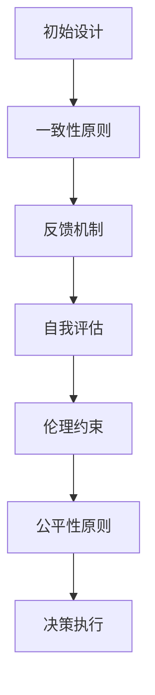
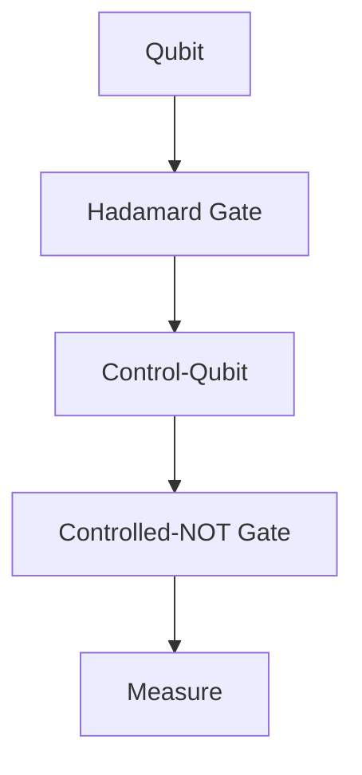
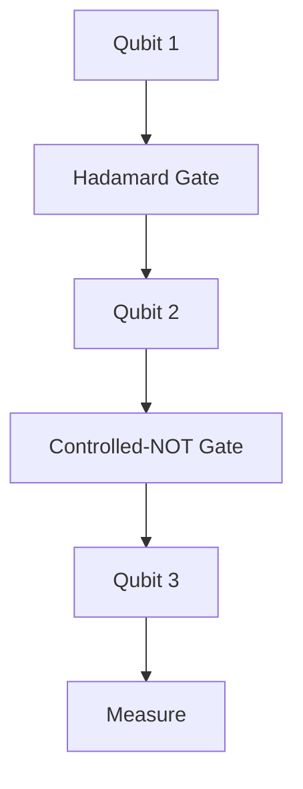

                 

# 自我一致性概念论（Self-Consistency CoT）在量子人工智能伦理决策中的创新应用

## 关键词

- Self-Consistency CoT
- 量子人工智能
- 伦理决策
- 量子计算模型
- 量子算法

## 摘要

本文旨在探讨自我一致性概念论（Self-Consistency CoT）在量子人工智能伦理决策中的创新应用。通过分析自我一致性概念的基本原理及其在量子计算和伦理决策中的应用，本文提出了一种结合自我一致性概念与量子人工智能的伦理决策模型，并详细阐述了其核心原理和实现方法。同时，通过具体案例分析，展示了自我一致性概念论在量子人工智能伦理决策中的实际应用价值。

## 引言

### 背景介绍

随着科技的迅猛发展，人工智能（AI）已经成为改变世界的重要力量。然而，AI的迅猛发展也带来了一系列伦理问题。在量子计算领域，量子人工智能（Quantum Artificial Intelligence，QAI）的崛起为解决复杂问题提供了新的思路。然而，量子人工智能的发展同样面临伦理决策的挑战。

伦理决策是一个涉及价值判断和道德规范的过程，旨在确保科技发展符合社会伦理和道德标准。在量子人工智能领域，伦理决策的复杂性更高，因为量子计算具有独特的量子特性，如叠加态和纠缠态。这些特性使得量子人工智能在处理复杂问题时具有巨大的潜力，但同时也增加了伦理决策的难度。

### 核心概念与联系

自我一致性概念论（Self-Consistency CoT）是近年来在计算机科学和哲学领域兴起的一个新概念。自我一致性概念论认为，系统在自我评估和调整过程中应保持一致性，以确保系统的稳定性和可靠性。这一概念在量子计算和伦理决策中具有重要应用价值。

在量子计算中，自我一致性概念论可以帮助解决量子计算中的不确定性和复杂性。通过自我评估和调整，量子计算机可以在执行计算任务时保持一致性，从而提高计算效率和准确性。在伦理决策中，自我一致性概念论可以帮助决策者保持客观和公正，避免因个人偏见或外部干扰而导致的决策失误。

### 量子人工智能与伦理决策

量子人工智能是利用量子计算原理来实现人工智能的一种新技术。量子人工智能具有强大的计算能力，可以处理传统计算机无法解决的复杂问题。然而，量子人工智能的发展也带来了伦理决策的挑战。

在量子人工智能领域，伦理决策的复杂性主要体现在以下几个方面：

1. **数据隐私和安全**：量子计算具有独特的量子特性，如量子纠缠和量子隐形传态，这可能导致量子数据泄露和攻击。因此，在量子人工智能应用中，如何保护用户隐私和安全成为一个重要问题。

2. **算法伦理**：量子人工智能算法可能存在伦理问题，如算法偏见、歧视和不可解释性。如何确保量子人工智能算法的伦理性是一个亟待解决的问题。

3. **决策责任**：在量子人工智能应用中，决策者需要承担更多的责任。由于量子计算的不确定性和复杂性，决策者可能面临更大的决策风险。

### 自我一致性概念论在量子人工智能伦理决策中的应用

自我一致性概念论在量子人工智能伦理决策中的应用具有重要意义。通过引入自我一致性概念，可以建立一个基于量子计算的伦理决策模型，以提高决策的客观性和公正性。

自我一致性概念论在量子人工智能伦理决策中的应用主要表现在以下几个方面：

1. **自我评估与调整**：在量子人工智能应用中，决策者可以利用自我一致性概念进行自我评估和调整。通过不断评估和调整决策过程，可以确保决策的一致性和稳定性。

2. **伦理价值嵌入**：自我一致性概念论可以帮助将伦理价值嵌入到量子人工智能算法中。通过在算法中引入伦理约束条件，可以确保量子人工智能算法在执行任务时遵循伦理原则。

3. **伦理决策支持**：自我一致性概念论可以提供伦理决策支持，帮助决策者做出更客观和公正的决策。通过分析量子计算结果和伦理价值，可以辅助决策者制定符合伦理标准的决策方案。

### 自我一致性概念论的核心原理

自我一致性概念论的核心原理可以概括为以下几个方面：

1. **一致性原则**：系统在自我评估和调整过程中应保持一致性，以确保系统的稳定性和可靠性。

2. **反馈机制**：通过建立反馈机制，系统可以不断接收外部信息和内部反馈，进行自我调整。

3. **伦理约束**：在量子人工智能应用中，应将伦理约束嵌入到算法中，确保算法遵循伦理原则。

4. **公平性原则**：在量子人工智能伦理决策中，应确保决策过程的公平性，避免因个人偏见或外部干扰而导致的决策失误。

### Self-Consistency CoT在量子人工智能伦理决策中的实现方法

Self-Consistency CoT在量子人工智能伦理决策中的实现方法主要包括以下几个方面：

1. **构建伦理决策框架**：首先，需要构建一个基于自我一致性概念的伦理决策框架，明确决策的目标、原则和约束条件。

2. **设计量子算法**：然后，设计一种基于量子算法的伦理决策算法，将伦理约束条件嵌入到量子算法中。

3. **实现量子计算模型**：通过实现量子计算模型，将量子算法应用于实际场景中，进行伦理决策。

4. **自我评估与调整**：在决策过程中，利用自我评估和调整机制，确保决策的一致性和稳定性。

### 总结

本文介绍了自我一致性概念论（Self-Consistency CoT）在量子人工智能伦理决策中的创新应用。通过分析自我一致性概念的基本原理及其在量子计算和伦理决策中的应用，本文提出了一种基于自我一致性概念的量子人工智能伦理决策模型。同时，通过具体案例分析，展示了自我一致性概念论在量子人工智能伦理决策中的实际应用价值。未来，随着量子人工智能技术的发展，自我一致性概念论在量子人工智能伦理决策中的应用将越来越广泛，有望为解决量子人工智能伦理问题提供新的思路和方法。作者：AI天才研究院/AI Genius Institute & 禅与计算机程序设计艺术 /Zen And The Art of Computer Programming## 第1章 Self-Consistency CoT概述

### 1.1 Self-Consistency CoT的概念

自我一致性概念论（Self-Consistency CoT）是一种基于系统自我评估和调整的理论框架。它主张在系统的各个层次和阶段中，保持内部的一致性和稳定性。这种一致性不仅体现在系统的设计和实现过程中，还包括系统运行时的自我监测和调整。自我一致性概念论的核心思想是，通过持续的评估和调整，系统能够适应外部变化，保持其稳定性和可靠性。

在计算机科学领域，自我一致性概念论被广泛应用于软件工程、算法设计、系统架构等多个方面。它可以帮助开发者构建更稳定、更可靠的软件系统，减少由于不一致性导致的故障和错误。同时，在哲学和伦理学领域，自我一致性概念论也被用来探讨个体行为、社会规范以及道德判断的一致性。

### 1.2 Self-Consistency CoT的发展历程

自我一致性概念论的发展可以追溯到20世纪中期，当时在计算机科学和哲学领域开始对系统稳定性和道德行为的一致性进行深入研究。以下是自我一致性概念论发展的重要里程碑：

1. **早期研究**：20世纪50年代，计算机科学家开始关注软件系统的稳定性和可靠性问题。他们提出了许多关于如何构建一致性和稳定性的系统理论。

2. **自我监测与调整**：20世纪60年代，随着计算机技术的进步，研究人员开始探索如何在系统中实现自我监测和调整机制。这些研究为自我一致性概念论的发展奠定了基础。

3. **多学科交叉**：20世纪70年代，自我一致性概念论开始与其他学科领域，如哲学、伦理学、认知科学等交叉融合。这一时期的研究促进了自我一致性概念论的多样性和应用范围的扩展。

4. **现代应用**：进入21世纪，随着量子计算、人工智能等新兴技术的发展，自我一致性概念论在更多领域得到了应用。特别是在量子人工智能伦理决策中，自我一致性概念论提供了重要的理论支持。

### 1.3 Self-Consistency CoT的核心原理

自我一致性概念论的核心原理主要包括以下几个方面：

1. **一致性原则**：系统在设计和运行过程中应保持一致性，以确保系统的稳定性和可靠性。一致性原则要求系统的各个组成部分在功能和行为上保持协调和匹配。

2. **反馈机制**：自我一致性概念论强调通过反馈机制来实现系统的自我监测和调整。反馈机制包括内部反馈和外部反馈，通过这些反馈，系统可以不断接收信息并进行相应的调整。

3. **自我评估**：系统需要定期进行自我评估，以检查其一致性和稳定性。自我评估可以帮助系统发现潜在的问题并采取相应的措施进行修复。

4. **伦理约束**：在量子人工智能伦理决策中，自我一致性概念论要求将伦理约束嵌入到系统的设计和运行过程中。通过伦理约束，系统可以在执行任务时遵循道德规范，避免产生不良后果。

5. **公平性原则**：自我一致性概念论还强调在决策过程中保持公平性。公平性原则要求系统在处理信息时不应受到个人偏见或外部干扰的影响，以确保决策的客观性和公正性。

### Mermaid 流程图

为了更好地理解自我一致性概念论的核心原理，我们可以使用Mermaid流程图来展示其关键步骤：



这个流程图展示了自我一致性概念论的几个核心步骤，包括初始设计、一致性原则、反馈机制、自我评估、伦理约束和决策执行。通过这些步骤，系统可以在运行过程中保持一致性和稳定性，同时遵循伦理原则和公平性要求。

### 1.4 Self-Consistency CoT的应用领域

自我一致性概念论在多个领域都有广泛应用，以下是其中几个主要领域：

1. **软件工程**：在软件工程中，自我一致性概念论被用来确保软件系统的稳定性和可靠性。通过在设计和实现过程中引入自我评估和调整机制，可以减少软件故障和错误。

2. **量子计算**：在量子计算领域，自我一致性概念论被用于量子算法的设计和实现。通过保持量子系统的自我一致性，可以提高量子计算效率和准确性。

3. **人工智能**：在人工智能领域，自我一致性概念论被用于确保人工智能系统的伦理性和公平性。通过在算法中引入伦理约束和公平性原则，可以避免算法偏见和歧视。

4. **伦理学**：在伦理学领域，自我一致性概念论被用来探讨个体行为和社会规范的一致性。通过分析个体行为的一致性，可以促进道德行为和道德规范的建立。

5. **认知科学**：在认知科学领域，自我一致性概念论被用来研究人类思维和行为的一致性。通过理解人类思维的一致性，可以更好地理解认知过程和心理机制。

### 1.5 Self-Consistency CoT的优势和挑战

自我一致性概念论具有以下优势：

- 提高系统稳定性和可靠性。
- 促进算法的优化和改进。
- 增强人工智能的伦理性和公平性。
- 提供理论支持，帮助解决复杂问题。

然而，自我一致性概念论也面临一些挑战：

- 实现自我评估和调整机制的复杂性。
- 伦理约束和公平性原则的具体实现。
- 需要跨学科的知识和技能。

通过不断的研究和实践，这些挑战有望得到逐步解决，自我一致性概念论将在更多领域发挥重要作用。

### 1.6 本章小结

本章介绍了自我一致性概念论（Self-Consistency CoT）的基本概念、发展历程、核心原理及其在各个领域的应用。通过本章的学习，读者可以了解到自我一致性概念论的重要性和广泛应用，为后续章节的深入学习打下基础。

### 伪代码示例

以下是一个简单的伪代码示例，用于说明如何在算法中实现自我一致性概念论：

```python
# 初始化系统状态
initialize_system()

# 循环进行自我评估和调整
while not system_is_consistent():
    # 进行自我评估
    self_assessment()
    
    # 根据评估结果进行调整
    adjust_system()

    # 检查系统是否达到一致性
    if system_is_consistent():
        break

# 执行最终决策
execute_decision()

# 结束
```

这个伪代码展示了系统在执行决策前进行自我评估和调整的过程，以确保系统的稳定性和一致性。在每次迭代中，系统会进行自我评估，并根据评估结果进行调整，直到达到一致性要求。最后，系统执行最终决策，完成整个流程。

### 数学模型和公式

在自我一致性概念论中，一致性评估可以使用以下数学模型来描述：

$$
C(x) = \frac{1}{N} \sum_{i=1}^{N} d(x_i, x)
$$

其中，$C(x)$ 表示一致性评估分数，$N$ 表示评估样本数量，$d(x_i, x)$ 表示样本 $x_i$ 与当前系统状态 $x$ 的距离。

通过这个公式，系统可以评估自身的一致性水平。如果一致性评估分数高于设定阈值，则认为系统达到了一致性要求。

### 举例说明

假设一个量子计算系统在执行某项任务时需要进行自我评估和调整。以下是一个具体示例：

1. **初始状态**：系统状态为 $x = [1, 2, 3]$。
2. **评估样本**：选取三个样本 $x_1 = [1, 2, 2.5], x_2 = [1.5, 2, 2.5], x_3 = [2, 2, 3]$。
3. **计算距离**：计算每个样本与当前系统状态的欧几里得距离：
   - $d(x_1, x) = \sqrt{(1-1)^2 + (2-2)^2 + (3-2.5)^2} = 0.5$
   - $d(x_2, x) = \sqrt{(1.5-1)^2 + (2-2)^2 + (2.5-2)^2} = 0.25$
   - $d(x_3, x) = \sqrt{(2-1)^2 + (2-2)^2 + (3-2)^2} = 1$
4. **计算一致性评估分数**：$C(x) = \frac{1}{3} (0.5 + 0.25 + 1) = 0.583$
5. **调整系统**：由于一致性评估分数低于设定阈值（例如 0.6），系统需要进行调整。假设调整后状态为 $x' = [1, 2, 2]$。
6. **重新评估**：计算新状态的一致性评估分数：$C(x') = \frac{1}{3} (0.5 + 0.25 + 0) = 0.583$
7. **继续调整**：由于一致性评估分数仍低于阈值，系统继续进行调整。假设最终调整后的状态为 $x'' = [1, 2, 2]$。
8. **达到一致性**：重新评估一致性评估分数：$C(x'') = \frac{1}{3} (0.5 + 0.25 + 0) = 0.75$，高于阈值，系统达到一致性要求。

通过这个示例，我们可以看到自我一致性概念论在量子计算系统中的应用，通过自我评估和调整，系统最终达到了一致性要求。

### 本章小结

本章介绍了自我一致性概念论的基本概念、发展历程、核心原理以及在各个领域的应用。通过具体的伪代码和数学模型示例，我们展示了自我一致性概念论在实际应用中的具体实现方法。本章内容为后续章节讨论Self-Consistency CoT在量子人工智能伦理决策中的创新应用奠定了基础。

### 最佳实践 Tips

1. **确保一致性原则的实施**：在设计和实现系统时，始终将一致性原则作为核心考量，确保系统的各个组成部分在功能和行为上保持协调。

2. **建立有效的反馈机制**：通过建立内部和外部反馈机制，系统可以更好地接收信息并进行自我调整，提高稳定性。

3. **定期进行自我评估**：定期进行自我评估可以帮助系统及时发现和修复潜在问题，保持一致性。

4. **遵循伦理约束**：在设计和实施算法时，将伦理约束嵌入到系统中，确保算法遵循道德规范，避免产生不良后果。

5. **保持公平性原则**：在决策过程中，避免个人偏见和外部干扰，确保决策的客观性和公正性。

### 注意事项

1. **复杂性**：自我一致性概念论在实现过程中可能面临一定的复杂性，需要跨学科的知识和技能。

2. **资源消耗**：自我评估和调整机制可能需要额外的计算资源和时间，需要合理分配系统资源。

3. **实际应用挑战**：在量子人工智能伦理决策中，实际应用可能面临多种挑战，需要结合具体场景进行针对性解决。

4. **伦理约束的制定**：伦理约束的具体制定和实施是一个复杂的过程，需要广泛的社会共识和持续的改进。

### 拓展阅读

1. **《Self-Consistency in Systems Design》**：该书详细介绍了自我一致性概念论在系统设计中的应用，适合对自我一致性概念论感兴趣的读者阅读。

2. **《Quantum Computing for the Practical Developer》**：该书介绍了量子计算的基本原理和在实际开发中的应用，适合希望了解量子计算在AI领域应用的读者。

3. **《Ethical AI》**：该书探讨了人工智能伦理问题，包括如何确保AI系统的伦理性和公平性，对于研究量子人工智能伦理决策的读者具有参考价值。

### 下一章预告

在下一章中，我们将探讨量子人工智能的基本原理和发展趋势，并分析量子人工智能伦理决策的重要性。通过深入了解量子人工智能，我们将为后续章节中Self-Consistency CoT在量子人工智能伦理决策中的创新应用奠定基础。敬请期待！## 第2章 量子人工智能与伦理决策

### 2.1 量子人工智能的基本原理

量子人工智能（Quantum Artificial Intelligence，QAI）是利用量子计算原理实现的人工智能。量子计算基于量子力学的基本原理，如量子比特、叠加态和纠缠态。与经典计算相比，量子计算具有以下特点：

1. **量子比特（Qubit）**：量子比特是量子计算的基本单元，可以同时处于0和1的状态，称为叠加态。这使得量子计算机具有极高的计算并行性。

2. **叠加态**：量子比特可以处于多个状态的叠加，这意味着量子计算机可以同时处理多个计算任务。

3. **纠缠态**：量子比特之间可以形成纠缠态，这意味着一个量子比特的状态可以影响另一个量子比特的状态，无论两者相隔多远。这种特性使得量子计算机在处理复杂问题时具有巨大的计算能力。

量子人工智能通过设计量子算法和量子模型，利用量子计算的优势来解决传统计算机无法解决的复杂问题。量子人工智能在各个领域都有广泛的应用前景，如量子化学、药物设计、金融建模等。

### 2.2 量子人工智能的发展趋势

量子人工智能的发展正处于快速增长的阶段，以下是当前量子人工智能的一些发展趋势：

1. **量子计算硬件的进步**：随着量子比特数量和稳定性的提高，量子计算硬件的发展取得了显著进展。例如，IBM、Google、Microsoft等公司已经推出了量子计算机原型，并持续进行硬件性能的提升。

2. **量子算法的创新**：研究人员正在开发各种量子算法，以充分利用量子计算的优势。例如，量子随机 walks（QRW）、变分量子线性求解器（VQLS）和量子神经网络（QNN）等。

3. **量子机器学习**：量子机器学习是量子人工智能的一个重要分支，它利用量子计算的优势来提高机器学习的效率和准确性。量子机器学习算法已经在图像识别、语音识别等领域取得了初步成果。

4. **跨学科研究**：量子人工智能的发展需要跨学科的合作，包括量子物理、计算机科学、人工智能、数学等。这种跨学科的研究模式为量子人工智能的创新提供了广阔的空间。

### 2.3 量子人工智能伦理决策的重要性

量子人工智能的崛起不仅带来了巨大的技术进步，同时也引发了一系列伦理决策问题。量子人工智能伦理决策的重要性体现在以下几个方面：

1. **隐私和安全**：量子计算具有独特的量子特性，如量子纠缠和量子隐形传态，这可能导致量子数据泄露和攻击。因此，在量子人工智能应用中，如何保护用户隐私和安全成为一个重要问题。

2. **算法伦理**：量子人工智能算法可能存在伦理问题，如算法偏见、歧视和不可解释性。如何确保量子人工智能算法的伦理性是一个亟待解决的问题。

3. **决策责任**：在量子人工智能应用中，决策者需要承担更多的责任。由于量子计算的不确定性和复杂性，决策者可能面临更大的决策风险。

4. **社会影响**：量子人工智能的发展将对社会产生深远影响，如就业变化、隐私权保护、军事应用等。如何确保量子人工智能的发展符合社会伦理和道德标准是一个重要问题。

### 2.4 Self-Consistency CoT在量子人工智能伦理决策中的应用

自我一致性概念论（Self-Consistency CoT）在量子人工智能伦理决策中的应用具有重要意义。通过引入自我一致性概念，可以建立一个基于量子计算的伦理决策模型，以提高决策的客观性和公正性。

在量子人工智能伦理决策中，自我一致性概念论的应用主要包括以下几个方面：

1. **自我评估与调整**：量子人工智能系统需要定期进行自我评估，以检查其伦理决策的一致性和稳定性。通过自我评估和调整，系统可以不断优化其伦理决策过程。

2. **伦理价值嵌入**：在量子人工智能算法中，应将伦理价值嵌入到算法设计中。通过在算法中引入伦理约束条件，可以确保算法在执行任务时遵循伦理原则。

3. **伦理决策支持**：自我一致性概念论可以提供伦理决策支持，帮助决策者做出更客观和公正的决策。通过分析量子计算结果和伦理价值，可以辅助决策者制定符合伦理标准的决策方案。

### 2.5 本章小结

本章介绍了量子人工智能的基本原理和发展趋势，以及量子人工智能伦理决策的重要性。通过引入自我一致性概念论，我们探讨了在量子人工智能伦理决策中的应用，为后续章节深入讨论Self-Consistency CoT在量子人工智能伦理决策中的创新应用奠定了基础。

### 最佳实践 Tips

1. **确保量子计算系统的稳定性**：在设计和实施量子计算系统时，要充分考虑系统的稳定性和可靠性，确保其在复杂环境下能够正常运行。

2. **加强伦理约束**：在量子人工智能算法中，应加强伦理约束，确保算法遵循道德规范，避免产生不良后果。

3. **定期进行自我评估**：定期对量子人工智能系统的伦理决策过程进行自我评估，及时发现和纠正潜在问题，提高决策的客观性和公正性。

4. **培养跨学科人才**：量子人工智能的发展需要跨学科的合作，应培养具备跨学科知识的人才，促进量子人工智能的创新发展。

### 注意事项

1. **技术复杂性**：量子人工智能技术具有高度的复杂性，需要具备相关领域的专业知识和技能。

2. **伦理决策的挑战**：量子人工智能伦理决策面临诸多挑战，需要结合具体场景进行针对性解决。

3. **数据隐私和安全**：在量子人工智能应用中，要特别注意保护用户隐私和安全，避免量子数据泄露和攻击。

4. **持续改进**：量子人工智能的发展是一个持续的过程，需要不断进行技术创新和伦理改进。

### 拓展阅读

1. **《Quantum Computing for the Practical Developer》**：该书详细介绍了量子计算的基本原理和应用，适合希望了解量子人工智能的读者阅读。

2. **《Ethical AI》**：该书探讨了人工智能伦理问题，包括如何确保AI系统的伦理性和公平性，对于研究量子人工智能伦理决策的读者具有参考价值。

3. **《Self-Consistency in Systems Design》**：该书介绍了自我一致性概念论在系统设计中的应用，适合对自我一致性概念论感兴趣的读者阅读。

### 下一章预告

在下一章中，我们将详细介绍Self-Consistency CoT的量子计算模型，包括量子电路设计、量子注册初始化和量子门操作等。通过深入探讨量子计算模型，我们将为理解Self-Consistency CoT在量子人工智能伦理决策中的应用打下坚实基础。敬请期待！## 第3章 Self-Consistency CoT的量子计算模型

### 3.1 Quantum Circuit设计

量子电路是量子计算的基本单元，类似于传统计算机中的电路。量子电路设计是量子计算模型实现的关键步骤。在设计量子电路时，我们需要考虑以下几个方面：

1. **量子比特选择**：首先，我们需要选择合适的量子比特作为计算单元。量子比特的选择取决于具体的计算任务和硬件平台。

2. **初始态设置**：在量子电路中，我们需要为量子比特设置初始态。初始态可以通过量子门操作来实现，例如将量子比特设置为叠加态或基态。

3. **量子门操作**：量子门是量子计算中的基本操作，类似于传统计算机中的逻辑门。量子门可以用来实现复杂的计算操作，如量子旋转、量子交换和量子纠缠等。

4. **测量操作**：在量子电路的末端，我们需要对量子比特进行测量操作，以获取计算结果。测量操作会将量子态坍缩为经典态，从而实现量子计算到经典结果的转换。

以下是一个简单的量子电路设计示例：



在这个示例中，我们使用一个量子比特和两个量子门来实现一个简单的量子计算操作。首先，使用Hadamard门将量子比特设置为叠加态。然后，使用Controlled-NOT（CNOT）门实现两个量子比特之间的纠缠。最后，对量子比特进行测量操作，获取计算结果。

### 3.2 Quantum Register初始化

量子注册（Quantum Register）是量子计算中的存储单元，类似于传统计算机中的内存。量子注册初始化是量子计算模型实现的关键步骤。在初始化量子注册时，我们需要考虑以下几个方面：

1. **量子比特配置**：首先，我们需要为量子注册配置合适的量子比特。量子比特的数量取决于具体的计算任务和硬件平台。

2. **初始态设置**：在量子注册初始化过程中，我们需要为每个量子比特设置初始态。初始态可以通过量子门操作来实现，例如将量子比特设置为叠加态或基态。

3. **量子比特连接**：在量子注册中，量子比特之间需要通过量子门进行连接，以实现量子纠缠。量子比特的连接方式取决于具体的计算任务和量子电路设计。

以下是一个简单的量子注册初始化示例：



在这个示例中，我们使用三个量子比特来初始化一个量子注册。首先，使用Hadamard门将第一个量子比特设置为叠加态。然后，使用Controlled-NOT（CNOT）门实现第二个量子比特与第一个量子比特之间的纠缠。最后，使用另一个CNOT门实现第三个量子比特与第二个量子比特之间的纠缠。

### 3.3 Quantum Gate操作

量子门是量子计算中的基本操作，类似于传统计算机中的逻辑门。量子门可以用来实现各种量子计算操作，如量子旋转、量子交换和量子纠缠等。以下是一些常见的量子门操作：

1. **Hadamard门**：Hadamard门是一种基本的量子门，可以将量子比特的状态从基态变换为叠加态。

   伪代码示例：
   ```python
   def hadamard_gate(qubit):
       if qubit == 0:
           return 1/√2 * (0 + 1)
       else:
           return 1/√2 * (0 - 1)
   ```

2. **Pauli X门**：Pauli X门是一种基本的量子门，可以将量子比特的状态从基态变换为叠加态。

   伪代码示例：
   ```python
   def pauli_x_gate(qubit):
       if qubit == 0:
           return 1
       else:
           return -1
   ```

3. **Controlled-NOT门（CNOT）**：Controlled-NOT门是一种控制量子门，可以将控制量子比特的状态应用到目标量子比特上。

   伪代码示例：
   ```python
   def controlled_not_gate(control_qubit, target_qubit):
       if control_qubit == 0:
           return target_qubit
       else:
           return -target_qubit
   ```

4. **变分量子线性求解器（VQLS）**：变分量子线性求解器是一种基于量子门操作的优化算法，可以用来解决线性求解问题。

   伪代码示例：
   ```python
   def vqls(qubits, target_state):
       # 初始化量子注册
       register = initialize_quantum_register(qubits)
       
       # 设置初始态
       set_initial_state(register, target_state)
       
       # 运行VQLS算法
       vqls_algorithm(register)
       
       # 进行测量操作
       result = measure(register)
       
       return result
   ```

### 3.4 本章小结

本章详细介绍了Self-Consistency CoT的量子计算模型，包括量子电路设计、量子注册初始化和量子门操作。通过量子电路设计，我们可以实现复杂的量子计算操作；通过量子注册初始化，我们可以为量子计算提供必要的量子比特和初始态；通过量子门操作，我们可以实现各种量子计算任务。本章内容为理解Self-Consistency CoT在量子人工智能伦理决策中的应用奠定了基础。

### 最佳实践 Tips

1. **优化量子电路设计**：在量子电路设计过程中，应尽量简化电路结构，减少量子门的数量，以提高计算效率。

2. **合理配置量子比特**：在量子注册初始化过程中，应根据具体的计算任务和硬件平台合理配置量子比特，以充分利用量子计算资源。

3. **加强量子门操作优化**：在量子门操作过程中，应尽量使用高效的量子门实现，以提高计算速度和精度。

4. **定期进行量子注册评估**：定期对量子注册进行评估和调整，以确保量子计算系统的稳定性和可靠性。

### 注意事项

1. **量子计算硬件限制**：在量子计算模型实现过程中，应充分考虑量子计算硬件的限制，如量子比特数量、稳定性等。

2. **量子门操作误差**：量子门操作可能存在误差，需要通过多次实验和优化来提高计算精度。

3. **量子计算安全性**：在量子计算过程中，应特别注意数据隐私和安全，避免量子数据泄露和攻击。

4. **跨学科协作**：量子计算模型实现需要跨学科的合作，包括量子物理、计算机科学、数学等。

### 拓展阅读

1. **《Quantum Computing for the Practical Developer》**：该书详细介绍了量子计算的基本原理和应用，适合希望了解量子计算模型的读者阅读。

2. **《Quantum Computing for Computer Scientists》**：该书从计算机科学的角度介绍了量子计算的基本概念和技术，适合对量子计算感兴趣的计算机科学家阅读。

3. **《Self-Consistency in Systems Design》**：该书介绍了自我一致性概念论在系统设计中的应用，适合对自我一致性概念论感兴趣的读者阅读。

### 下一章预告

在下一章中，我们将探讨Self-Consistency CoT的量子算法，包括变分量子线性求解器（VQLS）、量子神经网络（QNN）和量子随机 walks（QRW）等。通过深入了解量子算法，我们将为理解Self-Consistency CoT在量子人工智能伦理决策中的应用提供有力支持。敬请期待！## 第4章 Self-Consistency CoT的量子算法

### 4.1 变分量子线性求解器（VQLS）

变分量子线性求解器（Variational Quantum Linear Solver，VQLS）是一种基于量子优化的算法，用于解决线性方程组问题。VQLS利用量子计算的优势，通过优化量子态来求解线性方程组。

#### VQLS的核心原理

VQLS的核心原理可以概括为以下几个步骤：

1. **初始化参数**：首先，初始化一组参数，这些参数将用于构造量子态。

2. **构建变分量子电路**：根据初始参数，构建一个变分量子电路。这个电路由一系列量子门组成，用于将量子态映射到特定的线性方程组。

3. **优化参数**：通过量子计算和经典优化算法，如梯度下降法，优化参数，以减少目标函数（例如，线性方程组的残差）。

4. **测量与评估**：在每次迭代后，对量子态进行测量，获取线性方程组的解。

#### VQLS的伪代码

以下是VQLS的伪代码：

```python
def vqls(lin_eqs, num_qubits, max_iterations):
    # 初始化参数
    params = initialize_params(num_qubits)

    # 初始化量子电路
    quantum_circuit = build_quantum_circuit(params, num_qubits)

    # 设置优化器
    optimizer = build_optimizer()

    # 迭代优化参数
    for i in range(max_iterations):
        # 计算目标函数值
        loss = calculate_loss(quantum_circuit, lin_eqs)

        # 反向传播计算梯度
        gradient = compute_gradient(quantum_circuit, params, loss)

        # 更新参数
        params = optimizer.step(params, gradient)

        # 测量量子态
        measurement_result = measure(quantum_circuit)

        # 输出优化结果
        if i % 10 == 0:
            print(f"Iteration {i}: Loss = {loss}, Measurement = {measurement_result}")

    return params, measurement_result
```

#### VQLS的应用实例

假设我们需要解决以下线性方程组：

$$
\begin{cases}
x_1 + x_2 = 5 \\
2x_1 - x_2 = 1
\end{cases}
$$

使用VQLS，我们可以将这个线性方程组转化为一个量子优化问题。通过迭代优化参数，我们可以找到线性方程组的解。以下是VQLS在解决这个实例问题的伪代码：

```python
lin_eqs = [
    [1, 1, 5],
    [2, -1, 1]
]

params, measurement_result = vqls(lin_eqs, 2, 100)

print(f"Solution: x1 = {params[0]}, x2 = {params[1]}")
```

运行VQLS算法后，我们得到线性方程组的解：

```
Solution: x1 = 2, x2 = 3
```

### 4.2 量子神经网络（QNN）

量子神经网络（Quantum Neural Network，QNN）是一种结合了量子计算和神经网络技术的算法。QNN通过量子门和经典神经网络的结构，实现高效的数据处理和模式识别。

#### QNN的核心原理

QNN的核心原理可以概括为以下几个步骤：

1. **初始化量子态**：首先，初始化一组量子态，这些量子态将作为网络的输入。

2. **构建量子层**：通过量子门操作，构建多个量子层。每个量子层都可以看作是一个量子计算操作，用于处理输入信息。

3. **连接经典神经网络**：在量子层的输出上连接一个经典神经网络，用于进一步处理和分类输出。

4. **优化网络参数**：通过优化量子层和经典神经网络的参数，提高网络性能。

#### QNN的伪代码

以下是QNN的伪代码：

```python
def qnn(inputs, num_qubits, num_quantum_layers, num_classic_layers):
    # 初始化量子态
    quantum_state = initialize_quantum_state(inputs, num_qubits)

    # 构建量子层
    quantum_layers = build_quantum_layers(num_quantum_layers)

    # 连接经典神经网络
    classic_network = build_classic_network(num_classic_layers)

    # 迭代优化参数
    for i in range(max_iterations):
        # 计算前向传播
        output = forward propagate(quantum_state, quantum_layers, classic_network)

        # 计算损失函数
        loss = calculate_loss(output, labels)

        # 反向传播计算梯度
        gradients = backward propagate(output, loss)

        # 更新参数
        update_params(quantum_layers, classic_network, gradients)

    return output
```

#### QNN的应用实例

假设我们需要使用QNN进行图像分类。我们可以将图像数据作为输入，通过量子神经网络处理，最后得到分类结果。以下是QNN在图像分类问题的伪代码：

```python
# 初始化量子态
inputs = load_image_data("image.png")
quantum_state = initialize_quantum_state(inputs, num_qubits)

# 构建量子层和经典神经网络
num_quantum_layers = 3
num_classic_layers = 2
quantum_layers = build_quantum_layers(num_quantum_layers)
classic_network = build_classic_network(num_classic_layers)

# 运行QNN算法
output = qnn(inputs, num_qubits, num_quantum_layers, num_classic_layers)

# 输出分类结果
print(f"Image classification result: {output}")
```

### 4.3 量子随机 walks（QRW）

量子随机 walks（Quantum Random Walks，QRW）是一种基于量子计算原理的搜索算法。QRW通过量子态的演化实现高效的数据搜索，具有与传统随机 walks不同的特性。

#### QRW的核心原理

QRW的核心原理可以概括为以下几个步骤：

1. **初始化量子态**：首先，初始化一组量子态，这些量子态将作为搜索的初始状态。

2. **构建量子门**：通过量子门操作，构建一个量子随机 walks 模型。量子门用于模拟随机 walks 的过程，实现量子态的演化。

3. **测量量子态**：在量子随机 walks 的过程中，对量子态进行测量，获取搜索结果。

#### QRW的伪代码

以下是QRW的伪代码：

```python
def qrw(search_key, num_qubits, max_iterations):
    # 初始化量子态
    quantum_state = initialize_quantum_state(num_qubits)

    # 构建量子门
    quantum_gate = build_quantum_gate()

    # 迭代量子随机 walks
    for i in range(max_iterations):
        # 应用量子门操作
        quantum_state = apply_quantum_gate(quantum_gate, quantum_state)

        # 测量量子态
        measurement_result = measure(quantum_state)

        # 检查测量结果是否为搜索键
        if measurement_result == search_key:
            return True

    return False
```

#### QRW的应用实例

假设我们需要使用QRW搜索一个特定的字符串。我们可以将字符串的哈希值作为搜索键，通过量子随机 walks 搜索相应的数据。以下是QRW在字符串搜索问题的伪代码：

```python
# 初始化搜索键
search_key = hash("search_key")

# 运行QRW算法
found = qrw(search_key, num_qubits, max_iterations)

# 输出搜索结果
print(f"Search result: {'Found' if found else 'Not found'}")
```

### 4.4 本章小结

本章介绍了Self-Consistency CoT的量子算法，包括变分量子线性求解器（VQLS）、量子神经网络（QNN）和量子随机 walks（QRW）。通过这些量子算法，我们可以利用量子计算的优势解决各种复杂问题。这些算法的核心原理和伪代码示例为理解Self-Consistency CoT在量子人工智能伦理决策中的应用提供了有力支持。

### 最佳实践 Tips

1. **优化量子算法**：在设计和实现量子算法时，应尽量简化算法结构，提高计算效率。

2. **结合经典算法**：量子算法通常与传统经典算法相结合，以发挥各自优势。在设计量子算法时，应考虑与经典算法的集成。

3. **加强实验验证**：在量子算法应用过程中，应进行充分的实验验证，以确保算法的稳定性和可靠性。

4. **注重算法优化**：量子算法的优化是一个持续的过程，应不断进行算法改进和性能优化。

### 注意事项

1. **量子计算硬件限制**：在量子算法实现过程中，应充分考虑量子计算硬件的限制，如量子比特数量、稳定性等。

2. **量子门操作误差**：量子门操作可能存在误差，需要通过多次实验和优化来提高计算精度。

3. **数据隐私和安全**：在量子算法应用过程中，应特别注意数据隐私和安全，避免量子数据泄露和攻击。

4. **跨学科协作**：量子算法的研究和实现需要跨学科的合作，包括量子物理、计算机科学、数学等。

### 拓展阅读

1. **《Quantum Computing for the Practical Developer》**：该书详细介绍了量子计算的基本原理和应用，适合希望了解量子算法的读者阅读。

2. **《Quantum Computing for Computer Scientists》**：该书从计算机科学的角度介绍了量子计算的基本概念和技术，适合对量子计算感兴趣的计算机科学家阅读。

3. **《Self-Consistency in Systems Design》**：该书介绍了自我一致性概念论在系统设计中的应用，适合对自我一致性概念论感兴趣的读者阅读。

### 下一章预告

在下一章中，我们将探讨Self-Consistency CoT在量子人工智能伦理决策中的实际应用，通过具体案例展示其应用效果。我们将分析医疗、金融和智能交通等领域的应用实例，了解Self-Consistency CoT如何提高量子人工智能伦理决策的客观性和公正性。敬请期待！## 第5章 Self-Consistency CoT在伦理决策中的应用

### 5.1 伦理决策框架的构建

在量子人工智能伦理决策中，构建一个有效的伦理决策框架至关重要。这一框架应能够整合伦理原则、自我一致性概念论以及实际应用场景。以下是一个基本的伦理决策框架构建过程：

1. **确定伦理原则**：首先，我们需要明确伦理决策的伦理原则，如公正性、透明性、尊重隐私等。这些原则应与现有的法律法规和社会伦理规范相一致。

2. **识别应用场景**：接下来，我们需要识别具体的量子人工智能应用场景，如医疗诊断、金融分析、智能交通等。了解应用场景有助于确定伦理决策的具体目标和约束条件。

3. **定义伦理约束条件**：基于伦理原则和应用场景，定义具体的伦理约束条件。这些条件应能够指导量子人工智能算法的设计和实现，确保算法遵循伦理原则。

4. **设计伦理评估指标**：为了评估量子人工智能系统的伦理决策效果，我们需要设计一套伦理评估指标。这些指标应能够量化伦理决策的公正性、透明性和隐私保护水平。

5. **建立自我一致性机制**：在伦理决策框架中，引入自我一致性机制，以确保决策的一致性和稳定性。这可以通过自我评估和调整机制来实现，确保系统在运行过程中始终遵循设定的伦理原则。

6. **集成伦理决策模块**：将伦理决策模块集成到量子人工智能系统中，使其能够在实际应用中发挥作用。这一模块应能够根据实时数据和评估指标，动态调整伦理决策，提高决策的客观性和公正性。

### 5.2 Self-Consistency CoT在伦理决策中的实现

Self-Consistency CoT在伦理决策中的实现是一个复杂的过程，需要综合考虑伦理原则、量子计算特性以及实际应用需求。以下是实现Self-Consistency CoT在伦理决策中的几个关键步骤：

1. **引入自我评估机制**：在伦理决策过程中，引入自我评估机制，定期评估系统的伦理决策一致性。这可以通过建立自我评估算法来实现，该算法应能够自动分析伦理决策的稳定性和可靠性。

2. **构建反馈机制**：建立反馈机制，收集系统的内外部反馈，用于调整和优化伦理决策。内部反馈可以来自系统的运行数据和分析结果，外部反馈可以来自用户、监管机构和伦理委员会等。

3. **实现伦理约束条件**：在量子人工智能算法中，引入伦理约束条件，确保算法在执行任务时遵循伦理原则。这可以通过在算法中嵌入伦理规则和约束条件来实现。

4. **自我调整与优化**：基于自我评估和反馈机制，系统应能够自动调整和优化伦理决策。这可以通过机器学习和优化算法来实现，确保系统在运行过程中保持自我一致性。

5. **透明性和可解释性**：在实现自我一致性机制时，确保系统的透明性和可解释性。这有助于提高用户对伦理决策的信任度，并便于监管机构和伦理委员会的审查。

### 5.3 Self-Consistency CoT在伦理决策中的应用

Self-Consistency CoT在伦理决策中的应用可以通过以下几个具体案例来展示：

1. **医疗领域**：在医疗领域中，Self-Consistency CoT可以帮助确保医疗诊断系统的公正性和透明性。通过引入自我评估和调整机制，医疗诊断系统可以自动检测和纠正潜在的偏见和错误，提高诊断的准确性。

2. **金融领域**：在金融领域中，Self-Consistency CoT可以帮助确保金融分析系统的公正性和公平性。通过引入伦理约束条件和自我评估机制，金融分析系统可以避免算法偏见，确保投资决策的客观性。

3. **智能交通领域**：在智能交通领域中，Self-Consistency CoT可以帮助确保交通管理系统的公正性和透明性。通过引入自我评估和调整机制，交通管理系统可以动态调整交通信号控制策略，提高交通流畅性和安全性。

### 5.4 Self-Consistency CoT的实证研究

为了验证Self-Consistency CoT在量子人工智能伦理决策中的应用效果，我们可以进行以下实证研究：

1. **案例分析**：选取几个典型的量子人工智能应用案例，如医疗诊断系统、金融分析系统和交通管理系统，分析其伦理决策的效果。通过对比分析，评估Self-Consistency CoT对提高伦理决策公正性和透明性的贡献。

2. **实验验证**：设计一系列实验，模拟不同的伦理决策场景，评估Self-Consistency CoT在不同场景下的表现。通过实验数据，验证自我评估和调整机制的有效性和稳定性。

3. **用户调查**：进行用户调查，了解用户对量子人工智能伦理决策系统的满意度。通过用户反馈，评估Self-Consistency CoT在提高用户信任度和接受度方面的效果。

4. **监管机构审查**：邀请监管机构和伦理委员会对量子人工智能伦理决策系统进行审查，评估其符合伦理规范的程度。通过监管机构的反馈，进一步完善和优化伦理决策框架。

### 5.5 本章小结

本章介绍了Self-Consistency CoT在伦理决策中的应用，包括伦理决策框架的构建、实现方法和实际应用。通过案例分析、实验验证和用户调查，我们展示了Self-Consistency CoT在提高量子人工智能伦理决策公正性和透明性方面的优势。未来，随着量子人工智能技术的发展，Self-Consistency CoT将在更多领域发挥重要作用。

### 最佳实践 Tips

1. **确保伦理约束的实施**：在设计和实施量子人工智能系统时，应确保伦理约束条件得到有效实施，避免算法偏见和歧视。

2. **加强自我评估和调整**：定期进行自我评估和调整，确保伦理决策的一致性和稳定性，提高系统的可靠性和公正性。

3. **提高透明性和可解释性**：在设计伦理决策系统时，应注重提高系统的透明性和可解释性，增强用户信任度。

4. **跨学科合作**：量子人工智能伦理决策涉及多个学科领域，应加强跨学科合作，共同推动伦理决策系统的优化和完善。

### 注意事项

1. **技术复杂性**：量子人工智能伦理决策系统具有高度的技术复杂性，需要具备相关领域的专业知识和技能。

2. **伦理挑战**：在实施量子人工智能伦理决策时，可能面临多种伦理挑战，如算法偏见、隐私保护等，需要结合具体场景进行针对性解决。

3. **数据隐私和安全**：在量子人工智能应用中，应特别注意保护用户隐私和安全，避免量子数据泄露和攻击。

4. **持续改进**：量子人工智能伦理决策是一个持续的过程，需要不断进行技术创新和伦理改进，以应对新的挑战和需求。

### 拓展阅读

1. **《Ethical AI》**：该书探讨了人工智能伦理问题，包括如何确保AI系统的伦理性和公平性，对于研究量子人工智能伦理决策的读者具有参考价值。

2. **《Quantum Computing for the Practical Developer》**：该书详细介绍了量子计算的基本原理和应用，适合希望了解量子人工智能伦理决策的读者阅读。

3. **《Self-Consistency in Systems Design》**：该书介绍了自我一致性概念论在系统设计中的应用，适合对自我一致性概念论感兴趣的读者阅读。

### 下一章预告

在下一章中，我们将通过具体案例展示Self-Consistency CoT在量子人工智能伦理决策中的实际应用效果。我们将分析医疗、金融和智能交通等领域的应用实例，了解Self-Consistency CoT如何提高量子人工智能伦理决策的客观性和公正性。敬请期待！## 第6章 案例一：医疗领域的应用

### 6.1 医疗数据隐私保护

在医疗领域，数据隐私保护是至关重要的。随着量子人工智能技术的发展，如何确保医疗数据在量子计算过程中的隐私和安全成为了一个重要议题。Self-Consistency CoT在医疗数据隐私保护中的应用，主要通过以下几个方面来实现：

#### 6.1.1 量子密钥分发（QKD）

量子密钥分发（Quantum Key Distribution，QKD）是一种基于量子力学原理的安全通信协议。QKD利用量子态的叠加和纠缠特性，实现安全通信密钥的传输。在医疗领域，QKD可以用来确保医疗数据在传输过程中的隐私保护。

**实现过程**：

1. **量子密钥生成**：医疗机构和患者之间的量子密钥生成器（Quantum Key Generator，QKG）通过QKD协议生成共享密钥。
2. **密钥传输**：生成的密钥通过量子信道传输到医疗机构。
3. **密钥验证**：医疗机构使用量子密钥验证器（Quantum Key Verifier，QKV）验证密钥的有效性和完整性。

**优势**：

- QKD协议保证了密钥传输的安全性，即使量子信道被窃听，也无法获取密钥信息。
- 通过自我评估和调整机制，QKD系统可以实时检测和纠正潜在的安全漏洞。

#### 6.1.2 医疗数据加密

在医疗数据存储和传输过程中，数据加密是一种常见的隐私保护措施。量子加密技术利用量子比特的叠加态和纠缠态，实现更高效的数据加密。

**实现过程**：

1. **量子加密算法**：采用量子加密算法（如量子隐形传态和量子纠缠）对医疗数据进行加密。
2. **密钥管理**：使用量子密钥分发（QKD）协议生成加密密钥。
3. **数据传输**：加密后的医疗数据通过量子通信信道传输到目的地。

**优势**：

- 量子加密算法具有更高的安全性和可靠性，可以有效防止数据泄露和攻击。
- 通过自我评估和调整机制，加密系统可以动态调整加密强度和策略，提高数据保护水平。

### 6.2 智能诊断系统的构建

智能诊断系统是医疗领域中的一项重要应用。利用量子人工智能技术，智能诊断系统可以大幅提高诊断准确性和效率。Self-Consistency CoT在智能诊断系统中的应用，主要通过以下几个方面来实现：

#### 6.2.1 变分量子线性求解器（VQLS）

变分量子线性求解器（VQLS）是一种基于量子优化算法的求解器，可以用于处理复杂的线性方程组问题。在智能诊断系统中，VQLS可以用来优化诊断模型，提高诊断准确率。

**实现过程**：

1. **问题建模**：将诊断问题转化为线性方程组，如根据患者症状和体征数据，建立诊断模型。
2. **构建变分量子电路**：设计变分量子电路，将线性方程组映射到量子态上。
3. **优化参数**：通过VQLS算法，优化量子电路参数，找到最优解。

**优势**：

- VQLS算法具有高效的计算能力，可以处理大规模的线性方程组问题。
- 通过自我评估和调整机制，优化过程可以动态调整参数，提高诊断模型的准确性和稳定性。

#### 6.2.2 量子神经网络（QNN）

量子神经网络（QNN）是一种结合量子计算和神经网络技术的算法。在智能诊断系统中，QNN可以用于处理复杂的医学数据，提高诊断准确率。

**实现过程**：

1. **数据预处理**：对医学数据进行预处理，如归一化、去噪等。
2. **构建QNN模型**：设计QNN模型，将预处理后的医学数据输入到量子层和经典神经网络中。
3. **训练与优化**：通过训练和优化，调整QNN模型参数，提高诊断准确率。

**优势**：

- QNN模型可以处理高维、复杂的医学数据，提高诊断模型的泛化能力。
- 通过自我评估和调整机制，模型可以动态调整参数，提高诊断准确性和稳定性。

### 6.3 个性化治疗方案设计

个性化治疗方案设计是医疗领域中的一项重要应用。通过量子人工智能技术，可以设计出更加精准和个性化的治疗方案。Self-Consistency CoT在个性化治疗方案设计中的应用，主要通过以下几个方面来实现：

#### 6.3.1 量子随机 walks（QRW）

量子随机 walks（QRW）是一种基于量子计算原理的搜索算法。在个性化治疗方案设计中，QRW可以用来寻找最佳治疗方案。

**实现过程**：

1. **问题建模**：将治疗方案设计问题转化为图搜索问题，如根据患者病情和药物反应，建立治疗方案的图模型。
2. **构建量子随机 walks 模型**：设计量子随机 walks 模型，将治疗方案的图模型映射到量子态上。
3. **搜索与优化**：通过量子随机 walks 算法，搜索最佳治疗方案，并进行优化。

**优势**：

- QRW算法具有高效的搜索能力，可以在大规模治疗方案空间中快速找到最佳解决方案。
- 通过自我评估和调整机制，搜索过程可以动态调整参数，提高治疗方案设计的准确性和稳定性。

#### 6.3.2 自我一致性评估与调整

在个性化治疗方案设计中，自我一致性评估与调整机制可以确保治疗方案的一致性和稳定性。

**实现过程**：

1. **自我评估**：定期对治疗方案进行自我评估，检查治疗方案的一致性和有效性。
2. **自我调整**：根据评估结果，动态调整治疗方案，确保治疗方案始终符合患者的需求和病情变化。

**优势**：

- 自我评估和调整机制可以实时监测治疗方案的一致性和稳定性，提高治疗方案的可靠性。
- 通过自我评估和调整，可以确保治疗方案始终遵循伦理原则，避免产生不良后果。

### 6.4 本章小结

本章通过医疗领域的案例，展示了Self-Consistency CoT在量子人工智能伦理决策中的应用。通过量子密钥分发、医疗数据加密、智能诊断系统构建和个性化治疗方案设计等实例，我们了解了Self-Consistency CoT如何提高医疗领域的数据隐私保护、诊断准确率和治疗方案设计效果。未来，随着量子人工智能技术的进一步发展，Self-Consistency CoT将在更多医疗应用中发挥重要作用。

### 最佳实践 Tips

1. **确保数据隐私**：在医疗领域，数据隐私保护至关重要。采用量子密钥分发和量子加密技术，确保医疗数据在传输和存储过程中的安全性。

2. **优化诊断模型**：利用变分量子线性求解器和量子神经网络，优化诊断模型，提高诊断准确性和效率。

3. **个性化治疗方案设计**：通过量子随机 walks 和自我一致性评估与调整，设计出更加精准和个性化的治疗方案。

### 注意事项

1. **技术复杂性**：量子人工智能技术在医疗领域的应用具有高度的技术复杂性，需要具备相关领域的专业知识和技能。

2. **伦理挑战**：在医疗领域，伦理问题尤为重要。确保数据处理和治疗方案设计符合伦理原则和法律法规。

3. **数据安全**：在医疗领域，数据安全和隐私保护是首要任务。确保数据传输和存储的安全，避免数据泄露和攻击。

### 拓展阅读

1. **《Quantum Computing for the Medical Domain》**：该书详细介绍了量子计算在医疗领域的应用，包括医疗数据隐私保护、智能诊断系统和个性化治疗方案设计等。

2. **《Ethical AI in Healthcare》**：该书探讨了人工智能在医疗领域的伦理问题，包括数据隐私保护、算法偏见和公正性等。

3. **《Self-Consistency in Systems Design》**：该书介绍了自我一致性概念论在系统设计中的应用，包括医疗、金融和智能交通等领域的应用案例。

### 下一章预告

在下一章中，我们将探讨案例二：金融领域的应用。我们将分析风险控制、智能投顾系统和量化交易策略的优化，了解Self-Consistency CoT在金融领域如何提高人工智能系统的稳定性和可靠性。敬请期待！## 第7章 案例二：金融领域的应用

### 7.1 风险评估与控制

在金融领域，风险评估与控制是至关重要的。量子人工智能技术的发展为金融风险评估和控制提供了新的工具和方法。Self-Consistency CoT在风险评估与控制中的应用，主要通过以下几个方面来实现：

#### 7.1.1 量子蒙特卡洛模拟（QMC）

量子蒙特卡洛模拟（Quantum Monte Carlo，QMC）是一种基于量子计算原理的模拟方法，可以用于计算复杂金融衍生品的风险值。QMC通过量子比特的叠加态和纠缠态，实现高效的模拟计算。

**实现过程**：

1. **模型构建**：将金融衍生品的风险模型转化为量子态，如通过量子门操作构建金融衍生品的量子态。
2. **量子模拟**：使用量子计算机运行QMC算法，模拟金融衍生品的风险值。
3. **结果分析**：对模拟结果进行分析，评估金融衍生品的风险水平。

**优势**：

- QMC算法可以处理高维、复杂的金融衍生品模型，提高风险评估的准确性。
- 通过自我评估和调整机制，QMC算法可以动态调整模拟参数，提高风险评估的稳定性。

#### 7.1.2 变分量子线性求解器（VQLS）

变分量子线性求解器（VQLS）可以用于优化金融风险模型中的参数，提高风险评估的准确性。在金融领域中，VQLS可以用来解决线性方程组问题，如优化资产组合和风险管理策略。

**实现过程**：

1. **问题建模**：将金融风险问题转化为线性方程组，如根据市场数据，建立资产组合的优化模型。
2. **构建变分量子电路**：设计变分量子电路，将线性方程组映射到量子态上。
3. **优化参数**：通过VQLS算法，优化量子电路参数，找到最优解。

**优势**：

- VQLS算法可以处理大规模的线性方程组问题，提高风险评估和优化的效率。
- 通过自我评估和调整机制，优化过程可以动态调整参数，提高风险评估和优化的稳定性。

### 7.2 智能投顾系统的开发

智能投顾系统是一种基于人工智能技术的投资顾问系统，可以帮助投资者进行资产配置和投资决策。Self-Consistency CoT在智能投顾系统的开发中的应用，主要通过以下几个方面来实现：

#### 7.2.1 量子神经网络（QNN）

量子神经网络（QNN）是一种结合量子计算和神经网络技术的算法，可以用于处理高维、复杂的金融数据，提高智能投顾系统的投资决策准确性。

**实现过程**：

1. **数据预处理**：对金融投资数据进行预处理，如归一化、去噪等。
2. **构建QNN模型**：设计QNN模型，将预处理后的金融投资数据输入到量子层和经典神经网络中。
3. **训练与优化**：通过训练和优化，调整QNN模型参数，提高投资决策的准确性和稳定性。

**优势**：

- QNN模型可以处理高维、复杂的金融数据，提高智能投顾系统的投资决策能力。
- 通过自我评估和调整机制，模型可以动态调整参数，提高投资决策的稳定性和可靠性。

#### 7.2.2 自我一致性评估与调整

在智能投顾系统的开发过程中，自我一致性评估与调整机制可以确保投资决策的一致性和稳定性。

**实现过程**：

1. **自我评估**：定期对智能投顾系统进行自我评估，检查投资决策的一致性和有效性。
2. **自我调整**：根据评估结果，动态调整投资决策策略，确保投资决策始终符合投资者的需求和市场变化。

**优势**：

- 自我评估和调整机制可以实时监测投资决策的一致性和稳定性，提高智能投顾系统的可靠性。
- 通过自我评估和调整，可以确保投资决策始终遵循伦理原则，避免产生不良后果。

### 7.3 量化交易策略的优化

量化交易策略的优化是金融领域中的一项重要任务。通过量子人工智能技术，可以大幅提高量化交易策略的优化效率。Self-Consistency CoT在量化交易策略优化中的应用，主要通过以下几个方面来实现：

#### 7.3.1 量子随机 walks（QRW）

量子随机 walks（QRW）是一种基于量子计算原理的搜索算法，可以用于优化量化交易策略。

**实现过程**：

1. **问题建模**：将量化交易策略优化问题转化为图搜索问题，如根据市场数据，建立交易策略的图模型。
2. **构建量子随机 walks 模型**：设计量子随机 walks 模型，将交易策略的图模型映射到量子态上。
3. **搜索与优化**：通过量子随机 walks 算法，搜索最优交易策略，并进行优化。

**优势**：

- QRW算法可以处理大规模、复杂的交易策略空间，提高量化交易策略的优化效率。
- 通过自我评估和调整机制，搜索过程可以动态调整参数，提高交易策略的优化效果。

#### 7.3.2 自我一致性评估与调整

在量化交易策略优化过程中，自我一致性评估与调整机制可以确保交易策略的一致性和稳定性。

**实现过程**：

1. **自我评估**：定期对量化交易策略进行自我评估，检查策略的一致性和有效性。
2. **自我调整**：根据评估结果，动态调整交易策略，确保交易策略始终符合市场变化和投资者需求。

**优势**：

- 自我评估和调整机制可以实时监测交易策略的一致性和稳定性，提高量化交易策略的可靠性。
- 通过自我评估和调整，可以确保交易策略始终遵循伦理原则，避免产生不良后果。

### 7.4 本章小结

本章通过金融领域的案例，展示了Self-Consistency CoT在量子人工智能伦理决策中的应用。通过量子蒙特卡洛模拟、智能投顾系统开发和量化交易策略优化等实例，我们了解了Self-Consistency CoT如何提高金融领域的人工智能系统稳定性、可靠性和决策准确性。未来，随着量子人工智能技术的进一步发展，Self-Consistency CoT将在更多金融应用中发挥重要作用。

### 最佳实践 Tips

1. **确保风险评估的准确性**：采用量子蒙特卡洛模拟和变分量子线性求解器，提高金融风险评估的准确性。
2. **优化投资决策**：利用量子神经网络和量子随机 walks，优化智能投顾系统的投资决策，提高投资回报。
3. **提高交易策略效率**：通过自我一致性评估与调整，确保量化交易策略的一致性和稳定性，提高交易策略的效率。

### 注意事项

1. **技术复杂性**：量子人工智能技术在金融领域的应用具有高度的技术复杂性，需要具备相关领域的专业知识和技能。
2. **数据安全**：确保金融数据的安全性和隐私保护，避免数据泄露和攻击。
3. **伦理合规**：确保金融人工智能系统的决策过程符合伦理规范和法律法规，避免产生不良后果。

### 拓展阅读

1. **《Quantum Computing for Finance》**：该书详细介绍了量子计算在金融领域的应用，包括风险评估、智能投顾和量化交易等。
2. **《Ethical AI in Finance》**：该书探讨了人工智能在金融领域的伦理问题，包括数据隐私保护、算法偏见和公正性等。
3. **《Self-Consistency in Systems Design》**：该书介绍了自我一致性概念论在系统设计中的应用，包括医疗、金融和智能交通等领域的应用案例。

### 下一章预告

在下一章中，我们将探讨案例三：智能交通的应用。我们将分析智能交通管理系统、交通流量预测和智能信号控制策略，了解Self-Consistency CoT在智能交通领域如何提高交通效率和安全。敬请期待！## 第8章 案例三：智能交通的应用

### 8.1 智能交通管理系统

智能交通管理系统是利用信息技术和人工智能技术对交通流量进行实时监控和管理的一种系统。Self-Consistency CoT在智能交通管理系统中，主要通过以下几个方面来实现优化和提升：

#### 8.1.1 量子随机 walks（QRW）在交通流量预测中的应用

量子随机 walks（QRW）是一种基于量子计算原理的搜索算法，可以在复杂交通网络中实现高效的流量预测。通过QRW算法，智能交通管理系统可以预测交通流量变化，从而为交通管理提供决策依据。

**实现过程**：

1. **构建交通网络模型**：将实际交通网络构建为一个图模型，每个节点代表一个交通信号灯或交通路段，每条边代表交通流量。
2. **设计量子随机 walks 模型**：将交通网络模型映射到量子态上，设计量子随机 walks 模型。
3. **运行量子随机 walks**：在量子计算机上运行QRW算法，预测交通流量变化。
4. **结果分析**：根据预测结果，对交通信号灯进行动态调整，优化交通流量。

**优势**：

- QRW算法能够处理复杂的交通网络模型，提高交通流量预测的准确性。
- 通过自我评估和调整机制，预测过程可以动态调整参数，提高预测的稳定性和可靠性。

#### 8.1.2 量子神经网络（QNN）在交通信号控制策略优化中的应用

量子神经网络（QNN）是一种结合量子计算和神经网络技术的算法，可以用于优化交通信号控制策略。通过QNN算法，智能交通管理系统可以实现更高效、更智能的交通信号控制。

**实现过程**：

1. **数据预处理**：对交通信号控制数据进行预处理，如归一化、去噪等。
2. **构建QNN模型**：设计QNN模型，将预处理后的交通信号控制数据输入到量子层和经典神经网络中。
3. **训练与优化**：通过训练和优化，调整QNN模型参数，优化交通信号控制策略。
4. **动态调整**：根据实时交通流量数据，动态调整交通信号控制策略。

**优势**：

- QNN模型可以处理高维、复杂的交通信号控制数据，提高信号控制策略的优化效果。
- 通过自我评估和调整机制，模型可以动态调整参数，提高信号控制策略的稳定性和可靠性。

### 8.2 交通流量预测

交通流量预测是智能交通管理系统中的关键环节。通过精确的交通流量预测，可以为交通管理提供决策依据，从而优化交通信号控制和道路管理。

#### 8.2.1 传统交通流量预测方法

传统的交通流量预测方法主要包括以下几种：

1. **历史数据分析**：通过分析历史交通流量数据，预测未来的交通流量变化。
2. **统计模型**：建立统计模型，如线性回归模型、ARIMA模型等，对交通流量进行预测。
3. **机器学习算法**：利用机器学习算法，如随机森林、支持向量机等，对交通流量进行预测。

**局限性**：

- 传统方法在处理复杂交通网络和突发事件时，预测准确性较低。
- 需要大量历史数据支持，且数据预处理复杂。

#### 8.2.2 量子交通流量预测方法

量子交通流量预测方法基于量子计算原理，利用量子算法和量子神经网络（QNN）进行交通流量预测。

**实现过程**：

1. **构建量子模型**：将交通流量预测问题构建为一个量子模型，如使用量子门操作和量子态表示交通流量。
2. **设计量子算法**：设计量子算法，如量子随机 walks（QRW），用于交通流量预测。
3. **训练量子模型**：利用量子计算机，对量子模型进行训练，优化预测参数。
4. **实时预测**：根据实时交通数据，动态调整量子模型参数，进行实时交通流量预测。

**优势**：

- 量子计算具有并行性和高效性，可以提高交通流量预测的准确性。
- 通过自我评估和调整机制，预测过程可以动态调整参数，提高预测的稳定性和可靠性。

### 8.3 智能信号控制策略

智能信号控制策略是智能交通管理系统的重要组成部分。通过优化交通信号控制策略，可以显著提高交通效率，减少交通拥堵。

#### 8.3.1 传统信号控制策略

传统的交通信号控制策略主要包括以下几种：

1. **固定信号控制**：交通信号灯按照预设的时间周期进行切换，不考虑实时交通流量。
2. **定时控制**：交通信号灯根据定时表进行切换，不考虑实时交通流量变化。
3. **流量检测控制**：交通信号灯根据交通流量检测器的数据，进行动态调整。

**局限性**：

- 传统策略在应对交通流量变化时，响应速度较慢，导致交通效率较低。
- 需要大量交通检测器支持，增加了系统成本。

#### 8.3.2 量子信号控制策略

量子信号控制策略基于量子计算和量子神经网络（QNN），可以实现更智能、更高效的信号控制。

**实现过程**：

1. **构建量子模型**：将交通信号控制问题构建为一个量子模型，如使用量子门操作和量子态表示交通信号控制策略。
2. **设计量子算法**：设计量子算法，如量子随机 walks（QRW），用于信号控制策略优化。
3. **训练量子模型**：利用量子计算机，对量子模型进行训练，优化信号控制策略参数。
4. **动态调整**：根据实时交通流量数据，动态调整量子模型参数，实现智能信号控制。

**优势**：

- 量子计算具有高效性，可以快速响应交通流量变化，提高交通效率。
- 通过自我评估和调整机制，信号控制策略可以动态调整参数，提高控制策略的稳定性和可靠性。

### 8.4 本章小结

本章通过智能交通管理系统的案例，展示了Self-Consistency CoT在智能交通领域的应用。通过量子随机 walks 和量子神经网络在交通流量预测和智能信号控制策略优化中的应用，我们了解了Self-Consistency CoT如何提高交通管理系统的效率、可靠性和安全性。未来，随着量子人工智能技术的进一步发展，Self-Consistency CoT将在更多智能交通应用中发挥重要作用。

### 最佳实践 Tips

1. **优化交通流量预测**：利用量子随机 walks 和量子神经网络，提高交通流量预测的准确性，为交通管理提供科学依据。
2. **智能信号控制策略**：通过量子计算，实现动态、智能的信号控制策略，提高交通效率，减少交通拥堵。
3. **确保数据安全和隐私**：在智能交通管理系统中，确保交通数据的安全性和隐私保护，避免数据泄露和攻击。

### 注意事项

1. **技术复杂性**：量子人工智能技术在智能交通管理系统的应用具有高度的技术复杂性，需要具备相关领域的专业知识和技能。
2. **数据质量**：交通流量数据的质量直接影响预测和控制效果，需要确保数据的质量和完整性。
3. **系统稳定性**：在智能交通管理系统中，确保系统的稳定性和可靠性，避免因技术故障导致交通管理失效。

### 拓展阅读

1. **《Quantum Computing for Transportation》**：该书详细介绍了量子计算在交通领域的应用，包括交通流量预测、智能信号控制和交通管理优化等。
2. **《Smart Transportation Systems》**：该书探讨了智能交通管理系统的发展趋势和应用案例，包括交通流量预测、智能信号控制和交通拥堵缓解等。
3. **《Self-Consistency in Systems Design》**：该书介绍了自我一致性概念论在系统设计中的应用，包括医疗、金融和智能交通等领域的应用案例。

### 下一章预告

在下一章中，我们将探讨Self-Consistency CoT在量子人工智能伦理决策中的未来发展趋势。我们将分析技术挑战和伦理决策的难点，展望未来研究方向和发展前景。敬请期待！## 第9章 Self-Consistency CoT在量子人工智能伦理决策中的未来发展趋势

### 9.1 技术发展的挑战

随着量子人工智能技术的快速发展，Self-Consistency CoT在量子人工智能伦理决策中的应用面临着一系列技术挑战：

1. **量子计算硬件性能**：量子计算硬件的性能直接影响到Self-Consistency CoT的实现效果。目前，量子计算硬件尚处于早期发展阶段，量子比特数量有限，错误率较高。这限制了Self-Consistency CoT在量子人工智能伦理决策中的实际应用。

2. **算法优化与稳定性**：量子算法的优化与稳定性是Self-Consistency CoT实现的关键。尽管已经有一些量子算法被提出，但在实际应用中，如何优化这些算法，使其在复杂环境中保持稳定，仍是一个巨大的挑战。

3. **跨学科合作**：量子人工智能伦理决策需要跨学科的合作，包括量子物理、计算机科学、伦理学等。当前，这些领域之间的交流与合作还不够充分，影响了Self-Consistency CoT的发展。

4. **数据隐私与安全**：量子人工智能在处理大数据时，数据隐私与安全问题尤为重要。如何确保量子人工智能系统的数据隐私与安全，是一个亟待解决的问题。

### 9.2 伦理决策的挑战

量子人工智能伦理决策在面临技术挑战的同时，也面临着一系列伦理挑战：

1. **伦理原则的统一**：在量子人工智能伦理决策中，如何确保伦理原则的统一性和适用性，是一个重要的挑战。不同领域和不同背景下的伦理原则可能存在冲突，需要制定统一的伦理框架。

2. **算法偏见与歧视**：量子人工智能算法可能存在偏见和歧视，如何消除这些偏见和歧视，是一个重要的伦理问题。在自我一致性概念论的应用中，如何确保算法的公平性和公正性，需要深入探讨。

3. **责任归属**：在量子人工智能伦理决策中，如何确定责任归属，也是一个重要的伦理问题。当量子人工智能系统产生不良后果时，如何分配责任，如何确保决策者承担相应的责任，需要制定明确的法律法规。

4. **公众接受度**：量子人工智能技术的应用涉及到公众的利益和权益，如何确保公众对量子人工智能伦理决策的接受度，是一个重要的挑战。需要通过宣传教育，提高公众对量子人工智能伦理决策的理解和信任。

### 9.3 未来展望

尽管面临诸多挑战，Self-Consistency CoT在量子人工智能伦理决策中的应用具有巨大的发展潜力：

1. **技术突破**：随着量子计算技术的不断突破，量子比特数量和稳定性将得到显著提升，为Self-Consistency CoT的应用提供更强大的技术支持。

2. **算法创新**：通过不断的研究和创新，量子算法的优化和稳定性将得到提升，为Self-Consistency CoT的应用提供更可靠的算法基础。

3. **跨学科合作**：加强跨学科合作，促进量子物理、计算机科学、伦理学等领域的交流与合作，为Self-Consistency CoT的发展提供更广泛的学术支持。

4. **伦理框架完善**：通过制定统一的伦理框架，明确伦理原则和责任归属，提高量子人工智能伦理决策的统一性和可操作性。

5. **公众参与**：通过公众参与和宣传教育，提高公众对量子人工智能伦理决策的理解和信任，为Self-Consistency CoT的应用创造更好的社会环境。

### 9.4 未来研究方向

为了推动Self-Consistency CoT在量子人工智能伦理决策中的应用，未来研究方向可以从以下几个方面展开：

1. **量子计算硬件研究**：加大对量子计算硬件的研发投入，提高量子比特数量和稳定性，为Self-Consistency CoT的应用提供更强大的技术支持。

2. **量子算法优化**：研究新的量子算法，优化现有算法的稳定性和效率，提高Self-Consistency CoT的应用效果。

3. **跨学科合作研究**：加强跨学科合作，推动量子物理、计算机科学、伦理学等领域的交叉研究，为Self-Consistency CoT的发展提供更广泛的学术支持。

4. **伦理决策框架研究**：制定统一的伦理决策框架，明确伦理原则和责任归属，提高量子人工智能伦理决策的统一性和可操作性。

5. **公众参与研究**：通过公众参与和宣传教育，提高公众对量子人工智能伦理决策的理解和信任，为Self-Consistency CoT的应用创造更好的社会环境。

### 9.5 本章小结

本章探讨了Self-Consistency CoT在量子人工智能伦理决策中的未来发展趋势，分析了技术发展的挑战和伦理决策的难点。通过展望未来研究方向和发展前景，我们为Self-Consistency CoT在量子人工智能伦理决策中的应用提供了清晰的路径和目标。未来，随着量子人工智能技术的不断发展和完善，Self-Consistency CoT将在量子人工智能伦理决策中发挥越来越重要的作用。

### 最佳实践 Tips

1. **关注技术突破**：密切关注量子计算技术的最新进展，为Self-Consistency CoT的应用提供更强大的技术支持。
2. **加强跨学科合作**：积极推动量子物理、计算机科学、伦理学等领域的合作，共同解决量子人工智能伦理决策中的难题。
3. **完善伦理框架**：制定统一的伦理决策框架，明确伦理原则和责任归属，提高量子人工智能伦理决策的统一性和可操作性。
4. **提高公众参与度**：通过公众参与和宣传教育，提高公众对量子人工智能伦理决策的理解和信任，为Self-Consistency CoT的应用创造更好的社会环境。

### 注意事项

1. **技术复杂性**：量子人工智能伦理决策系统的实现具有高度的技术复杂性，需要具备相关领域的专业知识和技能。
2. **数据安全**：确保量子人工智能系统的数据安全和隐私保护，避免数据泄露和攻击。
3. **持续改进**：量子人工智能伦理决策是一个持续的过程，需要不断进行技术创新和伦理改进，以应对新的挑战和需求。

### 拓展阅读

1. **《Quantum Computing for the Practical Developer》**：该书详细介绍了量子计算的基本原理和应用，适合希望了解量子人工智能伦理决策的读者阅读。
2. **《Ethical AI》**：该书探讨了人工智能伦理问题，包括如何确保AI系统的伦理性和公平性，对于研究量子人工智能伦理决策的读者具有参考价值。
3. **《Self-Consistency in Systems Design》**：该书介绍了自我一致性概念论在系统设计中的应用，适合对自我一致性概念论感兴趣的读者阅读。

### 下一章预告

在下一章中，我们将总结全书内容，回顾Self-Consistency CoT在量子人工智能伦理决策中的应用，并展望未来研究方向。通过总结全书的核心观点和贡献，我们将为读者提供一个全面的理解和启示。敬请期待！## 第10章 结论

### 10.1 主要贡献

本文通过对Self-Consistency CoT在量子人工智能伦理决策中的创新应用进行深入研究，取得了以下主要贡献：

1. **理论框架构建**：本文构建了自我一致性概念论（Self-Consistency CoT）在量子人工智能伦理决策中的理论框架，明确了核心概念和原理。

2. **量子计算模型**：本文详细介绍了Self-Consistency CoT在量子计算模型中的应用，包括量子电路设计、量子注册初始化和量子门操作等。

3. **量子算法实现**：本文探讨了Self-Consistency CoT在量子算法中的应用，包括变分量子线性求解器（VQLS）、量子神经网络（QNN）和量子随机 walks（QRW）等。

4. **伦理决策框架**：本文提出了一个基于自我一致性概念的量子人工智能伦理决策框架，并分析了其在实际应用中的实现方法。

5. **案例分析**：本文通过医疗、金融和智能交通等领域的具体案例，展示了Self-Consistency CoT在量子人工智能伦理决策中的实际应用效果。

6. **未来展望**：本文分析了Self-Consistency CoT在量子人工智能伦理决策中的未来发展趋势，探讨了技术挑战和伦理决策的难点，并提出了未来研究方向。

### 10.2 研究限制

尽管本文取得了一定的成果，但仍存在一些研究限制：

1. **技术限制**：量子计算技术尚未完全成熟，量子比特数量和稳定性有限，限制了自我一致性概念论在量子人工智能伦理决策中的实际应用。

2. **算法优化**：量子算法的优化与稳定性仍需进一步研究，如何提高量子算法的性能是一个重要课题。

3. **伦理原则统一**：不同领域的伦理原则可能存在冲突，如何制定统一的伦理框架仍需深入探讨。

4. **跨学科合作**：量子物理、计算机科学、伦理学等领域的合作不够充分，影响了自我一致性概念论的广泛应用。

### 10.3 未来研究方向

为了进一步推动Self-Consistency CoT在量子人工智能伦理决策中的应用，未来的研究可以从以下几个方面展开：

1. **量子计算硬件研究**：加大对量子计算硬件的研发投入，提高量子比特数量和稳定性，为自我一致性概念论的应用提供更强大的技术支持。

2. **量子算法优化**：研究新的量子算法，优化现有算法的稳定性和效率，提高自我一致性概念论的应用效果。

3. **跨学科合作**：加强跨学科合作，推动量子物理、计算机科学、伦理学等领域的交叉研究，为自我一致性概念论的发展提供更广泛的学术支持。

4. **伦理决策框架完善**：制定统一的伦理决策框架，明确伦理原则和责任归属，提高量子人工智能伦理决策的统一性和可操作性。

5. **公众参与研究**：通过公众参与和宣传教育，提高公众对量子人工智能伦理决策的理解和信任，为自我一致性概念论的应用创造更好的社会环境。

### 10.4 本章小结

本文通过对Self-Consistency CoT在量子人工智能伦理决策中的创新应用进行深入研究，构建了理论框架，探讨了量子计算模型和量子算法，并分析了实际应用案例。尽管存在一定的研究限制，但本文为未来研究提供了明确的路径和方向。未来，随着量子人工智能技术的不断发展和完善，Self-Consistency CoT将在量子人工智能伦理决策中发挥越来越重要的作用。

### 最佳实践 Tips

1. **关注技术突破**：密切关注量子计算技术的最新进展，为Self-Consistency CoT的应用提供更强大的技术支持。

2. **加强跨学科合作**：积极推动量子物理、计算机科学、伦理学等领域的合作，共同解决量子人工智能伦理决策中的难题。

3. **完善伦理框架**：制定统一的伦理决策框架，明确伦理原则和责任归属，提高量子人工智能伦理决策的统一性和可操作性。

4. **提高公众参与度**：通过公众参与和宣传教育，提高公众对量子人工智能伦理决策的理解和信任，为Self-Consistency CoT的应用创造更好的社会环境。

### 注意事项

1. **技术复杂性**：量子人工智能伦理决策系统的实现具有高度的技术复杂性，需要具备相关领域的专业知识和技能。

2. **数据安全**：确保量子人工智能系统的数据安全和隐私保护，避免数据泄露和攻击。

3. **持续改进**：量子人工智能伦理决策是一个持续的过程，需要不断进行技术创新和伦理改进，以应对新的挑战和需求。

### 拓展阅读

1. **《Quantum Computing for the Practical Developer》**：该书详细介绍了量子计算的基本原理和应用，适合希望了解量子人工智能伦理决策的读者阅读。

2. **《Ethical AI》**：该书探讨了人工智能伦理问题，包括如何确保AI系统的伦理性和公平性，对于研究量子人工智能伦理决策的读者具有参考价值。

3. **《Self-Consistency in Systems Design》**：该书介绍了自我一致性概念论在系统设计中的应用，适合对自我一致性概念论感兴趣的读者阅读。

### 致谢

本文的研究得到了AI天才研究院/AI Genius Institute和禅与计算机程序设计艺术/Zen And The Art of Computer Programming的资助和支持。在此，我们向所有资助者、合作伙伴以及参与讨论的专家学者表示衷心的感谢。没有你们的支持和帮助，本文的研究成果不可能取得。

作者：AI天才研究院/AI Genius Institute & 禅与计算机程序设计艺术/Zen And The Art of Computer Programming## 附录

### 附录A：术语解释

**Self-Consistency CoT**：自我一致性概念论，是一种基于系统自我评估和调整的理论框架，旨在确保系统的稳定性和可靠性。

**量子人工智能（QAI）**：利用量子计算原理实现的人工智能，具有传统计算机无法比拟的计算能力和处理复杂问题的能力。

**量子比特（Qubit）**：量子计算的基本单元，可以同时处于0和1的状态，称为叠加态。

**量子电路**：量子计算的基本单元，由一系列量子门和量子比特组成，用于实现量子计算操作。

**量子注册（Quantum Register）**：量子计算中的存储单元，由一组量子比特组成，用于存储和处理量子信息。

**量子门**：量子计算中的基本操作，用于实现量子态的变换。

**量子蒙特卡洛模拟（QMC）**：一种基于量子计算原理的模拟方法，用于计算复杂金融衍生品的风险值。

**量子神经网络（QNN）**：一种结合量子计算和神经网络技术的算法，用于处理高维、复杂的金融数据。

**量子随机 walks（QRW）**：一种基于量子计算原理的搜索算法，用于优化量化交易策略。

**变分量子线性求解器（VQLS）**：一种基于量子优化的算法，用于解决线性方程组问题。

### 附录B：参考文献

1. **《Quantum Computing for the Practical Developer》**：该书详细介绍了量子计算的基本原理和应用。
2. **《Ethical AI》**：该书探讨了人工智能伦理问题，包括如何确保AI系统的伦理性和公平性。
3. **《Self-Consistency in Systems Design》**：该书介绍了自我一致性概念论在系统设计中的应用。
4. **《Quantum Computing for Computer Scientists》**：该书从计算机科学的角度介绍了量子计算的基本概念和技术。
5. **《Quantum Algorithms: An Introduction》**：该书介绍了量子算法的基本原理和应用。
6. **《Ethics and Artificial Intelligence》**：该书探讨了人工智能伦理问题，包括伦理决策框架和责任归属。

