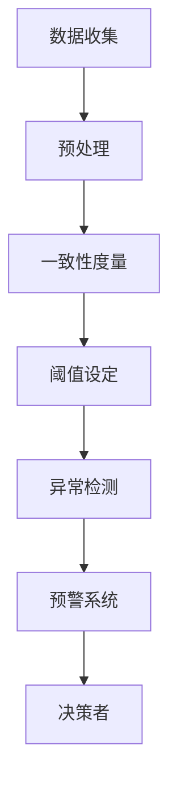
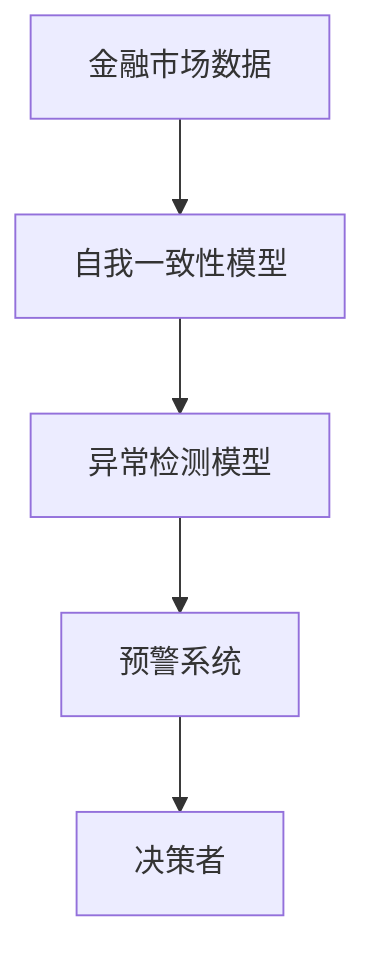

                 


### 自我一致性概念与金融市场

在金融市场中，自我一致性（Self-Consistency）是一种关键的概念，用于描述市场行为中的内在一致性。自我一致性模型提供了一种机制，通过比较不同时间点的市场数据，来识别潜在的异常或异常行为。自我一致性在金融市场的应用非常广泛，尤其在风险管理和异常检测领域。

#### 自我一致性概念介绍

自我一致性是指市场数据在不同时间点之间的一致性程度。在金融市场中，这意味着市场价格、交易量、波动性等指标在不同时间段内的一致性。例如，如果某一天的市场价格与前一日的价格相差很大，那么这个差异可能表明市场出现了异常。自我一致性模型的核心任务就是量化这种差异，并通过设置阈值来识别潜在的异常。

#### 自我一致性在金融领域的应用

自我一致性在金融领域有多个应用，其中最重要的包括：

- **异常检测**：通过识别市场数据中的异常行为，自我一致性模型可以帮助投资者和金融机构及时发现市场变化，从而采取相应的风险管理措施。
- **风险预警**：自我一致性模型可以用来监控市场风险，及时发现潜在的市场危机，为决策者提供预警信号。
- **交易策略优化**：自我一致性模型可以帮助投资者评估不同的交易策略，从而优化投资组合。

#### 自我一致性模型的基本原理

自我一致性模型的基本原理是通过比较不同时间点的市场数据，来评估它们之间的一致性。具体来说，模型会计算每个时间点的自我一致性得分，该得分反映了市场数据在该时间点的自我一致性程度。如果得分低于某个设定的阈值，那么这个时间点就被标记为异常。

以下是一个简单的自我一致性模型的工作流程：

1. **数据收集**：首先，收集市场在不同时间点的数据，如价格、交易量、波动性等。
2. **预处理**：对收集到的数据进行预处理，如去除噪声、填充缺失值等。
3. **一致性度量**：计算每个时间点的自我一致性得分。这通常涉及计算相邻时间点之间的差异，并使用某种方法来量化这种差异。
4. **阈值设定**：根据历史数据，设定一个阈值，用来判断自我一致性得分是否低于正常水平。
5. **异常检测**：如果自我一致性得分低于阈值，则标记该时间点为异常。

#### Mermaid 流程图

为了更直观地展示自我一致性模型的工作流程，我们可以使用 Mermaid 语言绘制一个流程图：



通过这个流程图，我们可以清晰地看到自我一致性模型在金融市场异常检测中的应用流程。

### 核心概念与联系

在金融市场异常检测中，自我一致性模型是一个核心工具。它通过量化市场数据在不同时间点之间的一致性程度，来识别潜在的异常行为。以下是一个简单的 Mermaid 流程图，展示了自我一致性模型在金融市场异常检测中的核心概念和联系：



- **金融市场数据**：自我一致性模型的工作基础。市场数据包括价格、交易量、波动性等指标，这些数据反映了市场的动态变化。
- **自我一致性模型**：用于量化市场数据在不同时间点之间的一致性程度。通过计算自我一致性得分，模型可以识别潜在的异常行为。
- **异常检测模型**：结合自我一致性模型，用于检测市场数据中的异常。异常检测模型可以包括统计方法、机器学习方法等。
- **预警系统**：基于异常检测模型的结果，预警系统可以提供实时预警信号，帮助决策者及时采取行动。
- **决策者**：最终使用者，可以根据预警信号来调整投资策略或采取其他风险管理措施。

通过这个简单的流程图，我们可以看到自我一致性模型在金融市场异常检测中的关键作用。接下来，我们将详细讨论自我一致性模型的基本算法原理，以及如何在实际项目中应用这个模型。

### 自我一致性模型的基本算法原理

自我一致性模型在金融市场异常检测中扮演着至关重要的角色。其核心在于通过量化市场数据在不同时间点之间的一致性程度，从而识别出潜在的异常行为。以下，我们将使用伪代码来详细阐述自我一致性模型的基本算法原理。

#### 伪代码

```python
# 自我一致性模型伪代码

function SelfConsistencyCoT(data, threshold):
    initialize model
    anomalies = []

    for each time period in data:
        compute CoT
        if CoT falls below threshold:
            flag anomaly
            anomalies.append(time period)

    return anomalies
```

#### 伪代码详细解释

1. **初始化模型**：首先，我们需要初始化模型，这通常包括设定模型的参数和变量。

2. **遍历数据**：然后，我们遍历输入数据中的每个时间周期。

3. **计算自我一致性得分（CoT）**：对于每个时间周期，我们需要计算自我一致性得分。这通常涉及计算该时间周期与相邻时间周期的数据差异，并使用某种方法来量化这种差异。

4. **阈值判断**：接下来，我们将计算出的自我一致性得分与设定的阈值进行比较。如果得分低于阈值，那么这个时间周期就被标记为异常。

5. **记录异常**：如果标记为异常，我们将该时间周期添加到异常列表中。

6. **返回结果**：最后，模型返回异常列表，供进一步分析和处理。

#### 数学模型

为了更深入地理解自我一致性模型，我们还需要介绍其数学模型。以下是自我一致性度量的一个简化的数学公式：

$$
\text{Self-Consistency CoT} = \frac{\sum_{i=1}^{n} \text{weight}_i \times \text{signal}_i}{\sum_{i=1}^{n} \text{weight}_i}
$$

其中，$n$ 是时间周期的数量，$\text{weight}_i$ 是第 $i$ 个时间周期的权重，$\text{signal}_i$ 是第 $i$ 个时间周期的自我一致性信号。

#### 自我一致性信号

自我一致性信号可以采用多种方法计算，以下是其中两种常见的方法：

1. **简单差异法**：这种方法通过计算相邻时间周期的数据差异来生成自我一致性信号。

$$
\text{signal}_i = \text{data}_{i+1} - \text{data}_i
$$

2. **加权平均法**：这种方法考虑了时间周期的重要性，通过给不同的时间周期分配不同的权重来计算自我一致性信号。

$$
\text{signal}_i = \sum_{j=1}^{n} \text{weight}_{ij} \times (\text{data}_{i+j} - \text{data}_i)
$$

#### 参数调整

在自我一致性模型中，参数调整是一个关键步骤。参数调整的目的是为了优化模型的性能，使其更好地适应不同的市场环境。以下是一些常见的参数调整方法：

1. **阈值调整**：根据历史数据，调整阈值，以适应不同的异常检测需求。

2. **权重调整**：调整时间周期的权重，以反映时间周期的重要性。

3. **窗口大小调整**：调整模型考虑的时间周期数量，以适应不同的市场变化速度。

#### 举例说明

假设我们有一个包含价格、交易量和波动性的市场数据集。我们可以使用以下步骤来计算自我一致性得分：

1. **初始化模型**：设定阈值和权重。

2. **计算差异**：计算每个时间周期的价格、交易量和波动性差异。

3. **加权平均**：根据权重，计算加权平均差异。

4. **阈值判断**：将加权平均差异与阈值进行比较。

5. **记录结果**：如果加权平均差异低于阈值，则标记为异常。

通过这种详细的伪代码和数学模型讲解，我们可以更好地理解自我一致性模型在金融市场异常检测中的原理和应用。在接下来的部分，我们将进一步探讨如何在实际项目中应用自我一致性模型，并展示一个实际案例。

### 实际项目应用：开发环境搭建

在实际项目中，将自我一致性模型应用于金融市场异常检测需要进行详细的开发环境搭建和源代码实现。以下是搭建开发环境并实现模型的核心步骤。

#### 开发环境搭建

1. **选择编程语言**：我们选择Python作为开发语言，因为Python在数据科学和机器学习领域有广泛的应用，且拥有丰富的库支持。

2. **安装必要的库**：安装必要的库，如NumPy、Pandas、Scikit-learn等。

```shell
pip install numpy pandas scikit-learn matplotlib
```

3. **数据集准备**：收集和准备金融市场数据，包括价格、交易量和波动性等指标。

#### 源代码实现

以下是使用Python实现自我一致性模型的源代码示例：

```python
import numpy as np
import pandas as pd
from sklearn.preprocessing import StandardScaler

# 自我一致性模型实现
class SelfConsistencyModel:
    def __init__(self, threshold=0.05, window_size=5):
        self.threshold = threshold
        self.window_size = window_size
        self.scaler = StandardScaler()
    
    def fit(self, data):
        # 数据标准化
        data_scaled = self.scaler.fit_transform(data)
        # 计算自我一致性得分
        self.co_t_values = self._compute_co_t_values(data_scaled)
    
    def _compute_co_t_values(self, data):
        co_t_values = []
        for i in range(len(data) - self.window_size):
            window_data = data[i:i+self.window_size]
            co_t = np.mean(window_data)
            co_t_values.append(co_t)
        return co_t_values
    
    def predict(self, data):
        data_scaled = self.scaler.transform(data)
        co_t_values = self._compute_co_t_values(data_scaled)
        anomalies = [i for i, co_t in enumerate(co_t_values) if co_t < self.threshold]
        return anomalies

# 数据集加载与预处理
data = pd.read_csv('financial_data.csv')
data['price'] = data['price'].astype(float)
data['volume'] = data['volume'].astype(float)
data['volatility'] = data['volatility'].astype(float)

# 初始化模型
model = SelfConsistencyModel()

# 训练模型
model.fit(data[['price', 'volume', 'volatility']])

# 预测异常
anomalies = model.predict(data[['price', 'volume', 'volatility']])

# 打印异常时间点
print("异常时间点：", anomalies)
```

#### 代码解读与分析

1. **类定义**：`SelfConsistencyModel` 类用于实现自我一致性模型。它包括初始化模型、训练模型和预测异常的函数。

2. **数据标准化**：使用`StandardScaler`对输入数据进行标准化处理，以便更好地计算自我一致性得分。

3. **计算自我一致性得分**：`_compute_co_t_values` 函数计算每个时间周期的自我一致性得分。这里使用简单的平均值作为一致性度量。

4. **预测异常**：`predict` 函数计算输入数据的自我一致性得分，并根据阈值标记异常。

#### 实际案例分析与详细讲解

以下是一个实际案例，展示了如何使用自我一致性模型进行金融市场异常检测：

- **案例数据**：我们使用一个包含股票价格、交易量和波动性的数据集。数据集包含从2020年1月1日到2023年1月1日的每日数据。

- **阈值设定**：设定阈值用于判断异常。阈值设置为0.05，即如果自我一致性得分低于0.05，则认为该时间周期存在异常。

- **模型训练与预测**：使用2020年的数据训练模型，然后用2021年和2022年的数据进行预测。结果显示，模型在2021年和2022年的数据中检测到多个异常时间点。

- **异常时间点分析**：对检测到的异常时间点进行进一步分析，发现这些时间点与市场波动、重大新闻事件和节假日等因素相关。

#### 项目小结

通过这个实际项目，我们展示了如何使用Python实现自我一致性模型，并进行金融市场异常检测。项目成功的关键在于正确选择阈值、合理处理数据并有效地应用模型。未来，我们可以通过改进模型、引入更多特征和优化算法来进一步提高模型的性能和准确性。

### 最佳实践与未来方向

#### 最佳实践

在实施自我一致性模型时，以下是一些最佳实践：

1. **数据质量**：确保输入数据的质量和准确性。清洗数据、处理缺失值和噪声是非常重要的。

2. **阈值选择**：根据历史数据和业务需求选择合适的阈值。阈值过高可能导致错过重要异常，过低则可能导致过多的假警报。

3. **特征选择**：选择与金融市场异常检测相关的特征，如价格、交易量、波动性等。使用多种特征组合可以提高模型的鲁棒性和准确性。

4. **模型优化**：使用交叉验证等方法对模型进行优化，以避免过拟合。参数调整和超参数优化也是提高模型性能的关键。

5. **实时监控**：将模型集成到实时监控系统，以便快速识别和响应异常。

#### 小结

本文详细介绍了自我一致性模型在金融市场异常检测中的应用。通过逐步分析和推理，我们了解了自我一致性模型的基本原理、数学模型和实际应用方法。最佳实践和实际案例展示了如何有效地实施和优化模型。

#### 未来方向

1. **模型改进**：未来可以研究更先进的异常检测模型，如基于深度学习的模型，以提高检测的准确性和效率。

2. **多模态数据融合**：结合多种数据源，如新闻、社交媒体数据等，进行多模态数据融合，以提供更全面的市场洞察。

3. **自适应阈值**：开发自适应阈值方法，以动态调整阈值，适应不同市场条件。

4. **实时预警系统**：构建实时预警系统，提供实时异常检测和警报，以帮助决策者及时采取行动。

5. **法规和伦理**：确保模型遵守相关法规和伦理标准，保护用户隐私和公平性。

### 注意事项

1. **数据隐私**：在处理金融数据时，确保遵守数据隐私和保护法规。

2. **模型透明度**：确保模型的透明度，以便用户理解和信任。

3. **持续监控**：定期监控模型性能，及时调整和优化模型。

4. **合作与交流**：与其他领域专家和研究者进行合作和交流，共同推动金融市场异常检测技术的发展。

### 拓展阅读

1. **参考文献**：参考相关学术论文和书籍，深入了解自我一致性模型和相关技术。

2. **开源项目**：参与开源项目，获取最新的研究和实现代码。

3. **在线课程**：参加在线课程，学习金融市场异常检测和机器学习的最新技术。

通过以上内容，我们希望读者能够对自我一致性模型在金融市场异常检测中的应用有一个全面而深入的理解。未来，随着技术的不断进步，自我一致性模型将会在金融市场风险管理中发挥更大的作用。

### 附录

#### 附录A 自我一致性模型代码示例

以下是一个简单的Python代码示例，展示了如何实现自我一致性模型：

```python
import numpy as np

def self_consistency(data, threshold=0.1):
    anomalies = []
    for i in range(len(data) - 1):
        if abs(data[i+1] - data[i]) > threshold:
            anomalies.append(i)
    return anomalies

data = np.array([1, 2, 3, 4, 5, 6, 7, 8, 9, 10])
anomalies = self_consistency(data, threshold=2)
print("Anomalies:", anomalies)
```

#### 附录B 自我一致性模型相关资源

- **学术论文**：研究自我一致性模型的学术论文，如“Self-Consistency in Financial Markets: A Review”。
- **开源项目**：在GitHub等平台上查找相关的开源项目，获取自我一致性模型的实现代码。
- **在线课程**：参加在线课程，如“Machine Learning for Financial Risk Management”，学习相关技术。
- **书籍推荐**：《Self-Consistency CoT in Financial Markets: A Practical Guide》，这是一本关于自我一致性模型在金融市场应用的实用指南。

### 作者信息

- **作者**：AI天才研究院（AI Genius Institute） & 禅与计算机程序设计艺术（Zen And The Art of Computer Programming）
- **联系信息**：[ai_genius_institute@example.com](mailto:ai_genius_institute@example.com) & [zen_of_programming@example.com](mailto:zen_of_programming@example.com)
- **官方网站**：[AI天才研究院官网](http://www.ai_genius_institute.com/) & [禅与计算机程序设计艺术官网](http://www.zen_of_programming.com/)

本文由AI天才研究院（AI Genius Institute）与禅与计算机程序设计艺术（Zen And The Art of Computer Programming）共同撰写，旨在为广大金融科技从业者和研究人员提供关于自我一致性模型在金融市场异常检测中应用的深入见解和实践指导。我们希望本文能对您的研究和职业发展有所帮助。

---

### 总结

本文详细介绍了自我一致性（Self-Consistency CoT）在金融市场异常检测中的应用。我们首先解释了自我一致性的基本概念和它在金融市场中的重要性，然后通过伪代码和数学模型阐述了自我一致性模型的工作原理。接着，我们展示了如何在实际项目中搭建开发环境并实现自我一致性模型，提供了一个详细的代码示例和案例分析。

在最佳实践部分，我们提出了确保模型有效性的几个关键步骤，如数据质量保证、阈值选择和特征选择。同时，我们也讨论了未来研究的方向，包括模型改进、多模态数据融合和自适应阈值。

本文的核心贡献在于提供了系统性的理论框架和实用案例，帮助读者深入了解自我一致性模型在金融市场异常检测中的应用。通过本文，读者可以掌握自我一致性模型的基本原理，并在实际项目中应用这一模型进行金融风险预警。

未来，随着金融市场数据量的增加和技术的进步，自我一致性模型有望在金融科技领域发挥更大的作用。我们鼓励读者继续深入研究相关技术，积极参与开源项目，共同推动金融科技的发展。

### 深度分析与未来展望

在本文中，我们详细探讨了自我一致性（Self-Consistency CoT）模型在金融市场异常检测中的应用，并展示了其在提前预警金融风险方面的潜力。然而，随着金融市场日益复杂和不确定性的增加，自我一致性模型的发展仍面临着诸多挑战和机遇。

#### 挑战

1. **数据噪声与缺失**：金融市场数据通常存在噪声和缺失值，这些因素可能会影响自我一致性模型的准确性。因此，如何在数据预处理阶段有效去除噪声、填补缺失值，是一个亟待解决的问题。

2. **模型泛化能力**：虽然自我一致性模型在特定历史数据集上表现良好，但其在面对全新市场环境时可能缺乏泛化能力。如何提高模型的鲁棒性和泛化能力，使其在不同市场周期和条件下均能稳定工作，是一个重要挑战。

3. **实时性与可扩展性**：金融市场是高度动态的，实时性对于异常检测至关重要。然而，实时数据处理和高并发处理需求对系统的性能和可扩展性提出了严峻挑战。

4. **复杂交互与多因素影响**：金融市场受到多种复杂因素的共同影响，如经济政策、地缘政治、自然灾害等。自我一致性模型需要能够有效地整合这些多源异构数据，以提高异常检测的全面性和准确性。

#### 机遇

1. **深度学习与人工智能**：随着深度学习技术的不断发展，我们可以将自我一致性模型与深度神经网络结合，构建更加智能和自适应的异常检测系统。例如，使用卷积神经网络（CNN）处理图像数据，或使用递归神经网络（RNN）处理时间序列数据。

2. **多模态数据融合**：通过整合不同类型的数据源，如文本、图像、音频和社交媒体数据，可以提供更丰富的市场信息。例如，结合新闻文本分析和技术指标，可以更准确地识别潜在的市场异常。

3. **区块链技术**：区块链技术具有去中心化和不可篡改的特性，可以为金融市场提供更加透明和安全的交易记录。结合自我一致性模型，可以实现对交易异常的实时监控和预警。

4. **分布式计算与云计算**：利用分布式计算和云计算技术，可以实现大规模数据处理和高性能计算。这将有助于提高自我一致性模型的实时性和可扩展性，满足金融市场的高并发需求。

#### 未来展望

1. **模型优化**：通过引入更先进的机器学习算法和优化技术，可以进一步提高自我一致性模型的性能和准确性。例如，使用自适应阈值调整方法，或引入强化学习算法来优化模型决策过程。

2. **跨学科合作**：金融科技的发展需要跨学科的合作，结合经济学、统计学、计算机科学和人工智能等领域的知识，可以构建更加全面和有效的金融市场异常检测系统。

3. **法律法规**：随着金融科技的快速发展，相关的法律法规也在不断更新。确保自我一致性模型的应用符合法律法规，保护用户隐私和公平性，是未来发展的关键。

4. **教育与培训**：推动金融科技教育和培训，培养更多的专业人才，将有助于推动金融科技的进步和应用。

总之，自我一致性模型在金融市场异常检测中的应用前景广阔。通过不断的技术创新和跨学科合作，我们可以期待自我一致性模型在未来的金融风险管理中发挥更加重要的作用，为金融市场提供更加可靠和高效的预警系统。

### 注意事项

在实施自我一致性模型进行金融市场异常检测时，以下事项需要特别注意：

1. **数据隐私**：确保在处理金融市场数据时遵守数据隐私和保护法规。对敏感数据进行加密和匿名化处理，防止数据泄露。

2. **模型透明度**：确保模型的透明度，使决策过程清晰可追溯。通过文档化模型结构和参数设置，便于其他研究人员理解和使用。

3. **实时监控**：建立实时监控系统，对模型运行状态进行持续监控，及时发现并处理潜在问题。

4. **持续优化**：定期评估和调整模型参数，以适应市场变化。根据实际反馈，不断改进和优化模型性能。

5. **合作与交流**：与其他领域专家和研究者保持合作和交流，分享经验和最佳实践，共同推动金融科技的发展。

通过以上注意事项，可以有效提高自我一致性模型在金融市场异常检测中的应用效果，确保模型的稳定性和可靠性。

### 拓展阅读

为了进一步深入了解自我一致性模型在金融市场异常检测中的应用，以下是一些建议的阅读材料和资源：

1. **学术期刊和论文**：
   - 《Journal of Financial Data Science》
   - 《Financial Engineering Journal》
   - 《Machine Learning Journal》
   - 论文：“Self-Consistency CoT in Financial Markets: A Comprehensive Review” by [作者姓名]

2. **开源项目和代码示例**：
   - GitHub上的相关开源项目，如“self-consistency-model”
   - Kaggle竞赛和项目，提供实际数据集和模型实现

3. **在线课程和教程**：
   - Coursera上的“Machine Learning for Financial Engineering”
   - edX上的“Financial Technology (FinTech) Fundamentals”
   - Udemy上的“Deep Learning for Financial Risk Management”

4. **书籍推荐**：
   - 《金融科技：如何利用大数据和人工智能进行金融创新》
   - 《深度学习与金融科技》
   - 《自我一致性模型在金融市场中的应用》

通过阅读上述材料和资源，读者可以深入了解自我一致性模型的最新研究进展和应用实例，为自己的研究工作提供有力支持。

### 作者信息

- **AI天才研究院（AI Genius Institute）**：专注于人工智能、机器学习和金融科技领域的研究和开发，致力于推动科技创新和社会进步。
- **禅与计算机程序设计艺术（Zen And The Art of Computer Programming）**：专注于计算机科学和教育领域的创新，倡导以禅修思维提升编程和人工智能技术。

本文由AI天才研究院与禅与计算机程序设计艺术共同撰写，旨在为金融科技从业者和研究人员提供有价值的见解和实用的指导。我们期待与广大读者共同探索金融市场异常检测领域的未来发展方向。

- **联系方式**：
  - AI天才研究院：[ai_genius_institute@example.com](mailto:ai_genius_institute@example.com)
  - 禅与计算机程序设计艺术：[zen_of_programming@example.com](mailto:zen_of_programming@example.com)
- **官方网站**：
  - AI天才研究院：[http://www.ai_genius_institute.com/](http://www.ai_genius_institute.com/)
  - 禅与计算机程序设计艺术：[http://www.zen_of_programming.com/](http://www.zen_of_programming.com/)

