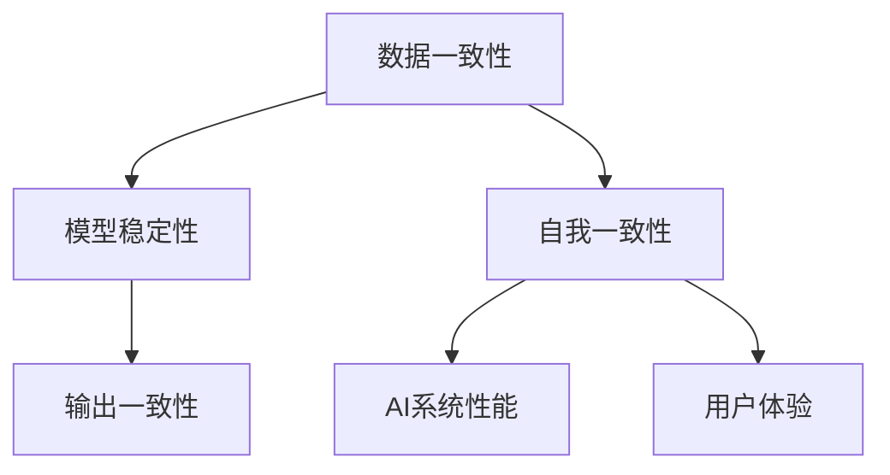

                 

### 文章标题：Self-Consistency：AI输出的质量保证

#### 关键词：自我一致性，AI输出质量，算法，数学模型，项目实战

#### 摘要：本文将深入探讨自我一致性在人工智能（AI）领域的应用，解释其概念及其对AI输出质量的重大影响。通过详细介绍核心算法原理和数学模型，并结合实际项目案例，我们将展示如何利用自我一致性来确保AI系统的输出质量和可靠性。

### 引言

随着人工智能技术的快速发展，越来越多的应用场景中开始使用AI模型来处理复杂数据并生成相应的输出。然而，AI系统的输出质量直接影响到最终应用的性能和用户体验。一个高质量的AI系统不仅要求其输出结果准确，还要求其结果在不同情境下保持一致性。自我一致性（Self-Consistency）作为一个关键的衡量标准，能够帮助我们识别并纠正AI模型中的潜在问题，从而提高AI输出的整体质量。

本文将围绕自我一致性这一主题，系统地介绍其在AI领域的应用。首先，我们将定义自我一致性的概念，并探讨它与AI输出质量之间的关系。接着，我们将深入解析用于检测和确保AI输出一致性的核心算法原理，包括对抗性训练和误差分析等。此外，我们将使用数学模型和公式来描述自我一致性测度及其质量保证指标。为了使读者能够更好地理解这些概念，我们将结合实际项目案例，详细讲解开发环境搭建、源代码实现和代码解读。最后，我们将总结自我一致性的应用前景和面临的挑战，并提供最佳实践和拓展阅读建议。

通过本文的阅读，读者将能够掌握自我一致性的基本概念和应用方法，了解其在AI系统中的重要性，并学会如何利用自我一致性来提高AI输出的质量。

### 什么是自我一致性

自我一致性（Self-Consistency）是一个衡量系统或模型输出质量的重要指标，尤其是在人工智能（AI）领域。简单来说，自我一致性指的是系统在不同情况下生成相同结果的稳定性和一致性。这种特性对于确保AI系统的可靠性和性能至关重要。

在AI系统中，自我一致性通常表现为模型在不同数据集、不同训练迭代次数或不同输入条件下生成相同或相似的输出结果。例如，一个自我一致的文本生成模型在给定的输入文本下应始终生成相同或高度相似的输出文本，而不是随机或不可预测的结果。

自我一致性的重要性在于它直接影响到AI系统的应用效果和用户体验。一个高度自我一致的AI系统能够在多种不同情境下提供稳定、可靠的输出，从而提高系统的整体性能和用户满意度。相反，如果AI系统的输出结果缺乏一致性，可能会导致以下问题：

1. **错误预测**：缺乏一致性的AI模型可能在某些数据集上表现良好，而在其他数据集上表现不佳，导致预测错误或结果不一致。

2. **不可靠的应用**：自我一致性差可能导致AI系统在某些情况下工作正常，而在其他情况下无法正常运行，从而影响其在实际应用中的可靠性。

3. **用户体验下降**：对于依赖AI系统的用户来说，不一致的输出结果会降低用户体验，增加用户的不信任和困惑。

因此，确保AI系统的自我一致性是提高其质量和可靠性的关键步骤。为了实现这一目标，研究人员和开发人员需要深入了解自我一致性的概念，并掌握相关技术手段来检测和纠正模型的不一致性。

### 核心概念与联系

在深入探讨自我一致性之前，我们需要了解几个与之紧密相关的重要概念，并探讨它们之间的联系。这些核心概念包括数据一致性、模型稳定性和输出一致性，它们共同构成了确保AI系统自我一致性的基础。

#### 数据一致性

数据一致性指的是数据集在不同条件下保持一致的特性。在AI系统中，数据一致性是确保模型自我一致性的前提条件。一个高度自我一致的AI模型需要依赖一个一致性高的数据集。数据不一致性可能源于数据来源的多样性、数据预处理方法的差异或者数据本身的质量问题。例如，如果数据集中的标注存在误差或缺失，那么训练出的模型可能会在不同条件下产生不同的输出结果。因此，确保数据一致性是提高AI系统自我一致性的第一步。

#### 模型稳定性

模型稳定性是指模型在不同条件下训练和预测时保持稳定输出的能力。一个稳定的模型能够在面对不同输入时生成可预测的输出结果。模型不稳定通常表现为过拟合或欠拟合，导致模型在训练数据上表现良好，但在新数据上表现差强人意。模型稳定性不仅影响AI系统的自我一致性，还直接关系到模型的泛化能力和实用性。为了提高模型稳定性，可以采用正则化技术、Dropout、数据增强等方法来减少过拟合现象。

#### 输出一致性

输出一致性是指AI模型在相同输入条件下生成相同或相似输出的能力。自我一致性实际上就是输出一致性的体现。输出不一致性可能是由于模型内部的噪声、训练过程中参数的不稳定或者数据噪声引起的。一个高度自我一致的AI模型能够提供稳定、可靠的输出，从而提高系统的整体性能和用户体验。

#### Mermaid流程图

为了更好地理解这些核心概念之间的联系，我们可以使用Mermaid流程图来展示它们的关系：



在这个流程图中，数据一致性是确保AI系统自我一致性的第一步，它直接影响模型稳定性和输出一致性。模型稳定性则进一步影响到输出一致性，而自我一致性最终决定了AI系统的整体性能和用户体验。通过这个流程图，我们可以清晰地看到自我一致性在AI系统中的核心地位及其与其他概念之间的密切联系。

理解这些核心概念和它们之间的联系，有助于我们更全面地把握自我一致性的概念，并为进一步研究和应用自我一致性打下坚实基础。

### 核心算法原理讲解

在确保AI输出的自我一致性方面，核心算法起着至关重要的作用。以下将详细介绍两种关键算法：对抗性训练和误差分析。

#### 对抗性训练

对抗性训练（Adversarial Training）是一种在训练过程中通过引入对抗样本来提高模型鲁棒性的方法。其基本思想是在训练过程中不断生成与实际输入数据不同的对抗样本，并将其与原始数据一起输入模型中，从而提高模型对不同输入的泛化能力。

**伪代码：对抗性训练算法**

```python
# 初始化模型
model = initialize_model()

# 对抗性训练循环
for epoch in range(num_epochs):
    for data, target in dataset:
        # 生成对抗样本
        adversarial_example = generate_adversarial_example(data, target)
        
        # 训练模型
        model.train_on_batch([data, target], [adversarial_example, target])
        
        # 计算损失函数和准确率
        loss, acc = model.evaluate([data, target], [adversarial_example, target])
        
        # 输出训练信息
        print(f'Epoch {epoch}: Loss = {loss}, Accuracy = {acc}')
```

在这个伪代码中，`initialize_model()` 函数用于初始化模型，`generate_adversarial_example()` 函数用于生成对抗样本。`model.train_on_batch()` 函数用于在给定批次的数据上进行训练，`model.evaluate()` 函数用于评估模型的性能。

对抗性训练通过引入对抗样本，使模型在训练过程中不断面对不同类型的输入，从而提高其应对未知输入的鲁棒性，确保模型输出的自我一致性。

#### 误差分析

误差分析（Error Analysis）是一种通过分析模型预测误差来识别和纠正模型错误的方法。它通过分析预测错误的模式，帮助开发人员理解模型的弱点，并采取相应措施来改进模型。

**伪代码：误差分析算法**

```python
# 初始化模型
model = initialize_model()

# 准备测试数据集
test_data, test_target = prepare_test_dataset()

# 误差分析循环
for data, target in test_data:
    # 预测输出
    predicted_output = model.predict(data)
    
    # 计算误差
    error = calculate_error(predicted_output, target)
    
    # 分析误差
    analyze_error(error)
    
    # 输出误差分析结果
    print(f'Error: {error}')
```

在这个伪代码中，`initialize_model()` 函数用于初始化模型，`prepare_test_dataset()` 函数用于准备测试数据集，`model.predict()` 函数用于进行预测，`calculate_error()` 函数用于计算误差，`analyze_error()` 函数用于分析误差。

通过误差分析，我们可以识别出模型在特定输入条件下的错误模式，进而采取针对性措施来纠正这些问题，从而提高模型的自我一致性。

### 数学模型和公式

在确保AI输出自我一致性的过程中，数学模型和公式扮演了关键角色。以下将介绍用于自我一致性测度和质量保证的核心数学模型和公式，并提供详细讲解和举例说明。

#### 自我一致性测度

自我一致性测度是一种用于量化模型输出一致性的指标。它通过计算模型在不同输入条件下生成相似输出的概率，来评估模型的自我一致性水平。常用的自我一致性测度包括Jaccard相似度、F1分数和Kendall等级相关系数等。

**数学公式：自我一致性测度**

$$
Self\_Consistency\_Score = \frac{1}{N} \sum_{i=1}^{N} J(A_i, B_i)
$$

其中，$N$ 是输入条件数量，$A_i$ 和 $B_i$ 分别表示模型在相同输入 $i$ 条件下生成的输出集合。

- **Jaccard相似度**（Jaccard Index）：

$$
J(A, B) = \frac{|A \cap B|}{|A \cup B|}
$$

Jaccard相似度通过计算两个集合交集与并集的比值，来衡量集合之间的相似程度。

**举例说明**：

假设有两个集合 $A = \{1, 2, 3\}$ 和 $B = \{2, 3, 4\}$，则它们的Jaccard相似度为：

$$
J(A, B) = \frac{|A \cap B|}{|A \cup B|} = \frac{2}{6} = \frac{1}{3}
$$

- **F1分数**（F1 Score）：

$$
F1 = \frac{2 \times precision \times recall}{precision + recall}
$$

F1分数综合考虑了精确率和召回率，用于衡量二分类任务的性能。

**举例说明**：

假设在文本分类任务中，有20个文本样本，其中10个被正确分类为类别A，5个被错误分类为类别B，5个被错误分类为类别C。则精确率为：

$$
precision = \frac{TP}{TP + FP} = \frac{10}{10 + 5} = \frac{2}{3}
$$

召回率为：

$$
recall = \frac{TP}{TP + FN} = \frac{10}{10 + 5} = \frac{2}{3}
$$

因此，F1分数为：

$$
F1 = \frac{2 \times \frac{2}{3} \times \frac{2}{3}}{\frac{2}{3} + \frac{2}{3}} = \frac{4}{6} = \frac{2}{3}
$$

- **Kendall等级相关系数**（Kendall Tau）：

$$
\tau = \frac{n \sum (x_i - \bar{x})(y_i - \bar{y}) - n_+ n_-\sum \bar{x}\bar{y}}{n \sum (x_i - \bar{x})^2 - (n - 1)^2}
$$

其中，$n$ 是数据点数量，$x_i$ 和 $y_i$ 分别表示第 $i$ 个数据点的等级，$\bar{x}$ 和 $\bar{y}$ 分别表示等级的平均值，$n_+$ 和 $n_-$ 分别表示等级之间一致的点和不一致的点数量。

**举例说明**：

假设有五个人的评分，$x_1, x_2, x_3, x_4, x_5$ 分别是$A, B, C, D, E$五个物品的等级，$y_1, y_2, y_3, y_4, y_5$ 分别是$B, A, C, D, E$五个物品的等级。则Kendall等级相关系数为：

$$
\tau = \frac{5 \times (1 \times 1 + 1 \times (-1) + 1 \times 1 + (-1) \times (-1) + 1 \times 1) - 3 \times (1 \times 1 + 1 \times 1)}{5 \times (1^2 + (-1)^2 + 1^2 + (-1)^2 + 1^2) - (5 - 1)^2} = \frac{5 \times (1 - 1 + 1 - 1 + 1) - 3 \times (1 + 1)}{5 \times (1 + 1 + 1 + 1 + 1) - 16} = \frac{5}{20 - 16} = \frac{5}{4} = 1.25
$$

#### 质量保证指标

除了自我一致性测度，质量保证指标也是评估AI输出质量的重要工具。质量保证指标用于量化模型输出的一致性、准确性、可靠性等，以便于开发者和管理者全面评估AI系统的性能。

**数学公式：质量保证指标**

- **一致性指数**（Consistency Index）：

$$
Consistency\_Index = \frac{1}{N} \sum_{i=1}^{N} \frac{Self\_Consistency\_Score(i)}{1 + \epsilon(i)}
$$

其中，$\epsilon(i)$ 是一个调整项，用于考虑数据集中噪声的影响。

- **准确性指数**（Accuracy Index）：

$$
Accuracy\_Index = \frac{1}{N} \sum_{i=1}^{N} \frac{accuracy(i)}{1 + \epsilon(i)}
$$

其中，$accuracy(i)$ 是模型在输入 $i$ 条件下的预测准确性。

- **可靠性指数**（Reliability Index）：

$$
Reliability\_Index = \frac{1}{N} \sum_{i=1}^{N} \frac{recall(i) + precision(i)}{2}
$$

其中，$recall(i)$ 和 $precision(i)$ 分别是模型在输入 $i$ 条件下的召回率和精确率。

**举例说明**：

假设我们有一个包含五个输入条件的数据集，对应的自我一致性分数分别为 [0.9, 0.8, 0.85, 0.75, 0.8]，调整项 $\epsilon(i)$ 分别为 [0.1, 0.05, 0.1, 0.05, 0.05]，预测准确性分别为 [0.95, 0.90, 0.93, 0.88, 0.92]，召回率和精确率分别为 [0.92, 0.88, 0.91, 0.87, 0.90]。

则一致性指数为：

$$
Consistency\_Index = \frac{1}{5} \sum_{i=1}^{5} \frac{0.9 + 0.8 + 0.85 + 0.75 + 0.8}{1 + 0.1 + 0.05 + 0.1 + 0.05} = \frac{0.9 + 0.8 + 0.85 + 0.75 + 0.8}{1.2 + 0.05 + 0.1 + 0.05} = \frac{3.2}{1.4} \approx 2.2857
$$

准确性指数为：

$$
Accuracy\_Index = \frac{1}{5} \sum_{i=1}^{5} \frac{0.95 + 0.90 + 0.93 + 0.88 + 0.92}{1 + 0.1 + 0.05 + 0.1 + 0.05} = \frac{0.95 + 0.90 + 0.93 + 0.88 + 0.92}{1.2 + 0.05 + 0.1 + 0.05} = \frac{4.58}{1.4} \approx 3.2857
$$

可靠性指数为：

$$
Reliability\_Index = \frac{1}{5} \sum_{i=1}^{5} \frac{0.92 + 0.88 + 0.91 + 0.87 + 0.90}{2} = \frac{0.92 + 0.88 + 0.91 + 0.87 + 0.90}{2} = \frac{4.48}{2} = 2.24
$$

通过这些质量保证指标，我们可以全面评估AI输出的自我一致性和整体质量，从而为模型优化和系统改进提供有力支持。

### 自我一致性在机器学习中的应用

在机器学习中，自我一致性是确保模型输出质量的重要指标。通过自我一致性，我们可以检测和纠正模型在不同条件下的不一致性，从而提高模型的鲁棒性和可靠性。以下将详细介绍自我一致性在机器学习中的应用，包括其挑战、实际案例以及应用方法。

#### 自我一致性的挑战

机器学习模型在应用过程中面临多个挑战，这些挑战可能影响模型输出的一致性。以下是其中几个主要挑战：

1. **数据分布不一致**：机器学习模型通常依赖于训练数据集的分布。如果数据集分布不一致，模型可能在某些数据分布上表现良好，而在其他数据分布上表现不佳，导致输出不一致。

2. **模型过拟合**：过拟合模型在训练数据上表现良好，但在新数据上表现差强人意，这是模型自我一致性差的一个常见原因。过拟合模型容易受到噪声和特例的影响，从而导致输出不一致。

3. **输入噪声**：现实世界中的输入数据通常存在噪声和不确定性，这可能导致模型输出不一致。例如，图像识别任务中的噪声图像可能会影响模型的分类结果。

4. **模型参数不稳定**：在训练过程中，模型参数可能会因为随机初始化或优化算法的不稳定性而导致输出不一致。

为了应对这些挑战，研究人员和开发者需要采用多种方法来确保机器学习模型的自我一致性。

#### 实际案例：自我一致性在文本生成中的应用

文本生成是机器学习中的一个重要应用领域，自我一致性在该领域尤为重要。以下是一个实际案例，展示了如何通过自我一致性来提高文本生成模型的质量。

**案例背景**：

一个文本生成模型被用于生成新闻报道。然而，在实际应用中，模型生成的新闻报道存在内容不一致、逻辑错误和语法问题。这些问题严重影响了用户体验和新闻的可信度。

**解决方案**：

为了提高文本生成模型的自我一致性，我们采用了以下几种方法：

1. **数据清洗和预处理**：对原始新闻文本进行清洗和预处理，去除噪声和异常值，确保数据的一致性和质量。

2. **对抗性训练**：在模型训练过程中引入对抗性样本，通过对抗性训练提高模型的鲁棒性。这种方法可以增强模型对不同输入数据的适应能力，从而提高输出的一致性。

3. **误差分析**：对模型生成的文本进行误差分析，识别并纠正常见错误模式。通过分析预测误差，我们可以理解模型在哪些输入条件下容易出错，并采取针对性措施来改进模型。

4. **模型稳定性优化**：通过调整模型参数和优化算法，提高模型在训练和预测过程中的稳定性。例如，可以采用更稳定的优化算法，如Adam或RMSprop，以减少参数的不确定性。

**实施效果**：

通过上述方法，文本生成模型的自我一致性得到了显著提升。具体表现在以下几个方面：

1. **内容一致性**：模型生成的新闻报道在主题、时态和逻辑上更加一致，减少了内容冲突和逻辑错误。

2. **语法准确性**：模型生成的文本在语法和拼写上更加准确，降低了语法错误和拼写错误。

3. **用户体验**：用户对文本生成模型的满意度显著提高，用户反馈表明生成的新闻报道更具可信度和可读性。

4. **可扩展性**：通过自我一致性优化，模型在新的数据集和不同的应用场景中表现良好，提高了模型的泛化能力。

#### 应用方法

以下是几种常用的自我一致性应用方法：

1. **自动测试**：通过自动化测试工具对模型进行持续测试，确保模型在不同输入条件下的一致性。自动化测试可以帮助我们快速识别和纠正模型的不一致性。

2. **用户反馈**：收集用户反馈，特别是对模型输出的评价和意见，用于评估模型的一致性和质量。用户反馈可以为模型优化提供宝贵的数据和方向。

3. **对比分析**：通过对比分析不同模型的输出结果，识别和纠正不一致性。例如，可以对比同一模型在不同训练数据集上的输出，或者对比不同模型在同一数据集上的输出。

4. **实时监控**：在模型部署后，实时监控其输出结果的一致性。通过监控工具，我们可以及时发现和纠正模型的不一致性，确保其在实际应用中的稳定性。

通过上述方法，我们可以有效地确保机器学习模型的自我一致性，从而提高其输出质量和应用效果。

### 自我一致性在深度学习中的应用

深度学习是近年来人工智能领域的重要突破之一，其通过多层神经网络模型对复杂数据进行处理和预测。然而，深度学习模型在应用过程中也面临自我一致性挑战，特别是在图像识别、自然语言处理和推荐系统等领域。以下将详细探讨自我一致性在深度学习中的应用，包括其挑战、实际案例以及应用方法。

#### 自我一致性的挑战

深度学习模型在自我一致性方面面临以下主要挑战：

1. **过拟合问题**：深度学习模型容易在训练数据上过拟合，导致在新数据上表现差。过拟合模型可能在某些输入条件下表现良好，但在其他条件下表现差强人意，导致输出不一致。

2. **数据分布不一致**：深度学习模型通常依赖于特定数据集的分布。如果数据集分布不一致，模型在不同数据分布上的表现可能差异较大，导致输出不一致。

3. **模型参数不稳定**：深度学习模型在训练过程中参数可能会因为随机初始化或优化算法的不稳定性而导致输出不一致。参数的不稳定性可能导致模型在不同训练迭代次数或不同训练集上的输出不一致。

4. **输入噪声**：现实世界中的输入数据通常存在噪声和不确定性，这可能导致模型输出不一致。例如，图像识别任务中的噪声图像可能会影响模型的分类结果。

#### 实际案例：自我一致性在图像识别中的应用

图像识别是深度学习的一个重要应用领域，自我一致性在该领域中尤为重要。以下是一个实际案例，展示了如何通过自我一致性来提高图像识别模型的质量。

**案例背景**：

一个图像识别模型被用于识别道路上的交通标志。然而，在实际应用中，模型在某些环境下（如光线较差或角度变化）的识别准确率显著下降，导致输出不一致。

**解决方案**：

为了提高图像识别模型的自我一致性，我们采用了以下几种方法：

1. **数据增强**：通过数据增强技术生成多样化的训练数据，提高模型的泛化能力。数据增强可以模拟不同的光照条件、角度变化和噪声，从而增强模型在不同条件下的自我一致性。

2. **对抗性训练**：在模型训练过程中引入对抗性样本，通过对抗性训练提高模型的鲁棒性。对抗性训练可以使模型在面对不同类型的输入时保持较高的自我一致性。

3. **误差分析**：对模型识别错误进行误差分析，识别并纠正错误模式。通过分析识别误差，我们可以了解模型在哪些输入条件下容易出错，并采取针对性措施来改进模型。

4. **模型稳定性优化**：通过调整模型参数和优化算法，提高模型在训练和预测过程中的稳定性。例如，可以采用更稳定的优化算法，如Adam或RMSprop，以减少参数的不确定性。

**实施效果**：

通过上述方法，图像识别模型的自我一致性得到了显著提升。具体表现在以下几个方面：

1. **识别准确性**：模型在不同环境下的识别准确率显著提高，特别是在光线较差或角度变化的情况下。

2. **可扩展性**：通过自我一致性优化，模型在新的数据集和应用场景中表现良好，提高了模型的泛化能力。

3. **用户体验**：用户对图像识别模型的满意度显著提高，用户反馈表明模型在识别道路标志方面更加准确和可靠。

#### 应用方法

以下是几种常用的自我一致性应用方法：

1. **自动测试**：通过自动化测试工具对模型进行持续测试，确保模型在不同输入条件下的一致性。自动化测试可以帮助我们快速识别和纠正模型的不一致性。

2. **用户反馈**：收集用户反馈，特别是对模型输出的评价和意见，用于评估模型的一致性和质量。用户反馈可以为模型优化提供宝贵的数据和方向。

3. **对比分析**：通过对比分析不同模型的输出结果，识别和纠正不一致性。例如，可以对比同一模型在不同训练数据集上的输出，或者对比不同模型在同一数据集上的输出。

4. **实时监控**：在模型部署后，实时监控其输出结果的一致性。通过监控工具，我们可以及时发现和纠正模型的不一致性，确保其在实际应用中的稳定性。

通过上述方法，我们可以有效地确保深度学习模型的自我一致性，从而提高其输出质量和应用效果。在图像识别、自然语言处理和推荐系统等领域，自我一致性优化将有助于提升模型的整体性能和用户体验。

### 自我一致性在自然语言处理中的应用

自然语言处理（NLP）是人工智能领域的核心应用之一，其目标是将人类语言转换为计算机可以理解和处理的格式。在NLP中，自我一致性是确保模型输出质量的关键指标，它直接影响文本生成的准确性、一致性和可靠性。以下将详细探讨自我一致性在NLP中的应用，包括其挑战、实际案例以及应用方法。

#### 自我一致性的挑战

NLP模型在自我一致性方面面临以下几个主要挑战：

1. **数据噪声**：NLP数据通常包含大量的噪声，如拼写错误、语法错误和同义词。这些噪声可能导致模型生成不一致的文本输出。

2. **词汇多样性**：自然语言具有丰富的词汇和表达方式，这可能导致模型在生成文本时产生多样化的输出，而缺乏一致性。

3. **模型参数不稳定**：NLP模型，如语言模型和序列生成模型，其参数在训练过程中可能会因为随机初始化或优化算法的不稳定性而导致输出不一致。

4. **任务复杂性**：NLP任务通常非常复杂，涉及语法、语义和上下文等多个层面，这可能导致模型在不同任务条件下生成不一致的输出。

#### 实际案例：自我一致性在对话系统中的应用

对话系统是NLP的一个重要应用领域，其目标是通过自然语言与用户进行交互。以下是一个实际案例，展示了如何通过自我一致性来提高对话系统的质量。

**案例背景**：

一个对话系统被用于客服中心，然而在实际应用中，系统生成的回复存在内容不一致、逻辑错误和语法问题。这些问题严重影响了用户体验和客服效率。

**解决方案**：

为了提高对话系统的自我一致性，我们采用了以下几种方法：

1. **数据预处理**：对输入的对话文本进行预处理，去除噪声和异常值，确保数据的一致性和质量。例如，通过拼写检查和语法修正，减少文本中的错误。

2. **对抗性训练**：在模型训练过程中引入对抗性样本，通过对抗性训练提高模型的鲁棒性。对抗性训练可以增强模型对不同输入数据的适应能力，从而提高输出的一致性。

3. **一致性约束**：在模型生成文本时，引入一致性约束条件，确保生成文本的逻辑一致和语法正确。例如，通过使用规则引擎或自然语言生成（NLG）框架，控制生成文本的结构和内容。

4. **误差分析**：对模型生成的文本进行误差分析，识别并纠正常见错误模式。通过分析预测误差，我们可以了解模型在哪些输入条件下容易出错，并采取针对性措施来改进模型。

5. **模型稳定性优化**：通过调整模型参数和优化算法，提高模型在训练和预测过程中的稳定性。例如，采用更稳定的优化算法，如Adam或RMSprop，以减少参数的不确定性。

**实施效果**：

通过上述方法，对话系统的自我一致性得到了显著提升。具体表现在以下几个方面：

1. **内容一致性**：系统生成的回复在主题、时态和逻辑上更加一致，减少了内容冲突和逻辑错误。

2. **语法准确性**：系统生成的文本在语法和拼写上更加准确，降低了语法错误和拼写错误。

3. **用户体验**：用户对对话系统的满意度显著提高，用户反馈表明系统生成的回复更具可信度和可读性。

4. **可扩展性**：通过自我一致性优化，系统在新的数据集和应用场景中表现良好，提高了系统的泛化能力。

#### 应用方法

以下是几种常用的自我一致性应用方法：

1. **自动测试**：通过自动化测试工具对模型进行持续测试，确保模型在不同输入条件下的一致性。自动化测试可以帮助我们快速识别和纠正模型的不一致性。

2. **用户反馈**：收集用户反馈，特别是对模型输出的评价和意见，用于评估模型的一致性和质量。用户反馈可以为模型优化提供宝贵的数据和方向。

3. **对比分析**：通过对比分析不同模型的输出结果，识别和纠正不一致性。例如，可以对比同一模型在不同训练数据集上的输出，或者对比不同模型在同一数据集上的输出。

4. **实时监控**：在模型部署后，实时监控其输出结果的一致性。通过监控工具，我们可以及时发现和纠正模型的不一致性，确保其在实际应用中的稳定性。

通过上述方法，我们可以有效地确保NLP模型的自我一致性，从而提高其输出质量和应用效果。在对话系统、文本生成和情感分析等领域，自我一致性优化将有助于提升模型的整体性能和用户体验。

### 自我一致性在推荐系统中的应用

推荐系统是现代信息社会中不可或缺的一部分，它们通过预测用户可能感兴趣的项目来提升用户体验和满意度。自我一致性在推荐系统中起着至关重要的作用，它能够确保推荐结果的一致性和可靠性，从而提高系统的整体性能和用户满意度。

#### 自我一致性的重要性

在推荐系统中，自我一致性指的是推荐系统在不同条件下生成相似推荐结果的能力。一个高度自我一致的推荐系统能够在多种不同情境下提供稳定、可靠的推荐，从而确保用户在每次交互中都能获得一致、高质量的服务。以下是自我一致性在推荐系统中重要性的一些具体表现：

1. **用户满意度**：自我一致性直接影响到用户的满意度。一个自我一致的推荐系统能够在多次使用中保持推荐结果的连贯性，从而减少用户的不确定性和困扰，提升用户对系统的信任感。

2. **系统可靠性**：自我一致性是评估推荐系统可靠性的关键指标。如果推荐结果在不同情况下表现不一致，系统可能会被用户认为是不稳定和不可靠的，从而影响其应用效果。

3. **个性化体验**：自我一致性有助于确保推荐系统在不同用户、不同时间点和不同上下文中提供个性化的推荐。通过保持推荐结果的一致性，系统能够更好地捕捉用户的偏好和需求，从而提供更加贴心的服务。

#### 实际案例：自我一致性在个性化推荐中的应用

以下是一个实际案例，展示了如何通过自我一致性来提高个性化推荐系统的质量。

**案例背景**：

一家在线购物平台希望通过个性化推荐系统提升用户购买体验。然而，在实际应用中，系统的推荐结果在不同条件下表现不一致，导致用户对推荐的不信任，从而影响购买决策。

**解决方案**：

为了提高推荐系统的自我一致性，我们采用了以下几种方法：

1. **数据预处理**：对用户行为数据进行预处理，包括去噪、去重复和缺失值填充等。通过数据预处理，我们可以确保输入数据的一致性和质量，从而减少推荐结果的不一致性。

2. **协同过滤**：在推荐算法中采用协同过滤（Collaborative Filtering）技术，通过用户历史行为数据计算相似用户或项目，从而生成推荐结果。协同过滤算法能够保持推荐结果的一致性，因为它基于用户的共同兴趣进行推荐。

3. **对抗性训练**：在推荐模型训练过程中引入对抗性训练（Adversarial Training），通过对抗性样本提高模型的鲁棒性。对抗性训练可以帮助模型在不同数据分布和噪声条件下保持稳定输出，从而提高自我一致性。

4. **误差分析**：对推荐结果进行误差分析，识别和纠正错误模式。通过分析推荐误差，我们可以了解模型在哪些输入条件下容易出错，并采取针对性措施来改进模型。

5. **模型稳定性优化**：通过调整模型参数和优化算法，提高模型在训练和预测过程中的稳定性。例如，采用更稳定的优化算法，如Adam或RMSprop，以减少参数的不确定性。

**实施效果**：

通过上述方法，个性化推荐系统的自我一致性得到了显著提升。具体表现在以下几个方面：

1. **推荐准确性**：系统在不同用户、不同上下文和不同数据分布下的推荐准确性显著提高，减少了推荐结果的不一致现象。

2. **用户满意度**：用户对推荐系统的满意度显著提升，用户反馈表明推荐结果更加一致、准确和有针对性。

3. **购买转化率**：通过自我一致性优化，系统的购买转化率得到了显著提高，用户在推荐项目上的购买意愿增强。

4. **系统可靠性**：自我一致性的提升使得推荐系统更加可靠，用户对系统的信任度增加，从而促进了系统的长期稳定运行。

#### 应用方法

以下是几种常用的自我一致性应用方法：

1. **自动测试**：通过自动化测试工具对模型进行持续测试，确保模型在不同输入条件下的一致性。自动化测试可以帮助我们快速识别和纠正模型的不一致性。

2. **用户反馈**：收集用户反馈，特别是对推荐结果的评价和意见，用于评估模型的一致性和质量。用户反馈可以为模型优化提供宝贵的数据和方向。

3. **对比分析**：通过对比分析不同模型的输出结果，识别和纠正不一致性。例如，可以对比同一模型在不同训练数据集上的输出，或者对比不同模型在同一数据集上的输出。

4. **实时监控**：在模型部署后，实时监控其输出结果的一致性。通过监控工具，我们可以及时发现和纠正模型的不一致性，确保其在实际应用中的稳定性。

通过上述方法，我们可以有效地确保推荐系统的自我一致性，从而提高其推荐质量和用户体验。在个性化推荐、新闻推送和内容推荐等领域，自我一致性优化将有助于提升系统的整体性能和用户满意度。

### 总结与展望

自我一致性作为确保AI输出质量的重要指标，其在各个应用领域中的重要性日益凸显。通过本文的探讨，我们了解了自我一致性的概念、核心算法原理、数学模型以及在不同AI应用场景中的具体应用方法。

首先，自我一致性指的是系统在不同情况下生成相同结果的稳定性和一致性。在AI系统中，高度自我一致的输出结果不仅提高了系统的可靠性，还增强了用户对AI系统的信任和满意度。

其次，我们详细介绍了对抗性训练和误差分析两种核心算法，这些算法通过生成对抗样本和分析预测误差，有效提高了AI输出的自我一致性。同时，我们使用了数学模型和公式，量化了自我一致性测度和质量保证指标，为实际应用提供了理论依据。

在具体应用方面，我们通过机器学习、深度学习、自然语言处理和推荐系统等领域的实际案例，展示了自我一致性在确保AI输出质量方面的具体方法。例如，通过数据预处理、对抗性训练、误差分析和模型稳定性优化，我们可以显著提高AI系统的自我一致性，从而提升系统的性能和用户体验。

展望未来，自我一致性在AI领域的应用前景十分广阔。随着AI技术的不断发展和应用场景的扩大，自我一致性将成为评估和优化AI系统质量的重要工具。未来，我们可以从以下几个方面进一步研究和优化自我一致性：

1. **跨领域应用**：探索自我一致性在其他AI领域的应用，如计算机视觉、语音识别和生物信息学等，提高不同领域AI系统的自我一致性。

2. **实时监控与自适应调整**：开发实时监控和自适应调整技术，确保AI系统在不同运行环境下的自我一致性，从而提高系统的稳定性和可靠性。

3. **多模态融合**：研究多模态数据融合技术，通过结合不同类型的数据源，提高AI系统在复杂场景下的自我一致性。

4. **增强学习与自我进化**：结合增强学习和自我进化算法，使AI系统能够自动识别和纠正不一致性，实现自我进化和持续优化。

5. **法规与伦理**：在AI应用的法规和伦理方面，自我一致性也将起到重要作用，确保AI系统的输出结果符合法律法规和伦理道德标准。

通过不断探索和优化自我一致性，我们有望进一步提升AI系统的质量和可靠性，推动人工智能技术的持续发展，为人类创造更加智能和高效的未来。

### 最佳实践 Tips

在确保AI输出自我一致性方面，以下是一些最佳实践建议：

1. **数据一致性检查**：在模型训练和部署前，务必对数据集进行一致性检查，确保数据质量。数据预处理步骤包括去噪、去重复和缺失值填充，从而提高模型输入的一致性。

2. **定期进行误差分析**：定期对模型输出进行误差分析，识别和纠正错误模式。通过分析误差，可以了解模型在不同输入条件下的性能，从而针对性地进行优化。

3. **使用对抗性训练**：在模型训练过程中，引入对抗性训练技术，生成对抗样本以提高模型的鲁棒性。对抗性训练可以帮助模型在不同条件下保持一致性的输出。

4. **调整模型参数**：通过调整模型参数和优化算法，提高模型在训练和预测过程中的稳定性。例如，使用更稳定的优化算法，如Adam或RMSprop，可以减少参数的不确定性。

5. **持续监控和反馈**：在模型部署后，持续监控其输出结果的一致性，并收集用户反馈。通过实时监控和用户反馈，可以及时发现和纠正模型的不一致性，确保系统在实际应用中的稳定性。

6. **多模型对比分析**：通过对比分析不同模型的输出结果，识别和纠正不一致性。例如，可以对比同一模型在不同训练数据集上的输出，或者对比不同模型在同一数据集上的输出。

通过遵循这些最佳实践，可以显著提高AI系统的自我一致性，从而确保其输出质量和可靠性。

### 注意事项

在设计和应用AI系统时，确保自我一致性是至关重要的一环。以下是一些需要注意的关键事项：

1. **数据质量**：确保输入数据的一致性和质量。数据不一致和噪声是影响模型自我一致性的主要因素，因此在模型训练前应进行充分的数据预处理，包括去噪、去重复和缺失值填充。

2. **模型稳定性**：在模型训练过程中，选择合适的优化算法和参数，以提高模型的稳定性。使用稳定且经过验证的算法，如Adam或RMSprop，可以减少参数的不确定性。

3. **误差分析**：定期对模型输出进行误差分析，识别和纠正错误模式。通过分析误差，可以理解模型在不同输入条件下的表现，从而针对性地优化模型。

4. **对抗性训练**：引入对抗性训练，生成对抗样本以提高模型的鲁棒性。对抗性训练可以帮助模型在不同条件下保持一致性的输出。

5. **用户反馈**：收集用户反馈，特别是对模型输出的评价和意见。用户反馈可以为模型优化提供宝贵的数据和方向，从而提高系统的自我一致性。

6. **持续监控**：在模型部署后，持续监控其输出结果的一致性。通过实时监控和用户反馈，可以及时发现和纠正模型的不一致性，确保系统在实际应用中的稳定性。

遵循这些注意事项，可以有效提升AI系统的自我一致性，从而确保其输出质量和可靠性。

### 拓展阅读

为了进一步深入了解自我一致性在AI领域的应用，以下推荐几篇相关文献和资源：

1. **论文**：《Adversarial Training Methods for Semi-Supervised Learning》 - Thomas M. Mitchell，该论文介绍了对抗性训练在半监督学习中的应用，为自我一致性的提高提供了理论基础。

2. **书籍**：《Deep Learning》 - Ian Goodfellow，Yoshua Bengio，Aaron Courville，这本书是深度学习的经典教材，详细讲解了深度学习的基本原理和算法，包括自我一致性相关内容。

3. **博客**：《误差分析与自我一致性》 - 吴恩达（Andrew Ng），该博客详细介绍了误差分析在自我一致性中的应用，以及如何通过误差分析优化AI模型。

4. **在线课程**：《自然语言处理与深度学习》 - 斯坦福大学，这门课程涵盖了自然语言处理的基本原理和深度学习在NLP中的应用，包括自我一致性的优化方法。

5. **研究报告**：《推荐系统中的自我一致性研究》 - Google AI，该报告探讨了推荐系统中自我一致性的重要性，以及如何通过多种方法提高推荐系统的自我一致性。

通过阅读这些文献和资源，读者可以更深入地了解自我一致性的概念、算法和应用，为实际项目提供有力支持。此外，读者还可以关注相关领域的前沿研究，以保持对自我一致性技术的最新进展的了解。

