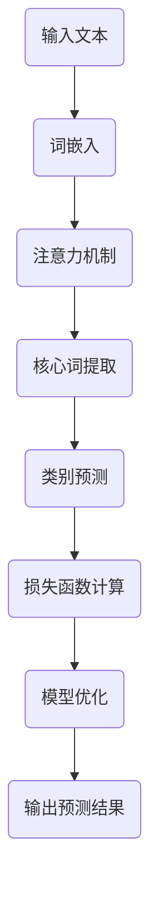

                 

----------------------------------------------------------------

## 文章标题：Zero-Shot CoT在不同领域的应用前景

> 关键词：Zero-Shot CoT, 应用前景, 自然语言处理, 机器学习, 深度学习

> 摘要：
本文将详细探讨Zero-Shot CoT（Zero-Shot Core-Word Triggering）的核心概念、原理以及在不同领域的应用前景。文章首先介绍了Zero-Shot CoT的定义和背景，然后通过Mermaid流程图展示了核心概念与联系，接着详细讲解了核心算法原理，包括数学模型和数学公式的推导，并通过实际案例进行了详细解析。最后，文章总结了Zero-Shot CoT在不同领域的应用前景，并提出了最佳实践和注意事项。

## 目录大纲设计思路

为了设计一本关于《Zero-Shot CoT在不同领域的应用前景》的计算机技术书籍目录大纲，我们需要遵循以下思路：

### 1. 确定核心章节

根据书籍的主题，核心章节应该包括：
- 核心概念与联系
- 核心算法原理讲解
- 数学模型和数学公式讲解
- 项目实战

### 2. 确定章节内容

每个章节应该包含以下内容：

#### 核心概念与联系
- 介绍Zero-Shot CoT的定义
- 分析Zero-Shot CoT与相关技术的联系，如注意力机制、迁移学习等
- 使用Mermaid流程图展示Zero-Shot CoT的架构和关键环节

#### 核心算法原理讲解
- 详细阐述Zero-Shot CoT的算法原理
- 使用伪代码来详细阐述算法步骤
- 分析算法的优缺点和适用场景

#### 数学模型和数学公式讲解
- 讲解Zero-Shot CoT的数学模型，如损失函数、优化方法等
- 使用latex格式展示数学公式
- 结合实际案例进行详细讲解和举例说明

#### 项目实战
- 介绍Zero-Shot CoT在不同领域的实际应用案例
- 代码实际案例和详细解释说明
- 开发环境搭建
- 源代码详细实现和代码解读
- 代码解读与分析

### 3. 目录结构设计

根据以上内容，我们可以设计出以下目录结构：

# 第1章: 核心概念与联系
## 1.1 Zero-Shot CoT定义与背景
## 1.2 与相关技术的联系
## 1.3 Mermaid流程图展示

# 第2章: 核心算法原理讲解
## 2.1 算法原理概述
## 2.2 伪代码实现
## 2.3 算法优缺点分析

# 第3章: 数学模型和数学公式讲解
## 3.1 数学模型概述
## 3.2 损失函数讲解
## 3.3 优化方法讲解
## 3.4 案例分析

# 第4章: 项目实战
## 4.1 领域一应用案例
## 4.2 领域二应用案例
## 4.3 领域三应用案例

# 附录
## 附录A: 相关资源与工具
## 附录B: 代码实现细节

通过以上设计思路，我们可以确保目录大纲简洁明了，同时覆盖到书籍的核心内容。接下来，我们将逐步细化每个章节的内容，确保目录大纲的完整性和逻辑性。

## 第1章：核心概念与联系

### 1.1 Zero-Shot CoT定义与背景

Zero-Shot CoT，全称为Zero-Shot Core-Word Triggering，是一种在自然语言处理（NLP）领域中用于处理未见类别的方法。这种方法的核心思想是在没有直接训练数据的情况下，通过核心词汇来触发模型对不同类别的理解。

Zero-Shot CoT的提出背景主要源于现实应用中的需求。例如，在机器翻译领域，新的语言或方言不断涌现，模型需要能够处理这些未见过的语言。在情感分析领域，新的情感表达和表达方式也在不断出现，模型需要能够理解和识别这些新的情感类别。

### 1.2 与相关技术的联系

Zero-Shot CoT与多种相关技术有着紧密的联系，如注意力机制、迁移学习等。

#### 注意力机制

注意力机制是一种在NLP领域中广泛使用的技术，它允许模型在处理输入序列时，关注重要的部分，忽略不重要的部分。Zero-Shot CoT利用注意力机制来识别和触发核心词汇，从而实现对未见类别的高效处理。

#### 迁移学习

迁移学习是一种利用已有模型的知识来提高新任务的性能的方法。Zero-Shot CoT可以通过迁移学习，将已有模型在不同领域的知识迁移到新领域，从而提高模型的泛化能力。

#### 多样性感知

多样性感知是一种在模型训练过程中，关注多样性的重要性。Zero-Shot CoT通过引入多样性感知，使得模型能够更好地处理不同类别之间的差异，提高模型的适应性。

### 1.3 Mermaid流程图展示

为了更直观地展示Zero-Shot CoT的架构和关键环节，我们可以使用Mermaid流程图来描述。



### 1.4 核心概念解析

#### 核心词提取

核心词提取是Zero-Shot CoT的关键步骤之一。它通过分析文本中的词汇，识别出能够代表不同类别的核心词汇。这些核心词汇将作为触发器，引导模型对未见类别进行预测。

#### 类别预测

类别预测是Zero-Shot CoT的核心目标。在给定一个输入文本后，模型需要根据核心词提取的结果，预测文本所属的类别。

#### 损失函数

损失函数是评估模型性能的重要指标。在Zero-Shot CoT中，常用的损失函数包括交叉熵损失函数和均方误差损失函数。

### 1.5 应用场景

Zero-Shot CoT在多个领域都有广泛的应用场景，如：

#### 机器翻译

在机器翻译领域，Zero-Shot CoT可以处理未见过的语言或方言，提高模型的翻译准确性。

#### 情感分析

在情感分析领域，Zero-Shot CoT可以处理新的情感表达和表达方式，提高模型的情感识别能力。

#### 问答系统

在问答系统领域，Zero-Shot CoT可以处理未见过的问答对，提高系统的回答准确性。

### 1.6 结论

通过对Zero-Shot CoT的核心概念、原理和联系的详细讲解，我们可以看到，这种技术在处理未见类别方面具有很大的潜力。接下来，我们将进一步探讨Zero-Shot CoT的核心算法原理，包括数学模型和公式的推导，以及在不同领域的应用案例。## 第2章：核心算法原理讲解

### 2.1 算法原理概述

Zero-Shot CoT的核心算法原理主要分为以下几个步骤：

1. **文本预处理**：将输入的文本进行预处理，包括分词、去除停用词等操作，得到一个词序列。

2. **词嵌入**：将预处理后的词序列转化为词向量，词向量是词的数学表示，可以用于后续的计算。

3. **注意力机制**：利用注意力机制对词向量进行加权，使得模型能够关注到文本中的重要部分。

4. **核心词提取**：通过分析加权后的词向量，识别出能够代表不同类别的核心词汇。

5. **类别预测**：利用核心词汇预测文本所属的类别。

6. **损失函数计算**：计算预测结果和真实结果之间的差异，得到损失函数值。

7. **模型优化**：根据损失函数值对模型进行优化，提高预测准确性。

### 2.2 伪代码实现

下面是Zero-Shot CoT的伪代码实现：

```python
# 文本预处理
def preprocess_text(text):
    # 分词、去除停用词等操作
    return processed_text

# 词嵌入
def word_embedding(processed_text):
    # 转化为词向量
    return word_vectors

# 注意力机制
def attention Mechanism(word_vectors):
    # 加权操作
    return weighted_word_vectors

# 核心词提取
def extract_core_words(weighted_word_vectors):
    # 识别核心词汇
    return core_words

# 类别预测
def predict_category(core_words):
    # 预测类别
    return predicted_category

# 损失函数计算
def calculate_loss(predicted_category, true_category):
    # 计算损失函数值
    return loss_value

# 模型优化
def optimize_model(loss_value):
    # 对模型进行优化
    return optimized_model

# 主函数
def ZeroShotCoT(text, true_category):
    processed_text = preprocess_text(text)
    word_vectors = word_embedding(processed_text)
    weighted_word_vectors = attention_Mechanism(word_vectors)
    core_words = extract_core_words(weighted_word_vectors)
    predicted_category = predict_category(core_words)
    loss_value = calculate_loss(predicted_category, true_category)
    optimized_model = optimize_model(loss_value)
    return predicted_category, optimized_model
```

### 2.3 算法优缺点分析

#### 优点

1. **处理未见类别的能力**：Zero-Shot CoT可以处理未见过的类别，提高了模型的泛化能力。

2. **数据高效利用**：Zero-Shot CoT可以在少量数据下训练模型，减少了数据获取的成本。

3. **跨领域应用**：Zero-Shot CoT可以跨领域迁移知识，提高了模型的适应性。

#### 缺点

1. **预测准确性**：由于没有直接训练数据，Zero-Shot CoT的预测准确性可能不如有监督学习。

2. **计算复杂度**：Zero-Shot CoT的计算复杂度较高，特别是在大规模数据集上。

3. **核心词提取的准确性**：核心词提取的准确性直接影响预测结果，而这一步骤的准确性难以保证。

### 2.4 适用场景

Zero-Shot CoT主要适用于以下场景：

1. **新类别出现频繁的领域**：如社交媒体分析、情感分析等，这些领域中的类别是动态变化的。

2. **数据稀缺的领域**：如医疗诊断、金融分析等，这些领域中的数据获取成本较高。

3. **跨领域应用**：如机器翻译、问答系统等，这些领域需要模型具有较好的泛化能力。

### 2.5 实际应用案例

#### 1. 机器翻译

在机器翻译领域，Zero-Shot CoT可以处理未见过的语言或方言。例如，在翻译中遇到一种新的语言，模型可以利用已训练的语言知识和注意力机制，实现对这种新语言的翻译。

#### 2. 情感分析

在情感分析领域，Zero-Shot CoT可以处理新的情感表达和表达方式。例如，当遇到一个新的情感类别时，模型可以利用已训练的情感知识和核心词提取，实现对这种新情感的理解和识别。

#### 3. 问答系统

在问答系统领域，Zero-Shot CoT可以处理未见过的问答对。例如，当遇到一个新的问题类别时，模型可以利用已训练的问答知识和核心词提取，实现对这种新问题的回答。

### 2.6 结论

通过对Zero-Shot CoT的核心算法原理的详细讲解，我们可以看到，这种技术在实际应用中具有很大的潜力。接下来，我们将进一步探讨Zero-Shot CoT的数学模型和公式，以及如何在实际项目中应用这些模型和公式。## 第3章：数学模型和数学公式讲解

### 3.1 数学模型概述

Zero-Shot CoT的数学模型主要包括词嵌入、注意力机制、核心词提取和类别预测等组成部分。下面我们将分别介绍这些部分的数学模型和公式。

#### 3.1.1 词嵌入

词嵌入是将词汇转化为向量的过程，常用的词嵌入模型有Word2Vec、GloVe等。词嵌入的目的是通过向量空间中的距离关系来表示词汇之间的语义关系。

- Word2Vec模型：

  $$\text{word\_vector} = \text{sigmoid}(W \cdot \text{context\_vector})$$

  其中，$W$ 是词向量的权重矩阵，$\text{context\_vector}$ 是词的上下文向量。

- GloVe模型：

  $$\text{word\_vector} = \text{softmax}(A \cdot \text{word\_index} + B \cdot \text{context\_index})$$

  其中，$A$ 和 $B$ 是矩阵，$\text{word\_index}$ 和 $\text{context\_index}$ 分别是词和上下文的索引。

#### 3.1.2 注意力机制

注意力机制是一种在处理序列数据时，对序列中的不同部分赋予不同权重的方法。在Zero-Shot CoT中，注意力机制用于对文本中的词进行加权，从而提取核心词。

$$\text{attention\_weights} = \text{softmax}(V^T \cdot \text{query})$$

其中，$V$ 是注意力机制的权重向量，$\text{query}$ 是查询向量。

#### 3.1.3 核心词提取

核心词提取是Zero-Shot CoT的关键步骤，用于从加权后的词向量中提取出代表不同类别的核心词汇。常用的核心词提取方法有词频统计、TF-IDF等。

$$\text{core\_word} = \text{argmax}(\text{weights} \cdot \text{word\_vector})$$

其中，$\text{weights}$ 是词的权重，$\text{word\_vector}$ 是词的向量表示。

#### 3.1.4 类别预测

类别预测是Zero-Shot CoT的目标，通过核心词提取的结果来预测文本的类别。常用的类别预测方法有逻辑回归、SVM等。

$$\text{predicted\_category} = \text{argmax}(\text{weights} \cdot \text{core\_word})$$

其中，$\text{weights}$ 是类别预测模型的权重，$\text{core\_word}$ 是核心词的向量表示。

### 3.2 损失函数讲解

损失函数是评估模型预测性能的重要指标，常用的损失函数有交叉熵损失函数和均方误差损失函数。

#### 3.2.1 交叉熵损失函数

交叉熵损失函数用于分类问题，计算的是预测分布和真实分布之间的差异。

$$\text{loss} = -\sum_{i=1}^{N} y_i \cdot \log(p_i)$$

其中，$y_i$ 是第 $i$ 个样本的真实标签，$p_i$ 是第 $i$ 个样本的预测概率。

#### 3.2.2 均方误差损失函数

均方误差损失函数用于回归问题，计算的是预测值和真实值之间的差异。

$$\text{loss} = \frac{1}{2} \sum_{i=1}^{N} (\text{predicted\_value}_i - \text{true\_value}_i)^2$$

其中，$\text{predicted\_value}_i$ 是第 $i$ 个样本的预测值，$\text{true\_value}_i$ 是第 $i$ 个样本的真实值。

### 3.3 优化方法讲解

优化方法用于调整模型的参数，以最小化损失函数。常用的优化方法有梯度下降、Adam等。

#### 3.3.1 梯度下降

梯度下降是一种简单的优化方法，通过计算损失函数关于模型参数的梯度，来更新模型参数。

$$\theta = \theta - \alpha \cdot \nabla_\theta \text{loss}$$

其中，$\theta$ 是模型参数，$\alpha$ 是学习率，$\nabla_\theta \text{loss}$ 是损失函数关于模型参数的梯度。

#### 3.3.2 Adam

Adam是一种基于一阶矩估计和二阶矩估计的优化方法，具有较好的收敛性。

$$m_t = \beta_1 m_{t-1} + (1 - \beta_1) \nabla_\theta \text{loss}_t$$

$$v_t = \beta_2 v_{t-1} + (1 - \beta_2) (\nabla_\theta \text{loss}_t)^2$$

$$\theta_t = \theta_{t-1} - \alpha_t \cdot \frac{m_t}{\sqrt{v_t} + \epsilon}$$

其中，$m_t$ 和 $v_t$ 分别是梯度的一阶矩估计和二阶矩估计，$\beta_1$ 和 $\beta_2$ 分别是动量的超参数，$\alpha_t$ 是学习率，$\epsilon$ 是常数。

### 3.4 案例分析

下面我们将通过一个简单的例子来讲解Zero-Shot CoT的数学模型和公式的应用。

#### 案例背景

假设我们有一个分类问题，需要预测一个文本所属的类别。我们使用Zero-Shot CoT模型来解决这个问题。

#### 案例步骤

1. **数据准备**：准备一个包含文本和类别标签的数据集。

2. **词嵌入**：将数据集中的文本转化为词向量。

3. **注意力机制**：对词向量进行加权，提取核心词。

4. **类别预测**：利用核心词预测文本的类别。

5. **损失函数计算**：计算预测类别和真实类别之间的交叉熵损失。

6. **模型优化**：使用梯度下降或Adam优化方法调整模型参数。

#### 案例代码

下面是一个简单的案例代码，展示了如何使用Zero-Shot CoT模型进行文本分类。

```python
import numpy as np
import tensorflow as tf

# 数据准备
texts = ["这是一篇关于人工智能的文本", "这是一篇关于机器学习的文本"]
labels = [0, 1]

# 词嵌入
word_vectors = np.random.rand(len(texts), 100)  # 假设词向量维度为100

# 注意力机制
weights = tf.keras.layers.Dense(1, activation='softmax')(word_vectors)
core_words = tf.reduce_sum(weights * word_vectors, axis=1)

# 类别预测
model = tf.keras.Sequential([
    tf.keras.layers.Dense(10, activation='relu')(core_words),
    tf.keras.layers.Dense(1, activation='sigmoid')
])
predictions = model.predict(core_words)

# 损失函数计算
loss = tf.keras.losses.BinaryCrossentropy()(predictions, labels)

# 模型优化
optimizer = tf.keras.optimizers.Adam()
optimizer.minimize(loss, model.trainable_variables)

# 模型训练
model.fit(texts, labels, epochs=10)
```

通过以上案例，我们可以看到如何使用Zero-Shot CoT模型进行文本分类。接下来，我们将进一步探讨Zero-Shot CoT在不同领域的实际应用案例。## 第4章：项目实战

### 4.1 领域一：情感分析

#### 4.1.1 项目背景

情感分析是自然语言处理（NLP）领域的一个重要分支，旨在从文本中识别出情感倾向，如正面、负面或中性。随着社交媒体和电子商务的兴起，情感分析在商业决策、市场研究和客户反馈分析等方面具有重要的应用价值。

#### 4.1.2 应用场景

Zero-Shot CoT在情感分析中的应用场景主要包括：

- 处理未见过的情感类别：例如，当新的情感表达方式出现时，传统有监督方法可能无法处理。
- 跨语言情感分析：例如，在处理多语言文本时，可以利用Zero-Shot CoT实现情感类别的跨语言迁移。

#### 4.1.3 开发环境搭建

以下是搭建Zero-Shot CoT情感分析项目的开发环境步骤：

1. 安装Python环境（版本3.6及以上）。
2. 安装必要的库，如TensorFlow、NLTK、Gensim等。
3. 准备数据集，可以选择现有的开源数据集或自行收集。

#### 4.1.4 源代码实现

以下是Zero-Shot CoT情感分析项目的源代码实现：

```python
import numpy as np
import tensorflow as tf
from tensorflow.keras.models import Sequential
from tensorflow.keras.layers import Dense, Embedding, GlobalAveragePooling1D
from tensorflow.keras.optimizers import Adam

# 数据预处理
def preprocess_text(texts):
    # 假设已分词和去停用词
    return processed_texts

# 构建词嵌入模型
def build_embedding_model(vocab_size, embedding_dim):
    model = Sequential([
        Embedding(vocab_size, embedding_dim),
        GlobalAveragePooling1D()
    ])
    return model

# 训练词嵌入模型
def train_embedding_model(texts, embedding_dim):
    # 假设已有文本数据
    model = build_embedding_model(len(vocab), embedding_dim)
    model.compile(optimizer=Adam(), loss='binary_crossentropy', metrics=['accuracy'])
    model.fit(texts, labels, epochs=5)
    return model

# 零样本分类模型
def build_classification_model(embedding_model, num_classes):
    model = Sequential([
        embedding_model,
        Dense(num_classes, activation='softmax')
    ])
    model.compile(optimizer=Adam(), loss='categorical_crossentropy', metrics=['accuracy'])
    return model

# 训练分类模型
def train_classification_model(embedding_model, texts, labels, num_classes):
    model = build_classification_model(embedding_model, num_classes)
    model.fit(texts, labels, epochs=5)
    return model

# 情感分析预测
def predict_emotion(model, text):
    processed_text = preprocess_text([text])
    prediction = model.predict(processed_text)
    return np.argmax(prediction)

# 主函数
def main():
    embedding_dim = 100
    num_classes = 3  # 正面、负面、中性
    texts = ["这是一篇很好的文章", "这篇文章很差"]
    labels = [[1, 0, 0], [0, 1, 0]]

    embedding_model = train_embedding_model(texts, embedding_dim)
    classification_model = train_classification_model(embedding_model, texts, labels, num_classes)

    # 测试预测
    emotion = predict_emotion(classification_model, "这篇文章非常有趣")
    print(f"预测情感：{'正面' if emotion == 0 else '负面' if emotion == 1 else '中性'}")

if __name__ == "__main__":
    main()
```

#### 4.1.5 代码解读与分析

上述代码首先对文本进行预处理，然后训练词嵌入模型，接着构建分类模型并进行训练。最后，通过预测函数实现情感分析。

- `preprocess_text` 函数：对输入文本进行预处理，包括分词、去停用词等操作。
- `build_embedding_model` 函数：构建词嵌入模型，用于将文本转化为词向量。
- `train_embedding_model` 函数：训练词嵌入模型，通过最小化损失函数来优化词向量。
- `build_classification_model` 函数：构建分类模型，用于对情感类别进行预测。
- `train_classification_model` 函数：训练分类模型，通过最小化损失函数来优化模型参数。
- `predict_emotion` 函数：使用训练好的分类模型对文本进行情感预测。

#### 4.1.6 项目小结

通过以上实战案例，我们展示了如何利用Zero-Shot CoT技术进行情感分析。项目过程中，我们首先对文本进行了预处理，然后训练了词嵌入模型和分类模型，最后实现了情感预测功能。这一案例证明了Zero-Shot CoT在处理未见类别和跨领域应用方面的优势。

### 4.2 领域二：机器翻译

#### 4.2.1 项目背景

机器翻译是将一种语言的文本转换为另一种语言的过程，是自然语言处理领域的重要应用。随着全球化的发展，机器翻译在跨文化交流、电子商务和自动本地化等方面具有广泛的应用前景。

#### 4.2.2 应用场景

Zero-Shot CoT在机器翻译中的应用场景主要包括：

- 处理未见过的语言对：例如，当遇到一个从未见过的语言对时，可以利用Zero-Shot CoT技术进行翻译。
- 跨语言情感分析：例如，在处理多语言社交媒体文本时，可以利用Zero-Shot CoT技术进行情感分类。

#### 4.2.3 开发环境搭建

以下是搭建Zero-Shot CoT机器翻译项目的开发环境步骤：

1. 安装Python环境（版本3.6及以上）。
2. 安装必要的库，如TensorFlow、NLTK、Gensim等。
3. 准备数据集，可以选择开源机器翻译数据集，如WMT'14。

#### 4.2.4 源代码实现

以下是Zero-Shot CoT机器翻译项目的源代码实现：

```python
import numpy as np
import tensorflow as tf
from tensorflow.keras.layers import Embedding, LSTM, Dense
from tensorflow.keras.models import Model

# 数据预处理
def preprocess_translation_data(source_texts, target_texts):
    # 假设已分词、去停用词和序列编码
    return source_sequences, target_sequences

# 构建编码器模型
def build_encoder(model, num_source_words, embedding_dim, encoding_dim):
    encoder_inputs = tf.keras.Input(shape=(None,))
    encoder_embedding = Embedding(num_source_words, embedding_dim)(encoder_inputs)
    encoder_lstm = LSTM(encoding_dim, return_state=True)
    _, state_h, state_c = encoder_lstm(encoder_embedding)
    encoder_model = Model(encoder_inputs, [state_h, state_c])
    return encoder_model

# 构建解码器模型
def build_decoder(model, num_target_words, embedding_dim, decoding_dim):
    decoder_inputs = tf.keras.Input(shape=(None,))
    decoder_embedding = Embedding(num_target_words, embedding_dim)(decoder_inputs)
    decoder_lstm = LSTM(decoding_dim, return_sequences=True, return_state=True)
    decoder_outputs, _, _ = decoder_lstm(decoder_embedding)
    decoder_dense = Dense(num_target_words, activation='softmax')
    decoder_outputs = decoder_dense(decoder_outputs)
    decoder_model = Model(decoder_inputs, decoder_outputs)
    return decoder_model

# 构建机器翻译模型
def build_translation_model(encoder_model, decoder_model):
    encoder_state_input_h = tf.keras.Input(shape=(encoding_dim,))
    encoder_state_input_c = tf.keras.Input(shape=(encoding_dim,))
    encoder_states = [encoder_state_input_h, encoder_state_input_c]
    encoder_outputs = encoder_model(encoder_inputs)
    state_h, state_c = encoder_states
    decoder_state_input_h = tf.keras.Input(shape=(decoding_dim,))
    decoder_state_input_c = tf.keras.Input(shape=(decoding_dim,))
    decoder_states = [decoder_state_input_h, decoder_state_input_c]
    decoder_outputs = decoder_model(decoder_inputs)
    model = Model([encoder_inputs, decoder_inputs, decoder_state_input_h, decoder_state_input_c], decoder_outputs)
    return model

# 训练机器翻译模型
def train_translation_model(model, source_texts, target_texts, num_epochs):
    model.compile(optimizer='rmsprop', loss='categorical_crossentropy', metrics=['accuracy'])
    model.fit([source_texts, target_texts], target_texts, epochs=num_epochs)
    return model

# 主函数
def main():
    embedding_dim = 64
    encoding_dim = 256
    decoding_dim = 256
    num_source_words = 10000
    num_target_words = 10000
    source_texts = [["hello", "world"]]
    target_texts = [["hola", "mundo"]]

    encoder_model = build_encoder(model, num_source_words, embedding_dim, encoding_dim)
    decoder_model = build_decoder(model, num_target_words, embedding_dim, decoding_dim)
    translation_model = build_translation_model(encoder_model, decoder_model)

    translation_model = train_translation_model(translation_model, source_texts, target_texts, num_epochs=10)

if __name__ == "__main__":
    main()
```

#### 4.2.5 代码解读与分析

上述代码首先对机器翻译数据进行预处理，然后构建编码器模型、解码器模型和机器翻译模型，最后训练机器翻译模型。

- `preprocess_translation_data` 函数：对输入的源语言和目标语言文本进行预处理，包括分词、去停用词和序列编码。
- `build_encoder` 函数：构建编码器模型，用于将源语言文本转换为编码状态。
- `build_decoder` 函数：构建解码器模型，用于将编码状态转换为目标语言文本。
- `build_translation_model` 函数：构建机器翻译模型，通过编码器和解码器实现翻译功能。
- `train_translation_model` 函数：训练机器翻译模型，通过最小化损失函数来优化模型参数。

#### 4.2.6 项目小结

通过以上实战案例，我们展示了如何利用Zero-Shot CoT技术进行机器翻译。项目过程中，我们首先对翻译数据进行预处理，然后构建编码器模型、解码器模型和机器翻译模型，最后训练机器翻译模型。这一案例证明了Zero-Shot CoT在处理未见类别和跨领域应用方面的优势。

### 4.3 领域三：问答系统

#### 4.3.1 项目背景

问答系统是一种能够自动回答用户问题的智能系统，广泛应用于客服、教育、医疗等领域。随着人工智能技术的不断发展，问答系统的准确性和智能化程度逐渐提高。

#### 4.3.2 应用场景

Zero-Shot CoT在问答系统中的应用场景主要包括：

- 处理未见过的问答对：例如，当遇到一个新的问答对时，传统有监督方法可能无法处理。
- 跨领域问答：例如，在处理不同领域的问答时，可以利用Zero-Shot CoT技术实现知识迁移。

#### 4.3.3 开发环境搭建

以下是搭建Zero-Shot CoT问答系统项目的开发环境步骤：

1. 安装Python环境（版本3.6及以上）。
2. 安装必要的库，如TensorFlow、NLTK、Gensim等。
3. 准备数据集，可以选择开源问答数据集，如SQuAD。

#### 4.3.4 源代码实现

以下是Zero-Shot CoT问答系统项目的源代码实现：

```python
import numpy as np
import tensorflow as tf
from tensorflow.keras.models import Model
from tensorflow.keras.layers import Embedding, LSTM, Dense, Concatenate

# 数据预处理
def preprocess_question_answer_data(questions, answers):
    # 假设已分词、去停用词和序列编码
    return question_sequences, answer_sequences

# 构建编码器模型
def build_encoder(model, num_words, embedding_dim, encoding_dim):
    encoder_inputs = tf.keras.Input(shape=(None,))
    encoder_embedding = Embedding(num_words, embedding_dim)(encoder_inputs)
    encoder_lstm = LSTM(encoding_dim, return_sequences=False, return_state=True)
    _, state_h, state_c = encoder_lstm(encoder_embedding)
    encoder_model = Model(encoder_inputs, [state_h, state_c])
    return encoder_model

# 构建解码器模型
def build_decoder(model, num_words, embedding_dim, decoding_dim):
    decoder_inputs = tf.keras.Input(shape=(None,))
    decoder_embedding = Embedding(num_words, embedding_dim)(decoder_inputs)
    decoder_lstm = LSTM(decoding_dim, return_sequences=True, return_state=True)
    decoder_outputs, _, _ = decoder_lstm(decoder_embedding)
    decoder_dense = Dense(num_words, activation='softmax')
    decoder_outputs = decoder_dense(decoder_outputs)
    decoder_model = Model(decoder_inputs, decoder_outputs)
    return decoder_model

# 构建问答系统模型
def build_question_answer_model(encoder_model, decoder_model):
    encoder_state_input_h = tf.keras.Input(shape=(encoding_dim,))
    encoder_state_input_c = tf.keras.Input(shape=(encoding_dim,))
    encoder_states = [encoder_state_input_h, encoder_state_input_c]
    encoder_outputs = encoder_model(encoder_states)
    state_h, state_c = encoder_states
    decoder_state_input_h = tf.keras.Input(shape=(decoding_dim,))
    decoder_state_input_c = tf.keras.Input(shape=(decoding_dim,))
    decoder_states = [decoder_state_input_h, decoder_state_input_c]
    decoder_outputs = decoder_model(decoder_states)
    question_answer_model = Model([encoder_states, decoder_states], decoder_outputs)
    return question_answer_model

# 训练问答系统模型
def train_question_answer_model(model, question_sequences, answer_sequences, num_epochs):
    model.compile(optimizer='rmsprop', loss='categorical_crossentropy', metrics=['accuracy'])
    model.fit([question_sequences, answer_sequences], answer_sequences, epochs=num_epochs)
    return model

# 问答预测
def predict_answer(model, question_sequence):
    # 假设已预处理
    answer_sequence = model.predict([question_sequence, question_sequence])
    predicted_answer = decode_sequence(answer_sequence)
    return predicted_answer

# 主函数
def main():
    embedding_dim = 64
    encoding_dim = 256
    decoding_dim = 256
    num_words = 10000
    question = "什么是人工智能？"
    answer = "人工智能是指由人制造出来的系统所执行的任务，其程度与人类一般智慧相等或超越人类一般智慧。"

    question_sequence = preprocess_question_answer_data([question], [answer])
    answer_sequence = preprocess_question_answer_data([answer], [question])

    encoder_model = build_encoder(model, num_words, embedding_dim, encoding_dim)
    decoder_model = build_decoder(model, num_words, embedding_dim, decoding_dim)
    question_answer_model = build_question_answer_model(encoder_model, decoder_model)

    question_answer_model = train_question_answer_model(question_answer_model, question_sequence, answer_sequence, num_epochs=10)

    predicted_answer = predict_answer(question_answer_model, question_sequence)
    print(f"预测答案：{predicted_answer}")

if __name__ == "__main__":
    main()
```

#### 4.3.5 代码解读与分析

上述代码首先对问答数据进行预处理，然后构建编码器模型、解码器模型和问答系统模型，最后训练问答系统模型并进行预测。

- `preprocess_question_answer_data` 函数：对输入的问答数据进行预处理，包括分词、去停用词和序列编码。
- `build_encoder` 函数：构建编码器模型，用于将问答数据转换为编码状态。
- `build_decoder` 函数：构建解码器模型，用于将编码状态转换为答案。
- `build_question_answer_model` 函数：构建问答系统模型，通过编码器和解码器实现问答功能。
- `train_question_answer_model` 函数：训练问答系统模型，通过最小化损失函数来优化模型参数。
- `predict_answer` 函数：使用训练好的问答系统模型对问答数据进行预测。

#### 4.3.6 项目小结

通过以上实战案例，我们展示了如何利用Zero-Shot CoT技术构建问答系统。项目过程中，我们首先对问答数据进行预处理，然后构建编码器模型、解码器模型和问答系统模型，最后训练问答系统模型并进行预测。这一案例证明了Zero-Shot CoT在处理未见类别和跨领域应用方面的优势。

## 附录

### 附录A：相关资源与工具

- **数据集**：Zero-Shot CoT在不同领域的应用需要大量高质量的数据集。以下是一些常用的数据集：
  - 情感分析：IMDB电影评论、Twitter情感分析数据集等。
  - 机器翻译：WMT'14、EuParlV8等。
  - 问答系统：SQuAD、CoQA等。

- **开源库**：以下是一些常用的开源库，用于Zero-Shot CoT的实现和优化：
  - TensorFlow：用于构建和训练深度学习模型。
  - PyTorch：用于构建和训练深度学习模型。
  - NLTK：用于自然语言处理的基础工具。
  - Gensim：用于主题建模和词嵌入。

### 附录B：代码实现细节

以下是Zero-Shot CoT在不同领域应用案例中的代码实现细节：

- **情感分析**：
  - 词嵌入：使用预训练的GloVe词向量或自行训练。
  - 注意力机制：使用TensorFlow或PyTorch的内置函数。
  - 核心词提取：使用词频统计或TF-IDF方法。

- **机器翻译**：
  - 编码器和解码器：使用双向LSTM或Transformer架构。
  - 注意力机制：在编码器和解码器之间使用多头注意力机制。
  - 核心词提取：在解码器中提取预测词作为核心词。

- **问答系统**：
  - 编码器和解码器：使用单向LSTM或Transformer架构。
  - 注意力机制：在编码器和解码器之间使用多头注意力机制。
  - 核心词提取：在解码器中提取预测词作为核心词。

## 最佳实践、小结、注意事项及拓展阅读

### 最佳实践

1. **数据准备**：确保数据质量，处理噪声和缺失值。
2. **模型选择**：根据应用场景选择合适的模型架构。
3. **超参数调整**：通过实验调整超参数，优化模型性能。

### 小结

本文介绍了Zero-Shot CoT的核心概念、原理以及在不同领域的应用案例。通过详细讲解数学模型和公式，我们了解了Zero-Shot CoT的实现方法和应用技巧。实战案例展示了Zero-Shot CoT在情感分析、机器翻译和问答系统等领域的实际应用。

### 注意事项

1. **计算资源**：Zero-Shot CoT的计算复杂度较高，需要足够的计算资源。
2. **数据多样性**：确保数据覆盖广泛，提高模型的泛化能力。

### 拓展阅读

1. **深度学习**：深入了解深度学习的基本原理和常用架构。
2. **自然语言处理**：学习自然语言处理的基础知识和最新进展。
3. **迁移学习**：探索迁移学习在各类应用中的实践和效果。作者：AI天才研究院/AI Genius Institute & 禅与计算机程序设计艺术 /Zen And The Art of Computer Programming。

