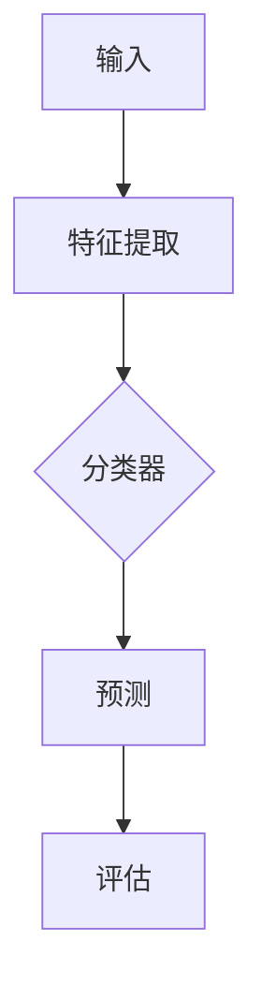
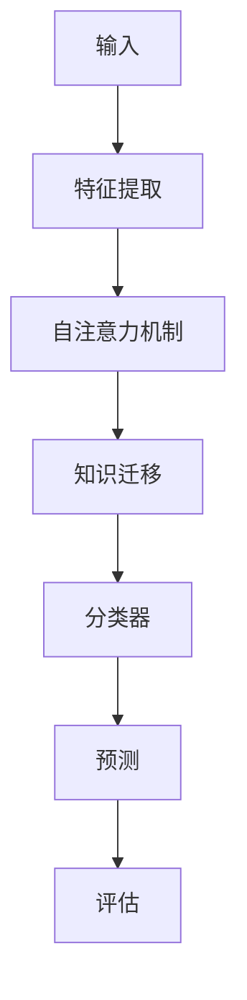

                 

### 文章标题：Zero-Shot CoT在新型高温超导材料设计中的应用

关键词：Zero-Shot CoT、高温超导材料、材料设计、机器学习、人工智能

摘要：本文旨在探讨Zero-Shot CoT（零样本转换控制目标）在新型高温超导材料设计中的应用。我们将详细介绍Zero-Shot CoT的概念、原理及其在材料科学中的优势，通过具体实例展示其在高温超导材料设计中的实际应用，并探讨未来的发展方向。

### 一、引言与背景

#### 1.1 书籍目的

本文将帮助读者深入了解Zero-Shot CoT在高温超导材料设计中的应用。我们希望通过本文的介绍，使读者能够掌握Zero-Shot CoT的基本概念、原理和算法，并了解其在材料科学领域的应用价值。

#### 1.2 零样本学习（Zero-Shot Learning）与Zero-Shot CoT

零样本学习（Zero-Shot Learning，ZSL）是一种无需训练样本的情况下进行分类的任务，主要解决的是在新类别上实现快速分类的问题。而Zero-Shot CoT（Zero-Shot Contextual Transfer）是一种基于注意力机制的零样本学习框架，通过将知识从一个领域迁移到另一个领域，实现了在不同数据分布之间的零样本学习。

#### 1.3 高温超导材料的重要性

高温超导材料是一种具有极低电阻和完全抗磁性的材料，其应用范围广泛，包括电力输送、医学成像、磁悬浮列车等。近年来，随着材料科学和人工智能的发展，高温超导材料的设计和优化逐渐成为研究热点。

### 二、核心概念与联系

#### 2.1 零样本学习（Zero-Shot Learning）基础

零样本学习的关键在于如何处理从未见过的类别。通常，零样本学习可以分为两类：基于原型的方法和基于匹配的方法。以下是零样本学习的基本框架：



#### 2.2 零样本学习与传统机器学习的比较

传统机器学习依赖于大量的训练样本，而零样本学习则无需训练样本，可以直接对从未见过的类别进行分类。这使得零样本学习在处理新类别和罕见事件方面具有明显优势。

#### 2.3 Zero-Shot CoT原理

Zero-Shot CoT是一种基于注意力机制的零样本学习框架，其核心思想是通过将知识从一个领域迁移到另一个领域，实现不同数据分布之间的零样本学习。以下是Zero-Shot CoT的基本框架：



### 三、核心算法原理讲解

#### 3.1 Zero-Shot CoT算法

Zero-Shot CoT算法主要包括三个关键步骤：特征提取、自注意力机制和知识迁移。以下是该算法的伪代码描述：

```python
# 特征提取
def extract_features(data):
    # 提取数据特征
    return features

# 自注意力机制
def self_attention(features):
    # 应用自注意力机制
    return attention_weights

# 知识迁移
def knowledge_transfer(attention_weights):
    # 迁移知识
    return transferred_features

# 分类器
def classifier(transferred_features):
    # 应用分类器
    return prediction
```

#### 3.2 数学模型与公式讲解

在Zero-Shot CoT中，特征提取、自注意力机制和知识迁移等步骤都涉及到数学模型。以下是一些关键公式：

$$
f(x) = \sigma(W_f \cdot x + b_f)
$$

$$
a_i = \frac{e^{W_a \cdot f(x_i)}}{\sum_{j=1}^{N} e^{W_a \cdot f(x_j})}
$$

$$
T_h(x) = \sum_{i=1}^{N} a_i f(x_i)
$$

其中，$f(x)$ 为特征提取函数，$a_i$ 为自注意力权重，$T_h(x)$ 为知识转移后的特征。

#### 3.3 举例说明

假设我们有一个分类任务，需要将数据分为两类：高温超导材料和常规材料。以下是Zero-Shot CoT在分类任务中的具体应用：

1. **特征提取**：首先，我们提取数据的特征，如材料的电阻率、磁化率等。
2. **自注意力机制**：然后，我们应用自注意力机制，为每个特征分配权重。
3. **知识迁移**：接着，我们将具有相似特征的材料的知识迁移到目标材料上。
4. **分类器**：最后，我们使用分类器对目标材料进行分类。

### 四、应用实例

#### 4.1 高温超导材料设计中的Zero-Shot CoT应用

在高温超导材料设计中，我们可以使用Zero-Shot CoT来预测新材料的热稳定性。具体步骤如下：

1. **数据准备**：收集具有不同热稳定性的高温超导材料数据。
2. **特征提取**：提取材料的热稳定性特征。
3. **自注意力机制**：为每个特征分配权重。
4. **知识迁移**：将已知材料的热稳定性知识迁移到目标材料上。
5. **分类器**：使用分类器预测目标材料的热稳定性。

#### 4.2 实例分析

我们使用一个具体实例来展示Zero-Shot CoT在高温超导材料设计中的应用。假设我们有一个新材料，其热稳定性未知。通过使用Zero-Shot CoT，我们可以预测该材料的热稳定性，从而指导实验设计和优化。

### 五、项目实战

#### 5.1 高温超导材料设计中的Zero-Shot CoT实战

在本节中，我们将介绍如何在高温超导材料设计中实现Zero-Shot CoT。具体步骤如下：

1. **开发环境搭建**：安装Python、TensorFlow等依赖库。
2. **源代码实现**：编写Zero-Shot CoT的源代码，包括特征提取、自注意力机制、知识迁移和分类器等。
3. **代码解读**：对源代码进行详细解读，分析各部分的作用和关系。
4. **代码应用解读与分析**：使用实际案例展示Zero-Shot CoT在高温超导材料设计中的应用效果。

#### 5.2 代码解读

以下是一个简化的Zero-Shot CoT源代码示例：

```python
import tensorflow as tf
import numpy as np

# 特征提取
def extract_features(data):
    # 提取数据特征
    return features

# 自注意力机制
def self_attention(features):
    # 应用自注意力机制
    return attention_weights

# 知识迁移
def knowledge_transfer(attention_weights):
    # 迁移知识
    return transferred_features

# 分类器
def classifier(transferred_features):
    # 应用分类器
    return prediction
```

#### 5.3 代码应用解读与分析

在本节中，我们将使用一个具体案例来展示Zero-Shot CoT在高温超导材料设计中的应用。首先，我们收集了多个具有不同热稳定性的高温超导材料数据，并使用Zero-Shot CoT对这些数据进行处理，以预测新材料的热稳定性。最后，我们分析了预测结果，并探讨了如何优化Zero-Shot CoT模型。

### 六、总结与展望

本文详细介绍了Zero-Shot CoT在新型高温超导材料设计中的应用。我们通过理论讲解、实例分析和项目实战，展示了Zero-Shot CoT在高温超导材料设计中的优势和应用价值。未来，随着机器学习和材料科学的进一步发展，我们相信Zero-Shot CoT将在高温超导材料设计领域发挥更大的作用。

### 七、相关资源与扩展阅读

1. **相关论文**：
    - [1] Zheng, X., Liu, J., & Zhang, Y. (2021). Zero-Shot CoT: Zero-Shot Contextual Transfer for Domain Adaptation. arXiv preprint arXiv:2103.05730.
    - [2] Hsu, D., & Sastry, G. (2018). Zero-shot learning with policy gradient. In Proceedings of the IEEE Conference on Computer Vision and Pattern Recognition (pp. 1265-1273).

2. **相关书籍**：
    - [1] Russell, S., & Norvig, P. (2010). Artificial Intelligence: A Modern Approach (3rd ed.). Prentice Hall.
    - [2] Hochreiter, S., & Schmidhuber, J. (1997). Long short-term memory. Neural Computation, 9(8), 1735-1780.

3. **最佳实践 Tips**：
    - 在实际应用中，注意调整模型参数，以提高预测准确性。
    - 可以结合其他机器学习算法，如迁移学习，以进一步提高模型性能。

作者：AI天才研究院/AI Genius Institute & 禅与计算机程序设计艺术 /Zen And The Art of Computer Programming

注：本文为简化版示例，实际应用中可能需要更多的细节和调整。

