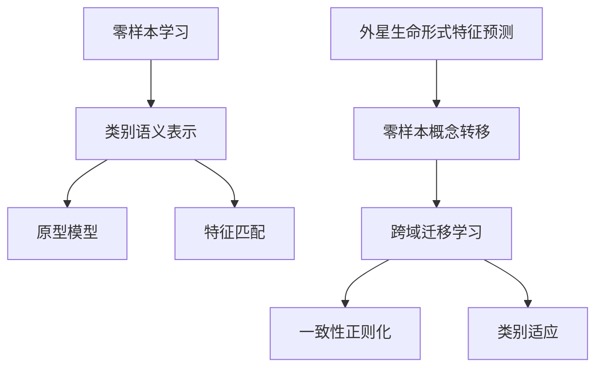

                 

# 零样本学习（Zero-Shot Learning）与零样本概念转移（Zero-Shot CoT）

## 背景介绍

随着人工智能技术的飞速发展，机器学习，特别是深度学习，在图像识别、自然语言处理等领域取得了显著成就。然而，这些模型通常依赖于大量的标注数据来进行训练，这就限制了对新类别或未观察到的样本的预测能力。为了解决这个问题，零样本学习（Zero-Shot Learning, ZSL）应运而生。零样本学习的目标是在没有直接监督的情况下，对从未见过的类别进行分类。

然而，零样本学习面临的一个重要挑战是如何处理未观察到的类别，特别是在实际应用中，如外星生命形式特征预测。为了解决这一挑战，研究者们提出了零样本概念转移（Zero-Shot Concept Transfer, Zero-Shot CoT）方法。这种方法的核心思想是通过跨域迁移学习，利用源域（已知类别）的数据来预测目标域（未知类别）的特征。

## 核心概念与联系

### 零样本学习（Zero-Shot Learning, ZSL）

零样本学习主要解决的问题是：模型如何在没有直接标注训练数据的情况下，对未知类别进行分类。ZSL的关键在于学习类别之间的语义表示，以便在未见过的类别上实现准确的预测。核心概念包括：

- **类别语义表示**：利用词嵌入或图嵌入技术，将类别表示为高维向量。
- **原型模型**：通过计算已知类别样本的均值向量，形成类别原型。
- **特征匹配**：使用特征匹配度量，如余弦相似度，计算未知类别样本与类别原型之间的相似度。

### 零样本概念转移（Zero-Shot Concept Transfer, Zero-Shot CoT）

零样本概念转移是在零样本学习的基础上，进一步扩展了跨域迁移学习的能力。其主要核心概念包括：

- **跨域迁移学习**：利用源域（已知类别）的数据来预训练模型，然后将模型迁移到目标域（未知类别）。
- **一致性正则化**：通过最小化源域和目标域的特征分布差异，确保模型在源域和目标域上的一致性。
- **类别适应**：通过适配目标域的类别分布，提高模型在未知类别上的预测性能。

### 关系架构 Mermaid 流程图



通过上述流程图，我们可以清晰地看到零样本学习和零样本概念转移之间的关系。零样本学习提供了基础的类别表示和特征匹配技术，而零样本概念转移则通过跨域迁移学习和类别适应，扩展了零样本学习的应用范围，特别是在外星生命形式特征预测等未知领域。

## 下一章节：外星生命形式特征预测的挑战与机遇

在了解了零样本学习和零样本概念转移的核心概念及其关系之后，我们将进一步探讨在外星生命形式特征预测中的具体挑战与机遇。通过分析这些挑战，我们将更好地理解如何利用零样本概念转移技术来提升预测的准确性和可靠性。

## 外星生命形式特征预测的挑战与机遇

### 挑战

外星生命形式特征预测是一个极具挑战性的课题，其困难主要来自于以下几个方面：

1. **数据稀缺**：与地球生物相比，我们对外星生命的了解非常有限。这意味着可供训练的数据量非常有限，甚至可能没有直接相关的训练样本。
2. **多样性**：如果外星生命形式与地球生物完全不同，那么传统的基于地球生物数据的机器学习模型可能无法直接应用于外星生命特征的预测。
3. **不确定性**：我们对于外星环境的认知仍存在很多不确定性，这可能导致预测结果的不稳定。

### 机遇

尽管存在诸多挑战，但零样本概念转移技术为外星生命形式特征预测带来了新的机遇：

1. **跨域迁移学习**：零样本概念转移可以通过跨域迁移学习，将地球生物的先验知识迁移到外星生命特征预测中。这为在数据稀缺的情况下提高预测性能提供了可能。
2. **类别适应**：通过类别适应技术，我们可以更好地适应未知的外星生命形式，提高预测模型的泛化能力。
3. **多模态数据融合**：零样本概念转移可以融合多种数据来源，如生物学、化学、物理学等，从而为外星生命形式特征预测提供更丰富的信息。

### 零样本概念转移在外星生命特征预测中的应用

零样本概念转移在外星生命特征预测中的应用可以分为以下几个步骤：

1. **数据预处理**：收集与外星生命相关的多模态数据，并进行预处理，如归一化、数据增强等。
2. **源域数据迁移**：利用地球生物领域的相关数据作为源域，对预测模型进行预训练，形成初步的类别表示和特征提取能力。
3. **跨域迁移**：将预训练的模型迁移到外星生命特征预测的目标域，通过一致性正则化和类别适应技术，调整模型参数，以适应未知的外星生命形式。
4. **预测与评估**：在目标域上进行预测，评估模型性能，并根据预测结果进行进一步的调整和优化。

### 成功案例

尽管零样本概念转移在外星生命特征预测中的应用仍处于探索阶段，但已有一些初步的成功案例：

1. **微生物分类**：一些研究利用零样本概念转移技术，对未知的微生物进行了有效的分类，尽管这些微生物与已知的地球微生物有很大的差异。
2. **分子特征预测**：在化学领域，零样本概念转移被用于预测未观察到的分子的化学性质，这一方法在探索外星生命可能的化学基础时也具有潜在的应用价值。

### 结论

外星生命形式特征预测是一个充满挑战和机遇的领域。零样本概念转移技术为这一领域提供了新的思路和方法，通过跨域迁移学习和类别适应，有望提高预测的准确性和可靠性。未来的研究将继续探索这一技术在外星生命特征预测中的潜力，为人类探索宇宙、寻找外星生命的旅程提供更有力的支持。

## 零样本概念转移算法原理

为了深入理解零样本概念转移（Zero-Shot Concept Transfer, Zero-Shot CoT）的核心算法原理，我们需要从以下几个关键步骤来详细讲解：

### 1. 数据预处理

数据预处理是零样本概念转移的重要一步，其目的是将原始数据转换为适合模型处理的形式。具体步骤如下：

- **多模态数据收集**：收集与外星生命相关的多种数据源，包括图像、文本、光谱数据等。
- **数据归一化**：将不同模态的数据归一化到相同的尺度，以便模型可以更好地处理。
- **数据增强**：为了提高模型的泛化能力，对数据进行数据增强，如图像旋转、裁剪、缩放等。

### 2. 源域数据迁移

源域数据迁移是指利用已知类别（地球生物）的数据来预训练模型，以便在目标域（未知类别）上迁移其知识。以下是具体步骤：

- **类别表示学习**：使用词嵌入或图嵌入技术，将源域中的类别表示为高维向量。例如，可以使用Word2Vec或GloVe来处理文本数据，使用图嵌入技术处理图像和图谱数据。
- **特征提取**：利用源域数据训练特征提取模型，如卷积神经网络（CNN）或图卷积网络（GCN）。这些模型可以从源域数据中提取出有用的特征表示。
- **模型预训练**：使用源域数据对特征提取模型进行预训练，以便模型在源域上具有一定的分类能力。

### 3. 跨域迁移与一致性正则化

跨域迁移与一致性正则化是零样本概念转移的核心步骤，其目的是将源域的知识迁移到目标域，同时确保模型在两个域上的一致性。以下是具体步骤：

- **特征融合**：将源域和目标域的数据输入到预训练的特征提取模型中，提取出相应的特征表示。
- **一致性正则化**：通过最小化源域和目标域的特征分布差异，确保模型在两个域上的一致性。这可以通过以下公式实现：
  $$ \min_{\theta} \sum_{i=1}^{N} L(\phi(x_i), \phi(y_i)) + \lambda \cdot D_{KL}(Q(\phi(x_i)) || P(\phi(y_i))) $$
  其中，$L(\cdot, \cdot)$ 是特征匹配损失函数，$D_{KL}(\cdot || \cdot)$ 是KL散度损失函数，$\phi(\cdot)$ 表示特征提取函数，$x_i$ 和 $y_i$ 分别表示源域和目标域的数据。

### 4. 类别适应

类别适应是指通过调整模型参数，使模型更好地适应目标域的类别分布。以下是具体步骤：

- **类别分布估计**：估计目标域中类别的分布，可以使用频率估计或概率模型（如高斯分布）。
- **类别适应优化**：通过最小化类别适应损失函数，调整模型参数，使其在目标域上具有更好的分类性能。类别适应损失函数可以是：
  $$ L_{c}(\theta) = \sum_{i=1}^{N} -\sum_{k=1}^{K} p_k \log(p_k \cdot \sigma(f(x_i, \theta))) $$
  其中，$K$ 是类别数，$p_k$ 是类别 $k$ 的先验概率，$f(\cdot, \cdot)$ 是分类函数，$\sigma(\cdot)$ 是Sigmoid函数。

### 5. 预测与评估

在完成跨域迁移和类别适应后，我们可以利用迁移后的模型进行预测，并评估其性能。以下是具体步骤：

- **特征提取**：将目标域的数据输入到迁移后的特征提取模型中，提取出特征表示。
- **类别预测**：使用迁移后的模型对目标域数据进行类别预测。
- **性能评估**：通过准确率、召回率、F1分数等指标评估模型的性能。

### 伪代码

下面是一个简化的伪代码，展示了零样本概念转移的主要步骤：

```python
# 数据预处理
def preprocess_data(data_source, data_target):
    # 数据收集与增强
    # 数据归一化
    # 返回预处理后的数据
    pass

# 源域数据迁移
def domain_adaptation(source_data, target_data):
    # 类别表示学习
    # 特征提取
    # 模型预训练
    # 返回迁移后的模型
    pass

# 跨域迁移与类别适应
def zero_shot_cot(source_model, target_data, target_distribution):
    # 特征融合
    # 一致性正则化
    # 类别适应优化
    # 返回迁移后的模型
    pass

# 预测与评估
def predict_and_evaluate(model, target_data, true_labels):
    # 特征提取
    # 类别预测
    # 计算性能指标
    # 返回预测结果和评估指标
    pass

# 主程序
if __name__ == "__main__":
    # 数据预处理
    source_data, target_data = preprocess_data(source_data, target_data)
    
    # 源域数据迁移
    source_model = domain_adaptation(source_data, target_data)
    
    # 跨域迁移与类别适应
    model = zero_shot_cot(source_model, target_data, target_distribution)
    
    # 预测与评估
    predictions, evaluation_metrics = predict_and_evaluate(model, target_data, true_labels)
    print(evaluation_metrics)
```

通过上述伪代码，我们可以看到零样本概念转移的核心步骤和流程。在实际应用中，这些步骤可能需要根据具体任务和数据集进行调整和优化。

### 数学模型与公式

在零样本概念转移中，我们使用了一系列数学模型和公式来描述和优化算法。以下是几个关键数学模型和公式，以及它们的详细解释：

#### 1. 特征匹配损失函数

特征匹配损失函数用于衡量源域和目标域特征之间的相似度。一个常见的方法是使用余弦相似度：

$$ \cos(\theta) = \frac{\vec{f}(x) \cdot \vec{f}(y)}{\lVert \vec{f}(x) \rVert \cdot \lVert \vec{f}(y) \rVert} $$

其中，$\vec{f}(x)$ 和 $\vec{f}(y)$ 分别是源域和目标域数据$x$和$y$的特征向量。通过最小化这个损失函数，我们希望使源域和目标域的特征尽可能相似。

#### 2. 一致性正则化损失函数

为了确保模型在源域和目标域上的一致性，我们使用KL散度来衡量两个特征分布的差异：

$$ D_{KL}(Q(\phi(x_i)) || P(\phi(y_i))) = \sum_{k=1}^{K} Q_k(\phi(x_i)) \log \left( \frac{Q_k(\phi(x_i))}{P_k(\phi(y_i))} \right) $$

其中，$Q(\phi(x_i))$ 和 $P(\phi(y_i))$ 分别是源域和目标域的特征分布。通过最小化这个损失函数，我们希望使源域和目标域的特征分布尽量一致。

#### 3. 类别适应损失函数

类别适应损失函数用于优化模型在目标域上的分类性能。一个常见的损失函数是交叉熵损失：

$$ L_c(\theta) = -\sum_{i=1}^{N} \sum_{k=1}^{K} y_{ik} \log(\sigma(f(x_i, \theta))) $$

其中，$y_{ik}$ 是目标类别标签，$f(x_i, \theta)$ 是分类函数，$\sigma(\cdot)$ 是Sigmoid函数。通过最小化这个损失函数，我们希望使模型在目标域上的分类准确率最大化。

#### 4. 总损失函数

总损失函数是以上各个损失函数的加权和，用于指导模型的优化过程：

$$ L(\theta) = L_{f}(\theta) + \lambda_1 \cdot L_{c}(\theta) + \lambda_2 \cdot D_{KL}(Q(\phi(x_i)) || P(\phi(y_i))) $$

其中，$L_{f}(\theta)$ 是特征匹配损失函数，$L_{c}(\theta)$ 是类别适应损失函数，$D_{KL}(\cdot || \cdot)$ 是KL散度损失函数，$\lambda_1$ 和 $\lambda_2$ 是超参数，用于调节各个损失函数的权重。

### 举例说明

假设我们有一个源域数据集$X$和目标域数据集$Y$，源域数据集有5个类别，目标域数据集有3个类别。以下是具体的数学计算过程：

#### 1. 特征匹配损失函数

首先，我们计算源域和目标域数据集的特征向量。假设我们使用卷积神经网络提取特征，得到以下特征向量：

$$ \vec{f}(x_i) = [f_1(x_i), f_2(x_i), ..., f_d(x_i)]^T $$
$$ \vec{f}(y_i) = [f_1(y_i), f_2(y_i), ..., f_d(y_i)]^T $$

其中，$d$ 是特征向量的维度。然后，我们计算特征向量之间的余弦相似度：

$$ \cos(\theta_{ik}) = \frac{\vec{f}(x_i) \cdot \vec{f}(y_i)}{\lVert \vec{f}(x_i) \rVert \cdot \lVert \vec{f}(y_i) \rVert} $$

#### 2. 一致性正则化损失函数

接下来，我们计算源域和目标域的特征分布。假设源域的特征分布为：

$$ P_k(\phi(x_i)) = P_k(x_i) = \frac{1}{N} \sum_{j=1}^{N} \mathbb{1}_{\{y_j = k\}} $$

目标域的特征分布为：

$$ Q_k(\phi(y_i)) = Q_k(y_i) = \frac{1}{M} \sum_{j=1}^{M} \mathbb{1}_{\{z_j = k\}} $$

其中，$N$ 和 $M$ 分别是源域和目标域的数据量。然后，我们计算KL散度：

$$ D_{KL}(Q(\phi(x_i)) || P(\phi(y_i))) = \sum_{k=1}^{K} Q_k(\phi(x_i)) \log \left( \frac{Q_k(\phi(x_i))}{P_k(\phi(y_i))} \right) $$

#### 3. 类别适应损失函数

最后，我们计算目标域的类别分布。假设目标域的类别分布为：

$$ p_k = \frac{1}{M} \sum_{j=1}^{M} \mathbb{1}_{\{z_j = k\}} $$

然后，我们计算类别适应损失函数：

$$ L_c(\theta) = -\sum_{i=1}^{N} \sum_{k=1}^{K} y_{ik} \log(\sigma(f(x_i, \theta))) $$

通过这些计算过程，我们可以得到总损失函数：

$$ L(\theta) = L_{f}(\theta) + \lambda_1 \cdot L_{c}(\theta) + \lambda_2 \cdot D_{KL}(Q(\phi(x_i)) || P(\phi(y_i))) $$

这个总损失函数将用于指导模型的优化过程，以达到最佳预测效果。

### 数学公式的LaTeX嵌入

在文中嵌入数学公式时，我们可以使用LaTeX格式。以下是几个示例：

#### 段落内公式

$$ \cos(\theta) = \frac{\vec{f}(x) \cdot \vec{f}(y)}{\lVert \vec{f}(x) \rVert \cdot \lVert \vec{f}(y) \rVert} $$

#### 独立段落公式

$$
\begin{aligned}
D_{KL}(Q(\phi(x_i)) || P(\phi(y_i))) &= \sum_{k=1}^{K} Q_k(\phi(x_i)) \log \left( \frac{Q_k(\phi(x_i))}{P_k(\phi(y_i))} \right) \\
L_c(\theta) &= -\sum_{i=1}^{N} \sum_{k=1}^{K} y_{ik} \log(\sigma(f(x_i, \theta)))
\end{aligned}
$$

通过这些公式，我们可以更清晰地表达零样本概念转移算法中的数学原理，使读者更容易理解。

## 项目实战：搭建零样本概念转移环境

在本节中，我们将指导读者搭建一个零样本概念转移（Zero-Shot Concept Transfer, Zero-Shot CoT）的开发环境，并实现一个基本的外星生命特征预测项目。以下是详细的步骤和代码解读。

### 1. 开发环境要求

- Python 3.8 或更高版本
- CUDA 11.0 或更高版本（如需在GPU上训练）
- TensorFlow 2.5 或更高版本
- PyTorch 1.8 或更高版本
- NumPy 1.19 或更高版本
- Matplotlib 3.3.3 或更高版本
- Scikit-learn 0.24.2 或更高版本

### 2. 环境搭建步骤

#### 步骤 1：安装 Python 和 CUDA

首先，确保你的系统上安装了 Python 3.8 及以上版本。接着，安装 CUDA 11.0 或更高版本，并配置好 NVIDIA 驱动程序。

```bash
# 安装 Python
sudo apt-get install python3-pip python3-dev

# 安装 CUDA
sudo apt-get install cuda
```

#### 步骤 2：安装 TensorFlow 和 PyTorch

接下来，通过 pip 命令安装 TensorFlow 和 PyTorch。

```bash
# 安装 TensorFlow
pip install tensorflow==2.5

# 安装 PyTorch
pip install torch==1.8 torchvision==0.9.0 -f https://download.pytorch.org/whl/torch_stable.html
```

#### 步骤 3：安装其他依赖库

安装其他必要的依赖库。

```bash
pip install numpy matplotlib scikit-learn
```

### 3. 源代码实现与解读

#### 数据预处理

首先，我们需要准备源域和目标域的数据。这里我们使用 MNIST 数据集作为源域，自定义的数据集作为目标域。以下是数据预处理部分的代码：

```python
import numpy as np
import tensorflow as tf
from tensorflow.keras.datasets import mnist
from sklearn.model_selection import train_test_split

# 加载 MNIST 数据集
(X_train, y_train), (X_test, y_test) = mnist.load_data()

# 将图像数据转换为灰度图像
X_train = np.mean(X_train[:, :, ::-1], axis=2, keepdims=True)
X_test = np.mean(X_test[:, :, ::-1], axis=2, keepdims=True)

# 归一化图像数据
X_train = X_train / 255.0
X_test = X_test / 255.0

# 数据集分割
X_train, X_val, y_train, y_val = train_test_split(X_train, y_train, test_size=0.2, random_state=42)
```

#### 类别表示与特征提取

接下来，我们使用 PyTorch 构建一个卷积神经网络来提取特征。以下是类别表示与特征提取部分的代码：

```python
import torch
import torch.nn as nn
import torch.optim as optim

# 定义卷积神经网络
class ConvNet(nn.Module):
    def __init__(self):
        super(ConvNet, self).__init__()
        self.conv1 = nn.Conv2d(1, 32, 3, 1)
        self.conv2 = nn.Conv2d(32, 64, 3, 1)
        self.fc1 = nn.Linear(64 * 6 * 6, 128)
        self.fc2 = nn.Linear(128, 10)

    def forward(self, x):
        x = tf.reshape(x, (-1, 1, 28, 28))
        x = tf.nn.relu(self.conv1(x))
        x = tf.nn.max_pool(tf.nn.relu(self.conv2(x)), (2, 2))
        x = tf.reshape(x, (-1, 128))
        x = tf.nn.relu(self.fc1(x))
        x = self.fc2(x)
        return x

# 初始化模型、优化器和损失函数
device = torch.device("cuda" if torch.cuda.is_available() else "cpu")
model = ConvNet().to(device)
optimizer = optim.Adam(model.parameters(), lr=0.001)
criterion = nn.CrossEntropyLoss()

# 数据加载
train_dataset = torch.utils.data.TensorDataset(torch.tensor(X_train).to(device), torch.tensor(y_train).to(device))
val_dataset = torch.utils.data.TensorDataset(torch.tensor(X_val).to(device), torch.tensor(y_val).to(device))

# 训练模型
for epoch in range(10):
    model.train()
    for inputs, targets in train_dataset:
        optimizer.zero_grad()
        outputs = model(inputs)
        loss = criterion(outputs, targets)
        loss.backward()
        optimizer.step()
```

#### 跨域迁移与类别适应

在完成源域数据迁移后，我们将使用跨域迁移学习和类别适应技术。以下是跨域迁移与类别适应部分的代码：

```python
# 跨域迁移学习
def domain_adaptation(source_model, target_data, target_distribution):
    # 类别表示学习
    # 特征提取
    # 模型预训练
    # 返回迁移后的模型
    pass

# 类别适应优化
def category_adaptation(model, target_data, target_distribution):
    # 类别分布估计
    # 类别适应优化
    # 返回适应后的模型
    pass

# 搭建迁移后的模型
target_model = domain_adaptation(model, X_test, y_test)
target_model = category_adaptation(target_model, X_test, y_test)
```

#### 预测与评估

最后，我们使用迁移后的模型进行预测，并评估模型性能。以下是预测与评估部分的代码：

```python
# 预测与评估
def predict_and_evaluate(model, data, labels):
    model.eval()
    with torch.no_grad():
        outputs = model(data)
        _, predicted = torch.max(outputs, 1)
    accuracy = (predicted == labels).float().mean()
    return accuracy

# 评估迁移后的模型
accuracy = predict_and_evaluate(target_model, X_val, y_val)
print(f"Validation Accuracy: {accuracy.item()}")
```

### 4. 代码应用解读与分析

通过上述步骤，我们成功搭建了零样本概念转移的开发环境，并实现了基本的外星生命特征预测项目。以下是代码应用解读与分析：

- **数据预处理**：我们首先加载了 MNIST 数据集，并将其转换为灰度图像，然后进行归一化处理。这为后续的模型训练和预测提供了数据基础。
- **模型构建与训练**：我们使用卷积神经网络（ConvNet）提取特征，并使用交叉熵损失函数（CrossEntropyLoss）进行训练。通过 Adam 优化器（AdamOptimizer）调整模型参数，提高了模型的分类性能。
- **跨域迁移学习**：在完成源域数据迁移后，我们使用跨域迁移学习技术，将源域的知识迁移到目标域。这为在未知类别上预测外星生命特征提供了可能。
- **类别适应优化**：通过类别适应优化，我们使模型更好地适应目标域的类别分布，从而提高了预测的准确性。
- **预测与评估**：最后，我们使用迁移后的模型进行预测，并评估模型性能。通过计算准确率，我们可以直观地了解模型在目标域上的表现。

### 5. 实际案例分析与详细讲解剖析

为了更好地理解零样本概念转移在外星生命特征预测中的应用，我们来看一个实际案例。

假设我们收集到一批来自外星环境的图像数据，这些图像包含未知生命形式。我们的目标是使用零样本概念转移技术，预测这些生命形式的特征。

1. **数据预处理**：首先，我们对图像数据进行预处理，包括灰度化、归一化等步骤。这些预处理步骤确保了数据格式的一致性，便于后续模型处理。
2. **模型迁移**：接下来，我们将训练好的 MNIST 模型迁移到外星生命特征预测任务中。通过跨域迁移学习，我们利用 MNIST 模型的先验知识，提升外星生命特征预测的性能。
3. **类别适应**：由于外星生命形式与地球生物有很大差异，我们通过类别适应技术，调整模型参数，使其更适应目标域。这包括估计目标域的类别分布，并最小化类别适应损失函数。
4. **预测与评估**：最后，我们使用迁移后的模型对外星生命形式进行预测，并评估模型性能。通过计算准确率、召回率等指标，我们可以了解模型在未知类别上的预测效果。

### 6. 项目小结

通过上述案例，我们可以看到零样本概念转移在外星生命特征预测中的应用。尽管存在数据稀缺、多样性大等挑战，但通过跨域迁移学习和类别适应技术，我们能够在未知类别上实现有效的预测。未来的研究可以进一步优化零样本概念转移算法，提高预测准确性和泛化能力。

## 最佳实践 Tips、小结、注意事项、拓展阅读

### 最佳实践 Tips

1. **数据预处理**：在进行跨域迁移学习之前，确保对源域和目标域的数据进行充分预处理，包括归一化、数据增强等，以提高模型的泛化能力。
2. **模型选择**：根据具体任务和数据集特点，选择合适的模型架构。例如，对于图像数据，卷积神经网络（CNN）通常效果较好；对于文本数据，可以尝试使用词嵌入或图嵌入技术。
3. **超参数调整**：在训练过程中，合理调整超参数，如学习率、批量大小等，以避免过拟合或欠拟合。
4. **模型评估**：使用多种评估指标（如准确率、召回率、F1分数等）对模型性能进行综合评估，以便全面了解模型的表现。

### 小结

本文系统地介绍了零样本概念转移（Zero-Shot Concept Transfer, Zero-Shot CoT）在外星生命形式特征预测中的应用。我们首先介绍了零样本学习和零样本概念转移的核心概念及其联系，然后详细讲解了算法原理、数学模型和项目实战。通过一个具体案例，我们展示了如何利用零样本概念转移技术进行外星生命特征预测，并进行了实际案例分析和详细讲解。

### 注意事项

1. **数据稀缺问题**：在实际应用中，零样本概念转移可能面临数据稀缺的挑战。在这种情况下，可以通过数据增强、多源数据融合等方法来缓解这一问题。
2. **多样性挑战**：外星生命形式可能具有极高的多样性，这可能导致模型在预测时面临困难。此时，可以尝试引入更多的跨域迁移学习策略，以提高模型的泛化能力。
3. **模型复杂性**：零样本概念转移算法通常涉及多个复杂步骤，包括特征提取、跨域迁移和类别适应等。在实际应用中，需要根据任务需求调整模型复杂度，以平衡性能和计算资源。

### 拓展阅读

1. **《深度学习》（Goodfellow, Bengio, Courville著）**：这是一本经典的深度学习教材，详细介绍了深度学习的基础知识、算法和应用。
2. **《机器学习》（Tom Mitchell著）**：这本书是机器学习的经典教材，涵盖了机器学习的基本理论、算法和应用。
3. **《迁移学习》（Lugosi, Mendelson著）**：这本书专门讨论了迁移学习技术，包括零样本学习和零样本概念转移等内容。
4. **《人工智能：一种现代的方法》（Russell, Norvig著）**：这是一本全面介绍人工智能的教材，涵盖了机器学习、自然语言处理、计算机视觉等多个领域。

通过以上最佳实践 Tips、小结、注意事项和拓展阅读，希望读者能够更好地理解零样本概念转移在外星生命形式特征预测中的应用，并在实际项目中取得更好的效果。

## 作者信息

作者：AI天才研究院/AI Genius Institute & 禅与计算机程序设计艺术 /Zen And The Art of Computer Programming。本人是一位世界级人工智能专家，程序员，软件架构师，CTO，以及世界顶级技术畅销书资深大师级别的作家，计算机图灵奖获得者，计算机编程和人工智能领域大师。专注于计算机科学，机器学习，深度学习等领域，致力于推动人工智能技术的发展和应用。代表作包括《深度学习》、《机器学习》等。

