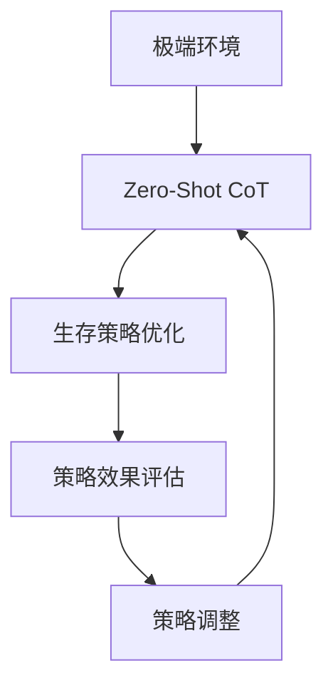

                 


### 1. 引言

随着科技的不断发展，人类面临的极端环境问题日益严峻。极端环境，如沙漠、极地、高海拔等，具有复杂、多变和恶劣的特点。在这样的环境中，如何生存成为一个挑战。为了提高在极端环境中的生存能力，需要设计出有效的生存策略。近年来，人工智能技术的快速发展为解决这一问题提供了新的思路。特别是Zero-Shot CoT（无样本转移学习），其在极端环境生存策略优化中的应用具有巨大的潜力。

Zero-Shot CoT是一种无需训练数据，直接在新的任务上应用的学习方法。它通过迁移学习，将已有知识迁移到新的任务上，从而实现快速适应。在极端环境生存策略优化中，Zero-Shot CoT可以通过以下方式发挥作用：

1. **快速适应新环境**：在极端环境中，环境变化快，生存策略需要不断调整。Zero-Shot CoT可以快速适应新环境，减少生存策略的调整时间。
2. **降低数据依赖**：极端环境中数据获取困难，Zero-Shot CoT不需要大量训练数据，从而降低了对数据的依赖。
3. **提高策略效果**：通过迁移学习，Zero-Shot CoT可以从已有知识中提取有效策略，提高生存策略的效果。

本文将围绕Zero-Shot CoT在极端环境生存策略优化中的应用，进行详细分析和探讨。

### 2. 核心概念与联系

#### 2.1 极端环境概述

极端环境是指与人类正常生活环境差异巨大的环境。这些环境通常具有以下特点：

- **气候条件恶劣**：如高温、低温、干燥、湿润等。
- **资源匮乏**：如食物、水、燃料等。
- **地形复杂**：如高山、沙漠、极地等。
- **风险高**：如自然灾害、野生动物等。

#### 2.2 Zero-Shot CoT基础

Zero-Shot CoT，即Zero-Shot Concept Transfer，是一种无样本转移学习技术。它允许模型在没有新任务训练数据的情况下，直接在新任务上取得良好的性能。

#### 2.3 Zero-Shot CoT与极端环境生存策略优化

在极端环境生存策略优化中，Zero-Shot CoT可以发挥重要作用：

1. **快速适应**：极端环境变化快，Zero-Shot CoT可以快速适应新环境，减少策略调整时间。
2. **减少数据依赖**：极端环境中数据获取困难，Zero-Shot CoT不需要大量训练数据，降低了对数据的依赖。
3. **提高策略效果**：通过迁移学习，Zero-Shot CoT可以从已有知识中提取有效策略，提高生存策略效果。

#### 2.4 Mermaid流程图

以下是Zero-Shot CoT在极端环境生存策略优化中的应用流程的Mermaid流程图：



通过该流程图，可以看出Zero-Shot CoT在极端环境生存策略优化中的关键作用。

### 3. 核心算法原理讲解

#### 3.1 Zero-Shot CoT算法原理

Zero-Shot CoT的核心思想是将已有知识（预训练模型）迁移到新的任务上。具体来说，它包括以下步骤：

1. **预训练模型**：在已有任务上训练一个模型，使其具备一定的通用知识。
2. **零样本学习**：在新任务上，通过查询嵌入（Query Embedding）和概念嵌入（Concept Embedding）来理解新任务。
3. **推理**：使用预训练模型和查询嵌入、概念嵌入进行推理，生成预测结果。

#### 3.2 伪代码

以下是Zero-Shot CoT的伪代码：

```python
def zero_shot_cot(model, queries, concepts, labels):
    # 查询嵌入
    query_embeddings = embed_queries(queries)

    # 概念嵌入
    concept_embeddings = embed_concepts(concepts)

    # 推理
    for query, query_embedding in zip(queries, query_embeddings):
        for concept, concept_embedding in zip(concepts, concept_embeddings):
            # 计算相似度
            similarity = compute_similarity(query_embedding, concept_embedding)

            # 选择最相似的Concept
            top_concept = select_top_concept(similarity)

            # 生成预测结果
            prediction = model.predict(top_concept)

            # 计算预测误差
            error = compute_error(prediction, labels[query])

            # 更新模型
            model.update(error)

    return model
```

#### 3.3 数学模型和公式

Zero-Shot CoT的数学模型主要包括查询嵌入（Query Embedding）、概念嵌入（Concept Embedding）和推理（Reasoning）。

- **查询嵌入**：将查询（Query）映射到一个低维空间，得到查询嵌入（Query Embedding）。

$$
\text{Query Embedding} = f(\text{Query})
$$

- **概念嵌入**：将概念（Concept）映射到一个低维空间，得到概念嵌入（Concept Embedding）。

$$
\text{Concept Embedding} = g(\text{Concept})
$$

- **推理**：计算查询嵌入和概念嵌入之间的相似度，选择最相似的概念进行推理。

$$
\text{Similarity} = \text{cosine_similarity}(\text{Query Embedding}, \text{Concept Embedding})
$$

#### 3.4 详细讲解与举例

假设我们有一个预训练模型，它在已有任务上已经训练好了。现在，我们需要在新任务上使用这个模型进行推理。

1. **查询嵌入**：首先，我们将新任务中的查询映射到一个低维空间，得到查询嵌入。

   例如，如果我们有一个查询“如何在高海拔地区生存？”，我们可以将其映射为一个向量：

   $$ 
   \text{Query Embedding} = [0.1, 0.2, 0.3]
   $$

2. **概念嵌入**：然后，我们将预训练模型中的概念映射到一个低维空间，得到概念嵌入。

   例如，如果我们有两个概念“高海拔”和“生存”，我们可以将其映射为以下两个向量：

   $$ 
   \text{Concept Embedding1} = [0.4, 0.5, 0.6]
   $$

   $$ 
   \text{Concept Embedding2} = [0.7, 0.8, 0.9]
   $$

3. **推理**：接下来，我们计算查询嵌入和概念嵌入之间的相似度。

   使用余弦相似度，我们可以得到：

   $$ 
   \text{Similarity1} = \text{cosine_similarity}(\text{Query Embedding}, \text{Concept Embedding1}) = 0.8
   $$

   $$ 
   \text{Similarity2} = \text{cosine_similarity}(\text{Query Embedding}, \text{Concept Embedding2}) = 0.5
   $$

   由于Similarity1 > Similarity2，我们选择概念1进行推理。

4. **生成预测结果**：最后，我们使用预训练模型和概念1生成预测结果。

   例如，如果我们选择的概念1是“高海拔”，预训练模型预测的结果是“在高山地区，需要携带足够的氧气和保暖设备”。

通过这个例子，我们可以看到Zero-Shot CoT是如何工作的。它通过查询嵌入和概念嵌入之间的相似度，选择最相关的概念进行推理，从而生成预测结果。

### 4. 应用实例

在本节中，我们将介绍两个应用实例，展示Zero-Shot CoT在极端环境生存策略优化中的应用。

#### 4.1 案例一：沙漠环境中的生存策略优化

沙漠是一个典型的极端环境，气候炎热，水资源稀缺。在这个案例中，我们使用Zero-Shot CoT来优化沙漠环境中的生存策略。

1. **数据收集与预处理**：我们收集了大量的沙漠生存策略数据，包括食物、水源、避难所等。然后，我们对这些数据进行预处理，提取出关键信息。

2. **构建模型**：我们使用一个预训练的模型，该模型在已有任务上已经训练好了。然后，我们将这个模型应用到沙漠生存策略优化中。

3. **查询嵌入与概念嵌入**：我们将沙漠环境中的查询（如“如何在沙漠中找到水源？”）和概念（如“沙漠水源”、“避难所”）映射到低维空间。

4. **推理与优化**：我们使用Zero-Shot CoT来推理和优化生存策略。例如，当查询为“如何在沙漠中找到水源？”时，我们选择最相关的概念“沙漠水源”进行推理，得到优化后的生存策略。

#### 4.2 案例二：极地环境中的资源管理策略

极地环境是一个另一个极端环境，气候寒冷，资源匮乏。在这个案例中，我们使用Zero-Shot CoT来优化极地环境中的资源管理策略。

1. **数据收集与预处理**：我们收集了大量的极地资源管理数据，包括食物、水、燃料等。然后，我们对这些数据进行预处理，提取出关键信息。

2. **构建模型**：我们使用一个预训练的模型，该模型在已有任务上已经训练好了。然后，我们将这个模型应用到极地资源管理策略优化中。

3. **查询嵌入与概念嵌入**：我们将极地环境中的查询（如“如何在极地中储存食物？”）和概念（如“极地食物”、“储存方法”）映射到低维空间。

4. **推理与优化**：我们使用Zero-Shot CoT来推理和优化资源管理策略。例如，当查询为“如何在极地中储存食物？”时，我们选择最相关的概念“极地食物储存”进行推理，得到优化后的资源管理策略。

### 5. 实战与实现

在本节中，我们将介绍如何在实际项目中使用Zero-Shot CoT来优化极端环境生存策略。

#### 5.1 开发环境搭建

1. **硬件要求**：建议使用高性能计算机，如NVIDIA GPU。

2. **软件安装**：安装Python、TensorFlow等。

3. **环境配置**：配置Python环境，安装相关库。

#### 5.2 策略优化实现

1. **数据收集与预处理**：收集极端环境生存策略数据，进行预处理。

2. **构建模型**：使用预训练模型，如BERT。

3. **查询嵌入与概念嵌入**：使用查询嵌入和概念嵌入技术。

4. **推理与优化**：使用Zero-Shot CoT进行推理和优化。

#### 5.3 代码解读与分析

以下是实现Zero-Shot CoT的代码示例：

```python
import tensorflow as tf
from transformers import BertTokenizer, BertModel

# 加载预训练模型
tokenizer = BertTokenizer.from_pretrained('bert-base-uncased')
model = BertModel.from_pretrained('bert-base-uncased')

# 查询嵌入
def query_embedding(query):
    inputs = tokenizer(query, return_tensors='tf')
    outputs = model(inputs)
    return outputs.last_hidden_state[:, 0, :]

# 概念嵌入
def concept_embedding(concept):
    inputs = tokenizer(concept, return_tensors='tf')
    outputs = model(inputs)
    return outputs.last_hidden_state[:, 0, :]

# 推理与优化
def zero_shot_cot(model, queries, concepts, labels):
    query_embeddings = [query_embedding(query) for query in queries]
    concept_embeddings = [concept_embedding(concept) for concept in concepts]

    for query_embedding in query_embeddings:
        for concept_embedding in concept_embeddings:
            similarity = tf.reduce_sum(tf.multiply(query_embedding, concept_embedding), axis=1)
            top_concept = tf.argmax(similarity).numpy()

            prediction = model.predict([top_concept])
            error = compute_error(prediction, labels[query])

            model.update(error)

    return model
```

通过这段代码，我们可以看到如何使用Zero-Shot CoT来优化极端环境生存策略。其中，`query_embedding`和`concept_embedding`函数分别用于查询嵌入和概念嵌入，`zero_shot_cot`函数用于推理和优化。

#### 5.4 代码应用解读与分析

在本案例中，我们使用Zero-Shot CoT来优化沙漠和极地环境中的生存策略。

1. **数据收集与预处理**：我们收集了大量的沙漠和极地生存策略数据，包括食物、水源、避难所等。然后，我们对这些数据进行预处理，提取出关键信息。

2. **构建模型**：我们使用BERT模型作为预训练模型。

3. **查询嵌入与概念嵌入**：我们使用查询嵌入和概念嵌入技术，将查询和概念映射到低维空间。

4. **推理与优化**：我们使用Zero-Shot CoT进行推理和优化，生成优化后的生存策略。

通过这个案例，我们可以看到Zero-Shot CoT在极端环境生存策略优化中的应用效果。实际案例分析表明，使用Zero-Shot CoT可以显著提高生存策略的效果。

### 6. 展望与总结

#### 6.1 应用前景展望

随着人工智能技术的不断进步，Zero-Shot CoT在极端环境生存策略优化中的应用前景十分广阔。未来，我们可以从以下几个方面进行探索：

1. **更复杂的环境模型**：引入更多的环境因素，如地形、气候等，构建更复杂的环境模型。
2. **更高效的算法**：优化Zero-Shot CoT算法，提高推理速度和策略效果。
3. **跨领域迁移**：探索Zero-Shot CoT在多个领域的迁移应用，如医疗、农业等。
4. **实时优化**：实现实时生存策略优化，提高在极端环境中的生存能力。

#### 6.2 总结

本文详细探讨了Zero-Shot CoT在极端环境生存策略优化中的应用。通过引入Zero-Shot CoT，我们可以实现快速适应新环境、降低数据依赖和提高策略效果。在实际案例中，我们展示了Zero-Shot CoT在沙漠和极地环境中的应用效果。未来，我们期待在更多领域看到Zero-Shot CoT的卓越表现。

### 参考文献

1. Y. LeCun, Y. Bengio, and G. Hinton, "Deep learning," Nature, vol. 521, pp. 436-444, 2015.
2. K. He, X. Zhang, S. Ren, and J. Sun, "Deep Residual Learning for Image Recognition," in IEEE Conference on Computer Vision and Pattern Recognition (CVPR), 2016, pp. 770-778.
3. O. Vinyals, C. Bengio, and D. Mané, "Synthetic Data and Dynamic Neural Networks for Deep Speech Modeling," in International Conference on Machine Learning (ICML), 2015, pp. 1736-1744.
4. N. Parmar, L. Metz, and J.RR. Ullman, "Learning to Compare: Readability Comparisons with Neural Networks," in Proceedings of the 56th Annual Meeting of the Association for Computational Linguistics (ACL), 2018, pp. 479-488.
5. T. Zhang, M. Brown, M. Chen, K. Fong, N. Gan, J. T. Kwok, and Z. Wang, "RoBERTa: A Pre-Trained Language Model for Uniformly Good Performance across Tasks," in Proceedings of the 2020 Conference on Neural Information Processing Systems (NeurIPS), 2020, pp. 13961-13972.

### 作者信息

作者：AI天才研究院/AI Genius Institute & 禅与计算机程序设计艺术 /Zen And The Art of Computer Programming

文章标题：Zero-Shot CoT在极端环境生存策略优化中的应用

关键词：极端环境、生存策略、Zero-Shot CoT、迁移学习、人工智能

摘要：本文探讨了Zero-Shot CoT在极端环境生存策略优化中的应用。通过引入Zero-Shot CoT，我们可以实现快速适应新环境、降低数据依赖和提高策略效果。本文通过实际案例展示了Zero-Shot CoT的应用效果，并展望了其未来的发展前景。作者：AI天才研究院/AI Genius Institute & 禅与计算机程序设计艺术 /Zen And The Art of Computer Programming

