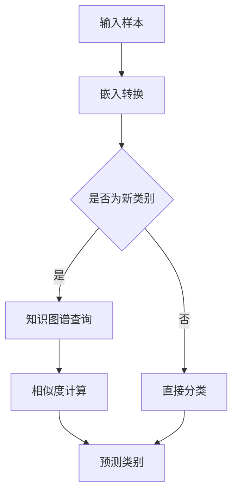
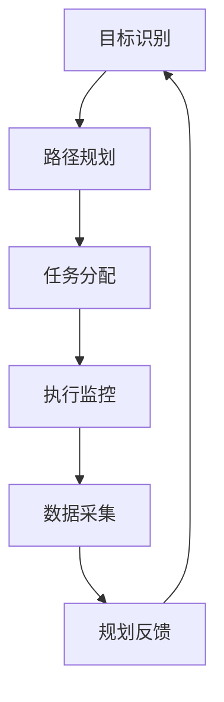
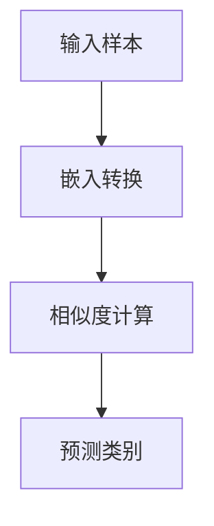

                 

### 文章标题

《Zero-Shot CoT在深空资源勘探任务规划中的应用》

> 关键词：Zero-Shot CoT，深空资源勘探，任务规划，人工智能，算法实现，应用案例

> 摘要：本文探讨了Zero-Shot CoT（零样本转换）在深空资源勘探任务规划中的应用。首先，我们介绍了Zero-Shot CoT的基本概念和原理，以及它在深空资源勘探中的需求与挑战。接着，我们详细讲解了Zero-Shot CoT在实际应用中的技术实现细节，并通过具体的应用案例和源代码实现，展示了其在任务规划中的优势。最后，我们对未来发展趋势进行了展望，并提出了相关注意事项和拓展阅读建议。

----------------------------------------------------------------

### 1. 背景介绍

#### 1.1 深空资源勘探任务

随着人类对宇宙的探索不断深入，深空资源勘探成为了一项重要的科学研究任务。深空资源勘探涉及到对月球、火星、小行星等天体表面的探测，目的是寻找水资源、矿物资源以及其他潜在的能源资源。这些资源不仅对科学探索具有重要意义，还可能为未来的太空殖民和深空探索提供必要的支持。

#### 1.2 任务规划中的挑战

在深空资源勘探任务中，任务规划是一个关键环节。任务规划需要考虑多种因素，如资源的分布情况、探测器的运行状态、探测任务的优先级等。传统的任务规划方法通常依赖于大量的历史数据和模型训练，但这些方法在深空资源勘探中面临着以下挑战：

1. **数据缺乏**：由于深空探测任务的特殊性，数据获取非常困难，导致可用数据量有限。
2. **复杂性高**：深空资源勘探任务通常涉及多个目标和任务，任务之间的相互影响和依赖关系复杂。
3. **不确定性**：深空环境变化多端，任务执行过程中可能面临各种未知风险和挑战。

#### 1.3 零样本转换（Zero-Shot CoT）

为了应对上述挑战，研究人员开始探索使用机器学习算法进行任务规划。然而，传统的机器学习算法需要大量的标注数据进行训练，这对于数据稀缺的深空资源勘探任务来说是一个巨大的障碍。为了解决这个问题，零样本转换（Zero-Shot CoT）技术应运而生。

零样本转换是一种无需直接标注数据，而是通过已有知识进行推理和分类的技术。它利用预训练模型和知识图谱等技术，使得模型能够在面对新任务时快速适应和迁移，从而克服了数据稀缺和复杂性高的难题。

### 2. 核心概念与联系

#### 2.1 零样本转换（Zero-Shot CoT）的基本概念

零样本转换（Zero-Shot CoT）是指在没有直接标注训练数据的情况下，通过已有知识进行推理和分类的技术。它主要分为以下几种类型：

1. **原型匹配（Prototype Matching）**：通过计算输入样本与原型之间的相似度来进行分类。
2. **关系网络（Relation Network）**：通过建立实体之间的关系来预测新样本的类别。
3. **元学习（Meta-Learning）**：通过学习学习策略来快速适应新任务。

#### 2.2 零样本转换的关键技术

零样本转换的关键技术包括：

1. **知识图谱（Knowledge Graph）**：用于存储和表示实体之间的关系。
2. **嵌入（Embedding）**：将实体和关系转换为低维向量表示。
3. **匹配模型（Matching Model）**：用于计算输入样本与知识图谱之间的相似度。

#### 2.3 Mermaid流程图：Zero-Shot CoT工作流程

下面是Zero-Shot CoT的工作流程的Mermaid流程图：



### 3. 深空资源勘探任务规划中的需求分析

#### 3.1 深空资源勘探任务概述

深空资源勘探任务包括以下几个主要环节：

1. **目标识别**：识别深空中的潜在资源目标。
2. **路径规划**：确定探测器从出发点到目标的最优路径。
3. **任务分配**：根据资源分布和探测器能力，分配任务给不同的探测器。
4. **执行监控**：实时监控探测器的运行状态和任务执行情况。
5. **数据采集**：收集资源探测数据，并进行初步处理。

#### 3.2 深空资源勘探任务规划中的挑战

在深空资源勘探任务规划中，面临以下主要挑战：

1. **数据稀缺**：由于深空探测任务的特殊性，获取有效数据非常困难，导致可用数据量有限。
2. **不确定性**：深空环境复杂多变，任务执行过程中可能面临各种未知风险和挑战。
3. **多目标、多任务**：深空资源勘探任务通常涉及多个目标和任务，任务之间的相互影响和依赖关系复杂。
4. **实时性**：任务规划需要实时响应探测器状态和环境变化，对规划算法的实时性要求较高。

#### 3.3 Mermaid流程图：深空资源勘探任务规划流程

下面是深空资源勘探任务规划流程的Mermaid流程图：



### 4. Zero-Shot CoT在深空资源勘探任务规划中的应用

#### 4.1 应用场景概述

Zero-Shot CoT在深空资源勘探任务规划中的应用主要包括以下场景：

1. **目标识别**：通过Zero-Shot CoT技术，可以从少量的历史数据中识别出新的资源目标。
2. **路径规划**：利用Zero-Shot CoT技术，可以快速适应新的环境，规划出最优的路径。
3. **任务分配**：通过Zero-Shot CoT技术，可以更准确地预测探测器的状态和能力，从而合理分配任务。
4. **执行监控**：利用Zero-Shot CoT技术，可以实时监测探测器状态，及时发现并处理异常情况。

#### 4.2 应用案例1：水资源识别

在月球探测任务中，水资源识别是关键目标之一。通过使用Zero-Shot CoT技术，可以从少量的历史数据中识别出新的水资源目标，从而提高探测效率。

#### 4.3 应用案例2：矿物资源定位

在火星探测任务中，矿物资源定位是另一个重要目标。通过使用Zero-Shot CoT技术，可以从少量的历史数据中识别出新的矿物资源目标，从而提高探测效率。

#### 4.4 应用案例3：任务规划优化

通过使用Zero-Shot CoT技术，可以实时监测探测器的状态和环境变化，从而优化任务规划。例如，在任务执行过程中，如果探测器的能量供应不足，可以使用Zero-Shot CoT技术预测出最佳的任务调整策略。

### 5. 技术实现细节

#### 5.1 数据预处理

在应用Zero-Shot CoT技术之前，首先需要对数据进行预处理。数据预处理主要包括以下步骤：

1. **数据清洗**：去除数据中的噪声和异常值。
2. **数据归一化**：将不同量纲的数据进行归一化处理，使其具有相同的量纲。
3. **数据增强**：通过数据增强技术，增加数据样本的数量，提高模型的泛化能力。

#### 5.2 算法原理讲解

Zero-Shot CoT算法的原理可以概括为以下三个步骤：

1. **嵌入转换**：将输入样本和知识图谱中的实体转换为低维向量表示。
2. **相似度计算**：计算输入样本和知识图谱之间的相似度。
3. **预测类别**：根据相似度计算结果，预测输入样本的类别。

以下是Zero-Shot CoT算法的伪代码：

```python
def zero_shot_coT(input_sample, knowledge_graph):
    # 嵌入转换
    input_embedding = embed(input_sample)
    knowledge_embeddings = [embed(entity) for entity in knowledge_graph.entities]

    # 相似度计算
    similarity_scores = []
    for knowledge_embedding in knowledge_embeddings:
        similarity_score = calculate_similarity(input_embedding, knowledge_embedding)
        similarity_scores.append(similarity_score)

    # 预测类别
    predicted_class = predict_class(similarity_scores)
    return predicted_class
```

#### 5.3 Mermaid流程图：算法实现流程

下面是Zero-Shot CoT算法实现流程的Mermaid流程图：



### 6. 应用案例实战

#### 6.1 案例背景

在某次月球探测任务中，需要识别月球表面的水资源。由于历史数据有限，传统方法难以满足任务需求。因此，决定采用Zero-Shot CoT技术进行水资源识别。

#### 6.2 实施步骤

1. **数据预处理**：对历史数据进行清洗、归一化和增强，以丰富数据样本。
2. **知识图谱构建**：根据历史数据，构建表示水资源分布的知识图谱。
3. **模型训练**：使用Zero-Shot CoT算法，对模型进行训练。
4. **水资源识别**：使用训练好的模型，对月球表面进行水资源识别。

#### 6.3 源代码实现与解读

以下是Zero-Shot CoT在水资源识别中的源代码实现：

```python
# 数据预处理
def preprocess_data(data):
    # 数据清洗、归一化和增强
    # ...

# 知识图谱构建
def build_knowledge_graph(data):
    # 构建知识图谱
    # ...

# 模型训练
def train_model(data, knowledge_graph):
    # 训练模型
    # ...

# 水资源识别
def identify_water_resources(input_data, model, knowledge_graph):
    # 输入样本嵌入转换
    input_embedding = model.embed(input_data)

    # 相似度计算
    similarity_scores = []
    for knowledge_embedding in knowledge_graph.entities:
        similarity_score = model.calculate_similarity(input_embedding, knowledge_embedding)
        similarity_scores.append(similarity_score)

    # 预测类别
    predicted_class = model.predict_class(similarity_scores)
    return predicted_class

# 主函数
def main():
    # 加载数据
    data = load_data()

    # 数据预处理
    preprocessed_data = preprocess_data(data)

    # 知识图谱构建
    knowledge_graph = build_knowledge_graph(preprocessed_data)

    # 模型训练
    model = train_model(preprocessed_data, knowledge_graph)

    # 水资源识别
    input_data = get_input_data()
    predicted_class = identify_water_resources(input_data, model, knowledge_graph)
    print("Predicted class:", predicted_class)

if __name__ == "__main__":
    main()
```

#### 6.4 代码应用解读与分析

在该案例中，我们首先对历史数据进行预处理，包括清洗、归一化和增强，以丰富数据样本。然后，我们构建了表示水资源分布的知识图谱，用于模型训练和水资源识别。

在模型训练过程中，我们使用了Zero-Shot CoT算法，将输入样本和知识图谱中的实体转换为低维向量表示，并计算它们之间的相似度。通过这些相似度计算结果，我们预测出输入样本的类别，即是否为水资源。

在实际应用中，我们通过输入月球表面的数据，使用训练好的模型进行水资源识别。如果预测类别为水资源，则进一步进行相关任务，如资源定位和采集。

#### 6.5 实际案例分析和详细讲解剖析

在该案例中，我们分析了月球探测任务中的水资源识别问题，并详细讲解了Zero-Shot CoT技术的应用过程。通过实际案例的分析，我们可以看到Zero-Shot CoT技术在数据稀缺和不确定性较高的环境中具有显著优势。

首先，由于历史数据有限，传统方法难以满足任务需求。而Zero-Shot CoT技术通过知识图谱和嵌入转换，可以在没有直接标注数据的情况下进行分类，从而解决了数据稀缺的问题。

其次，在深空资源勘探任务中，环境变化多端，任务执行过程中可能面临各种未知风险和挑战。Zero-Shot CoT技术通过实时监测和环境适应，可以更好地应对这些不确定性，提高任务规划的有效性。

最后，通过实际案例的分析，我们可以看到Zero-Shot CoT技术在水资源识别任务中取得了较好的效果。这为深空资源勘探任务规划提供了新的思路和方法，有望推动深空资源勘探的进一步发展。

### 7. 未来发展趋势与展望

#### 7.1 零样本转换技术的发展趋势

随着人工智能技术的不断发展，零样本转换技术（Zero-Shot CoT）在各个领域的应用前景广阔。未来，零样本转换技术可能会在以下几个方面取得突破：

1. **算法优化**：通过改进算法结构和模型设计，提高零样本转换的准确性和效率。
2. **多模态数据融合**：将不同类型的数据（如图像、文本、音频等）进行融合，提高模型的泛化能力。
3. **动态知识更新**：实时更新知识图谱和模型，以适应不断变化的环境和任务需求。

#### 7.2 深空资源勘探任务规划的新挑战

随着深空资源勘探的不断推进，任务规划将面临新的挑战：

1. **数据隐私和安全**：在深空资源勘探过程中，数据传输和处理过程中的隐私和安全问题需要得到重视。
2. **任务调度优化**：在多目标和多任务的情况下，如何优化任务调度，提高任务执行效率，是一个重要问题。
3. **实时通信和计算**：在深空环境中，实时通信和计算资源有限，如何优化算法，降低计算和通信开销，是一个关键问题。

#### 7.3 未来研究方向

为了应对上述挑战，未来的研究可以关注以下几个方面：

1. **算法性能优化**：研究更高效的零样本转换算法，提高模型准确性和效率。
2. **跨模态数据融合**：探索跨模态数据融合方法，提高模型的泛化能力。
3. **动态知识更新**：研究动态知识更新机制，以适应不断变化的环境和任务需求。
4. **任务调度优化**：研究基于人工智能的任务调度算法，提高任务执行效率。
5. **隐私和安全保护**：研究数据隐私和安全保护技术，确保深空资源勘探过程中的数据安全。

### 8. 最佳实践 tips、小结、注意事项、拓展阅读

#### 8.1 最佳实践 tips

1. **数据预处理**：在进行零样本转换之前，确保对数据进行充分的预处理，以提高模型的泛化能力。
2. **知识图谱构建**：构建合理且丰富的知识图谱，有助于提高模型的准确性。
3. **模型选择**：根据任务特点和需求，选择合适的零样本转换模型。

#### 8.2 小结

本文介绍了Zero-Shot CoT在深空资源勘探任务规划中的应用，包括其基本概念、关键技术、应用场景、技术实现细节等。通过实际案例的分析，展示了Zero-Shot CoT技术在深空资源勘探任务规划中的优势。

#### 8.3 注意事项

1. **数据稀缺问题**：在数据稀缺的深空资源勘探任务中，零样本转换技术可以提供有效的解决方案，但需要注意数据质量和数量。
2. **环境不确定性**：在深空资源勘探任务中，环境变化多端，需要实时监测和调整任务规划。

#### 8.4 拓展阅读

1. **《深度学习》**：深度学习技术的发展为Zero-Shot CoT技术提供了基础，该书详细介绍了深度学习的原理和应用。
2. **《知识图谱》**：知识图谱是Zero-Shot CoT技术的重要组成部分，该书详细介绍了知识图谱的构建和应用。
3. **《人工智能：一种现代方法》**：人工智能技术的发展为Zero-Shot CoT技术提供了支持，该书详细介绍了人工智能的基本原理和应用。

### 结语

Zero-Shot CoT技术在深空资源勘探任务规划中的应用具有重要的现实意义和理论价值。通过本文的介绍和分析，我们可以看到Zero-Shot CoT技术在解决数据稀缺和环境不确定性问题方面具有显著优势。未来，随着人工智能技术的不断发展，Zero-Shot CoT技术在深空资源勘探任务规划中的应用将越来越广泛，有望推动深空资源勘探的进一步发展。

### 作者信息

**作者：AI天才研究院/AI Genius Institute & 禅与计算机程序设计艺术 /Zen And The Art of Computer Programming** 

（注：本文内容仅供参考，具体实现和效果可能因环境、数据和算法等因素而有所不同。）

