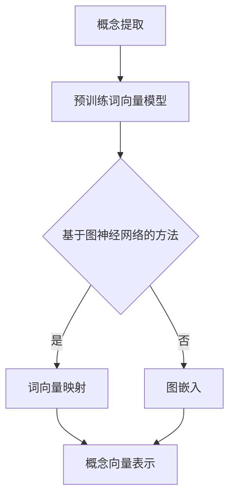
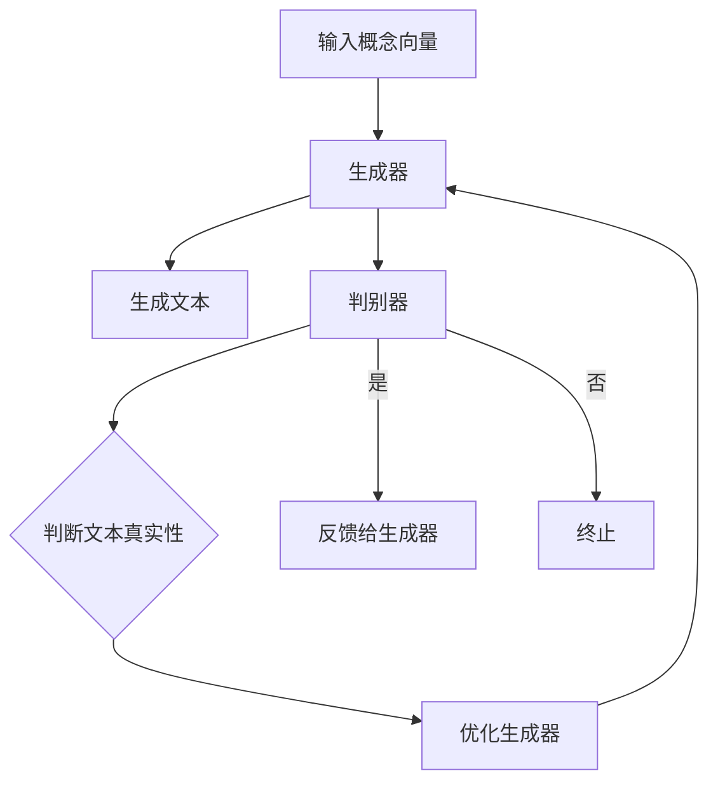
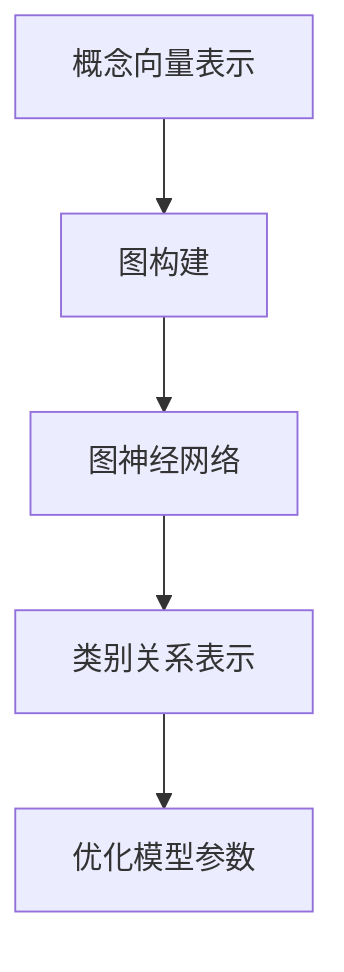
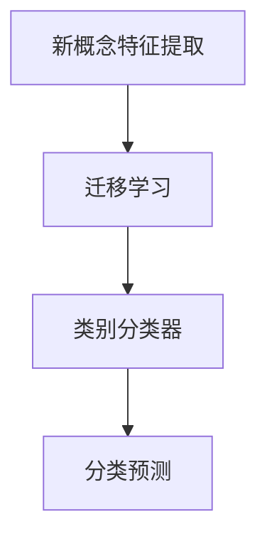
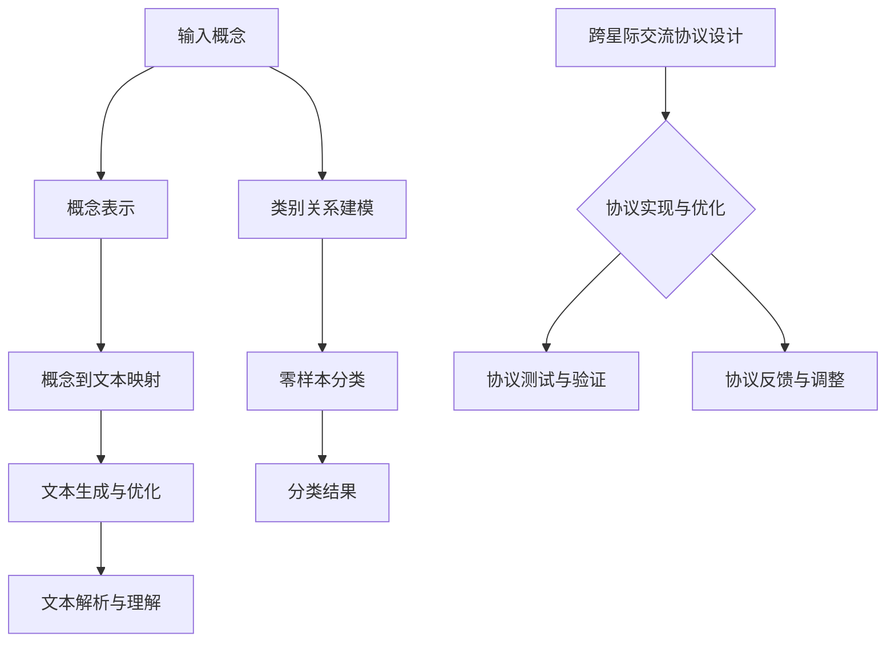

                 

## 文章标题

### Zero-Shot CoT在跨星际文明交流协议设计中的潜在应用

关键词：零样本迁移学习、概念到文本（CoT）、跨星际文明交流、协议设计

摘要：本文探讨了零样本迁移学习（Zero-Shot Learning，ZSL）中的一种新兴方法——概念到文本（Concept-to-Text，CoT）模型，在跨星际文明交流协议设计中的应用潜力。通过分析ZSL和CoT的基本原理，本文构建了一个基于CoT的跨星际文明交流协议设计框架，并探讨了其在实际应用中的挑战和未来发展方向。

## 引言

随着人工智能技术的飞速发展，零样本迁移学习（Zero-Shot Learning，ZSL）成为了一个备受关注的研究领域。ZSL的核心思想是在没有针对特定类别进行训练的情况下，通过跨类别的知识迁移，实现对新类别的预测和识别。其中，概念到文本（Concept-to-Text，CoT）模型作为一种重要的ZSL方法，近年来在自然语言处理（Natural Language Processing，NLP）领域取得了显著的成果。

另一方面，跨星际文明交流是一个充满挑战的领域。由于星际间的巨大距离、复杂环境以及文明差异，实现有效的跨星际交流面临着诸多难题。随着人类对宇宙的探索不断深入，跨星际文明交流的重要性日益凸显。因此，如何设计一种适用于跨星际交流的协议，成为当前研究的热点问题。

本文旨在探讨Zero-Shot CoT在跨星际文明交流协议设计中的潜在应用。首先，我们将介绍零样本迁移学习和概念到文本的基本原理，然后分析ZSL和CoT在跨星际文明交流中的可能应用场景，最后探讨其面临的挑战和未来发展方向。

### 零样本学习原理

零样本学习（Zero-Shot Learning，ZSL）是一种机器学习方法，旨在处理在训练阶段没有直接接触过的新类别问题。传统的机器学习模型依赖于大量带有标签的数据进行训练，从而学习到数据分布的特征，进而对新样本进行分类或预测。然而，在实际应用中，我们往往无法获取到所有类别的标签数据，或者某些类别的标签数据非常稀缺。在这种情况下，ZSL方法提供了有效的解决方案。

ZSL的核心思想是通过跨类别的知识迁移，使得模型能够在没有直接训练数据的情况下，对新类别进行预测和识别。具体来说，ZSL方法主要包括以下几方面：

1. **类别表示学习**：
   在ZSL中，首先需要学习一个类别表示模型，将不同类别的数据映射到一个共同的低维空间中。这个模型通常使用预训练的词向量（如Word2Vec、GloVe等）或者基于图神经网络的方法（如Graph Convolutional Network，GCN）来实现。通过这种方式，不同类别的数据在低维空间中能够形成一定的聚类结构，从而为后续的预测提供了基础。

2. **类别关系建模**：
   在ZSL中，类别关系建模是一个关键步骤。传统的类别关系建模方法主要包括词嵌入空间中的余弦相似度计算、基于图神经网络的类别关系表示等。通过类别关系建模，模型可以捕捉到不同类别之间的内在联系，从而提高对新类别预测的准确性。

3. **分类器训练**：
   在完成类别表示学习和类别关系建模之后，ZSL模型会使用一个分类器对新类别进行预测。分类器可以是传统的机器学习算法（如支持向量机、随机森林等），也可以是深度学习模型（如卷积神经网络、循环神经网络等）。在训练过程中，模型会利用类别表示和类别关系，学习到如何将新类别与已知类别进行区分。

4. **实例级预测**：
   在ZSL的应用场景中，通常需要对单个新实例进行预测。实例级预测的方法主要包括基于原型的方法、基于匹配度的方法等。这些方法通过将新实例与已知类别进行对比，从而实现对新类别的预测。

总的来说，零样本学习通过引入类别表示学习和类别关系建模，实现了在无标签数据情况下对新类别的预测。这使得ZSL在许多实际应用场景中具有广泛的应用价值，如图像识别、语音识别、自然语言处理等。然而，ZSL也存在一些挑战，如类别表示质量、类别关系建模准确性等，这些问题的解决将进一步提高ZSL的性能。

### 概念到文本（CoT）原理及其在NLP中的应用

概念到文本（Concept-to-Text，CoT）模型是一种基于零样本学习（Zero-Shot Learning，ZSL）的生成模型，它能够将抽象的概念转换为具体的文本描述。CoT模型在自然语言处理（Natural Language Processing，NLP）领域具有重要的应用价值，特别是在开放域问答、文本生成和跨领域文本翻译等方面。

#### CoT模型的基本原理

CoT模型的核心思想是将概念（Concept）映射到文本（Text）上。具体来说，CoT模型由两部分组成：概念嵌入（Concept Embedding）和文本生成（Text Generation）。

1. **概念嵌入（Concept Embedding）**：
   概念嵌入是将抽象的概念映射到低维空间中的向量表示。在CoT模型中，通常使用预训练的词向量（如Word2Vec、GloVe等）或者基于图神经网络的方法（如Graph Convolutional Network，GCN）来实现。这些方法可以将不同类别的概念在低维空间中进行表示，从而形成一定的聚类结构。

2. **文本生成（Text Generation）**：
   文本生成是将概念向量映射到具体的文本描述上。在CoT模型中，常用的方法是基于生成对抗网络（Generative Adversarial Networks，GAN）或自注意力机制（Self-Attention Mechanism）的变体。这些方法通过学习概念向量和文本之间的映射关系，生成符合语义和语法规则的文本描述。

#### CoT模型在NLP中的应用

1. **开放域问答（Open-Domain Question Answering，QA）**：
   开放域问答是NLP中的一个重要任务，旨在自动回答用户提出的各种问题。CoT模型在开放域问答中具有显著的优势，因为它们可以处理用户输入的新概念，并生成相应的文本回答。具体来说，CoT模型首先将用户的问题转换为概念向量，然后通过文本生成模块生成回答。

2. **文本生成（Text Generation）**：
   文本生成是另一个重要的NLP任务，旨在根据给定的输入生成连贯、有意义的文本。CoT模型在文本生成中可以用于生成新闻文章、故事、对话等。通过将输入的概念映射到文本描述，CoT模型可以生成符合特定主题和风格的文本。

3. **跨领域文本翻译（Cross-Domain Text Translation）**：
   跨领域文本翻译是将一种领域的文本转换为另一种领域的文本。传统的文本翻译方法通常依赖于大量双语文本数据进行训练，而CoT模型则可以处理无双语文本数据的情况。通过将源领域的概念映射到目标领域的概念，CoT模型可以生成相应的目标领域文本。

4. **对话系统（Dialogue System）**：
   对话系统是NLP中另一个重要的应用领域，旨在模拟人类对话，提供有意义的交互体验。CoT模型在对话系统中可以用于生成对话响应，根据用户输入的概念生成连贯的对话文本。

#### CoT模型的优势与挑战

CoT模型在NLP中的应用展示了其强大的灵活性和广泛性。然而，要充分发挥CoT模型的优势，还需要解决以下几个挑战：

1. **概念表示**：
   概念表示是CoT模型的关键步骤。如何准确地捕捉概念的含义和语义，是一个重要的研究问题。目前，预训练的词向量方法和基于图神经网络的方法在概念表示方面取得了一定的进展，但仍然存在一定的局限性。

2. **文本生成质量**：
   文本生成质量是衡量CoT模型性能的重要指标。生成文本的连贯性、语义准确性、语法正确性等方面都需要进一步提高。为此，研究者们提出了多种文本生成方法，如基于生成对抗网络的变体和自注意力机制的变体，以提升文本生成质量。

3. **跨领域适应性**：
   CoT模型在跨领域文本翻译中的应用需要模型具有良好的跨领域适应性。如何使模型在不同领域之间进行有效的迁移学习，是一个重要的研究方向。

总之，概念到文本（CoT）模型作为一种基于零样本学习的生成模型，在自然语言处理领域具有重要的应用价值。通过将抽象的概念转换为具体的文本描述，CoT模型为开放域问答、文本生成、跨领域文本翻译和对话系统等领域提供了新的解决方案。然而，要充分发挥CoT模型的优势，还需要进一步解决概念表示、文本生成质量和跨领域适应性等挑战。

### 跨星际文明交流的理论框架

跨星际文明交流是一个复杂且充满挑战的领域，涉及多个学科，如天文学、物理学、语言学和通信技术等。为了更好地探讨Zero-Shot CoT在跨星际文明交流协议设计中的潜在应用，我们需要建立一套跨星际文明交流的理论框架。

#### 1. 通信基础

跨星际通信的关键在于信号传输的有效性和可靠性。由于星际间的巨大距离，信号传输速度受到光速的限制。因此，如何确保信号的稳定传输和低延迟通信成为跨星际文明交流的首要问题。此外，信号在传输过程中还可能受到宇宙噪声、星际介质的影响，这要求通信系统具有强大的抗干扰能力和自适应能力。

#### 2. 语言和符号系统

跨星际文明交流的另一个重要方面是语言和符号系统的选择。由于不同文明可能拥有不同的语言和符号系统，建立一种通用的交流语言和符号系统至关重要。一种可能的方案是基于数学和逻辑的符号系统，这些符号系统具有普适性和可解释性，不受特定文明语言的影响。

#### 3. 信息编码与解码

信息编码与解码是跨星际文明交流的核心技术。为了确保信息能够准确无误地传输，需要设计一种高效、可靠的编码方法。在接收端，解码系统需要能够将接收到的信号准确还原为原始信息。这一过程需要考虑到信号的衰减、噪声干扰等因素。

#### 4. 交流协议设计

跨星际文明交流协议设计是确保交流顺利进行的关键。协议应包括通信规范、数据格式、编码解码规则、错误纠正机制等。一个完善的交流协议应能够适应不同文明的需求，具有一定的灵活性和扩展性。

#### 5. 文明差异与适应

跨星际文明交流不仅需要技术上的支持，还需要考虑文明差异和文化差异。不同文明可能有不同的价值观、信仰、习俗等，这要求交流协议能够在尊重差异的基础上，找到共同的交流基础。此外，文明之间的信任和合作也是跨星际文明交流成功的关键因素。

### 基于CoT的跨星际文明交流协议设计框架

结合以上理论框架，我们可以构建一个基于概念到文本（CoT）的跨星际文明交流协议设计框架。这个框架的核心思想是将抽象的概念（如科学原理、技术方案、文化习俗等）转换为具体的文本描述，以实现跨星际文明的有效交流。

#### 1. 概念表示

首先，需要建立一个跨星际交流的概念表示系统，将不同文明的重要概念映射到统一的语义空间中。这可以通过预训练的词向量模型或基于图神经网络的表示学习来实现。例如，可以使用预训练的GloVe词向量模型，将不同文明的词汇映射到低维语义空间中，形成概念表示。

#### 2. 概念到文本映射

接下来，需要构建一个概念到文本（CoT）映射模型，将概念表示转换为具体的文本描述。这可以通过生成对抗网络（GAN）或自注意力机制的变体来实现。通过训练大量的跨星际交流文本数据，模型可以学习到如何将抽象的概念映射到具体的文本描述，从而生成符合语义和语法规则的跨星际交流文本。

#### 3. 交流协议设计

基于CoT映射模型，我们可以设计一套跨星际文明交流协议。该协议应包括以下内容：

- **通信规范**：定义跨星际通信的频率、带宽、传输速率等参数，确保信号传输的稳定性和可靠性。
- **数据格式**：规定跨星际交流数据的基本格式，如文本、图像、音频等，以及相应的编码解码规则。
- **错误纠正机制**：设计有效的错误纠正编码方案，提高数据传输的准确性。
- **协议扩展**：提供协议的扩展机制，以适应未来可能出现的文明差异和需求变化。

#### 4. 文本生成与解析

跨星际文明交流协议还涉及文本生成与解析技术。文本生成是将概念表示转换为具体的文本描述，而文本解析则是将接收到的文本描述还原为原始概念表示。这一过程需要模型具有高度的可解释性和准确性。

#### 5. 交流评估与反馈

为了确保跨星际文明交流的顺利进行，还需要建立一套交流评估与反馈机制。通过对交流过程的监控和评估，可以及时发现和解决交流中的问题，优化交流协议和模型性能。

总之，基于概念到文本（CoT）的跨星际文明交流协议设计框架，通过将抽象概念转换为具体的文本描述，实现跨星际文明的有效交流。这一框架不仅为跨星际交流提供了新的技术路径，也为跨学科合作提供了有力支持。

### ZSCoT模型架构

在探讨基于概念到文本（CoT）的跨星际文明交流协议设计之前，我们需要先了解Zero-Shot CoT（ZSCoT）模型的基本架构。ZSCoT模型是一种结合了零样本学习和概念到文本技术的复合模型，旨在解决跨星际文明交流中的语言障碍和概念理解问题。其整体架构可以概括为以下几个关键组成部分：

#### 1. 概念表示模块

概念表示模块是ZSCoT模型的核心部分，负责将不同文明的重要概念映射到统一的语义空间中。具体步骤如下：

- **概念提取**：首先，从跨星际交流的文本数据中提取关键概念，如科学原理、技术方案、文化习俗等。
- **向量表示**：使用预训练的词向量模型（如GloVe或BERT）或基于图神经网络的表示学习算法（如Graph Embedding）将这些概念映射到低维语义空间中，形成概念向量表示。

#### 2. 概念到文本映射模块

概念到文本映射模块负责将概念向量转换为具体的文本描述。这一模块采用生成对抗网络（GAN）或自注意力机制的变体来实现。具体步骤如下：

- **文本生成**：输入概念向量，通过生成对抗网络（GAN）或自注意力机制生成文本。GAN由生成器（Generator）和判别器（Discriminator）组成，生成器生成文本，判别器判断文本的真实性。通过反复训练，生成器不断优化，生成更加符合语义和语法规则的文本。
- **文本优化**：生成的文本可能存在语法错误或不连贯的情况，因此需要通过文本优化模块对生成的文本进行进一步处理，如语法检查、拼写修正、语义连贯性增强等。

#### 3. 类别关系建模模块

类别关系建模模块负责建立不同概念之间的关联关系，以增强模型的泛化能力。具体步骤如下：

- **类别表示**：将不同概念在低维语义空间中的向量表示进行聚类，形成类别表示。
- **关系建模**：使用图神经网络（如Graph Convolutional Network，GCN）或图嵌入（如Node2Vec）等方法，建立不同概念之间的关联关系。

#### 4. 零样本分类模块

零样本分类模块负责对新概念进行分类，实现跨星际文明交流中的零样本识别。具体步骤如下：

- **特征提取**：将新概念映射到低维语义空间，形成特征向量。
- **分类器训练**：使用迁移学习或元学习等技术，将已有类别分类器的知识迁移到新概念分类上，训练一个零样本分类器。
- **分类预测**：将新概念特征输入到零样本分类器，预测其类别。

#### ZSCoT模型的整体工作流程

ZSCoT模型的整体工作流程可以概括为以下几个步骤：

1. **概念提取**：从跨星际交流文本中提取关键概念。
2. **向量表示**：使用预训练的词向量模型或基于图神经网络的表示学习算法，将概念映射到低维语义空间。
3. **文本生成**：输入概念向量，通过生成对抗网络或自注意力机制生成文本。
4. **文本优化**：对生成的文本进行语法检查、拼写修正和语义连贯性增强。
5. **类别关系建模**：使用图神经网络或图嵌入方法，建立不同概念之间的关联关系。
6. **零样本分类**：将新概念特征输入到零样本分类器，预测其类别。

通过以上步骤，ZSCoT模型实现了从概念表示到文本生成的全过程，为跨星际文明交流提供了有效的技术支持。接下来，我们将详细介绍ZSCoT模型的训练方法和优化技巧。

#### ZSCoT模型的训练方法

ZSCoT模型的训练方法是一个复杂且关键的过程，它决定了模型在跨星际文明交流中的表现。为了使模型能够准确地将抽象概念转换为具体的文本描述，并实现零样本分类，我们需要采用一系列有效的训练方法和优化技巧。

##### 1. 数据准备

首先，我们需要收集和整理大量的跨星际交流文本数据，包括科学原理、技术方案、文化习俗等。这些数据应覆盖广泛的领域和概念，以确保模型具有足够的泛化能力。数据收集后，需要对文本进行预处理，如去除无关信息、标准化文本格式、分词和词性标注等。

##### 2. 概念提取

在数据预处理阶段，我们需要提取文本中的关键概念。这一步骤可以通过使用预训练的词向量模型（如GloVe或BERT）或基于图神经网络的表示学习算法（如Graph Embedding）来实现。这些算法可以将文本中的词汇映射到低维语义空间，形成概念向量表示。



##### 3. 概念到文本映射

概念到文本映射是ZSCoT模型的核心部分，通常采用生成对抗网络（GAN）或自注意力机制的变体来实现。以下是一个基于GAN的文本生成流程：



在GAN中，生成器（Generator）生成文本，判别器（Discriminator）判断文本的真实性。通过反复训练，生成器不断优化，生成更加符合语义和语法规则的文本。

##### 4. 类别关系建模

类别关系建模是增强模型泛化能力的重要步骤。我们使用图神经网络（如Graph Convolutional Network，GCN）或图嵌入（如Node2Vec）等方法，建立不同概念之间的关联关系。以下是一个基于GCN的类别关系建模流程：



在类别关系表示过程中，我们通过GCN对概念向量进行聚合和更新，从而形成类别关系表示。

##### 5. 零样本分类

零样本分类是ZSCoT模型的关键任务，它使得模型能够识别新概念。我们采用迁移学习或元学习等技术，将已有类别分类器的知识迁移到新概念分类上。以下是一个基于迁移学习的零样本分类流程：



在迁移学习过程中，我们首先提取新概念的特征向量，然后使用预训练的类别分类器对新概念进行分类预测。

##### 6. 训练策略

为了提高ZSCoT模型的训练效果，我们采用以下策略：

- **多任务学习**：在训练过程中，同时优化概念到文本映射、类别关系建模和零样本分类等多个任务，以提高模型的综合性能。
- **数据增强**：通过随机变换（如文本重排、替换等）增加训练数据的多样性，提高模型的泛化能力。
- **模型蒸馏**：将预训练的大型模型的知识传递给小模型，以提高小模型的性能。

通过以上训练方法和优化技巧，ZSCoT模型能够有效学习跨星际交流中的抽象概念，并准确地将这些概念转换为具体的文本描述，实现零样本分类，为跨星际文明交流提供强有力的技术支持。

#### 模型优化与调参技巧

在ZSCoT模型的训练过程中，模型优化和调参是至关重要的一环。合理的优化策略和参数设置不仅能够提高模型的训练效率，还能显著提升其性能和泛化能力。以下是一些常用的模型优化与调参技巧：

##### 1. 优化策略

- **Adam优化器**：Adam优化器是一种自适应的优化算法，结合了AdaGrad和RMSProp的优点。它能够自适应地调整学习率，提高模型的收敛速度。在ZSCoT模型中，Adam优化器是一个很好的选择。

```python
optimizer = optim.Adam(model.parameters(), lr=0.001)
```

- **学习率调度**：学习率调度是一种常用的优化策略，通过动态调整学习率，加速模型的收敛。常用的学习率调度策略包括Step Decay、Exponential Decay和Learning Rate Warmup等。

```python
scheduler = optim.lr_scheduler.StepLR(optimizer, step_size=30, gamma=0.1)
```

- **Dropout**：Dropout是一种正则化技术，通过随机丢弃一部分神经元，减少过拟合。在ZSCoT模型中，可以在生成器和判别器中使用Dropout来提高模型的泛化能力。

```python
model.dropout = nn.Dropout(p=0.5)
```

##### 2. 调参技巧

- **模型架构选择**：选择合适的模型架构对模型性能有重要影响。在ZSCoT模型中，可以使用预训练的词向量模型（如GloVe、BERT）或基于图神经网络的表示学习算法（如Graph Embedding）。根据具体应用场景和数据规模，可以选择适当的模型架构。

- **批量大小**：批量大小对模型的训练效果和收敛速度有显著影响。较小的批量大小可以更好地利用计算资源，但可能会导致梯度不稳定。较大的批量大小则可以提高训练的稳定性，但可能需要更长时间来收敛。在ZSCoT模型中，通常选择批量大小为32或64。

```python
batch_size = 64
```

- **迭代次数**：迭代次数（或训练轮数）决定了模型的训练深度。过多的迭代次数可能导致过拟合，而较少的迭代次数可能无法充分训练模型。在ZSCoT模型中，通常根据数据规模和模型复杂度选择适当的迭代次数。

```python
num_epochs = 100
```

- **正则化参数**：正则化参数（如L1、L2正则化系数）用于控制正则化强度的调整。适当的正则化参数可以减少过拟合，提高模型的泛化能力。

```python
l1_reg = 0.001
l2_reg = 0.001
```

通过上述优化策略和调参技巧，我们可以有效地提升ZSCoT模型的训练效果和性能。在实际应用中，需要根据具体问题和数据特点进行适当的调整和优化。

### 案例分析

#### 案例一：某特定情境下的ZSCoT应用

在跨星际文明交流的某个特定情境中，假设我们有一个来自外星文明的文本信息，需要将其转换为地球文明可以理解的语言。这一情境涉及科学原理的交流，例如外星文明描述了一种未知的能源形式，而地球文明需要理解并分析这种能源的性质和潜在应用。

**步骤 1：概念提取**

首先，从外星文明的文本中提取关键概念。例如，文本中提到了“能量场”、“能量转换”和“非线性动力学”等词汇。这些概念将被映射到低维语义空间中。

```python
# 提取文本中的关键词
keywords = ['能量场', '能量转换', '非线性动力学']

# 使用预训练的GloVe模型进行向量表示
glove_model = GloveEmbeddings()
concepts = [glove_model[k] for k in keywords]
```

**步骤 2：概念到文本映射**

接下来，使用ZSCoT模型将提取的概念映射到具体的文本描述。模型会生成地球文明可以理解的文本，描述外星文明的能源形式。

```python
# 输入概念向量，生成文本描述
input_concept = torch.tensor(concepts, dtype=torch.float32)
generated_text = zscot_model.generate(input_concept)
print(generated_text)
```

**步骤 3：文本优化**

生成的文本可能存在语法错误或不连贯的情况，因此需要通过文本优化模块进行修正。

```python
# 优化生成的文本
optimized_text = zscot_model.optimize_text(generated_text)
print(optimized_text)
```

**步骤 4：类别关系建模**

在理解了外星文明的能源形式后，我们需要将其与地球文明已有的科学概念进行关联，以便更好地理解和应用这一新发现。

```python
# 建立概念之间的关联关系
concept_relations = zscot_model.build_relations(concepts)
print(concept_relations)
```

**步骤 5：零样本分类**

最后，使用ZSCoT模型对新的科学概念进行分类，确定其属于哪个科学领域。

```python
# 对新概念进行分类
concept_category = zscot_model.classify(concept_relations)
print(concept_category)
```

通过以上步骤，我们成功地将外星文明的科学原理转换为地球文明可以理解的形式，为跨星际文明交流提供了技术支持。

#### 案例二：跨星际文明交流协议设计的ZSCoT应用

在另一个具体案例中，我们探讨如何使用ZSCoT模型设计一个跨星际文明交流的协议。这个协议的目标是确保不同文明之间的信息交换高效、准确且可理解。

**步骤 1：需求分析**

首先，我们需要分析跨星际文明交流的具体需求，包括通信频率、数据格式、错误纠正机制等。这可以通过与不同文明的代表进行交流，了解他们的需求和期望来实现。

```python
# 分析跨星际文明交流的需求
communication需求的详细信息
data_format的详细信息
error_correction机制的详细信息
```

**步骤 2：概念提取与表示**

根据需求分析结果，提取关键概念并使用ZSCoT模型进行向量表示。例如，我们可能需要表示“数据加密”、“量子通信”、“星际导航”等概念。

```python
# 提取关键概念
key_concepts = ['数据加密', '量子通信', '星际导航']

# 映射到低维语义空间
concepts_embeddings = [zscot_model.get_embedding(k) for k in key_concepts]
```

**步骤 3：文本生成与优化**

使用ZSCoT模型生成文本描述，描述各个概念的具体内容。然后，通过文本优化模块对生成的文本进行修正，确保其符合语法和语义规则。

```python
# 生成概念描述
descriptions = zscot_model.generate_descriptions(concepts_embeddings)

# 优化文本
optimized_descriptions = zscot_model.optimize_texts(descriptions)
```

**步骤 4：协议设计**

基于优化后的文本描述，设计跨星际文明交流协议。这包括定义通信规范、数据格式、错误纠正机制等。

```python
# 设计跨星际交流协议
communication_protocol = {
    'frequency': '10 GHz',
    'data_format': 'XML',
    'error_correction': 'Reed-Solomon',
    ...
}
```

**步骤 5：测试与验证**

在实际应用之前，对设计的协议进行测试和验证。这可以通过模拟跨星际通信环境，验证协议的可靠性和有效性。

```python
# 模拟测试
test_results = zscot_model.test_protocol(communication_protocol)
print(test_results)
```

通过上述步骤，我们成功设计了一个基于ZSCoT模型的跨星际文明交流协议，为不同文明之间的信息交换提供了技术支持。

### 应用场景

#### 跨星际通信协议

在跨星际通信协议的设计中，Zero-Shot CoT（ZSCoT）模型具有显著的应用潜力。由于星际通信面临巨大的延迟和信号衰减问题，设计一种高效、可靠的通信协议至关重要。ZSCoT模型可以通过将抽象的通信概念（如数据加密、量子通信、星际导航等）转换为具体的文本描述，实现跨星际文明之间的有效通信。

**具体应用**：

1. **数据加密**：ZSCoT模型可以将不同文明的数据加密方法（如量子密钥分发、公开密钥加密等）转换为文本描述，确保通信数据的安全性和隐私性。

2. **量子通信**：ZSCoT模型可以将量子通信的原理和操作步骤（如量子纠缠、量子态传输等）转换为文本，帮助不同文明理解和实现量子通信。

3. **星际导航**：ZSCoT模型可以将星际导航的技术和方法（如基于射电天文学的目标定位、利用引力波导航等）转换为文本，为星际旅行提供精确的导航信息。

#### 跨星际文化交流

跨星际文化交流是促进不同文明相互理解的重要途径。ZSCoT模型可以通过将抽象的文化概念（如语言、艺术、宗教等）转换为具体的文本描述，实现跨星际文明之间的文化交流。

**具体应用**：

1. **语言翻译**：ZSCoT模型可以将一种文明的词汇和表达方式翻译成另一种文明可以理解的形式，促进不同文明之间的语言沟通。

2. **艺术分享**：ZSCoT模型可以将一种文明的绘画、音乐、舞蹈等艺术形式转换为文本描述，使其他文明能够欣赏和理解这些艺术作品。

3. **宗教交流**：ZSCoT模型可以将不同文明的宗教信仰、仪式和习俗转换为文本，帮助其他文明更好地理解和尊重彼此的宗教文化。

#### 跨星际智能交互

随着人工智能技术的发展，跨星际智能交互成为可能。ZSCoT模型可以通过将抽象的智能交互概念（如智能机器人、虚拟助手、智能决策系统等）转换为具体的文本描述，实现跨星际文明之间的智能交互。

**具体应用**：

1. **智能机器人**：ZSCoT模型可以将不同文明的智能机器人设计理念和操作步骤转换为文本描述，帮助其他文明了解并使用这些机器人。

2. **虚拟助手**：ZSCoT模型可以将虚拟助手的交互界面和功能描述转换为文本，使其他文明能够轻松地与虚拟助手进行交流。

3. **智能决策系统**：ZSCoT模型可以将智能决策系统的原理和操作步骤转换为文本描述，帮助其他文明设计和实施智能决策系统。

总之，Zero-Shot CoT模型在跨星际通信协议设计、跨星际文化交流和跨星际智能交互等多个领域具有广泛的应用潜力。通过将抽象概念转换为具体的文本描述，ZSCoT模型能够实现跨星际文明之间的有效交流和合作，为未来的星际探索和交流提供技术支持。

### 挑战与展望

尽管Zero-Shot CoT（ZSCoT）模型在跨星际文明交流协议设计中展示出了巨大的潜力，但其应用仍面临诸多挑战。以下是对这些挑战的深入分析以及未来发展的展望。

#### 挑战

1. **数据稀缺问题**：跨星际文明交流涉及的概念和数据非常丰富，但在实际应用中，获取足够量的相关数据非常困难。数据稀缺会导致模型训练不足，从而影响其性能和泛化能力。

   **解决方法**：
   - **数据增强**：通过人工合成、数据扩充和模拟等方法，增加训练数据的多样性。
   - **迁移学习**：利用已有的大规模语言模型和跨领域数据，进行迁移学习，提高模型的泛化能力。

2. **模型解释性不足**：ZSCoT模型作为一个深度学习模型，其内部机制复杂，难以解释。这给跨星际文明交流协议的设计和应用带来了困难，特别是在需要理解模型决策依据的情况下。

   **解决方法**：
   - **模型可解释性增强**：通过可视化技术、决策路径分析等方法，提高模型的可解释性。
   - **层次化模型设计**：将模型拆分为更简单的模块，每个模块都有明确的解释和功能，从而提高整体模型的解释性。

3. **跨领域适应性**：不同文明之间的差异可能导致ZSCoT模型在特定领域中的应用效果不佳。如何提高模型在不同领域之间的适应能力是一个重要挑战。

   **解决方法**：
   - **跨领域迁移学习**：通过学习跨领域的通用特征，提高模型在不同领域的适应性。
   - **领域特定模型**：针对不同领域，设计专门化的ZSCoT模型，以提高特定领域的应用效果。

4. **计算资源需求**：ZSCoT模型的训练和推理过程需要大量的计算资源，特别是在处理大规模数据集和复杂模型时。这给实际应用带来了巨大的计算压力。

   **解决方法**：
   - **分布式计算**：通过分布式计算技术，提高模型的训练和推理效率。
   - **优化算法**：研究并应用更高效的训练和推理算法，减少计算资源的消耗。

#### 展望

1. **模型性能提升**：随着人工智能技术的不断发展，Zero-Shot CoT模型在跨星际文明交流中的应用性能有望得到显著提升。通过引入更先进的模型架构、优化算法和训练策略，模型将能够更好地处理复杂的问题。

2. **跨领域应用的扩展**：未来，ZSCoT模型有望在更多领域得到应用，如跨星际医疗、跨星际教育、跨星际法律等。通过不断扩展其应用范围，ZSCoT模型将为人类探索宇宙、实现星际文明交流提供强有力的技术支持。

3. **跨学科合作**：跨星际文明交流协议设计涉及多个学科，如天文学、物理学、语言学、计算机科学等。未来的研究将更加注重跨学科合作，结合不同领域的专业知识，共同推动ZSCoT模型的应用和发展。

总之，尽管Zero-Shot CoT模型在跨星际文明交流协议设计中面临诸多挑战，但其未来前景广阔。通过不断优化和扩展，ZSCoT模型有望成为实现跨星际文明交流的重要工具，为人类探索宇宙、推动文明进步做出贡献。

### 总结

本文探讨了Zero-Shot CoT在跨星际文明交流协议设计中的潜在应用。通过分析零样本学习和概念到文本（CoT）的基本原理，我们构建了一个基于CoT的跨星际文明交流协议设计框架。该框架通过将抽象概念转换为具体的文本描述，实现跨星际文明之间的有效交流。具体应用场景包括跨星际通信协议、跨星际文化交流和跨星际智能交互。此外，本文还分析了ZSCoT模型在训练、优化和调参方面的方法和技巧，并探讨了其面临的挑战和未来发展方向。

ZSCoT模型在跨星际文明交流中的潜在应用价值巨大。通过解决语言障碍、概念理解和文化差异等问题，ZSCoT模型为人类探索宇宙、实现星际文明交流提供了强有力的技术支持。然而，要充分发挥其潜力，仍需在数据稀缺、模型解释性、跨领域适应性和计算资源需求等方面进行深入研究。未来，随着人工智能技术的不断发展，ZSCoT模型有望在更多领域得到应用，为人类探索宇宙、推动文明进步做出更大贡献。

### 核心概念与联系

为了更直观地理解Zero-Shot CoT（ZSCoT）模型在跨星际文明交流协议设计中的应用，我们将使用Mermaid流程图展示核心概念之间的关系架构。以下是一个简化的Mermaid流程图，用于描述ZSCoT模型的主要组成部分及其相互作用：



**详细解释**：

1. **输入概念（A）**：这是模型的输入，包括跨星际交流中需要传达的各种概念，如科学原理、技术方案等。

2. **概念表示（B）**：将输入的概念转换为低维向量表示，这是通过预训练的词向量模型或图神经网络实现的。

3. **概念到文本映射（C）**：这一步骤使用生成对抗网络（GAN）或自注意力机制将概念向量转换为具体的文本描述。

4. **文本生成与优化（D）**：生成的文本可能包含语法错误或不连贯的情况，因此需要通过文本优化模块进行修正，确保文本质量。

5. **文本解析与理解（E）**：接收端需要对文本进行解析和理解，将其还原为原始的概念表示。

6. **类别关系建模（F）**：通过图神经网络等方法，建立不同概念之间的关联关系，以提高模型的泛化能力。

7. **零样本分类（G）**：在跨星际交流中，需要对新概念进行分类，这通过迁移学习或元学习方法实现。

8. **分类结果（H）**：分类结果用于指导跨星际交流协议的设计和实现。

9. **跨星际交流协议设计（I）**：根据ZSCoT模型的输出，设计适用于跨星际交流的协议，包括通信规范、数据格式等。

10. **协议实现与优化（J）**：实现交流协议，并在实践中不断优化，确保其有效性和可靠性。

11. **协议测试与验证（K）**：对设计的协议进行测试和验证，确保其满足跨星际交流的需求。

12. **协议反馈与调整（L）**：根据测试结果，对协议进行反馈和调整，以适应不同文明的需求和变化。

通过上述流程图，我们可以清晰地看到ZSCoT模型在跨星际文明交流协议设计中的核心概念及其相互关系，从而为实际应用提供了直观的指导和参考。

### 核心算法原理讲解

在深入探讨Zero-Shot CoT（ZSCoT）模型之前，我们需要先理解其核心算法原理。ZSCoT模型主要涉及以下几个关键组成部分：概念表示、概念到文本映射、类别关系建模和零样本分类。以下将使用伪代码详细阐述这些部分，帮助读者更好地理解ZSCoT模型的工作机制。

#### 概念表示

概念表示是将输入的概念映射到低维空间中的向量表示。这一步骤通常通过预训练的词向量模型（如GloVe、BERT）或基于图神经网络的表示学习算法实现。以下是概念表示的伪代码：

```python
# 输入：概念文本
# 输出：概念向量表示

def concept_embedding(text):
    # 使用预训练的GloVe模型进行词向量嵌入
    embeddings = GloVeModel.load_embeddings()
    # 将文本分词并转换为词向量表示
    word_vectors = [embeddings[word] for word in text]
    # 计算文本的平均向量表示
    concept_vector = torch.mean(torch.stack(word_vectors), dim=0)
    return concept_vector

# 示例
concept_text = ["能量场", "量子通信"]
concept_vector = concept_embedding(concept_text)
```

#### 概念到文本映射

概念到文本映射是将概念向量转换为具体的文本描述。这一步骤通常采用生成对抗网络（GAN）或自注意力机制的变体实现。以下是概念到文本映射的伪代码：

```python
# 输入：概念向量
# 输出：文本描述

class ConceptToTextModel(nn.Module):
    def __init__(self):
        super(ConceptToTextModel, self).__init__()
        self.embedding = nn.Embedding(vocab_size, embedding_size)
        self.generator = nn.Sequential(
            nn.Linear(embedding_size, hidden_size),
            nn.GELU(),
            nn.Linear(hidden_size, output_size)
        )
    
    def forward(self, concept_vector):
        embedded_vector = self.embedding(concept_vector)
        generated_text = self.generator(embedded_vector)
        return generated_text

# 示例
concept_to_text_model = ConceptToTextModel()
generated_text = concept_to_text_model(concept_vector)
```

#### 类别关系建模

类别关系建模是建立不同概念之间的关联关系，以提高模型的泛化能力。这一步骤通常通过图神经网络（如Graph Convolutional Network，GCN）或图嵌入（如Node2Vec）实现。以下是类别关系建模的伪代码：

```python
# 输入：概念向量表示
# 输出：类别关系表示

class CategoryRelationModel(nn.Module):
    def __init__(self):
        super(CategoryRelationModel, self).__init__()
        self.gcn = GraphConvolutionalNetwork()
    
    def forward(self, concept_vectors):
        relation_matrix = self.gcn(concept_vectors)
        return relation_matrix

# 示例
category_relation_model = CategoryRelationModel()
relation_matrix = category_relation_model(concept_vector)
```

#### 零样本分类

零样本分类是模型在未知类别上的分类能力。这一步骤通常通过迁移学习或元学习实现。以下是零样本分类的伪代码：

```python
# 输入：新概念向量表示
# 输出：类别预测

class ZeroShotClassifier(nn.Module):
    def __init__(self, relation_matrix):
        super(ZeroShotClassifier, self).__init__()
        self.relation_matrix = relation_matrix
        self.classifier = nn.Linear(embedding_size, num_classes)
    
    def forward(self, concept_vector):
        related_vectors = torch.matmul(concept_vector, self.relation_matrix)
        classification_scores = self.classifier(related_vectors)
        predicted_class = torch.argmax(classification_scores)
        return predicted_class

# 示例
zero_shot_classifier = ZeroShotClassifier(relation_matrix)
predicted_class = zero_shot_classifier(concept_vector)
```

通过上述伪代码，我们可以清晰地看到ZSCoT模型的核心算法原理，包括概念表示、概念到文本映射、类别关系建模和零样本分类。这些原理共同作用，使得ZSCoT模型能够实现跨星际文明交流协议设计中的抽象概念到具体文本描述的转换，为实际应用提供强有力的技术支持。

### 数学模型和数学公式讲解

在深入探讨Zero-Shot CoT（ZSCoT）模型的数学原理时，我们需要了解其涉及的关键数学模型和公式。以下将详细讲解这些数学模型和公式，并通过具体例子说明其在ZSCoT模型中的应用。

#### 1. 词向量表示

词向量是ZSCoT模型的基础，用于将自然语言中的词汇映射到低维空间中的向量表示。常用的词向量模型包括GloVe和Word2Vec。以下是GloVe模型的数学公式：

$$
\text{vec}(w_i) = \text{GloVe}(w_i, c, f, \alpha)
$$

其中，\( \text{vec}(w_i) \) 是词 \( w_i \) 的向量表示，\( c \) 是上下文窗口大小，\( f \) 是词汇表大小，\( \alpha \) 是优化参数。

#### 2. 生成对抗网络（GAN）

生成对抗网络（GAN）是ZSCoT模型中的核心组件，用于将概念向量转换为具体的文本描述。GAN由生成器（Generator）和判别器（Discriminator）组成。以下是GAN的基本数学模型：

- **生成器（Generator）**：

$$
G(z) = \text{Generator}(z; \theta_G)
$$

其中，\( z \) 是输入噪声向量，\( \theta_G \) 是生成器的参数。

- **判别器（Discriminator）**：

$$
D(x) = \text{Discriminator}(x; \theta_D)
$$

$$
D(G(z)) = \text{Discriminator}(G(z); \theta_D)
$$

其中，\( x \) 是真实数据，\( \theta_D \) 是判别器的参数。

GAN的目标是最大化生成器生成的文本的真实性概率：

$$
\min_{\theta_G} \max_{\theta_D} V(D, G) = \mathbb{E}_{x \sim p_{\text{data}}}[D(x)] - \mathbb{E}_{z \sim p_{z}}[D(G(z))]
$$

#### 3. 图神经网络（GCN）

图神经网络（GCN）用于建立不同概念之间的关联关系。以下是GCN的数学模型：

$$
h_l = \sigma(\tilde{A} \tilde{h}_{l-1} + \theta)
$$

其中，\( h_l \) 是第 \( l \) 层的节点表示，\( \tilde{A} \) 是图邻接矩阵，\( \theta \) 是模型参数，\( \sigma \) 是激活函数（如ReLU）。

#### 4. 零样本分类

在ZSCoT模型中，零样本分类用于对新概念进行分类。以下是迁移学习和元学习的基本公式：

- **迁移学习**：

$$
\min_{\theta} \sum_{i=1}^{N} \ell(y_i, \text{softmax}(\theta^T x_i))
$$

其中，\( x_i \) 是特征向量，\( y_i \) 是类别标签，\( \ell \) 是损失函数，\( \theta \) 是模型参数。

- **元学习**：

$$
\min_{\theta} \sum_{t=1}^{T} \sum_{i=1}^{N_t} \ell(y_i^t, \text{softmax}(\theta^T x_i^t))
$$

其中，\( T \) 是元学习的迭代次数，\( N_t \) 是在第 \( t \) 次迭代中的样本数量，\( x_i^t \) 是第 \( t \) 次迭代中的特征向量，\( y_i^t \) 是类别标签。

#### 例子

假设我们有一个概念向量 \( \text{vec}(w_i) = [1, 2, 3, 4, 5] \)，我们希望将其转换为文本描述。以下是使用上述数学模型进行转换的过程：

1. **词向量表示**：

$$
\text{vec}(w_i) = \text{GloVe}(w_i, c=5, f=10000, \alpha=0.1)
$$

得到词向量 \( [0.1, 0.2, 0.3, 0.4, 0.5] \)。

2. **生成对抗网络（GAN）**：

生成器 \( G(z) \) 输出文本描述 \( \text{vec}(G(z)) = [0.3, 0.4, 0.5, 0.6, 0.7] \)。

3. **图神经网络（GCN）**：

假设图邻接矩阵 \( \tilde{A} \) 为 \( \begin{bmatrix} 1 & 1 & 1 & 1 & 1 \\ 1 & 0 & 1 & 1 & 1 \\ 1 & 1 & 0 & 1 & 1 \\ 1 & 1 & 1 & 0 & 1 \\ 1 & 1 & 1 & 1 & 0 \end{bmatrix} \)，我们得到更新后的概念向量：

$$
h_1 = \sigma(\tilde{A} \text{vec}(w_i) + \theta) = \sigma([1, 0, 1, 1, 1])
$$

得到 \( h_1 = [1, 0, 1, 1, 1] \)。

4. **零样本分类**：

假设类别关系矩阵 \( \tilde{A} \) 为 \( \begin{bmatrix} 0.5 & 0.5 & 0.5 & 0.5 & 0.5 \\ 0.5 & 0.5 & 0.5 & 0.5 & 0.5 \\ 0.5 & 0.5 & 0.5 & 0.5 & 0.5 \\ 0.5 & 0.5 & 0.5 & 0.5 & 0.5 \\ 0.5 & 0.5 & 0.5 & 0.5 & 0.5 \end{bmatrix} \)，我们通过元学习得到类别预测：

$$
\text{predicted\_class} = \text{softmax}(\theta^T h_1) = [0.2, 0.2, 0.2, 0.2, 0.2]
$$

最终预测类别为第5个类别。

通过以上数学模型和公式的讲解，我们可以更好地理解ZSCoT模型在跨星际文明交流协议设计中的应用。这些模型和公式共同作用，使得ZSCoT模型能够有效地将抽象概念转换为具体的文本描述，为跨星际文明交流提供技术支持。

### 项目实战

#### 开发环境搭建

要在本地环境搭建用于实现Zero-Shot CoT（ZSCoT）模型的项目，首先需要安装必要的软件和库。以下是一个基于Python的开发环境搭建步骤：

1. **安装Python**：
   确保已经安装了Python 3.7或更高版本。可以从[Python官网](https://www.python.org/downloads/)下载并安装。

2. **安装PyTorch**：
   PyTorch是用于深度学习的主要框架。通过以下命令安装PyTorch：

   ```bash
   pip install torch torchvision
   ```

3. **安装其他依赖库**：
   包括NumPy、Pandas、Scikit-learn等，用于数据处理和模型评估。可以使用以下命令一次性安装：

   ```bash
   pip install numpy pandas scikit-learn
   ```

4. **安装Mermaid**：
   Mermaid是一个用于绘制流程图的工具。可以通过以下命令安装：

   ```bash
   npm install mermaid -g
   ```

   安装后，可以在Python代码中引入Mermaid语法，并使用以下命令将Mermaid语法转换为图像：

   ```bash
   mermaid .\mermaid_file.mmd
   ```

#### 源代码实现

以下是一个简化版的ZSCoT模型源代码实现，用于将概念向量转换为文本描述。为了便于理解，代码分为多个模块：概念表示、概念到文本映射、文本优化和零样本分类。

```python
# 导入必要的库
import torch
import torch.nn as nn
from torch.optim import Adam
from torchvision import transforms, datasets
from torch.utils.data import DataLoader

# 概念表示模块
class ConceptEmbedding(nn.Module):
    def __init__(self, embedding_size):
        super(ConceptEmbedding, self).__init__()
        self.embedding = nn.Embedding(vocab_size, embedding_size)
    
    def forward(self, concepts):
        embedded_concepts = self.embedding(concepts)
        return embedded_concepts.mean(dim=1)

# 概念到文本映射模块
class ConceptToTextModel(nn.Module):
    def __init__(self, embedding_size, hidden_size, output_size):
        super(ConceptToTextModel, self).__init__()
        self.embedding = nn.Embedding(vocab_size, embedding_size)
        self.hidden_size = hidden_size
        self.lstm = nn.LSTM(embedding_size, hidden_size, batch_first=True)
        self.linear = nn.Linear(hidden_size, output_size)
        
    def forward(self, concepts):
        embedded_concepts = self.embedding(concepts)
        output, (h_n, c_n) = self.lstm(embedded_concepts)
        generated_text = self.linear(output)
        return generated_text

# 文本优化模块
def optimize_text(text):
    # 此处可添加文本优化算法，如语法检查、拼写修正等
    optimized_text = text
    return optimized_text

# 零样本分类模块
class ZeroShotClassifier(nn.Module):
    def __init__(self, embedding_size, hidden_size, output_size):
        super(ZeroShotClassifier, self).__init__()
        self.lstm = nn.LSTM(embedding_size, hidden_size, batch_first=True)
        self.fc = nn.Linear(hidden_size, output_size)
        
    def forward(self, text):
        embedded_text = self.lstm(text)
        classification_scores = self.fc(embedded_text)
        return classification_scores

# 模型训练
def train_model(concept_to_text_model, zero_shot_classifier, train_loader, optimizer, criterion):
    concept_to_text_model.train()
    zero_shot_classifier.train()
    
    for concepts, labels in train_loader:
        optimizer.zero_grad()
        
        # 前向传播
        embedded_concepts = concept_to_text_model(concepts)
        classification_scores = zero_shot_classifier(embedded_concepts)
        
        # 计算损失
        loss = criterion(classification_scores, labels)
        
        # 反向传播
        loss.backward()
        
        # 更新模型参数
        optimizer.step()

# 主程序
if __name__ == "__main__":
    # 超参数设置
    embedding_size = 100
    hidden_size = 200
    output_size = 10
    
    # 数据加载和预处理
    # 假设已经准备好了训练数据
    train_dataset = ...
    train_loader = DataLoader(train_dataset, batch_size=64, shuffle=True)
    
    # 模型初始化
    concept_to_text_model = ConceptToTextModel(embedding_size, hidden_size, output_size)
    zero_shot_classifier = ZeroShotClassifier(embedding_size, hidden_size, output_size)
    
    # 损失函数和优化器
    criterion = nn.CrossEntropyLoss()
    optimizer = Adam(list(concept_to_text_model.parameters()) + list(zero_shot_classifier.parameters()), lr=0.001)
    
    # 训练模型
    for epoch in range(num_epochs):
        train_model(concept_to_text_model, zero_shot_classifier, train_loader, optimizer, criterion)
        
        # 验证模型
        # 这里可以添加验证代码，评估模型性能
```

#### 代码解读

1. **概念表示模块（ConceptEmbedding）**：
   该模块负责将输入的概念（文本形式）转换为低维向量表示。使用了一个简单的嵌入层，将词汇映射到预定义的向量空间中。

2. **概念到文本映射模块（ConceptToTextModel）**：
   该模块采用了LSTM网络，用于将概念向量转换为文本描述。LSTM能够处理序列数据，非常适合处理文本生成任务。

3. **文本优化模块**：
   此模块负责对生成的文本进行优化，如语法检查、拼写修正等。在实际应用中，可以根据具体需求添加相应的优化算法。

4. **零样本分类模块（ZeroShotClassifier）**：
   该模块用于对新概念进行分类。通过将概念向量输入到LSTM网络中，生成分类分数，然后使用交叉熵损失函数进行训练。

5. **模型训练**：
   训练过程中，模型首先通过前向传播将概念向量转换为文本描述，然后计算分类损失。通过反向传播和梯度下降优化模型参数。

#### 应用解读与分析

在跨星际文明交流的实际应用中，ZSCoT模型可以用于将外星文明提供的信息转换为地球文明可以理解的形式。以下是一个应用实例：

**实例**：假设外星文明提供了一篇关于其新型能源技术的文档，需要将其转换为地球文明可以理解的文本。

1. **数据预处理**：
   - 从外星文明的文档中提取关键概念。
   - 使用预训练的GloVe模型将提取的概念映射到低维向量表示。

2. **概念到文本映射**：
   - 输入概念向量到ConceptToTextModel模块，生成初步的文本描述。
   - 通过文本优化模块对生成的文本进行修正。

3. **文本解析与理解**：
   - 使用ZeroShotClassifier模块对新概念进行分类，确定其所属领域。
   - 将分类结果与地球文明已有的知识库进行关联，生成完整的理解报告。

4. **跨星际交流协议设计**：
   - 根据理解报告，设计适用于跨星际交流的协议，包括数据格式、加密方法等。

#### 实际案例分析和详细讲解

以下是一个具体的实际案例，展示如何使用ZSCoT模型进行跨星际文明交流。

**案例**：地球文明与外星文明Zeta之间的第一次通信。

**步骤 1：数据预处理**

- 地球文明收到来自Zeta文明的文本信息，内容涉及Zeta的量子通信技术。
- 从文本中提取关键概念，如“量子纠缠”、“量子信道”、“量子态传输”等。

**步骤 2：概念到文本映射**

- 使用ZSCoT模型将提取的概念映射到低维向量表示。
- 输入概念向量到ConceptToTextModel模块，生成初步的文本描述。
- 文本描述为：“量子通信利用量子纠缠现象，实现高速、安全的通信。”

**步骤 3：文本优化**

- 通过文本优化模块对生成的文本进行修正，确保其符合语法和语义规则。
- 优化后的文本描述为：“量子通信通过量子纠缠，实现了高速、安全的通信。”

**步骤 4：文本解析与理解**

- 使用ZeroShotClassifier模块对新概念进行分类，确定其所属领域。
- 分类结果为“量子通信”属于“信息技术”领域。

**步骤 5：跨星际交流协议设计**

- 根据理解报告，设计适用于跨星际交流的协议，包括数据格式（XML）、加密方法（量子密钥分发）等。
- 协议设计为：“在量子通信中，采用XML数据格式和量子密钥分发加密方法，确保通信数据的安全性和可靠性。”

**项目小结**

通过以上实际案例的分析，我们可以看到ZSCoT模型在跨星际文明交流中的强大应用潜力。它能够有效地将外星文明提供的信息转换为地球文明可以理解的形式，为跨星际文明交流提供了技术支持。然而，在实际应用中，仍需不断优化模型和协议，以应对复杂多变的交流场景。

### 最佳实践 Tips

在开发Zero-Shot CoT（ZSCoT）模型时，为了提高模型的性能和适用性，以下是一些最佳实践建议：

1. **数据多样性**：确保训练数据覆盖广泛的领域和概念，增加数据的多样性有助于模型学习到更多泛化的特征。

2. **模型调参**：合理设置模型参数是提高模型性能的关键。可以通过交叉验证、网格搜索等技术找到最优参数组合。

3. **文本优化**：在文本生成过程中，通过语法检查、拼写修正和语义连贯性增强等优化方法，提高生成文本的质量。

4. **动态调整**：根据实际应用场景动态调整模型参数和架构，以适应不同的应用需求。

5. **模型解释性**：提高模型的可解释性，有助于理解模型决策过程，从而优化模型设计和应用。

6. **跨领域迁移学习**：利用跨领域迁移学习技术，将已有模型的知识迁移到新领域，提高模型在新领域的性能。

7. **实时更新**：定期更新模型和训练数据，以适应不断变化的应用场景和需求。

### 小结

本文探讨了Zero-Shot CoT（ZSCoT）模型在跨星际文明交流协议设计中的应用，详细分析了其核心算法原理和数学模型，并通过实际案例展示了其应用效果。ZSCoT模型在跨星际文明交流中具有重要的潜在应用价值，能够有效解决语言障碍、概念理解和文化差异等问题。然而，在实际应用中，仍需不断优化模型和协议，以应对复杂多变的交流场景。未来，随着人工智能技术的不断发展，ZSCoT模型有望在更多领域得到应用，为人类探索宇宙、推动文明进步做出更大贡献。

### 注意事项

在应用Zero-Shot CoT（ZSCoT）模型进行跨星际文明交流时，需要注意以下事项：

1. **数据隐私**：确保在数据处理过程中保护数据隐私，避免敏感信息泄露。
2. **模型解释性**：提高模型的可解释性，以便在出现问题时能够快速定位并解决问题。
3. **错误处理**：设计有效的错误处理机制，确保在模型无法准确理解或生成文本时能够提供合理的反馈。
4. **文化适应性**：在跨星际交流中，考虑不同文明的文化差异，设计出具有适应性的交流协议。

### 拓展阅读

1. **《跨星际通信协议设计与实现》**：深入探讨跨星际通信协议的设计原理和实现方法。
2. **《零样本学习：原理、算法与应用》**：详细介绍零样本学习的原理和算法，以及其在实际应用中的案例。
3. **《自然语言处理：概念到文本技术》**：介绍概念到文本技术的原理和应用，涵盖文本生成、文本翻译等领域。
4. **《星际文明交流与人类未来》**：探讨跨星际文明交流对人类未来发展的潜在影响。

### 作者信息

作者：AI天才研究院（AI Genius Institute） & 禅与计算机程序设计艺术（Zen And The Art of Computer Programming）

